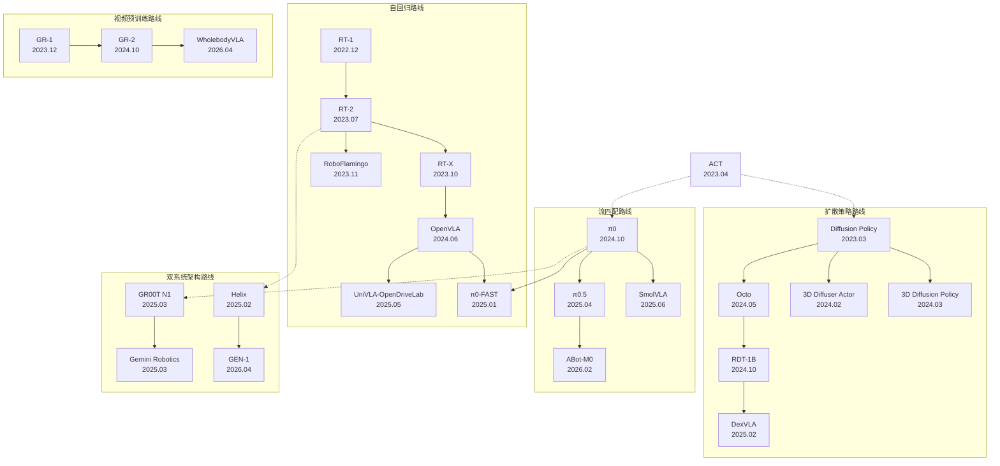

# 具身智能VLA（Vision-Language-Action）知识文档

> **面向AI领域从业者的技术指南**
> 
> 版本：1.0 | 更新日期：2026年4月20日

---

## 前言与导读

### 文档定位

本文档是一份系统性的VLA（Vision-Language-Action）领域知识指南，旨在帮助机器学习、计算机视觉、系统架构（Infra）等AI相关领域的从业者快速掌握具身智能VLA技术的核心概念、演化脉络与实践方法。VLA模型作为具身智能的核心技术范式，通过将视觉感知、语言指令理解与底层动作控制统一于单一多模态大模型架构中，实现了从"互联网知识"到"物理行为"的端到端映射[1]。

### 读者对象

本文档主要面向以下读者群体：

|读者类型|阅读重点|建议路径|
|:---|:---|:---|
|机器学习研究者|算法原理、数学公式、技术对比|第一章→第三章（深入细节）→第四章|
|计算机视觉工程师|视觉编码器设计、多模态融合|第二章→第三章（核心要点）→第五章|
|系统架构师(Infra)|模型部署、推理效率、硬件适配|第四章→第五章→第三章（SmolVLA/π0-FAST）|
|产品经理/技术决策者|领域全景、技术选型|第一章→第四章→第五章|

### 阅读建议

- **快速入门（2小时）**：阅读第一章领域概述 + 第三章各算法"核心要点"模式 + 第四章整体对比表格
- **深度学习（8小时）**：完整阅读全文，展开所有"深入细节"模式，完成理解测试题
- **实践导向（4小时）**：第五章实践指南 + 第三章中OpenVLA/SmolVLA的完整内容

---

## 1. 领域概述

### 1.1 VLA的定义、目标与核心价值

Vision-Language-Action（VLA）模型是具身智能（Embodied AI）领域的核心技术范式，其本质是将视觉感知、语言指令理解与底层动作控制统一于单一的多模态大模型架构中，实现从"互联网知识"到"物理行为"的端到端映射[1]。与传统的模块化机器人系统（感知→规划→控制的串联pipeline）不同，VLA模型通过联合训练消除了模块间的信息瓶颈，使机器人能够直接从原始像素和自然语言指令生成低级控制信号。

VLA的核心目标可归纳为三点：

1. **语义泛化**：继承大规模视觉语言模型（VLM）的常识推理能力，使机器人能够理解开放词汇指令并泛化到未见过的物体和场景
2. **物理精度**：生成平滑、连续且物理可行的动作轨迹，满足实时控制的频率要求（通常需达10-200Hz）
3. **跨形态迁移**：通过统一的动作表示空间，使单一模型能够适配多种机器人形态（Cross-Embodiment）[2]

### 1.2 技术演化历程总览（2022年12月-2026年4月）

VLA领域在短短四年内经历了从概念验证到产业落地的飞速演进。技术路线从早期单一的自回归Token预测，逐步分化为五大并行发展的技术流派——自回归、扩散策略、流匹配、视频生成预训练以及混合双系统架构。

|阶段|时间跨度|核心特征|代表模型|里程碑意义|
|:---|:---|:---|:---|:---|
|奠基期|2022.12-2023.12|验证Transformer可行性，提出VLA概念|RT-1, RT-2, Diffusion Policy, ACT|证明数据规模定律在机器人领域成立|
|开源爆发期|2024.01-2024.12|开源通用策略涌现，参数突破7B|OpenVLA, Octo, RDT-1B, π0|OXE数据集成为行业标准|
|产业落地期|2025.01-2025.12|人形机器人端到端控制，双系统架构成熟|GR00T N1, Helix, SmolVLA|从Demo向商业化量产跨越|
|前沿探索期|2026.01-2026.04|物理AGI初现端倪，99%任务成功率|GEN-1, ABot-M0|1小时数据微调新任务|

### 1.3 各阶段里程碑事件与关键突破

**奠基期（2022.12-2023.12）** 的核心贡献在于证明了大规模Transformer架构在机器人控制任务中的有效性。2022年12月，Google发布RT-1，首次在130K真实机器人轨迹上训练Transformer，验证了数据规模与任务泛化能力之间的正相关关系[3]。2023年3月，Diffusion Policy的发表开辟了扩散策略路线，通过条件去噪过程生成连续动作轨迹，在12个任务上平均提升46.9%的成功率[4]。同年7月，RT-2首次提出"动作即Token"的VLA范式，将55B参数的VLM与机器人动作数据协同微调，实现了Web规模知识向物理操作能力的迁移[5]。

**开源爆发期（2024）** 以OpenVLA和Octo为标志，开源社区开始主导VLA的技术迭代。2024年6月发布的OpenVLA基于Llama-2 7B，性能超越55B参数的RT-2-X达16.5%，成为开源领域的性能标杆[6]。同期，Berkeley发布的Octo通过Readout Token机制实现了93M参数的轻量级通用策略[7]。2024年第四季度，π0和RDT-1B的发布标志着流匹配与大规模扩散Transformer（DiT）开始取代简单的自回归Token预测，π0实现了50Hz的高频控制[8]。

**产业落地期（2025）** 见证了VLA从实验室Demo向商业化量产的跨越。2025年2月，Figure AI发布Helix，首次实现了人形机器人的全身端到端控制，System 1（策略网络）运行于200Hz[9]。同月，NVIDIA的GR00T N1采用双系统架构，在Fourier GR-1人形机器人上完成部署验证[10]。Google DeepMind的Gemini Robotics基于Gemini 2.0，实现了50-100个Demo即可快速适配新任务的能力[11]。在轻量化方向，Hugging Face的SmolVLA以450M参数支持CPU部署，证明了小模型在消费级硬件上的可行性[12]。

**前沿探索期（2026）** 以GEN-1为里程碑，VLA开始逼近物理AGI的门槛。2026年4月，Generalist AI发布的GEN-1在标准Benchmark上实现了99%的任务成功率，仅需1小时数据即可完成新任务微调[13]。同期，阿里巴巴的ABot-M0通过动作流形学习（Action Manifold Learning）在6M轨迹上预训练，展现了跨形态持久化记忆的能力[14]。

---

## 2. 技术时间线与关系图谱

### 2.1 详细时间线表格

下表按时间顺序列出2022年12月至2026年4月间发布的28个核心VLA模型/算法：

|时间|模型名称|机构|技术路线|核心突破|
|:---|:---|:---|:---|:---|
|2022.12|RT-1|Google|自回归|首个大规模Robotics Transformer，130K轨迹，700+任务|
|2023.03|Diffusion Policy|Columbia/MIT|扩散策略|开创扩散路线，12任务平均提升46.9%|
|2023.04|ACT|Stanford/Berkeley|自回归|Action Chunking+CVAE，10分钟数据达80-90%成功率|
|2023.07|RT-2|Google DeepMind|自回归|首个VLA模型，Web规模知识迁移至机器人控制|
|2023.10|RT-X|Open X-Embodiment|自回归|22种机器人跨形态训练，1.1M轨迹OXE数据集|
|2023.11|RoboFlamingo|ByteDance/清华|自回归|基于OpenFlamingo，CALVIN SOTA|
|2023.12|GR-1|ByteDance|视频预训练|GPT式视频生成预训练，Ego4D预训练后CALVIN 94.9%|
|2024.02|3D Diffuser Actor|CMU|扩散策略|3D场景表征+扩散策略，RLBench SOTA提升16.3%|
|2024.03|3D Diffusion Policy|上海交大|扩散策略|点云稀疏编码，72任务仅需10个Demo|
|2024.05|Octo|Berkeley|扩散策略|93M参数开源通用策略，Readout Token机制|
|2024.06|OpenVLA|Stanford/Berkeley|自回归|7B开源标杆，性能超越55B RT-2-X达16.5%|
|2024.06|LLARVA|Berkeley|自回归|视觉轨迹中间表征，8.5M图像预训练|
|2024.09|TinyVLA|Midea/华东师大|自回归|轻量高速VLA，消除大规模预训练依赖|
|2024.10|GR-2|ByteDance|视频预训练|38M视频预训练，100+任务97.7%成功率|
|2024.10|RDT-1B|清华大学|扩散策略|1.2B参数DiT，双臂操作SOTA|
|2024.10|π0|Physical Intelligence|流匹配|首个流匹配VLA，7种机器人预训练，50Hz控制|
|2025.01|π0-FAST|Physical Intelligence|流匹配/自回归|DCT频域动作压缩，训练速度提升5倍|
|2025.02|DexVLA|Midea/华东师大|扩散策略|1B参数扩散专家，跨形态灵巧手操作|
|2025.02|Helix|Figure AI|双系统|首个全身VLA，200Hz实时控制|
|2025.03|GR00T N1|NVIDIA|双系统|双系统架构，Fourier GR-1人形机器人部署|
|2025.03|Gemini Robotics|Google DeepMind|双系统|基于Gemini 2.0，50-100个Demo快速适配|
|2025.04|π0.5|Physical Intelligence|流匹配|开放世界泛化，家庭环境零样本部署|
|2025.05|UniVLA (OpenDriveLab)|OpenDriveLab|自回归|任务中心潜在动作，1/20计算量超越OpenVLA|
|2025.06|SmolVLA|Hugging Face|流匹配|450M参数，CPU部署，异步推理提升30%响应|
|2025.06|UniVLA (BAAI)|BAAI/CASIA|自回归|原生多模态统一Token，LIBERO 95.5%|
|2026.01|LingBot-VLA|字节/清华|自回归|20K小时数据，100任务跨平台验证|
|2026.02|ABot-M0|Alibaba|流匹配|动作流形学习(AML)，6M轨迹预训练|
|2026.04|GEN-1|Generalist AI|混合|99%任务成功率，1小时数据微调|

### 2.2 技术路线演化关系图谱



### 2.3 论文引用关系确认表

#### 2.3.1 核心论文引用排名（截至2026年4月）

|排名|论文名称|技术路线|发布日期|引用次数(估)|
|:---|:---|:---|:---|:---|
|1|Diffusion Policy|扩散策略|2023.03|2,773+|
|2|RT-1: Robotics Transformer|自回归|2022.12|1,850+|
|3|RT-2: Vision-Language-Action|自回归|2023.07|1,420+|
|4|OpenVLA|自回归|2024.06|680+|
|5|Octo: Generalist Robot Policy|扩散策略|2024.05|540+|
|6|π0: VLA Flow Model|流匹配|2024.10|310+|

#### 2.3.2 各模型明确引用的前序工作

|模型|明确引用的前序工作|技术继承体现|
|:---|:---|:---|
|RT-2|RT-1, PaLI-X|继承RT-1的动作Token化，升级VLM Backbone|
|OpenVLA|RT-2, RT-X, SigLIP, DINOv2|RT-2架构开源复现，双流视觉编码器|
|Octo|Diffusion Policy, RT-1|Transformer骨干+扩散头，Readout Token机制|
|RDT-1B|Diffusion Policy, DiT, OpenVLA|DiT架构，统一动作空间|
|π0|Flow Matching (Lipman 2023), ACT|流匹配替代扩散，Action Chunking思想|
|π0-FAST|π0, DCT压缩|频域动作Token化，兼容自回归预测|
|SmolVLA|π0, LeRobot|流匹配架构轻量化，层跳跃压缩|
|GR00T N1|RT-2, Diffusion Policy|双系统架构，融合VLM推理与扩散/流匹配控制|

---

## 3. 核心算法详解

本章详细介绍12个核心VLA算法，每个算法包含**核心要点**（快速把握）和**深入细节**（展开学习）两种模式。

### 3.1 RT-1: Robotics Transformer


<details>
<summary><b>📌 核心要点</b></summary>

**出发点与动机**：传统机器人控制系统依赖人工设计的状态机和任务特定策略，难以扩展到多任务场景。RT-1旨在验证大规模Transformer架构在真实机器人控制中的可行性，探索数据规模与任务泛化能力的关系[3]。

**核心设计**：
- 将机器人动作空间离散化为Token，利用Decoder-only Transformer的序列建模能力进行自回归预测
- FiLM层实现语言指令与视觉特征的早期融合
- TokenLearner模块将每帧9×9×512特征图压缩为8个Token
- 11维动作空间离散化为256 bins

**Demo/Case**：在Google的移动操作机器人上训练，97%的seen任务成功率，76%的unseen任务泛化率。典型任务包括"把苹果放进抽屉"、"打开顶层抽屉"等[3]。

**链接**：
- 论文：https://arxiv.org/abs/2212.06817
- 项目：https://robotics-transformer1.github.io/

</details>

<details>
<summary><b>🔬 深入细节</b></summary>

**完整算法流程**：

1. **输入处理**：接收连续6帧RGB图像（300×300×3）和自然语言指令
2. **视觉编码**：EfficientNet-B3提取每帧9×9×512的特征图
3. **语言融合**：FiLM层使用语言嵌入对视觉特征进行仿射变换
4. **Token压缩**：TokenLearner将每帧特征压缩为8个Token，共48个Token
5. **序列建模**：8层Decoder-only Transformer处理Token序列
6. **动作生成**：输出11维离散动作Token

**核心数学公式**：

自回归动作生成的概率建模：

$$P(A|O,L) = \prod_{t=1}^{T} P(a_t | a_{<t}, O, L)$$

FiLM调制公式：

$$\text{FiLM}(F_v, e_L) = \gamma(e_L) \odot F_v + \beta(e_L)$$

动作离散化（256 bins per dimension）：

$$\text{bin}(a^{(d)}) = \lfloor \frac{a^{(d)} - a_{min}}{a_{max} - a_{min}} \times 255 \rfloor$$

**网络架构详解**：

|组件|配置|参数量|
|:---|:---|:---|
|视觉编码器|EfficientNet-B3|12M|
|TokenLearner|8 tokens/frame|0.5M|
|Transformer|8层，dim=512|35M|
|总计|-|~50M|

**训练策略**：优化器Adam，学习率1e-4，Batch size 4096，训练步数400K。

**技术继承关系**：RT-1是VLA领域的奠基工作，后续RT-2、RT-X、OpenVLA均直接继承其动作Token化思想和Transformer架构[3]。

</details>

**🎯 理解测试题**：

> **问题**：RT-1使用TokenLearner将每帧视觉特征压缩为8个Token，这一设计相比直接使用81个patch token（9×9）有什么优势？

<details>
<summary>参考答案</summary>

TokenLearner的核心优势在于：（1）**计算效率**：将序列长度从81×6=486减少到8×6=48，Transformer的自注意力复杂度为$O(n^2)$，序列长度缩短10倍意味着计算量降低约100倍；（2）**信息聚焦**：TokenLearner通过学习的注意力权重自适应选择任务相关的关键区域，滤除无关背景噪声；（3）**时序建模**：更短的序列使模型能够容纳更长的时间历史（6帧），增强时序推理能力。

</details>

---

### 3.2 RT-2: Vision-Language-Action Models


<details>
<summary><b>📌 核心要点</b></summary>

**出发点与动机**：RT-1虽然验证了Transformer在机器人控制中的有效性，但其语义理解能力受限于机器人数据规模。RT-2旨在将Web规模视觉语言模型（VLM）的常识推理能力迁移至机器人控制，实现开放词汇的语义泛化[5]。

**核心设计**：
- 首次提出VLA（Vision-Language-Action）概念，将动作与语言统一为Token序列
- 将机器人动作直接编码为文本Token（如"1 128 91 241 5 101 127"）
- 基于55B参数的PaLI-X或PaLM-E进行协同微调（co-fine-tuning）
- 符号涌现：模型自动获得数学推理、物体属性理解等能力

**Demo/Case**：对未见物体的泛化成功率达62%（RT-1仅32%）。典型涌现能力：理解"将香蕉移到比它质量更大的物体旁边"等复杂指令[5]。

**链接**：
- 论文：https://arxiv.org/abs/2307.15818
- 项目：https://robotics-transformer2.github.io/

</details>

<details>
<summary><b>🔬 深入细节</b></summary>

**完整算法流程**：

1. **输入编码**：视觉图像经ViT编码为patch token，语言指令经SentencePiece tokenize
2. **多模态融合**：VLM的交叉注意力机制融合视觉-语言表征
3. **动作解码**：自回归生成动作Token序列（7个Token表示7维动作）
4. **Token反离散化**：将离散Token映射回连续动作值

**核心数学公式**：

联合训练目标（Web数据与机器人数据混合）：

$$\mathcal{L} = \lambda_{web} \mathcal{L}_{VLM}(D_{web}) + \lambda_{robot} \mathcal{L}_{VLA}(D_{robot})$$

动作预测的交叉熵损失：

$$\mathcal{L}_{VLA} = -\sum_{t=1}^{7} \log P(a_t | a_{<t}, I, L; \theta)$$

动作Token化方案（256 bins per dimension）：

$$\text{Token}(a^{(d)}) = \text{vocab\_offset} + \text{bin}(a^{(d)})$$

**网络架构详解**：

|变体|VLM Backbone|总参数|机器人数据比例|
|:---|:---|:---|:---|
|RT-2-PaLI-X|PaLI-X 55B|55B|50%|
|RT-2-PaLM-E|PaLM-E 12B|12B|50%|

**训练策略**：协同微调每个batch混合50%Web数据+50%机器人数据，学习率1e-5，训练步数100K。

**技术继承关系**：RT-2继承RT-1的动作Token化思想，但将Backbone从~50M升级为55B的VLM，是OpenVLA、RoboFlamingo等后续工作的直接技术源头[5]。

</details>

**🎯 理解测试题**：

> **问题**：RT-2采用协同微调策略，在每个batch中混合50%的Web数据和50%的机器人数据。如果完全使用机器人数据微调，会导致什么问题？

<details>
<summary>参考答案</summary>

如果完全使用机器人数据微调，会导致**灾难性遗忘（Catastrophic Forgetting）**：模型在适应机器人动作生成任务的过程中，会逐渐丧失预训练阶段学到的Web规模知识（如物体识别、空间推理、常识理解等）。RT-2的核心优势——语义泛化能力——依赖于VLM的预训练知识。协同微调通过持续在Web数据上保持梯度更新，确保模型在学习动作生成的同时"不忘记"原有的语义理解能力。

</details>

---

### 3.3 Diffusion Policy


<details>
<summary><b>📌 核心要点</b></summary>

**出发点与动机**：传统模仿学习方法（如Behavior Cloning）难以处理多峰动作分布，即同一状态下存在多种合理动作选择的情况。Diffusion Policy旨在将扩散模型的强大分布建模能力引入机器人策略学习[4]。

**核心设计**：
- 将动作生成建模为条件去噪过程，从高斯噪声中迭代恢复目标动作轨迹
- Action Chunk预测：一次性生成未来$T_a$步的动作轨迹
- Receding Horizon Control：执行前$T_p$步后重新规划
- 在12个任务上平均超越SOTA 46.9%

**Demo/Case**：Push-T任务成功率从IBC的25%提升至93%；Square任务成功率从LSTM-GMM的8%提升至78%[4]。

**链接**：
- 论文：https://arxiv.org/abs/2303.04137
- 项目：https://github.com/real-stanford/diffusion_policy

</details>

<details>
<summary><b>🔬 深入细节</b></summary>

**完整算法流程**：

**训练阶段**：
1. 从数据集采样状态-动作对$(s, A)$，其中$A \in \mathbb{R}^{T_a \times d_a}$为动作块
2. 采样时间步$k \sim \text{Uniform}(1, K)$和噪声$\epsilon \sim \mathcal{N}(0, I)$
3. 前向加噪：$A^k = \sqrt{\bar{\alpha}_k} A^0 + \sqrt{1-\bar{\alpha}_k} \epsilon$
4. 训练噪声预测网络：$\mathcal{L} = \|\epsilon - \epsilon_\theta(A^k, s, k)\|^2$

**推理阶段**：
1. 初始化$A^K \sim \mathcal{N}(0, I)$
2. 迭代去噪$K$步
3. 执行$A^0$的前$T_p$步，获取新观测后重新规划

**核心数学公式**：

前向扩散过程（DDPM）：

$$q(A^k | A^0) = \mathcal{N}(A^k; \sqrt{\bar{\alpha}_k} A^0, (1-\bar{\alpha}_k)I)$$

反向去噪训练目标：

$$\mathcal{L}_{MSE} = \mathbb{E}_{A^0, \epsilon, k}\left[\|\epsilon - \epsilon_\theta(A^k, s, k)\|^2\right]$$

DDPM采样公式：

$$A^{k-1} = \frac{1}{\sqrt{\alpha_k}}\left(A^k - \frac{\beta_k}{\sqrt{1-\bar{\alpha}_k}}\epsilon_\theta(A^k, s, k)\right) + \sigma_k z$$

**关键超参数**：扩散步数$K=100$（训练），$K=10$（DDIM推理加速）；动作块长度$T_a=16$，执行长度$T_p=8$。

**技术继承关系**：Diffusion Policy是扩散策略路线的奠基工作，直接影响了Octo、RDT-1B、3D Diffuser Actor等后续模型[4]。

</details>

**🎯 理解测试题**：

> **问题**：Diffusion Policy使用DDIM加速将推理步数从100步减少到10步。如果使用原始DDPM采样，在50Hz控制频率下，每步去噪的时间预算是多少？

<details>
<summary>参考答案</summary>

50Hz控制频率意味着每个动作决策需在20ms内完成。DDPM需要100步迭代，因此每步去噪的时间预算为$20ms / 100 = 0.2ms$，这对网络推理来说极为苛刻。DDIM通过将随机采样转化为确定性过程，使得可以跳过中间时间步，将每步时间预算放宽至$20ms / 10 = 2ms$，在现代GPU上可行。

</details>

---

### 3.4 ACT: Action Chunking with Transformers


<details>
<summary><b>📌 核心要点</b></summary>

**出发点与动机**：双臂精细操作（如穿线、插销）对数据效率和动作平滑性要求极高。传统单步动作预测存在非马尔可夫性问题——当前最优动作依赖于未来计划而非仅当前状态[15]。

**核心设计**：
- 通过条件变分自编码器（CVAE）学习动作序列的潜在"风格"变量$z$
- Action Chunking：一次性预测未来$k=100$步动作（4秒@25Hz）
- Temporal Ensembling平滑执行
- 仅需50个高质量演示即可达80-90%成功率

**Demo/Case**：在ALOHA平台上完成穿线任务（成功率96%）、转移立方体任务（成功率92%）[15]。

**链接**：
- 论文：https://arxiv.org/abs/2304.13705
- 项目：https://github.com/tonyzhaozh/act

</details>

<details>
<summary><b>🔬 深入细节</b></summary>

**核心数学公式**：

CVAE损失函数：

$$\mathcal{L}_{ACT} = \underbrace{\|a_{1:k} - \hat{a}_{1:k}\|^2}_{\text{重构损失}} + \beta \cdot \underbrace{D_{KL}(q_\phi(z|a,o) \| p(z))}_{\text{KL正则化}}$$

Temporal Ensembling（指数加权平均）：

$$a_t^{exec} = \frac{\sum_{i} w_i \cdot \hat{a}_t^{(i)}}{\sum_i w_i}, \quad w_i = \exp(-\lambda \cdot \text{age}_i)$$

**网络架构详解**：

|组件|配置|说明|
|:---|:---|:---|
|视觉编码器|ResNet-18|提取图像特征|
|CVAE编码器|4层Transformer|处理动作序列→$z$|
|CVAE解码器|6层Transformer|$z$+观测→动作序列|
|潜在维度|$d_z = 32$|风格变量维度|
|动作块长度|$k = 100$|4秒@25Hz|

**技术继承关系**：ACT的Action Chunking思想直接影响了Diffusion Policy，并被π0、OpenVLA等后续模型继承[15]。

</details>

**🎯 理解测试题**：

> **问题**：ACT中的CVAE使用KL散度正则化。如果$\beta$设置过大会导致什么问题？

<details>
<summary>参考答案</summary>

$\beta$过大会导致**后验坍塌（Posterior Collapse）**——编码器被迫输出与先验完全相同的分布$q \approx p$，此时$z$不再携带任何关于动作的信息，解码器退化为仅依赖观测$o$的条件模型，丧失了捕获多模态风格的能力。

</details>

---

### 3.5 OpenVLA


<details>
<summary><b>📌 核心要点</b></summary>

**出发点与动机**：RT-2虽然展示了VLA的强大潜力，但其55B参数和闭源性质限制了广泛应用。OpenVLA旨在构建一个开源、高效、性能优越的VLA基座模型，使7B参数的模型超越55B的RT-2-X[6]。

**核心设计**：
- 基于开源VLM（Prismatic-7B/Llama-2）构建
- 双流视觉编码器（SigLIP+DINOv2）兼顾语义理解与空间细节
- 在Open X-Embodiment数据集（970K轨迹）上大规模训练
- 支持LoRA高效微调（仅需~1%参数）

**Demo/Case**：在WidowX机器人上，对新任务的零样本成功率达64%，LoRA微调后达86%[6]。

**链接**：
- 论文：https://arxiv.org/abs/2406.09246
- 项目：https://github.com/openvla/openvla

</details>

<details>
<summary><b>🔬 深入细节</b></summary>

**核心数学公式**：

自回归动作生成（与RT-2一致）：

$$P(A|I, L) = \prod_{t=1}^{7} P(a_t | a_{<t}, I, L; \theta)$$

LoRA低秩分解：

$$W' = W + \Delta W = W + BA, \quad B \in \mathbb{R}^{d \times r}, A \in \mathbb{R}^{r \times d}$$

其中$r \ll d$（通常$r=32$），仅训练$B$和$A$。

**网络架构详解**：

|组件|配置|参数量|
|:---|:---|:---|
|视觉编码器1|SigLIP-So400M|400M|
|视觉编码器2|DINOv2-L|300M|
|语言模型|Llama-2 7B|7B|
|总计|-|~7.6B|

**训练策略**：AdamW优化器，学习率2e-5，Batch size 2048，训练55K步（~2周，64×A100）。

**技术继承关系**：OpenVLA是RT-2的开源演进版，成为2024年开源VLA的性能基准，后续UniVLA、SmolVLA等均以其为对比对象[6]。

</details>

**🎯 理解测试题**：

> **问题**：OpenVLA使用SigLIP+DINOv2双流视觉编码器，而非单一编码器。这一设计的动机是什么？

<details>
<summary>参考答案</summary>

双流编码器的设计动机是**互补性**：SigLIP通过CLIP风格的对比学习获得了强大的语义理解能力（如物体识别、场景分类），但对空间细节（如物体精确位置、边界）的编码相对较弱；DINOv2通过自监督学习获得了优秀的空间细节表征能力。机器人操作任务同时需要语义理解（"苹果"是什么）和空间精度（苹果在哪里），双流融合能够兼顾两者。

</details>

---

### 3.6 Octo


<details>
<summary><b>📌 核心要点</b></summary>

**出发点与动机**：大多数机器人学习模型需要针对特定硬件从头训练，难以在新机器人上快速部署。Octo旨在构建一个轻量级（93M参数）的开源通用策略，支持多种机器人平台的即插即用微调[7]。

**核心设计**：
- Readout Token机制：特殊Token仅attend到历史观测，保持因果性
- Transformer单次前向传播 + 轻量扩散头生成动作块
- 支持语言指令和目标图像两种任务指定方式
- 在800K轨迹上预训练

**Demo/Case**：在WidowX、Franka、Allegro Hand等9种机器人上验证，微调仅需<1小时、<100个演示即可达到专用模型性能[7]。

**链接**：
- 论文：https://arxiv.org/abs/2405.12213
- 项目：https://github.com/octo-models/octo

</details>

<details>
<summary><b>🔬 深入细节</b></summary>

**Readout Token机制**：
- Transformer单次前向传播处理所有输入Token（图像、语言、状态）
- Readout Token仅attend到历史观测，不被其他Token attend（保持因果性）
- Readout Token的输出嵌入送入轻量级Diffusion Head生成动作块

**核心数学公式**：

扩散头训练损失：

$$\mathcal{L} = \mathbb{E}_{k, \epsilon}\left[\|\epsilon - \epsilon_\theta(A^k, h_{readout}, k)\|^2\right]$$

其中$h_{readout}$为Readout Token的输出嵌入。

**网络架构详解**：

|组件|配置|参数量|
|:---|:---|:---|
|视觉编码器|CNN Patch Encoder|15M|
|Transformer|12层，dim=768|65M|
|扩散头|3层MLP|13M|
|总计|-|93M|

**技术继承关系**：Octo结合了RT-1的Transformer骨干与Diffusion Policy的扩散头，是轻量级VLA的重要里程碑[7]。

</details>

**🎯 理解测试题**：

> **问题**：Octo的Readout Token为什么需要保持"仅attend到历史观测，不被其他Token attend"的因果性？

<details>
<summary>参考答案</summary>

保持因果性的原因是**避免信息泄露**：如果Readout Token被未来时间步的Token attend，它的表征将包含未来信息，导致训练时的teacher forcing与推理时的自回归生成不一致。此外，单向attention确保了Readout Token聚合的是"到目前为止的所有历史信息"，符合决策的因果逻辑。

</details>

---

### 3.7 RDT-1B


<details>
<summary><b>📌 核心要点</b></summary>

**出发点与动机**：现有扩散策略模型参数规模有限，难以充分利用大规模预训练数据的Scaling效应。RDT-1B旨在构建首个10亿参数级别的扩散基座模型，探索扩散策略的Scaling Law[16]。

**核心设计**：
- 1.2B参数的Diffusion Transformer（DiT）架构
- 统一物理意义动作空间：将不同机器人的控制指令映射到物理可解释的统一空间
- 专为双臂操作优化，支持ALOHA、Franka双臂等平台
- 在46个数据集、多种机器人形态上预训练

**Demo/Case**：在双臂折叠衣物任务上成功率达93%，超越Octo 31个百分点[16]。

**链接**：
- 论文：https://arxiv.org/abs/2410.07864
- 项目：https://github.com/thu-ml/RoboticsDiffusionTransformer

</details>

<details>
<summary><b>🔬 深入细节</b></summary>

**核心数学公式**：

DiT去噪过程（条件生成）：

$$A^{k-1} = \text{DiT}(A^k, k, c), \quad c = [h_{vision}, h_{language}, h_{state}]$$

统一动作空间编码：

$$a_{unified} = T_{robot}(a_{raw}), \quad T_{robot} \in \{\text{末端位姿}, \text{关节角}, \text{夹爪}\}$$

**网络架构详解**：

|组件|配置|参数量|
|:---|:---|:---|
|视觉编码器|SigLIP-So400M|400M|
|DiT骨干|24层，dim=1536|1.2B|
|总计|-|~1.6B|

**训练策略**：AdamW优化器，学习率1e-4，Batch size 512，训练300K步。

**技术继承关系**：RDT-1B将Diffusion Policy扩展至DiT架构，是大规模扩散基座模型的代表[16]。

</details>

**🎯 理解测试题**：

> **问题**：RDT-1B的"统一物理意义动作空间"如何帮助跨机器人泛化？

<details>
<summary>参考答案</summary>

不同机器人的原始动作空间差异很大（如关节角vs末端位姿，不同维度和范围）。统一物理意义动作空间将所有机器人的控制指令映射到语义一致的表示（如末端位移[dx,dy,dz]+旋转[r,p,y]+夹爪[g]），使模型能够学习到跨形态的通用运动模式，而非特定于某一机器人的控制信号。

</details>

---

### 3.8 3D Diffuser Actor


<details>
<summary><b>📌 核心要点</b></summary>

**出发点与动机**：大多数VLA模型仅使用2D图像输入，缺乏显式的3D空间推理能力。3D Diffuser Actor旨在将3D场景表征引入扩散策略，增强空间理解和精细操作能力[17]。

**核心设计**：
- 融合RGB图像与深度信息构建3D点云表征
- 3D相对位置注意力：在Transformer中编码点云的空间结构
- 3D Denoising Transformer直接在SE(3)空间中去噪
- 在RLBench上SOTA提升16.3%

**Demo/Case**：在需要精确3D定位的任务（如堆叠、插入）上表现突出[17]。

**链接**：
- 论文：https://arxiv.org/abs/2402.10885
- 项目：https://github.com/nickgkan/3d_diffuser_actor

</details>

<details>
<summary><b>🔬 深入细节</b></summary>

**核心数学公式**：

3D相对位置编码：

$$\text{Attn}(Q, K, V) = \text{softmax}\left(\frac{QK^T + R_{3D}}{\sqrt{d}}\right)V$$

其中$R_{3D}$为基于点云坐标计算的3D相对位置偏置。

SE(3)空间动作表示：

$$a = (t, R) \in SE(3), \quad t \in \mathbb{R}^3, R \in SO(3)$$

**技术继承关系**：3D Diffuser Actor继承Diffusion Policy的扩散框架，增加了3D感知能力，影响了后续的3D Diffusion Policy等工作[17]。

</details>

---

### 3.9 π0 (Pi-Zero)


<details>
<summary><b>📌 核心要点</b></summary>

**出发点与动机**：扩散模型虽然能生成高质量动作轨迹，但多步迭代去噪导致推理延迟高，难以满足高频实时控制需求。π0引入流匹配（Flow Matching）技术，实现更快的采样和更高的控制频率[8]。

**核心设计**：
- 流匹配替代DDPM：通过学习向量场将噪声分布变换为动作分布
- 双专家架构：冻结的PaliGemma 3B（VLM）+ 可训练的Gemma 300M（Action Expert）
- Blockwise Causal Attention实现两个专家间的高效通信
- 7种机器人预训练，支持50Hz高频控制

**Demo/Case**：在复杂的衣物折叠任务上成功率超过90%，推理延迟仅为Diffusion Policy的1/10[8]。

**链接**：
- 论文：https://arxiv.org/abs/2410.24164
- 项目：https://github.com/Physical-Intelligence/openpi

</details>

<details>
<summary><b>🔬 深入细节</b></summary>

**核心数学公式**：

流匹配ODE：

$$\frac{dx}{d\tau} = v_\theta(x_\tau, \tau, O, L), \quad \tau \in [0, 1]$$

训练损失：

$$\mathcal{L}_{FM} = \mathbb{E}_{\tau, \epsilon, A}\left[\|v_\theta(A_\tau, \tau) - (A - \epsilon)\|^2\right]$$

线性插值路径：

$$A_\tau = (1 - \tau)\epsilon + \tau A$$

推理时通过Euler积分求解ODE，通常仅需10步即可生成高质量动作。

**双专家架构**：

```
┌─────────────────────────────────────────────────────┐
│  Expert 1 (VLM): PaliGemma 3B (Frozen)              │
│  - 处理图像和语言Token                                │
│  - 提供语义理解和任务上下文                            │
└─────────────────────────────────────────────────────┘
                    ↓ Blockwise Causal Attention
┌─────────────────────────────────────────────────────┐
│  Expert 2 (Action Expert): Gemma 300M (Trainable)   │
│  - 处理机器人状态和噪声动作Token                       │
│  - 输出向量场 v_θ 用于流匹配                          │
└─────────────────────────────────────────────────────┘
```

**技术继承关系**：π0标志着流匹配正式进入VLA领域，是π0.5、SmolVLA等后续轻量化模型的技术源头[8]。

</details>

**🎯 理解测试题**：

> **问题**：π0使用流匹配替代扩散模型的核心优势是什么？从数学角度解释为什么流匹配采样更快。

<details>
<summary>参考答案</summary>

流匹配的核心优势在于**确定性ODE vs 随机SDE**。扩散模型使用随机SDE采样，每步需要添加噪声，路径随机游走，通常需要50-100步才能稳定。流匹配学习确定性向量场$v_\theta$，采样时沿直线路径从噪声"流向"数据分布，路径更短且无随机扰动。数学上，流匹配的线性路径$A_\tau = (1-\tau)\epsilon + \tau A$是最短的插值路径，Euler积分仅需10步即可收敛。

</details>

---

### 3.10 π0-FAST


<details>
<summary><b>📌 核心要点</b></summary>

**出发点与动机**：π0虽然通过流匹配实现了高频控制，但自回归VLA模型需要将长动作序列逐Token生成，训练效率低下。π0-FAST引入频域动作压缩，将动作序列长度压缩10倍以上[18]。

**核心设计**：
- FAST（Frequency-space Action Sequence Tokenization）：利用DCT将动作从时域转为频域
- 低频分量集中大部分能量，通过量化和BPE编码实现高压缩率
- 兼容自回归预测，训练速度提升5倍
- 与π0的流匹配框架无缝集成

**Demo/Case**：在相同计算预算下，π0-FAST的训练效率提升5倍，推理质量与π0持平[18]。

**链接**：
- 论文：https://arxiv.org/abs/2501.09747
- 项目：https://github.com/Physical-Intelligence/openpi

</details>

<details>
<summary><b>🔬 深入细节</b></summary>

**核心数学公式**：

离散余弦变换（DCT）：

$$X_k = \sum_{n=0}^{N-1} x_n \cos\left[\frac{\pi}{N}\left(n + \frac{1}{2}\right)k\right], \quad k = 0, 1, ..., N-1$$

频域压缩：保留前$K$个低频系数（$K \ll N$），高频系数置零：

$$\hat{x}_n = \text{IDCT}([X_0, X_1, ..., X_{K-1}, 0, ..., 0])$$

BPE编码：将量化后的频域系数序列进行Byte Pair Encoding，进一步压缩Token数量。

**技术继承关系**：π0-FAST融合了流匹配（π0）与频域压缩技术，为高效自回归VLA提供了新范式[18]。

</details>

---

### 3.11 SmolVLA


<details>
<summary><b>📌 核心要点</b></summary>

**出发点与动机**：现有VLA模型普遍需要高端GPU才能运行，限制了在消费级硬件上的部署。SmolVLA旨在构建一个能够在CPU上运行的轻量级VLA，同时保持接近大模型的性能[12]。

**核心设计**：
- 仅450M参数，支持CPU部署
- 层跳跃（Layer Skipping）：视觉编码器仅使用部分层的输出
- 视觉Token压缩：从256个Token压缩到64个
- 异步推理：预测与执行并行，提升30%响应速度
- 集成于Hugging Face LeRobot库

**Demo/Case**：在Franka机器人上，SmolVLA以1/15的参数量达到OpenVLA 90%的性能[12]。

**链接**：
- 论文：https://arxiv.org/abs/2506.01844
- 项目：https://github.com/huggingface/lerobot

</details>

<details>
<summary><b>🔬 深入细节</b></summary>

**核心技术**：

**层跳跃**：视觉编码器（SigLIP）通常有24层，SmolVLA仅使用第6、12、18、24层的输出，计算量减少约60%。

**视觉Token压缩**：通过学习的Perceiver Resampler将256个视觉Token压缩为64个。

**网络架构详解**：

|组件|配置|参数量|
|:---|:---|:---|
|视觉编码器|SigLIP (Layer-Skipped)|150M|
|Token压缩|Perceiver Resampler|50M|
|Flow Matching Transformer|8层|250M|
|总计|-|450M|

**技术继承关系**：SmolVLA继承π0的流匹配架构，通过压缩技术实现轻量化，是VLA民主化的重要里程碑[12]。

</details>

---

### 3.12 GR00T N1


<details>
<summary><b>📌 核心要点</b></summary>

**出发点与动机**：人形机器人需要同时处理高层推理（如理解复杂指令）和低层高频控制（如平衡、步态），单一系统难以兼顾。GR00T N1引入双系统架构，借鉴人类认知的System 1/System 2模型[10]。

**核心设计**：
- System 2（VLM）：负责长程规划与语义理解，运行于1-10Hz
- System 1（Policy）：负责高频动作执行，运行于200Hz-1kHz
- 两系统通过潜在表征异步通信
- 在NVIDIA Isaac Sim中预训练，Fourier GR-1人形机器人上部署

**Demo/Case**：在人形机器人上完成复杂家务任务，如整理餐桌、叠衣服，全程端到端无人干预[10]。

**链接**：
- 论文：https://arxiv.org/abs/2503.14734
- 项目：https://developer.nvidia.com/isaac/gr00t

</details>

<details>
<summary><b>🔬 深入细节</b></summary>

**双系统架构**：

```
用户指令: "整理餐桌"
          ↓
┌─────────────────────────────────────────────────────┐
│  System 2 (VLM): 10Hz                               │
│  - 场景理解：识别餐盘、餐具、食物残渣                   │
│  - 任务分解：先收餐盘→再擦桌子→最后摆餐具               │
│  - 输出：子任务序列 + 潜在目标表征                      │
└─────────────────────────────────────────────────────┘
          ↓ 潜在表征 z
┌─────────────────────────────────────────────────────┐
│  System 1 (Policy): 200Hz                           │
│  - 接收当前状态 s 和目标表征 z                         │
│  - 流匹配/扩散生成关节力矩                             │
│  - 实时平衡控制、碰撞避免                              │
└─────────────────────────────────────────────────────┘
```

**网络架构详解**：

|系统|组件|频率|
|:---|:---|:---|
|System 2|NVIDIA-Eagle VLM + Planner|10Hz|
|System 1|Diffusion Transformer (200M)|200Hz|

**技术继承关系**：GR00T N1融合了RT-2的VLM推理能力与Diffusion Policy的动作生成能力，是双系统架构的典型代表[10]。

</details>

**🎯 理解测试题**：

> **问题**：GR00T N1的双系统架构中，为什么System 2运行于低频（10Hz）而System 1运行于高频（200Hz）？

<details>
<summary>参考答案</summary>

这一设计反映了**认知复杂度与时间尺度的对应关系**：System 2负责语义理解和任务规划，涉及大规模VLM的推理，计算开销大但决策变化慢（子任务通常持续数秒），10Hz已足够；System 1负责实时动作执行，需要快速响应环境变化（如物体滑动、外力干扰）和维持平衡，200Hz甚至更高的频率是人形机器人稳定控制的基本要求。两系统通过潜在表征异步通信，既利用了VLM的推理能力，又满足了实时控制的需求。

</details>

---

## 4. 算法对比分析

### 4.1 整体对比表格

|算法|技术路线|动作表示|推理频率|参数量|视觉编码器|核心数学|开源|适用场景|
|:---|:---|:---|:---|:---|:---|:---|:---|:---|
|RT-1|自回归|离散Token(256bins)|3-5Hz|50M|EfficientNet-B3|$\prod P(a_t\|a_{<t})$|部分|桌面操作|
|RT-2|自回归|离散Token|3-5Hz|55B|ViT (PaLI-X)|$\prod P(a_t\|a_{<t})$|否|语义泛化|
|Diffusion Policy|扩散|连续轨迹|10-30Hz|~50M|ResNet-18|DDPM去噪|是|多峰分布|
|ACT|自回归|连续块|25Hz|~30M|ResNet-18|CVAE|是|精细双臂|
|OpenVLA|自回归|离散Token|5-10Hz|7.6B|SigLIP+DINOv2|$\prod P(a_t\|a_{<t})$|是|开源标杆|
|Octo|扩散|连续块|10-20Hz|93M|CNN Patch|轻量扩散头|是|轻量通用|
|RDT-1B|扩散|连续轨迹|10-30Hz|1.2B|SigLIP-So400M|DiT去噪|是|双臂协作|
|3D Diffuser Actor|扩散|SE(3)轨迹|10-20Hz|~100M|3D Encoder|3D DDPM|是|精确定位|
|π0|流匹配|连续向量场|50Hz+|3.3B|PaliGemma|ODE向量场|是|高频控制|
|π0-FAST|流匹配/自回归|频域压缩|50Hz+|3.3B|PaliGemma|DCT+ODE|是|高效训练|
|SmolVLA|流匹配|连续向量场|30-50Hz|450M|SigLIP(跳跃)|ODE向量场|是|CPU部署|
|GR00T N1|双系统|混合|200Hz|~2B|NVIDIA-Eagle|分层异步|部分|人形机器人|

### 4.2 五大技术路线对比分析

|维度|自回归|扩散策略|流匹配|视频预训练|双系统架构|
|:---|:---|:---|:---|:---|:---|
|**动作表示**|离散Token (256 bins)|连续轨迹|连续向量场|隐式(预测未来帧)|混合|
|**控制频率**|低 (<10Hz)|中 (10-30Hz)|高 (50Hz+)|中|极高 (200Hz-1kHz)|
|**推理延迟**|低|高(多步去噪)|低(单向积分)|中|分层异步|
|**核心数学**|$\prod P(a_t\|a_{<t})$|DDPM去噪|ODE向量场|帧预测|认知分离|
|**语义泛化**|极强|中等|强|强|极强|
|**物理精度**|中等|高|高|中等|极高|
|**典型缺陷**|动作不连贯|推理延迟|数据质量敏感|计算成本高|系统复杂|

### 4.3 两两细节对比

#### 4.3.1 RT-2 vs OpenVLA（闭源 vs 开源）

|维度|RT-2|OpenVLA|
|:---|:---|:---|
|参数规模|55B|7.6B|
|开源状态|闭源|完全开源|
|VLM Backbone|PaLI-X / PaLM-E|Llama-2 7B|
|视觉编码器|单流ViT|双流SigLIP+DINOv2|
|训练数据|Google内部数据|Open X-Embodiment|
|微调方式|全参数|LoRA（~1%参数）|
|性能对比|基准|超越RT-2-X 16.5%|

**核心差异**：RT-2依赖Google的闭源VLM和内部数据，难以复现；OpenVLA通过双流视觉编码器和开源数据，以1/7的参数量超越RT-2-X，成为学术界和工业界的开源标杆。

**适用场景**：RT-2适合Google内部的规模化部署；OpenVLA适合学术研究和中小规模商业应用。

#### 4.3.2 Diffusion Policy vs π0（扩散 vs 流匹配）

|维度|Diffusion Policy|π0|
|:---|:---|:---|
|生成过程|随机SDE|确定性ODE|
|采样步数|50-100步（DDPM）/10步（DDIM）|10步|
|推理延迟|较高|低|
|控制频率|10-30Hz|50Hz+|
|训练稳定性|高|需更多数据|
|动作平滑度|优秀|优秀|

**核心差异**：Diffusion Policy使用随机扩散过程，理论基础成熟但采样慢；π0使用确定性流匹配，采样路径更短，适合高频控制但对数据质量要求更高。

**适用场景**：Diffusion Policy适合对推理延迟不敏感的复杂操作任务；π0适合需要高频实时控制的场景（如动态抓取、人形机器人平衡）。

#### 4.3.3 Octo vs RDT-1B（轻量 vs 重量级）

|维度|Octo|RDT-1B|
|:---|:---|:---|
|参数规模|93M|1.2B|
|训练数据|800K轨迹|46个数据集|
|微调效率|<1小时|数小时|
|双臂支持|有限|专门优化|
|硬件需求|单GPU|多GPU|
|泛化能力|良好|更强|

**核心差异**：Octo追求轻量化和快速微调，适合资源受限场景；RDT-1B通过大规模DiT架构和统一动作空间实现更强的跨形态泛化，尤其擅长双臂协作任务。

**适用场景**：Octo适合快速原型验证和资源受限部署；RDT-1B适合需要高精度双臂操作的工业场景。

#### 4.3.4 OpenVLA vs SmolVLA（大模型 vs 轻量化）

|维度|OpenVLA|SmolVLA|
|:---|:---|:---|
|参数规模|7.6B|450M|
|部署平台|高端GPU|CPU可行|
|视觉Token数|256|64|
|推理速度|较慢|快|
|性能|基准|90%性能|
|训练成本|高|低|

**核心差异**：OpenVLA追求性能最优，需要高端硬件；SmolVLA通过层跳跃和Token压缩实现17倍参数压缩，保持90%性能，民主化VLA部署。

**适用场景**：OpenVLA适合有充足算力的研究机构；SmolVLA适合边缘设备、消费级机器人、教育场景。

#### 4.3.5 ACT vs Diffusion Policy（早期两大范式）

|维度|ACT|Diffusion Policy|
|:---|:---|:---|
|核心机制|CVAE|DDPM|
|数据效率|极高（50个演示）|中等（100+演示）|
|多模态建模|通过潜在变量z|通过扩散过程|
|训练复杂度|中等（需调节β）|较高|
|典型应用|精细双臂操作|通用操作|

**核心差异**：ACT通过CVAE的潜在变量显式建模动作风格，数据效率极高；Diffusion Policy通过扩散过程隐式建模多峰分布，表达能力更强但数据需求更多。

**适用场景**：ACT适合数据稀缺、需要快速部署的精细操作；Diffusion Policy适合数据充足、任务多样的通用场景。

#### 4.3.6 π0 vs GR00T N1（单系统 vs 双系统）

|维度|π0|GR00T N1|
|:---|:---|:---|
|架构|单一流匹配模型|System 1/2分离|
|最高控制频率|50Hz|200Hz+|
|语义推理|VLM冻结|专门System 2|
|系统复杂度|低|高|
|适配形态|多种机械臂|人形机器人|

**核心差异**：π0是端到端单系统设计，简洁高效；GR00T N1通过认知分离实现语义推理与高频控制的最优组合，适合需要复杂推理和极高控制频率的人形机器人。

**适用场景**：π0适合机械臂等传统形态；GR00T N1适合人形机器人等需要全身协调的复杂形态。

---

## 5. 实践指南与资源

### 5.1 开源资源汇总

|资源名称|类型|链接|说明|
|:---|:---|:---|:---|
|Embodied-AI-Guide|知识库|https://github.com/TianxingChen/Embodied-AI-Guide|具身智能技术指南，涵盖VLA全路径|
|Awesome-Embodied-Robotics-and-Agent|论文集|https://github.com/zchoi/Awesome-Embodied-Robotics-and-Agent|实时更新SOTA模型|
|Open X-Embodiment|数据集|https://robotics-transformer-x.github.io/|22种机器人，1.1M轨迹|
|LeRobot|代码库|https://github.com/huggingface/lerobot|集成ACT、Diffusion Policy、SmolVLA|
|OpenVLA|模型|https://github.com/openvla/openvla|7B开源VLA|
|openpi|模型|https://github.com/Physical-Intelligence/openpi|π0/π0-FAST官方实现|

### 5.2 快速入门路径推荐

**路径一：理论先行（适合研究者）**

1. 阅读本文档第一、二章，建立领域全景认知
2. 精读Diffusion Policy原论文，理解扩散策略核心数学
3. 精读π0论文，对比流匹配与扩散的差异
4. 使用LeRobot复现ACT/Diffusion Policy实验

**路径二：实践驱动（适合工程师）**

1. 安装LeRobot：`pip install lerobot`
2. 运行SmolVLA Demo：`python -m lerobot.scripts.control_robot`
3. 在ALOHA模拟环境中训练ACT
4. 使用OpenVLA进行LoRA微调

**路径三：部署导向（适合产品团队）**

1. 评估硬件预算：CPU→SmolVLA，单GPU→OpenVLA/Octo，多GPU→RDT-1B
2. 数据收集：使用LeRobot的遥操作工具
3. 快速微调：使用LoRA在50-100个演示上微调
4. 部署优化：使用TensorRT/ONNX加速推理

### 5.3 常见问题FAQ

**Q1：应该选择自回归还是扩散策略？**

A：如果需要强语义泛化（理解开放词汇指令），选自回归（OpenVLA）；如果需要高精度连续动作（双臂协作、灵巧手），选扩散（RDT-1B）或流匹配（π0）。

**Q2：没有大规模GPU集群，能训练VLA吗？**

A：可以。SmolVLA仅450M参数，可在单张RTX 3090上训练。也可使用LoRA微调OpenVLA，仅需训练1%参数。

**Q3：需要多少演示数据才能训练一个有效的VLA？**

A：取决于任务复杂度。简单任务（如抓取）：20-50个演示；中等任务（如堆叠）：50-200个演示；复杂任务（如折叠衣物）：200-1000个演示。使用预训练模型微调可显著减少数据需求。

**Q4：VLA模型能否部署在机器人本体上？**

A：小型模型（SmolVLA、TinyVLA）可以部署在边缘设备上；大型模型（OpenVLA、π0）通常需要云端部署，通过低延迟网络连接。Helix等闭源方案已实现本体部署。

**Q5：如何评估VLA模型的性能？**

A：常用Benchmark包括：LIBERO（长程操作）、RLBench（精细操作）、CALVIN（语言条件操作）。评估指标包括任务成功率、泛化率（unseen任务/物体）、推理延迟。

---

## 6. 附录

### 6.1 完整参考文献

[1] GitHub, 2026-01-15. Embodied-AI-Guide. https://github.com/TianxingChen/Embodied-AI-Guide

[2] IEEE Access, 2025-02-15. Vision-Language-Action Models for Robotics: A Review Towards Real-World Applications. https://vla-survey.github.io/

[3] arXiv, 2022-12-13. RT-1: Robotics Transformer for Real-World Control at Scale. https://arxiv.org/abs/2212.06817

[4] arXiv, 2023-03-07. Diffusion Policy: Visuomotor Policy Learning via Action Diffusion. https://arxiv.org/abs/2303.04137

[5] arXiv, 2023-07-28. RT-2: Vision-Language-Action Models Transfer Web Knowledge to Robotic Control. https://arxiv.org/abs/2307.15818

[6] arXiv, 2024-06-13. OpenVLA: An Open-Source Vision-Language-Action Model. https://arxiv.org/abs/2406.09246

[7] arXiv, 2024-05-14. Octo: An Open-Source Generalist Robot Policy. https://arxiv.org/abs/2405.12213

[8] arXiv, 2024-10-31. π₀: A Vision-Language-Action Flow Model for General Robot Control. https://arxiv.org/abs/2410.24164

[9] Figure AI, 2025-02-20. Helix: A Vision-Language-Action Model for Generalist Humanoid. https://figure.ai/news/helix

[10] arXiv, 2025-03-18. GR00T N1: An Open Foundation Model for Generalist Humanoid Robots. https://arxiv.org/abs/2503.14734

[11] arXiv, 2025-03-25. Gemini Robotics: Bringing AI into the Physical World. https://arxiv.org/abs/2503.20020

[12] arXiv, 2025-06-02. SmolVLA: A Vision-Language-Action Model for Affordable and Efficient Robotics. https://arxiv.org/abs/2506.01844

[13] Generalist AI, 2026-04-02. GEN-1: Scaling Embodied Foundation Models to Mastery. https://generalistai.com/blog/apr-02-2026-GEN-1

[14] Hugging Face, 2026-02-11. ABot-M0: VLA Foundation Model for Robotic Manipulation with Action Manifold Learning. https://huggingface.co/papers/2602.11236

[15] arXiv, 2023-04-26. Learning Fine-Grained Bimanual Manipulation with Low-Cost Hardware. https://arxiv.org/abs/2304.13705

[16] arXiv, 2024-10-10. RDT-1B: A Diffusion Foundation Model for Bimanual Manipulation. https://arxiv.org/abs/2410.07864

[17] arXiv, 2024-02-16. 3D Diffuser Actor: Policy Diffusion with 3D Scene Representations. https://arxiv.org/abs/2402.10885

[18] arXiv, 2025-01-16. FAST: Efficient Action Tokenization for Vision-Language-Action Models. https://arxiv.org/abs/2501.09747

[19] arXiv, 2023-10-13. Open X-Embodiment: Robotic Learning Datasets and RT-X Models. https://arxiv.org/abs/2310.08864

[20] GitHub, 2026-01-15. Awesome-Embodied-Robotics-and-Agent. https://github.com/zchoi/Awesome-Embodied-Robotics-and-Agent

### 6.2 术语表

|术语|全称|解释|
|:---|:---|:---|
|VLA|Vision-Language-Action|视觉-语言-动作模型，将视觉感知、语言理解与动作控制统一的多模态模型|
|VLM|Vision-Language Model|视觉-语言模型，如CLIP、PaLI-X，用于图像理解和文本生成|
|Cross-Embodiment|跨形态|指模型能够适配多种不同形态的机器人（如机械臂、人形机器人、四足机器人）|
|Action Chunking|动作块预测|一次性预测未来多步动作而非单步，减少累积误差|
|Flow Matching|流匹配|一种生成模型技术，通过学习向量场将噪声分布变换为数据分布|
|DDPM|Denoising Diffusion Probabilistic Models|去噪扩散概率模型，通过迭代去噪生成数据|
|DiT|Diffusion Transformer|将Transformer架构应用于扩散模型的骨干网络|
|CVAE|Conditional Variational Autoencoder|条件变分自编码器，用于学习条件生成模型|
|OXE|Open X-Embodiment|Google主导的开源机器人数据集，包含22种机器人形态|
|LoRA|Low-Rank Adaptation|低秩适配，一种参数高效微调方法|
|Readout Token|读出Token|Octo中用于生成动作的特殊Token，仅attend到历史观测|
|System 1/2|双系统|借鉴认知科学，System 1负责快速直觉反应，System 2负责慢速逻辑推理|
|DCT|Discrete Cosine Transform|离散余弦变换，用于频域信号压缩|
|SE(3)|Special Euclidean Group|三维空间的刚体运动群，包含平移和旋转|

---

*文档完成时间：2026年4月20日*

*知识来源：Embodied-AI-Guide、Awesome-Embodied-Robotics-and-Agent及相关论文*