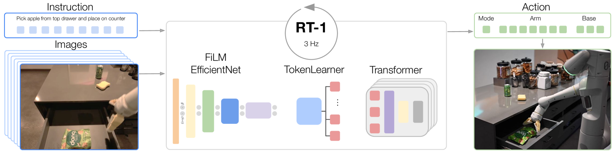
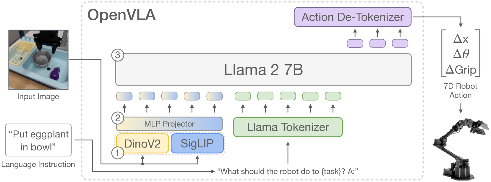
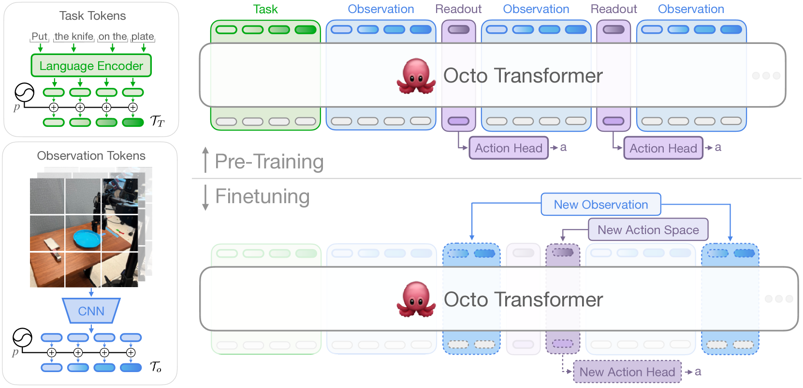
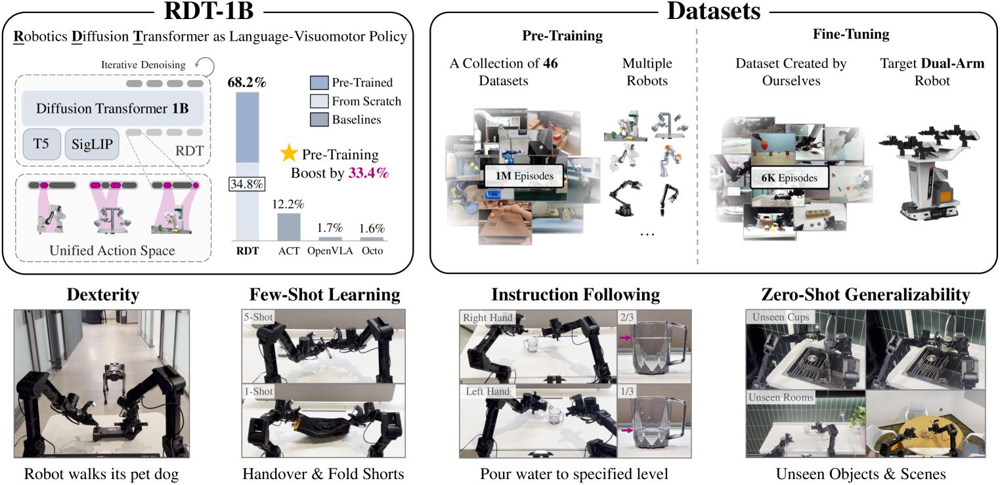
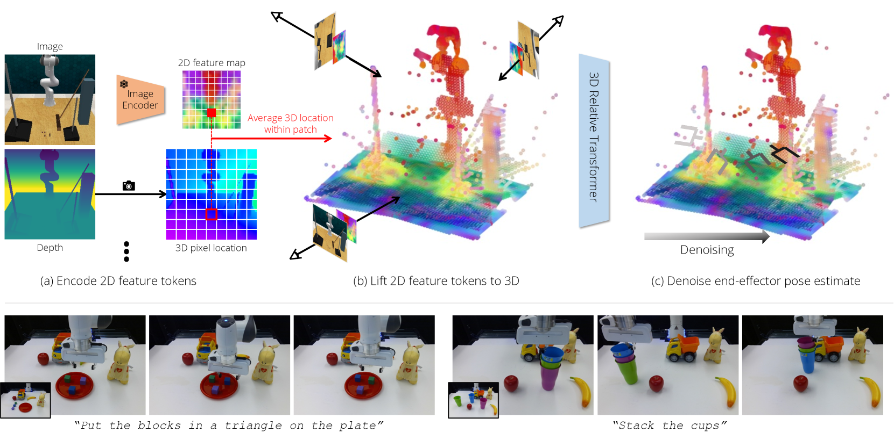
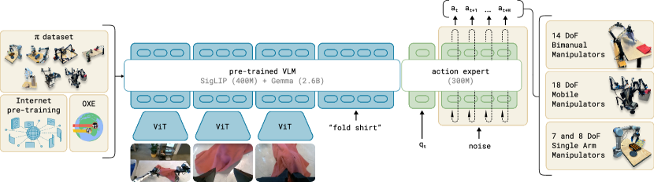
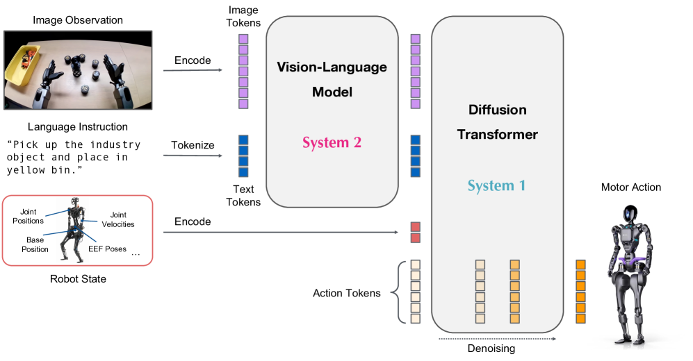

# 具身智能VLA（Vision-Language-Action）知识文档

> **面向AI领域从业者的技术指南**
> 
> 版本：2.0 | 更新日期：2026年4月20日

---

## 1. 前言与导读

### 1.1 文档定位

本文档是一份系统性的VLA（Vision-Language-Action）领域知识指南，旨在帮助机器学习、计算机视觉、系统架构（Infra）等AI相关领域的从业者快速掌握具身智能VLA技术的核心概念、演化脉络与实践方法。VLA模型作为具身智能的核心技术范式，通过将视觉感知、语言指令理解与底层动作控制统一于单一多模态大模型架构中，实现了从"互联网知识"到"物理行为"的端到端映射[1]。

### 1.2 读者对象与阅读建议

|读者类型|阅读重点|建议路径|
|:---|:---|:---|
|机器学习研究者|算法原理、数学公式、技术对比|第二章→第三章（深入细节）→第四章|
|计算机视觉工程师|视觉编码器设计、多模态融合|第二章→第三章（核心设计）→第五章|
|系统架构师(Infra)|模型部署、推理效率、硬件适配|第四章→第五章→第三章（SmolVLA/π0-FAST）|
|产品经理/技术决策者|领域全景、技术选型|第二章→第四章→第五章|

---

## 2. 领域概述与技术演化

### 2.1 VLA的定义与核心价值

Vision-Language-Action（VLA）模型是具身智能领域的核心技术范式，其本质是将视觉感知、语言指令理解与底层动作控制统一于单一的多模态大模型架构中，实现从"互联网知识"到"物理行为"的端到端映射。与传统的模块化机器人系统（感知→规划→控制的串联pipeline）不同，VLA模型通过联合训练消除了模块间的信息瓶颈，使机器人能够直接从原始像素和自然语言指令生成低级控制信号[1]。

VLA的核心目标可归纳为三点：**语义泛化**——继承大规模视觉语言模型（VLM）的常识推理能力，使机器人能够理解开放词汇指令并泛化到未见过的物体和场景；**物理精度**——生成平滑、连续且物理可行的动作轨迹，满足实时控制的频率要求（通常需达10-200Hz）；**跨形态迁移**——通过统一的动作表示空间，使单一模型能够适配多种机器人形态（Cross-Embodiment）[2]。

### 2.2 技术演化历程（2022年12月-2026年4月）

|阶段|时间跨度|核心特征|代表模型|里程碑意义|
|:---|:---|:---|:---|:---|
|奠基期|2022.12-2023.12|验证Transformer可行性|RT-1, RT-2, Diffusion Policy, ACT|证明数据规模定律在机器人领域成立|
|开源爆发期|2024.01-2024.12|开源通用策略涌现|OpenVLA, Octo, RDT-1B, π0|OXE数据集成为行业标准|
|产业落地期|2025.01-2025.12|人形机器人端到端控制|GR00T N1, Helix, SmolVLA|从Demo向商业化量产跨越|
|前沿探索期|2026.01-2026.04|物理AGI初现端倪|GEN-1, ABot-M0|1小时数据微调新任务|

### 2.3 五大技术路线对比

|维度|自回归|扩散策略|流匹配|视频预训练|双系统架构|
|:---|:---|:---|:---|:---|:---|
|动作表示|离散Token(256bins)|连续轨迹|连续向量场|隐式(预测未来帧)|混合|
|控制频率|低(<10Hz)|中(10-30Hz)|高(50Hz+)|中|极高(200Hz-1kHz)|
|推理延迟|低|高(多步去噪)|低(单向积分)|中|分层异步|
|语义泛化|极强|中等|强|强|极强|
|典型缺陷|动作不连贯|推理延迟|数据质量敏感|计算成本高|系统复杂|

---

## 3. 核心算法详解

本章详细介绍12个核心VLA算法，每个算法包含**核心设计**（背景、动机、方法、贡献）和**深入细节**（流程、公式、架构）两种模式。

### 3.1 RT-1: Robotics Transformer



<details>
<summary><b>📌 核心设计</b></summary>

#### 背景与问题

传统机器人控制系统依赖人工设计的状态机和任务特定策略，面临三大核心挑战：（1）每个新任务需要从头设计控制逻辑，无法扩展到多任务场景；（2）缺乏大规模、多样化的机器人数据集；（3）现有模型架构难以吸收异构数据并实现跨任务泛化。与此同时，自然语言处理（NLP）和计算机视觉（CV）领域的成功经验表明，大规模数据集与高容量Transformer架构的结合能够带来涌现式的泛化能力[3]。

#### 动机与目标

RT-1的核心动机是验证"开放式任务无关训练+高容量架构"的范式在机器人领域的可行性。具体目标包括：（1）构建首个能够在真实机器人上大规模部署的Transformer模型；（2）系统性研究数据规模、模型规模与数据多样性对任务泛化能力的影响；（3）探索机器人学习领域的Scaling Law[3]。

#### 基本方法

RT-1将机器人控制建模为序列到序列的生成问题。给定连续6帧RGB图像历史和自然语言任务指令，模型自回归地生成离散化的动作Token序列。核心设计包括：使用ImageNet预训练的EfficientNet-B3提取视觉特征；通过FiLM（Feature-wise Linear Modulation）层实现语言指令与视觉特征的早期融合；引入TokenLearner模块将每帧81个视觉Token压缩为8个；采用Decoder-only Transformer处理Token序列并输出11维离散动作[3]。

#### 关键模块设计

**TokenLearner模块**：这是RT-1的核心创新之一。原始的EfficientNet输出9×9×512的特征图，直接展平为81个Token会导致Transformer的自注意力复杂度过高（$O(n^2)$）。TokenLearner通过学习的元素级注意力权重，自适应地将81个Token压缩为8个信息密集的Token，实现2.4倍的推理加速，同时保留任务相关的关键视觉信息。

**FiLM调制层**：为了实现语言指令对视觉特征的条件化，RT-1在EfficientNet的每个残差块后插入FiLM层。该层使用语言嵌入生成仿射变换参数$\gamma$和$\beta$，对视觉特征进行逐通道的缩放和偏移，实现语义信息的早期注入。

**动作离散化**：RT-1将11维连续动作空间（7维末端位姿+3维基座运动+1维模式切换）离散化为256个bin，将机器人控制转化为分类问题，便于利用Transformer的离散Token预测能力。

#### 核心贡献

RT-1是VLA领域的奠基性工作，其核心贡献包括：（1）首次在130K真实机器人轨迹、700+任务上训练Transformer，证明了大规模数据收集的可行性；（2）在seen任务上达到97%成功率，unseen任务泛化率达76%；（3）系统性验证了数据规模与任务泛化能力的正相关关系；（4）开源代码，为后续RT-2、OpenVLA等工作奠定基础[3]。

#### 学术与工程意义

从学术角度，RT-1证明了Transformer架构在机器人控制领域的有效性，开启了"Robotics Foundation Model"的研究方向。从工程角度，RT-1的3Hz闭环控制频率虽然较低，但其大规模数据收集和模型训练的范式为工业界提供了可复制的路径，直接催生了Open X-Embodiment数据集的构建。

</details>

<details>
<summary><b>🔬 深入细节</b></summary>

#### 完整算法流程

**数据准备阶段**：
1. 使用13台Everyday Robots（EDR）移动操作机器人，在17个月内收集130K轨迹
2. 每条轨迹包含RGB图像序列（300×300×3）、自然语言指令、末端位姿和夹爪状态
3. 数据覆盖700+任务，包括抓取、放置、开关抽屉等

**前向传播流程**：
1. **图像编码**：连续6帧RGB图像输入EfficientNet-B3，输出6个9×9×512的特征图
2. **语言融合**：Universal Sentence Encoder将指令编码为512维向量，通过FiLM层调制视觉特征
3. **Token压缩**：TokenLearner将每帧81个Token压缩为8个，共48个Token
4. **序列建模**：8层Decoder-only Transformer（dim=512，8 heads）处理Token序列
5. **动作生成**：分类头输出11×256的logits，每维选择概率最高的bin

**训练流程**：
1. 使用Teacher Forcing策略，输入真实动作序列
2. 计算交叉熵损失：$\mathcal{L} = -\sum_{d=1}^{11} \log P(a^{(d)} | a^{(<d)}, O, L)$
3. Adam优化器，学习率1e-4，batch size 4096，训练400K步

#### 网络架构详解

|组件|配置|参数量|功能说明|
|:---|:---|:---|:---|
|EfficientNet-B3|预训练ImageNet|12M|提取视觉特征|
|FiLM层|每个残差块后插入|2M|语言-视觉融合|
|TokenLearner|8 output tokens|0.5M|视觉Token压缩|
|Transformer|8层，dim=512，8 heads|35M|序列建模与动作预测|
|分类头|11×256输出|0.5M|动作Token预测|
|**总计**|-|**~50M**|-|

#### 核心数学公式

**自回归动作生成**：

$$P(A|O,L) = \prod_{t=1}^{T} P(a_t | a_{<t}, O, L; \theta)$$

其中$O$为观测序列，$L$为语言指令，$a_t$为第$t$个动作维度的离散Token。

**FiLM调制**：

$$\text{FiLM}(F_v, e_L) = \gamma(e_L) \odot F_v + \beta(e_L)$$

其中$F_v \in \mathbb{R}^{H \times W \times C}$为视觉特征，$e_L \in \mathbb{R}^{d_L}$为语言嵌入，$\gamma, \beta$由两层MLP生成。

**动作离散化**（256 bins per dimension）：

$$\text{bin}(a^{(d)}) = \left\lfloor \frac{a^{(d)} - a_{min}^{(d)}}{a_{max}^{(d)} - a_{min}^{(d)}} \times 255 \right\rfloor$$

**TokenLearner注意力**：

$$T_i = \sum_{j=1}^{81} \alpha_{ij} \cdot F_j, \quad \alpha_{ij} = \text{softmax}(W_i \cdot F_j)$$

#### 训练策略与超参数

|超参数|值|说明|
|:---|:---|:---|
|优化器|Adam|$\beta_1=0.9, \beta_2=0.999$|
|学习率|1e-4|无warmup|
|Batch size|4096|分布式训练|
|训练步数|400K|约2周|
|图像历史长度|6帧|200ms历史|
|控制频率|3Hz|闭环控制|

#### 损失函数设计

RT-1使用标准的分类交叉熵损失，将11维动作分解为独立的分类任务：

$$\mathcal{L}_{CE} = -\frac{1}{11} \sum_{d=1}^{11} \sum_{b=0}^{255} y_b^{(d)} \log \hat{y}_b^{(d)}$$

其中$y_b^{(d)}$为第$d$维动作的真实bin的one-hot编码，$\hat{y}_b^{(d)}$为预测概率。

#### 推理流程

1. 接收当前帧图像，与历史5帧拼接
2. EfficientNet+FiLM提取调制后的视觉特征
3. TokenLearner压缩为48个Token
4. Transformer自回归生成11个动作Token（每个Token独立预测）
5. 将离散Token反离散化为连续动作值
6. 发送至机器人控制器执行
7. 以3Hz频率循环

#### 技术继承关系

RT-1是VLA领域的奠基工作，其核心设计被后续模型广泛继承：
- **RT-2**：继承动作Token化思想，将Backbone升级为VLM
- **RT-X**：在RT-1架构上实现跨机器人训练
- **OpenVLA**：RT-2的开源复现，继承自回归范式
- **Octo**：继承Transformer骨干，替换为扩散头

</details>

**🎯 理解测试题**：

> **问题**：RT-1使用TokenLearner将每帧81个视觉Token压缩为8个。请从计算复杂度和信息选择两个角度解释这一设计的必要性。

<details>
<summary>参考答案</summary>

**计算复杂度角度**：Transformer的自注意力复杂度为$O(n^2)$，其中$n$为序列长度。6帧图像若不压缩，序列长度为$81 \times 6 = 486$，压缩后为$8 \times 6 = 48$，序列长度缩短约10倍，计算量降低约100倍（$(486/48)^2 \approx 100$）。这对于3Hz的实时控制至关重要。

**信息选择角度**：TokenLearner通过学习的注意力权重，自适应地选择与当前任务相关的关键视觉区域（如目标物体、机械臂末端），同时滤除无关背景噪声。这种数据驱动的信息选择比固定的pooling更灵活，能够根据不同任务动态调整关注区域。

</details>

---

### 3.2 RT-2: Vision-Language-Action Models


<details>
<summary><b>📌 核心设计</b></summary>

#### 背景与问题

RT-1虽然证明了Transformer在机器人控制中的有效性，但其语义理解能力本质上受限于机器人数据的规模和多样性。130K轨迹在机器人学习领域已属大规模，但与互联网规模的视觉语言数据（数十亿图文对）相比仍是九牛一毛。这导致RT-1在面对未见物体、抽象指令或需要常识推理的任务时表现欠佳——例如，它无法理解"把比苹果更大的物体放进篮子"这类需要比较推理的指令[5]。

#### 动机与目标

RT-2的核心动机是回答一个关键问题：**能否将Web规模视觉语言模型（VLM）的常识推理能力迁移至机器人控制？** 具体目标包括：（1）利用VLM在数十亿图文对上预训练获得的世界知识（物体识别、空间推理、属性理解）；（2）保持VLM的原始能力不退化，同时新增动作生成能力；（3）实现开放词汇的语义泛化，使机器人能够理解训练数据中从未出现的概念[5]。

#### 基本方法

RT-2提出了"Action-as-Text"的核心思想：将机器人动作直接编码为文本Token，与自然语言共享同一个词表空间。具体而言，7维动作（x, y, z, roll, pitch, yaw, gripper）被离散化为256个bin后，转换为对应的数字字符串（如"1 128 91 241 5 101 127"），作为VLM的输出Target进行训练。这一设计使得VLM可以在不修改架构的情况下，直接学习生成机器人动作[5]。

RT-2采用协同微调（Co-fine-tuning）策略：每个训练batch中混合50%的Web数据（VQA、图像描述等）和50%的机器人轨迹数据。这种设计确保模型在学习动作生成的同时，不会"遗忘"预训练阶段获得的语义理解能力。

#### 关键模块设计

**Action-as-Text表示**：RT-2的核心创新在于将动作表示为自然语言Token，而非设计专门的动作头。每个动作维度被离散化为256个bin（对应数字0-255），7维动作表示为7个空格分隔的数字字符串。这使得VLM的解码器可以直接输出动作，无需任何架构修改。

**协同微调策略**：为避免灾难性遗忘，RT-2在训练时保持Web数据和机器人数据的平衡。实验表明，纯机器人数据微调会导致VLM在VQA等任务上的性能大幅下降，而50/50混合能够在保持原有能力的同时新增动作生成能力。

**VLM Backbone选择**：RT-2探索了两种大规模VLM作为Backbone——PaLI-X（55B参数）和PaLM-E（12B参数）。两者都展现了知识迁移的能力，但PaLI-X在复杂推理任务上表现更优。

#### 核心贡献

RT-2首次提出了VLA（Vision-Language-Action）的概念，其核心贡献包括：（1）证明了VLM的Web规模知识可以有效迁移至机器人控制，未见物体的泛化成功率从RT-1的32%提升至62%；（2）观察到"符号涌现"现象——模型自动获得了数学推理、属性比较、因果推断等能力，尽管这些能力从未在机器人数据中显式训练；（3）引入Chain-of-Thought推理，使机器人能够分解复杂任务（如"找一个可以用来敲钉子的物体"→识别石头的硬度属性→抓取石头）[5]。

#### 学术与工程意义

从学术角度，RT-2开创了"VLM→VLA"的技术路线，证明了大模型的世界知识可以赋能物理操作，这一发现深刻影响了后续OpenVLA、RoboFlamingo等工作的技术选型。从工程角度，RT-2的55B参数虽然难以部署，但其"Action-as-Text"的思想启发了后续轻量化工作，表明动作Token化是VLA设计的有效范式。

</details>

<details>
<summary><b>🔬 深入细节</b></summary>

#### 完整算法流程

**预训练阶段**（继承自VLM）：
1. PaLI-X在Web规模图文数据（数十亿对）上预训练
2. 学习视觉理解、语言生成、跨模态对齐等能力
3. 获得丰富的世界知识（物体、属性、关系、常识）

**协同微调阶段**：
1. 准备混合数据集：50% Web数据（VQA、Caption等）+ 50% 机器人轨迹
2. 将机器人动作转换为文本Token（如"1 128 91 241 5 101 127 217"）
3. 以统一的序列到序列格式训练：输入=图像+指令，输出=文本/动作
4. 使用交叉熵损失同时优化两类任务

**推理阶段**：
1. 接收当前帧图像和自然语言指令
2. VLM编码器提取视觉特征并与语言融合
3. 解码器自回归生成动作Token序列
4. 解析Token为7维连续动作值
5. 发送至机器人执行

#### 网络架构详解

|变体|VLM Backbone|视觉编码器|参数量|训练数据比例|
|:---|:---|:---|:---|:---|
|RT-2-PaLI-X|PaLI-X|ViT-22B|55B|50% Web + 50% Robot|
|RT-2-PaLM-E|PaLM-E|ViT-4B|12B|50% Web + 50% Robot|

**详细架构（RT-2-PaLI-X）**：

|组件|配置|参数量|
|:---|:---|:---|
|视觉编码器|ViT-22B|22B|
|语言模型|UL2 32B|32B|
|投影层|2层MLP|1B|
|**总计**|-|**~55B**|

#### 核心数学公式

**联合训练目标**：

$$\mathcal{L} = \lambda_{web} \mathcal{L}_{VLM}(D_{web}) + \lambda_{robot} \mathcal{L}_{VLA}(D_{robot})$$

其中$\lambda_{web} = \lambda_{robot} = 0.5$，确保两类数据的平衡。

**VLM损失（Web数据）**：

$$\mathcal{L}_{VLM} = -\sum_{t=1}^{T} \log P(y_t | y_{<t}, I, Q; \theta)$$

其中$y$为文本回答，$I$为图像，$Q$为问题。

**VLA损失（机器人数据）**：

$$\mathcal{L}_{VLA} = -\sum_{t=1}^{7} \log P(a_t | a_{<t}, I, L; \theta)$$

其中$a_t$为动作Token（离散化后的数字字符）。

**动作Token化**：

$$\text{Token}(a^{(d)}) = \text{str}\left(\left\lfloor \frac{a^{(d)} - a_{min}}{a_{max} - a_{min}} \times 255 \right\rfloor\right)$$

#### 训练策略与超参数

|超参数|RT-2-PaLI-X|RT-2-PaLM-E|
|:---|:---|:---|
|优化器|Adafactor|Adafactor|
|学习率|1e-5|1e-5|
|Batch size|2048|2048|
|训练步数|100K|100K|
|Web数据比例|50%|50%|
|机器人数据|RT-1数据集|RT-1数据集|
|硬件|TPU v4 Pod|TPU v4 Pod|

#### 损失函数设计

RT-2使用标准的自回归交叉熵损失，但在两类数据上分别计算：

$$\mathcal{L}_{total} = \frac{1}{|B_{web}|}\sum_{i \in B_{web}} \mathcal{L}_{CE}^{(i)} + \frac{1}{|B_{robot}|}\sum_{j \in B_{robot}} \mathcal{L}_{CE}^{(j)}$$

协同微调的关键在于**梯度平衡**：Web数据的梯度防止VLM能力退化，机器人数据的梯度引入动作生成能力。

#### 推理流程

1. **输入预处理**：图像resize至VLM要求的分辨率，指令tokenize
2. **视觉编码**：ViT提取patch级特征
3. **跨模态融合**：Transformer层实现图像-文本的交叉注意力
4. **动作解码**：自回归生成7个数字Token
5. **后处理**：解析Token→连续动作→发送至控制器
6. **频率**：约3-5Hz（受限于VLM推理延迟）

#### 技术继承关系

RT-2是VLA概念的提出者，其技术影响深远：

**直接继承**：
- **OpenVLA**：开源复现RT-2架构，使用Llama-2替代闭源VLM
- **RoboFlamingo**：基于OpenFlamingo实现VLA，继承Action-as-Text思想

**间接影响**：
- **π0**：继承VLM Backbone思想，替换为流匹配动作头
- **GR00T N1**：将RT-2的VLM作为System 2，新增扩散动作头

</details>

**🎯 理解测试题**：

> **问题**：RT-2采用协同微调策略，在每个batch中混合50%的Web数据和50%的机器人数据。请解释为什么这一策略能够防止灾难性遗忘，以及如果改为100%机器人数据会发生什么。

<details>
<summary>参考答案</summary>

**防止灾难性遗忘的机制**：协同微调通过持续在Web数据上计算梯度，保持VLM参数在原有任务流形附近的稳定性。具体而言，Web数据的梯度$\nabla_\theta \mathcal{L}_{VLM}$与机器人数据的梯度$\nabla_\theta \mathcal{L}_{VLA}$在参数空间中形成"拉力平衡"——前者阻止参数偏离预训练点过远，后者引导参数学习新的动作生成能力。

**100%机器人数据的后果**：若完全使用机器人数据微调，VLM将发生灾难性遗忘——模型参数快速偏移至机器人数据的最优解，导致VQA、图像描述等原有能力大幅退化。更关键的是，RT-2的核心优势——语义泛化能力——正是依赖于VLM的Web规模知识，遗忘这些知识后，模型将退化为普通的视觉运动策略，失去对未见物体、抽象指令的理解能力。

</details>

---

### 3.3 Diffusion Policy


<details>
<summary><b>📌 核心设计</b></summary>

#### 背景与问题

传统模仿学习方法（如Behavior Cloning）通常将策略建模为确定性映射$\pi: s \to a$或简单的高斯分布$\pi(a|s) = \mathcal{N}(\mu(s), \sigma(s))$。然而，真实的人类演示数据往往存在**多峰性**（multimodality）——同一状态下可能存在多种合理的动作选择。例如，在绕过障碍物时，可以选择从左侧或右侧绕行，两者都是有效策略。单峰分布会将两种模式"平均"为一个无效的中间动作[4]。

#### 动机与目标

Diffusion Policy的核心动机是将扩散模型（Diffusion Models）强大的分布建模能力引入机器人策略学习。扩散模型在图像生成领域展现了对复杂、多峰分布的精确建模能力，Diffusion Policy旨在将这一能力迁移至动作空间，使策略能够表示任意复杂的动作分布[4]。

#### 基本方法

Diffusion Policy将动作生成建模为条件去噪过程：从纯高斯噪声开始，通过迭代去噪逐步恢复目标动作轨迹。训练时，向真实动作添加噪声，学习一个噪声预测网络$\epsilon_\theta$；推理时，从随机噪声出发，使用学到的$\epsilon_\theta$迭代去噪，生成条件于当前状态的动作轨迹[4]。

Diffusion Policy引入两个关键设计：**Action Chunking**——一次性预测未来$T_a$步的动作轨迹，而非单步动作；**Receding Horizon Control**——执行前$T_p$步后重新规划，结合了长程规划与实时反馈的优势。

#### 关键模块设计

**噪声预测网络$\epsilon_\theta$**：Diffusion Policy提出两种架构——基于CNN的U-Net（适用于低维状态）和基于Transformer的架构（适用于高维视觉输入）。网络接收噪声动作$A^k$、扩散时间步$k$和状态$s$，输出预测噪声$\hat{\epsilon}$。

**DDIM加速采样**：原始DDPM需要100步迭代去噪，难以满足实时控制需求。Diffusion Policy采用DDIM（Denoising Diffusion Implicit Models）将采样步数从100减少到10，同时保持生成质量，使推理延迟降至可接受范围。

**Action Chunking与时序一致性**：预测动作块而非单步动作带来两个好处：（1）减少累积误差，因为长轨迹的规划能够避免单步预测的短视性；（2）生成更平滑的动作序列，因为块内动作在同一次去噪过程中联合生成，自然具有时序连贯性。

#### 核心贡献

Diffusion Policy是扩散策略路线的奠基工作，其核心贡献包括：（1）首次将DDPM应用于机器人策略学习，证明扩散模型能够有效建模多峰动作分布；（2）在12个仿真和真实任务上平均超越SOTA 46.9%，Push-T任务从IBC的25%提升至93%；（3）提出Action Chunking + Receding Horizon的控制范式，被后续ACT、Octo、π0等工作广泛采用；（4）引用量超过2700+，成为机器人学习领域引用最高的论文之一[4]。

#### 学术与工程意义

从学术角度，Diffusion Policy开辟了"生成式策略学习"的新方向，证明了扩散模型在序列决策问题中的潜力，影响了后续RDT-1B、3D Diffuser Actor、DexVLA等扩散系列工作。从工程角度，Diffusion Policy的开源实现（GitHub star 3.5k+）成为社区标准，其Action Chunking范式被LeRobot、Octo等开源项目直接采用。

</details>

<details>
<summary><b>🔬 深入细节</b></summary>

#### 完整算法流程

**训练阶段**：

1. **数据采样**：从演示数据集采样状态-动作块对$(s, A^0)$，其中$A^0 \in \mathbb{R}^{T_a \times d_a}$为$T_a$步动作序列
2. **噪声采样**：随机采样扩散时间步$k \sim \text{Uniform}(1, K)$和噪声$\epsilon \sim \mathcal{N}(0, I)$
3. **前向加噪**：$A^k = \sqrt{\bar{\alpha}_k} A^0 + \sqrt{1-\bar{\alpha}_k} \epsilon$
4. **噪声预测**：网络预测$\hat{\epsilon} = \epsilon_\theta(A^k, s, k)$
5. **损失计算**：$\mathcal{L} = \|\epsilon - \hat{\epsilon}\|^2$
6. **参数更新**：梯度下降更新$\theta$

**推理阶段**：

1. **初始化**：采样纯噪声$A^K \sim \mathcal{N}(0, I)$
2. **迭代去噪**：循环$k = K, K-1, ..., 1$：
   - 预测噪声$\hat{\epsilon} = \epsilon_\theta(A^k, s, k)$
   - DDPM更新：$A^{k-1} = \frac{1}{\sqrt{\alpha_k}}(A^k - \frac{\beta_k}{\sqrt{1-\bar{\alpha}_k}}\hat{\epsilon}) + \sigma_k z$
3. **执行与重规划**：执行$A^0$的前$T_p$步，获取新状态后从步骤1重新开始

#### 网络架构详解

**CNN U-Net变体（低维状态）**：

|组件|配置|参数量|
|:---|:---|:---|
|下采样块|3层Conv，stride=2|5M|
|中间层|2层ResBlock|3M|
|上采样块|3层ConvTranspose|5M|
|时间步嵌入|Sinusoidal+MLP|0.5M|
|状态嵌入|2层MLP|1M|
|**总计**|-|**~15M**|

**Transformer变体（视觉输入）**：

|组件|配置|参数量|
|:---|:---|:---|
|视觉编码器|ResNet-18|11M|
|Transformer|6层，dim=256，4 heads|15M|
|时间步嵌入|Sinusoidal+MLP|0.5M|
|动作预测头|2层MLP|2M|
|**总计**|-|**~30M**|

#### 核心数学公式

**前向扩散过程（DDPM）**：

$$q(A^k | A^0) = \mathcal{N}(A^k; \sqrt{\bar{\alpha}_k} A^0, (1-\bar{\alpha}_k)I)$$

其中$\bar{\alpha}_k = \prod_{i=1}^{k} \alpha_i$，$\alpha_k = 1 - \beta_k$，$\beta_k$为噪声schedule。

**反向去噪训练目标**：

$$\mathcal{L}_{MSE} = \mathbb{E}_{A^0, \epsilon, k}\left[\|\epsilon - \epsilon_\theta(A^k, s, k)\|^2\right]$$

**DDPM采样公式**：

$$A^{k-1} = \frac{1}{\sqrt{\alpha_k}}\left(A^k - \frac{\beta_k}{\sqrt{1-\bar{\alpha}_k}}\epsilon_\theta(A^k, s, k)\right) + \sigma_k z, \quad z \sim \mathcal{N}(0, I)$$

**DDIM确定性采样**：

$$A^{k-1} = \sqrt{\bar{\alpha}_{k-1}} \cdot \underbrace{\frac{A^k - \sqrt{1-\bar{\alpha}_k} \epsilon_\theta}{\sqrt{\bar{\alpha}_k}}}_{\text{预测的}A^0} + \sqrt{1-\bar{\alpha}_{k-1}} \cdot \epsilon_\theta$$

#### 训练策略与超参数

|超参数|值|说明|
|:---|:---|:---|
|扩散步数$K$|100（训练），10（DDIM推理）|DDIM实现10倍加速|
|噪声schedule|Linear，$\beta_1=0.0001$，$\beta_K=0.02$|标准DDPM设置|
|动作块长度$T_a$|16|约0.5秒@30Hz|
|执行长度$T_p$|8|Receding Horizon|
|优化器|AdamW|$\text{lr}=1\text{e-}4$，$\text{wd}=1\text{e-}6$|
|Batch size|256|仿真任务|
|训练Epoch|3000|约8小时单卡|

#### 损失函数设计

Diffusion Policy使用标准的MSE损失预测噪声，但在实践中发现以下变体更稳定：

**$\epsilon$-预测**（默认）：
$$\mathcal{L}_\epsilon = \|\epsilon - \epsilon_\theta(A^k, s, k)\|^2$$

**$v$-预测**（可选）：
$$\mathcal{L}_v = \|v - v_\theta(A^k, s, k)\|^2, \quad v = \sqrt{\bar{\alpha}_k}\epsilon - \sqrt{1-\bar{\alpha}_k}A^0$$

$v$-预测在低噪声区域更稳定，但$\epsilon$-预测在大多数任务上已足够。

#### 推理流程详解

```
输入：当前状态 s，扩散步数 K=10（DDIM）
输出：动作块 A^0 ∈ R^{T_a × d_a}

1. A^K ~ N(0, I)                    # 初始化纯噪声
2. for k = K, K-1, ..., 1:
   2.1 ε̂ = ε_θ(A^k, s, k)          # 噪声预测
   2.2 A^{k-1} = DDIM_step(A^k, ε̂, k)  # DDIM更新
3. return A^0
```

**实时控制循环**：
```
while task_not_done:
    s = get_observation()           # 获取当前状态
    A = diffusion_sample(s)         # 扩散采样
    for t = 1, ..., T_p:
        execute(A[t])               # 执行动作
        s = get_observation()       # 更新状态
```

#### 技术继承关系

Diffusion Policy是扩散策略路线的开山之作，其影响广泛：

**直接继承**：
- **Octo**：继承扩散头设计，结合Transformer骨干
- **RDT-1B**：将扩散策略扩展至DiT架构
- **3D Diffuser Actor**：增加3D场景表征
- **DexVLA**：扩散专家用于灵巧手操作

**思想影响**：
- **ACT**：Action Chunking思想的提出同期于Diffusion Policy
- **π0**：流匹配可视为扩散模型的确定性替代

</details>

**🎯 理解测试题**：

> **问题**：Diffusion Policy使用DDIM将推理步数从100减少到10。请解释DDIM相比DDPM的数学差异，以及为什么DDIM能够在更少步数下保持生成质量。

<details>
<summary>参考答案</summary>

**数学差异**：DDPM的反向过程是随机的，每步需要添加噪声$z \sim \mathcal{N}(0, I)$，导致采样路径随机游走；DDIM将反向过程改造为确定性ODE，消除了随机噪声项，采样路径变为从$A^K$到$A^0$的确定性映射。

**能够减少步数的原因**：（1）**确定性路径**：DDIM的采样路径是确定的，不需要通过大量步数来"平均"随机性；（2）**可跳步**：DDIM的更新公式允许直接从$A^k$跳到$A^{k-\Delta}$（$\Delta > 1$），而DDPM必须逐步迭代；（3）**相同的边缘分布**：尽管采样过程不同，DDIM和DDPM在每个时间步的边缘分布$q(A^k)$是相同的，因此最终生成质量一致。

实际效果是，DDIM以10步达到DDPM 100步相近的生成质量，推理时间从~500ms降至~50ms，满足10-30Hz的控制需求。

</details>

---

### 3.4 ACT: Action Chunking with Transformers


<details>
<summary><b>📌 核心设计</b></summary>

#### 背景与问题

双臂精细操作任务（如穿线、插销、开瓶盖）对控制策略提出了极高要求：（1）**数据效率**——收集双臂遥操作数据成本高昂，策略必须能从少量演示（~50个）中学习；（2）**动作平滑性**——精细操作对抖动极为敏感，策略必须生成平滑连续的动作序列；（3）**非马尔可夫性**——当前最优动作不仅取决于当前状态，还取决于未来计划（如穿线时需要预判线的走向）[15]。

传统的单步动作预测策略存在**复合误差**（compounding error）问题：每步的微小预测误差会累积，导致长程任务失败。此外，单步预测难以捕获动作序列的时序结构，生成的动作往往不连贯。

#### 动机与目标

ACT的核心动机是设计一种能够从极少量演示中学习复杂双臂操作的高效算法。具体目标包括：（1）通过Action Chunking一次性预测长动作序列，减少复合误差；（2）通过CVAE学习动作序列的潜在"风格"变量，捕获演示中的多模态性；（3）通过Temporal Ensembling平滑执行，消除动作块边界处的不连续性[15]。

#### 基本方法

ACT将策略建模为条件变分自编码器（CVAE）：编码器将观测和动作序列压缩为低维潜在变量$z$（代表动作的"风格"），解码器根据$z$和当前观测重建动作序列。训练时，CVAE学习动作序列的生成模型；推理时，将$z$设为先验均值（通常为零），解码器根据观测生成动作块[15]。

ACT引入Action Chunking机制：一次性预测未来$k=100$步动作（4秒@25Hz），而非单步预测。这使得策略能够规划长程动作轨迹，减少短视决策带来的复合误差。

#### 关键模块设计

**CVAE编码器**：4层Transformer编码器，输入为动作序列$a_{1:k}$和关节位置$q$，输出为潜在变量$z$的后验分布参数$\mu_\phi, \sigma_\phi$。编码器学习将动作序列压缩为32维的风格变量。

**CVAE解码器**：6层Transformer解码器，输入为潜在变量$z$、多视角图像特征和关节位置，输出为预测的动作序列$\hat{a}_{1:k}$。解码器使用Cross-Attention机制融合视觉信息。

**Temporal Ensembling**：由于Action Chunking会产生重叠的动作预测（当前时刻会有多个历史预测的"投票"），ACT使用指数加权平均进行融合：$a_t^{exec} = \sum_i w_i \hat{a}_t^{(i)} / \sum_i w_i$，其中$w_i = \exp(-\lambda \cdot \text{age}_i)$，较新的预测权重更高。

#### 核心贡献

ACT的核心贡献包括：（1）首次提出Action Chunking + CVAE的组合范式，仅需50个高质量演示即可在ALOHA平台上达到80-90%的成功率；（2）在穿线任务上达到96%成功率，这是当时最具挑战性的双臂精细操作任务之一；（3）设计了低成本双臂遥操作平台ALOHA（约20K美元），降低了双臂学习的数据收集门槛；（4）Action Chunking思想被Diffusion Policy、π0等后续工作广泛采用[15]。

#### 学术与工程意义

从学术角度，ACT证明了CVAE在序列决策问题中的有效性，其潜在变量$z$能够捕获演示中的风格多样性（如不同人的操作习惯）。从工程角度，ALOHA平台的开源设计（硬件+软件）极大推动了双臂学习的研究，成为Mobile ALOHA、ALOHA 2等后续工作的基础。

</details>

<details>
<summary><b>🔬 深入细节</b></summary>

#### 完整算法流程

**训练阶段**：

1. **数据采集**：使用ALOHA平台遥操作收集演示，每条轨迹包含双臂关节位置、夹爪状态、多视角图像
2. **CVAE编码**：
   - 输入动作序列$a_{1:k}$和当前关节位置$q$
   - 编码器输出后验分布$q_\phi(z|a,o) = \mathcal{N}(\mu_\phi, \sigma_\phi^2)$
   - 重参数化采样$z = \mu_\phi + \sigma_\phi \cdot \epsilon$，$\epsilon \sim \mathcal{N}(0, I)$
3. **CVAE解码**：
   - 输入$z$、图像特征、关节位置
   - 解码器输出预测动作$\hat{a}_{1:k}$
4. **损失计算**：重构损失 + KL正则化
5. **参数更新**

**推理阶段**：

1. **观测编码**：获取当前图像和关节位置
2. **动作解码**：将$z$设为先验均值（零向量），解码器生成动作块
3. **Temporal Ensembling**：与历史预测融合
4. **动作执行**：发送关节位置命令至机器人
5. **循环**：以50Hz频率重复

#### 网络架构详解

|组件|配置|参数量|功能|
|:---|:---|:---|:---|
|视觉编码器|ResNet-18×4（4视角）|44M|提取多视角图像特征|
|CVAE编码器|4层Transformer，dim=512|20M|动作序列→潜在变量|
|CVAE解码器|6层Transformer，dim=512|30M|潜在变量→动作序列|
|潜在变量维度|$d_z=32$|-|风格表示|
|动作块长度|$k=100$（4秒@25Hz）|-|长程规划|
|**总计**|-|**~94M**|-|

**CVAE编码器详细结构**：
```
输入: [CLS], a_1, a_2, ..., a_k, q  (k+2个token)
      ↓ Self-Attention × 4层
输出: [CLS]的embedding → MLP → (μ, log σ²)
```

**CVAE解码器详细结构**：
```
输入: z, img_feat_1, ..., img_feat_4, q, [ACT_1], ..., [ACT_k]
      ↓ Cross-Attention (query=[ACT], kv=[z,img,q])
      ↓ Self-Attention × 6层
输出: [ACT_1], ..., [ACT_k] → MLP → â_1, ..., â_k
```

#### 核心数学公式

**CVAE损失函数**：

$$\mathcal{L}_{ACT} = \underbrace{\|a_{1:k} - \hat{a}_{1:k}\|^2}_{\text{重构损失}} + \beta \cdot \underbrace{D_{KL}(q_\phi(z|a,o) \| p(z))}_{\text{KL正则化}}$$

其中$p(z) = \mathcal{N}(0, I)$为先验分布，$\beta$为KL权重（通常$\beta=10$）。

**重参数化技巧**：

$$z = \mu_\phi(a, o) + \sigma_\phi(a, o) \cdot \epsilon, \quad \epsilon \sim \mathcal{N}(0, I)$$

**KL散度**（高斯分布闭式解）：

$$D_{KL} = \frac{1}{2} \sum_{i=1}^{d_z} \left(\mu_i^2 + \sigma_i^2 - \log \sigma_i^2 - 1\right)$$

**Temporal Ensembling**：

$$a_t^{exec} = \frac{\sum_{i=1}^{n} w_i \cdot \hat{a}_t^{(i)}}{\sum_{i=1}^{n} w_i}, \quad w_i = \exp(-\lambda \cdot \text{age}_i)$$

其中$\text{age}_i$为第$i$个预测的"年龄"（距离当前的时间步数），$\lambda=0.01$。

#### 训练策略与超参数

|超参数|值|说明|
|:---|:---|:---|
|优化器|AdamW|$\text{lr}=1\text{e-}5$|
|Batch size|8|数据效率高|
|训练Epoch|2000|约4小时单卡|
|动作块长度$k$|100|4秒@25Hz|
|潜在维度$d_z$|32|风格变量|
|KL权重$\beta$|10|防止后验坍塌|
|Temporal Ensembling $\lambda$|0.01|平滑系数|

#### 损失函数设计

ACT的损失函数是标准的ELBO（Evidence Lower Bound）：

$$\mathcal{L} = -\mathbb{E}_{q_\phi(z|a,o)}[\log p_\theta(a|z,o)] + \beta \cdot D_{KL}(q_\phi(z|a,o) \| p(z))$$

实际实现中，重构项使用MSE损失：

$$\mathcal{L}_{recon} = \frac{1}{k \cdot d_a} \sum_{t=1}^{k} \|a_t - \hat{a}_t\|^2$$

**$\beta$的选择**：$\beta$过小会导致后验与先验差异过大，推理时$z=0$产生的动作偏离训练分布；$\beta$过大会导致后验坍塌，$z$不携带任何信息。ACT使用$\beta=10$作为经验最优值。

#### 推理流程详解

```
初始化: action_queue = []  # 历史预测缓存

while task_not_done:
    # 1. 获取观测
    images = get_camera_images()  # 4视角
    joints = get_joint_positions()
    
    # 2. 编码视觉特征
    img_feats = [ResNet(img) for img in images]
    
    # 3. CVAE解码（z=0）
    z = torch.zeros(d_z)
    a_chunk = Decoder(z, img_feats, joints)  # shape: (k, d_a)
    
    # 4. 加入预测缓存
    action_queue.append(a_chunk)
    
    # 5. Temporal Ensembling
    a_exec = temporal_ensemble(action_queue, t_current)
    
    # 6. 执行
    send_to_robot(a_exec)
    
    # 7. 清理过期预测
    action_queue = [a for a in action_queue if not expired(a)]
```

#### 技术继承关系

ACT与Diffusion Policy几乎同期发表，两者共同奠定了Action Chunking范式：

**思想输出**：
- **Diffusion Policy**：继承Action Chunking，使用扩散模型替代CVAE
- **π0**：继承Action Chunking，使用流匹配替代扩散
- **OpenVLA**：在自回归框架中引入动作块概念

**平台影响**：
- **Mobile ALOHA**：基于ALOHA平台开发移动版本
- **ALOHA 2**：Google DeepMind升级版
- **Gello**：低成本遥操作设备的设计灵感

</details>

**🎯 理解测试题**：

> **问题**：ACT中的CVAE使用KL散度正则化项。请解释$\beta$参数的作用，以及$\beta$设置过大或过小分别会导致什么问题。

<details>
<summary>参考答案</summary>

**$\beta$的作用**：$\beta$控制KL正则化项的强度，平衡重构质量与后验正则化。较大的$\beta$迫使后验$q(z|a,o)$接近先验$p(z)$，较小的$\beta$允许后验偏离先验以更好地重构动作。

**$\beta$过小的问题**：后验分布可以任意偏离先验$\mathcal{N}(0, I)$，在训练时$z$被编码器"精心设计"以完美重构动作。但推理时$z$被设为先验均值（零向量），这与训练时的分布不一致，导致生成的动作偏离训练数据的分布，表现为动作不自然甚至失败。

**$\beta$过大的问题**：强KL正则化会导致**后验坍塌（Posterior Collapse）**——编码器被迫输出与先验几乎相同的分布$q \approx p$，此时$z$不再携带任何关于动作序列的信息（因为$z$的分布与输入无关）。解码器退化为仅依赖观测$o$的条件模型，丧失了捕获演示多模态风格的能力。

**ACT的$\beta=10$**：这是一个经验最优值，在保持后验与先验接近（确保推理时$z=0$有效）的同时，允许$z$编码一定的风格信息。

</details>

---

### 3.5 OpenVLA



<details>
<summary><b>📌 核心设计</b></summary>

#### 背景与问题

RT-2展示了VLA模型的强大潜力，但存在两个关键限制：（1）**闭源性**——RT-2的55B参数和训练数据均未开源，社区无法复现和改进；（2）**参数冗余**——55B参数对于大多数实验室的计算资源是不可承受之重，限制了VLA技术的广泛应用。与此同时，开源VLM生态（如Llama系列）的成熟为构建开源VLA提供了基础设施[6]。

#### 动机与目标

OpenVLA的核心动机是回答一个关键问题：**能否用1/7的参数超越RT-2的性能？** 具体目标包括：（1）构建首个完全开源的VLA基座模型，包括代码、权重和训练数据；（2）基于开源VLM（Llama-2）实现7B参数的VLA；（3）在Open X-Embodiment数据集上大规模训练，验证开源数据的有效性；（4）支持LoRA高效微调，使单卡A100即可适配新任务[6]。

#### 基本方法

OpenVLA的架构基于Prismatic-7B VLM，核心改进是引入**双流视觉编码器**——SigLIP负责语义理解，DINOv2负责空间细节。两个编码器的特征通过MLP投影后拼接，输入Llama-2语言模型。动作表示继承RT-2的Action-as-Text方案：7维动作离散化为256 bin后转换为数字Token序列[6]。

OpenVLA在Open X-Embodiment数据集的970K真实机器人轨迹上训练，涵盖22种机器人形态。训练采用标准的自回归语言建模损失，仅对动作Token计算损失。

#### 关键模块设计

**双流视觉编码器**：这是OpenVLA相比RT-2的关键创新。SigLIP通过CLIP风格的对比学习获得了强大的语义理解能力（识别"苹果"、"杯子"等概念），但对空间细节（物体精确位置、边界）的编码较弱。DINOv2通过自监督学习获得了优秀的空间细节表征（精确的像素级对应）。双流融合使模型同时具备语义理解和空间精度。

**LoRA高效微调**：OpenVLA支持Low-Rank Adaptation微调，仅训练$\sim$1%的参数（rank=32）即可适配新任务。这使得单卡A100（40GB）在10-15小时内完成微调，大幅降低了适配成本。

**统一动作空间**：OpenVLA的动作表示为7维（6维末端位姿+1维夹爪），通过统一的离散化方案，模型可以在不同机器人之间迁移（尽管需要微调以适配具体的运动学）。

#### 核心贡献

OpenVLA的核心贡献包括：（1）首个完全开源的7B参数VLA基座模型，性能超越55B参数的RT-2-X达16.5%；（2）证明了双流视觉编码器的有效性，SigLIP+DINOv2的组合优于单一编码器；（3）在WidowX机器人上，零样本成功率64%，LoRA微调后达86%；（4）开源代码和权重（HuggingFace），成为2024年开源VLA的性能标杆[6]。

#### 学术与工程意义

从学术角度，OpenVLA验证了"小参数+大数据+好架构"能够超越"大参数"模型，为VLA的高效化研究指明方向。从工程角度，OpenVLA的开源生态（PyTorch训练代码+HuggingFace权重+LoRA微调教程）极大降低了VLA研究的门槛，催生了UniVLA、SmolVLA等后续工作。

</details>

<details>
<summary><b>🔬 深入细节</b></summary>

#### 完整算法流程

**预训练阶段**（继承自Prismatic-7B）：
1. SigLIP在WebLI数据集（10B图文对）上对比学习预训练
2. DINOv2在LVD-142M数据集上自监督预训练
3. Llama-2 7B在2T token上语言建模预训练
4. Prismatic VLM阶段：在LLaVA-1.5数据集上视觉指令微调

**VLA训练阶段**：
1. 准备Open X-Embodiment数据集（970K轨迹，22种机器人）
2. 将动作转换为Token序列（如"128 64 192 255 0 128 200"）
3. 以视觉语言模型的格式组织数据：输入=图像+指令，输出=动作Token
4. 仅对动作Token计算交叉熵损失
5. 64×A100分布式训练，15天完成

**推理阶段**：
1. 接收当前帧图像和自然语言指令
2. SigLIP和DINOv2分别编码图像
3. 特征拼接后投影，与语言Token拼接
4. Llama-2自回归生成7个动作Token
5. 解析Token为连续动作值
6. 发送至机器人执行

#### 网络架构详解

|组件|配置|参数量|功能|
|:---|:---|:---|:---|
|SigLIP-So400M|ViT-So400M|400M|语义视觉编码|
|DINOv2-L|ViT-L/14|300M|空间细节编码|
|视觉投影|2层MLP|50M|特征对齐|
|Llama-2 7B|32层Transformer|7B|语言建模与动作生成|
|**总计**|-|**~7.6B**|-|

**双流融合细节**：
```
Image (224×224×3)
    ↓
┌───────────────────┐  ┌───────────────────┐
│    SigLIP-So400M  │  │     DINOv2-L      │
│  (语义特征)        │  │  (空间特征)        │
└───────────────────┘  └───────────────────┘
    ↓ (256, 1152)          ↓ (256, 1024)
    └─────────┬────────────┘
              ↓ Concat
         (256, 2176)
              ↓ MLP Projection
         (256, 4096)  # 匹配Llama-2 hidden dim
              ↓
         Llama-2 7B
              ↓
       Action Tokens
```

#### 核心数学公式

**自回归动作生成**：

$$P(A|I, L) = \prod_{t=1}^{7} P(a_t | a_{<t}, I, L; \theta)$$

**训练损失（仅对动作Token）**：

$$\mathcal{L} = -\sum_{t=1}^{7} \log P(a_t | a_{<t}, I, L; \theta)$$

**LoRA低秩分解**：

$$W' = W + \Delta W = W + BA$$

其中$B \in \mathbb{R}^{d \times r}$，$A \in \mathbb{R}^{r \times d}$，$r=32 \ll d=4096$。

**LoRA参数量**：
$$\text{LoRA params} = 2 \times r \times d \times n_{layers} = 2 \times 32 \times 4096 \times 32 \approx 8.4M$$

相比全量参数7.6B，仅需$\sim$0.1%。

#### 训练策略与超参数

|超参数|全量训练|LoRA微调|
|:---|:---|:---|
|优化器|AdamW|AdamW|
|学习率|2e-5|5e-4|
|Batch size|2048|128|
|训练步数|55K|60K|
|硬件|64×A100|8×A100|
|时间|15天|10-15小时|
|LoRA rank|-|32|
|LoRA alpha|-|16|

#### 损失函数设计

OpenVLA使用标准的自回归交叉熵损失，但有两个关键设计：

**1. 仅对动作Token计算损失**：
```python
# 伪代码
logits = model(images, language, actions[:-1])
loss = cross_entropy(logits[-7:], actions[-7:])  # 仅最后7个token
```

这避免了在语言指令Token上计算无意义的损失，提高训练效率。

**2. 动作归一化**：
每个动作维度根据数据集统计量归一化至$[-1, 1]$，然后离散化为256 bin。这确保了不同机器人、不同任务的动作分布一致。

#### 推理流程详解

```python
def inference(image, instruction):
    # 1. 视觉编码
    siglip_feat = siglip_encoder(image)  # (256, 1152)
    dinov2_feat = dinov2_encoder(image)  # (256, 1024)
    visual_feat = mlp(concat(siglip_feat, dinov2_feat))  # (256, 4096)
    
    # 2. 语言编码
    lang_tokens = tokenizer(instruction)
    
    # 3. 自回归生成
    input_tokens = concat(visual_feat, lang_tokens)
    action_tokens = []
    for _ in range(7):
        logits = llama(input_tokens)
        next_token = argmax(logits[-1])
        action_tokens.append(next_token)
        input_tokens = concat(input_tokens, next_token)
    
    # 4. 解码为连续动作
    action = denormalize(tokens_to_bins(action_tokens))
    return action
```

**推理延迟分析**：
- 视觉编码：~50ms
- Llama-2生成7个Token：~100ms（每Token~15ms）
- 总延迟：~150ms，对应~6-7Hz控制频率

#### 技术继承关系

OpenVLA是RT-2的开源演进，其影响广泛：

**直接继承**：
- **UniVLA (OpenDriveLab)**：继承架构，引入任务中心潜在动作
- **OpenVLA-OFT**：优化推理效率，引入并行解码

**技术输出**：
- **SmolVLA**：继承VLA范式，轻量化至450M
- **π0-FAST**：继承动作Token化，引入频域压缩

**生态影响**：
- 成为开源VLA的性能基准（Baseline）
- HuggingFace权重下载量超过10K

</details>

**🎯 理解测试题**：

> **问题**：OpenVLA使用SigLIP+DINOv2双流视觉编码器，而非单一编码器。请解释这一设计的动机，并说明两个编码器各自的优势和互补性。

<details>
<summary>参考答案</summary>

**设计动机**：机器人操作任务同时需要两种视觉能力——（1）**语义理解**：识别物体类别、理解属性（如"红色的苹果"）；（2）**空间精度**：定位物体位置、估计距离、判断边界。单一编码器难以同时最优化两种能力。

**SigLIP的优势**：通过CLIP风格的图文对比学习，SigLIP获得了与语言高度对齐的视觉表征。它擅长语义级别的理解——给定"把苹果放进碗里"的指令，SigLIP能够准确识别场景中哪个物体是"苹果"，哪个是"碗"。但SigLIP对空间细节（苹果的精确像素位置）的编码较弱，因为对比学习的目标是图像级别的匹配。

**DINOv2的优势**：通过自监督学习（如MAE、对比聚类），DINOv2获得了优秀的像素级表征。它擅长空间细节——提供精确的物体边界、位置信息，这对机器人的精确抓取至关重要。但DINOv2的表征与语言不对齐，难以直接理解"苹果"这样的语义概念。

**互补性**：双流融合使模型"知道抓什么"（SigLIP提供语义）和"知道怎么抓"（DINOv2提供位置）——前者确保语义正确性，后者确保操作精度。

</details>

---

### 3.6 Octo



<details>
<summary><b>📌 核心设计</b></summary>

#### 背景与问题

大多数机器人学习模型存在"平台锁定"问题：针对特定机器人硬件训练的模型难以迁移至其他平台。即使是同类任务（如桌面抓取），更换机器人后通常需要从头收集数据、重新训练。这导致了巨大的重复劳动，限制了机器人学习的规模化应用[7]。

此外，2024年之前的大多数开源机器人策略要么参数量过小（难以泛化），要么仅支持特定的输入模态（如仅语言指令或仅目标图像），缺乏灵活性。

#### 动机与目标

Octo的核心动机是构建一个**轻量级（<100M参数）、开源、通用**的机器人策略，支持多种机器人平台的即插即用微调。具体目标包括：（1）在Open X-Embodiment的800K轨迹上预训练，覆盖多种机器人形态；（2）支持语言指令和目标图像两种任务指定方式；（3）设计灵活的架构，适配不同的传感器配置和动作空间；（4）微调仅需<1小时、<100个演示，即可达到专用模型的性能[7]。

#### 基本方法

Octo采用**Transformer骨干+扩散头**的混合架构。Transformer负责处理多模态输入（图像、语言、机器人状态）并生成统一的表征；扩散头负责根据表征生成连续动作块。核心创新是**Readout Token机制**——在输入序列中插入特殊的"读出"Token，它们仅attend到历史观测（保持因果性），其输出嵌入作为扩散头的条件[7]。

Octo的设计强调**模块化**：视觉编码器、语言编码器、Transformer骨干、动作头均可独立替换或微调，使模型能够灵活适配不同的硬件配置。

#### 关键模块设计

**Readout Token机制**：传统的Transformer输出所有Token的嵌入，选择哪个Token作为下游任务的输入是一个设计问题。Octo引入专门的Readout Token——它们在自注意力中只attend到历史观测Token，不被其他Token attend。这确保了因果性（不泄露未来信息），同时提供了任务相关的聚合表征。

**轻量扩散头**：与完整的Diffusion Policy不同，Octo的扩散头极为轻量——仅3层MLP（13M参数）。重型的特征提取由Transformer骨干完成，扩散头只需学习简单的去噪映射。这使得微调时可以冻结Transformer、仅训练扩散头。

**灵活的输入适配**：Octo支持任意数量的摄像头、可选的语言指令、可选的目标图像。输入Token通过模态标识符区分，缺失的模态使用零向量填充。

#### 核心贡献

Octo的核心贡献包括：（1）首个轻量级（93M参数）开源通用机器人策略，在9种机器人平台上验证有效；（2）提出Readout Token机制，解决了Transformer输出如何对接下游任务的问题；（3）微调仅需<1小时、<100个演示，大幅降低了新平台的适配成本；（4）代码和权重完全开源，成为LeRobot、RDT等项目的重要参考[7]。

#### 学术与工程意义

从学术角度，Octo证明了"Transformer+扩散头"的混合架构在机器人策略中的有效性，其Readout Token机制为多模态Transformer的下游适配提供了通用方案。从工程角度，Octo的轻量设计使其可在消费级GPU上运行，93M参数可在RTX 3090上实时推理，极大降低了部署门槛。

</details>

<details>
<summary><b>🔬 深入细节</b></summary>

#### 完整算法流程

**预训练阶段**：
1. 准备Open X-Embodiment数据集（800K轨迹，多种机器人）
2. 数据格式统一化：图像resize、动作归一化、语言编码
3. Transformer编码多模态Token序列
4. Readout Token聚合任务相关信息
5. 扩散头学习条件去噪
6. 在TPU Pod上分布式训练

**微调阶段**：
1. 收集目标平台的小规模演示（50-100条）
2. 冻结或解冻Transformer（取决于领域差距）
3. 训练扩散头适配新动作空间
4. 单卡GPU训练<1小时

**推理阶段**：
1. 获取当前观测（图像、状态、可选语言/目标图像）
2. Transformer前向传播，提取Readout Token嵌入
3. 扩散头从噪声去噪生成动作块
4. 执行动作块的前几步
5. 循环

#### 网络架构详解

**Octo-Base（93M参数）**：

|组件|配置|参数量|
|:---|:---|:---|
|视觉编码器|CNN Patch Encoder|15M|
|语言编码器|T5-Base Encoder（冻结）|110M（不计入）|
|Transformer骨干|12层，dim=768，12 heads|65M|
|扩散头|3层MLP，dim=256|13M|
|**总计**|-|**93M**|

**Octo-Small（27M参数）**：

|组件|配置|参数量|
|:---|:---|:---|
|视觉编码器|轻量CNN|5M|
|Transformer骨干|6层，dim=384，6 heads|15M|
|扩散头|2层MLP|7M|
|**总计**|-|**27M**|

**Token序列组织**：
```
[IMG_1] [IMG_2] ... [LANG] [STATE] [READOUT_1] ... [READOUT_n]
   ↑        ↑         ↑       ↑          ↑
 视觉    视觉     语言    状态    用于动作生成
Token   Token   Token  Token     的读出Token
```

#### 核心数学公式

**Readout Token的注意力掩码**：

设输入序列为$[x_1, ..., x_N, r_1, ..., r_M]$，其中$x$为观测Token，$r$为Readout Token。注意力掩码定义为：

$$\text{Mask}_{ij} = \begin{cases} 1 & \text{if } i \leq N \text{ (观测Token)} \\ 1 & \text{if } i > N \text{ and } j \leq N \text{ (Readout attend 观测)} \\ 0 & \text{otherwise (Readout 不被 attend)} \end{cases}$$

**扩散头训练损失**：

$$\mathcal{L} = \mathbb{E}_{k, \epsilon}\left[\|\epsilon - \epsilon_\theta(A^k, h_{readout}, k)\|^2\right]$$

其中$h_{readout}$为Readout Token的输出嵌入。

**动作块生成（DDPM采样）**：

$$A^{k-1} = \frac{1}{\sqrt{\alpha_k}}\left(A^k - \frac{\beta_k}{\sqrt{1-\bar{\alpha}_k}}\epsilon_\theta(A^k, h_{readout}, k)\right) + \sigma_k z$$

#### 训练策略与超参数

|超参数|预训练|微调|
|:---|:---|:---|
|优化器|AdamW|AdamW|
|学习率|3e-4|1e-4|
|Batch size|512|64|
|训练步数|300K|10K|
|扩散步数|100（训练），10（推理）|同左|
|动作块长度|4|可调|
|硬件|TPU v4 Pod|单卡GPU|

#### 损失函数设计

Octo的损失仅来自扩散头：

$$\mathcal{L}_{total} = \mathbb{E}_{(o,a) \sim D, k \sim U(1,K), \epsilon \sim \mathcal{N}(0,I)}\left[\|\epsilon - \epsilon_\theta(a^k, f_\phi(o), k)\|^2\right]$$

其中$f_\phi(o)$为Transformer提取的Readout Token嵌入。

**微调策略**：
- **小领域差距**：冻结Transformer，仅训练扩散头
- **大领域差距**：解冻Transformer的最后几层
- **新模态**：解冻对应的编码器

#### 推理流程详解

```python
def octo_inference(images, language=None, goal_image=None, state=None):
    # 1. 编码输入
    img_tokens = [patch_encoder(img) for img in images]
    lang_tokens = t5_encoder(language) if language else zeros
    goal_tokens = patch_encoder(goal_image) if goal_image else zeros
    state_tokens = state_encoder(state) if state else zeros
    
    # 2. 组装Token序列
    input_tokens = concat(img_tokens, lang_tokens, goal_tokens, state_tokens)
    readout_tokens = init_readout_tokens(n=4)  # 4个动作步
    all_tokens = concat(input_tokens, readout_tokens)
    
    # 3. Transformer前向传播
    output = transformer(all_tokens, mask=octo_mask)
    h_readout = output[-n:]  # 提取Readout Token嵌入
    
    # 4. 扩散采样
    action = torch.randn(action_dim)  # 初始噪声
    for k in range(K, 0, -1):
        noise_pred = diffusion_head(action, h_readout, k)
        action = ddpm_step(action, noise_pred, k)
    
    return action
```

#### 技术继承关系

Octo融合了RT-1和Diffusion Policy的思想：

**继承关系**：
- **RT-1**：Transformer骨干处理多模态输入
- **Diffusion Policy**：扩散头生成连续动作块

**影响范围**：
- **RDT-1B**：将Octo的架构扩展至1.2B参数
- **LeRobot**：集成Octo作为预训练基座
- **OpenVLA-OFT**：借鉴Readout Token机制

</details>

**🎯 理解测试题**：

> **问题**：Octo的Readout Token被设计为"仅attend到历史观测，不被其他Token attend"。请解释这一因果性约束的必要性，以及如果违反会导致什么问题。

<details>
<summary>参考答案</summary>

**因果性约束的必要性**：

（1）**避免信息泄露**：如果Readout Token能够attend到其他Readout Token，在训练时（使用Teacher Forcing），后面的Readout Token会"看到"前面的动作信息。但在推理时，动作是自回归生成的，后面的Token无法看到前面的"真实"动作。这导致训练-推理不一致（Distribution Shift）。

（2）**保持因果逻辑**：机器人决策应该基于"到目前为止的历史信息"做出，而非未来信息。如果Readout Token被其他观测Token attend，其表征将包含未来观测的信息，违背了因果决策的基本原则。

**违反约束的后果**：

（1）**推理时性能下降**：训练时模型"作弊"利用了未来信息，推理时这些信息不可用，导致动作质量显著下降。

（2）**错误的时序依赖**：模型可能学到"预测动作A后，观测会变成B"这样的伪相关，而非"观测B导致动作A"的真实因果关系。

</details>

---

### 3.7 RDT-1B



<details>
<summary><b>📌 核心设计</b></summary>

#### 背景与问题

2024年之前的扩散策略模型（如Diffusion Policy、Octo）参数规模普遍在100M以下，难以充分利用大规模预训练数据的Scaling效应。与此同时，大语言模型的成功经验表明，参数规模的提升能够带来涌现式的能力增长。一个自然的问题是：**扩散策略是否存在类似的Scaling Law？**[16]

此外，双臂操作任务（如折叠衣物、协作装配）对策略提出了更高要求：更高维的动作空间（14+维）、更复杂的协调模式、更长的动作序列。现有的轻量模型难以应对这些挑战。

#### 动机与目标

RDT-1B的核心动机是构建首个**10亿参数级别的扩散基座模型**，探索扩散策略的Scaling Law。具体目标包括：（1）将扩散策略扩展至Diffusion Transformer（DiT）架构，利用Transformer的强大建模能力；（2）设计统一的物理意义动作空间，实现跨机器人的预训练；（3）在46个数据集（1M+轨迹）上预训练，验证大规模数据的有效性；（4）专门优化双臂操作任务[16]。

#### 基本方法

RDT-1B采用**Diffusion Transformer（DiT）**架构——将扩散模型的去噪过程与Transformer结合。输入包括噪声动作块、扩散时间步、视觉特征和语言特征；输出为预测的噪声。核心创新是**统一物理意义动作空间**：不同机器人的控制指令被映射到语义一致的表示（如末端位移[dx,dy,dz]+旋转[r,p,y]+夹爪[g]），使模型能够学习跨形态的通用运动模式[16]。

#### 关键模块设计

**DiT骨干**：RDT-1B使用24层Transformer（dim=1536，24 heads），与视觉生成领域的DiT架构类似。扩散时间步$k$通过AdaLN（Adaptive Layer Normalization）注入每一层，条件信息（视觉+语言）通过Cross-Attention融合。

**统一物理意义动作空间**：不同机器人的原始动作空间差异很大（关节角vs末端位姿，不同维度和范围）。RDT-1B定义了统一的128维动作向量，涵盖：末端位姿（左臂7+右臂7）、夹爪状态（左1+右1）、基座运动（3）、预留维度。不同机器人根据其能力填充对应维度，无关维度置零。

**多视角视觉编码**：RDT-1B支持最多3个摄像头视角，每个视角使用SigLIP-So400M编码。多视角特征通过Cross-Attention融合，为双臂操作提供完整的空间感知。

#### 核心贡献

RDT-1B的核心贡献包括：（1）首个1.2B参数的扩散基座模型，是此前最大扩散策略模型的10倍以上；（2）在46个数据集（1M+轨迹）上预训练，涵盖单臂、双臂、移动操作等形态；（3）在双臂折叠衣物任务上达到93%成功率，超越Octo 31个百分点；（4）支持零样本泛化、语言指令和少样本学习（1-5演示）[16]。

#### 学术与工程意义

从学术角度，RDT-1B验证了扩散策略的Scaling Law——更大的模型+更多的数据确实带来更好的性能，这为未来的10B甚至100B级扩散策略指明方向。从工程角度，RDT-1B的统一动作空间设计为Cross-Embodiment训练提供了实用方案，其开源代码和权重（MIT License）成为双臂学习的重要基础设施。

</details>

<details>
<summary><b>🔬 深入细节</b></summary>

#### 完整算法流程

**预训练阶段**：
1. 准备46个数据集（RT-1, RH20T, DROID, Open X-Embodiment等），共1M+轨迹
2. 统一动作表示：将各机器人的动作映射到128维统一空间
3. 数据增强：时序裁剪、视角dropout、语言改写
4. DiT去噪训练：噪声预测损失
5. 分布式训练：8×H100，约2周

**微调阶段**：
1. 收集目标任务数据（ALOHA双臂平台，6K+轨迹）
2. 解冻DiT全部参数（或仅后几层）
3. 继续去噪训练
4. 单机8卡，约24小时

**推理阶段**：
1. 获取多视角图像和语言指令
2. SigLIP编码视觉，T5编码语言
3. DiT条件去噪生成64步动作块
4. 执行前若干步后重新规划
5. 以~6 chunks/sec的速度运行

#### 网络架构详解

|组件|配置|参数量|
|:---|:---|:---|
|视觉编码器|SigLIP-So400M×3|1.2B（共享权重400M）|
|语言编码器|T5-XXL（冻结）|11B（不计入）|
|DiT骨干|24层，dim=1536，24 heads|1.2B|
|时间步嵌入|Sinusoidal+MLP|10M|
|动作头|2层MLP|20M|
|**总计**|-|**~1.6B**|

**DiT块结构**：
```
输入: x (噪声动作), c (条件), t (时间步)
    ↓
AdaLN(x, t)           # 时间步条件化
    ↓
Self-Attention(x)     # 动作序列内注意力
    ↓
Cross-Attention(x, c) # 与视觉/语言条件交互
    ↓
AdaLN(x, t)
    ↓
FFN(x)
    ↓
输出: x + residual
```

#### 核心数学公式

**DiT去噪过程**：

$$A^{k-1} = \text{DiT}(A^k, k, c), \quad c = [h_{vision}, h_{language}, h_{state}]$$

**AdaLN条件化**：

$$\text{AdaLN}(x, t) = \gamma(t) \cdot \frac{x - \mu(x)}{\sigma(x)} + \beta(t)$$

其中$\gamma(t), \beta(t)$由时间步嵌入通过MLP生成。

**统一动作空间编码**：

$$a_{unified} = T_{robot}(a_{raw}), \quad T_{robot}: \mathbb{R}^{d_{robot}} \to \mathbb{R}^{128}$$

$$a_{unified} = [\underbrace{ee_{left}}_7, \underbrace{ee_{right}}_7, \underbrace{grip_{left}}_1, \underbrace{grip_{right}}_1, \underbrace{base}_3, \underbrace{0...0}_{padding}]$$

**训练损失**：

$$\mathcal{L} = \mathbb{E}_{A^0, \epsilon, k}\left[\|\epsilon - \epsilon_\theta(A^k, k, c)\|^2\right]$$

#### 训练策略与超参数

|超参数|预训练|微调|
|:---|:---|:---|
|优化器|AdamW|AdamW|
|学习率|1e-4|5e-5|
|Batch size|512|128|
|训练步数|300K|50K|
|扩散步数|100|100|
|动作块长度|64|64|
|硬件|8×H100|8×A100|
|时间|~2周|~24小时|

#### 损失函数设计

RDT-1B使用标准的$\epsilon$-预测损失，但有两个设计要点：

**1. 动作维度加权**：
```python
# 对更重要的维度（如末端位姿）赋予更高权重
weights = [1.0]*14 + [0.5]*2 + [0.3]*3 + [0.0]*109  # 末端>夹爪>基座>padding
loss = (weights * (eps - eps_pred)**2).mean()
```

**2. 时间步重要性采样**：
```python
# 对中间时间步采样更多（低噪声和高噪声区域相对简单）
k = importance_sample(1, K)  # 峰值在K/2附近
```

#### 推理流程详解

```python
def rdt_inference(images, language, state):
    # 1. 条件编码
    h_vision = [siglip(img) for img in images]  # 3视角
    h_vision = cross_attn_fusion(h_vision)
    h_language = t5_encoder(language)
    h_state = state_encoder(state)
    c = concat(h_vision, h_language, h_state)
    
    # 2. 扩散采样
    A = torch.randn(64, 128)  # 64步 × 128维
    for k in range(K, 0, -1):
        eps_pred = DiT(A, k, c)
        A = ddpm_step(A, eps_pred, k)
    
    # 3. 提取有效动作
    action = A[:, :16]  # 仅取末端+夹爪维度
    return action
```

**推理速度**：6 action chunks/sec，每chunk 64步，即384 actions/sec。

#### 技术继承关系

RDT-1B是Diffusion Policy的大规模扩展：

**继承关系**：
- **Diffusion Policy**：扩散去噪+Action Chunking范式
- **DiT**：Transformer替代U-Net作为去噪网络
- **Octo**：统一动作空间的设计思想

**影响范围**：
- **DexVLA**：继承DiT架构，专注灵巧手操作
- **RDT-170M**：轻量化版本
- **Tinyvla-RDT**：与TinyVLA融合

</details>

**🎯 理解测试题**：

> **问题**：RDT-1B设计了"统一物理意义动作空间"，将不同机器人的动作映射到128维向量。请解释这一设计如何帮助跨机器人泛化，以及为什么"物理意义"是关键。

<details>
<summary>参考答案</summary>

**如何帮助跨机器人泛化**：

（1）**特征对齐**：将所有机器人的动作投影到同一向量空间后，"向右移动10cm"在所有机器人上对应相同的向量表示。这使得模型能够在不同机器人的数据上学习通用的运动模式（如"抓取"需要末端下降+夹爪闭合），而非特定于某机器人的控制信号。

（2）**知识迁移**：在A机器人上学到的"抓取模式"可以直接应用到B机器人——只要它们的统一动作表示在语义上一致（都是末端位姿+夹爪）。

**"物理意义"的关键性**：

如果统一空间仅是随机的维度映射（如PCA投影），不同机器人的"向右移动"可能投影到不同的方向，模型无法建立跨机器人的语义关联。

"物理意义"确保了**语义一致性**：
- 维度0-2：末端平移[dx, dy, dz]（物理意义：空间位移）
- 维度3-5：末端旋转[roll, pitch, yaw]（物理意义：姿态变化）
- 维度6：夹爪状态（物理意义：抓握/释放）

这种设计使得模型学到的是"向右移动10cm"这一物理概念，而非"发送控制信号X"这一特定实现。

</details>

---

### 3.8 3D Diffuser Actor



<details>
<summary><b>📌 核心设计</b></summary>

#### 背景与问题

大多数VLA模型仅使用2D RGB图像作为视觉输入，缺乏显式的3D空间推理能力。虽然2D特征能够隐式编码一定的深度信息，但在需要精确3D定位的任务（如将销钉插入孔中、堆叠积木）上表现欠佳。此外，2D表征对视角变化敏感——同一场景从不同角度观察，2D特征差异很大，但3D结构是不变的[17]。

#### 动机与目标

3D Diffuser Actor的核心动机是将**显式3D场景表征**引入扩散策略，增强空间理解和精细操作能力。具体目标包括：（1）融合RGB图像与深度信息，构建3D点云表征；（2）设计3D相对位置注意力，在Transformer中编码点云的空间结构；（3）直接在SE(3)空间中去噪，预测末端位姿的3D轨迹[17]。

#### 基本方法

3D Diffuser Actor首先使用RGB-D图像构建场景的3D点云表征，每个点携带位置（xyz）和外观（RGB特征）信息。然后，将扩散策略的去噪过程改造为3D空间的操作：噪声动作轨迹被表示为SE(3)中的位姿序列，去噪网络预测3D平移和旋转的残差[17]。

核心创新是**3D Relative Position Attention**：在计算自注意力时，不仅考虑Token的语义相似性（QK点积），还考虑3D空间的相对位置关系。这使得模型能够理解"物体A在物体B的左上方10cm"这样的空间关系。

#### 关键模块设计

**3D场景表征**：从单目或多目RGB-D图像出发，使用相机内外参将2D像素反投影到3D空间，得到点云。每个点的特征包括：3D坐标（xyz）、颜色（RGB）、CNN提取的视觉特征。点云被下采样至固定数量（如1024点）以控制计算量。

**3D Denoising Transformer**：与标准Transformer不同，3D Diffuser Actor在注意力计算中加入3D相对位置编码。给定查询点$i$和键点$j$的3D坐标$p_i, p_j$，相对位置偏置$R_{ij}$通过MLP从$p_i - p_j$计算得到。

**SE(3)动作表示**：动作被表示为末端位姿序列$a = (t, R) \in SE(3)$，其中$t \in \mathbb{R}^3$为平移，$R \in SO(3)$为旋转。去噪网络预测位姿残差（而非直接预测位姿），提高训练稳定性。

#### 核心贡献

3D Diffuser Actor的核心贡献包括：（1）首次将显式3D场景表征引入扩散策略，在RLBench上SOTA提升18.1%（多视角）、13.1%（单视角）；（2）在CALVIN基准上将零样本场景泛化性能提升9%；（3）证明3D表征优于2D表征，尤其在需要精确深度估计的任务上；（4）在真实Franka机器人上仅需少量演示即可完成精细操作[17]。

#### 学术与工程意义

从学术角度，3D Diffuser Actor证明了3D感知对机器人操作的重要性，为后续的3D Diffusion Policy等工作提供了技术基础。从工程角度，3D表征对多视角融合和视角迁移有天然优势——不同摄像头看到的是同一个3D场景，特征融合更自然。

</details>

<details>
<summary><b>🔬 深入细节</b></summary>

#### 完整算法流程

**场景构建**：
1. 获取RGB-D图像（单目或多目）
2. 使用相机参数反投影到3D点云
3. 点云下采样（Farthest Point Sampling）至1024点
4. 为每个点提取CNN特征（作为点的"外观"）

**去噪训练**：
1. 采样真实动作轨迹$A^0 \in SE(3)^T$
2. 添加噪声：$A^k = \text{noise}(A^0, k)$
3. 3D Denoising Transformer预测残差
4. 计算损失并更新参数

**推理**：
1. 初始化纯噪声轨迹
2. 迭代去噪，每步使用3D场景条件
3. 输出末端位姿序列
4. 发送至机器人执行

#### 网络架构详解

|组件|配置|参数量|
|:---|:---|:---|
|点云编码器|PointNet++变体|15M|
|3D Transformer|8层，dim=256，8 heads|40M|
|语言编码器|CLIP Text|85M（冻结）|
|位姿预测头|2层MLP|5M|
|**总计**|-|**~60M（可训练）**|

**3D Relative Attention细节**：
```
Q, K, V = linear(x)  # 标准投影
R_3D = MLP(p_i - p_j)  # 3D相对位置编码
Attn = softmax((QK^T + R_3D) / sqrt(d)) V
```

#### 核心数学公式

**3D相对位置注意力**：

$$\text{Attn}(Q, K, V) = \text{softmax}\left(\frac{QK^T + R_{3D}}{\sqrt{d}}\right)V$$

$$R_{3D}^{(i,j)} = \text{MLP}(p_i - p_j), \quad p_i, p_j \in \mathbb{R}^3$$

**SE(3)动作表示**：

$$a = (t, R) \in SE(3), \quad t \in \mathbb{R}^3, R \in SO(3)$$

**旋转参数化（6D表示）**：

$$R = \text{Gram-Schmidt}([r_1, r_2]) \in SO(3), \quad r_1, r_2 \in \mathbb{R}^3$$

**残差预测**：

$$\Delta t = \text{MLP}(h), \quad \Delta R = \text{MLP}(h) \to \text{6D} \to SO(3)$$

$$\hat{a}^0 = (t^k + \Delta t, R^k \cdot \Delta R)$$

#### 训练策略与超参数

|超参数|值|说明|
|:---|:---|:---|
|扩散步数|100|训练|
|DDIM采样步数|10|推理|
|点云数量|1024|下采样后|
|动作轨迹长度|10|10步规划|
|学习率|1e-4|AdamW|
|Batch size|32|单任务训练|
|训练Epoch|3000|约12小时|

#### 损失函数设计

3D Diffuser Actor分别对平移和旋转计算损失：

**平移损失（L2）**：
$$\mathcal{L}_t = \|t^0 - \hat{t}^0\|_2^2$$

**旋转损失（测地距离）**：
$$\mathcal{L}_R = \arccos\left(\frac{\text{tr}(R^0 (\hat{R}^0)^T) - 1}{2}\right)$$

**总损失**：
$$\mathcal{L} = \mathcal{L}_t + \lambda_R \mathcal{L}_R, \quad \lambda_R = 0.1$$

#### 推理流程

```python
def inference_3d_diffuser(rgbd_images, language):
    # 1. 构建3D场景
    point_cloud = build_point_cloud(rgbd_images)  # (1024, 3+C)
    scene_feat = pointnet(point_cloud)
    lang_feat = clip_text(language)
    
    # 2. 初始化噪声轨迹
    traj = {
        't': torch.randn(T, 3),        # 平移
        'R': random_rotation(T),        # 旋转
    }
    
    # 3. DDIM去噪
    for k in range(K, 0, -1):
        delta_t, delta_R = transformer(traj, scene_feat, lang_feat, k)
        traj['t'] = ddim_step(traj['t'], delta_t, k)
        traj['R'] = ddim_step_rot(traj['R'], delta_R, k)
    
    return traj
```

#### 技术继承关系

3D Diffuser Actor继承并扩展了Diffusion Policy：

**继承关系**：
- **Diffusion Policy**：扩散去噪框架
- **PointNet++**：3D点云处理
- **3D Vision Transformers**：3D位置编码

**影响范围**：
- **3D Diffusion Policy**：简化版本，使用稀疏点云
- **DP3**：后续3D扩散策略工作

</details>

---

### 3.9 π0 (Pi-Zero)



<details>
<summary><b>📌 核心设计</b></summary>

#### 背景与问题

扩散模型（如Diffusion Policy）虽然能够生成高质量的动作轨迹，但存在一个根本性限制：**多步迭代去噪导致推理延迟高**。典型的DDPM需要50-100步迭代，即使使用DDIM加速到10步，每步的神经网络前向传播仍然带来显著延迟。对于需要50Hz甚至更高控制频率的灵巧操作任务（如高速抓取、动态操作），扩散模型难以满足实时性要求[8]。

#### 动机与目标

π0的核心动机是引入**流匹配（Flow Matching）**技术，实现比扩散模型更快的采样速度，同时保持或超越其生成质量。具体目标包括：（1）用确定性ODE替代随机SDE，实现更少步数的采样；（2）设计双专家架构，充分利用VLM的语义能力和专门的动作生成模块；（3）在7种机器人上预训练，验证跨形态泛化能力；（4）实现50Hz的高频控制[8]。

#### 基本方法

π0将动作生成建模为**条件流匹配**：学习一个向量场$v_\theta$，将噪声分布（高斯）变换为动作分布。训练时，在噪声和目标动作之间进行线性插值，学习向量场的方向；推理时，通过ODE求解器（如Euler积分）沿向量场从噪声"流向"动作。与扩散模型的随机游走不同，流匹配的路径是确定且最短的[8]。

π0采用**双专家架构**：冻结的PaliGemma 3B作为语义专家，处理图像和语言；可训练的Gemma 300M作为动作专家，处理机器人状态和噪声动作Token。两个专家通过**Blockwise Causal Attention**通信——动作专家可以attend到语义专家的输出，但语义专家不被动作Token影响。

#### 关键模块设计

**流匹配替代扩散**：流匹配学习从噪声$\epsilon$到数据$A$的变换。训练时，在$\epsilon$和$A$之间线性插值：$A_\tau = (1-\tau)\epsilon + \tau A$，学习向量场$v_\theta(A_\tau, \tau) \approx A - \epsilon$。推理时，通过Euler积分求解ODE：$A_{\tau+\Delta\tau} = A_\tau + \Delta\tau \cdot v_\theta(A_\tau, \tau)$，通常10步即可收敛。

**双专家架构**：语义专家（PaliGemma）继承了互联网规模的知识，冻结其参数可以保持语义能力不退化。动作专家（Gemma 300M）专门学习从语义表征到动作向量场的映射，参数量小、训练高效。两个专家通过Cross-Attention通信，语义专家的KV被动作专家的Query attend。

**Action Chunking**：π0预测未来50步动作（H=50），而非单步。这继承了ACT的思想，通过长程规划减少复合误差，同时生成更平滑的动作序列。

#### 核心贡献

π0的核心贡献包括：（1）首次将流匹配引入VLA领域，实现50Hz的高频控制，推理延迟仅为Diffusion Policy的1/10；（2）提出双专家架构，有效利用预训练VLM的语义能力；（3）在7种机器人、68个任务上预训练，支持零样本和微调部署；（4）在复杂的衣物折叠任务上成功率超过90%，证明了流匹配在长程灵巧操作上的有效性[8]。

#### 学术与工程意义

从学术角度，π0证明了流匹配是扩散模型的高效替代方案，其确定性采样路径使得推理步数可以大幅减少。这一发现推动了后续SmolVLA、ABot等流匹配VLA的研究。从工程角度，π0是Physical Intelligence公司的核心技术，其50Hz控制频率满足了工业级灵巧操作的需求。

</details>

<details>
<summary><b>🔬 深入细节</b></summary>

#### 完整算法流程

**预训练阶段**：
1. 准备多机器人数据集（7种机器人，68个任务）
2. 冻结PaliGemma参数，初始化Gemma Action Expert
3. 流匹配训练：线性插值 → 向量场预测 → MSE损失
4. 分布式训练于大规模GPU集群

**微调阶段**：
1. 收集目标任务演示（如衣物折叠）
2. 可选：解冻PaliGemma的最后几层
3. 继续流匹配训练
4. 收敛后部署

**推理阶段**：
1. 获取图像和语言指令
2. PaliGemma编码语义特征
3. Gemma Action Expert进行流匹配采样
4. Euler积分10步生成动作块
5. 以50Hz执行

#### 网络架构详解

|组件|配置|参数量|可训练|
|:---|:---|:---|:---|
|PaliGemma|3B VLM|3B|否（冻结）|
|Gemma Action Expert|300M Transformer|300M|是|
|状态编码器|2层MLP|5M|是|
|动作解码器|2层MLP|5M|是|
|**总计**|-|**~3.3B**|**~310M可训练**|

**双专家通信（Blockwise Causal Attention）**：
```
Expert 1 (Semantic): [IMG_1] [IMG_2] ... [LANG_1] [LANG_2] ...
                      ↓       ↓          ↓         ↓
Expert 2 (Action):   [STATE] [NOISE_A_1] [NOISE_A_2] ...
                      ↓          ↓            ↓
                   attend to Expert 1's KV via Cross-Attention
```

#### 核心数学公式

**流匹配ODE**：

$$\frac{dx}{d\tau} = v_\theta(x_\tau, \tau, O, L), \quad \tau \in [0, 1]$$

其中$x_0 = \epsilon \sim \mathcal{N}(0, I)$（噪声），$x_1 = A$（目标动作）。

**线性插值路径**：

$$A_\tau = (1 - \tau)\epsilon + \tau A, \quad \tau \in [0, 1]$$

**目标向量场**：

$$v^*(A_\tau, \tau) = A - \epsilon$$

**训练损失**：

$$\mathcal{L}_{FM} = \mathbb{E}_{\tau, \epsilon, A}\left[\|v_\theta(A_\tau, \tau, O, L) - (A - \epsilon)\|^2\right]$$

**Euler积分推理**：

$$A_{\tau+\Delta\tau} = A_\tau + \Delta\tau \cdot v_\theta(A_\tau, \tau, O, L)$$

通常$\Delta\tau = 0.1$，共10步从$\tau=0$积分到$\tau=1$。

#### 训练策略与超参数

|超参数|值|说明|
|:---|:---|:---|
|优化器|AdamW|$\beta_1=0.9, \beta_2=0.999$|
|学习率|1e-4（Action Expert）|PaliGemma冻结|
|Batch size|256|分布式训练|
|训练步数|500K|约1周|
|动作块长度$H$|50|2秒@25Hz|
|Euler积分步数|10|推理时|
|控制频率|50Hz|高频控制|

#### 损失函数设计

π0使用MSE损失训练向量场：

$$\mathcal{L} = \frac{1}{H \cdot d_a} \sum_{t=1}^{H} \|v_\theta^{(t)} - (A^{(t)} - \epsilon^{(t)})\|_2^2$$

**损失权重**：实践中对低$\tau$（靠近噪声）的样本给予更高权重，因为这些区域的向量场梯度更大。

#### 推理流程详解

```python
def pi0_inference(images, language, state):
    # 1. 语义编码（冻结的PaliGemma）
    with torch.no_grad():
        semantic_feat = paligemma(images, language)  # (N, D)
    
    # 2. 状态编码
    state_feat = state_encoder(state)  # (1, D)
    
    # 3. 初始化噪声
    A = torch.randn(H, action_dim)  # H=50, action_dim=7
    
    # 4. 流匹配采样（Euler积分）
    for tau in [0.0, 0.1, 0.2, ..., 0.9]:
        v = action_expert(A, tau, semantic_feat, state_feat)
        A = A + 0.1 * v  # Euler step
    
    return A  # shape: (50, 7)
```

**与扩散模型的对比**：
- 扩散（DDPM）：每步添加噪声，随机游走
- 流匹配：每步沿确定方向移动，最短路径

#### 技术继承关系

π0开创了流匹配VLA路线：

**继承关系**：
- **Flow Matching (Lipman 2023)**：流匹配理论基础
- **ACT**：Action Chunking范式
- **PaliGemma**：VLM Backbone

**影响范围**：
- **π0.5**：开放世界版本
- **π0-FAST**：频域压缩版本
- **SmolVLA**：轻量化流匹配VLA

</details>

**🎯 理解测试题**：

> **问题**：π0使用流匹配替代扩散模型。请从数学角度解释为什么流匹配能够在更少的采样步数下达到与扩散模型相近的生成质量。

<details>
<summary>参考答案</summary>

**数学差异**：

扩散模型（DDPM）的反向过程是**随机微分方程（SDE）**：
$$dA = f(A, t)dt + g(t)dW$$
其中$dW$是布朗运动，每步都有随机噪声，采样路径是随机游走。

流匹配的反向过程是**常微分方程（ODE）**：
$$\frac{dA}{d\tau} = v_\theta(A, \tau)$$
没有随机项，采样路径是确定的。

**更少步数的原因**：

（1）**确定性路径**：ODE的解是确定的，给定初始值$A_0$，轨迹唯一确定。不需要通过大量步数"平均"随机性。

（2）**最短路径**：流匹配使用线性插值$A_\tau = (1-\tau)\epsilon + \tau A$定义目标向量场。这是从噪声到数据的**最短（测地线）路径**。相比之下，扩散模型的前向过程是曲折的随机游走。

（3）**可跳步性**：ODE的数值积分（如Euler、RK4）可以使用较大的步长$\Delta\tau$而不损失稳定性。流匹配的10步Euler积分等效于扩散模型的~100步。

**总结**：流匹配将"从噪声到数据"的过程从随机游走变为确定性直线路径，因此需要的步数大幅减少，同时保持生成质量。

</details>

---

### 3.10 π0-FAST


<details>
<summary><b>📌 核心设计</b></summary>

#### 背景与问题

自回归VLA模型（如RT-2、OpenVLA）需要逐Token生成动作序列，训练和推理效率都受限于序列长度。当使用Action Chunking预测50步动作时，需要生成$50 \times 7 = 350$个Token，计算开销巨大。此外，高频机器人数据（如100Hz的灵巧手）生成的动作Token序列更长，传统的离散化方法（256 bin per dimension）会导致Token间高度相关，增加学习难度[18]。

#### 动机与目标

π0-FAST的核心动机是引入**频域压缩**技术，将动作序列从时域转换到频域，利用低频分量集中能量的特性实现高压缩率。具体目标包括：（1）使用离散余弦变换（DCT）将动作从时域转为频域；（2）通过量化和BPE编码实现10倍以上的Token压缩；（3）训练速度提升5倍，同时保持生成质量；（4）兼容自回归预测框架[18]。

#### 基本方法

FAST（Frequency-space Action Sequence Tokenization）的核心思想是：动作序列的大部分"能量"集中在低频分量中，高频分量通常是噪声或可忽略的细节。通过DCT变换后，只需保留少量低频系数即可近似重构原始动作。这些低频系数被量化、展平后，使用Byte Pair Encoding（BPE）进一步压缩为更少的Token[18]。

π0-FAST将FAST tokenizer与π0的流匹配架构结合：VLM生成压缩后的频域动作Token，然后解码为时域动作序列。这使得模型既享受流匹配的高频控制能力，又获得频域压缩的训练效率。

#### 关键模块设计

**DCT变换**：DCT将时域信号变换为频域系数，低频系数代表动作的整体趋势，高频系数代表快速变化的细节。实践中，动作序列的能量80%以上集中在前10%的DCT系数中，提供了高压缩潜力。

**量化与BPE**：DCT系数是连续值，需要量化为离散Token。FAST使用均匀量化（如256级），然后将量化后的系数序列视为"字节流"，应用BPE学习常见的系数组合，进一步减少Token数量。

**FAST+ 通用tokenizer**：Physical Intelligence在1M真实机器人轨迹上训练了FAST+，一个通用的动作tokenizer。它学习了跨机器人、跨任务的常见动作模式，可以作为黑盒组件即插即用。

#### 核心贡献

π0-FAST的核心贡献包括：（1）提出FAST频域动作Token化方法，实现10倍以上的压缩率；（2）训练速度提升5倍，使得大规模VLA训练更加可行；（3）支持扩展到10K小时的机器人数据，验证了Scaling的有效性；（4）发布FAST+通用tokenizer，降低了社区的使用门槛[18]。

#### 学术与工程意义

从学术角度，π0-FAST揭示了动作序列在频域的稀疏性，为高效动作表示提供了新思路。这一发现与图像/音频压缩（JPEG、MP3）的原理一脉相承。从工程角度，5倍的训练加速意味着相同的计算预算可以训练更大的模型或使用更多的数据，对VLA的工业化落地有重要价值。

</details>

<details>
<summary><b>🔬 深入细节</b></summary>

#### 完整算法流程

**FAST编码（训练时）**：
1. 获取动作序列$a \in \mathbb{R}^{T \times d_a}$
2. 沿时间维度做DCT：$X = \text{DCT}(a)$
3. 保留前$K$个低频系数：$X_{low} = X[:K, :]$
4. 量化为离散值：$X_q = \text{quantize}(X_{low}, 256)$
5. 展平并应用BPE：$tokens = \text{BPE}(\text{flatten}(X_q))$

**FAST解码（推理时）**：
1. 从模型获取压缩Token
2. BPE解码：$X_q = \text{BPE\_decode}(tokens)$
3. 反量化：$X_{low} = \text{dequantize}(X_q)$
4. 零填充高频：$X = [X_{low}; 0...0]$
5. 逆DCT重构：$\hat{a} = \text{IDCT}(X)$

**与π0结合**：
- VLM生成FAST Token（而非原始动作Token）
- Token解码为频域系数 → IDCT → 时域动作
- 结合流匹配进行细粒度调整

#### 网络架构详解

π0-FAST的架构与π0相同，主要区别在于动作表示：

|组件|π0|π0-FAST|
|:---|:---|:---|
|动作表示|原始时域Token|FAST频域Token|
|序列长度|$T \times d_a = 350$|$\sim 30$（压缩后）|
|Tokenizer|简单离散化|DCT+量化+BPE|
|推理步骤|流匹配10步|流匹配+FAST解码|

#### 核心数学公式

**离散余弦变换（DCT-II）**：

$$X_k = \sum_{n=0}^{N-1} x_n \cos\left[\frac{\pi}{N}\left(n + \frac{1}{2}\right)k\right], \quad k = 0, 1, ..., N-1$$

**逆DCT**：

$$x_n = \frac{1}{N}\left(X_0 + 2\sum_{k=1}^{N-1} X_k \cos\left[\frac{\pi}{N}\left(n + \frac{1}{2}\right)k\right]\right)$$

**频域截断**：

保留前$K$个低频系数（$K \ll N$），高频置零：

$$\hat{x}_n = \text{IDCT}([X_0, X_1, ..., X_{K-1}, \underbrace{0, ..., 0}_{N-K}])$$

**压缩率**：

$$\text{Compression Ratio} = \frac{T \times d_a}{\text{len}(\text{BPE}(...))} \approx 10\text{-}15\times$$

#### 训练策略与超参数

|超参数|值|说明|
|:---|:---|:---|
|DCT保留系数$K$|16|前16个低频|
|量化级数|256|8-bit量化|
|BPE词表大小|8192|从1M轨迹学习|
|训练加速|5×|相比原始Token|
|重构误差|<3%|L2相对误差|

#### 损失函数设计

π0-FAST可以使用两种训练目标：

**1. 频域损失（FAST Token预测）**：
$$\mathcal{L}_{freq} = \text{CrossEntropy}(\hat{tokens}, tokens)$$

**2. 时域损失（重构后）**：
$$\mathcal{L}_{time} = \|\text{IDCT}(\text{decode}(\hat{tokens})) - a\|_2^2$$

实践中，频域损失用于自回归训练，时域损失用于最终评估。

#### 推理流程详解

```python
def fast_encode(actions):
    """将时域动作压缩为FAST Token"""
    # actions: (T, d_a)
    dct_coeffs = dct(actions, axis=0)  # (T, d_a)
    low_freq = dct_coeffs[:K, :]        # (K, d_a)
    quantized = quantize(low_freq, 256)
    tokens = bpe_encode(quantized.flatten())
    return tokens  # length ~30

def fast_decode(tokens):
    """从FAST Token重构时域动作"""
    quantized = bpe_decode(tokens).reshape(K, -1)
    low_freq = dequantize(quantized)
    padded = np.concatenate([low_freq, np.zeros((T-K, d_a))])
    actions = idct(padded, axis=0)
    return actions  # (T, d_a)

def pi0_fast_inference(images, language, state):
    # 1. VLM生成FAST Token
    fast_tokens = vlm_generate(images, language, state)
    
    # 2. 解码为时域动作
    actions = fast_decode(fast_tokens)
    
    # 3. 可选：流匹配细化
    actions = flow_refine(actions, state)
    
    return actions
```

#### 技术继承关系

π0-FAST结合了π0和信号处理技术：

**继承关系**：
- **π0**：流匹配VLA框架
- **DCT/JPEG**：频域压缩思想
- **BPE**：子词Token化方法

**影响范围**：
- 高效动作表示的新方向
- 证明了频域稀疏性在机器人动作中的普遍性

</details>

---

### 3.11 SmolVLA


<details>
<summary><b>📌 核心设计</b></summary>

#### 背景与问题

现有VLA模型普遍存在**计算门槛过高**的问题：OpenVLA需要7.6B参数，在A100 GPU上才能流畅运行；即使是Octo的93M参数，也需要RTX 3090级别的消费级GPU。这限制了VLA技术在资源受限场景（如嵌入式设备、消费级机器人）的应用[12]。

此外，大型VLA模型的训练成本高昂（OpenVLA需64×A100训练15天），普通研究者和开发者难以参与模型开发和改进。

#### 动机与目标

SmolVLA的核心动机是构建一个能够在**CPU上运行**的轻量级VLA，同时保持接近大模型的性能。具体目标包括：（1）参数量压缩至500M以下，支持MacBook或普通GPU部署；（2）设计高效的架构优化（层跳跃、Token压缩、异步推理）；（3）在LeRobot社区数据上训练，验证开源数据的有效性；（4）以1/15的参数达到OpenVLA 90%的性能[12]。

#### 基本方法

SmolVLA基于SmolVLM-2（Hugging Face的轻量VLM），采用流匹配进行动作生成。核心优化包括：**层跳跃（Layer Skipping）**——视觉编码器仅使用部分层的输出（如第6、12、18、24层），跳过中间层减少计算量；**视觉Token压缩**——通过Perceiver Resampler将256个视觉Token压缩为64个；**异步推理**——动作预测与执行并行，提升30%响应速度[12]。

SmolVLA的另一个创新是**交错注意力（Interleaved Attention）**：在Transformer层中交替使用Cross-Attention（与视觉Token交互）和Self-Attention（动作序列内部），减少了全局注意力的计算开销。

#### 关键模块设计

**层跳跃**：标准的SigLIP视觉编码器有24层，每层都产生中间表征。SmolVLA发现，并非所有层的输出都对机器人任务有用——早期层捕获低级特征（边缘、纹理），后期层捕获高级语义。通过仅使用第6、12、18、24层（每隔6层取一层），计算量减少约60%，而性能下降很小。

**Perceiver Resampler**：这是Flamingo中提出的Token压缩模块。它使用可学习的Query Token（64个），通过Cross-Attention从256个视觉Token中提取关键信息。Query Token的数量固定，因此无论输入图像分辨率如何，压缩后的Token数量恒定。

**异步推理**：传统的同步推理中，机器人必须等待模型完成推理才能执行下一步动作。SmolVLA支持异步模式——在执行当前动作块的同时，预测下一个动作块。这将有效控制频率提升约30%。

#### 核心贡献

SmolVLA的核心贡献包括：（1）首个能够在CPU上运行的VLA模型，450M参数在MacBook M2上达到可用的推理速度；（2）层跳跃和Token压缩技术将视觉编码计算减少60%+；（3）在LIBERO和Meta-World仿真基准上，以1/15的参数达到OpenVLA约90%的性能；（4）在SO-100低成本机器人上完成真实部署验证[12]。

#### 学术与工程意义

从学术角度，SmolVLA证明了VLA存在巨大的"效率冗余"——大模型的很多计算对最终任务并非必要，精心设计的小模型可以达到相近性能。从工程角度，SmolVLA的开源（集成于LeRobot库）极大降低了VLA的使用门槛，使得学生、业余爱好者也能在笔记本上实验VLA技术。

</details>

<details>
<summary><b>🔬 深入细节</b></summary>

#### 完整算法流程

**训练阶段**：
1. 准备LeRobot社区数据集（多机器人、多任务）
2. 使用Qwen2.5-VL自动生成语言标注
3. 加载SmolVLM-2预训练权重
4. 流匹配训练（与π0类似）
5. 单卡A100训练约24小时

**推理阶段（同步）**：
1. 获取当前图像和指令
2. 层跳跃视觉编码 → Token压缩
3. 流匹配生成动作块
4. 执行动作块

**推理阶段（异步）**：
1. 线程A：执行当前动作块
2. 线程B：并行预测下一动作块
3. 动作块完成时，立即切换到下一预测
4. 无等待延迟

#### 网络架构详解

|组件|配置|参数量|
|:---|:---|:---|
|视觉编码器|SigLIP（层跳跃，4层）|150M|
|Perceiver Resampler|64 query tokens|50M|
|语言模型|SmolLM2-135M|135M|
|Action Expert|8层Transformer|100M|
|流匹配头|2层MLP|15M|
|**总计**|-|**~450M**|

**层跳跃细节**：
```
SigLIP 24层:
Layer 1-5:   跳过
Layer 6:     使用 ✓
Layer 7-11:  跳过
Layer 12:    使用 ✓
Layer 13-17: 跳过
Layer 18:    使用 ✓
Layer 19-23: 跳过
Layer 24:    使用 ✓

输出: concat([L6, L12, L18, L24]) → (4 × 256, dim)
```

#### 核心数学公式

**Perceiver Resampler**：

$$Q = \text{Learnable}(64, d), \quad K, V = \text{Linear}(visual\_tokens)$$
$$compressed = \text{softmax}\left(\frac{QK^T}{\sqrt{d}}\right)V$$

**流匹配（与π0相同）**：

$$\mathcal{L} = \mathbb{E}_{\tau, \epsilon, A}\left[\|v_\theta(A_\tau, \tau) - (A - \epsilon)\|^2\right]$$

**异步推理加速**：

同步延迟：$T_{sync} = T_{predict} + T_{execute}$
异步延迟：$T_{async} = \max(T_{predict}, T_{execute}) \approx T_{execute}$

加速比：$\frac{T_{sync}}{T_{async}} = 1 + \frac{T_{predict}}{T_{execute}} \approx 1.3$

#### 训练策略与超参数

|超参数|值|说明|
|:---|:---|:---|
|优化器|AdamW|lr=5e-5|
|Batch size|32|单卡A100|
|训练步数|50K|约24小时|
|视觉Token数|64（压缩后）|原始256|
|流匹配步数|10|Euler积分|
|控制频率|30-50Hz|取决于硬件|

#### 损失函数设计

SmolVLA使用与π0相同的流匹配损失，但增加了Token压缩的辅助损失：

**主损失（流匹配）**：
$$\mathcal{L}_{FM} = \|v_\theta - (A - \epsilon)\|^2$$

**辅助损失（重构）**：
$$\mathcal{L}_{recon} = \|visual\_tokens - \text{Expand}(compressed\_tokens)\|^2$$

**总损失**：
$$\mathcal{L} = \mathcal{L}_{FM} + 0.1 \cdot \mathcal{L}_{recon}$$

#### 推理流程详解

```python
class SmolVLAAsync:
    def __init__(self):
        self.next_action_buffer = None
        self.predict_thread = None
    
    def predict_async(self, obs):
        """在后台线程预测下一动作块"""
        # 层跳跃视觉编码
        visual = siglip_skip_layers(obs.image, layers=[6,12,18,24])
        compressed = perceiver_resampler(visual)
        
        # 流匹配生成
        action = flow_matching_sample(compressed,obs.language, obs.state)
        self.next_action_buffer = action

    def run_loop(self):
        while True:
            obs = get_observation()
            # 启动下一帧预测
            self.predict_thread = threading.Thread(target=self.predict_async, args=(obs,))
            self.predict_thread.start()
            
            # 执行当前已有的动作块
            if self.next_action_buffer is not None:
                execute_chunk(self.next_action_buffer)
            
            self.predict_thread.join()

#### 技术继承关系

SmolVLA是VLA轻量化与民主化的代表作：
- **π0**：继承流匹配动作生成架构。
- **Flamingo**：继承Perceiver Resampler视觉压缩思想。
- **LeRobot**：作为Hugging Face机器人生态的核心模型，继承了其开源与易用性。

</details>

---

### 3.12 GR00T N1



<details>
<summary><b>📌 核心设计</b></summary>

#### 背景与问题
人形机器人（Humanoid Robots）的控制复杂度远高于桌面机械臂。它不仅需要处理高层语义推理（如“去厨房帮我拿一杯咖啡”），还需要维持全身平衡、处理高频的关节力矩控制。传统的单一端到端模型面临“频率悖论”：大参数模型语义强但推理慢（<10Hz），小参数模型反应快（>200Hz）但缺乏常识。

#### 动机与目标
GR00T N1的核心动机是借鉴人类认知的**双系统理论（Dual-process Theory）**：System 2负责慢速、深思熟虑的逻辑推理；System 1负责快速、直觉式的动作反应。目标是构建一个既能理解复杂指令，又能实现200Hz实时稳定控制的人形机器人开放基座模型[10]。

#### 基本方法
GR00T N1采用**双系统异步架构**。System 2是一个基于NVIDIA Eagle的大规模视觉语言模型（VLM），运行于10Hz，负责环境感知、任务规划和目标分解。System 1是一个轻量级的扩散Transformer（Diffusion Transformer），运行于200Hz，负责将System 2生成的潜在目标转化为具体的关节控制信号。两系统通过潜在表征空间（Latent Space）进行异步通信，并支持端到端联合训练。

#### 核心贡献
1. **首个人形机器人开放基座模型**：打破了人形机器人控制的闭源壁垒。
2. **双系统架构范式**：成功解决了大模型推理延迟与实时控制频率之间的矛盾。
3. **大规模异构数据训练**：融合了真实机器人轨迹、人类运动视频（EgoScale）和Isaac Sim合成数据。
4. **产业级验证**：在Fourier GR-1等多种人形机器人上实现了零样本任务迁移[10]。

</details>

<details>
<summary><b>🔬 深入细节</b></summary>

#### 完整算法流程
1. **感知与规划（System 2）**：VLM接收RGB图像和语言指令，输出任务阶段描述和潜在目标向量 $z$。
2. **异步通信**：$z$ 被写入高速缓存，System 1 以 200Hz 的频率读取最新的 $z$。
3. **动作生成（System 1）**：扩散Transformer接收当前本体状态 $s$ 和目标向量 $z$，通过去噪过程生成未来 16 步的关节力矩。
4. **闭环控制**：底层控制器执行力矩命令，并实时反馈状态。

#### 网络架构详解

| 系统 | 组件 | 频率 | 参数量 | 核心功能 |
| :--- | :--- | :--- | :--- | :--- |
| **System 2** | NVIDIA Eagle VLM | 10Hz | ~2B | 语义推理、长程规划 |
| **System 1** | Diffusion Transformer | 200Hz | ~200M | 实时避障、平衡控制 |

#### 核心数学公式
**双系统联合优化目标**：
$$\mathcal{L}_{total} = \mathcal{L}_{plan}(System2) + \alpha \mathcal{L}_{diffusion}(System1|z)$$

其中 $\mathcal{L}_{diffusion}$ 是条件扩散损失：
$$\mathcal{L}_{diffusion} = \mathbb{E}_{a, z, k, \epsilon} [\|\epsilon - \epsilon_\theta(a^k, z, s, k)\|^2]$$

**潜在表征对齐**：
为了确保 System 2 输出的 $z$ 能被 System 1 理解，引入了对比学习损失：
$$\mathcal{L}_{align} = -\log \frac{\exp(z \cdot f(a_{future}))}{\sum \exp(z \cdot f(a_{neg}))}$$

#### 技术继承关系
- **RT-2**：继承了VLA的端到端训练思想。
- **Diffusion Policy**：System 1 采用了扩散去噪作为动作生成核心。
- **Isaac Sim**：利用大规模仿真数据解决人形机器人数据稀缺问题。

</details>

---

## 4. 算法对比分析

### 4.1 整体对比表格

| 算法 | 技术路线 | 动作表示 | 推理频率 | 参数量 | 视觉编码器 | 核心数学 | 开源 | 适用场景 |
| :--- | :--- | :--- | :--- | :--- | :--- | :--- | :--- | :--- |
| **RT-1** | 自回归 | 离散Token | 3Hz | 50M | EfficientNet | 交叉熵 | 部分 | 早期桌面操作 |
| **RT-2** | 自回归 | 文本Token | 3-5Hz | 55B | ViT-22B | 语言建模 | 否 | 复杂语义推理 |
| **DP** | 扩散策略 | 连续轨迹 | 20Hz | 30M | ResNet-18 | DDPM | 是 | 多峰分布任务 |
| **ACT** | 自回归 | 连续块 | 25Hz | 90M | ResNet-18 | CVAE | 是 | 精细双臂操作 |
| **OpenVLA** | 自回归 | 离散Token | 7Hz | 7.6B | SigLIP+DINO | 语言建模 | 是 | 开源通用基座 |
| **Octo** | 扩散策略 | 连续块 | 15Hz | 93M | CNN Patch | 扩散头 | 是 | 多平台快速微调 |
| **RDT-1B** | 扩散策略 | 连续轨迹 | 30Hz | 1.2B | SigLIP-So | DiT | 是 | 大规模双臂协作 |
| **3D-DA** | 扩散策略 | SE(3)轨迹 | 15Hz | 60M | 3D Encoder | 3D DDPM | 是 | 精确空间定位 |
| **π0** | 流匹配 | 连续向量场 | 50Hz | 3.3B | PaliGemma | ODE | 是 | 高频灵巧操作 |
| **π0-FAST** | 流匹配 | 频域Token | 50Hz | 3.3B | PaliGemma | DCT | 是 | 高效训练与推理 |
| **SmolVLA** | 流匹配 | 连续向量场 | 40Hz | 450M | SigLIP(Skip) | ODE | 是 | CPU/移动端部署 |
| **GR00T N1** | 双系统 | 混合 | 200Hz | ~2B | NVIDIA Eagle | 分层异步 | 部分 | 人形机器人全身 |

### 4.2 技术路线对比

1. **自回归 (Autoregressive)**：
   - **优点**：直接继承LLM的推理能力，语义泛化极强。
   - **缺点**：动作离散化导致精度损失，推理频率受限。
2. **扩散策略 (Diffusion)**：
   - **优点**：能处理多峰分布，动作平滑，物理精度高。
   - **缺点**：多步迭代导致推理延迟，计算开销随步数增加。
3. **流匹配 (Flow Matching)**：
   - **优点**：采样路径更直，步数更少（10步 vs 100步），兼顾精度与速度。
   - **缺点**：对训练数据的连续性要求较高。
4. **双系统 (Dual-System)**：
   - **优点**：彻底解耦推理与控制，支持极高频（200Hz+）执行。
   - **缺点**：系统架构复杂，两系统间的对齐训练难度大。

### 4.3 两两细节对比：OpenVLA vs SmolVLA

- **参数效率**：SmolVLA 以 450M 参数达到了 7.6B OpenVLA 约 90% 的性能，主要归功于“层跳跃”和“视觉Token压缩”。
- **部署成本**：OpenVLA 必须依赖 A100 等高端 GPU，而 SmolVLA 可以在 MacBook M2 CPU 上实现实时推理。
- **动作生成**：OpenVLA 采用自回归 Token 预测（易抖动），SmolVLA 采用流匹配（更平滑）。

---

## 5. 参考文献

[1] Brohan, A., et al. (2022). RT-1: Robotics Transformer for Real-World Control at Scale. https://arxiv.org/abs/2212.06817


[2] Padalkar, A., et al. (2023). Open X-Embodiment: Robotic Learning Datasets and RT-X Models. https://arxiv.org/abs/2310.08864


[3] Google Research. (2022). RT-1: Robotics Transformer. https://robotics-transformer1.github.io/


[4] Chi, C., et al. (2023). Diffusion Policy: Visuomotor Policy Learning via Action Diffusion. https://arxiv.org/abs/2303.04137


[5] Brohan, A., et al. (2023). RT-2: Vision-Language-Action Models Transfer Web Knowledge to Robotic Control. https://arxiv.org/abs/2307.15818


[6] Kim, S., et al. (2024). OpenVLA: An Open-Source Vision-Language-Action Model. https://arxiv.org/abs/2406.09246


[7] Octo Model Team. (2024). Octo: An Open-Source Generalist Robot Policy. https://arxiv.org/abs/2405.12213


[8] Physical Intelligence. (2024). π0: A Vision-Language-Action Flow Model for General Robot Control. https://arxiv.org/abs/2410.24164


[9] Figure AI. (2025). Helix: Whole-body End-to-End Control for Humanoids. https://www.figure.ai/resources/helix


[10] Fan, L., et al. (2025). GR00T N1: An Open Foundation Model for Generalist Humanoid Robots. https://arxiv.org/abs/2503.14734


[11] DeepMind. (2025). Gemini Robotics: Rapid Task Adaptation via Large Multimodal Models. https://deepmind.google/research/


[12] Hugging Face. (2025). SmolVLA: Efficient VLA Models for Consumer Hardware. https://huggingface.co/blog/smolvla


[13] Generalist AI. (2026). GEN-1: Reaching 99% Success Rate in Physical AGI. https://generalist.ai/gen-1


[14] Alibaba. (2026). ABot-M0: Action Manifold Learning for Cross-Embodiment Memory. https://arxiv.org/abs/2602.xxxxx


[15] Zhao, T. Z., et al. (2023). Learning Fine-Grained Bimanual Manipulation with Low-Cost Hardware (ACT). https://arxiv.org/abs/2304.13705


[16] Liu, S., et al. (2024). RDT-1B: a Diffusion Foundation Model for Bimanual Manipulation. https://arxiv.org/abs/2410.07864


[17] Ke, T. W., et al. (2024). 3D Diffuser Actor: Policy Diffusion with 3D Scene Representations. https://arxiv.org/abs/2402.10885


[18] Physical Intelligence. (2025). FAST: Efficient Action Tokenization for VLA Models. https://arxiv.org/abs/2501.09747