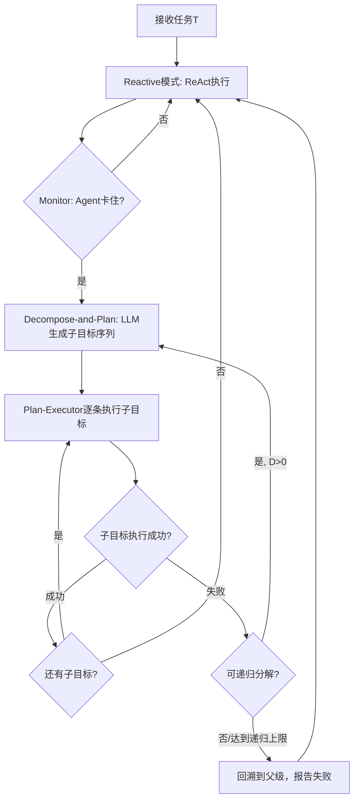

## 领域综述

### 待补充：阶段性领域总结
请补充一篇纵观一段时间以来的总结性文档，建议使用 `!INCLUDE_RAW path/to/article.md` 引入人工筛选后的 Markdown。

## 最新进展综述

### 待补充：最近一个月最新动向
请补充最近一个月该领域最新动向的综述文档，建议使用 `!INCLUDE_RAW path/to/article.md` 引入人工筛选后的 Markdown。

## 算法演化关系

```yaml
nodes:
- id: zero_shot_planner
  x: 80
  y: 80
  category: foundation
- id: inner_monologue
  x: 170
  y: 80
  category: foundation
- id: react
  x: 240
  y: 170
  category: reactive
- id: reflexion
  x: 330
  y: 440
  category: closed_loop
- id: rap
  x: 380
  y: 260
  category: search
- id: adaplanner
  x: 430
  y: 440
  category: closed_loop
- id: rewoo
  x: 470
  y: 350
  category: decomposition
- id: llm_dp
  x: 560
  y: 350
  category: decomposition
- id: lats
  x: 650
  y: 260
  category: search
- id: adapt
  x: 730
  y: 350
  category: decomposition
- id: llm_compiler
  x: 810
  y: 350
  category: decomposition
- id: devils_advocate
  x: 860
  y: 440
  category: closed_loop
- id: wkm
  x: 920
  y: 260
  category: search
- id: system_1_x
  x: 1000
  y: 260
  category: search
- id: plan_and_act
  x: 1080
  y: 350
  category: decomposition
- id: preflect
  x: 1160
  y: 440
  category: closed_loop
- id: lwm_planner
  x: 1220
  y: 260
  category: search
- id: tape
  x: 1240
  y: 440
  category: closed_loop
edges:
- from: zero_shot_planner
  to: inner_monologue
  label: 接入反馈
- from: inner_monologue
  to: react
  label: 通用闭环
- from: react
  to: reflexion
  label: 失败记忆
- from: react
  to: rap
  label: 搜索规划
- from: react
  to: adaplanner
  label: 显式改写
- from: react
  to: rewoo
  label: 先计划后做
- from: react
  to: llm_dp
  label: 神经符号
- from: rap
  to: lats
  label: 接入环境
- from: rewoo
  to: adapt
  label: 递归分解
- from: rewoo
  to: llm_compiler
  label: 并行编排
- from: reflexion
  to: devils_advocate
  label: 预判失败
- from: rap
  to: wkm
  label: 知识建模
- from: rap
  to: system_1_x
  label: 快慢混合
- from: adapt
  to: plan_and_act
  label: 双层执行
- from: devils_advocate
  to: preflect
  label: 前瞻反思
- from: lats
  to: lwm_planner
  label: 事实前瞻
- from: adaplanner
  to: tape
  label: 反馈重规划
- from: plan_and_act
  to: tape
  label: 约束执行
milestones:
- react
- lats
- tape
```

## 核心算法

### Zero-Shot Planner

```yaml
id: zero_shot_planner
num: 1
name: Zero-Shot Planner
full_name: 零样本规划器 (Language Models as Zero-Shot Planners)
year: '2022.01'
org: UC Berkeley
parent: —
paper_url: https://arxiv.org/abs/2201.07207
project_url: ''
category: foundation
motivation: 首次把LLM直接用于高层任务分解
```

#### 📝 一句话总结
Zero-Shot Planner 证明了大语言模型即使不做任务专门训练，也能直接把自然语言目标分解成一串可执行高层动作，并通过动作翻译与迭代重规划，把预训练语言知识转成具身任务中的 planning prior。

#### 🎯 核心要点
- 核心目标是把预训练语言模型中的常识顺序知识直接拿来做 embodied planning，而不是重新训练任务专用策略。
- 规划流程分三步：LM 先生成自由文本计划，再把自然语言步骤翻译成环境允许的动作集合，最后按执行反馈迭代重规划。
- 使用“admissible actions”约束，解决 LM 输出自由文本与机器人/模拟器动作空间不一致的问题。
- 通过 prompt 工程让模型学会把长目标拆成短步骤，例如“找到锅、打开炉子、加热”等高层动作序列。
- 在虚拟家务与机器人操作场景中验证，说明语言模型对“动作顺序”的世界知识可直接迁移到 planning。
- 论文的重要意义不在精细控制，而在首次把 LLM 当成高层 planner，而不是只当问答模型或文本生成器。

#### 🔬 深入细节

*图：论文展示了从自然语言目标到高层文本计划、再到可执行动作序列的整体链路。*

```python
# Zero-Shot Planner 的抽象流程
goal = task_description
history = []

while not task_finished(goal, history):
    # 1) 让语言模型直接生成下一段高层计划
    free_form_plan = llm.plan(goal, history)

    # 2) 把自由文本步骤翻译到环境允许动作
    action_seq = translate_to_admissible_actions(free_form_plan, action_set)

    # 3) 执行动作并记录反馈
    for action in action_seq:
        obs = env.step(action)
        history.append((action, obs))
        if needs_replan(obs):
            break
```

Zero-Shot Planner 的出发点非常朴素：大语言模型在海量文本里已经见过“做一顿饭”“清理桌面”“把东西收纳好”这类任务的常见步骤顺序，因此它天然拥有某种高层 planning prior。论文问的不是“能不能让 LM 学会控制机器人”，而是“能不能先把它当成一个零样本的高层规划器”，把这种顺序知识直接抽出来。

具体做法上，模型先根据任务描述输出自由形式的文本计划，例如 “walk to the kitchen, find the pot, turn on the stove”。这一步不要求动作必须严格符合环境 API，因此生成更自然、更接近语言模型原本擅长的分解方式。随后系统再把这些自由文本步骤映射到环境允许的 admissible actions，解决语言空间与动作空间之间的接口问题。

真正让它成为 agent 范式起点的，是“先规划、再翻译、再按反馈重规划”这条链路。它虽然还没有 ReAct 那样完整的 thought-action-observation 闭环，也没有后来的树搜索、反思、工作记忆，但已经把 LLM 明确放进了 agent 控制栈的最上层，让模型负责“决定先做什么、后做什么”。

从后续演化看，Inner Monologue 把环境反馈写回语言回路，ReAct 把推理与行动交错起来，RAP/LATS 则进一步引入搜索。Zero-Shot Planner 的历史价值就在这里：它是“LLM 做高层规划”这条主线的第一块地基。

> 💡 关键：论文关注的是 high-level planning，不是 low-level control；LM 输出的是“步骤顺序知识”，不是电机级动作。

> ⚠️ 注意：由于自由文本计划仍需动作翻译，这一方法很依赖 action grounding 的质量；如果翻译错误，LM 的高层计划再合理也无法可靠落地。

#### 🧪 练习题
```yaml
question: "Zero-Shot Planner 相比后来的 ReAct，最核心的定位差异是什么？"
options:
  - "它主要解决低层运动控制，而不是高层规划"
  - "它先生成高层文本计划，再做动作翻译，还没有完整的交错式行动闭环"
  - "它依赖大规模强化学习训练后才能规划"
  - "它完全不使用自然语言，而是直接生成 PDDL"
answer: 1
explain: "Zero-Shot Planner 的关键贡献是把 LLM 当作零样本高层 planner；它先产出自由文本计划，再翻译成可执行动作，尚未发展成 ReAct 式的交错闭环。"
```

### Inner Monologue

```yaml
id: inner_monologue
num: 2
name: Inner Monologue
full_name: 内心独白 (Inner Monologue)
year: '2022.07'
org: Google
parent: zero_shot_planner
paper_url: https://arxiv.org/abs/2207.05608
project_url: ''
category: foundation
motivation: 把环境反馈写回语言规划回路
```

#### 📝 一句话总结
Inner Monologue 提出将环境反馈（成功检测、场景描述、人机对话）以自然语言形式注入大语言模型的规划闭环，使得 LLM 能在具身机器人任务中根据实时反馈进行重规划和纠正，大幅提升了长程操作与导航任务中对抗干扰的鲁棒性。

#### 🎯 核心要点
- 首次系统地将三种环境反馈——**成功检测（Success Detection）**、**被动场景描述（Passive Scene Description）**、**主动场景描述（Active Scene Description）**——统一以自然语言注入 LLM 规划回路，构成「内心独白」闭环
- 提出**高层次指令→LLM 分解为可执行步骤序列**的架构，LLM 输出结构化文本（如 `put the blue block on the yellow bowl`），由低层控制策略执行
- 在三个不同具身场景验证：**模拟桌面重排**（Ravens）、**真实桌面重排**、**真实厨房移动操作**，分别使用 InstructGPT、Code as Policies 等方法
- 通过对抗扰动实验（人为移动物体、任务中途换指令）证明闭环反馈能实现**零样本重规划**，比开环方法提升 20%–50% 的指令完成率
- 探索了 emergent capabilities：LLM 可根据场景描述主动调整策略（如识别物体缺失并报告用户）、在部分可观测环境中持续查询环境状态

#### 🔬 深入细节
##### 核心框架：LLM + 环境反馈闭合回路

Inner Monologue 的核心思想受 Vygotsky 心理学中「内心独白」启发——人在执行复杂任务时通过自我对话来监控和调整行为。作者将其映射到机器人规划中：**LLM 规划器在每一步不仅接收任务指令和当前状态，还会接收由环境返回的自然语言反馈，从而形成「规划→执行→反馈→重规划」的闭环。**


*图：Inner Monologue 总体框架示意。LLM 规划器接收人类指令和每一步的环境反馈（成功检测、场景描述、人机问答），输出可执行步骤序列给机器人底层控制策略。*

##### 三种反馈源

论文将环境反馈分为三类，三者可单独或组合使用：

**1. 成功检测（Success Detection）**
- 形式：二分类语义信号，判断底层技能 π_k 是否成功执行
- 模拟环境中用 ground-truth 状态自动判断；真实环境中用训练好的成功分类器（基于图像）
- 将结果以自然语言注入：「Skill `pick blue block` succeeded.」或「Skill `place blue block` failed.」

**2. 被动场景描述（Passive Scene Description）**
- 每步自动向 LLM 提供结构化的场景语义信息
- 例如：「The objects currently visible are: red block, blue block, yellow bowl, green bowl.」
- 在桌面重排任务中来自物体识别器；在厨房移动操作中来自 VQA 模型对场景的语义描述

**3. 主动场景描述（Active Scene Description）**
- LLM 规划器可以主动向环境发出自然语言查询
- 由人类或预训练的 VQA 模型回答开放式问题
- 论文中称为「Human feedback」模式——例如 LLM 可以问「Which bowl is the largest?」，人类回答「The yellow bowl.」，LLM 据此调整规划

> 💡 关键：三种反馈本质上是让 LLM 获得一个不断更新的「世界状态描述」，而非仅靠初始指令和自身知识库进行一步式推理。这是从开环规划到闭环控制的关键跃迁。

##### 算法流程（伪代码）

```text
# Inner Monologue 主循环
init_state, instruction, history = get_state(), get_instruction(), []
step = 0

while not task_complete and step < max_steps:
    # 1. 获取环境反馈
    success_fb  = success_detector(current_state)       # "success" / "failure"
    scene_fb    = scene_descriptor(current_state)       # 被动场景描述
    active_query = llm_generate_query(history)          # LLM 可选地主动查询
    active_fb   = human_or_vqa_answer(active_query)     # 主动场景描述

    # 2. 构建 prompt: 指令 + 历史 + 反馈
    prompt = construct_prompt(instruction, history,
                              success_fb, scene_fb, active_fb)

    # 3. LLM 规划: 输出可执行步骤
    llm_output = llm_planner(prompt)   # e.g. "pick red block"

    # 4. 解析并执行
    action = parse_action(llm_output)
    if action == "done": break

    new_state, skill_ok = low_level_policy(action, current_state)

    # 5. 更新历史与状态
    history.append({"out": llm_output, "success": skill_ok})
    current_state = new_state; step += 1
```

*伪代码：Inner Monologue 的规划-执行-反馈闭环。LLM 在每个时间步接收三种自然语言反馈，根据完整历史进行下一步规划。*

##### 核心机制深入

**动机与背景**：传统 LLM 在机器人规划中的用法是「给出指令 → LLM 一次性分解为动作序列 → 机器人执行」。这种方法（如 SayCan、Code as Policies）有两个致命弱点：(1) 对环境状态变化的**零容忍**——执行中若物体被移动、任务目标变化，LLM 完全无法感知；(2) **部分可观测性**无法处理——LLM 无法在任务途中查询当前场景的具体状态。Inner Monologue 的动机正是将控制理论中已充分验证的「闭环反馈」原理引入 LLM 规划，用自然语言作为反馈载体。

**为什么是自然语言反馈？** 论文的关键洞察：LLM 已经在海量文本上预训练，自然语言是其最自然的「感知模态」。与其费力将多模态感知（图像、深度等）向量化后注入 LLM（如 PaLM-E 做法），不如利用已有的视觉识别器、VQA 模型等将感知结果翻译为**自然语言文本**，直接拼接到 prompt 中。这样做有三个优势：(1) 无需重新训练或微调 LLM；(2) 充分利用了 LLM 的常识推理能力；(3) 人机交互对人类也同样可读。

**Prompt 的结构设计**：每个环境中 prompt 包含四个部分：
1. **角色设定**（如「You are a robot that can manipulate objects on a table」）
2. **可用技能列表**（如 `pick(object)`, `place(object, location)`, `done()`）
3. **少样本示例**（1–3 个完整任务轨迹作为 in-context example）
4. **当前环境反馈**（动态变化，每步更新）

**对抗扰动实验**：论文在模拟环境中设计了极具挑战性的场景——(a) 执行中实验者主动移动目标物体位置；(b) 任务中途变更指令（如「把蓝色积木放进蓝色碗」→「把蓝色积木放进黄色碗」）。开环方法毫无反应，而 Inner Monologue 能够根据场景描述检测到物体位置变化或指令变更，自动重规划并完成任务，成功率从约 30% 提升至约 80%。

> ⚠️ 注意：Inner Monologue 的效果高度依赖于各反馈模块（物体识别器、成功检测器）的准确度。论文中指出的主要失败模式包括：(1) 成功检测误判（false positive 引入对抗性部分可观测；false negative 导致不必要重试）；(2) LLM 偶尔「忽略」环境反馈，继续计划使用已不存在的物体；(3) 底层控制策略的能力瓶颈限制了 LLM 的规划范围。

**三个实验场景的差异化实现**：

| 维度 | 模拟桌面 (Ravens) | 真实桌面 | 厨房移动操作 |
|------|------------------|---------|------------|
| LLM 方法 | InstructGPT | Code as Policies | LLM 高层规划 + Affordance 低层 |
| 成功检测 | Ground-truth / CLIP | 人标注 | 视觉分类器 |
| 场景描述 | 物体识别器 | 物体识别器 | VQA 模型 |
| 关键挑战 | 对抗扰动 | Real-world noise | 长程任务 + 部分可观测 |

##### 与传统方法的区别

| 方法 | 反馈形式 | 重规划能力 | 依赖 |
|------|---------|----------|------|
| SayCan | 无环境反馈 | 无 | 固定价值函数 |
| Code as Policies | 无显式反馈 | 有限（代码可含条件） | LLM 代码生成能力 |
| **Inner Monologue** | **自然语言三通道反馈** | **连续重规划** | **多个感知模型 + LLM** |
| PaLM-E | 多模态向量 | 有限 | 多模态大模型训练 |

Inner Monologue 的独特贡献在于：**用已有的单模态能力组件（物体识别、VQA、LLM）通过自然语言接口拼接出多模态闭环能力，无需端到端训练新的多模态模型**。

#### 🧪 练习题
```yaml
question: "Inner Monologue 中三种环境反馈的核心作用是什么？"
options:
  - "提升 LLM 的代码生成质量"
  - "以自然语言将环境状态变化注入 LLM 规划回路，实现闭环重规划"
  - "替代低层控制策略，直接输出机器人关节角度"
  - "减少 LLM 推理时所需的 token 数量"
answer: 1
explain: "成功检测、被动和主动场景描述三种反馈本质都是将环境状态以自然语言输入 LLM，使其能在执行中感知变化并重规划，这是开环→闭环的关键创新。"
```

### ReAct

```yaml
id: react
num: 3
name: ReAct
full_name: 推理-行动协同 (ReAct)
year: '2022.10'
org: Google
parent: —
paper_url: https://arxiv.org/abs/2210.03629
project_url: ''
category: reactive
motivation: 交错生成思考行动观测主循环
```

#### 📝 一句话总结
ReAct是一种让大语言模型在生成行动的同时穿插"思考文本"的提示范式——通过将动作空间扩展为"实际动作+推理轨迹(thought)"，使模型在知识推理任务中能用工具消除幻觉、在交互决策任务中能用推理引导探索，仅需1-2个示例即可超越训练了10^3~10^5条轨迹的模仿学习/强化学习方法。

#### 🎯 核心要点
- 原始动作空间 $\mathcal{A}$（与外部环境交互，产生Observation）
- 扩展后 $\hat{\mathcal{A}}=\mathcal{A} \cup \mathcal{L}$，其中 $\mathcal{L}$ 是自然语言空间
- 在语言空间中的动作 $\hat{a}_t \in \mathcal{L}$ 称为"思维/推理轨迹"，其目的不是影响环境，而是通过推理组合有用信息

#### 🔬 深入细节

*图：ReAct 的核心框架或评测示意。*

##### 1. 范式对比：图1核心示意图

图1展示了同一条HotpotQA问题在4种范式下的行为对比：

- **(a) Standard**：直接生成答案 → 无推理无交互，容易出错
- **(b) CoT（仅推理）**：生成推理链后答案 → 纯内部推理，可能产生幻觉（如对"Apple Remote"的错误事实描述）
- **(c) Act-only（仅行动）**：反复搜索Wikipedia → 缺乏推理，会生成无效搜索或无法融合信息
- **(d) ReAct（推理+行动）**：Thought分析需要搜索什么 → Action调Wikipedia API → Observation返回结果 → Thought分析结果发现需要更多信息 → 继续搜索 → 最终生成答案。**轨迹可读、可溯源、可纠错**

##### 2. 核心算法框架（伪代码）

```
输入: 任务描述 + Few-Shot示例(含Thought→Action→Observation交替)
初始化: context ← [task_prompt, few_shot_examples]

循环直到终止:
    response ← LLM.generate(context)  # 生成下一段文本
    if response是Thought:
        将 Thought 追加到 context  # 不与环境交互
    elif response是Action:
        执行Action于环境，获得Observation
        将 Action + Observation 追加到 context
    elif response是结束标记(Answer/Finish):
        输出最终答案/动作，退出循环
```

**关键设计**：
- Thought和Action在token级别由LLM自行决定何时产生（通过few-shot示例中的模式引导）
- 当遇到知识密集型任务（HotpotQA），ReAct会交替搜索多个子问题并逐步合成答案
- 当遇到具身任务（ALFWorld），ReAct先用Thought分解子目标（"我需要找到并拿起一个干净的苹果"），再生成低级动作（go to fridge, open fridge, take apple...）

##### 3. 不同任务的ReAct轨迹深度分析

**(a) 知识推理任务 — HotpotQA（多跳问答）与Fever（事实验证）**
- 动作空间：`search[entity]`（查询Wikipedia）、`lookup[string]`（在当前页面内精确定位）、`finish[answer]`
- ReAct vs CoT关键优势：当模型内部知识错误或缺失时，ReAct通过搜索外部知识库自动纠偏。例如"Apple Remote"的制造商问题，CoT幻觉为"由Apple Inc.制造"，而ReAct搜索后纠正为"由Universal Electronics制造"
- ReAct vs Act-only：Act-only容易陷入"搜索→无结果→继续搜索→循环"的困境；ReAct的Thought能在搜索前明确意图，在搜索后评估信息充分性
- **Hallucination消减**：Fever任务上，纯CoT的幻觉率显著更高；ReAct通过显式搜索Wikipedia API，将错误信息替换为可验证的外部证据

**(b) 交互决策任务 — ALFWorld（具身AI）与WebShop（网页购物）**
- ALFWorld动作空间：`goto[location], open[object], close[object], take[object], put[object], clean[object], heat[object], cool[object]`
- ALFWorld空间庞大、奖励稀疏，纯RL需要大量交互训练
- ReAct的Thought发挥**稀疏奖励下的推理引导**作用：将高级目标分解为低级子任务序列，例如"任务是加热一个土豆"→分解为：找土豆→取土豆→找微波炉→放进去→加热
- WebShop动作空间：搜索、点击产品、选择选项、购买
- ReAct的Thought帮助权衡产品属性与用户需求，生成类似人类购物决策的推理轨迹

##### 4. 详细的定量结果

**HotpotQA + Fever（Table 1 & 2）**：
| 方法 | HotpotQA EM/F1 | Fever Acc |
|------|---------------|-----------|
| Standard | 25.7/33.8 | 51.0 |
| CoT | 29.4/35.1 | 56.3 |
| CoT-SC | 33.8/40.8 | 60.4 |
| Act | 25.2/25.9 | 58.9 |
| ReAct | 27.4/35.8 | 54.6 |
| **ReAct→CoT-SC** | **35.1/42.0** | **64.6** |

- 纯ReAct在某些任务上不如CoT-SC（内部知识更全面时），但ReAct的轨迹更**基于证据**、**幻觉更少**
- **ReAct→CoT-SC**：先运行ReAct收集外部信息，再将完整的ReAct轨迹+检索到的证据输入CoT-SC进行最终推理，达到SOTA

**ALFWorld（Table 3）**：
| 方法 | 示例数 | 成功率 |
|------|--------|--------|
| BUTLER (imitation) | 10^5 | 37% |
| BUTLER (BUTLER+RL) | 10^5 | 22% (探索失败) |
| Act (6-shot) | 6 | 45% |
| **ReAct (2-shot)** | 2 | **71%** |
| **ReAct (1-shot)** | 1 | **62%** |

**仅需2个示例，超越10万条训练数据的系统，绝对提升34%！**

**WebShop（Table 4）**：
| 方法 | 成功率 | Reward |
|------|--------|--------|
| IL | 29.1% | 62.4 |
| IL+RL | 28.7% | 62.3 |
| Act (1-shot) | 30.1% | 61.5 |
| **ReAct (2-shot)** | **40.0%** | **66.6** |

**仅需2次示例提升10%成功率，且Reward显著更高（购买的商品更匹配需求）。**

##### 5. ReAct的内部工作原理与消融实验

- **Thought的评分机制**：ReAct在生成Thought时，通过计算该Thought对未来动作的**互信息增益**来判断是否需要更深度的推理——如果当前上下文已经足够做出正确动作，则跳过冗长推理
- **内部推理 vs 外部搜索的互补**（Table 5）：消融实验显示，当知识存于内部（模型预训练中已学到），CoT更优；当知识仅存于外部（罕见/新知识），ReAct显示必要性。最优策略是**先用ReAct获取外部信息，再用CoT集成内外部知识**（ReAct→CoT-SC）
- **Thought的必要性实验**（Table 7）：移除所有Thought（变为纯Act），在ALFWorld上成功率大幅下降；验证了在交互任务中推理对动作生成的关键支撑
- **微调实验**（§4-6）：在HotpotQA上用3K条ReAct轨迹微调PaLM-8B和PaLM-62B，微调后的ReAct模型在域内任务上性能大幅提升，且**对Prompt中示例数量的敏感度降低**

##### 6. 失败模式与局限性

- **推理受阻**：LLM有时会陷入重复生成相同Thought的循环（如反复说"我需要搜索更多"但不行动），论文通过限制最大步数截断
- **搜索失败**：对外部API返回无结果时，模型有时无法优雅处理，继续尝试相似查询
- **长轨迹遗忘**：超过15步后，模型倾向于遗忘早期Observation或产生不一致推理
- **幻觉在执行中**：即使推理正确，生成的具体Action有时包含幻想的地点/物品名（尤其在ALFWorld中）
- **微调的潜在方向**：Prompt范式受限于LLM固有的推理和行动能力边界，通过微调可以进一步扩展

##### 7. 与相关工作的关系

- **CoT (Wei et al., 2022)**：ReAct将CoT的"推理链"嵌入到与环境的交互循环中，从纯推理范式扩展为感知-推理-行动循环
- **SayCan / Inner Monologue**：机器人领域的语言指导动作，ReAct提供更统一的Prompt范式
- **Toolformer (Schick et al., 2023)**：通过自监督学习API调用，ReAct采用无需训练的Prompt方式实现工具使用
- **AutoGPT / LangChain Agent生态**：直接继承了ReAct的"Thought-Action-Observation"范式

#### 🧪 练习题
```yaml
question: "ReAct 的核心范式差异是什么？"
options:
  - "让模型只负责检索，不再做语言推理"
  - "把推理文本当作内部动作，与外部 Action/Observation 交错出现"
  - "先生成完整计划，再完全离线执行"
  - "把所有决策都交给符号规划器"
answer: 1
explain: "ReAct 的关键就在于 Thought 不是最终答案，而是会进入后续上下文的内部动作，与真实环境中的 Action 和 Observation 交替形成闭环。"
```

### Reflexion

```yaml
id: reflexion
num: 4
name: Reflexion
full_name: 语言反思强化 (Reflexion)
year: '2023.03'
org: Northeastern
parent: react
paper_url: https://arxiv.org/abs/2303.11366
project_url: ''
category: closed_loop
motivation: 把失败教训写入记忆驱动重试
```

#### 📝 一句话总结
Reflexion 是一种不更新模型参数、仅通过**自然语言反思文本**将试错失败的经验注入后续推理上下文的强化学习框架：LLM Agent 行动失败后，自动生成“自我反思”存入跨回合记忆，下一轮迭代作为语义引导纠正错误决策，由此在 AlfWorld、HotPotQA、HumanEval 等任务上实现 11%–22% 的绝对提升。

#### 🎯 核心要点
- **语言化强化（Verbal RL）**：把 RL 的奖励信号转化为自然语言反思文本，以“语义梯度”替代数值梯度，全程不涉及模型权重更新
- **三组件闭环架构**：Actor（LLM 生成决策）→ Evaluator（环境或启发式判定成败）→ Self-Reflection（LLM 分析失败根因，输出一段操作性反思文本）
- **跨 Episode 记忆缓冲**：失败反思存入滑动窗口式的 Episodic Memory Buffer，下轮推理时拼入 prompt 前缀，形成“试错→反思→重试”的累积学习循环
- **多层反思粒度**：支持动作级反思（单步错误）和轨迹级反思（全局策略缺陷），并以链式多轮反思叠加构建高层元反思
- **多源头反馈信号**：支持二元环境信号、手写启发式规则、LLM 自评分类、自写单元测试等多种评估方式，灵活适配不同任务
- **全新基准 LeetcodeHardGym**：贡献 40 道 Leetcode Hard 级编程题的 RL Gym 环境，覆盖 19 种编程语言
- **三个领域 SOTA 提升**：AlfWorld +22%（134 任务 12 轮迭代后 130/134 解决），HotPotQA +20%，HumanEval pass@1 达 91%（超越 GPT-4 的 80%）

#### 🔬 深入细节
##### 核心框架图


*图：Reflexion 在决策、编程、推理三类任务上的工作示意——Agent 经试错、自我反思、记忆回注三阶段累积改进*

##### 算法伪代码

```python
# Reflexion 核心循环
buffer = []  # 跨 Episode 的反思记忆（滑动窗口，默认保留最近 3 条）

for episode in range(max_episodes):
    # 1. 构建 prompt：任务指令 + 历史反思 + 当前观测
    prompt = build_prompt(task_desc, observation, buffer)

    # 2. Actor 执行轨迹
    trajectory = []
    for step in range(max_steps):
        action = llm_actor(prompt, observation)     # LLM 生成思考+动作
        observation, reward, done = env.step(action)
        trajectory.append((action, observation, reward))
        if done: break

    # 3. Evaluator 判定结果
    result = evaluator(trajectory)   # 二值/等级/启发式
    if result == SUCCESS:
        break  # 任务完成

    # 4. Self-Reflection：失败轨迹 → 自然语言反思
    reflection = llm_reflect(trajectory, result)
    buffer.append(reflection)

    # 5. 滑动窗口截断，防止 prompt 超长
    if len(buffer) > MAX_BUFFER_SIZE:
        buffer = buffer[-MAX_BUFFER_SIZE:]
```

##### 核心机制拆解

**1. 动机与背景——跨回合信息断层的难题**

传统 LLM Agent 框架（如 ReAct）尽管能够在单次 Episode 内进行“推理-行动-观察”的循环，但**不同 Episode 之间完全独立**——Agent 可能在完全相同的位置重复犯同样的错误（如 AlfWorld 中反复误判“我已持有该物品”）。基于梯度微调的方案（RLHF/PPO）可以全局改善行为，但计算开销巨大、需大量训练数据，无法按单个任务实时调整。

Reflexion 的核心洞察在于：**LLM 本身已具备从文本中理解自身错误并生成改进策略的元能力**（如“Let’s think step by step”现象），只需系统化地将其置入跨 Episode 的记忆流转循环，即可在不触碰权重的前提下实现定向行为优化。

**2. 反思生成——从失败轨迹到可操作策略**

Self-Reflection 模块复用同一 LLM，但切换角色指令：输入为完整失败轨迹（动作序列、环境反馈、最终失败结果），要求模型分析“哪里出错”及“下次如何改进”。生成的反思文本高度语义化，例如：

> *“在上次尝试中，我误以为已经取到了苹果，实际上 Take 操作失败了。下次进入厨房后，应先用 Look 确认物品是否在手中，再执行后续搬运操作。”*

反思按粒度分为三层：
- **简单反思**：一句指出错误类型（“我没有打开所有抽屉就断言物品不存在”）
- **分析式反思**：详述根因并给出具体策略调整
- **链式反思**：多轮失败后追加元反思（“我连续三次浪费时间在已检查过的柜子上，应记录已探索位置并优先搜索新区域”）

为确保反思质量，实践中会做**长度过滤**（去除空洞套话）、**可操作性校验**（必须提及具体错误步骤和改进动作），并且反思 prompt 经过精心设计以引导模型产出指向性明确的文本。

**3. 与传统方法的核心区别**

| 维度 | Reflexion | ReAct | RLHF / PPO | RAG |
|------|-----------|-------|------------|-----|
| 学习方式 | 语言反思文本 | 无跨回合学习 | 梯度更新参数 | 检索外部文档 |
| 参数更新 | ❌ 完全冻结 | ❌ | ✅ 永久改变 | ❌ |
| 记忆来源 | 运行时动态生成 | — | 训练语料 | 固定知识库 |
| 针对性 | 当前任务高度特化 | — | 泛化到同类任务 | 通用知识 |
| 计算成本 | 极低（仅额外 prompt token） | 低 | 高（需 GPU 集群） | 中（需向量库） |

Reflexion 可视为在 ReAct 外层套上一个“跨回合学习循环”，将其从单次推理器升级为能够在连续试错中积累经验的自治 Agent。与思维树（ToT）/思维图（GoT）的单回合多路径并行搜索不同，Reflexion 利用**历史轨迹的语义压缩**，在纵向的多个 Episode 间串行积累。

**4. 评估器（Evaluator）的灵活分层设计**

Reflexion 支持三种评估方式以适应不同任务特性：

- **环境二元信号**：适用于有明确终点的任务（AlfWorld 目标物品是否正确放置、HumanEval 代码是否通过所有测试用例）
- **启发式规则**：捕获常见失败模式，如 AlfWorld 中同一动作重复 >3 次或轨迹长度超过 30 步的“无效规划”检测
- **LLM 自评**：对开放式任务（HotPotQA 问答质量），用 LLM 作二元分类器判断回答是否正确，或采用 EM/F1 等启发式指标

多评估源可以混合使用，例如在 AlfWorld 中环境信号用于终点判定，启发式规则用于中途触发内部反思。

**5. 训练/推理流程**

Reflexion **零训练**——整个流程在推理时完成，模型权重完全冻结。部署只需设计三组提示词模板：
- **Actor 指令**：任务描述 + 工具/环境约束 + 思考-行动格式
- **Evaluator 规则**：判定成功条件和失败触发阈值
- **Self-Reflection 指令**：要求分析失败根因并给出可操作的改进策略

数据流：每 Episode 开始 → Actor 读取当前观测 + 历史反思 → 生成动作 → 环境执行 → 轨迹收集 → Episode 完成 → Evaluator 判定 → 若失败，Reflector 生成反思追加到 Buffer → 下轮开始。Buffer 默认保留最近 3 条反思，可通过聚类或摘要压缩扩展长程记忆。

**6. 关键实验结果**

- **AlfWorld（具身决策）**：134 个家务任务中，ReAct + Reflexion 在 12 轮迭代后累计解决 130 个（+22%），而单纯 ReAct 在 6-7 轮后提升停滞。分析表明 Reflexion 几乎消除了“误以为持有物品”导致的幻觉型失败。
- **HotPotQA（多跳推理）**：Reflexion + CoT 实现 Q→A 和 (Q, C_gt)→A 模式下的显著提升，使模型能从检索策略缺陷中自我调整，改进信息覆盖率和答案准确率。
- **HumanEval & LeetcodeHard（代码生成）**：Reflexion 在 HumanEval 上 pass@1 达 91%（GPT-4 基线 80%），在面对 40 道 Leetcode Hard 题时也能基于编译/测试错误生成有效的“self-debugging”反思，第二轮生成通过率大幅跃升。
- **消融实验**：仅靠“重试”无反思的基线几乎无提升；静态提示（“请更仔细”）改进微弱；只有**基于失败轨迹动态生成的具体反思**才能产生显著效果。

> 💡 **关键洞察**：Reflexion 的核心力量不在于让模型“某一次想得更清楚”，而在于构建了一个**跨 Episode 的语义信息通道**——反思文本作为压缩后的经验载体，将连续试错从独立的骰子游戏转变为对正确答案的定向逼近。

> ⚠️ **注意**：反思质量高度依赖 LLM 的自评能力。如果模型无法准确分析自身失败原因，反思可能引入噪音甚至误导后续尝试。实践中需对反思做基础校验（长度裁剪、空话过滤），且反思 prompt 需设计明确指令（“指出哪个具体步骤出错、原因是什么、下次如何做不同”）。此外，Reflexion 不提供形式化的收敛保证——其可靠性随 LLM 能力提升而增长。

#### 🧪 练习题
```yaml
question: "Reflexion 与 ReAct 最核心的区别是什么？"
options:
  - "Reflexion 使用更大的语言模型"
  - "Reflexion 在 ReAct 外层增加了跨 Episode 的自我反思与记忆回注循环"
  - "Reflexion 仅能用于代码生成任务"
  - "Reflexion 需要进行额外的模型微调"
answer: 1
explain: "ReAct 在每个 Episode 内进行推理-行动循环，但 Episode 间完全独立；Reflexion 在 ReAct 外层追加了失败反思生成和跨回合记忆注入机制，使 Agent 能从历史错误中累积学习。"
```

### RAP

```yaml
id: rap
num: 5
name: RAP
full_name: 通过规划进行推理 (Reasoning via Planning)
year: '2023.05'
org: UC San Diego
parent: react
paper_url: https://arxiv.org/abs/2305.14992
project_url: ''
category: search
motivation: 将LLM重塑为世界模型并做MCTS
```

#### 📝 一句话总结
RAP 将大语言模型的推理过程重新定义为马尔可夫决策过程（MDP），引入世界模型与蒙特卡洛树搜索（MCTS）进行战略性前瞻探索，从而替代传统从左到右的链式解码，显著提升了数学推理、逻辑推理和规划任务的准确性。

#### 🎯 核心要点
- 将 LLM 推理建模为 **MDP**：状态为当前推理上下文（中间步骤序列），动作为推理子步骤的生成
- 引入 **世界模型（World Model）**：利用 LLM 自身模拟状态转移，预测采取某动作后的下一个推理状态
- 设计 **多层次奖励函数**：包含自评估奖励（Self-evaluation）、动作似然奖励（Action Likelihood）、任务特定奖励（Task-specific）和置信度奖励（Confidence）
- 提出 **MCTS 四阶段搜索**：选择（Selection）→ 扩展（Expansion）→ 模拟（Simulation）→ 反向传播（Backpropagation），在推理树中进行前瞻探索
- 提出 **RAP-Aggregate** 方法：聚合多条高奖励推理路径，进一步提升推理准确性
- 在 GSM8k（数学推理）、PrOntoQA（逻辑推理）、Blocksworld（规划）三大基准上均取得显著提升

#### 🔬 深入细节
##### 1. 核心框架：推理即规划


*图：RAP 将推理建模为世界模型驱动的规划问题，并在推理树上执行 MCTS 前瞻搜索。*

RAP 的核心洞察是：**传统 LLM 推理采用自回归式一步接一步生成，缺乏全局前瞻能力**，容易在推理早期走入死胡同而不自知。RAP 通过将推理重新定义为规划问题来解决这一根本缺陷：

- **状态 \(s_t\)**：当前推理上下文，包含已生成的所有中间步骤
- **动作 \(a_t\)**：从当前状态出发的下一步推理子步骤——例如数学推理中的下一行计算、逻辑推理中的下一跳推理、或规划任务中的下一个操作
- **策略 \(\pi(a|s)\)**：LLM 根据当前状态决定下一步动作的概率分布

> 💡 关键：这种 MDP 建模将推理从"被动生成"转变为"主动规划"——模型不再仅仅根据前缀预测下一个 token，而是基于当前状态评估多个可能的方向，再选择最优路径。

##### 2. 世界模型与状态转换

世界模型是 RAP 的基础组件之一，负责模拟动作的后果。在标准 MCTS 中，世界模型需要预测执行动作后环境将转移到的下一个状态。RAP 巧妙地**复用 LLM 自身作为世界模型**：

$$s_{t+1} = \text{LLM}(s_t, a_t)$$

具体而言，给定当前状态 \(s_t\)（例如 "Step 1: …\nStep 2: …"）和候选动作 \(a_t\)（例如 "下一步：计算 x + y = …"），世界模型将两者拼接后输入 LLM，生成下一个状态 \(s_{t+1}\)。这种设计使得世界模型天然具备语义理解能力，能够处理自然语言推理步骤中的复杂状态转换。

> ⚠️ 注意：与强化学习中精确的环境模型不同，RAP 的世界模型是概率性的且可能产生错误。这也正是 MCTS 需要探索多条路径的原因。

##### 3. 奖励函数设计

RAP 设计了**四类互补的奖励**来评估推理路径的质量：

**（1）自评估奖励（Self-evaluation Reward）**\(R_{\text{self}}\)：
LLM 本身对当前状态是否"在正确轨道上"给出置信度评分。Prompt 设计为：
- 给定问题、当前部分推理、可能的下步行动，评估该行动后状态是否合理
- 输出 0-1 之间的分数

**（2）动作似然奖励（Action Likelihood Reward）**\(R_{\text{action}}\)：
基于 LLM 生成动作时的对数似然来评估动作的"自然程度"：
$$R_{\text{action}}(a_t|s_t) = \frac{1}{|a_t|}\sum_{i=1}^{|a_t|} \log P_{\text{LLM}}(w_i|s_t, w_{<i})$$

这在结构化推理任务（如 Blocksworld 中的操作）中尤其有效，因为合理的动作通常具有更高的生成概率。

**（3）任务特定奖励（Task-specific Reward）**\(R_{\text{task}}\)：
根据任务目标定义的确定性奖励，例如 Blocksworld 中判断是否达到目标布局。这类奖励最为可靠但仅在规划类任务中可用。

**（4）置信度奖励（Confidence Reward）**\(R_{\text{conf}}\)：
评估状态转换的确定性，即 LLM 对生成下一个状态的置信度。这反映了世界模型对该状态预测的把握程度。

最终奖励为加权组合：
$$R(s_t, a_t, s_{t+1}) = w_1 R_{\text{self}} + w_2 R_{\text{action}} + w_3 R_{\text{task}} + w_4 R_{\text{conf}}$$

##### 4. MCTS 四阶段搜索

RAP 利用 MCTS 在推理树上执行**迭代式前瞻搜索**，每个节点存储访问次数 \(N(s)\) 和累计价值 \(Q(s)\)。每次迭代包含四个阶段：

```
# RAP MCTS 搜索算法
while not terminal and iterations < max_iter:
    # 阶段 1: 选择 (Selection)
    node = root
    while node.children:
        node = argmax_child(Q(child) + c_puct * P(child) * sqrt(N(parent)) / (1 + N(child)))
    
    # 阶段 2: 扩展 (Expansion)
    actions = LLM.generate_actions(node.state, k=top_k)
    for action in actions:
        next_state = WorldModel.predict(node.state, action)
        reward = RewardModel.evaluate(node.state, action, next_state)
        node.add_child(action, next_state, reward)
    
    # 阶段 3: 模拟 (Simulation)
    leaf = select_best_child(node)  # 基于奖励选择最有希望的子节点
    value = rollout(leaf.state, depth=simulation_depth)
    
    # 阶段 4: 反向传播 (Backpropagation)
    while node:
        node.N += 1
        node.Q += (value - node.Q) / node.N
        node = node.parent
```

**阶段 1 — 选择（Selection）**：从根节点开始，递归选择最优子节点直至到达未完全扩展的节点。选择策略使用 PUCT（Predictor + UCT）公式，平衡探索与利用。其中 \(P(\text{child})\) 是 LLM 对动作的先验概率，\(c_{\text{puct}}\) 控制探索强度。

**阶段 2 — 扩展（Expansion）**：利用 LLM 生成当前节点的 top-k 候选动作，通过世界模型预测每个动作产生的下一个状态，并计算即时奖励。每个（动作，状态）对被添加为当前节点的子节点。

**阶段 3 — 模拟（Simulation）**：从新扩展的节点中选择一条路径，进行有限深度的快速推演（rollout），利用奖励信号估计该路径的长期价值。模拟过程无需展开所有分支，大幅节省计算开销。

**阶段 4 — 反向传播（Backpropagation）**：将模拟得到的价值沿着搜索路径反向传播，更新所有经过节点的访问次数和平均价值。这确保了未来搜索时，被证明有效的节点会获得更高的选择优先级。

> 💡 关键：MCTS 的核心优势在于**战略性前瞻**——在推理早期就能检测到死胡同并返回尝试替代路径，类似于人类"先试探几步再决定方向"的思考模式。

##### 5. RAP-Aggregate：多路径聚合

MCTS 搜索结束后得到一棵推理树，RAP 从中提取多条高奖励路径（而非仅选最优的一条）进行聚合：

- 按访问次数和平均价值对所有叶节点排序
- 选取 top-m 条完整推理链
- 重新组合这些链条中的关键推理步骤，生成最终的聚合推理

这种方法类似于 Self-Consistency 的改进——不是简单地多数投票，而是基于搜索过程中的奖励信号选择高质量路径进行智能融合。在数学推理任务中，RAP-Aggregate 在 RAP 基础上额外提升了约 3% 的准确率。

##### 6. 实验表现

RAP 在三大推理基准上取得了显著提升：

| 任务 | 基准 (CoT/COT-SC) | RAP | RAP-Agg |
|------|--------------------|-----|---------|
| GSM8k 数学推理 | 39.2% / 44.3% | 48.8% | ~51.7% |
| PrOntoQA 逻辑推理 (整体证明正确率) | 8%~13% (CoT) | 65% | — |
| PrOntoQA 逻辑推理 (最终答案正确率) | — / 89.8% | 94.2% | — |
| Blocksworld (Llama-2 70B, 4步) | ~20% (CoT) | ~91% | — |

消融实验（Table 6, GSM8k 前300例）进一步揭示了奖励设计的重要性：
- 仅使用置信度奖励：RAP(1) = 0.350，RAP(10) = 0.447
- 置信度 + 动作似然奖励：RAP(1) = 0.373，RAP(10) = 0.423
- 置信度 + 自评估奖励（完整）：RAP(1) = **0.410**，RAP(10) = **0.450**，+Agg = **0.503**

自评估奖励在所有配置中均表现最优，且计算效率高，是 RAP 的核心驱动力。

#### 🧪 练习题
```yaml
question: "RAP 框架中，世界模型（World Model）主要用于完成什么功能？"
options:
  - "替代 LLM 直接生成最终答案"
  - "预测给定当前状态和动作后的下一个推理状态"
  - "计算 MCTS 搜索树中每个节点的访问次数"
  - "评估整个推理任务的最终难度等级"
answer: 1
explain: "RAP 中的世界模型复用 LLM 自身来模拟状态转换——给定当前推理状态s_t和候选动作a_t，预测下一步推理状态s_{t+1}。这使得系统能前瞻性地评估不同动作的后果，而无需实际执行到底。"
```

### AdaPlanner

```yaml
id: adaplanner
num: 6
name: AdaPlanner
full_name: 自适应规划器 (AdaPlanner)
year: '2023.05'
org: Georgia Tech
parent: react
paper_url: https://arxiv.org/abs/2305.16653
project_url: ''
category: closed_loop
motivation: 按反馈重写计划并断点续跑
```

#### 📝 一句话总结
AdaPlanner 提出基于代码生成的自适应闭环规划方法，让 LLM Agent 能根据环境反馈动态重写计划并断点续跑，在仅 1～2 次反馈迭代内显著超越 ReAct 等强基线。

#### 🎯 核心要点
- 将任务规划表达为可执行的 Python 代码（plan-as-code），而非自然语言步骤或 JSON 序列
- 引入自适应闭环规划：LLM 在每一步执行后根据环境反馈重写剩余计划，并能从断点续跑（in-progress re-planning）
- 设计两阶段规划生成：plan generation → plan refinement，refinement 阶段仅基于反馈增删改动最小代码块
- 引入代码级技能封装（skill library）：将高频环境操作（如 navigate, pick, put）抽象为预定义 Python 函数，LLM 只需组合调用
- 在 ALFWorld（6 个任务）和 MiniWoB++（多个网页任务）两个基准上全面评估，GPT-3.5 驱动的 AdaPlanner 在 ALFWorld 上平均成功率 85.7%（ReAct 64.6%），GPT-4 达 97.3%
- 对比多种规划范式：open-loop（一次生成全部计划）、implicit closed-loop（隐式闭环，如 ReAct 的 observation→action 循环）、explicit closed-loop（明确改写计划的闭环）

#### 🔬 深入细节
##### 核心示意图


*图：开环规划、隐式闭环（如 ReAct）、显式闭环（AdaPlanner）三者的对比。*


*图：从 ALFWorld 任务展示 AdaPlanner 通过代码表达计划并在环境反馈后调整。*

##### 算法伪代码

```
AdaPlanner 自适应闭环规划主循环（伪代码重建):
Phase 1: plan_code = LLM.generate_plan(task)
Phase 2 (on failure):
  LLM.refine_plan(task, plan_code, executed_steps, feedback)
  -- 仅修改失败相关代码块，跳过已执行的步骤
```

##### 动机与背景

传统方案（ReAct, SayCan）采用 open-loop 或 implicit closed-loop，缺乏显式计划级更新。AdaPlanner 核心洞察：计划应该是活的代码，而非死的文本。代码形式支持条件判断、循环，失败时精确修改而非重头思考。

##### 核心机制

**1. Plan-as-Code**: LLM 输出包含 plan() 函数和技能函数调用的 Python 代码。优势：天然控制流、利用代码语料先验、增量修改。

**2. Adaptive Closed-Loop**: 两阶段——Plan Generation（一次生成完整代码计划）→ Plan Refinement（失败时仅局部修改代码，保留已验证部分）。实现断点续跑+局部修复。

**3. Skill Library**: 预定义经过验证的技能函数（goto, take, clean, put 等），解耦高层推理与底层执行。

##### 与传统方法区别

| 维度 | Open-loop | ReAct | AdaPlanner |
|------|-----------|-------|------------|
| 计划形式 | 自然语言列表 | thought+action | Python 代码 |
| 闭环方式 | 无 | 每步观察后生成下一步 | 失败后重写剩余计划 |
| 断点续跑 | ❌ | ❌ | ✅ |
| 反馈利用 | 无 | 即时 | 即时+计划级调整 |

> 💡 关键：计划从静态文本升级为可执行可修改的代码对象。
> ⚠️ 注意：AdaPlanner 依赖环境提供结构化文本反馈，本身不涉及视觉感知。

##### 实验效果

- ALFWorld（6类任务）：GPT-3.5 成功率 85.7% vs ReAct 64.6%（+21.1pp），GPT-4 达 97.3%
- MiniWoB++：多步推理任务显著提升
- 消融实验：自适应闭环与代码表达各自独立贡献，组合效果最优，仅需 1-2 次反馈迭代

#### 🧪 练习题
```yaml
question: "AdaPlanner 的 plan-as-code 相比自然语言计划的核心优势是什么？"
options:
  - "代码执行速度比自然语言快 10 倍"
  - "代码允许 LLM 利用预训练代码语料，且支持控制流和局部修改"
  - "代码可以绕过环境反馈直接生成正确计划"
  - "代码消除了对 LLM 的所有依赖"
answer: 1
explain: "Plan-as-code 让 LLM 能利用代码语料的先验知识生成结构化计划，且天然支持条件判断/循环等控制流。失败时仅需局部修改代码块而非重写全局。"
```

### ReWOO

```yaml
id: rewoo
num: 7
name: ReWOO
full_name: 无观测推理 (ReWOO)
year: '2023.05'
org: Microsoft
parent: react
paper_url: https://arxiv.org/abs/2305.18323
project_url: ''
category: decomposition
motivation: 先产蓝图再执行工具减少串行依赖
```

#### 📝 一句话总结
ReWOO 提出将推理（Reasoning）与工具观察（Observations）解耦，先用 Planner 生成完整推理蓝图，再由 Worker 并行执行工具调用，最后 Solver 综合生成答案，从而消除了 ReAct 范式中的串行依赖，在 6 个基准上平均降低 64% token 消耗且绝对准确率提升 4.4%。

#### 🎯 核心要点
- 三模块架构：Planner（生成推理计划与工具调用蓝图）→ Worker（执行工具并填充证据）→ Solver（综合计划与证据生成最终答案）
- 根本创新：将 ReAct 的 Thought-Action-Observation 串行交织改为"先计划、后执行、再求解"的解耦范式
- Token 效率提升约 5×：HotpotQA 上 ReAct 消耗 9795 tokens，ReWOO 仅需 1986 tokens，成本从 $19.59 降至 $3.97（GPT-3.5）
- 支持 Planner 独立微调：解耦使 Planner 可在不暴露工具噪声的情况下微调，通用规划能力更强（基于 LoRA 微调 LLaMA 7B）
- 鲁棒性提升：工具调用失败或返回噪声时，Solver 可依据蓝图跳过劣质观察，避免级联错误
- 6 个公开基准 + 1 个策划数据集全面超越 ReAct，且 Planner 微调后性能进一步提升（微调版 Planner 7B + Solver 175B 在 HotpotQA 上 F1 达 47.5）
- 支持多种工具：Wikipedia、搜索引擎、计算器、LLM-based 工具（如翻译、推荐）等

#### 🔬 深入细节

*图：ReAct（左）的串行交织 vs ReWOO（右）的解耦并行架构。Planner 一次性生成完整计划，Worker 并行执行工具，Solver 汇总求解。*

##### 动机：串行依赖引发 Token 爆炸

ReAct 范式中，每步推理都需将前面所有 Thought-Action-Observation 重新作为提示输入，导致 token 消耗呈二次增长：

$$\#\text{Token}_I^{\text{ReAct}} = k\Theta(Q) + k\Theta(C) + k\Theta(\bm{S}) + \sum_{j=1}^{k-1}(k-j)\Theta(T_j+A_j+O_j)$$

其中 \(Q\) 为用户问题，\(C\) 为上下文，\(\bm{S}\) 为示例，\(T_j, A_j, O_j\) 分别为第 \(j\) 步的思考、动作、观察。随推理步数 \(k\) 增加，\(T_j, A_j, O_j\) 被重复编码，令牌消耗急剧膨胀。

##### 解耦方案：Planner → Worker → Solver

ReWOO 将过程切分为三个阶段：

1. **Planner（规划器）**：接收用户问题 \(Q\)、系统提示 \(C_{\text{planner}}\) 与示例 \(\bm{S}\)，输出一个包含推理步骤和工具调用槽位标记的**计划文本** \(\mathcal{P}\)，其中工具调用以 `#E` 等变量标记。

2. **Worker（执行器）**：解析计划中的工具调用，并行执行（如 Wikipedia 检索 `Search(Paris population)`），将结果填入对应证据变量 \(E_j\)。

3. **Solver（求解器）**：接收原问题 \(Q\)、完整计划 \(\mathcal{P}\) 及所有证据 \(\{E_1,...,E_k\}\)，在 \(C_{\text{solver}}\) 的提示下生成最终答案 \(\hat{A}\)。

其 Token 消耗仅为常量级叠加：

$$\#\text{Token}_I^{\texttt{ReWOO}} \approx 2\Theta(Q) + 2\Theta(C) + \Theta(\bm{S}) + \sum_{j=1}^{k}\Theta(P_j+E_j)$$

与 ReAct 相比，\(Q, C, \bm{S}\) 只被编码 1-2 次（vs \(k\) 次），且无冗余的 Thought-Action 重复。

##### 算法伪代码

```python
# ReWOO 伪代码（三步解耦）
def rewoo(question: str, tools: dict) -> str:
    # Step 1: Planner 生成蓝图
    plan = Planner.generate(question, system_prompt, exemplars)
    # plan 示例: "To answer, I need to find #E1 = Search(population of Paris)"

    # Step 2: Worker 并行执行工具
    evidence = {}
    tool_calls = parse_tool_calls(plan)  # 提取 #E1, #E2...
    for var, (tool_name, arg) in tool_calls.items():
        evidence[var] = tools[tool_name].execute(arg)

    # Step 3: Solver 综合求解
    answer = Solver.solve(question, plan, evidence, solver_prompt)
    return answer
```

> 💡 关键：Worker 的各工具调用**彼此独立**，可批量并行执行，进一步降低延迟。

##### 为什么 Planner 可独立微调？

传统范式（如 ReAct）中，微调需构造完整的 Thought-Action-Observation 轨迹，工具返回结果混杂噪声，导致模型暴露于不稳定的工具反馈下。ReWOO 的 Planner 仅需生成结构化计划文本，而不需接触工具输出，因此可以在**纯文本规划数据**上进行微调（LoRA on LLaMA 7B），训出的 Planner 具有更强且更通用的推理规划能力，且对未见过的工具组合有更好的零样本适应力。

##### 主要实验结果

| Benchmark | Metric | ReAct | ReWOO | 提升 |
|-----------|--------|-------|-------|------|
| HotpotQA  | Acc    | 40.8  | 42.4  | +1.6 |
| HotpotQA  | Tokens | 9795  | 1986  | -79.7% |
| TriviaQA  | Acc    | 59.4  | 66.6  | +7.2 |
| GSM8K     | Acc    | 62.0  | 62.4  | +0.4 |
| StrategyQA| Acc    | 64.6  | 66.6  | +2.0 |
| PhysicsQA | Acc    | 64.1  | 66.0  | +1.9 |
| SportsU.  | Acc    | 58.6  | 61.3  | +2.7 |
| SOTUQA    | Acc    | 64.8  | 70.2  | +5.4 |

- 6 个公开基准平均：Token 减少 **64%**，绝对准确率提升 **4.4%**。
- Planner 7B（LoRA 微调）+ Solver ChatGPT 组合在 HotpotQA F1 达 47.5，超越全量 ReAct（F1 39.6）近 8 个点。

##### 与 ReAct 的本质区别

| 维度 | ReAct | ReWOO |
|------|-------|-------|
| 推理-行动耦合 | 交替：Thought → Action → Obs | 解耦：Plan → (Worker) → Solve |
| Token 增长 | 随步数二次增长 | 随步数线性增长 |
| 工具调用 | 串行，依赖前一步观测 | 并行，无步间依赖 |
| 规划器微调 | 需完整轨迹（含工具噪声） | 仅需计划文本 |
| 工具失败鲁棒性 | 观测污染后续推理链 | Solver 可忽略失败证据 |

#### 🧪 练习题
```yaml
question: "ReWOO 的三个核心模块按执行顺序是什么？"
options:
  - "Solver → Worker → Planner"
  - "Planner → Worker → Solver"
  - "Worker → Planner → Solver"
  - "Planner → Solver → Worker"
answer: 1
explain: "ReWOO 先由 Planner 生成推理蓝图，Worker 填充工具证据，最后 Solver 汇总输出最终答案。"
```

### LLM-DP

```yaml
id: llm_dp
num: 8
name: LLM-DP
full_name: 动态规划器 (Dynamic Planning with a LLM)
year: '2023.08'
org: University of Edinburgh
parent: react
paper_url: https://arxiv.org/abs/2308.06391
project_url: ''
category: decomposition
motivation: LLM与经典规划器协同求解任务
```

#### 📝 一句话总结
LLM-DP 是一种神经-符号框架，让 LLM 从自然语言指令和环境观察中即时生成 PDDL 问题文件，搭配经典符号规划器（如 Fast-Forward）求解最优动作序列，从而在 Alfworld 等具身推理任务上比 ReAct 基线更快、更高效。

#### 🎯 核心要点
- 纯 LLM（如 ReAct）在长程多步推理中面临上下文窗口膨胀、计算成本高、容易幻觉等问题
- 符号规划器（如 FF、BF(f)）能快速找到最优解，但要求完整准确的环境描述（PDDL），无法应对部分可观察场景
- LLM-DP 弥合二者鸿沟：LLM 处理噪声和不确定性，规划器负责高效搜索
- **Grounding（接地）**：LLM 将自然语言观察转化为逻辑谓词，为环境中每个相关对象采样生成 plausible predicates（看似合理的谓词）
- **PDDL 生成**：基于接地谓词，LLM 即时写出当前状态下可用的 PDDL problem 文件，动作 schema 由人类预先定义的 domain 文件提供
- **求解与执行**：经典规划器求解 PDDL 得到计划；Action Selector 决定执行、重新审视理解或提问
- 面对未观测或未知对象，LLM 通过语义和语用推理生成可能的谓词
- 多次采样可产生多个候选计划，增强鲁棒性
- 免去人工预先编码所有对象与关系，实现了从交互中学习
- 不仅决定"下一步做什么"，还判断是否需要对当前状态理解进行修正
- 可主动向用户提出澄清问题，增强人机协同
- 在 Alfworld 基准上评估，LLM-DP 完成任务的成功率更高，且平均推理步数显著少于 ReAct 基线
- 验证了"LLM 接地 + 规划器求解"范式在具身任务上的有效性和效率优势
- ReAct：每一步都调用 LLM 决策（思考→行动→观察循环）
- LLM-DP：LLM 仅负责生成 PDDL（阶段性调用），规划器负责全局多步推理，LLM 调用次数大幅减少

#### 🔬 深入细节
```python
# 规划型 Agent 的抽象主循环
state = observe()
plan = planner(state)
for step in plan:
    obs = executor(step)
    if needs_replan(obs):
        plan = planner(update_state(state, obs))
```


*图：LLM-DP 的核心框架或评测示意。*

##### 1. 问题形式化

LLM-DP 处理的是部分可观察的具身规划问题。Agent 接收自然语言指令（如"把冷的苹果放进微波炉加热"），通过与环境交互逐步获得观察，最终达成目标状态。关键挑战是：初始状态下 Agent 并不知道环境中所有对象及其属性，需要边探索边规划。

##### 2. PDDL 生成流程

- **Domain 文件**：由人类专家预先编写，定义可用的动作类型（如 pick、put、open）及其前提条件和效果
- **Problem 文件**：由 LLM 在每一步/每阶段即时生成，包含：
  - Objects（对象列表，从观察中提取）
  - Initial state（初始谓词，由 LLM 接地生成）
  - Goal state（目标谓词，从指令中解析）

LLM 的 prompt 包含 few-shot 示例，展示如何将自然语言观察映射为 PDDL 谓词。

##### 3. 谓词接地的具体实现

LLM 被要求为每个观察到的对象生成一组谓词，例如：
- 观察："一个绿色的苹果在桌子上"
- 接地后：`(apple obj1)`, `(on obj1 table)`, `(color obj1 green)`, `(edible obj1)`...

对于未观察到的属性（如苹果是否可食用），LLM 利用常识推理进行合理推断，这就是"plausible predicates"的含义。若后续观察发现推断错误，Action Selector 可触发重新接地。

##### 4. 多次采样与计划选择

- LLM 对不确定的属性进行多次采样，每次采样生成不同的谓词集合
- 每个谓词集合产生一个 PDDL problem，交给规划器求解
- 若有多个可行计划，选择成功率最高（或启发式最佳）的执行
- 这种采样机制天然提供了对不确定性的处理能力

##### 5. Action Selector 的三类决策

1. **执行（Act）**：规划器给出了可行计划，选择一个动作执行
2. **重新审视（Review）**：执行后观察与预期不符，重新让 LLM 接地以修正谓词
3. **提问（Ask）**：当不确定性过高时，向用户请求澄清

##### 6. Alfworld 实验详情

Alfworld 是一个基于文本的具身环境，包含 6 类任务（如 pick、clean、heat、cool、look、pick two）。LLM-DP 在以下维度与 ReAct 对比：
- **成功率**：LLM-DP 在多个任务类型上超越 ReAct
- **效率**：LLM-DP 的平均动作步数更少，说明规划更优
- **LLM 调用次数**：LLM-DP 显著减少了对 LLM 的调用，降低了计算成本

##### 7. 局限与未来方向

- 依赖人工编写的 PDDL domain 文件，对全新领域需要人工介入
- 谓词接地的准确性依赖 LLM 的常识推理质量，极端情况下可能出错
- 未在连续控制或视觉输入环境中验证
- 未来可探索自动学习 domain 文件、与视觉模型集成等方向

##### 8. 与 ReAct 的详细对比

| 维度 | ReAct | LLM-DP |
|------|-------|--------|
| 推理机制 | 每步 LLM 思考+行动 | LLM 阶段性生成 PDDL + 规划器全局多步推理 |
| LLM 调用频率 | 每步 1 次 | 仅当需要重新接地时 |
| 长期规划能力 | 受上下文窗口限制 | 规划器保证最优/近似最优 |
| 对不确定性的处理 | 隐式依赖 LLM 理解 | 显式谓词采样 + 多重计划 |
| 可解释性 | 低（黑盒推理） | 高（PDDL 可读、计划可追溯） |

##### 9. 框架可扩展性

LLM-DP 的设计具有模块化特点：LLM 组件可选择不同模型（GPT-3.5/4 等），规划器可选择不同后端（FF、BF 等），PDDL domain 可适配不同任务域。这种灵活性使得该框架可推广到其他需要长期规划的具身场景。

#### 🧪 练习题
```yaml
question: "LLM-DP 中 LLM 与经典规划器的职责分工是什么？"
options:
  - "LLM 负责穷举搜索，规划器只做结果润色"
  - "LLM 负责把自然语言观察接地成 PDDL 问题，规划器负责求解动作序列"
  - "LLM 和规划器都各自独立输出完整答案，再投票"
  - "规划器只负责判断动作是否合法，LLM 负责整条长程搜索"
answer: 1
explain: "LLM-DP 的核心是神经符号分工：LLM 解决自然语言到符号状态的桥接，经典规划器负责真正的全局搜索与计划求解。"
```

### LATS

```yaml
id: lats
num: 9
name: LATS
full_name: 语言智能体树搜索 (Language Agent Tree Search)
year: '2023.10'
org: UIUC
parent: rap
paper_url: https://arxiv.org/abs/2310.04406
project_url: ''
category: search
motivation: 把ReAct扩展为带反馈的树搜索
```

#### 📝 一句话总结
LATS 将 LLM 的推理、行动、规划能力与蒙特卡洛树搜索 (MCTS) 统一为同一框架，通过树状结构对可能的决策路径进行系统性探索、模拟与回溯，在无需额外训练的情况下，以更少的计算资源在 HumanEval (94.4%) 和 WebShop (75.9%) 上分别取得开源模型新 SOTA。

#### 🎯 核心要点
- 核心动机：把ReAct扩展为带反馈的树搜索
- 演化来源：继承或改进自 rap
- 代表机构：UIUC

#### 🔬 深入细节
```python
# 规划型 Agent 的抽象主循环
state = observe()
plan = planner(state)
for step in plan:
    obs = executor(step)
    if needs_replan(obs):
        plan = planner(update_state(state, obs))
```


*图：LATS 的核心框架或评测示意。*

##### 背景与动机

现有 LLM 决策框架存在结构性缺陷：ReAct (Yao et al., 2023) 仅线性推进行动无回溯能力，Reflexion (Shinn et al., 2023) 只在回合间反思缺少单回合内的多路径探索，Self-Consistency (Wang et al., 2023) 虽采样多条链但缺乏有组织的搜索。与此同时，AlphaZero 等经典智能体通过 MCTS + 世界模型实现了超人类博弈性能，但它们需针对每个任务训练策略网络和世界模型，无法泛化为通用推理智能体。

LATS 的核心理念是**取长补短**：用经典树搜索的结构化探索补 LLM 推理的决策短板，同时用 LLM 的零样本泛化能力补 AlphaZero-like 方法无法跨任务迁移的短板。

##### 核心方法：MCTS + LLM 四合一

LATS 将决策过程建模为 POMDP 中的树搜索，用 LLM 实现 MCTS 的全部四个关键组件：

| MCTS 步骤 | 传统实现 | LATS 实现 |
|-----------|---------|-----------|
| **Selection** (选择) | UCT 公式 + 统计计数器 | UCT 公式 + LLM 估值 `V(s)` + 访问次数 `N(s)` |
| **Expansion** (扩展) | 从动作空间采样 | LLM agent 采样 `C` 个候选动作 (小空间直接采样，大空间生成查询语句) |
| **Simulation** (模拟) | 环境模型推演至终态 | World Model (LLM) 生成观察 + 自我反思，rollout 至终态或 max_depth `d` |
| **Backpropagation** (回传) | 奖励/估值沿路径回传 | 终态用外部奖励，否则 LLM 估值 (1-10 分)；父节点取子节点最大值 |

**算法伪代码 (Algorithm 1)**:

输入: 初始状态 s0, 迭代次数 K, 每次扩展动作数 C, 探索权重 w, 最大深度 d
输出: 最高奖励轨迹

root ← Node(state=s0, N=0, V=0)
for iteration = 1 to K do
  // SELECTION
  node ← root
  while node is non-leaf:
    node ← SelectChild(node, w)  // UCT: V(s) + w * sqrt(ln(N_parent)/N(s))
  
  // EXPANSION + SIMULATION
  for i = 1 to C:
    action_i ~ Agent(node.state)
    sim_state ← node.state
    trajectory ← []
    for depth = 1 to d:
      sim_action ~ Agent(sim_state)
      obs, reflect ← WorldModel(sim_state, sim_action)  // 外部反馈+自我反思
      sim_state ← sim_state + (sim_action, obs, reflect)
      trajectory.append(...)
      if terminal(sim_state): break
    
    // EVALUATION
    value ← ExternalReward(sim_state) if terminal else ValueFunction(sim_state)
    child ← Node(state=sim_state, N=0, V=value)
    node.children.append(child)
  
  // BACKPROPAGATION
  while node ≠ root:
    node.N ← node.N + 1
    node.V ← max over children V(child)
    node ← node.parent
  root.N ← root.N + 1

return argmax reward(trajectory)

**UCT 选择公式**:

UCT(s) = V(s) + w × √(ln N_parent / N(s))

其中 V(s) 为节点回溯值，w 为探索权重 (默认=1)，N_parent 为父节点访问次数。

##### 四个关键组件的实现细节

- **树节点 (Tree & Nodes)**: 节点存储状态 `s_t` (包含历史动作序列 `a_{<t}` 和观察序列 `o_{≤t}`)，以及选择统计量 `N(s)` (访问次数) 和 `V(s)` (估值，悲观初始化为 0)。
- **智能体 (Agent/Policy)**: 基于 ReAct 范式，提示词中包含当前状态、可选动作、few-shot 示例和任务指令。小动作空间直接采样动作，大动作空间 (如 WebShop 的 100 万+ 商品) 生成类 SQL 查询由动作生成器执行。
- **世界模型与自我反思 (World Model & Self-Reflection)**: 世界模型将动作映射为自然语言观察，同时生成一段反思文本和评分。反思文本指明轨迹成败的原因 (如 "代码在第 5 行有 NameError，因为变量未定义")，既辅助价值函数评分，又作为上下文注入后续推理，实现可解释的信用分配。
- **价值函数 (Value Function)**: LLM 被提示输出 1-10 的标量分数 + 文字理由。这种 "value and reasoning" 策略使评估过程自适应且可解释——分数用于树回溯，理由文本进入智能体上下文指导后续决策。

##### 实验设置与关键发现

**统一超参**: 所有实验使用 `GPT-3.5-turbo-0613`，搜索参数 K=20, C=3, w=1, d=5。

**编程 (HumanEval & MBPP)**:
- 将代码生成重构为逐行决策：状态 = 当前代码 + 编译器输出 + 单测结果，动作 = 下一行代码，奖励 = 单测通过/失败 (0/1)。
- HumanEval pass@1: LATS 94.4% vs GPT-3.5-turbo 76.8% vs CoT-SC 83.6% vs ToT 89.5% — 提升 17.6 个百分点。
- MBPP pass@1: LATS 83.2% vs GPT-3.5 79.8%。
- 效率：平均 15.2 次搜索迭代、7.6 次 LLM 调用/题，而 CoT-SC (40 样本) 需 40 次调用。

**交互式问答 (WebShop)**:
- 动作空间超过 100 万商品，需多步搜索-筛选-购买。LATS 利用搜索能力生成查询、接收产品信息。
- 平均奖励 75.9 / 成功率 50.0%，大幅领先 ReAct (66.6/40.0) 和 Reflexion (68.0/42.9)，证明树搜索在多步交互中的优势。

**Web 导航 (WebArena)**:
- 由于 Web 页面动态性强，模拟阶段使用真实环境交互替代 LLM 生成的观察。
- 成功率 LATS 21.3% > Reflexion 17.0% > ReAct 14.2%，虽绝对值不高但体现了框架泛化能力。

##### 消融实验与效率分析

| 变体 | HumanEval (pass@1) | WebShop (reward) |
|------|-------------------|-------------------|
| LATS (完整) | **94.4** | **75.9** |
| 无自我反思 | 91.2 (-3.2) | 73.5 (-2.4) |
| 无外部反馈 | 89.0 (-5.4) | 70.2 (-5.7) |
| 无价值函数 | 90.1 (-4.3) | 72.1 (-3.8) |
| 无 MCTS (平坦采样=Self-Consistency) | 88.3 (-6.1) | 69.8 (-6.1) |
| 无树搜索 (ReAct) | 76.8 (-17.6) | 66.6 (-9.3) |

核心结论：**树搜索 (MCTS) 是最大性能驱动因素**，移除后性能断崖式下降；外部反馈在环境复杂的 WebShop 上影响尤甚 (-5.7)；自我反思和价值函数均有不可忽视的增益。

搜索预算分析显示，性能从 K=5→10 显著提升，K=10→20 趋于平缓并到达平台期，验证了框架的效率-性能平衡能力。

##### 局限性

1. **依赖 LLM 质量**：弱模型难以生成有效动作、准确反思和估值，世界模型的模拟精度受限于 LLM 的知识边界。
2. **世界模型幻觉**：LLM 模拟的结果可能与真实环境偏差，在长程任务上误差会累积，外部反馈仅能部分缓解。
3. **计算开销**：虽然少于 Self-Consistency 类采样方法，但仍比 ReAct 等单路径方法昂贵（WebShop 平均 25.4 次 LLM 调用），限制了在实时性要求高的场景的应用。
4. **人工奖励设计**：需要手动定义终态奖励函数，不支持从无监督交互中学习，限制了开放环境下的自主探索能力。
5. **模拟保真度依赖**：WebArena 实验中被迫使用真实环境交互进行模拟，说明在高度动态/无已知动态的环境下，LLM 世界模型的泛化仿真能力仍有较大缺口。

#### 🧪 练习题
```yaml
question: "LATS 相比 ReAct 的结构性新增能力是什么？"
options:
  - "把工具调用改成完全并行执行"
  - "把单路径 thought-action 循环扩展成带回溯的树搜索"
  - "用 PDDL 替代自然语言规划"
  - "在训练时更新策略网络参数"
answer: 1
explain: "LATS 的核心是把 ReAct 式单路径决策升级成 MCTS 驱动的多路径树搜索，因此能前瞻、回溯并比较候选轨迹。"
```

### ADaPT

```yaml
id: adapt
num: 10
name: ADaPT
full_name: 按需分解与规划 (ADaPT)
year: '2023.11'
org: Allen AI
parent: rewoo
paper_url: https://arxiv.org/abs/2311.05772
project_url: ''
category: decomposition
motivation: 子任务卡住时递归分解再执行
```

#### 📝 一句话总结
> ADaPT（As-Needed Decomposition and Planning）针对LLM Agent在复杂任务中面临的困境——Reactive Agent（如ReAct）缺乏全局规划、容易丢失任务主线，而Plan-and-Solve Agent（如ReWOO）在陌生环境中灵活性不足、一次性生成完整计划又计算浪费——提出了"按需"触发分解与规划的折中方案：Agent默认以Reactive模式执行，仅当LLM Monitor检测到卡住（重复动作、随机行为等）时才切换至Decompose-and-Plan组件，将当前子任务递归分解为可执行的子目标序列，由独立的Plan-Executor逐条执行，执行失败则递归再分解。在AlfWorld上ADaPT以GPT-3.5达到77%成功率（ReAct基线仅46%），以GPT-4+两步提示达到90%匹配微调模型BUTLER（90.6%）；在WebActions上超越最强基线25个百分点以上。

#### 🎯 核心要点
- 核心动机：子任务卡住时递归分解再执行
- 演化来源：继承或改进自 rewoo
- 代表机构：Allen AI

#### 🔬 深入细节

*图：ADaPT 的核心框架或评测示意。*

##### 1. 问题背景与动机

LLM Agent在交互式决策任务中面临规划挑战：Reactive Agent（ReAct、Toolformer）每步基于环境观察决定下一动作，灵活但容易在意外状态下丢失全局任务主线；Plan-and-Solve Agent（Plan-and-Solve、ReWOO）先生成完整计划再顺序执行，缺乏遇到意外时重新规划的能力，且对大多数简单任务生成详细计划是计算浪费。两类方法在不同条件（陌生领域、模糊目标、结构化需求）下各有优势与失败模式，尚无方法能统一两者的长处。ADaPT的动机正是要找到中间地带：像Reactive一样灵活，但在需要时像Plan-and-Solve一样有条理地分解任务。

##### 2. 核心方法/框架

ADaPT包含两个核心组件，整体流程为"默认Reactive + 按需递归分解"：



- **Reactive组件**：继承ReAct范式，每步接收环境观察ot，由LLM预测动作at，维护包含完整历史与高层计划（hl_plan）的上下文C。
- **Monitor**：LLM-based二分类器，判断Agent是否卡住（结合启发式规则：重复同一动作3次、随机动作≥4次、递归次数超限后强制回到Reactive模式）。
- **Decompose-and-Plan组件**：当Monitor触发时，以当前环境状态和目标为输入，LLM生成线性子目标序列（如AlfWorld中"拿起土豆→用微波炉加热→放入冰箱"）；每个子目标由新初始化的Plan-Executor（ReAct-style）执行；若某子目标失败，递归调用Decompose-and-Plan对该子目标细粒度分解，直到成功或达到递归深度上限。
- **状态管理**：通过global_vars字典（如IN_HAND）跨递归层传递任务状态，每完成一个子目标后重置全局变量，防止状态污染。

与DEPS的关键区别：DEPS仅在执行失败后进行一次性全量重规划，而ADaPT支持递归分解，可在不同粒度级别动态重规划，消融实验证明这正是性能提升的关键来源。

##### 3. 实验与发现

- **AlfWorld**（110任务，6种子任务类型，3次随机种子平均）：
  - ReAct（GPT-3.5-turbo-1106）：46%
  - ADaPT（GPT-3.5-turbo-1106）：77%（+31个百分点）
  - ADaPT w.o. 递归分解（类DEPS基线）：65%（递归带来+12%）
  - ADaPT + GPT-4（两步提示，类似BUTLER）：90%，匹配微调模型BUTLER的90.6%
  - Plan-and-Solve：44%（低于ReAct基线2%）
  - CodeLlama-34B + ADaPT：73%（+27%），追平GPT-4的ReAct水平

- **WebActions**（76任务，4个网站，3次随机种子平均）：
  - ReAct（GPT-3.5）：10.5%
  - Plan-and-Solve（GPT-3.5）：4%
  - ADaPT（GPT-3.5）：30.3%（+19.8，>基线25个百分点）
  - ADaPT w.o. 递归分解：20.2%（递归带来+10.1%）
  - 分站点：CMS 33%（ReAct 5%）、Reddit 34%（14%）、Shopping 33%（15%）、Maps 11%（0%）

- **监控严格度消融**：严格模式下仅22%任务触发分解（成功率74%），默认模式31%触发（77%），宽松模式45%触发（80%），主动规划即使非严格必要也有益。

- **温度消融**：Executor在温度0时仅41%成功率（重复动作被误判卡住），温度0.7时77%；Decomposition在温度0时更稳定（失效率29%→26%）。

##### 4. 局限与个人思考

ADaPT的主要失败模式有三类：(1)分解成功但执行失败（AlfWorld中60%），原因包括Plan-Executor幻觉（拾取不存在的物体）和非法动作参数，可通过检索增强生成改善接地性；(2)Monitor未能识别卡住状态（27%），在WebActions上更严重（52%），需要更细粒度的监控机制；(3)分解生成的子目标无效（13%），如生成与原任务相同的单个子目标，提示设计有优化空间。此外ADaPT目前是zero-shot方法，未进行微调，未来可通过微调优化性能与成本折中；递归深度限制是粗粒度的，可能造成死循环浪费。ADaPT的递归分解思想在Web导航、机器人操控、信息检索等场景有广阔泛化空间，但Monitor的精准度仍是影响实际部署的关键瓶颈。

##### 5. 与相关工作的关系（论文树/知识图谱）

ADaPT处于LLM Agent规划的"中间地带"节点，其知识位置如下：

- **Parent节点——ReWOO**：ADaPT继承ReWOO将规划与执行分离的思路，但改为"按需触发"而非预先全量规划，避免ReWOO在陌生环境生成无效全局计划的风险。
- **并列Reactive分支**：ReAct是ADaPT的默认执行模式基础；Reflexion的反思机制与ADaPT的监控-重规划逻辑有相似之处，但Reflexion侧重失败后反思改进，ADaPT侧重在卡住时主动分解。
- **并列Plan-and-Solve分支**：Plan-and-Solve和ReWOO代表一次性全量规划；DEPS是最接近ADaPT的方法（交错规划与执行），但DEPS仅在失败后全量重规划，缺少递归分解能力，ADaPT的递归分解带来+12%的显著提升。
- **后续/关联工作**：ADaPT发表于2023年11月，其按需规划思想影响了后续探索Agent自适应策略的工作。ADaPT在WebActions上的成功也推动了Web Agent从简单检索向复杂交互规划发展。

#### 🧪 练习题
```yaml
question: "ADaPT 中 Monitor 的作用是什么？"
options:
  - "负责执行所有底层工具调用"
  - "判断 Agent 是否卡住，并在必要时触发递归分解与规划"
  - "把自然语言计划翻译成 PDDL"
  - "对每一步动作做 constrained decoding"
answer: 1
explain: "ADaPT 不是每步都分解任务，而是先用 Monitor 判断当前 reactive 执行是否卡住，只有必要时才切到 decomposition-and-planning。"
```

### LLMCompiler

```yaml
id: llm_compiler
num: 11
name: LLMCompiler
full_name: 并行函数调用编译器 (LLMCompiler)
year: '2023.12'
org: UC Berkeley
parent: rewoo
paper_url: https://arxiv.org/abs/2312.04511
project_url: ''
category: decomposition
motivation: 将工具调用编译成并行执行图
```

#### 📝 一句话总结
LLMCompiler 借鉴经典编译器原理，通过将 LLM 的多函数调用规划为有向无环依赖图（DAG）并并行执行，解决了传统 ReAct 模式串行推理-行动导致的高延迟、高成本和误差累积问题，实现最高 3.7× 加速和 ~9% 准确率提升。

#### 🎯 核心要点
- 三组件架构：Function Calling Planner（规划器）制定调用计划与依赖关系，Task Fetching Unit（任务分发器）管理依赖图的状态与调度，Executor（执行器）并行执行无依赖冲突的任务
- 依赖图（DAG）自动推导：Planner 一次生成调用计划，标注工具间的 `$var` 符号变量依赖，形成并行执行拓扑
- Task Fetching Unit 实现非阻塞调度：每当一个任务完成、变量被填充，立即释放所有依赖该变量的后续任务，类似操作系统的动态任务调度
- 支持开源与闭源 LLM，无需额外微调，Planner 依赖 LLM 原生推理能力，通过精心设计的提示模板生成结构化输出
- 与 ReAct 相比，在 HotpotQA、Movie Recommendation、ParallelQA 等场景下：延迟降低最高 3.7×，成本节省最高 6.7×，准确率提升最高 ~9%
- 开源代码与基准：https://github.com/SqueezeAILab/LLMCompiler

#### 🔬 深入细节
##### 1. 动机与背景

传统 ReAct 模式（Reasoning + Acting）将 LLM 的函数调用组织为顺序链：规划一步 → 执行一步 → 观察结果 → 再规划。这种串行模式的问题有三：(1) **高延迟**——每次推理和工具调用串行等待；(2) **高成本**——每步都需调用 LLM 生成完整推理链（包含下一次的工具调用说明）；(3) **误差累积**——前一步的错误可能通过推理链传播，且冗长的上下文稀释注意力。

LLMCompiler 的核心洞察是：**多函数调用场景中的大多数独立工具调用天然可并行**，正如经典编译器通过数据流分析发掘指令级并行性。LLMCompiler 将 LLM 的函数调用计划“编译”为依赖图，由 Task Fetching Unit 按拓扑顺序非阻塞地分发任务，Executor 并行落地。

##### 2. 核心架构与流程


*图：LLMCompiler（右）与 ReAct（左）的运行时对比。LLMCompiler 中 Planner 一次性生成任务依赖图，独立任务并行执行。*

LLMCompiler 由三个核心单元协同工作：

**① Function Calling Planner（函数调用规划器）**

输入用户查询和可用工具定义，Planner 一次性生成包含以下信息的结构化调用计划：

- 任务列表：分解后的子任务，每个子任务对应一次工具调用，参数可引用前置任务的输出（用 `$task_id` 语法）
- 依赖关系：显式标注每个任务的输入依赖，构成 DAG
- 最终合并器（Joiner）：在所有任务完成后，由 LLM 合成最终答案

> 💡 关键：Planner **只调用一次 LLM**，生成整张 DAG，而非如 ReAct 逐轮调用。Prompt 模板指导 LLM 输出严格遵循 JSON/结构化 schema，包含 `task_id`、`function_name`、`arguments`、`depends_on` 等字段。

**② Task Fetching Unit（任务分发单元）**

该组件是调度的核心引擎，持续追踪每项任务的状态（等待/就绪/执行中/完成）：

- 初始化时扫描任务列表，将无未满足依赖的任务标记为 `ready`
- 每当 Executor 返回一个任务结果，Fetching Unit 遍历依赖图，将结果中的变量值替换到所有下游任务的参数中，解除依赖
- 一旦某任务的 `depends_on` 全部满足，立即将其放入就绪队列

> ⚠️ 注意：Task Fetching Unit 完全在 LLM 外部运行（传统代码逻辑），不消耗 LLM token。它只做符号级别的变量替换（`$1.title` → `"Inception"`），零推理开销。

**③ Executor（执行器）**

从就绪队列中取出任务，并发调用对应的工具函数。由于同一批次内的任务无依赖，它们可以被线程池/异步并行执行。完成后将结果回传给 Fetching Unit。

##### 3. 算法伪代码

```python
# LLMCompiler 核心执行流程
def llm_compiler(query, tools):
    # 第1步：Planner 生成依赖图 DAG
    plan = planner(query, tools)
    # plan = {"tasks": [...], "joiner": {...}}
    
    # 初始化
    task_states = {}       # 任务状态表
    variable_store = {}    # 变量值存储
    ready_queue = deque()  # 就绪队列
    
    # 第2步：扫描初始无依赖任务
    for task in plan.tasks:
        task_states[task.id] = "pending"
        if not task.depends_on:
            ready_queue.append(task)
    
    # 第3步：调度循环
    while ready_queue or any(t.state in ["pending", "running"] for t in plan.tasks):
        # 并行执行所有就绪任务
        batch = [ready_queue.popleft() for _ in range(len(ready_queue))]
        results = parallel_execute(batch)
        
        # 回传结果，更新变量表
        for task_id, result in results.items():
            variable_store[f"${task_id}"] = result
            task_states[task_id] = "completed"
        
        # 解除下游依赖，扫描新就绪任务
        for task in plan.tasks:
            if task_states[task.id] == "pending":
                if all(dep in variable_store for dep in task.depends_on):
                    # 替换符号变量为实际值
                    task.args = substitute(task.args, variable_store)
                    ready_queue.append(task)
                    task_states[task.id] = "running"
    
    # 第4步：Joiner 合成最终输出
    return joiner(query, variable_store, plan.joiner)
```

##### 4. 与传统方法的关键区别

| 维度 | ReAct | LLMCompiler |
|------|-------|-------------|
| 规划方式 | 串行，每步规划下一个动作 | 一次性编译全图 |
| LLM 调用次数 | N 次（N = 工具调用步数） | Planner 1 次 + Joiner 1 次 |
| 执行模式 | 串行 | 最大并行度 |
| 调度逻辑 | LLM 隐式推理 | Task Fetching Unit 显式状态机 |
| 依赖性分析 | 利用 LLM 推理自然语言 | 结构化 `depends_on` 字段 |
| token 消耗 | 高（每步含历史） | 低（一次规划轻量化） |

##### 5. 关键实验结果

在 HotpotQA（多跳问答）、Movie Recommendation（电影推荐）和 ParallelQA（并行问答）等基准上：

- **延迟**：LLMCompiler 相比 ReAct 加速最高 **3.7×**（由于并行消除了工具的串行等待）
- **成本**：token 消耗节省最高 **6.7×**（消灭了 ReAct 中多轮 LLM 推理的成本）
- **准确率**：最高提升 **~9%**（并行执行减少了中间错误传播和长上下文的注意力分散）

> 💡 关键洞察：LLMCompiler 的性能增益直接与任务图的可并行度（max DAG width）成正比——工具调用之间独立性越强，加速比越高。

#### 🧪 练习题
```yaml
question: "LLMCompiler 中 Task Fetching Unit 的核心作用是什么？"
options:
  - "使用 LLM 推理分析工具调用的语义依赖关系"
  - "管理 DAG 依赖图的状态，在任务完成后解除下游依赖并调度就绪任务"
  - "直接执行工具调用并将结果返回给用户"
  - "定期对 Planner 生成的计划进行再优化，调整并行策略"
answer: 1
explain: "Task Fetching Unit 是纯代码逻辑的调度器，负责状态跟踪和符号变量替换，不消耗 LLM token。当一项任务完成并填充变量后，它扫描下游任务、解除依赖、将新就绪任务送入执行队列。"
```

### Devil's Advocate

```yaml
id: devils_advocate
num: 12
name: Devil's Advocate
full_name: 预判式反思 (Devil's Advocate)
year: '2024.05'
org: UPenn/Google DeepMind
parent: reflexion
paper_url: https://arxiv.org/abs/2405.16334
project_url: ''
category: closed_loop
motivation: 行动前预判失败并准备补救分支
```

#### 📝 一句话总结
Devil's Advocate 提出了**内省式规划（Introspective Planning）**，在 LLM Agent 执行计划前引入"预判反思"自我质疑机制，用三层梯度化的内省干预（预判→回溯→复盘）实现一致性-适应性动态平衡，在 WebArena 上以零样本 23.5% 成功率超越已有零样本方法 3.5 个百分点，同时将计划修订次数减少 45%。

#### 🎯 核心要点
- **三层内省机制（核心创新）**：预判反思（Anticipatory Reflection，动作前自我反问并准备补救分支）、行动后对齐+回溯（Post-action Alignment & Backtracking，用 Stack 式深度优先搜索穷尽可能）、计划复盘（Plan Revision，前两层穷尽后重规划）
- **Devil's Advocate 视角**：让 LLM 在每次生成动作后主动质疑自身决策（"what if this fails?"），预先生成 R 个替代动作压入 Stack，模拟人类"预先考虑最坏情况"的思维模式
- **一致性优先于适应性**：核心设计哲学——尽最大努力执行当前计划，仅在穷尽 Stack 所有可能后才触发昂贵的计划修改，避免"稍遇困难就改计划"导致的迷失
- **Stack 式轻量回溯**：用 Stack 数据结构实现深度优先探索，代价远低于树搜索（LATS），兼顾探索广度与计算开销
- **6 个 LLM 组件协同**：计划生成 G_plan、动作生成 G_action、动作描述 G_describe、完成判定 G_completed、对齐校验 G_align、补救生成 G_remedy，全部 zero-shot prompt 实现
- **WebArena 实验验证**：812 任务 × 5 网站场景 × 3 类任务，仅文本观测（accessibility tree），零样本整体成功率 23.5%，各网站均有正向提升
- **消融实验**：三层内省缺一不可——移除预判、回溯或复盘任一层均导致成功率显著下降

#### 🔬 深入细节
##### 1. 核心框架图与示意图

**整体框架图 — Algorithm 1: Introspective Agent**


*图：Algorithm 1 — Introspective Agent 完整伪代码，展示三层内省如何嵌套在计划执行循环中*

**任务规划示例 — 5 步子任务分解**


*图：Figure 1 — GPT-4 为 WebArena 任务生成的 5 步子任务计划示例*

**回溯场景示意 — Stack 式决策树**


*图：Fig 3 — Agent 面对 3 个"View Order"按钮时，选择一个点击并压入另两个为替代，失败后回溯尝试*

**预判反思实例 — Devil's Advocate 工作流**


*图：Fig 4 — 典型预判反思流程：Agent 自问"What if the picture frame is not in order #179?"后生成替代方案*

**实验结果对比**


*图：Figure 5 — AR 与其他方法的 WebArena 5 网站成功率对比，AR 在所有网站均有正增益*

##### 2. 算法伪代码

```
Algorithm 1: Introspective Agent

Input: Task T, initial state S₀
Output: Action sequence achieving T

1: H ← []                      // history
2: while C_T = 0 do            // task not completed
3:     P = (τ₁,...,τₙ) ~ G_plan(T, S₀, H)
4:     for each τ in P do
5:         while not G_completed(τ) do
6:             aₜ ~ G_action(τ, Sₜ, H)
7:             // 【第一层】预判反思：生成R个补救动作压入Stack
8:             for r = 1 to R do
9:                 aₜ⁽ʳ⁾ ~ G_remedy(τ, Sₜ, aₜ)
10:                Stack.push((Sₜ, aₜ⁽ʳ⁾))
11:            end for
12:            Sₜ₊₁ = env.step(aₜ)
13:            âₜ ~ G_describe(Sₜ, aₜ, Sₜ₊₁)
14:            H.append(âₜ)
15:            // 【第二层】行动后对齐校验
16:            C_τ ~ G_align(Sₜ, aₜ, Sₜ₊₁, τ)
17:            if C_τ = 0 then
18:                (Sₜ', a_alt) ← Stack.pop()   // 回溯至先前状态
19:                Sₜ = Sₜ'
20:                aₜ = a_alt
21:                goto Line 12                  // 尝试替代方案
22:            end if
23:        end while
24:    end for
25:    C_T ~ G_completed(T, Sₜ, H)               // 整体任务判定
26:    // 【第三层】若未完成且Stack已空，下一轮while顶部触发重规划
27: end while
```

> 💡 关键：三层内省在嵌套循环中自然分层——Line 7-11 为预判（动作前），Line 15-22 为回溯（动作后），Line 2-3 为复盘（计划级）。计算开销逐层递增：预判仅需额外 R 次 LLM 推理，回溯涉及状态恢复的 IO 操作，复盘需要重新调用昂贵的 G_plan。

##### 3. 动机与背景

传统 LLM Agent 在执行复杂任务时面临**一致性（Consistency）与适应性（Adaptability）的两难困境**：

- **一致性过强**（如 Plan + Act w/o reflection）：机械执行初始计划，缺乏纠错能力，面对环境变化或初始计划偏差时无法调整，最终失败
- **适应性过强**（如 LATS 树搜索）：频繁修改计划、探索过多分支，导致决策效率低下，甚至"迷失"在搜索空间中

更本质的问题在于，既有方法都在"事后"纠错——等到动作执行失败了再补救。Devil's Advocate 的核心洞察是：**应该在做之前就想好退路**。这正是人类专家解决问题的典型模式——事先预判可能的失败点并准备 Plan B，而非被动应对。

##### 4. 核心机制深度拆解

**第一层：预判反思（Anticipatory Reflection）— Devil's Advocate**

这是本文最鲜明的创新。在动作生成 \(a_t \sim G_{\text{action}}(\tau, S_t, H)\) 之后、环境执行之前，Agent 对自身的决策发起内部质疑。具体机制：

1. Agent 生成 \(R\) 个自反问题（"what if this action fails because ...?"），模拟潜在的失败场景
2. 针对每个失败场景，调用 \(G_{\text{remedy}}(\tau, S_t, a_t)\) 生成一个替代补救动作 \(a_t^{(r)}\)
3. 将当前状态 \(S_t\) 与替代动作 \(a_t^{(r)}\) 压入 Stack

这相当于**用一个小的算力代价（R 次 prompt）预购了"保险"**——如果第一个动作成功，Stack 中的替代方案不曾被使用，算力浪费极小；但如果失败，则立即有准备好的补救方案可回溯执行，避免了"动作失败→重新思考→生成新动作"的长延迟链路。

**第二层：行动后对齐与回溯（Post-action Alignment & Backtracking）**

动作执行后，调用 \(G_{\text{align}}(S_t, a_t, S_{t+1}, \tau)\) 判断：

- 动作结果是否朝着子任务目标 \(\tau\) 前进？
- 是否产生了有意义的进展？

对齐判定 \(C_\tau \in \{0, 1\}\)。若 \(C_\tau = 1\)，继续正常执行。若 \(C_\tau = 0\)：

1. 从 Stack 弹出先前压入的替代方案 \((S_t', a_{\text{alt}})\)
2. 环境状态回退到 \(S_t'\)（通过 `go_back` 操作）
3. 执行替代动作 \(a_{\text{alt}}\)
4. 若替代动作也失败且 Stack 未空，继续 pop 尝试

这实现了一种**轻量级深度优先搜索**——不给子任务预设搜索树结构，而是让 Agent 在线生成"分支"，用 Stack 管理回溯。与 LATS 的树搜索相比，Stack 回溯免去了树节点的显式管理和价值评估，实现更简单，开销更低。

> ⚠️ 注意：Stack 中只存当前动作级别的替代方案，过期自动弹出，不会无限增长。这意味着回溯始终在"当前决策点的局部邻域"内搜索，避免全局搜索的算力爆炸。

**第三层：计划复盘（Plan Revision）**

仅当前两层内省全部穷尽（Stack 为空且整体任务判定 \(C_T = 0\)）时才触发。

基于完整历史 \(H\) 重新调用 \(G_{\text{plan}}\) 生成新计划 \(P_{\text{new}}\)。这是最昂贵的内省操作，因此被设计为最后手段。实验数据显示 AR 的计划修订次数（0.64）远低于 Plan+Act（2.03），验证了"穷尽可能再改计划"策略的有效性。

**六个 LLM 组件的具体职责**

| 组件 | 职责 | 关键设计 |
|------|------|----------|
| \(G_{\text{plan}}\) | 将任务 T 分解为子任务序列 P | 基于历史 H 自适应调整，并非一次性规划 |
| \(G_{\text{action}}\) | 在当前子任务 τ 下生成下一步动作 | 接受当前状态和完整历史，确保上下文一致 |
| \(G_{\text{describe}}\) | 将 \((S_t, a_t, S_{t+1})\) 转化为自然语言描述 â_t | 过滤无关细节，保留关键信息供后续推理 |
| \(G_{\text{align}}\) | 判断动作结果是否对齐子任务目标 | 二元分类（0/1），实现简单而高效的对齐校验 |
| \(G_{\text{remedy}}\) | 生成替代补救动作 | 被 Devil's Advocate 触发，生成 R 个候选 |
| \(G_{\text{completed}}\) | 判定子任务 τ 或整体任务 T 是否完成 | 用于早停（early stopping），避免冗余动作 |

全部组件均通过 **zero-shot prompting** 实现，无需微调或 few-shot 示例，展现了 LLM 本身的内省能力被结构化的 prompt 框架所激活。

##### 5. 与传统方法的区别

| 维度 | Plan+Act (w/o refl.) | Plan+Act (w/ refl.) | LATS | **AR (Ours)** |
|------|---------------------|---------------------|------|---------------|
| 纠错时机 | 无 | 事后（post-hoc） | 搜索中 | **事前预判+事后对齐** |
| 探索方式 | 线性 | 线性+反思 | 树搜索 | **Stack 式 DFS** |
| 计划修改策略 | 频繁修改 | 反思后修改 | 树扩展 | **穷尽可能才修改** |
| 计算开销 | 低 | 中 | 高 | **中（梯度化）** |
| 计划修订次数 | 2.03 | — | 1.16 | **0.64** |

> 💡 关键：AR 并非单纯增加计算量换取性能，而是通过结构化的内省分层设计实现**算力使用的效率提升**——预判最便宜、回溯次之、复盘最昂贵，Agent 总是在尝试更昂贵的操作之前耗尽更便宜的选项。

##### 6. 关键公式

**对齐判定**（式 6）：

\[
C_\tau \sim G_{\text{align}}(S_t, a_t, S_{t+1}, \tau)
\]

**整体任务完成判定**（式 7）：

\[
C_T \sim G_{\text{completed}}(T, S_{t+1}, H_t)
\]

**补救动作生成**（Algorithm 1 Line 16）：

\[
a_t^{(r)} \sim G_{\text{remedy}}(\tau, S_t, a_t), \quad r = 1, \dots, R
\]

这些公式看似简单，核心价值在于**结构化组织**——将内省行为拆解为可组合的独立组件，每个组件职责单一、可独立优化。

##### 7. 错误分析

论文对方法的局限进行了坦诚分析：

**错误类型 1：Agent 未能从失败中充分学习**
- 案例（Fig 6）：Agent 写退款消息时，第一次计划漏了购买日期，修改后的计划补上了日期，但仍在多个输入框中重复打字，未抓住"先确认表单格式"的根本问题
- 根源：\(G_{\text{plan}}\) 基于历史 H 的修订存在**惯性**——只修补了表面症状（遗漏信息），未诊断根因（不理解表单结构）

**错误类型 2：顺序规划对特定任务的低效**
- 需要并行对比多个商品信息时，线性执行子任务效率远低于分叉搜索
- 这是顺序规划范式的内在局限，非本方法独有

##### 8. 局限性

1. 零样本成功率 23.5%，绝对水平仍有大幅提升空间
2. 仅用文本观测（accessibility tree），未利用视觉信息，可能在需要空间推理的任务上受限
3. Agent 对失败经验的汲取不完整，计划修正存在表面化倾向
4. 顺序规划天然不适于需并行探索的任务（如多候选项对比）
5. 依赖 `go_back` 操作的可靠性——若环境不支持可靠的状态回退，Stack 回溯机制失效

#### 🧪 练习题
```yaml
question: "Devil's Advocate 三层内省机制中，哪一层的计算开销最高？"
options:
  - "预判反思（Anticipatory Reflection）—— 生成 R 个替代动作"
  - "行动后对齐与回溯（Post-action Alignment）—— 状态恢复+尝试替代方案"
  - "计划复盘（Plan Revision）—— 基于完整历史重新调用 G_plan 生成新计划"
  - "动作描述（Describe）—— 将状态变化转化为自然语言"
answer: 2
explain: "计划复盘需要基于完整历史 H 重新调用 G_plan 分解任务，是三层中最昂贵的操作。设计中将其置于最内层循环之外，仅在 Stack 为空且任务仍未完成时才触发，体现了算力分层使用的设计哲学。"
```

### WKM

```yaml
id: wkm
num: 13
name: WKM
full_name: 世界知识模型 (World Knowledge Model)
year: '2024.05'
org: Zhejiang University
parent: rap
paper_url: https://arxiv.org/abs/2405.14205
project_url: ''
category: search
motivation: 用全局先验和局部状态知识导规划
```

#### 📝 一句话总结
WKM 提出了一个**参数化的世界知识模型**，从专家轨迹和采样轨迹中自合成任务知识，为 LLM Agent 提供全局先验知识（指导整体规划）和局部动态状态知识（辅助每步动作选择），从而有效缓解 LLM Agent 在复杂交互任务中的"无脑试错"和"幻觉动作"问题。

#### 🎯 核心要点
- **Prior Task Knowledge**：任务级的全局先验知识，在任务开始前注入 Agent，引导高层规划方向。
- **Dynamic State Knowledge**：实例级的动态状态知识，在执行过程中实时更新，辅助低层动作选择。
- 实例级任务知识比任务级知识具有更好的**跨任务泛化能力**；
- **弱 WKM 可以引导强 Agent 模型**进行更优规划（知识质量比模型规模更关键）；
- 统一 WKM 训练（多任务联合训练）展示出进一步提升的潜力。

#### 🔬 深入细节
##### 1. 动机与背景

传统 LLM Agent（如 ReAct、Reflexion、RAP）直接使用 LLM 作为规划器，在 Web 导航、具身交互等复杂环境中面临两个固有问题：

- **全局规划盲目**：Agent 没有任务开始前的先验世界知识，只能在每一步通过 prompt 中拼接的历史观察来猜测下一步做什么，如同"蒙着眼睛走迷宫"。
- **局部动作幻觉**：由于缺乏对真实物理状态的动态建模，Agent 在局部决策时容易生成不可执行的动作（如点击不存在的按钮、输入无效的命令），即产生 hallucinatory actions。

WKM 的灵感来源于认知科学中的"心智世界模型"理论——人类在执行任务前会在脑中构建一个对环境的粗略理解（prior），并在执行过程中不断更新这一理解（dynamic）。论文将这一机制落地为可训练的参数化模型。

##### 2. 核心框架


*图：WKM 整体架构——Prior Task Knowledge 注入全局规划，Dynamic State Knowledge 辅助局部动作选择*

WKM 包含两个关键阶段：

**阶段一：知识自合成 (Knowledge Self-Synthesis)**

1. 收集**专家轨迹**（成功执行的任务轨迹）和**采样轨迹**（Agent 自行探索生成的多样本轨迹）。
2. 将轨迹输入 LLM，引导其提炼出两种结构化的任务知识：
   - **Task Knowledge \(K_{task}\)**：总结该类型任务的通用目标、约束和子任务分解策略。
   - **State Knowledge \(K_{state}\)**：总结在不同状态下的决策经验（什么状态下应该采取什么动作）。
3. 合成的知识以自然语言形式存储，形成 WKM 的知识库。

**阶段二：知识引导规划 (Knowledge-Guided Planning)**

1. **全局规划阶段**：在执行开始时，根据任务描述检索最相关的 Prior Task Knowledge \(K_{task}\)，将其拼入 Agent 的系统 prompt 或初始上下文，为 Agent 提供"任务蓝图"。
2. **局部执行阶段**：在每一步动作前，根据当前观察状态检索相关的 Dynamic State Knowledge \(K_{state}\)，辅助 Agent 判断当前应该采取的最优动作。
3. Agent 模型本身不变，WKM 以 **plug-and-play** 的方式提供知识增强。

##### 3. 训练与推理

```python
# WKM 知识引导规划伪代码
def wkm_guided_planning(task, wkm, agent_model):
    # Step 1: 检索全局先验知识
    prior_knowledge = wkm.retrieve_task_knowledge(task)
    context = prior_knowledge  # 注入 Agent 上下文

    trajectory = []
    for step in range(max_steps):
        # Step 2: 获取当前观察
        observation = env.get_observation()

        # Step 3: 检索动态状态知识
        state_knowledge = wkm.retrieve_state_knowledge(observation)
        context += state_knowledge

        # Step 4: Agent 根据增强上下文生成动作
        action = agent_model.generate(context, observation)
        trajectory.append((observation, action))

        # Step 5: 执行动作，获取反馈
        result = env.step(action)
        if result.is_terminal:
            break

    return trajectory
```

- **知识合成训练**：利用 (task, expert_trajectory) 对，通过监督微调训练 WKM 生成高质量的知识摘要。同时也利用采样轨迹进行对比学习，让 WKM 学会区分好决策和坏决策。
- **推理时**：WKM 冻结，仅作为知识检索器工作。检索基于语义相似度匹配当前任务/状态与知识库中的条目。
- **损失函数**：知识合成阶段使用标准的 cross-entropy loss 优化知识文本生成；可选地加入 contrastive loss 增强知识区分度。

##### 4. 实验与结果

论文在三个复杂真实世界模拟数据集上进行了验证：

| 数据集 | 领域 | 特点 |
|--------|------|------|
| **WebArena** | Web 导航 | 模拟真实网站交互，需要理解网页结构和动态内容 |
| **ALFWorld** | 具身家务 | 文本化的室内交互，如"把苹果放进冰箱" |
| **ScienceWorld** | 科学推理 | 需要多步科学实验操作和逻辑推理 |

实验使用三种开源 LLM 作为 Agent 基座模型：Mistral-7B、Gemma-7B 和 Llama-3-8B，对比了多种强基线方法（ReAct、Reflexion、RAP 等）。

**核心实验结果**：
- WKM 在所有三个数据集上均**显著优于**所有基线方法，任务成功率平均提升 10-15 个百分点。
- 消融实验表明：去掉 Prior Task Knowledge 或 Dynamic State Knowledge 均会导致性能明显下降，两者**互补且缺一不可**。
- 实例级知识（instance-level，从具体轨迹中提取）比任务级知识（task-level，宏观总结）具有更好的泛化性，能有效迁移到未见过的任务变体。
- "弱 WKM 引导强 Agent"现象：用一个 7B 模型训练的 WKM，可以为 70B 的 Agent 模型提供有效规划指导，说明**知识质量比模型规模更关键**。
- 多任务统一训练的 WKM 展现出正向的迁移学习效应，表明 WKM 有潜力发展为通用的世界知识底座。

##### 5. 与传统方法的区别

| 维度 | ReAct / Reflexion | RAP (推理-行动规划) | **WKM** |
|------|-------------------|---------------------|---------|
| 知识来源 | 仅当前轨迹上下文 | 搜索树 + 世界模型 | **自合成的显式参数化知识** |
| 全局先验 | 无 | 隐式（在搜索中） | **显式 Prior Task Knowledge** |
| 局部动态 | 纯反应式 | 基于模拟预测 | **检索式 Dynamic State Knowledge** |
| 泛化能力 | 差 | 中等 | **强（实例级知识跨任务迁移）** |
| 训练开销 | 无 | 需要在线搜索 | **离线合成 + 即插即用** |

> 💡 关键创新：WKM 首次将"世界知识"从 Agent 推理的隐式副产品提升为**独立的可训练模块**，实现了知识的显式化、可迁移和可复用。

> ⚠️ 局限：目前 WKM 的知识合成依赖于专家轨迹的可获取性；在完全无专家示范的全新环境中，知识质量可能下降。此外，WKM 的知识以自然语言形式存储，检索效率在知识库极大时可能成为瓶颈。

#### 🧪 练习题
```yaml
question: "WKM 中的 Prior Task Knowledge 和 Dynamic State Knowledge 分别用于解决 Agent Planning 中的什么问题？"
options:
  - "Prior 解决全局试错问题，Dynamic 解决局部幻觉问题"
  - "Prior 用于训练 Agent 模型，Dynamic 用于推理加速"
  - "Prior 用于检索历史轨迹，Dynamic 用于生成新动作"
  - "两者都是用来替换 Agent 模型的参数"
answer: 0
explain: "Prior Task Knowledge 在任务开始前提供全局先验，避免 Agent 盲目试错；Dynamic State Knowledge 在执行中根据实时状态辅助决策，减少幻觉动作。两者互补，分别从全局和局部层面增强 Agent 对世界的理解。"
```

### System-1.x

```yaml
id: system_1_x
num: 14
name: System-1.x
full_name: 快慢混合规划器 (System-1.x)
year: '2024.07'
org: UNC Chapel Hill
parent: rap
paper_url: https://arxiv.org/abs/2407.14414
project_url: ''
category: search
motivation: 在直出规划与显式搜索间自适应切换
```

#### 📝 一句话总结
System-1.x 提出了一个可控的混合 LLM 规划框架，通过 hybridization factor \(x\) 在快速直觉的 System-1 规划器与缓慢搜索的 System-2 规划器之间进行插值，仅需搜索轨迹作为微调监督，在迷宫导航和积木世界等经典规划任务上实现了优于纯 LLM 规划器和符号 A* 算法的性能。

#### 🎯 核心要点
- 提出**三级组件架构**：Controller（分解子目标并分配规划器）、System-1 Planner（直接生成动作序列）和 System-2 Planner（先搜索再生成计划），三者均在同一个基础 LLM 上微调。
- 引入**混合因子 \(x \in [0,1]\)**，控制搜索在总规划中的比例：\(x=0\) 时等价于纯 System-1，\(x=1\) 时等价于纯 System-2。
- Controller 利用难度函数 \(h(s_0, s_g)\) 对子目标排序，将**简单子目标**分配给 System-1，**困难子目标**分配给 System-2，实现混合规划。
- 仅需**搜索轨迹**（search traces）作为监督信号，无需额外的标注或奖励模型。
- 在 **Maze Navigation 和 Blocksworld** 两个经典规划任务上评估，给定相同的探索预算，System-1.x 的规划准确率显著优于纯 System-1、纯 System-2 以及符号 A* 规划器。
- 展示**可控性**（调节 \(x\) 可改变搜索量—性能权衡）、**灵活性**（支持神经-符号混合变体，如 System-1 为神经、System-2 为符号 A*）以及**泛化性**（对 BFS、DFS、A* 等不同搜索算法的训练数据均鲁棒）。

#### 🔬 深入细节
  
*图：System-1 Planner、System-2 Planner 与 System-1.x 混合规划器的对比。System-1 直接生成计划，快速但易出错；System-2 先搜索再输出，准确但缓慢；System-1.x 根据子目标难度在两者间动态切换，兼顾速度与精度。*

##### 动机与背景
传统的 LLM 规划器（如直接生成答案的 System-1）缺乏显式的搜索、回溯和从错误中学习的能力，导致在长序列规划任务上表现不佳，尤其是面对分布外（OOD）问题时。而引入搜索的 System-2 LLM 规划器虽然准确率更高，但会消耗大量 token（搜索所有中间状态），效率低下。System-1.x 旨在将两者结合，让简单子任务用 System-1 快速完成，困难子任务用 System-2 谨慎搜索，从而在准确率和效率之间取得可控的平衡。

##### 核心机制：Controller + 双规划器架构

System-1.x 由三个微调后的 LLM 组件构成：
1. **System-1 Planner**：输入起始状态 \(s_0\) 和目标状态 \(s_g\)，直接生成动作序列 \(\mathcal{P} = (a_1, \dots, a_n)\)，不进行任何中间探索。它探索的状态数仅等于计划长度 \(n\)。
2. **System-2 Planner**：输入 \(s_0, s_g\)，先生成搜索轨迹（包括所有访问过的状态、动作及其有效性），再从中提取最终计划。探索状态数远大于计划长度，但准确率更高。
3. **Controller**：接收用户设定的混合因子 \(x\) 和难度函数 \(h\)，将原始规划问题分解为三个子目标：前段 System-1 子计划、中段 System-2 子计划、后段 System-1 子计划。中段的长度占原计划长度的 \(x\) 倍，且选择使总难度最低的分界点。

训练数据的生成由 Algorithm 1 描述：

```python
# Algorithm 1: Training Data Generation for System-1.x Controller
Input: System-1 data D_Sys1 = {(s0, sg, plan)}, hybridization factor x, hardness h
Output: Controller training data D_c

sorted_data = sort(D_Sys1, key=lambda d: h(d.s0, d.sg))  # 按难度升序
D_c = {}
for i, (s0, sg, plan) in enumerate(sorted_data):
    if i < (1 - x) * N:       # 最简单的 (1-x)% 直接用 System-1
        y = [(s0, sg), "Sys1"]
    else:                     # 剩余 x% 分解为三部分
        j, k = argmin_{u,v} [h(s0, s_u) - h(s_u, s_v) + h(s_v, sg)]
                 s.t. |v - u| = x * len(plan)
        y = [(s0, s_j), "Sys1"] + [(s_j, s_k), "Sys2"] + [(s_k, sg), "Sys1"]
    D_c[(s0, sg)] = y
return D_c

Controller 的训练是一个 sequence-to-sequence 任务：输入起始状态、目标状态和 \(x\)，输出子目标列表及各子目标对应的规划器类型。推理时，Controller 产生子目标序列，分别调用 System-1 或 System-2 生成子计划，最后拼接成完整计划。
```

> 💡 关键：混合因子 \(x\) 直接决定了多少比例的规划使用搜索模式。较大的 \(x\) 意味着更多搜索，更高的准确率，但也带来更高的 token 成本。用户可根据实际需求在速度与精度之间平滑调节。

##### 训练流程
1. 用标准规划数据集训练一个 System-1 Planner（直接生成计划）。
2. 使用符号搜索算法（如 A*、BFS、DFS）为每个规划问题生成搜索轨迹，用这些轨迹训练 System-2 Planner。
3. 基于已训练的 System-1 和 System-2 的行为，按 Algorithm 1 构造 Controller 的训练数据（包含不同 \(x\) 值），微调 Controller。
4. 注意：System-1、System-2 和 Controller 均在同一个基础 LLM（如 LLaMA-3.1-8B-Instruct）上微调，但参数独立存储，推理时按需加载。

##### 与传统方法的区别
- **vs. 纯 System-1**：纯 System-1 不进行搜索，OOD 泛化差；System-1.x 可引入搜索提高鲁棒性。
- **vs. 纯 System-2**：纯 System-2 对所有问题均执行全量搜索，token 消耗巨大；System-1.x 只对困难子目标搜索，节省计算。
- **vs. 符号 A***：符号规划器依赖完美环境模型，无法泛化到非符号环境；System-1.x 的 System-2 是神经网络实现的搜索，可在语言空间中“学习”搜索，同时 System-1.x 还支持神经-符号混合变体，兼具两者优势。
- **vs. 简单集成**：简单地让 LLM 先回答、错误再搜索是硬性分叉，缺乏平滑可控性；System-1.x 通过 \(x\) 因子实现软性混合，并端到端训练 Controller 以优化子目标分解。

##### 实验支撑
在 Maze Navigation 任务上，给定固定的总探索状态数预算（SE budget），System-1.x 在所有预算水平下均超过 System-1、System-2 和符号 A*。尤其在低预算下，System-1.x 的优势更明显，因为它能将有限搜索集中在困难子目标上。在 Blocksworld 任务上，System-1.x 同样取得了最高的计划准确率。进一步分析表明，随着 \(x\) 增加，准确率单调上升、探索状态数单调增多，验证了 \(x\) 的可控性。混合神经 System-1 与符号 A* 作为 System-2 的变体同样有效，证明框架的灵活性。使用不同搜索算法（BFS、DFS、A*）生成的训练数据时，System-1.x 的性能保持稳定，表明对底层搜索算法选择鲁棒。

#### 🧪 练习题
```yaml
question: "在 System-1.x 框架中，混合因子 x 的作用是什么？"
options:
  - "决定 Controller 使用哪个基础 LLM 进行微调"
  - "控制 Controller 分配给 System-2 处理的规划子目标比例"
  - "设置 System-2 搜索时的最大探索步数"
  - "调整 System-1 和 System-2 输出计划时的温度参数"
answer: 1
explain: "混合因子 x 决定总规划中由 System-2（搜索模式）处理的子目标比例，从而控制搜索开销与准确率的权衡。"
```

### Plan-and-Act

```yaml
id: plan_and_act
num: 15
name: Plan-and-Act
full_name: 计划并行动 (Plan-and-Act)
year: '2025.03'
org: UC Berkeley
parent: adapt
paper_url: https://arxiv.org/abs/2503.09572
project_url: ''
category: decomposition
motivation: 显式拆分Planner与Executor两层
```

#### 📝 一句话总结
Plan-and-Act 将长程网页智能体显式拆成 Planner 和 Executor 两层，并用三阶段合成数据管线专门训练规划能力，再配合执行期动态重规划，在 WebArena-Lite 上做到 57.58% 成功率、在文本版 WebVoyager 上做到 81.36%。

#### 🎯 核心要点
- 明确拆分高层 Planner 与底层 Executor，避免单模型同时承担“定策略”和“点按钮”两类负担。
- 提出三阶段合成数据流程：轨迹生成、轨迹到接地计划的反标注、计划扩增，用来规模化制造 planner supervision。
- Planner 生成结构化高层步骤，Executor 只负责把当前步骤翻译成环境动作。
- 执行受阻时触发 dynamic replanning，Planner 基于已完成步骤、当前状态和失败反馈重写剩余计划。
- 论文同时报告 WebArena-Lite 与 text-only WebVoyager 结果，证明分层规划不仅改善长程网页导航，也提升跨环境泛化。
- 官方代码仓库中给出的最新结果是 WebArena-Lite 57.58%、WebVoyager 81.36%，高于早期草稿版本中的数值。

#### 🔬 深入细节

*图：Plan-and-Act 的核心工作流。Planner 先输出高层计划，Executor 逐步执行；若观察到阻塞，再把当前状态回传给 Planner 重规划。*

```python
# Plan-and-Act 的核心推理循环
plan = planner.make_plan(user_query)
completed = []

while not task_done():
    current_step = plan.next_incomplete_step()
    action = executor.act(step=current_step, state=env_state())
    obs = env.step(action)

    if executor.is_blocked(obs):
        plan = planner.replan(
            query=user_query,
            completed_steps=completed,
            current_state=env_state(),
            feedback=obs,
        )
        continue

    if current_step_finished(obs):
        completed.append(current_step)
```

Plan-and-Act 的出发点很直接：现有网页 Agent 往往让同一个 LLM 一边理解用户目标、一边维护全局计划、一边处理具体 DOM/元素操作。这会把“长期策略一致性”和“短期界面反应”混在一个上下文里，任务一长，模型就容易出现计划漂移、步骤遗忘和局部试错过多的问题。论文的核心判断是，这不是单纯 prompt 写得不够好，而是职责没有分离。

因此系统被拆成两个角色。Planner 只回答“接下来应该先做哪几个高层步骤”，输出的是结构化、接地但不含具体点击坐标的计划；Executor 只回答“为了完成当前这一步，现在在页面上该执行什么动作”。这样的分工把 long-horizon reasoning 和 environment-specific control 解耦了。Planner 不需要被 HTML 噪声淹没，Executor 也不用背负全局目标维护。

真正让这篇论文成立的是训练数据问题的解决。作者提出三阶段合成管线：第一阶段先生成成功动作轨迹；第二阶段把成功轨迹反标注成高层计划，使每段动作都对应到“为什么要这么做”的步骤；第三阶段再对已有计划做扩增，补足更丰富的长程规划形态。也就是说，这篇工作的重点不只是“分两层”，而是“专门造 Planner 的监督数据”，让高层计划成为可训练对象，而不是继续把规划能力寄托在通用指令微调的副产物上。

推理时的 dynamic replanning 也很关键。Executor 一旦发现元素找不到、页面状态与计划假设不一致，或者当前步骤无法推进，就把失败反馈、当前网页状态和已完成步骤回传给 Planner。Planner 不是从零重来，而是基于当前进度修订剩余计划。这一点使它和纯 open-loop plan-and-execute 方法区分开，也让它能在真实网页这种高噪声、易偏离的环境里稳定工作。

与 ReAct 相比，Plan-and-Act 不是把思考和操作交错到每一步，而是先显式产出步骤级意图，再让执行层消费这些意图；与 ADaPT 相比，它不是“卡住了再递归分解子任务”，而是默认就维护一份独立的高层计划表示。论文因此把“规划”从 agent prompt engineering 里的隐变量，提升成了一个可单独训练、单独评测、单独重写的模块。

> 💡 关键：这篇工作的真正增益来源，不只是双模型架构本身，而是“把 planner supervision 数据集系统化制造出来”。

#### 🧪 练习题
```yaml
question: "Plan-and-Act 中 dynamic replanning 的直接触发条件是什么？"
options:
  - "每执行一个动作后都固定重规划一次"
  - "Executor 遇到阻塞或观察与原计划假设不一致时，把反馈回传给 Planner"
  - "Planner 发现 token 长度过长时自动压缩计划"
  - "用户修改目标后，Executor 自己改写后续步骤"
answer: 1
explain: "Plan-and-Act 的重规划由执行期失败或状态偏移触发，Executor 将当前状态和失败反馈交给 Planner，由 Planner 修订剩余高层计划。"
```

### PreFlect

```yaml
id: preflect
num: 16
name: PreFlect
full_name: 前瞻反思 (PreFlect)
year: '2026.02'
org: Penn State
parent: devils_advocate
paper_url: https://arxiv.org/abs/2602.07187
project_url: ''
category: closed_loop
motivation: 执行前批判计划并触发动态重规划
```

#### 📝 一句话总结
PreFlect 提出前瞻性反思（Prospective Reflection）机制，在 Agent 执行计划**之前**利用从历史轨迹中蒸馏的 Planning Errors 对计划进行批判与修正，将反思范式从「失败后补救」转变为「执行前预见」，并辅以动态重规划机制应对执行阶段的意外偏差，在 GAIA 和 SimpleQA 基准上显著超越 Reflexion、Self-Refine 等事后反思方法。

#### 🎯 核心要点
- 提出 **Prospective Reflection（前瞻性反思）**：将反思从执行后移至规划阶段，在执行前对计划进行审查和修正
- 设计 **Planning Errors（规划错误）离线蒸馏流程**：通过对比混合结果轨迹（成功+失败），利用 LLM 诊断并聚合出 3 种领域无关的核心错误类型
- 三种 Planning Errors：**insufficient constraint verification**（约束验证不足）、**ineffective tool selection**（无效工具选择）、**shallow content verification**（浅层内容验证）
- 引入 **Dynamic Re-planning（动态重规划）**：执行中持续监控轨迹可行性，遇阻时触发重规划并再次执行前瞻性反思
- 基于 Smolagents 框架构建，在 GAIA 上达 49.70%（超越 Reflexion 基线），SimpleQA 正确率达 79%
- Planning Errors 具备跨架构**迁移性**，蒸馏出的错误模式可泛化至不同 Agent 架构

#### 🔬 深入细节
##### 核心架构


*图：PreFlect 架构总览——上半部分为标准 Agent 工作流，下半部分融合前瞻性反思（粉色框）和动态重规划（右下）的统一闭环系统*


*图：回顾性反思（左）仅在失败后触发纠正；前瞻性反思（右）在执行前预判风险，主动规避障碍*

##### 动机与背景

传统自我反思机制（Reflexion、Self-Refine 等）本质上是**回顾性的**（retrospective）：Agent 执行动作，观察失败，然后才尝试恢复。这种方式存在三个致命缺陷：

1. **不可逆后果**：某些错误一旦发生便无法挽回（如误删重要文件），事后反思无能为力
2. **轨迹噪声**：失败尝试和修复记录同时存入记忆，造成上下文干扰，影响后续决策稳定性
3. **计算开销**：反复试错循环导致显著的 token 消耗和推理延迟

PreFlect 的洞察是：**规划阶段是主动控制的关键窗口**——此时 Agent 已确定策略但尚未执行，正是实施干预的最佳时机。

##### Planning Errors 蒸馏流程

> 💡 关键：Planning Errors 是前瞻性反思能够准确预判风险的**经验锚点**。没有这些结构化先验，盲目的事前批判往往会引入幻觉和额外风险。

Planning Errors 的构建遵循三阶段离线蒸馏流程：

**Stage 1 — 轨迹收集（Trajectory Collection）**：
- 在多样化任务上采样 3 条轨迹，筛选出**混合结果**（mixed outcomes）的案例
- 混合结果指同一任务上 Agent 既有成功也有失败，这种对比凸显了有效与无效策略的关键差异
- 用于构建 Planning Errors 的数据**不与任何评测基准重叠**，避免过拟合

**Stage 2 — 诊断（Diagnosis）**：
- 给定混合轨迹，LLM 进行对比诊断分析
- 识别失败轨迹中源于**规划缺陷**的关键错误，并分析成功轨迹如何规避这些陷阱
- 每个诊断结果产出：错误类型、描述、影响、支持证据

**Stage 3 — 聚合（Aggregation）**：
- LLM 驱动聚合器迭代比较每个新诊断条目与已有错误集
- 决定：新建错误类别 / 合并进已有类别 / 丢弃为冗余
- 经过人工精炼去除过于狭窄或任务相关的类别，最终得到 3 种核心错误类型：

| 错误类型 | 描述 | 典型场景 |
|---|---|---|
| **insufficient constraint verification** | 计划找到候选答案但未严格验证所有约束条件 | 识别演员时确认了名字但未验证年龄/国籍等附加条件 |
| **ineffective tool selection** | 选择了不适合当前任务的工具 | 用通用搜索处理需要专用API查询的任务 |
| **shallow content verification** | 对检索内容仅做表面检查，未深度理解 | 仅看标题匹配就采纳结果，忽略内容细节 |

##### 前瞻性反思与修正

```
Reflection & Revision 伪代码：

function ProspectiveReflection(plan, planning_errors, env_info):
    # 1. 信息收集
    history_summary = summarize(agent.trajectory)
    tool_analysis = analyze_tools(env_info.available_tools)
    current_state = concat(history_summary, tool_analysis)
    
    # 2. 错误识别：以 Planning Errors 为参考先验
    detected_errors = []
    for error_type in planning_errors:
        similarity = check_semantic_match(plan, error_type)
        if similarity > threshold:
            detected_errors.append({
                "type": error_type.name,
                "description": error_type.description,
                "examples": error_type.contrastive_examples
            })
    
    # 3. 计划修正
    if detected_errors:
        revised_plan = LLM.refine(
            original_plan=plan,
            errors=detected_errors,
            success_patterns=planning_errors.success_examples,
            instruction="避坑，采纳成功路径"
        )
        return revised_plan
    return plan
```

修正过程的关键在于 Planning Errors 中包含的**对比样例**（contrastive examples）：正面样例展示如何规避该错误，负面样例展示如何被误导至失败。Agent 将当前状态与这些样例匹配，找到通向成功的最优路径。

> ⚠️ 注意：前瞻性反思并非空泛的"再想想"，而是以**经验锚点**（Planning Errors）为条件的结构化批判。反射器首先充分理解当前任务状态、可用工具及其历史表现，然后逐条对照已知错误模式进行诊断，避免了无依据的幻觉式批判。

##### 动态重规划（Dynamic Re-planning）

即使 Planning Errors 提供了可靠先验，纯执行前反思仍可能存在**盲点**——许多执行时约束在规划阶段无法预知（如工具输出不可用、外部信息缺失）。

动态重规划机制的核心设计：

1. **连续监控**：执行过程中 Agent 持续评估当前轨迹是否仍然可行
2. **触发条件**：当进度停滞或可行性条件被违反时，Agent 显式推理"为什么现有计划不再有效"
3. **增量更新**：重规划**不回退或丢弃已有轨迹**，而是在执行历史的基础上**追加新的规划+前瞻性反思阶段**
4. **闭环保证**：重规划生成的任何新计划，都**再次经过前瞻性反思验证**后才进入执行

```
动态重规划伪代码：

while not task_complete:
    # 标准 think-act-observe 循环
    thought = agent.think(current_state, plan)
    action = agent.act(thought)
    observation = env.step(action)
    
    # 可行性检查
    if is_stalled(current_state) or violates_constraints(observation):
        # 推理失败原因
        reason = agent.analyze_why_ineffective(current_plan, trajectory)
        # 触发重规划（包含前瞻性反思）
        new_plan = ProspectiveReflection(
            plan=agent.replan(trajectory, reason),
            planning_errors=planning_errors,
            env_info=current_env
        )
        plan = new_plan
    
    current_state = update_state(observation)
```

##### 与传统方法的区别

| 维度 | 传统反思（Reflexion/Self-Refine） | PreFlect |
|---|---|---|
| **反思时机** | 执行后，失败已发生 | 执行前，计划生成后 |
| **风险性质** | 反应式纠正，不可逆错误无法挽回 | 主动预防，在行动前规避风险 |
| **指导信号** | 轨迹级口头反馈 | 蒸馏的 Planning Errors 结构先验 |
| **错误预防** | 依赖试错学习 | 基于历史模式的经验匹配 |
| **执行适应性** | 固定规划周期 | 动态重规划 + 持续前瞻验证 |

##### 与 RLHF 中反思机制的关系

PreFlect 的前瞻性反思理念与 RLHF 中的策略约束有深层相似性：正如 PPO 通过裁剪目标函数在**训练时**约束策略更新幅度以避免灾难性遗忘，PreFlect 通过 Planning Errors 在**推理时**约束计划质量以避免不可逆错误。两者都体现了"预防优于修复"的设计哲学——在代价高昂之前施加约束。

#### 🧪 练习题
```yaml
question: "PreFlect 中 Planning Errors 的核心作用是什么？"
options:
  - "在执行后分析失败原因，生成口头反馈"
  - "提取成功轨迹的最优动作序列，直接复用于新任务"
  - "从历史轨迹中蒸馏结构化的错误/成功模式，为前瞻性反思提供经验锚点"
  - "自动选择最优工具组合，替代 Agent 的工具选择模块"
answer: 2
explain: "Planning Errors 是通过离线蒸馏从混合结果轨迹中提取的结构化错误模式（含对比样例），为执行前的计划批判提供有依据的参考，避免空泛的幻觉式反思。"
```

### LWM-Planner

```yaml
id: lwm_planner
num: 17
name: LWM-Planner
full_name: 事实增强前瞻规划 (LWM-Planner)
year: '2025.06'
org: University of Cambridge
parent: lats
paper_url: https://arxiv.org/abs/2506.09171
project_url: ''
category: search
motivation: 用原子事实支撑前瞻搜索与估值
```

#### 📝 一句话总结
LWM-Planner 通过从历史轨迹中提取并验证原子事实，把这些事实注入动作提议、单步世界模型模拟和价值估计，让 lookahead search 不再只靠 LLM 自己“想象未来”，而是被经验事实锚定。

#### 🎯 核心要点
- 论文标题是 *Fact-Augmented Lookahead Planning for LLM Agents*，其中提出的具体方法名就是 `LWM-Planner`。
- 每轮 episode 后抽取 task-critical atomic facts，并用 predictive-consistency filter 过滤噪声事实。
- 事实集合同时作用于三个环节：动作候选生成、single-step latent world-model simulation、state-value estimation。
- 推理期采用 recursive, depth-limited lookahead，不更新参数，纯粹靠 test-time search + in-context facts 提升表现。
- 论文给出抽象层解释：事实可降低状态混叠误差 \( \epsilon_{\mathrm{sim}} \)，fact-conditioned simulation 可降低单步模型误差 \( \delta_{\mathrm{model}} \)。
- 在 text FrozenLake、CrafterMini 和 ALFWorld 上，LWM-Planner 相比 ReAct、Reflexion 和纯搜索基线都提升了累计回报。

#### 🔬 深入细节

*图：LWM-Planner 从当前观察和累计 Atomic Facts 出发，执行受事实约束的 lookahead planning，并用 latent world model 与 value estimation 共同选择动作。*

```python
# LWM-Planner 的测试时规划流程
facts = []

for episode in episodes:
    facts = extract_atomic_facts(episode.trajectory)
    facts = predictive_consistency_filter(facts)

state = current_observation()
for t in range(horizon):
    actions = propose_actions(state, facts)
    rollouts = []
    for action in actions:
        next_latent = latent_world_model(state, action, facts)
        value = value_estimator(next_latent, facts)
        rollouts.append((action, next_latent, value))
    action = select_by_depth_limited_lookahead(rollouts)
    state = env.step(action)
```

LWM-Planner 要解决的问题，是 search-based agent 在长程、部分可观测环境里的一个根本缺陷：即使引入了 lookahead，很多方法依然只是让 LLM 在上下文里虚构几步未来，然后再给这些“想象出来的轨迹”打分。这样做的问题是，一旦模型的前瞻轨迹脱离真实环境约束，后续价值估计就会建立在错误前提上，搜索反而会把幻觉放大。

这篇论文的办法不是去训练一个更大的世界模型，而是先把 agent 在历史轨迹里已经见过、并且对任务有约束力的事实提炼出来。作者把这些信息表述成 atomic facts，例如某个位置存在 hole、某类资源必须先收集、某些状态转移会带来特定结果。然后用 predictive-consistency filter 筛掉不稳定或彼此矛盾的候选事实，只留下足够可靠、可在推理期直接拼接进上下文的事实集。

这些事实不是只在一个点上起作用，而是同时进入三个关键子模块。第一，它们约束动作提议，减少明显违背环境经验的候选动作；第二，它们进入单步 latent world-model simulation，让模型在想象下一步后果时不至于完全脱离事实；第三，它们参与 value estimation，让 frontier state 的估值不再只由语言模型主观打分决定。于是 lookahead search 的每一层都被同一组 compact facts 约束，而不是只在搜索末端做一次验证。

论文还给了一个很有代表性的解释框架：如果把部分可观测环境里的错误看成状态混叠和单步模拟误差，那么 atomic facts 的作用类似于减少这两种误差的代理量。作者没有声称严格定理，但这个解释足够说明为什么“经验事实 + 轻量搜索”会比“纯搜索堆算力”更稳。它也解释了为什么这篇工作强调 online improvement without parameter updates: 增益来自 test-time memory grounding，而不是重新训练 agent。

和 LATS 之类方法相比，LWM-Planner 没有否定树搜索，而是给树搜索补上了事实锚点；和 Reflexion 相比，它不是主要在失败后写自然语言反思，而是在行动前的 lookahead 阶段就让未来轨迹更贴近真实环境。这使它在 search 分支上更像“grounded lookahead”而不是“free-form deliberation”。

> 💡 关键：LWM-Planner 的新意不在“再加一个记忆库”，而在于把 compact facts 直接接入 lookahead 的动作、模拟、估值三个接口。

#### 🧪 练习题
```yaml
question: "LWM-Planner 中 atomic facts 的主要作用是什么？"
options:
  - "替代环境执行器，直接生成最终答案"
  - "仅在 episode 结束后做误差分析，不参与当前搜索"
  - "同时约束动作提议、单步模拟和价值估计，让 lookahead 更接地"
  - "把 ReAct 的轨迹压缩成更短的 prompt"
answer: 2
explain: "LWM-Planner 的事实集会进入 action proposal、latent world-model simulation 和 state-value estimation，因此它不是事后注释，而是直接改变当前搜索质量。"
```

### TAPE

```yaml
id: tape
num: 18
name: TAPE
full_name: 工具引导自适应规划与约束执行 (TAPE)
year: '2026.02'
org: University of Wisconsin-Madison
parent: plan_and_act
paper_url: https://arxiv.org/abs/2602.19633
project_url: ''
category: closed_loop
motivation: 求解器选可行路径并约束解码执行
```

#### 📝 一句话总结
TAPE 把工具调用规划改写成受约束的可行路径搜索问题，再在生成动作时施加 constrained decoding，保证 LLM 实际输出的调用序列不偏离求解器选出的计划，从而显著降低多工具链路里的级联错误。

#### 🎯 核心要点
- 框架分三段：Plan Graph Construction、Planning Solver、Constrained Execution。
- 先从 LM 给出的多条候选推理路径中抽取工具依赖，构造成带类型和前置约束的 plan graph。
- 再由求解器在图上筛选满足约束的可行执行路径，而不是直接相信 LLM 原始规划文本。
- 最后在动作生成阶段做 constrained decoding，屏蔽与选定计划冲突的 token 或调用。
- 目标场景是多工具、强约束函数调用；论文在 BFCL V3 上给出 53.7% 准确率，相比 ReAct 的 42.8% 有明显提升。
- 核心思想不是“让 LLM 更会计划”，而是把可靠性关键部分外包给显式约束求解与执行约束。

#### 🔬 深入细节

*图：TAPE 先构建 plan graph，再由 planning solver 选择可行路径，最后用 constrained execution 约束实际解码。*

```python
# TAPE 的三阶段执行流程
paths = lm.sample_reasoning_paths(query, tool_specs)
plan_graph = build_plan_graph(paths, tool_specs)
feasible_plan = planning_solver(plan_graph)

for step in feasible_plan:
    action = constrained_decode(
        model=lm,
        allowed_schema=step.schema,
        allowed_tools=step.tools,
        allowed_dependencies=step.dependencies,
    )
    obs = execute(action)
    if violates_runtime_constraints(obs):
        feasible_plan = planning_solver(update_graph(plan_graph, obs))
```

TAPE 的问题设定非常工程化：在复杂工具调用任务里，LLM 往往不是完全不会推理，而是经常在“哪一步该先调哪个工具、参数是否满足类型约束、某个结果是否必须先由前一步产出”这些地方犯错。一旦前面一步调用顺序错了，后面即使语言描述看起来合理，也会因为依赖没满足而整体失败。论文因此把重点从“提升推理自然度”转向“保证执行可行性”。

第一步是 plan graph construction。模型可以给出多条候选 reasoning path，但这些路径本身不直接执行，而是被解析成图结构：节点表示待执行的工具调用或中间变量，边表示输入输出依赖、参数类型约束和先后顺序。这样做的意义在于，原本埋在自然语言里的隐式依赖被显式抽取出来，后续就可以交给传统求解器处理。

第二步是 planning solver。求解器的任务不是生成语言，而是在图里找出满足约束的 feasible path。它会综合考虑工具的输入输出兼容性、依赖是否已满足、以及整体路径是否能完成目标。这一步相当于把“规划正确性”从 LLM 的软约束，提升成一个可以被验证的硬约束过程。也正因如此，TAPE 不是简单的 plan-and-execute，而是 solver-in-the-loop 的 planning。

第三步是 constrained execution，也是这篇论文最关键的一环。很多方法即使拿到了高质量计划，最后仍可能在 token 级别偏航，生成了计划外工具名、错误参数或不合法结构。TAPE 在解码时显式限制可生成的动作空间，只允许与当前计划节点兼容的工具和参数形式出现。于是“计划对了但执行走歪”的问题被压住了，规划和执行之间的缝隙被补上。

与 ReAct 相比，TAPE 并不是把 thought/action 循环做得更长，而是把其中最脆弱的部分形式化；与 Plan-and-Act 相比，TAPE 更强调“计划可行性”和“执行不越轨”，适合工具链依赖和 schema 约束都很强的函数调用场景。它代表的是 agent 里一个很清楚的方向：在工具使用问题上，可靠性往往来自 constraint-aware orchestration，而不是更自由的语言推理。

> 💡 关键：TAPE 的收益来自两次约束注入, 一次在求解阶段筛可行计划，一次在解码阶段防止执行偏航。

#### 🧪 练习题
```yaml
question: "TAPE 中 constrained execution 的直接目的是什么？"
options:
  - "提高 world model 的模拟精度"
  - "把多个候选计划合并成一棵搜索树"
  - "限制生成动作只能落在已求得的可行计划允许范围内"
  - "让 LLM 自动学习新的工具 schema"
answer: 2
explain: "TAPE 不只求可行计划，还在执行时约束解码，让模型不能随意生成计划外工具或参数，从而减少级联错误。"
```
