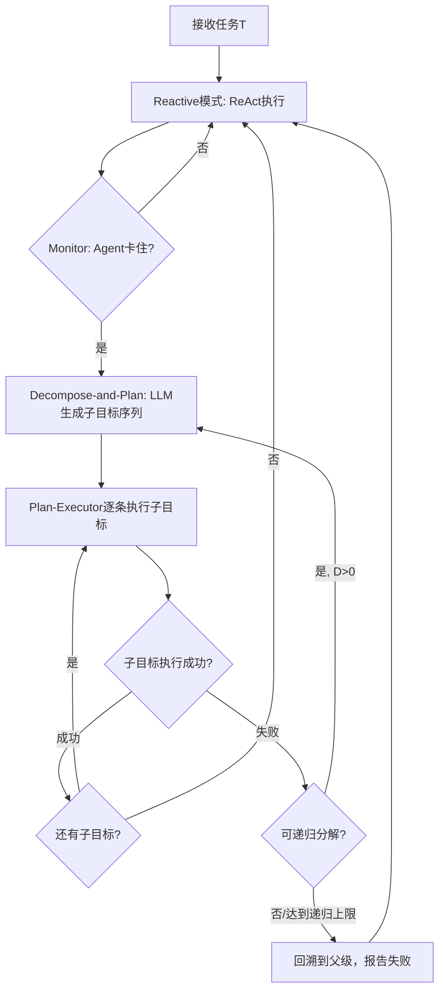

### ADaPT: 按需分解与规划 (ADaPT)

```yaml
id: adapt
name: ADaPT
full_name: 按需分解与规划 (ADaPT)
year: '2023.11'
org: Allen AI
paper_url: https://arxiv.org/abs/2311.05772
category: decomposition
parent: rewoo
motivation: 子任务卡住时递归分解再执行
```

#### 📝 一句话总结
> ADaPT（As-Needed Decomposition and Planning）针对LLM Agent在复杂任务中面临的困境——Reactive Agent（如ReAct）缺乏全局规划、容易丢失任务主线，而Plan-and-Solve Agent（如ReWOO）在陌生环境中灵活性不足、一次性生成完整计划又计算浪费——提出了"按需"触发分解与规划的折中方案：Agent默认以Reactive模式执行，仅当LLM Monitor检测到卡住（重复动作、随机行为等）时才切换至Decompose-and-Plan组件，将当前子任务递归分解为可执行的子目标序列，由独立的Plan-Executor逐条执行，执行失败则递归再分解。在AlfWorld上ADaPT以GPT-3.5达到77%成功率（ReAct基线仅46%），以GPT-4+两步提示达到90%匹配微调模型BUTLER（90.6%）；在WebActions上超越最强基线25个百分点以上。

#### 🎯 核心要点
1. **桥接两类Agent范式**：ADaPT首次尝试在Reactive Agent（ReAct）和Plan-and-Solve Agent（ReWOO/Plan-and-Solve）之间建立中间地带——默认采用轻量级Reactive执行，仅在必要时才触发计算密集的分解规划，避免了两类方法的各自缺陷：Reactive丢失全局视野、Plan-and-Solve在陌生环境中生成无效计划。

2. **递归分解是核心创新**：ADaPT的Decompose-and-Plan组件支持递归：当子目标执行失败时，对该子目标再进行分解，产生更细粒度的子计划。消融实验表明递归分解带来+12%（AlfWorld）和+10%（WebActions）的额外提升，远超DEPS式的单次全量重规划。

3. **LLM-based Monitor精准触发规划**：通过LLM判断Agent是否卡住（结合启发式规则：同一动作重复3次或随机动作≥4次），在AlfWorld的50个抽样任务中31%触发了分解且全部成功（不可解任务除外），在WebActions中52%触发，表明Monitor精准识别了复杂任务带来的困难。

4. **开源小模型显著受益**：CodeLlama-34B通过ADaPT从46%→73%（+27%），达到GPT-4的ReAct水平；Llama-3-8B和Mixtral-8x7B在子集评估中也分别提升25%和16.7%，表明系统性集成规划能释放开源小模型在复杂任务上的潜力。

5. **新基准WebActions填补空白**：提出了基于WebArena的76任务基准WebActions，覆盖电商、社交论坛、CMS、地图四个真实网站，要求组合网页导航与复杂交互规划。ADaPT在此基准上比ReAct基线高19.8个百分点（30.3% vs 10.5%），在CMS站点尤为突出（33% vs 5%）。

6. **代价换取精度**：ADaPT的token与步骤数高于ReAct（AlfWorld每任务平均20步 vs 6步，成本$0.13 vs $0.03），但在复杂任务上成功率大幅提升。可通过便宜LLM承担规划子任务来降低成本，且监控严格度可调节以权衡成本与性能。

#### 🔬 深入细节

*图：ADaPT 的核心框架或评测示意。*

##### 1. 问题背景与动机

LLM Agent在交互式决策任务中面临规划挑战：Reactive Agent（ReAct、Toolformer）每步基于环境观察决定下一动作，灵活但容易在意外状态下丢失全局任务主线；Plan-and-Solve Agent（Plan-and-Solve、ReWOO）先生成完整计划再顺序执行，缺乏遇到意外时重新规划的能力，且对大多数简单任务生成详细计划是计算浪费。两类方法在不同条件（陌生领域、模糊目标、结构化需求）下各有优势与失败模式，尚无方法能统一两者的长处。ADaPT的动机正是要找到中间地带：像Reactive一样灵活，但在需要时像Plan-and-Solve一样有条理地分解任务。

##### 2. 核心方法/框架

ADaPT包含两个核心组件，整体流程为"默认Reactive + 按需递归分解"：



- **Reactive组件**：继承ReAct范式，每步接收环境观察ot，由LLM预测动作at，维护包含完整历史与高层计划（hl_plan）的上下文C。
- **Monitor**：LLM-based二分类器，判断Agent是否卡住（结合启发式规则：重复同一动作3次、随机动作≥4次、递归次数超限后强制回到Reactive模式）。
- **Decompose-and-Plan组件**：当Monitor触发时，以当前环境状态和目标为输入，LLM生成线性子目标序列（如AlfWorld中"拿起土豆→用微波炉加热→放入冰箱"）；每个子目标由新初始化的Plan-Executor（ReAct-style）执行；若某子目标失败，递归调用Decompose-and-Plan对该子目标细粒度分解，直到成功或达到递归深度上限。
- **状态管理**：通过global_vars字典（如IN_HAND）跨递归层传递任务状态，每完成一个子目标后重置全局变量，防止状态污染。

与DEPS的关键区别：DEPS仅在执行失败后进行一次性全量重规划，而ADaPT支持递归分解，可在不同粒度级别动态重规划，消融实验证明这正是性能提升的关键来源。

##### 3. 实验与发现

- **AlfWorld**（110任务，6种子任务类型，3次随机种子平均）：
  - ReAct（GPT-3.5-turbo-1106）：46%
  - ADaPT（GPT-3.5-turbo-1106）：77%（+31个百分点）
  - ADaPT w.o. 递归分解（类DEPS基线）：65%（递归带来+12%）
  - ADaPT + GPT-4（两步提示，类似BUTLER）：90%，匹配微调模型BUTLER的90.6%
  - Plan-and-Solve：44%（低于ReAct基线2%）
  - CodeLlama-34B + ADaPT：73%（+27%），追平GPT-4的ReAct水平

- **WebActions**（76任务，4个网站，3次随机种子平均）：
  - ReAct（GPT-3.5）：10.5%
  - Plan-and-Solve（GPT-3.5）：4%
  - ADaPT（GPT-3.5）：30.3%（+19.8，>基线25个百分点）
  - ADaPT w.o. 递归分解：20.2%（递归带来+10.1%）
  - 分站点：CMS 33%（ReAct 5%）、Reddit 34%（14%）、Shopping 33%（15%）、Maps 11%（0%）

- **监控严格度消融**：严格模式下仅22%任务触发分解（成功率74%），默认模式31%触发（77%），宽松模式45%触发（80%），主动规划即使非严格必要也有益。

- **温度消融**：Executor在温度0时仅41%成功率（重复动作被误判卡住），温度0.7时77%；Decomposition在温度0时更稳定（失效率29%→26%）。

##### 4. 局限与个人思考

ADaPT的主要失败模式有三类：(1)分解成功但执行失败（AlfWorld中60%），原因包括Plan-Executor幻觉（拾取不存在的物体）和非法动作参数，可通过检索增强生成改善接地性；(2)Monitor未能识别卡住状态（27%），在WebActions上更严重（52%），需要更细粒度的监控机制；(3)分解生成的子目标无效（13%），如生成与原任务相同的单个子目标，提示设计有优化空间。此外ADaPT目前是zero-shot方法，未进行微调，未来可通过微调优化性能与成本折中；递归深度限制是粗粒度的，可能造成死循环浪费。ADaPT的递归分解思想在Web导航、机器人操控、信息检索等场景有广阔泛化空间，但Monitor的精准度仍是影响实际部署的关键瓶颈。

##### 5. 与相关工作的关系（论文树/知识图谱）

ADaPT处于LLM Agent规划的"中间地带"节点，其知识位置如下：

- **Parent节点——ReWOO**：ADaPT继承ReWOO将规划与执行分离的思路，但改为"按需触发"而非预先全量规划，避免ReWOO在陌生环境生成无效全局计划的风险。
- **并列Reactive分支**：ReAct是ADaPT的默认执行模式基础；Reflexion的反思机制与ADaPT的监控-重规划逻辑有相似之处，但Reflexion侧重失败后反思改进，ADaPT侧重在卡住时主动分解。
- **并列Plan-and-Solve分支**：Plan-and-Solve和ReWOO代表一次性全量规划；DEPS是最接近ADaPT的方法（交错规划与执行），但DEPS仅在失败后全量重规划，缺少递归分解能力，ADaPT的递归分解带来+12%的显著提升。
- **后续/关联工作**：ADaPT发表于2023年11月，其按需规划思想影响了后续探索Agent自适应策略的工作。ADaPT在WebActions上的成功也推动了Web Agent从简单检索向复杂交互规划发展。

#### 🧪 练习题
```yaml
question: "ADaPT 中 Monitor 的作用是什么？"
options:
  - "负责执行所有底层工具调用"
  - "判断 Agent 是否卡住，并在必要时触发递归分解与规划"
  - "把自然语言计划翻译成 PDDL"
  - "对每一步动作做 constrained decoding"
answer: 1
explain: "ADaPT 不是每步都分解任务，而是先用 Monitor 判断当前 reactive 执行是否卡住，只有必要时才切到 decomposition-and-planning。"
```
