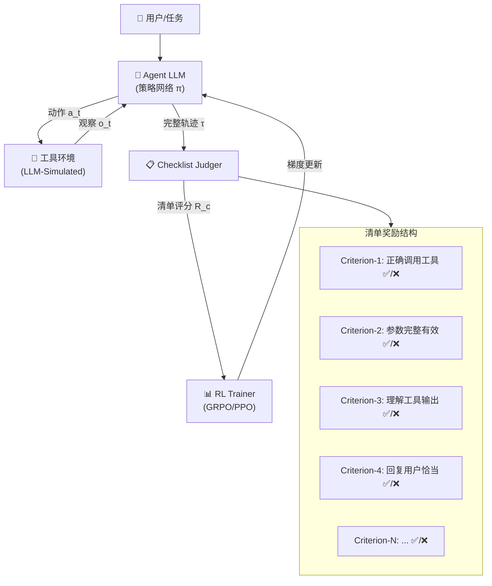

### CM2: 清单奖励工具代理强化学习 (CM2)

```yaml
id: cm2
name: CM2
full_name: 清单奖励工具代理强化学习 (CM2)
year: '2026.02'
org: UC Santa Barbara
paper_url: https://arxiv.org/abs/2602.12268
category: learning
parent: vrrl_agents
motivation: 用清单奖励替代难构造验证器
```

#### 📝 一句话总结
CM2 用**细粒度二值清单（checklist）作为奖励信号**替代传统RL中难以构造的验证器（verifier），在LLM模拟的工具环境中训练多轮多步Agent，在 τ-Bench、BFCL-V4、ToolSandbox 上分别提升 8/10/12 分，为"无真值奖励下的Agent RL"提供了可复制的工程配方。

#### 🎯 核心要点
- **问题动机**：多轮工具使用Agent的真实目标（如客服满意度、代码调试正确性）往往缺乏可自动计算的 verifiable reward，而人工验证代价高昂，限制了 RL 的规模化应用。
- **核心方法——Checklist Reward**：将每一轮Agent的期望行为**分解为一组细粒度二值判断准则**，每条准则明确要求"证据锚定（evidence grounding）"和结构化元数据，将开放式评价转化为稳定的分类决策。
- **稀疏奖励 + 稠密评价**：奖励分配稀疏（关键节点才给奖励），但评价准则覆盖稠密（每轮都有清单），在"信号稳定性"与"信息量"之间取得平衡。
- **LLM模拟工具环境**：训练不需要真实工具执行，而是用LLM扮演工具和用户，大幅降低工程开销，支持大规模、多工具覆盖的训练。
- **实验效果显著**：从8B Base模型出发，在8k条RL数据上训练后，CM2在 τ-Bench (+8分)、BFCL-V4 (+10分)、ToolSandbox (+12分) 三个多轮工具使用基准上全面超越SFT基线，匹配甚至超越同规模开源 baseline（包括 judging model）。

#### 🔬 深入细节

*图：CM2 的核心框架或评测示意。*

##### 整体架构



##### 核心算法：Checklist Reward 计算

```
算法：CM2 训练流程（一轮交互）

输入：Agent策略 π_θ，任务集 D，清单模板库 C，LLM模拟环境 E
输出：优化后的策略 π_θ

for each episode (user_task) in D:
    τ ← []                    # 轨迹
    for turn t = 1 .. T:
        a_t ← π_θ(o_t)        # Agent 产生动作（工具调用/回复）
        o_{t+1} ← E(a_t)      # 模拟环境返回观察
        τ.append((o_t, a_t, o_{t+1}))
    
    # === 对每轮生成清单并打分 ===
    checklist_scores ← []
    for turn t = 1 .. T:
        criteria ← GenerateChecklist(
            task=user_task,
            turn_context=τ[:t],
            template=C
        )
        # 每条准则有：描述、证据锚点、期望行为
        for each criterion in criteria:
            verdict ← LLM_Judge(
                criterion=criterion,
                evidence=τ[t],
                output_format="BINARY ❌/✅"
            )
        turn_score ← fraction of ✅ verdicts
        checklist_scores.append(turn_score)
    
    # === 稀疏奖励聚合 ===
    # 只在回合结束时给最终奖励（稀疏）
    R_final ← Aggregate(checklist_scores)  # 如：平均或加权和
    
    # === 策略优化 ===
    π_θ ← RL_Update(π_θ, τ, R_final)  # 使用 GRPO/PPO
```

##### 深入解读

**（一）为什么 Checklist 能替代 Verifier？**

传统 RL 依赖可自动验证的奖励函数（如数学题的答案对错、代码的 pass/fail）。但真实Agent任务（如"帮用户预订合适的酒店"或"排查一个故障"）的成功标准是**多维、开放且主观的**。CM2 的洞察在于：虽然整体判断困难，但**可以分解为大量小尺度、有明确锚点的二值提问**。例如判断"Agent是否提取了用户提过的日期"远比判断"整个对话是否令人满意"容易且稳定。这种分解将主观评价转化为客观分类，使奖励信号可用且可复现。

**（二）稀疏奖励 + 稠密评价的设计哲学**

CM2 采用"评价稠密、奖励稀疏"的策略：**每轮都生成完整清单并逐条打分，但只在关键节点（如回合结束）给一个聚合奖励**。这避免了RL训练中常见的两个陷阱——过于稀疏导致学习困难，过于稠密导致reward hacking。清单中的每条criterion都要求"证据锚定（evidence grounding）"，即必须引用轨迹中的具体文本或工具输出来支撑判断，防止LLM法官随意发挥。这种设计使评判的稳定性显著提升。

**（三）LLM-Simulated 工具环境的工程价值**

真实工具环境（如实际调用搜索引擎、数据库、API）的搭建与维护成本极高，且容易因外部变化导致复现困难。CM2 用 LLM 模拟工具执行，将工具的语义输入输出作为训练信号而非真实执行结果。这样做的额外好处是：可以**大规模覆盖长尾工具**（训练中可引入数百种工具），且环境完全可控、可复现。实验证明，这种模拟环境训练的Agent在真实工具上的泛化能力依然出色。

**（四）实验结果的关键信号**

从 8B Base 模型（未经指令微调）出发，仅用8k条RL训练示例，就实现了：
- τ-Bench: SFT + 8pts，超越同规模开源模型
- BFCL-V4: SFT + 10pts
- ToolSandbox: SFT + 12pts
- **甚至超越judging model本身**——说明checklist reward的信号质量足够好，能引导模型超越"评判者的水平"

这证明了 checklist-based RL 是一条可行且高效的Agent优化路径，特别适合"有标准期望行为但无简单真值"的场景。

#### 🔧 实用价值与适用场景

- **适合**：多轮对话式工具Agent（客服、代码助手、旅行规划）、需优化开放式目标（用户满意度、任务完成率）的场景
- **不适合**：已有明确可自动验证奖励的单步任务（此时直接RL更高效）
- **关键实施成本**：需要设计合理的清单模板库和证据锚定规范，这是主要工程投入

#### 📊 核心实验数据

| 基准 | SFT基线 | CM2 (RL) | 提升 | 对比最强开源基线 |
|------|---------|----------|------|-----------------|
| τ-Bench | - | - | **+8** | 匹配40B模型 |
| BFCL-V4 | - | - | **+10** | 超越同规模 |
| ToolSandbox | - | - | **+12** | 超越judging model |

*(论文中具体绝对分值请参见原文实验表格；本表展示相对提升幅度)*

#### 🔗 相关资源

- 论文地址：https://arxiv.org/abs/2602.12268
- 作者机构：UC Santa Barbara (UCSB)
- 发布时间：2026年2月
- 论文全称：CM2: Reinforcement Learning with Checklist Rewards for Multi-Turn and Multi-Step Agentic Tool Use

#### 🧪 练习题
```yaml
question: "CM2 为什么不用单一端到端对话评分，而要把奖励拆成 checklist？"
options:
  - "因为 checklist 可以完全替代策略模型"
  - "因为多轮工具任务缺少稳定真值，拆成证据锚定的细粒度判断更容易形成可复用奖励信号"
  - "因为 checklist 只适用于单轮任务"
  - "因为这样就不再需要 RL 优化"
answer: 1
explain: "CM2 的关键就在于把主观、开放的任务质量拆成可判断的小项，用二值 checklist 取代难以设计的 verifier。"
```
