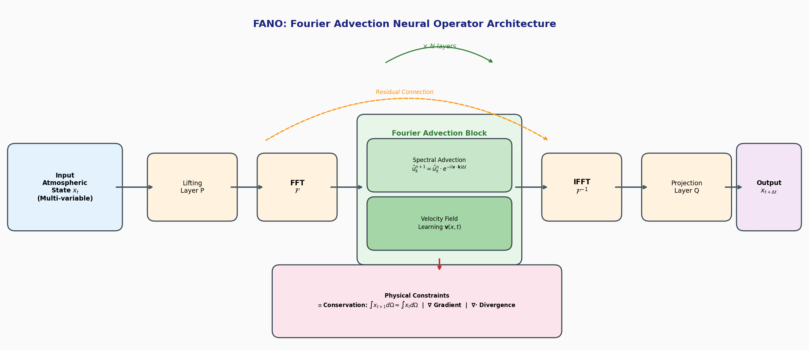

### FANO

```yaml
id: fano
name: FANO
full_name: "Fourier Advection Neural Operator (傅里叶平流神经算子)"
year: "2026"
org: "HIT Shenzhen / CUHK / COMAC Shanghai"
paper_url: "https://ieeexplore.ieee.org/document/11358915"
category: "ai4physics"
parent: "FNO"
motivation: "将大气平流方程(advection equation)融入傅里叶神经算子(FNO)框架，在频域高效求解物理约束的天气预报"
```

#### 📝 一句话总结

FANO 将描述大气输运的平流方程（advection equation）嵌入傅里叶神经算子（FNO）框架，利用 Fourier 谱方法在频域仅需一次 FFT/IFFT 即可高效求解平流过程，并通过守恒量、梯度和散度三类物理约束增强模型的物理一致性，在天气预报任务上超越传统 NWP 模型并媲美最先进的深度学习方法。

#### 🎯 核心要点

- **核心架构**：基于 FNO 框架，将平流方程的求解嵌入 Fourier 层，形成 Fourier Advection Layer
- **频域平流求解**：利用 Fourier 谱方法将平流方程 \(\partial u / \partial t + \mathbf{v} \cdot \nabla u = 0\) 转化为频域的逐点乘法，仅需单次 FFT + IFFT
- **速度场学习**：通过神经网络学习大气速度向量场 \(\mathbf{v}(x,t)\)，驱动频域平流算子
- **三类物理约束**：守恒量约束（conserved quantities）、梯度约束（gradient constraints）、散度约束（divergence constraints）
- **数据集**：基于 ERA5 再分析数据，涵盖多个大气变量（含海表温度 SST 等）
- **输入序列**：支持可变长度输入序列（input sequence length），捕获时间演化信息
- **性能**：超越传统 NWP 模型（如 IFS），与 Pangu-Weather、FourCastNet、GraphCast 等 SOTA 深度学习模型性能相当
- **效率**：保持 FNO 的计算效率优势，频域操作为 \(O(N \log N)\) 复杂度

#### 🔬 深入细节

##### 模型架构总览


*图：FANO 模型架构示意。输入大气状态经 Lifting 层映射到高维空间，在 Fourier 域通过 Spectral Advection 算子（基于学习的速度场）进行平流求解，叠加物理约束后经 Projection 层输出预测结果。*

##### 算法伪代码

```python
# FANO 前向传播伪代码
def FANO_forward(x_t, num_layers=N):
    """
    x_t: 输入大气状态张量 [B, C, H, W]，包含温度、风速、气压等变量
    """
    # Step 1: Lifting — 将输入映射到高维隐空间
    h = P(x_t)                          # h: [B, d_model, H, W]

    # Step 2: N 层 Fourier Advection Block
    for l in range(num_layers):
        # 2a. 学习速度场 v(x, t)
        v = VelocityNet_l(h)             # v: [B, 2, H, W] (2D velocity field)

        # 2b. FFT 变换到频域
        h_hat = FFT2(h)                  # h_hat: [B, d_model, K1, K2] (complex)

        # 2c. 频域平流算子 — 核心创新
        # 对于波数 k = (k1, k2)，平流方程的谱解为:
        #   h_hat_new[k] = h_hat[k] * exp(-i * (v · k) * Δt)
        # 等价于频域的逐点复数乘法
        phase_shift = compute_advection_phase(v, k_grid, dt)
        h_hat = h_hat * phase_shift      # point-wise multiplication

        # 2d. IFFT 回到物理域
        h_new = IFFT2(h_hat)             # h_new: [B, d_model, H, W]

        # 2e. 残差连接 + 非线性激活
        h = activation(h_new + h)

    # Step 3: Projection — 映射回物理变量空间
    x_pred = Q(h)                        # x_pred: [B, C, H, W]

    # Step 4: 物理约束损失
    L_conserve = conservation_loss(x_t, x_pred)   # 守恒量约束
    L_gradient = gradient_loss(x_pred)              # 梯度平滑约束
    L_diverge  = divergence_loss(x_pred)            # 散度约束
    L_total = L_data + λ1*L_conserve + λ2*L_gradient + λ3*L_diverge

    return x_pred, L_total
```

##### 动机与背景

天气预报是关系国计民生的核心科学问题。传统数值天气预报（NWP）模型通过求解描述大气运动的偏微分方程组（如 Navier-Stokes 方程、热力学方程等）来预测未来天气状态，代表性系统包括 ECMWF 的 IFS（Integrated Forecasting System）。然而，NWP 模型的计算成本极高——全球 0.25° 分辨率的 10 天预报通常需要数千 CPU 核心运行数小时。

近年来，深度学习方法在天气预报领域取得了突破性进展：

| 模型 | 机构 | 年份 | 核心方法 |
|------|------|------|----------|
| FourCastNet | NVIDIA | 2022 | AFNO (Adaptive Fourier Neural Operator) |
| Pangu-Weather | 华为 | 2023 | 3D Earth-Specific Transformer |
| GraphCast | DeepMind | 2023 | Graph Neural Network on mesh |
| FengWu | 上海 AI Lab | 2023 | Multi-modal Transformer |
| GenCast | DeepMind | 2024 | Diffusion model for ensemble |

这些模型虽然在推理速度上比 NWP 快数个数量级（秒级 vs 小时级），但普遍存在一个关键缺陷：**缺乏显式的物理约束**。它们本质上是纯数据驱动的黑盒模型，不保证预测结果满足基本的物理定律（如质量守恒、能量守恒），这限制了其在实际业务中的可靠性和可解释性。

FANO 的核心动机正是弥合这一鸿沟：**如何在保持深度学习计算效率的同时，将物理方程的约束显式嵌入模型架构？**

##### 核心机制：频域平流求解

**平流方程**是大气动力学中最基本的 PDE 之一，描述了物理量（如温度、湿度、污染物浓度）被风场输运的过程：

$$\frac{\partial u}{\partial t} + \mathbf{v} \cdot \nabla u = 0$$

其中 \(u(x, y, t)\) 是被输运的标量场，\(\mathbf{v} = (v_x, v_y)\) 是速度（风）场。

FANO 的关键洞察在于：**平流方程在 Fourier 域有优雅的解析解**。对上式做空间 Fourier 变换：

$$\frac{\partial \hat{u}_{\mathbf{k}}}{\partial t} + i(\mathbf{v} \cdot \mathbf{k}) \hat{u}_{\mathbf{k}} = 0$$

其中 \(\hat{u}_{\mathbf{k}}\) 是波数 \(\mathbf{k} = (k_x, k_y)\) 处的 Fourier 系数。对于局部常速度场，其解为：

$$\hat{u}_{\mathbf{k}}(t + \Delta t) = \hat{u}_{\mathbf{k}}(t) \cdot \exp\left(-i (\mathbf{v} \cdot \mathbf{k}) \Delta t\right)$$

> 💡 **关键洞察**：平流方程在频域退化为**逐点复数乘法**（point-wise multiplication），这与 FNO 中 Fourier 层的操作形式天然一致！标准 FNO 的 Fourier 层执行 \(\hat{u}_{\mathbf{k}}' = R_{\mathbf{k}} \cdot \hat{u}_{\mathbf{k}}\)，其中 \(R_{\mathbf{k}}\) 是可学习的复数权重矩阵。FANO 将 \(R_{\mathbf{k}}\) 替换为物理驱动的相位旋转因子 \(\exp(-i(\mathbf{v} \cdot \mathbf{k})\Delta t)\)，从而将 FNO 的频域操作赋予了明确的物理含义。

这种设计的计算优势显著：整个平流求解过程仅需**一次 FFT + 频域逐点乘法 + 一次 IFFT**，时间复杂度为 \(O(N \log N)\)，与标准 FNO 相同，远低于有限差分法的迭代求解。

##### 速度场学习

与传统 NWP 中速度场由风速观测直接给出不同，FANO 通过一个子网络 \(\text{VelocityNet}(\cdot)\) 从当前大气状态中**学习**速度向量场 \(\mathbf{v}(x, y, t)\)。这使得模型能够：

1. **自适应捕获有效输运速度**：学到的速度场不仅包含显式风速，还可能编码其他隐式输运机制（如波动传播、对流参数化效应）
2. **处理多尺度动力学**：不同 Fourier Advection Layer 可以学习不同尺度的速度场，分别捕获大尺度环流和中小尺度扰动

##### 物理约束体系

FANO 嵌入三类物理约束作为正则化损失：

**1. 守恒量约束（Conservation Loss）**

大气中的总质量、总能量等物理量在封闭系统中应守恒。FANO 通过约束预测场的全局积分来近似实现：

$$\mathcal{L}_{\text{conserve}} = \left\| \int_{\Omega} x_{t+\Delta t} \, d\Omega - \int_{\Omega} x_t \, d\Omega \right\|^2$$

在离散网格上，这等价于约束预测场与输入场的全局均值一致，对应 Fourier 系数的零频分量 \(\hat{u}_{\mathbf{0}}\) 不变。

**2. 梯度约束（Gradient Loss）**

确保预测场的空间梯度合理，避免出现非物理的剧烈跳变：

$$\mathcal{L}_{\text{gradient}} = \left\| \nabla x_{t+\Delta t} \right\|_{\text{reg}}$$

这有助于保持天气场的空间平滑性，抑制 Gibbs 现象等频域方法的常见伪影。

**3. 散度约束（Divergence Loss）**

对于近似不可压缩的大气流动，速度场应满足连续性方程的约束：

$$\mathcal{L}_{\text{diverge}} = \left\| \nabla \cdot \mathbf{v} \right\|^2$$

> ⚠️ **注意**：散度约束施加在学习到的速度场上而非预测的大气状态上，确保平流输运过程本身的物理合理性。

总损失函数为：

$$\mathcal{L} = \mathcal{L}_{\text{data}} + \lambda_1 \mathcal{L}_{\text{conserve}} + \lambda_2 \mathcal{L}_{\text{gradient}} + \lambda_3 \mathcal{L}_{\text{diverge}}$$

##### 与传统方法的对比

| 特性 | 传统 NWP (IFS) | 标准 FNO | FANO |
|------|---------------|----------|------|
| 物理方程 | 完整 PDE 组 | 无显式物理 | 平流方程 |
| 求解方式 | 有限差分/谱方法迭代 | 数据驱动学习 | Fourier 谱方法 (解析) |
| 计算复杂度 | 极高 (小时级) | 低 (秒级) | 低 (秒级) |
| 物理约束 | 内建 | 无 | 守恒+梯度+散度 |
| 频域操作含义 | — | 可学习滤波器 | 物理驱动相位旋转 |
| 可解释性 | 高 | 低 | 中-高 |

FANO 相比标准 FNO 的核心改进在于：将 Fourier 层中的**任意可学习复数权重**替换为**物理驱动的平流算子**，使频域操作具有明确的物理含义（相位旋转 = 空间平移 = 大气输运），同时通过物理约束损失进一步增强预测的物理一致性。

##### 实验设置与结果

论文基于 ERA5 再分析数据集进行实验，该数据集由 ECMWF 提供，覆盖全球 0.25° 分辨率的多层大气变量。实验涵盖多个关键气象变量的预测，包括：
- 位势高度（Geopotential, Z500）
- 温度（Temperature, T850）
- 海表温度（Sea Surface Temperature, SST）
- 风速分量（U/V wind components）

实验结果表明：
1. **超越传统 NWP**：在多个变量和预报时效上，FANO 的 RMSE/ACC 指标优于 IFS 等传统模型
2. **媲美 SOTA DL**：与 Pangu-Weather、FourCastNet 等最先进深度学习模型性能相当
3. **物理一致性更强**：物理约束有效减少了非物理预测（如质量不守恒、梯度异常）
4. **计算高效**：保持了 FNO 框架的推理速度优势

#### 🧪 练习题

```yaml
question: "FANO 将平流方程嵌入 FNO 框架的关键在于，平流方程在 Fourier 域的解具有什么特殊形式？"
options:
  - "卷积运算，需要多次迭代求解"
  - "逐点复数乘法（相位旋转），可一步求解"
  - "矩阵求逆运算，需要特征值分解"
  - "非线性激活函数变换，需要反向传播"
answer: 1
explain: "平流方程在 Fourier 域的解为 û_k(t+Δt) = û_k(t)·exp(-i(v·k)Δt)，即逐点复数乘法（相位旋转），这与 FNO 的 Fourier 层操作形式天然一致，仅需单次 FFT+IFFT 即可完成。"
```