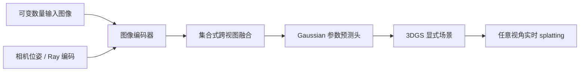
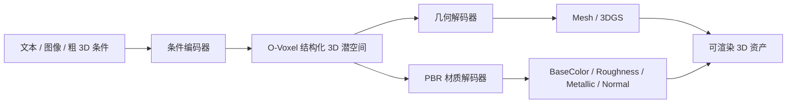
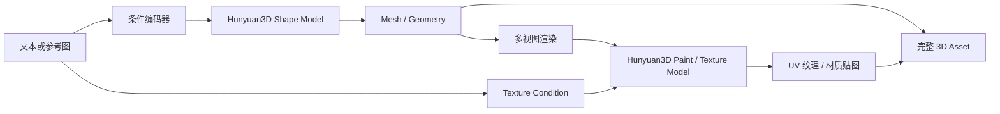
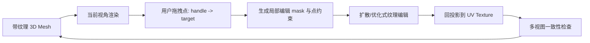

## 领域综述

!INCLUDE_RAW ../../temp/content_survey_bulk_20260614_174337/researcher_output/aigc/3d_generation/overview/zhihu__2024年AI+3D技术进展总结_（第三篇）-_3D_AIGC方向2__cadc045e/article.md

## 最新进展综述

!INCLUDE_RAW ../../temp/content_survey_bulk_20260614_174337/researcher_output/aigc/3d_generation/latest/zhihu__CVPR_2026_3D_视觉前沿梳理：模型正在学会理解、生成和构建世界__f84c74ee/article.md

## 算法演化关系

```yaml
nodes:
- id: nerf
  x: 2020
  y: 100
  category: representation
- id: mip_nerf
  x: 2021
  y: 90
  category: representation
- id: instant_ngp
  x: 2022
  y: 80
  category: representation
- id: plenoxels
  x: 2022
  y: 110
  category: representation
- id: 3dgs
  x: 2023
  y: 70
  category: representation
- id: hgs
  x: 2026
  y: 60
  category: representation
- id: dreamfusion
  x: 2022
  y: 200
  category: optimization
- id: magic3d
  x: 2022.5
  y: 190
  category: optimization
- id: fantasia3d
  x: 2023
  y: 210
  category: optimization
- id: prolificdreamer
  x: 2023.5
  y: 200
  category: optimization
- id: luciddreamer
  x: 2023.8
  y: 190
  category: optimization
- id: zero123
  x: 2023
  y: 300
  category: feed_forward
- id: one2345
  x: 2023.3
  y: 310
  category: feed_forward
- id: mvdream
  x: 2024
  y: 290
  category: feed_forward
- id: wonder3d
  x: 2024.3
  y: 300
  category: feed_forward
- id: lrm
  x: 2024
  y: 320
  category: feed_forward
- id: instant3d
  x: 2024.3
  y: 330
  category: feed_forward
- id: ilrm
  x: 2026
  y: 310
  category: feed_forward
- id: vgg_t3
  x: 2026.2
  y: 320
  category: feed_forward
- id: 4d_lrm
  x: 2025.8
  y: 340
  category: feed_forward
- id: yonosplat
  x: 2026.4
  y: 300
  category: feed_forward
- id: texture
  x: 2023
  y: 400
  category: texture
- id: text2tex
  x: 2023.5
  y: 410
  category: texture
- id: trellis2
  x: 2025.8
  y: 400
  category: texture
- id: hunyuan3d_21
  x: 2026.2
  y: 410
  category: texture
- id: dragtex
  x: 2026.4
  y: 420
  category: texture
- id: ar3dr1
  x: 2026
  y: 500
  category: native_3d
- id: vist3a
  x: 2026.2
  y: 510
  category: native_3d
- id: lyra
  x: 2026.4
  y: 520
  category: native_3d
- id: hunyuan3d_3
  x: 2026.3
  y: 490
  category: native_3d
- id: seed3d_2
  x: 2026.5
  y: 500
  category: native_3d
- id: rodin_gen2
  x: 2026.6
  y: 510
  category: native_3d
edges:
- from: nerf
  to: mip_nerf
  label: 抗锯齿
- from: nerf
  to: instant_ngp
  label: 哈希加速
- from: nerf
  to: plenoxels
  label: 去神经网络
- from: instant_ngp
  to: 3dgs
  label: 显式高斯
- from: 3dgs
  to: hgs
  label: 消除伪影
- from: nerf
  to: dreamfusion
  label: SDS蒸馏
- from: dreamfusion
  to: magic3d
  label: 两阶段
- from: dreamfusion
  to: fantasia3d
  label: 解耦几何
- from: dreamfusion
  to: prolificdreamer
  label: VSD改进
- from: prolificdreamer
  to: luciddreamer
  label: ISM匹配
- from: zero123
  to: one2345
  label: 快速重建
- from: zero123
  to: mvdream
  label: 多视图
- from: mvdream
  to: wonder3d
  label: 跨域扩散
- from: zero123
  to: lrm
  label: 大模型
- from: lrm
  to: instant3d
  label: 稀疏视图
- from: lrm
  to: ilrm
  label: 迭代细化
- from: ilrm
  to: vgg_t3
  label: TTT扩展
- from: lrm
  to: 4d_lrm
  label: 4D动态
- from: ilrm
  to: yonosplat
  label: 单模型
- from: texture
  to: text2tex
  label: 渐进式
- from: text2tex
  to: trellis2
  label: PBR材质
- from: trellis2
  to: hunyuan3d_21
  label: 质量提升
- from: hunyuan3d_21
  to: dragtex
  label: 交互编辑
- from: luciddreamer
  to: ar3dr1
  label: 强化学习
- from: luciddreamer
  to: vist3a
  label: 视频蒸馏
- from: vist3a
  to: lyra
  label: 自蒸馏
- from: instant3d
  to: hunyuan3d_3
  label: 原生分辨率
- from: hunyuan3d_3
  to: seed3d_2
  label: DiT架构
- from: seed3d_2
  to: rodin_gen2
  label: 拓扑优化
milestones:
- id: nerf
  title: NeRF开创神经隐式表示
  year: '2020'
  desc: 提出神经辐射场概念，利用MLP和体渲染实现照片级新视角合成，开启神经渲染时代
- id: dreamfusion
  title: DreamFusion打通2D到3D
  year: '2022'
  desc: 提出分数蒸馏采样(SDS)，利用2D扩散模型先验优化3D表示，开创文生3D现代范式
- id: 3dgs
  title: 3DGS革新实时渲染
  year: '2023'
  desc: 显式3D高斯泼溅实现100+FPS实时渲染，取代NeRF成为2026年主流表征方法
```

## 核心算法

### NeRF

```yaml
id: nerf
num: 1
name: NeRF
full_name: 神经辐射场 (Neural Radiance Fields)
year: '2020'
org: UC Berkeley
parent: —
paper_url: https://arxiv.org/abs/2003.08934
project_url: ''
category: representation
motivation: MLP+体渲染实现连续隐式表示
```

#### 📝 一句话总结
NeRF 把一个静态场景表示为连续函数 $F_\Theta:(\mathbf{x},\mathbf{d})\rightarrow(\sigma,\mathbf{c})$，再用可微体渲染从多视角照片中优化这个函数，从而用一个 MLP 学到几何密度与视角相关外观。

#### 🎯 核心要点
- **表示方式**：输入 3D 坐标 $\mathbf{x}$ 与观察方向 $\mathbf{d}$，输出体密度 $\sigma$ 和 RGB 颜色 $\mathbf{c}$；几何主要由 $\sigma(\mathbf{x})$ 承载，镜面/高光等视角效应由 $\mathbf{c}(\mathbf{x},\mathbf{d})$ 承载。
- **训练信号**：不需要 3D 标注，只需要已知相机位姿的 posed images；损失是渲染颜色与真实像素的 MSE。
- **关键技巧**：位置编码把低维坐标映射到高频 Fourier 特征，分层采样把样本集中到有贡献的深度区间。
- **局限**：逐射线采样加 MLP 查询非常慢；每个场景单独优化，不能直接一次前向泛化到新场景。

#### 🔬 深入细节
**核心示意图/框架图**


NeRF 的主线是“相机射线采样 -> MLP 查询密度和颜色 -> 体渲染积分 -> 像素级监督”。对一条射线 $\mathbf{r}(t)=\mathbf{o}+t\mathbf{d}$，连续体渲染写作：

$$
C(\mathbf{r})=\int_{t_n}^{t_f}T(t)\sigma(\mathbf{r}(t))\mathbf{c}(\mathbf{r}(t),\mathbf{d})dt,\quad
T(t)=\exp\left(-\int_{t_n}^{t}\sigma(\mathbf{r}(s))ds\right).
$$

离散实现中，把射线分成 $N$ 个样本，令 $\alpha_i=1-\exp(-\sigma_i\delta_i)$，权重为 $w_i=T_i\alpha_i$，最终颜色为 $\hat{C}(\mathbf{r})=\sum_i w_i\mathbf{c}_i$。这个公式让密度既影响遮挡也影响几何边界，梯度可以从像素误差反传到每个采样点。

**算法伪代码**

```python
for step in training_steps:
    rays, target_rgb = sample_camera_rays(images, poses)
    z_coarse = stratified_samples(rays, near, far, N_coarse)
    x = rays.o[:, None] + z_coarse[..., None] * rays.d[:, None]
    sigma, rgb = mlp(posenc(x), posenc(rays.d))
    rgb_coarse, weights = volume_render(sigma, rgb, z_coarse)

    z_fine = importance_samples(z_coarse, weights, N_fine)
    sigma_f, rgb_f = mlp(posenc(points(rays, z_fine)), posenc(rays.d))
    rgb_fine, _ = volume_render(sigma_f, rgb_f, z_fine)

    loss = mse(rgb_coarse, target_rgb) + mse(rgb_fine, target_rgb)
    loss.backward()
    optimizer.step()
```

位置编码是 NeRF 成功的必要条件之一。原始坐标直接输入 MLP 时，网络倾向先拟合低频函数，细纹理和锐边界会被平滑掉；NeRF 使用

$$
\gamma(p)=\left(\sin(2^0\pi p),\cos(2^0\pi p),\dots,\sin(2^{L-1}\pi p),\cos(2^{L-1}\pi p)\right)
$$

把坐标展开到多频空间，使小 MLP 也能表达高频变化。论文还把坐标和方向分开处理：密度只依赖位置，颜色在较深层再注入方向，这个归纳偏置避免几何随视角漂移。

分层采样解决的是计算预算问题。coarse 网络先在整条射线上粗采样，估计哪些深度段有较高权重；fine 网络再按权重分布重采样，让查询集中在物体表面附近。这个过程不是显式三角网格重建，而是在优化一个可微渲染器；因此 NeRF 很适合新视角合成，但提取可编辑几何还需要后处理。

#### 🧪 练习题
```yaml
questions:
  - type: concept
    prompt: "为什么 NeRF 的颜色分支需要观察方向 d，而密度分支通常不需要？"
    answer: "密度描述空间是否被占据，应当与视角无关；颜色包含镜面反射、高光等视角相关外观，因此需要 d。"
  - type: formula
    prompt: "写出离散体渲染中样本 i 的权重 w_i。"
    answer: "w_i = T_i (1 - exp(-sigma_i * delta_i))，其中 T_i 是前面样本的累积透射率。"
  - type: analysis
    prompt: "如果去掉位置编码，最常见的视觉后果是什么？"
    answer: "网络更偏向低频解，渲染会变模糊，细节、锐边和纹理难以恢复。"
```

### Mip-NeRF

```yaml
id: mip_nerf
num: 2
name: Mip-NeRF
full_name: 抗锯齿神经辐射场 (Mip-NeRF)
year: '2021'
org: Google Research
parent: nerf
paper_url: https://arxiv.org/abs/2103.13415
project_url: ''
category: representation
motivation: 集成位置编码解决多尺度渲染
```

#### 📝 一句话总结
Mip-NeRF 把 NeRF 的“无面积光线”升级为“有像素足迹的圆锥/圆台”，用集成位置编码对一个空间区域而非单点编码，从源头缓解多尺度训练和渲染中的混叠问题。

#### 🎯 核心要点
- **问题定位**：原始 NeRF 每条射线被视为无限细的线，训练图像分辨率变化或远近尺度变化时，同一像素覆盖的 3D 区域不同，点采样容易产生 aliasing。
- **核心改动**：用 conical frustum 表示像素对应的 3D 体积段，并用高斯近似该体积段。
- **编码方式**：把位置编码 $\gamma(\mathbf{x})$ 的输入从确定点换成随机变量 $\mathbf{x}\sim\mathcal{N}(\boldsymbol{\mu},\boldsymbol{\Sigma})$，计算正弦/余弦的期望。
- **工程收益**：保留 NeRF 的体渲染框架，但减少 coarse/fine 双网络依赖，并在多尺度数据上明显更稳。

#### 🔬 深入细节
**核心示意图/框架图**


Mip-NeRF 的关键观察是：一个像素不是一条数学射线，而是一个随深度扩张的圆锥。若仍只在圆锥中心线上采点，模型会被迫解释超过采样带宽的高频信号，训练视图和测试视图尺度不一致时就会出现闪烁、摩尔纹和模糊。

论文用多元高斯近似圆台区间，并对位置编码取期望。对一维高斯 $x\sim\mathcal{N}(\mu,\sigma^2)$，有：

$$
\mathbb{E}[\sin(\omega x)]=\exp\left(-\frac{1}{2}\omega^2\sigma^2\right)\sin(\omega\mu),
\quad
\mathbb{E}[\cos(\omega x)]=\exp\left(-\frac{1}{2}\omega^2\sigma^2\right)\cos(\omega\mu).
$$

这个衰减项很重要：当像素足迹很大、方差很大时，高频项自动被压低；当足迹很小、方差接近 0 时，IPE 退化为普通位置编码。

**算法伪代码**

```python
for rays in training_batches:
    # 每条像素射线带有 cone radius，采样得到一串圆台区间
    intervals = sample_conical_frustums(rays, near, far)
    gaussians = [approximate_frustum_as_gaussian(f) for f in intervals]

    encoded = [integrated_positional_encoding(mu, cov) for mu, cov in gaussians]
    sigma, rgb = nerf_mlp(encoded, viewdirs=rays.d)
    pred_rgb = volume_render(sigma, rgb, intervals.depths)

    loss = mse(pred_rgb, rays.target_rgb)
    update(loss)
```

从方法上看，Mip-NeRF 不是简单的采样数增加，而是改变了输入信号的数学对象：从 $\mathbf{x}$ 变为 $(\boldsymbol{\mu},\boldsymbol{\Sigma})$。这让网络看到的是“区域平均后的特征”，相当于内置了随尺度变化的低通滤波器。相比先渲染再做图像空间抗锯齿，Mip-NeRF 的滤波发生在辐射场查询之前，因此能减少错误几何和错误纹理被学进去。

另一个容易忽略的点是 Mip-NeRF 保持了 NeRF 的可微体渲染损失，因此可直接接入多视角重建流程。它的贡献主要在表示与采样层，而不是引入新的监督。后续 Zip-NeRF、Mip-NeRF 360 等工作继续沿着“区域编码 + 高效结构”的路线扩展大场景和无界场景。

#### 🧪 练习题
```yaml
questions:
  - type: concept
    prompt: "Mip-NeRF 为什么说像素对应圆锥而不是射线？"
    answer: "真实像素有面积，投影到 3D 后覆盖随深度扩大的区域；无限细射线忽略了这个足迹。"
  - type: formula
    prompt: "IPE 中高斯方差变大时，高频正弦项会怎样？"
    answer: "会被 exp(-0.5 * omega^2 * sigma^2) 衰减，方差越大、高频越弱。"
  - type: comparison
    prompt: "Mip-NeRF 相比增加 NeRF 采样点数的本质区别是什么？"
    answer: "它对像素覆盖区域做解析滤波，而不是只更密集地点采样中心线。"
```

### Instant-NGP

```yaml
id: instant_ngp
num: 3
name: Instant-NGP
full_name: 即时神经图形基元 (Instant Neural Graphics Primitives)
year: '2022'
org: NVIDIA
parent: nerf
paper_url: https://arxiv.org/abs/2201.05989
project_url: ''
category: representation
motivation: 哈希编码将训练加速1000倍
```

#### 📝 一句话总结
Instant-NGP 用多分辨率哈希网格把大量空间细节存到可学习特征表中，让小 MLP 只负责轻量解码，从而把 NeRF 类表示的训练和渲染速度提升到交互级。

#### 🎯 核心要点
- **瓶颈转移**：原始 NeRF 把几何和外观都压在大 MLP 里，查询慢；Instant-NGP 把表示容量放到哈希表特征中，MLP 变得很小。
- **多分辨率**：低层网格捕捉粗结构，高层网格捕捉局部细节；不同层特征拼接后输入 tiny MLP。
- **哈希冲突**：细网格坐标远多于表项，冲突不可避免；优化会利用多层上下文和梯度自动解冲突。
- **系统实现**：CUDA hash encoding、fully-fused MLP、occupancy grid 跳空共同构成速度优势。

#### 🔬 深入细节
**核心示意图/框架图**


论文的核心模块是 multiresolution hash encoding。给定归一化坐标 $\mathbf{x}$，第 $l$ 层把它缩放到分辨率 $N_l$ 的网格，取周围 $2^d$ 个顶点；每个整数顶点通过哈希函数映射到大小为 $T$ 的特征表，取出特征后做线性/三线性插值。所有层的插值特征拼接成 $\mathrm{enc}(\mathbf{x};\theta)$：

$$
N_l=\left\lfloor N_{\min} b^l \right\rfloor,\quad
\mathbf{y}=\mathrm{MLP}\left([\mathrm{interp}_1(\mathbf{x}),\dots,\mathrm{interp}_L(\mathbf{x})]\right).
$$

哈希表大小 $T$ 控制内存和冲突。粗层通常几乎无冲突，保证全局一致性；细层冲突多但只影响高频细节，且不同空间点在其他层的上下文不同，小 MLP 可以学习把冲突影响分开。

**算法伪代码**

```python
def hash_grid_encode(x):
    features = []
    for level in range(L):
        x_l = x * resolution(level)
        corners, weights = grid_corners_and_weights(x_l)
        f_l = 0
        for corner, w in zip(corners, weights):
            index = spatial_hash(corner) % table_size(level)
            f_l += w * hash_table[level][index]
        features.append(f_l)
    return concat(features)

for rays, rgb_gt in batches:
    z = sample_with_occupancy_grid(rays)
    enc = hash_grid_encode(points(rays, z))
    sigma, color = tiny_mlp(enc, viewdirs=rays.d)
    rgb = volume_render(sigma, color, z)
    update(mse(rgb, rgb_gt))
```

Instant-NGP 的贡献既是表示，也是系统设计。哈希网格提供高容量局部特征，tiny MLP 降低每次查询的计算量；occupancy grid 周期性记录哪些空间块可能非空，渲染时跳过空区域，减少无效采样。三者结合后，速度提升不是来自单一技巧，而是查询次数、每次查询成本和 GPU kernel overhead 同时下降。

与 Plenoxels 等纯显式体素方法相比，Instant-NGP 仍保留了神经解码器，因此能在固定内存下共享统计规律；与原始 NeRF 相比，它更依赖工程优化和 GPU 友好结构。后续大量 3D 生成系统把 hash grid 当成默认 NeRF backbone，正是因为它把“逐场景优化”从小时级推进到分钟甚至秒级。

#### 🧪 练习题
```yaml
questions:
  - type: concept
    prompt: "为什么 Instant-NGP 可以使用很小的 MLP？"
    answer: "多数空间细节已存入多分辨率哈希特征表，MLP 只需把局部特征解码成密度和颜色。"
  - type: tradeoff
    prompt: "哈希表大小 T 变小会带来什么影响？"
    answer: "内存降低但冲突增加，可能损失细节或产生伪影；粗层上下文可缓解但不能完全消除。"
  - type: system
    prompt: "occupancy grid 在 NeRF 渲染中解决什么问题？"
    answer: "跳过明显空的空间区域，减少射线上的无效 MLP 查询。"
```

### Plenoxels

```yaml
id: plenoxels
num: 4
name: Plenoxels
full_name: 光场体素 (Plenoxels)
year: '2022'
org: UC Berkeley
parent: nerf
paper_url: https://arxiv.org/abs/2112.05131
project_url: ''
category: representation
motivation: 稀疏体素+球谐函数无需神经网络
```

#### 📝 一句话总结
Plenoxels 证明了 NeRF 式新视角合成不一定需要 MLP：用稀疏体素直接存密度和球谐颜色系数，也能通过可微体渲染从多视角图像优化出高质量辐射场。

#### 🎯 核心要点
- **显式表示**：每个活跃体素存储密度 $\sigma$ 和 spherical harmonics 颜色系数，查询时三线性插值。
- **无需神经网络**：优化变量就是体素参数，避免大量 MLP 前向查询，训练速度显著提高。
- **正则化关键**：总变分（TV）等空间正则约束密度和颜色系数，防止体素噪声和漂浮伪影。
- **取舍**：速度快、可解释性强，但内存随空间分辨率增长，对大场景和连续细节的压缩能力弱于神经编码。

#### 🔬 深入细节
**核心示意图/框架图**


Plenoxels 的“Plenoptic Voxels”把辐射场拆成两个显式表：密度网格和颜色基函数系数网格。给定空间点 $\mathbf{x}$，先在稀疏体素结构中插值得到 $\sigma(\mathbf{x})$ 和一组球谐系数 $\mathbf{k}_{lm}(\mathbf{x})$；给定方向 $\mathbf{d}$，颜色由球谐基展开：

$$
\mathbf{c}(\mathbf{x},\mathbf{d})=\sum_{l=0}^{L}\sum_{m=-l}^{l}\mathbf{k}_{lm}(\mathbf{x})Y_{lm}(\mathbf{d}).
$$

这样，视角相关外观由方向基函数表达，空间变化由体素参数表达。渲染仍然使用 NeRF 同款 alpha compositing，因此训练损失可以保持为像素重建误差。

**算法伪代码**

```python
initialize_sparse_voxels()
for step in training_steps:
    rays, target = sample_rays(images, poses)
    samples = sample_points_along_rays(rays)

    sigma = trilinear_interpolate(density_grid, samples.xyz)
    sh_coef = trilinear_interpolate(sh_grid, samples.xyz)
    rgb = evaluate_spherical_harmonics(sh_coef, samples.viewdir)
    pred = volume_render(sigma, rgb, samples.depth)

    loss = mse(pred, target)
    loss += lambda_tv * total_variation(density_grid, sh_grid)
    loss += lambda_sparsity * sparsity_regularizer(density_grid)
    update_voxel_values(loss)
    prune_low_density_voxels()
```

Plenoxels 的重要意义在于把“NeRF 的效果”与“必须使用神经网络”解耦。NeRF 的核心其实是可微体渲染和多视角监督，MLP 只是其中一种连续函数参数化。Plenoxels 用显式网格换来更直接的优化：梯度更新落在局部体素上，因此收敛快；但也更依赖网格分辨率和剪枝策略。

正则化是这篇论文能工作的关键。没有 TV 约束时，显式体素很容易把每个训练视角的误差记成孤立噪声；TV 让相邻体素的密度和颜色系数平滑变化，稀疏正则推动空区域密度变小。它也提示后续方法：显式结构需要强约束，隐式结构则把一部分平滑性藏在网络架构和编码中。

#### 🧪 练习题
```yaml
questions:
  - type: concept
    prompt: "Plenoxels 为什么不需要 MLP 也能表达视角相关颜色？"
    answer: "它在体素中存储球谐函数系数，颜色由观察方向上的球谐基展开得到。"
  - type: tradeoff
    prompt: "Plenoxels 相比 NeRF 的主要速度优势来自哪里？"
    answer: "查询变成体素插值和球谐求值，不需要大量 MLP 前向计算。"
  - type: regularization
    prompt: "TV 正则在 Plenoxels 中起什么作用？"
    answer: "约束相邻体素参数平滑，减少噪声、漂浮密度和过拟合训练视角。"
```

### 3D-GS

```yaml
id: 3dgs
num: 5
name: 3D-GS
full_name: 3D高斯泼溅 (3D Gaussian Splatting)
year: '2023'
org: INRIA
parent: instant_ngp
paper_url: https://arxiv.org/abs/2308.04079
project_url: ''
category: representation
motivation: 显式高斯实现100+FPS实时渲染
```

#### 📝 一句话总结
3D Gaussian Splatting 用一组可优化的各向异性 3D 高斯替代逐点 MLP 体渲染，并通过可微 tile-based splatting 实现高质量、实时级的新视角渲染。

#### 🎯 核心要点
- **表示对象**：每个 primitive 是带中心、协方差、不透明度和球谐颜色的 3D 高斯，而不是隐式 MLP 或规则体素。
- **渲染方式**：把 3D 高斯投影成屏幕空间 2D 椭圆，按深度排序后 alpha compositing。
- **优化策略**：从 SfM 点云初始化，训练中根据梯度和尺度进行 clone/split/prune，实现自适应密度控制。
- **影响**：把高质量 radiance field 渲染从离线推向实时，成为后续 3D 编辑、动态场景和生成式 3D 的基础表示。

#### 🔬 深入细节
**核心示意图/框架图**


3DGS 的每个高斯可写为：

$$
G(\mathbf{x})=\exp\left(-\frac{1}{2}(\mathbf{x}-\boldsymbol{\mu})^\top\Sigma^{-1}(\mathbf{x}-\boldsymbol{\mu})\right),
$$

其中协方差用旋转 $R$ 和尺度 $S$ 参数化为 $\Sigma=RSS^\top R^\top$，以保证半正定。颜色常用球谐系数表达方向相关外观，不透明度 $\alpha$ 控制该高斯对像素的贡献。

渲染时，高斯经相机投影近似为 2D 协方差：

$$
\Sigma' = J W \Sigma W^\top J^\top,
$$

其中 $W$ 是视图变换，$J$ 是投影雅可比。对每个 tile 收集可能覆盖的高斯，按深度排序，再执行前向 alpha compositing。

**算法伪代码**

```python
gaussians = initialize_from_sfm_points(point_cloud)
for step in training_steps:
    camera, target = sample_view()
    visible = project_gaussians_to_tiles(gaussians, camera)
    pred = rasterize_sorted_gaussian_splats(visible, camera)

    loss = l1(pred, target) + lambda_dssim * dssim(pred, target)
    update_gaussian_params(loss)

    if step % densify_interval == 0:
        clone_high_gradient_small_gaussians(gaussians)
        split_high_gradient_large_gaussians(gaussians)
        prune_low_opacity_or_huge_gaussians(gaussians)
```

3DGS 的关键不只是“用高斯”，而是把表示、初始化、优化和光栅化合成一个闭环。SfM 点云给出合理的初始几何位置；高斯的各向异性尺度让一个 primitive 能覆盖面片状结构；自适应 densification 在欠拟合区域增加容量；tile-based renderer 让 GPU 可以高效处理大量 splat。

相比 NeRF，3DGS 避免了沿射线密集采样，也不需要对每个采样点跑 MLP，因此渲染速度数量级提升。但它的显式 primitive 也带来新问题：高斯可能变得过大、过细或漂浮，边缘处可能出现半透明晕影。后续 HGS、2DGS、MCMC densification 等工作大多围绕这些 artifact 和几何一致性继续改进。

#### 🧪 练习题
```yaml
questions:
  - type: concept
    prompt: "3DGS 为什么能比 NeRF 渲染快很多？"
    answer: "它把高斯直接投影到屏幕并光栅化，避免沿每条射线做大量采样和 MLP 查询。"
  - type: formula
    prompt: "3D 高斯投影到屏幕空间时协方差近似如何计算？"
    answer: "Sigma' = J W Sigma W^T J^T，其中 W 是视图变换，J 是投影雅可比。"
  - type: analysis
    prompt: "densification 中 clone 和 split 分别适合什么情况？"
    answer: "小而高梯度的高斯适合 clone 增加局部容量；大而高梯度的高斯适合 split 细分结构。"
```

### HGS

```yaml
id: hgs
num: 6
name: HGS
full_name: 硬高斯泼溅 (Hard Gaussian Splatting)
year: '2026.01'
org: AAAI
parent: 3dgs
paper_url: https://arxiv.org/abs/2601.05000
project_url: ''
category: representation
motivation: 解决模糊和针状伪影问题
```

#### 📝 一句话总结
HGS 针对 3DGS 中软高斯过度平滑、针状高斯和边界模糊的问题，引入更“硬”的高斯支持与误差引导增长策略，让显式 splatting 更接近清晰表面重建。

#### 🎯 核心要点
- **资料限制说明**：manifest 给出的 `https://arxiv.org/abs/2601.05000` 实际不是 HGS 论文；公开可核验的 HGS 论文为 `Pushing Rendering Boundaries: Hard Gaussian Splatting`，arXiv 链接是 `https://arxiv.org/abs/2412.04826`。以下解读基于该公开论文与 manifest 元信息。
- **问题定位**：3DGS 的 Gaussian kernel 具有无限软尾，过大或拉长的高斯会造成 blur、needle artifact 和边界泄漏。
- **核心思想**：让高斯贡献更局部、更接近硬边界，并把新增高斯放到渲染误差真正集中的位置。
- **继承关系**：仍沿用 3DGS 的显式高斯、可微 splatting 和多视角重建训练，但修改 kernel/增长准则来改善清晰度。

#### 🔬 深入细节
**核心示意图/框架图**


HGS 关注的是 3DGS 的一个结构性矛盾：高斯越软，优化越平滑、越容易覆盖空洞；但软尾会把颜色和透明度扩散到真实表面之外，特别是在边缘、细杆、薄片等区域。若优化为了拟合细节把高斯拉成长针状，又会带来不稳定的投影椭圆和异常 splat。

论文题目中的 “Hard” 可以理解为限制或重塑高斯对像素的有效贡献区域，使一个 primitive 更像局部表面元素而不是无限扩散的半透明云。渲染误差引导的增长则把 densification 从“只看参数梯度”推进到“看图像残差在哪里没有被解释”。这能减少平均化增长：不是在已有高斯附近盲目 clone，而是在错误高、结构缺失的位置补容量。

**算法伪代码**

```python
gaussians = initialize_like_3dgs(sfm_points)
for step in training_steps:
    camera, target = sample_training_view()
    pred, visibility = hard_gaussian_rasterize(gaussians, camera)
    residual = abs(pred - target)

    loss = photometric_loss(pred, target) + regularize_shape_and_opacity(gaussians)
    update_gaussians(loss)

    if should_grow(step):
        error_regions = find_high_residual_regions(residual, visibility)
        add_or_split_gaussians_at(error_regions, gaussians)
        suppress_degenerate_needle_gaussians(gaussians)
        prune_low_contribution_gaussians(gaussians)
```

从 3DGS 的 alpha compositing 看，一个高斯的屏幕贡献近似是 $\alpha_i G_i(\mathbf{u})$，软尾意味着 $G_i(\mathbf{u})$ 在远离中心时仍有非零贡献。HGS 类方法会通过截断、重加权或硬化 kernel 的方式降低远尾影响，使边界像素不再被背后或旁边的高斯“染色”。这对 thin structures 尤其重要，因为细结构的像素覆盖面积小，软尾平均会迅速吞掉局部对比度。

HGS 的工程意义在于：3DGS 的实时性已经很好，下一阶段主要瓶颈转向几何质量和 artifact 控制。硬化 kernel 可能牺牲一部分优化平滑性，因此需要和误差引导增长、形状正则、剪枝策略配套使用。它不是替换 3DGS 的整体框架，而是对显式 Gaussian primitive 的有效支持域和密度控制进行修正。

#### 🧪 练习题
```yaml
questions:
  - type: source_check
    prompt: "manifest 中的 HGS paper_url 有什么问题？"
    answer: "https://arxiv.org/abs/2601.05000 对应的公开条目不是 HGS；本文正文基于公开 HGS arXiv:2412.04826。"
  - type: concept
    prompt: "3DGS 中软高斯为什么会导致边界模糊？"
    answer: "高斯软尾在真实边界外仍有贡献，alpha 混合会把颜色和透明度扩散到不应覆盖的像素。"
  - type: design
    prompt: "误差引导增长相比只按梯度 densify 的优势是什么？"
    answer: "它把新增容量放到渲染残差集中的区域，更直接补偿缺失结构并减少无效 clone。"
```

### DreamFusion

```yaml
id: dreamfusion
num: 7
name: DreamFusion
full_name: 梦境融合 (DreamFusion)
year: '2022'
org: Google Research
parent: nerf
paper_url: https://arxiv.org/abs/2209.14988
project_url: ''
category: optimization
motivation: 提出SDS Loss开创文生3D范式
```

#### 📝 一句话总结
DreamFusion 用冻结的 2D 文生图扩散模型作为先验，通过 Score Distillation Sampling（SDS）直接优化 NeRF，让随机初始化的 3D 表示逐步变成符合文本提示的可渲染物体。

#### 🎯 核心要点
- **范式突破**：不训练 3D 生成模型，也不需要文本-3D 数据；每个 prompt 单独优化一个 3D 表示。
- **核心损失**：SDS 把扩散模型预测噪声与真实加噪噪声的差值转成对渲染图像的梯度，再反传到 NeRF 参数。
- **3D 约束来源**：同一个 NeRF 从随机相机反复渲染，所有视角共享一套参数，因此 2D 先验被“lift”到 3D。
- **典型问题**：SDS 倾向 mode-seeking，常出现过饱和、过平滑、Janus 多脸和几何不稳定。

#### 🔬 深入细节
**核心示意图/框架图**


DreamFusion 的关键是把“采样扩散图像”改写成“优化一个可微图像生成器”。令 3D 参数为 $\theta$，随机相机为 $c$，可微渲染得到图像 $x=g(\theta,c)$。扩散模型在噪声步 $t$ 上看到 $x_t=\alpha_t x+\sigma_t\epsilon$，并预测噪声 $\hat{\epsilon}_\phi(x_t,t,y)$。SDS 使用近似梯度：

$$
\nabla_\theta \mathcal{L}_{\text{SDS}}
=
\mathbb{E}_{t,\epsilon,c}\left[
w(t)\left(\hat{\epsilon}_\phi(x_t,t,y)-\epsilon\right)
\frac{\partial x}{\partial \theta}
\right].
$$

这个梯度不需要反传穿过扩散 U-Net 的所有内部计算，只把 U-Net 输出当作一个图像空间更新方向。直观上，如果当前渲染图加噪后不像 prompt 对应的自然图像，扩散模型会指出应该往哪个方向去噪；NeRF 渲染器再把这个方向传回密度和颜色。

**算法伪代码**

```python
theta = initialize_nerf()
diffusion = frozen_text_to_image_model()
for step in range(num_steps):
    cam = sample_random_camera()
    image = render_nerf(theta, cam)
    t = sample_diffusion_timestep()
    eps = normal_like(image)
    x_t = alpha[t] * image + sigma[t] * eps

    eps_hat = diffusion.predict_noise(x_t, t, text_prompt, guidance_scale=large)
    grad_image = weight(t) * (eps_hat - eps)
    backprop_to_nerf(image, grad_image)
    apply_geometry_regularizers(theta)
```

DreamFusion 还加入了面向 3D 的工程约束，例如随机视角采样、前景/背景处理、法线与深度相关正则，以及鼓励表面朝向相机的 orientation loss。没有这些约束时，SDS 很容易只优化出能骗过单视角扩散模型的纹理云，而不是闭合、可旋转的物体。

这篇论文的历史价值大于其最终视觉质量：它证明了强 2D 扩散模型可以作为通用 3D 先验，开创了 text-to-3D 的 optimization-based 路线。后续 Magic3D、Fantasia3D、ProlificDreamer、MVDream 等工作基本都在回答两个问题：如何改进 SDS 的梯度质量，以及如何换更强、更快、更可编辑的 3D 表示。

#### 🧪 练习题
```yaml
questions:
  - type: concept
    prompt: "DreamFusion 为什么不需要文本-3D 配对数据？"
    answer: "它使用冻结的 2D 文生图扩散模型提供图像先验，再通过可微渲染把图像梯度反传到 3D 表示。"
  - type: formula
    prompt: "SDS 梯度中 eps_hat - eps 表示什么？"
    answer: "它表示扩散模型认为当前加噪渲染图应如何去噪，与实际噪声的差值构成图像空间更新方向。"
  - type: limitation
    prompt: "为什么 DreamFusion 容易出现 Janus 问题？"
    answer: "单视角 2D 扩散先验缺少跨视角一致性约束，多个视角可能各自生成最符合文本的正面语义。"
```

### Magic3D

```yaml
id: magic3d
num: 8
name: Magic3D
full_name: 魔法3D (Magic3D)
year: '2022'
org: NVIDIA
parent: dreamfusion
paper_url: https://arxiv.org/abs/2211.10440
project_url: ''
category: optimization
motivation: 两阶段粗到精提升分辨率
```

#### 📝 一句话总结
Magic3D 提出了一种两阶段粗到细（coarse-to-fine）的文本到3D生成框架，第一阶段使用基于哈希网格的神经辐射场在低分辨率下快速建立粗糙几何，第二阶段切换为可微分光栅化的纹理网格并借助潜在扩散模型在高分辨率下精细优化，在比 DreamFusion 快 2 倍的同时显著提升了生成质量。

#### 🎯 核心要点
- **两阶段场景表示**：粗阶段采用 Instant NGP 哈希网格编码 + 体渲染（64×64），细阶段采用 DMTet 可变形四面体网格 + 可微光栅化（512×512）
- **两阶段扩散先验**：粗阶段使用 eDiff-I 基础扩散模型（像素空间，64×64），细阶段使用 Stable Diffusion 潜在扩散模型（潜空间 64×64，对应图像 512×512）
- **SDS 损失扩展**：将 DreamFusion 的 Score Distillation Sampling 扩展到潜在扩散模型，通过链式法则引入编码器梯度 \(\partial z / \partial x\)
- **高效稀疏表示**：利用八叉树空间跳跃和密度体素剪枝加速体渲染，MLP 预测法线代替有限差分以降低计算开销
- **密度到 SDF 转换**：通过减去非零常数将粗阶段密度场转换为 SDF，实现从神经场到网格的无缝初始化
- **可控3D生成**：支持 DreamBooth 个性化、基于 prompt 的编辑和图像风格迁移
- **性能**：总优化时间 40 分钟（8×A100），比 DreamFusion 快 2 倍，用户偏好率 61.7%

#### 🔬 深入细节
##### 框架总览


*图：Magic3D 的两阶段粗到细优化框架。第一阶段使用低分辨率扩散先验优化稀疏神经辐射场；第二阶段将其转换为纹理网格，使用高分辨率潜在扩散模型进行精细优化。*

##### 算法伪代码

```python
# Magic3D 两阶段优化伪代码

# ========== Stage 1: Coarse (Neural Field) ==========
# 场景模型: Instant NGP hash grid + 两个单层MLP (albedo/density + normals)
# 扩散先验: eDiff-I base model (64×64 像素空间)
init_occupancy_grid(resolution=256^3, value=20)

for iter in range(5000):
    camera = sample_random_camera()
    x = render_volume(hash_grid, camera, resolution=64)  # 体渲染
    t = sample_timestep()
    epsilon = sample_noise()
    x_t = add_noise(x, epsilon, t)
    
    # SDS 梯度 (Eq. 1)
    eps_pred = diffusion_model(x_t, text_embed, t)
    grad_SDS = w(t) * (eps_pred - epsilon) * dx/dtheta
    update(hash_grid, grad_SDS)
    
    if iter % 10 == 0:
        update_occupancy_grid(decay=0.6)

# ========== Stage 2: Fine (Textured Mesh) ==========
# 场景模型: DMTet mesh + neural color field
# 扩散先验: Stable Diffusion LDM (latent 64×64 → image 512×512)
sdf = density_field - constant  # 密度→SDF转换
mesh = marching_tetrahedra(sdf, deformations)
texture = coarse_color_field  # 继承粗阶段颜色场

for iter in range(3000):
    camera = sample_random_camera(zoom_in=True)  # 增大焦距
    x = rasterize(mesh, texture, camera, resolution=512)  # 可微光栅化
    z = LDM_encoder(x)  # 编码到潜空间
    t = sample_timestep()
    epsilon = sample_noise()
    z_t = add_noise(z, epsilon, t)
    
    # LDM SDS 梯度 (Eq. 2)
    eps_pred = LDM(z_t, text_embed, t)
    grad_SDS = w(t) * (eps_pred - epsilon) * dz/dx * dx/dtheta
    
    # 更新 SDF 值 s_i、顶点偏移 Δv_i 和纹理
    update(mesh_sdf, mesh_deform, texture, grad_SDS)
    
    # 面法线平滑正则化
    smooth_loss = angular_diff_adjacent_faces(mesh)
    update(mesh, smooth_loss)
```

##### 动机与背景

DreamFusion 首次证明了利用预训练 2D 扩散模型的先验知识，通过 Score Distillation Sampling (SDS) 损失优化 3D 场景表示的可行性。然而，DreamFusion 存在两个关键限制：

1. **分辨率瓶颈**：其扩散模型（Imagen base model）仅在 64×64 分辨率下操作，无法生成高分辨率几何和纹理
2. **计算效率低**：基于 Mip-NeRF 360 的大型全局 MLP 进行体渲染计算昂贵且内存密集，难以扩展到高分辨率图像

Magic3D 的核心思想是：**将问题分解为两个阶段，每个阶段使用最适合其需求的场景表示和扩散先验**。

##### 核心机制详解

**1. Score Distillation Sampling (SDS)**

SDS 的核心思想是利用预训练扩散模型作为评判者，引导 3D 场景的优化。给定场景参数 \(\theta\)，渲染函数 \(g(\theta)\) 生成图像 \(x\)，SDS 梯度为：

$$\nabla_{\theta}\mathcal{L}_{\text{SDS}}(\phi, g(\theta)) = \mathbb{E}_{t,\epsilon}\left[w(t)(\epsilon_{\phi}(x_t; y, t) - \epsilon)\frac{\partial x}{\partial \theta}\right]$$

其中 \(\epsilon_{\phi}\) 是扩散模型的噪声预测网络，\(y\) 是文本嵌入，\(w(t)\) 是权重函数。直觉上，SDS 梯度将渲染图像"推向"扩散模型认为在给定文本条件下概率密度高的区域。

> 💡 **关键**：SDS 不需要对扩散模型本身进行反向传播（U-Net 梯度被截断），只需要其预测的噪声方向来指导场景参数的更新。

**2. 潜在扩散模型的 SDS 扩展**

在细阶段，Magic3D 使用 Stable Diffusion（一种潜在扩散模型 LDM）。LDM 在潜空间 \(z\) 而非像素空间 \(x\) 上操作，因此 SDS 梯度需要通过编码器的链式法则：

$$\nabla_{\theta}\mathcal{L}_{\text{SDS}}(\phi, g(\theta)) = \mathbb{E}_{t,\epsilon}\left[w(t)(\epsilon_{\phi}(z_t; y, t) - \epsilon)\frac{\partial z}{\partial x}\frac{\partial x}{\partial \theta}\right]$$

> 💡 **关键**：尽管输出图像分辨率为 512×512，扩散模型的计算仍在 64×64 的潜空间进行，计算量的增加主要来自高分辨率图像的渲染梯度 \(\partial x / \partial \theta\) 和编码器梯度 \(\partial z / \partial x\)。

**3. 粗阶段：哈希网格神经场**

粗阶段采用 Instant NGP 的多分辨率哈希网格编码替代 Mip-NeRF 360 的大型 MLP，大幅降低计算成本。具体设计包括：

- **双 MLP 架构**：一个单层 MLP 预测 albedo 和密度，另一个预测法线。使用 MLP 直接预测法线而非通过有限差分估计，显著减少计算开销
- **稀疏加速**：维护 256³ 分辨率的占用网格，每 10 次迭代更新（衰减因子 0.6），构建八叉树进行空间跳跃
- **环境贴图**：使用极小的 MLP（隐藏维度 16）建模背景，学习率降低 10 倍，防止模型将物体信息"泄漏"到背景中

> ⚠️ **注意**：MLP 预测的法线在体渲染中不需要严格对齐等值面法线，因为体渲染中粒子的朝向是连续位置上的属性。精确法线在细阶段的真实表面渲染中自然获得。

**4. 细阶段：可变形四面体网格**

细阶段使用 DMTet（Deformable Marching Tetrahedra）表示 3D 形状：

- **几何表示**：在四面体网格 \((V_T, T)\) 的每个顶点 \(\mathbf{v}_i\) 上存储 SDF 值 \(s_i \in \mathbb{R}\) 和顶点偏移 \(\Delta\mathbf{v}_i \in \mathbb{R}^3\)
- **网格提取**：通过可微分 Marching Tetrahedra 算法从 SDF 提取表面网格
- **纹理表示**：使用粗阶段的神经颜色场作为体积纹理
- **初始化**：将粗阶段的密度场减去非零常数转换为初始 SDF

关键优化技巧：
- **焦距放大**：渲染时增大焦距以放大物体细节，这是恢复高频细节的关键步骤
- **面平滑正则化**：对网格相邻面的法线角度差异进行正则化，在高方差的 SDS 梯度监督下保持几何平滑
- **可微抗锯齿**：使用可微抗锯齿将前景物体与预训练的环境贴图背景合成

##### 与 DreamFusion 的关键区别

| 方面 | DreamFusion | Magic3D |
|------|-------------|---------|
| 场景表示 | Mip-NeRF 360 (全局MLP) | Stage1: Hash Grid; Stage2: DMTet Mesh |
| 扩散先验 | Imagen (64×64) | Stage1: eDiff-I (64×64); Stage2: Stable Diffusion (512×512) |
| 渲染方式 | 体渲染 | Stage1: 体渲染; Stage2: 可微光栅化 |
| 优化分辨率 | 64×64 | 64×64 → 512×512 |
| 法线计算 | 有限差分 | MLP 直接预测 |
| 输出格式 | NeRF (不可直接用于图形引擎) | 纹理网格 (可直接导入标准图形软件) |
| 优化时间 | ~1.5 小时 | ~40 分钟 |

##### 可控生成扩展

Magic3D 还展示了三种可控生成能力：

1. **DreamBooth 个性化**：用少量目标图像微调 eDiff-I 和 LDM，将特定实例绑定到 [V] 标识符，然后在 3D 优化中使用包含 [V] 的 prompt
2. **Prompt 编辑**：三阶段流程——(a) 用基础 prompt 训练粗模型 → (b) 修改 prompt 并用 LDM 微调 NeRF → (c) 用修改后的 prompt 优化网格。可修改纹理或几何
3. **图像风格迁移**：将参考图像作为扩散模型的条件输入，通过调节文本引导权重和联合引导权重控制风格强度

#### 🧪 练习题
```yaml
question: "Magic3D 在细阶段（Stage 2）选择纹理网格而非继续使用神经辐射场的主要原因是什么？"
options:
  - "纹理网格的表达能力比神经辐射场更强"
  - "可微光栅化在高分辨率下比体渲染更高效，能在合理的内存和计算预算内渲染 512×512 图像"
  - "神经辐射场无法表示 SDF，不兼容 Marching Tetrahedra 算法"
  - "潜在扩散模型只能处理网格渲染的图像，不支持体渲染输出"
answer: 1
explain: "体渲染需要沿光线密集采样并逐点评估神经网络，在 512×512 分辨率下内存和计算开销过大；而可微光栅化的计算量随分辨率增长更为温和，是高分辨率优化的合适选择。"
```

### Fantasia3D

```yaml
id: fantasia3d
num: 9
name: Fantasia3D
full_name: 幻想3D (Fantasia3D)
year: '2023'
org: Alibaba
parent: dreamfusion
paper_url: https://arxiv.org/abs/2303.13873
project_url: ''
category: optimization
motivation: 解耦几何与外观学习PBR材质
```

#### 📝 一句话总结
Fantasia3D 提出将文本到3D生成中的几何与外观**解耦建模**：几何阶段利用 DMTet 混合表示配合法线图编码进行 SDS 优化，外观阶段引入 PBR（BRDF）材质模型实现逼真渲染，生成的3D资产可直接导入图形引擎进行重光照、编辑和物理仿真。

#### 🎯 核心要点
- **解耦设计**：将几何建模与外观建模分为两个独立阶段，分别优化，避免耦合学习导致的质量退化
- **混合场景表示**：采用 DMTet（Deep Marching Tetrahedra）作为几何表示，兼具隐式灵活性与显式网格的高效渲染
- **法线图编码驱动几何**：将渲染的法线图（而非着色图像）作为 Stable Diffusion 的输入，利用扩散模型对法线分布的先验知识指导几何优化
- **PBR 材质建模**：引入空间可变 BRDF（漫反射 \(k_d\)、粗糙度/金属度 \(k_{rm}\)、法线扰动 \(k_n\)），通过 MLP 预测材质参数并用物理渲染方程生成图像
- **粗到细几何策略**：几何优化分两阶段，先用大权重 \(\omega(t)=\sigma^2\) 获取整体形状，后切换 \(w(t)=\sigma^2\sqrt{1-\sigma^2}\) 精细化细节
- **用户引导生成**：支持以自定义3D形状初始化 DMTet，实现可控生成
- **图形引擎兼容**：输出带 PBR 材质的标准网格，可直接用于 Blender 等引擎的重光照、编辑与物理仿真

#### 🔬 深入细节
##### 整体框架


*图：Fantasia3D 几何建模阶段。DMTet 提取的网格渲染为法线图和 mask，编码后送入预训练 Stable Diffusion 计算 SDS 损失，梯度回传更新 MLP Ψ 的参数。*


*图：Fantasia3D 外观建模阶段。MLP Γ 预测每个表面点的 BRDF 材质参数，通过物理渲染方程生成彩色图像，再经 SDS 损失优化材质网络。*

Fantasia3D 的核心思想是将文本到3D生成解耦为**几何建模**和**外观建模**两个独立阶段，分别使用不同的网络和优化策略。

##### 预备知识：SDS 损失与 DMTet

**Score Distillation Sampling (SDS)** 是 DreamFusion 提出的核心技术，利用预训练的文本到图像扩散模型作为先验来指导3D生成。其梯度公式为：

$$\nabla_\theta \mathcal{L}_{\text{SDS}}(\phi, x) = \mathbb{E}\left[w(t)\left(\hat{\epsilon}_\phi(z_t^x; y, t) - \epsilon\right)\frac{\partial z^x}{\partial x}\frac{\partial x}{\partial \theta}\right]$$

其中 \(\hat{\epsilon}_\phi\) 是预训练扩散模型的噪声预测，\(z_t^x\) 是对渲染图像 \(x\) 的潜变量添加噪声后的结果，\(y\) 是文本提示，\(w(t)\) 是与时间步相关的权重函数。

**DMTet（Deep Marching Tetrahedra）** 是一种混合3D表示，在规则四面体网格的每个顶点 \(v_i\) 上存储 SDF 值 \(s_i\) 和位移 \(\Delta v_i\)，通过 Marching Tetrahedra 算法提取显式三角网格：

$$s_i, \Delta v_i = \Psi(\beta(v_i); \theta)$$

其中 \(\Psi\) 是带 hash-grid 位置编码 \(\beta\) 的 MLP，\(\theta\) 为可学习参数。

> 💡 **关键**：DMTet 的优势在于既能通过可微分的 Marching Tetrahedra 实现端到端梯度传播，又能输出高质量的显式三角网格，直接兼容传统图形管线。

##### 几何建模阶段

几何建模的核心创新是**使用法线图编码作为扩散模型的输入**，而非传统的着色图像。具体流程：

1. **网格提取**：MLP \(\Psi\) 预测四面体顶点的 SDF 值和位移，通过 Marching Tetrahedra 提取三角网格
2. **法线图渲染**：从随机采样的相机视角，通过可微分光栅化渲染法线图 \(I_n\) 和二值 mask \(I_m\)
3. **图像组合**：将法线图与 mask 组合为 RGB 图像 \(I_g = I_n \odot I_m\)
4. **SDS 优化**：将 \(I_g\) 编码到潜空间，计算 SDS 损失并回传梯度更新 \(\Psi\) 的参数

SDS 梯度对几何参数 \(\theta\) 的更新公式：

$$\nabla_\theta \mathcal{L}_{\text{SDS}}(\phi, x) = \mathbb{E}\left[w(t)\left(\hat{\epsilon}_\phi(z_t^x; y, t) - \epsilon\right)\frac{\partial x}{\partial \theta}\frac{\partial z^x}{\partial x}\right]$$

> 💡 **为什么用法线图？** 法线图的值域为 \((-1, 1)\)，恰好与潜空间扩散所需的数据范围对齐。更重要的是，训练 Stable Diffusion 的 LAION-5B 数据集中包含大量法线图数据，使得扩散模型天然具备处理法线图的能力。实验表明，使用着色图像替代法线图会导致几何扭曲。

**粗到细策略**：几何优化分两阶段调整 SDS 权重函数：
- **粗阶段**：\(w(t) = \sigma^2\)，鼓励大范围形状变化，快速建立整体轮廓
- **细阶段**：\(w(t) = \sigma^2\sqrt{1-\sigma^2}\)，抑制大幅更新，精细化表面细节

##### 外观建模阶段

几何固定后，进入外观建模阶段。Fantasia3D 引入**物理渲染（PBR）材质模型**，使用 MLP \(\Gamma\) 预测每个表面点的空间可变 BRDF 参数：

$$(k_d, k_{rm}, k_n) = \Gamma(\beta(p); \gamma)$$

其中：
- \(k_d \in \mathbb{R}^3\)：漫反射颜色
- \(k_{rm} \in \mathbb{R}^2\)：粗糙度 \(r\) 和金属度 \(m\)
- \(k_n \in \mathbb{R}^3\)：切空间法线扰动，增强表面光照细节

镜面反射项由金属度和漫反射计算：\(k_s = (1-m) \cdot 0.04 + m \cdot k_d\)

**渲染方程**采用标准的 Cook-Torrance BRDF 模型：

$$L(p, \omega) = L_d(p) + L_s(p, \omega)$$

$$L_d(p) = k_d(1-m)\int_{\Omega} L_i(p, \omega_i)(\omega_i \cdot n_p)\,\mathrm{d}\omega_i$$

$$L_s(p, \omega) = \int_{\Omega} \frac{DFG}{4(\omega \cdot n_p)(\omega_i \cdot n_p)} L_i(p, \omega_i)(\omega_i \cdot n_p)\,\mathrm{d}\omega_i$$

其中 \(D\) 为 GGX 法线分布函数（由粗糙度 \(r\) 参数化），\(F\) 为 Fresnel 项，\(G\) 为遮蔽-阴影项。入射光 \(L_i\) 由现成的环境贴图提供，半球积分通过 split-sum 方法高效计算。

渲染得到的彩色图像 \(x = \{L(p, \omega)\}\) 送入 Stable Diffusion 计算 SDS 损失，梯度回传更新材质网络 \(\Gamma\) 的参数 \(\gamma\)。

> ⚠️ **外观阶段的权重调度**：为避免颜色过饱和，外观建模采用不同的权重策略——早期使用 \(w(t) = \sigma^2\sqrt{1-\sigma^2}\)，后期切换为 \(w(t) = 1/\sigma^2\)。

##### 纹理导出与后处理

训练完成后，通过 xatlas 生成 UV 映射，将 MLP 预测的材质参数采样为标准2D纹理贴图。为消除纹理接缝，采用 **UV edge padding** 技术扩展 UV 岛边界并填充空白区域。

##### 算法伪代码

```python
# Fantasia3D 训练流程伪代码

# ===== 阶段 1: 几何建模 =====
# 初始化 DMTet 四面体网格（椭球或用户提供的形状）
# MLP Ψ: 预测 SDF 值和顶点位移
for iteration in geometry_iterations:
    # 随机采样 24 个相机视角
    cameras = sample_cameras(n=24)
    
    # DMTet 提取三角网格
    sdf, delta_v = Ψ(hash_encode(vertices))
    mesh = marching_tetrahedra(sdf, vertices + delta_v)
    
    # 可微分光栅化渲染法线图 + mask
    normal_map, mask = rasterize(mesh, cameras)
    I_g = normal_map * mask  # 组合为 RGB 图像
    
    # 编码到潜空间，计算 SDS 损失
    z = encode(I_g)
    loss = SDS_loss(z, text_prompt, w=coarse_or_fine_weight(t))
    
    # 更新几何网络
    loss.backward()
    optimizer_Ψ.step()  # lr = 1e-3

# ===== 阶段 2: 外观建模 =====
# 冻结几何，初始化材质 MLP Γ
for iteration in appearance_iterations:
    cameras = sample_cameras(n=24)
    
    # 预测 BRDF 材质参数
    kd, krm, kn = Γ(hash_encode(surface_points))
    
    # PBR 渲染（Cook-Torrance BRDF + 环境光照）
    color_image = pbr_render(mesh, kd, krm, kn, env_map, cameras)
    
    # SDS 损失优化材质
    z = encode(color_image)
    loss = SDS_loss(z, text_prompt, w=appearance_weight(t))
    
    loss.backward()
    optimizer_Γ.step()  # lr = 1e-2

# ===== 导出 =====
# UV 展开 + 纹理采样 + edge padding
uv_map = xatlas_unwrap(mesh)
texture_maps = sample_material_to_uv(Γ, uv_map)
export(mesh, texture_maps)  # 可导入 Blender
```

##### 与现有方法的对比

| 特性 | DreamFusion | Magic3D | Fantasia3D |
|------|------------|---------|------------|
| 3D 表示 | NeRF | NeRF → DMTet | DMTet |
| 几何/外观 | 耦合 | 耦合 | **解耦** |
| 材质模型 | 简单着色 | 简单着色 | **PBR (BRDF)** |
| 网格提取 | 困难 | 支持 | **原生支持** |
| 重光照/编辑 | ✗ | 有限 | **✓** |
| 物理仿真 | ✗ | ✗ | **✓** |

> 💡 **核心优势**：Fantasia3D 是首个在文本到3D任务中引入完整 PBR 材质管线的方法，生成的资产可直接用于下游图形应用（重光照、材质编辑、物理仿真），而非仅作为"观赏品"。

##### 实现细节

- **网络架构**：\(\Psi\) 为 3 层 MLP（32 隐藏单元），\(\Gamma\) 为 2 层 MLP（32 隐藏单元），均使用 hash-grid 位置编码
- **训练配置**：8× NVIDIA RTX 3090，几何阶段约 15 分钟，外观阶段约 16 分钟
- **优化器**：AdamW，几何学习率 \(1 \times 10^{-3}\)，外观学习率 \(1 \times 10^{-2}\)
- **每次迭代采样 24 个相机视角**进行渲染

##### 消融实验关键发现

1. **解耦 vs 耦合**：将几何和材质耦合到同一网络联合学习会导致生成失败，验证了解耦设计的必要性
2. **法线图 vs 着色图像**：用着色图像替代法线图进行几何优化会产生扭曲的几何形状
3. **粗到细策略**：去除粗到细的权重调度会导致几何细节不足

#### 🧪 练习题
```yaml
question: "Fantasia3D 在几何建模阶段使用什么作为 Stable Diffusion 的输入？"
options:
  - "PBR 渲染的彩色图像"
  - "渲染的法线图与 mask 的组合"
  - "深度图"
  - "SDF 体素网格的切片"
answer: 1
explain: "Fantasia3D 将 DMTet 提取网格渲染的法线图与二值 mask 组合为 RGB 图像，编码后送入 Stable Diffusion 计算 SDS 损失。法线图的值域 (-1,1) 与潜空间数据范围对齐，且 LAION-5B 训练数据中包含法线图，使扩散模型能有效处理。"
```

### ProlificDreamer

```yaml
id: prolificdreamer
num: 10
name: ProlificDreamer
full_name: 高产梦想家 (ProlificDreamer)
year: '2023'
org: Tsinghua University
parent: dreamfusion
paper_url: https://arxiv.org/abs/2305.16213
project_url: ''
category: optimization
motivation: 变分分数蒸馏VSD解决过平滑
```

#### 📝 一句话总结
ProlificDreamer 把 DreamFusion 的单点 SDS 推广成 Variational Score Distillation（VSD），把 3D 参数看作分布中的样本，并用 LoRA 估计当前 3D 分布的图像 score，从而减少过平滑、过饱和和低多样性。

#### 🎯 核心要点
- **理论改写**：SDS 优化一个确定的 3D 参数点；VSD 优化一组 3D 粒子所代表的分布。
- **梯度来源**：更新方向由预训练扩散模型 score 与当前渲染分布 score 的差给出，而不是简单的 $\hat{\epsilon}-\epsilon$。
- **LoRA 角色**：在冻结扩散模型上训练轻量 LoRA，近似当前 3D 粒子渲染图像分布的 score。
- **实践改进**：高分辨率渲染、时间步调度、场景初始化和 mesh fine-tuning 共同提升保真度。

#### 🔬 深入细节
**核心示意图/框架图**


SDS 的问题可以理解为：它把一个 prompt 的多模态图像分布压成一个确定更新方向，多个合理外观会被平均，结果容易过平滑。VSD 从变分推断角度把 3D 参数 $\theta$ 当作随机变量，目标是让渲染图像分布 $q^\mu(x|y)$ 接近预训练扩散模型定义的图像分布 $p_\phi(x|y)$：

$$
\min_{\mu}\ \mathrm{KL}\left(q^\mu(x|y)\ \|\ p_\phi(x|y)\right).
$$

实际更新可理解为两个 score 的差：

$$
\nabla_\theta \mathcal{L}_{\text{VSD}}
\propto
w(t)\left(\hat{\epsilon}_{\text{pretrain}}(x_t,t,y)
-\hat{\epsilon}_{\text{LoRA}}(x_t,t,c,y)\right)
\frac{\partial x}{\partial \theta}.
$$

其中预训练模型给出“文本图像先验”的 score，LoRA 模型给出“当前 3D 渲染分布”的 score；二者相减更像把粒子分布推向目标分布，而不是把所有样本压到单一模式。

**算法伪代码**

```python
particles = [initialize_3d_representation() for _ in range(num_particles)]
lora_score = attach_lora_to_frozen_diffusion()
for step in range(num_steps):
    for theta in particles:
        cam = sample_camera()
        image = render(theta, cam)
        t, eps = sample_t_and_noise()
        x_t = alpha[t] * image + sigma[t] * eps

        eps_target = frozen_diffusion(x_t, t, prompt)
        eps_current = lora_score(x_t, t, prompt, cam)
        grad_image = weight(t) * (eps_target - eps_current)
        update_3d_particle(theta, image, grad_image)

    train_lora_on_current_particle_renderings(lora_score, particles)
```

ProlificDreamer 的贡献不只是一条新公式，也包括系统性梳理 text-to-3D 的训练设计空间。论文强调普通图像扩散常用的 CFG 权重在 VSD 下更稳定，而 SDS 往往依赖很大的 guidance scale 才能成形。VSD 还可以先优化 NeRF，再转 mesh 细化，让几何和纹理更适合最终资产输出。

需要注意的是，VSD 的质量来自更多计算和更复杂的训练闭环：每一步既要更新 3D 表示，也要维护 LoRA score 估计。它降低了 SDS 的模式坍缩倾向，但没有从根本上提供严格多视角监督，因此在复杂 prompt 和遮挡结构上仍可能依赖表示、初始化和相机采样策略。

#### 🧪 练习题
```yaml
questions:
  - type: concept
    prompt: "VSD 相比 SDS 的核心建模差异是什么？"
    answer: "VSD 把 3D 参数建模为分布或粒子集合，而 SDS 通常优化单个确定的 3D 参数点。"
  - type: mechanism
    prompt: "ProlificDreamer 中 LoRA score 模型估计什么？"
    answer: "它估计当前 3D 粒子渲染图像分布的 score，用于和预训练扩散 score 相减。"
  - type: limitation
    prompt: "为什么 VSD 仍可能有跨视角问题？"
    answer: "它改善梯度分布建模，但主要先验仍来自 2D 扩散模型，跨视角一致性还依赖渲染共享参数和采样。"
```

### LucidDreamer

```yaml
id: luciddreamer
num: 11
name: LucidDreamer
full_name: 清醒梦境 (LucidDreamer)
year: '2023'
org: KAIST
parent: prolificdreamer
paper_url: https://arxiv.org/abs/2311.11284
project_url: ''
category: optimization
motivation: 区间分数匹配ISM提升保真度
```

#### 📝 一句话总结
LucidDreamer 指出 SDS 的随机噪声伪 GT 会给同一个 3D 模型提供不一致更新，提出 Interval Score Matching（ISM）用确定性扩散轨迹上的区间 score 差来蒸馏，并结合 3D Gaussian Splatting 提升质量和速度。

#### 🎯 核心要点
- **问题诊断**：SDS 可被看作让渲染图追随扩散模型生成的 pseudo-GT；不同噪声和时间步产生的 pseudo-GT 不一致，平均后导致过平滑。
- **ISM 核心**：用确定性 DDIM 类轨迹连接两个时间步，在区间内匹配 score，减少随机目标方向的冲突。
- **表示升级**：用 3DGS 替代传统 NeRF 优化，使每次迭代渲染更快，也更容易得到清晰纹理。
- **定位**：它主要改进 distillation objective 和工程 pipeline，而不是训练新的大型 3D 生成模型。

#### 🔬 深入细节
**核心示意图/框架图**


LucidDreamer 对 SDS 的解释很直接：给定同一个当前渲染 $x_0$，不同噪声 $\epsilon$ 和时间步 $t$ 会诱导不同的 $\hat{x}_0^t$，这些 pseudo-GT 在细节上可能互相矛盾。一个共享 3D 模型被迫同时朝多个方向更新，最终就会学到平均化纹理和模糊几何。

ISM 试图避免这种“每次随机换目标”的问题。它沿确定性扩散轨迹构造两个相关状态 $x_t$ 与 $x_s$，并匹配它们之间的区间 score。论文中 ISM 目标可概括为：

$$
\mathcal{L}_{\text{ISM}}(\theta)
=
\mathbb{E}_{t,c}\left[
\omega(t)\left\|
\epsilon_\phi(x_t,t,y)-\epsilon_\phi(x_s,s,\emptyset)
\right\|^2
\right].
$$

其中 $x_t$ 来自当前 3D 渲染和文本条件，$x_s$ 来自同一确定性轨迹上的另一状态。这样更新更关注同一轨迹区间内的方向差，而不是把多个独立随机 pseudo-GT 混到一起。

**算法伪代码**

```python
gaussians = initialize_3d_gaussians()
diffusion = frozen_text_to_image_diffusion()
for step in range(num_steps):
    cam = sample_camera()
    image = render_gaussian_splatting(gaussians, cam)

    t, s = sample_interval_timesteps()
    x_t, x_s = deterministic_diffusion_interval(image, t, s)
    eps_text = diffusion.predict_noise(x_t, t, prompt)
    eps_base = diffusion.predict_noise(x_s, s, empty_prompt)

    loss_ism = weight(t) * squared_norm(eps_text - eps_base)
    update_gaussians_through_render(loss_ism)
    apply_3dgs_density_and_opacity_control(gaussians)
```

结合 3DGS 后，LucidDreamer 的训练循环不再需要密集 NeRF MLP 查询，渲染和反传更快。显式高斯也让几何增长、剪枝、透明度控制更直接；这与 ISM 的稳定梯度配合，目标是用更少迭代得到更锐利的纹理和形状。

不过 ISM 并不是多视图扩散模型。它缓解了 SDS 的噪声目标不一致，但文本先验仍主要来自单图扩散模型；对强对称、遮挡、细长结构的 3D 一致性，仍需要相机采样、表示正则或 MVDream 这类多视图先验补充。

#### 🧪 练习题
```yaml
questions:
  - type: concept
    prompt: "LucidDreamer 认为 SDS 过平滑的直接原因是什么？"
    answer: "不同噪声和时间步生成的不一致 pseudo-GT 被同一个 3D 模型平均吸收。"
  - type: mechanism
    prompt: "ISM 为什么使用确定性扩散轨迹？"
    answer: "它让两个时间步状态相关，减少随机 pseudo-GT 之间的目标冲突。"
  - type: comparison
    prompt: "LucidDreamer 使用 3DGS 的主要收益是什么？"
    answer: "显式高斯渲染更快，优化和密度控制更直接，有助于较短时间内得到清晰结果。"
```

### Zero-1-to-3

```yaml
id: zero123
num: 12
name: Zero-1-to-3
full_name: 零样本视角合成 (Zero-1-to-3)
year: '2023'
org: Columbia University
parent: —
paper_url: https://arxiv.org/abs/2303.11328
project_url: ''
category: feed_forward
motivation: 注入相机参数实现单图新视角
```

#### 📝 一句话总结
Zero-1-to-3 把单图到新视角生成建模为相机条件的图像到图像扩散任务，通过输入图像特征和相对相机位姿控制，让大规模 2D 扩散模型获得可泛化的 3D 视角先验。

#### 🎯 核心要点
- **输入输出**：给一张物体图像和目标相对视角，生成该物体在目标视角下的图像。
- **相机条件**：将相对相机变化编码为低维向量，例如方位、俯仰和半径变化，再注入 latent diffusion。
- **训练数据**：使用 Objaverse 等 3D 资产渲染成多视角图像对，学习从源视图到目标视图的条件生成。
- **用途**：既可直接做 novel view synthesis，也可生成多视图伪观测后优化 NeRF/SDF/mesh。

#### 🔬 深入细节
**核心示意图/框架图**


单图 3D 是高度欠约束问题：看不到的背面并没有唯一答案。Zero-1-to-3 的策略不是直接输出 3D，而是先学习“给定源图和相机变化时，合理目标视图长什么样”。这种形式保留了不确定性，也能继承 Stable Diffusion 的自然图像先验。

训练时，取同一 3D 物体的两张渲染图 $x_{\text{src}}$ 和 $x_{\text{tgt}}$，计算相对相机 $\Delta c$。扩散模型在目标图 latent 上做噪声预测：

$$
\mathcal{L}=
\mathbb{E}_{t,\epsilon}
\left[
\left\|
\epsilon -
\epsilon_\theta(z_t,t,\mathrm{CLIP}(x_{\text{src}}),\Delta c)
\right\|^2
\right].
$$

其中源图通常通过 CLIP/image encoder 提供语义和外观条件，相机向量提供几何控制。论文中常用球坐标变化表示相机，例如 $[\theta,\sin(\phi),\cos(\phi),r]$，避免俯仰角周期性表示不连续。

**算法伪代码**

```python
for src_img, tgt_img, rel_camera in rendered_view_pairs:
    cond_img = image_encoder(src_img)
    cond_pose = pose_mlp(rel_camera)
    z = vae.encode(tgt_img)
    t, eps = sample_t_and_noise()
    z_t = alpha[t] * z + sigma[t] * eps

    eps_pred = unet(z_t, t, image_condition=cond_img, pose_condition=cond_pose)
    loss = mse(eps_pred, eps)
    update(loss)

def generate_new_view(input_img, rel_camera):
    return diffusion_sample(condition=(input_img, rel_camera))
```

Zero-1-to-3 的价值在于把 3D 先验变成可调用的 feed-forward 视角生成器。与 DreamFusion 类逐场景优化相比，它一次生成新视图只需几秒；与传统单图重建相比，它不被固定类别 CAD 先验限制。但生成的新视图之间可能不完全一致，所以后续 One-2-3-45、SyncDreamer、MVDream 等工作都在加强多视图一致性或直接把多视图作为联合输出。

#### 🧪 练习题
```yaml
questions:
  - type: concept
    prompt: "Zero-1-to-3 为什么不直接预测 3D 模型？"
    answer: "单图到 3D 不确定性很强，先预测相机条件新视图更容易利用 2D 扩散先验并保留多种可能。"
  - type: formula
    prompt: "训练损失中的 rel_camera 起什么作用？"
    answer: "它指定目标视角相对输入视角的变化，使扩散模型生成受控的新视图。"
  - type: limitation
    prompt: "Zero-1-to-3 生成多张视图后为什么还可能重建失败？"
    answer: "各视图是分别采样的，细节和几何可能不一致，后续 3D 融合会受到冲突伪观测影响。"
```

### One-2-3-45

```yaml
id: one2345
num: 13
name: One-2-3-45
full_name: 单图45秒重建 (One-2-3-45)
year: '2023'
org: Stanford University
parent: zero123
paper_url: https://arxiv.org/abs/2306.16928
project_url: ''
category: feed_forward
motivation: 多视图生成+快速网格重建
```

#### 📝 一句话总结
One-2-3-45 把 Zero-1-to-3 的单图新视角生成与快速多视图 3D 重建串联起来，用少量合成视图在约 45 秒内得到可用 textured mesh，避免每个物体长时间 SDS 优化。

#### 🎯 核心要点
- **流水线思路**：一张输入图先扩展成若干规范视角图，再由多视图重建模块生成 3D 网格。
- **继承 Zero123**：利用相机条件扩散补全未观测视角，解决单图背面缺失问题。
- **速度优势**：目标不是逐 prompt 优化高质量 NeRF，而是快速产出 mesh，适合交互式预览和资产草稿。
- **主要风险**：前端生成视图若不一致，后端重建会融合出扭曲几何或贴图错位。

#### 🔬 深入细节
**核心示意图/框架图**


One-2-3-45 的名字概括了流程：从 one image 到若干 novel views，再到 3D mesh，并强调快速完成。它没有像 DreamFusion 那样把每次渲染送入扩散模型做长时间优化，而是把扩散模型用于一次性补视角，然后交给重建网络或重建流程融合。

典型流程包括：先对输入图做前景分割和规范化；用 Zero-1-to-3 生成固定相机集合的多视图，例如左右后等视角；再用多视图条件的几何重建方法估计隐式表面或体素/SDF；最后用 marching cubes 等方式提取 mesh，并从输入与生成视图回投纹理。

**算法伪代码**

```python
input_img = remove_background_and_center(object_image)
views = {front: input_img}
for pose in canonical_target_poses:
    views[pose] = zero123_generate(input_img, rel_camera=pose)

recon_features = encode_multiview_images(views, camera_poses)
sdf_or_density = reconstruct_geometry(recon_features)
mesh = extract_mesh(sdf_or_density)
texture = project_or_optimize_texture(mesh, views, camera_poses)
return mesh, texture
```

从技术取舍看，One-2-3-45 把难题分解成两个较容易工程化的模块。扩散模型负责“想象不可见部分”，重建模块负责“把多视图约束变成 3D”。这种模块化很实用：可以替换更强的视图生成器，也可以替换更强的重建器；但误差也会级联，前一阶段的幻觉会被后一阶段当作观测。

相对优化式 text/image-to-3D，One-2-3-45 的重建速度是最大卖点；相对真正多视图摄影测量，它又能从单图启动。它适合快速生成粗网格，但对细节、背面真实性、透明/反光材料和非典型物体仍依赖 Zero123 先验的泛化能力。

#### 🧪 练习题
```yaml
questions:
  - type: pipeline
    prompt: "One-2-3-45 为什么比 DreamFusion 类方法快？"
    answer: "它先生成少量视图再前馈/快速重建 mesh，不需要对每个物体进行长时间 SDS 迭代优化。"
  - type: dependency
    prompt: "Zero-1-to-3 在 One-2-3-45 中承担什么角色？"
    answer: "它根据输入图和目标相机生成未观测视角，为后续多视图重建提供伪观测。"
  - type: limitation
    prompt: "如果生成的多视图互相矛盾，最终 mesh 会怎样？"
    answer: "重建模块会融合冲突证据，可能产生几何扭曲、重复结构或贴图错位。"
```

### MVDream

```yaml
id: mvdream
num: 14
name: MVDream
full_name: 多视图梦境 (MVDream)
year: '2024'
org: ByteDance
parent: zero123
paper_url: https://arxiv.org/abs/2308.16512
project_url: ''
category: feed_forward
motivation: 多视图注意力解决Janus问题
```

#### 📝 一句话总结
MVDream 训练一个能同时生成一致多视图图像的扩散模型，并把它作为 text-to-3D 的多视图 SDS 先验，显著缓解单视角 2D lifting 中的 Janus 和视角漂移问题。

#### 🎯 核心要点
- **核心动机**：单图扩散模型每次只看一个视角，容易在不同角度重复生成正面语义或让内容漂移。
- **模型改动**：在 Stable Diffusion U-Net 基础上加入跨视图连接/3D self-attention，并为每个视图注入相机 embedding。
- **训练策略**：混合 3D 渲染多视图数据和大规模 2D 图文数据，兼顾多视图一致性与开放词汇泛化。
- **3D 使用方式**：一次渲染多个相机视图，把多视图扩散模型的 score 同时蒸馏到同一个 3D 表示。

#### 🔬 深入细节
**核心示意图/框架图**


MVDream 的关键判断是：仅仅让扩散模型知道“当前是背面视角”还不够，因为每个视图独立生成时仍可能各自满足文本，却彼此不一致。真正需要的是联合建模一组视图，让前后左右共享身份、纹理和结构。

形式上，模型输入是一组 noisy latent $\mathbf{x}_t\in\mathbb{R}^{F\times H\times W\times C}$，其中 $F$ 是视图数。U-Net 保留文本 cross-attention，同时把原本只在单张图内部做的 self-attention 扩展到跨视图维度，并加入相机参数：

$$
\epsilon_\theta =
\epsilon_\theta(\mathbf{x}_t,t,y,\{c_1,\dots,c_F\}).
$$

训练损失仍是扩散噪声预测 MSE：

$$
\mathcal{L}=
\mathbb{E}_{t,\epsilon}
\left[
\left\|
\epsilon-\epsilon_\theta(\mathbf{x}_t,t,y,\mathbf{c})
\right\|^2
\right],
$$

但样本是同一物体的多视图组，因此模型被迫学习跨视角一致性。

**算法伪代码**

```python
# train multi-view diffusion
for multiview_images, cameras, text in training_data:
    z = vae.encode(multiview_images)  # shape: F x H x W x C
    t, eps = sample_t_and_noise()
    z_t = alpha[t] * z + sigma[t] * eps
    eps_pred = multiview_unet(z_t, t, text, camera_embeddings(cameras))
    update(mse(eps_pred, eps))

# use as 3D prior
for step in range(num_3d_steps):
    cameras = sample_camera_group()
    renders = render_3d_representation(theta, cameras)
    grad = multiview_sds_gradient(renders, prompt, cameras)
    update_3d(theta, grad)
```

MVDream 对 optimization-based 3D 生成的意义很明确：把每次监督从“单张随机视角图像”升级为“相互通信的一组视角”。同一个 3D 表示在同一步被多个相机共同约束，扩散模型也能在注意力层看到其他视图，从而减少多脸、纹理漂移和背面语义重生。

它的代价是训练和推理更重，并且多视图扩散模型的相机分布会影响泛化范围。若目标视角、物体类型或风格远离训练分布，仍可能出现不一致；但相对 Zero123 式逐视图生成和 DreamFusion 式单视图 SDS，MVDream 提供了更直接的多视图先验。

#### 🧪 练习题
```yaml
questions:
  - type: concept
    prompt: "MVDream 为什么能缓解 Janus 问题？"
    answer: "它联合生成并监督多个视图，跨视图注意力让各视角共享身份和结构，而不是各自独立满足文本。"
  - type: architecture
    prompt: "MVDream 在 2D diffusion U-Net 上主要增加了什么信息？"
    answer: "增加跨视图 self-attention/连接和每个视图的相机 embedding。"
  - type: comparison
    prompt: "MVDream 与 Zero-1-to-3 的核心区别是什么？"
    answer: "Zero-1-to-3 主要做输入图条件的单目标视图生成；MVDream 强调文本条件下联合多视图生成与多视图 SDS 先验。"
```

### Wonder3D

```yaml
id: wonder3d
num: 15
name: Wonder3D
full_name: 神奇3D (Wonder3D)
year: '2024'
org: HKU
parent: mvdream
paper_url: https://arxiv.org/abs/2310.15008
project_url: ''
category: feed_forward
motivation: 跨域扩散生成一致多视图
```

#### 📝 一句话总结
Wonder3D 提出用跨域扩散模型同时生成多视图 RGB 图和法线图，解决单图到 3D 中多视图外观、几何不一致的问题。它把 2D 扩散先验转化为一致的多视图监督，再通过法线融合和重建模块得到可用 3D 资产。

#### 🎯 核心要点
- 双域输出：同一扩散过程同时预测多视图颜色图与多视图法线图。
- 跨域注意力：让 RGB 分支和 normal 分支共享结构信息，减少纹理与几何错位。
- 多视图一致性：固定一组正交或环绕相机视角，生成可直接用于重建的视图集合。
- 单图条件控制：输入参考图提供物体身份、轮廓和纹理风格，扩散模型补全不可见面。
- 下游重建：把多视图 RGB/normal 作为监督，优化神经表面或网格纹理，得到可渲染 3D 资产。

#### 🔬 深入细节

*图：Wonder3D 项目页给出的整体流程，从单张输入图生成一致多视图 RGB/normal，再进行 3D 重建。*

```python
# Wonder3D 核心流程伪代码
image = load_reference_image()
views = sample_fixed_cameras(num_views=6)

# 1. 多视图跨域扩散
rgb_views, normal_views = cross_domain_diffusion(
    condition=image,
    cameras=views,
    domains=["rgb", "normal"],
)

# 2. 用法线约束几何，用 RGB 约束外观
surface = initialize_implicit_surface()
for step in range(num_reconstruction_steps):
    rendered_rgb, rendered_normal = render(surface, views)
    loss = l1(rendered_rgb, rgb_views) + lambda_n * normal_loss(rendered_normal, normal_views)
    surface.update(loss)

mesh = extract_mesh(surface)
texture = bake_texture(mesh, rgb_views)
```

Wonder3D 的动机来自单图 3D 生成中的两个典型失败：第一，扩散模型逐视角生成时会把同一物体的不同侧面画成不同实例；第二，只依靠 RGB 监督重建时，几何会被纹理误导，出现凹凸不一致、背面塌陷或轮廓漂移。它把问题拆成“先生成一致多视图观测，再重建 3D”，避免直接在 3D 空间用 2D 分数蒸馏慢速优化。

核心设计是跨域扩散。模型不是单独生成颜色图，而是把颜色域 \(I_v\) 与法线域 \(N_v\) 作为两个互补输出：颜色负责身份和材质，法线负责几何朝向。跨域注意力让两个域之间交换中间特征，使颜色边界、局部部件和法线结构互相校正。直观地说，法线分支告诉 RGB 分支“这个部件应该转到哪里”，RGB 分支告诉法线分支“这个区域属于哪个语义部件”。

多视图一致性通常通过固定相机集合实现。给定输入图 \(I_0\) 和视角集合 \(\{c_v\}_{v=1}^{V}\)，扩散网络学习条件分布：

$$
p_{\theta}(\{I_v, N_v\}_{v=1}^{V} \mid I_0, \{c_v\}_{v=1}^{V})
$$

与只生成单视角图像相比，这个联合分布把不同视角放在同一次 denoising 过程中建模，因此同一 token/注意力上下文可以跨视角传播，减少“每张图都合理但合在一起不成立”的问题。

重建阶段把生成结果转为显式或隐式 3D。颜色损失约束表面纹理，法线损失约束局部几何方向：

$$
\mathcal{L}=\sum_v \|R_{\text{rgb}}(S,c_v)-I_v\|_1+
\lambda_n\sum_v \|R_{\text{normal}}(S,c_v)-N_v\|_1
$$

> 💡 关键：Wonder3D 的核心不是提出新的 3D 表示，而是用“RGB + normal 的一致多视图生成”给后端重建提供更可靠的观测。

相对 MVDream 这类多视图扩散方法，Wonder3D 更强调跨域几何信号。MVDream 主要解决多视图外观一致性，Wonder3D 则把法线作为显式中间监督，让几何重建不必完全从 RGB 中推断表面朝向。这也是它能在单图条件下减少背面扭曲和细节漂移的主要原因。

#### 🧪 练习题
```yaml
question: "Wonder3D 为什么同时生成 RGB 图和法线图？"
options:
  - "为了把生成速度降低到可交互级别"
  - "为了让外观与几何互相约束，提高多视图重建一致性"
  - "为了避免使用任何 3D 重建模块"
  - "为了只训练一个纯文本到图像模型"
answer: 1
explain: "RGB 提供纹理和语义，法线提供表面朝向；二者通过跨域注意力协同，能显著减少多视图几何和外观不一致。"
```

### LRM

```yaml
id: lrm
num: 16
name: LRM
full_name: 大规模重建模型 (Large Reconstruction Model)
year: '2024'
org: Adobe Research
parent: zero123
paper_url: https://arxiv.org/abs/2311.04400
project_url: ''
category: feed_forward
motivation: Transformer单图5秒预测NeRF
```

#### 📝 一句话总结
LRM 提出用大规模 Transformer 从单张图像直接预测 triplane-NeRF，解决传统单图 3D 重建需要逐实例优化、速度慢且泛化弱的问题。它把 3D 重建训练成前馈预测任务，使一次前向即可得到可体渲染的 3D 表示。

#### 🎯 核心要点
- 图像编码器：使用预训练 DINO 提取单图语义与局部视觉特征。
- Transformer 解码器：以 triplane token 为查询，通过 cross-attention 从图像特征中读取 3D 信息。
- Triplane-NeRF 表示：用三张正交特征平面表示 3D 场，MLP 输出颜色和密度。
- 端到端监督：对随机目标视角进行体渲染，用 RGB/感知损失训练。
- 大规模数据：在约百万级 3D 数据上训练，依靠数据规模获得类别泛化。

#### 🔬 深入细节

*图：LRM 的 DINO 图像编码器、Transformer image-to-triplane 解码器和 triplane-NeRF 渲染流程。*

```python
# LRM 核心流程伪代码
image = preprocess(input_image)
image_tokens = DINO(image)

triplane_tokens = learnable_queries(shape=(3, Ht, Wt, C))
for block in transformer_decoder:
    triplane_tokens = block.self_attention(triplane_tokens)
    triplane_tokens = block.cross_attention(query=triplane_tokens, key_value=image_tokens)

triplanes = reshape_to_three_planes(triplane_tokens)
for ray in target_camera.rays:
    samples = sample_points(ray)
    feats = bilinear_sample_triplanes(triplanes, samples)
    sigma, color = mlp(feats, view_dir=ray.direction)
    pixel = volume_render(sigma, color)
```

LRM 的核心判断是：单图 3D 重建不一定要为每个物体单独优化 NeRF，也可以像图像生成模型一样通过大规模监督学习得到一个通用重建器。输入图像先由 DINO 编码，DINO 的预训练特征保留了物体类别、部件和轮廓信息，减少从零学习视觉语义的成本。

Transformer 解码器负责从 2D token 生成 3D triplane token。triplane 是三张互相正交的平面特征 \(T_{xy},T_{xz},T_{yz}\)。对任意 3D 点 \(\mathbf{x}=(x,y,z)\)，分别投影到三张平面采样特征并聚合：

$$
f(\mathbf{x}) =
\phi(T_{xy}(x,y), T_{xz}(x,z), T_{yz}(y,z))
$$

随后 MLP 预测该点的体密度和颜色：

$$
(\sigma, \mathbf{c}) = \text{MLP}(f(\mathbf{x}), \mathbf{d})
$$

其中 \(\mathbf{d}\) 是视线方向。最终通过 NeRF 体渲染把沿光线的颜色和密度积分成目标视角像素。训练时，模型看到输入视角，但监督来自同一 3D 资产的多个随机目标视角，因此它必须学习从可见面推断完整形体。

LRM 与 Zero-1-to-3 类方法的差异在于目标表示。Zero-1-to-3 主要生成新视角图像，仍需要额外多视图融合或优化；LRM 直接输出一个连续 3D 表示，可以从任意相机渲染。与 DreamFusion/Magic3D 这类优化式方法相比，LRM 把推理成本从几十分钟级逐实例优化降到一次前向加渲染。

> 💡 关键：LRM 的“Large”不只是模型大，更重要是用大规模 3D 数据把单图补全先验学进 Transformer。

局限也很明确：单张图像的不可见区域仍然依赖数据先验，复杂拓扑、透明材质、细长结构容易被平均化；triplane-NeRF 渲染质量高但导出高质量网格和纹理仍需后处理。

#### 🧪 练习题
```yaml
question: "LRM 中 Transformer 解码器的主要作用是什么？"
options:
  - "把单张图像直接压缩成文本提示词"
  - "把图像特征映射为 triplane 3D 表示"
  - "对每个测试物体执行 SDS 优化"
  - "只预测相机姿态而不预测几何"
answer: 1
explain: "LRM 使用 triplane token 通过 cross-attention 读取 DINO 图像特征，生成可由 NeRF MLP 查询和体渲染的 3D 表示。"
```

### Instant3D

```yaml
id: instant3d
num: 17
name: Instant3D
full_name: 即时3D (Instant3D)
year: '2024'
org: Tencent
parent: lrm
paper_url: https://arxiv.org/abs/2311.06214
project_url: ''
category: feed_forward
motivation: 稀疏视图+LRM快速前馈生成
```

#### 📝 一句话总结
Instant3D 提出“文本生成稀疏多视图 + LRM 快速重建”的两阶段框架，解决优化式文生 3D 速度慢和多面不一致的问题。它用多视图扩散先产生四张一致参考图，再由稀疏视图重建网络前馈生成 3D。

#### 🎯 核心要点
- 两阶段流程：text-to-multiview diffusion 生成稀疏视图，sparse-view LRM 重建 3D。
- 稀疏视图条件：通常使用 4 个固定相机视角，覆盖物体主要外观。
- 多视图扩散：在同一画布或联合 token 中生成多个视角，提升跨视角一致性。
- LRM 扩展：从单图 LRM 改为多图条件输入，直接预测 triplane-NeRF 或类似 3D 表示。
- 快速推理：避免 SDS 逐实例优化，将文生 3D 推理压缩到秒级到十秒级。

#### 🔬 深入细节

*图：Instant3D 通过稀疏多视图生成和大规模重建模型快速生成 3D 资产。*

```python
# Instant3D 核心流程伪代码
prompt = "a stylized robot, high quality"
cameras = fixed_four_views()

# 1. 文本到稀疏多视图
multi_view_images = multiview_diffusion(prompt, cameras)

# 2. 稀疏视图到 3D
view_tokens = image_encoder(multi_view_images, cameras)
triplane = sparse_view_lrm(view_tokens)

# 3. 任意视角渲染或导出
for camera in novel_cameras:
    image = render_triplane_nerf(triplane, camera)
mesh = extract_mesh_from_density(triplane)
```

Instant3D 的动机是把文生 3D 中最昂贵的部分拆掉。DreamFusion 系列依靠 2D 扩散模型提供 SDS 梯度，需要对每个 prompt 优化一个 3D 表示；优化过程慢，而且每个视角分别受 2D 先验影响，容易产生 Janus 问题。Instant3D 改为先让扩散模型一次性生成少量互相一致的视图，再用前馈重建器完成 3D。

第一阶段的多视图扩散可以理解为学习：

$$
p_{\theta}(I_1, I_2, I_3, I_4 \mid y, c_1,c_2,c_3,c_4)
$$

其中 \(y\) 是文本提示，\(c_i\) 是固定相机。与分别生成四张图不同，联合生成让注意力能跨视图共享物体身份和部件布局，因此相同物体不会在不同方向变成不同实例。

第二阶段是 LRM 思路的多视图版本。输入不再是一张图，而是带相机位姿的稀疏视图集合。图像 token 与相机编码一起进入 Transformer，输出 triplane 或其他可渲染 3D 表示。训练目标仍是目标视角重建：

$$
\mathcal{L} = \sum_{v \in \mathcal{V}_{target}}
\|R_{\theta}(G, c_v) - I_v^{gt}\|_1 + \lambda \mathcal{L}_{lpips}
$$

其中 \(G\) 是前馈预测的 3D 表示。多图输入比单图 LRM 更少依赖不可见区域幻觉，重建几何也更稳定。

> 💡 关键：Instant3D 的质量瓶颈主要从“优化是否收敛”转移到“稀疏多视图是否足够一致且覆盖充分”。

与 LRM 相比，Instant3D 更面向生成任务：LRM 假设已有输入图，Instant3D 从文本开始生成多视图观测。与 MVDream/Wonder3D 相比，它进一步把多视图图像接到重建模型上，形成端到端的资产生产流水线。

#### 🧪 练习题
```yaml
question: "Instant3D 为什么先生成稀疏多视图再重建 3D？"
options:
  - "因为稀疏视图能完全替代相机位姿"
  - "因为多视图观测提供更强几何约束，同时避免逐实例 SDS 优化"
  - "因为 LRM 只能处理文本输入"
  - "因为四张图一定比完整视频包含更多信息"
answer: 1
explain: "联合多视图扩散提供一致外观与几何线索，LRM 再前馈重建 3D，使流程比逐实例优化更快且更稳定。"
```

### iLRM

```yaml
id: ilrm
num: 18
name: iLRM
full_name: 迭代大规模重建 (Iterative LRM)
year: '2026.03'
org: CVPR
parent: lrm
paper_url: https://arxiv.org/abs/2604.16000
project_url: ''
category: feed_forward
motivation: 迭代细化机制生成3DGS
```

#### 📝 一句话总结
iLRM 提出用紧凑场景表示和迭代细化机制预测 3D Gaussian，解决多视图前馈重建随视图数和分辨率扩展时注意力成本过高的问题。manifest 中的 arXiv 链接在本次检索中不可用；以下基于公开项目页 iLRM: An Iterative Large 3D Reconstruction Model 与 manifest 信息整理。

#### 🎯 核心要点
- 输出表示：直接预测 3D Gaussian Splatting，而不是先预测 NeRF 再转换。
- 紧凑场景 token：将场景表示与输入图像 token 解耦，避免所有视图全量互注意力。
- 两阶段注意力：把多视图交互拆成图像到场景、场景内部/场景到图像的高效更新。
- 迭代细化：多层或多轮更新 Gaussian 参数，使粗结构逐步变为高保真 3DGS。
- 高分辨率注入：在每层保留或注入高分辨率局部信息，改善细节和边界。

#### 🔬 深入细节

*图：iLRM 项目页展示的高效注意力设计，用紧凑场景表示替代对所有输入视图 token 的全局二次交互。*

```python
# iLRM 核心流程伪代码
images, cameras = load_multiview_inputs()
image_tokens = encode_images(images, cameras)

scene_tokens = initialize_compact_scene_tokens()
for layer in ilrm_layers:
    # 从多视图图像读取证据
    scene_tokens = layer.image_to_scene_attention(scene_tokens, image_tokens)
    # 在紧凑场景空间中融合几何
    scene_tokens = layer.scene_self_update(scene_tokens)
    # 注入高分辨率局部特征，恢复细节
    scene_tokens = layer.high_res_feature_injection(scene_tokens, image_tokens)

gaussians = gaussian_head(scene_tokens)
rendered = differentiable_splatting(gaussians, target_cameras)
loss = photometric_loss(rendered, target_images)
```

传统多视图 LRM 如果把所有图像 patch token 直接拼接后做全局注意力，复杂度会随 token 数近似二次增长。视图数增加、分辨率升高后，显存和计算都会迅速失控。iLRM 的核心思路是引入紧凑的场景 token，让输入图像只是被读取的信息源，而不是一直作为完整场景状态保存。

这种解耦可以写成：

$$
S^{k+1} = F_{\theta}(S^k, \{E(I_i,c_i)\}_{i=1}^{N})
$$

其中 \(S^k\) 是第 \(k\) 轮的场景表示，\(E(I_i,c_i)\) 是第 \(i\) 张图像及位姿编码后的 token。注意力主要发生在 \(S\) 与图像 token 之间，而不是所有图像 token 彼此之间做全连接交互。

迭代细化对 3DGS 很自然。早期层可以决定高斯的大致位置、尺度和可见区域；后续层逐步修正颜色、不透明度、旋转和局部几何。一个高斯通常包含：

$$
g_i=(\mu_i, \Sigma_i, \alpha_i, \mathbf{c}_i)
$$

其中 \(\mu_i\) 是中心，\(\Sigma_i\) 控制形状和方向，\(\alpha_i\) 是不透明度，\(\mathbf{c}_i\) 是颜色或球谐系数。通过可微 splatting 渲染到目标视角后，模型用图像重建损失学习这些参数。

> 💡 关键：iLRM 的效率来自“固定规模场景状态 + 迭代读取多视图证据”，而不是让所有输入视图 token 永久参与二次注意力。

相对 LRM 的 triplane-NeRF，iLRM 选择 3DGS 能获得更快渲染和更直接的显式资产表示；相对 DepthSplat/LongLRM 类多视图重建器，iLRM 的重点是可扩展到更多视图和更高分辨率，同时保持前馈速度。

#### 🧪 练习题
```yaml
question: "iLRM 为什么要把场景表示与输入图像 token 解耦？"
options:
  - "为了完全不使用相机参数"
  - "为了避免多视图 token 全局注意力带来的二次复杂度"
  - "为了只输出单张新视角图像"
  - "为了让 3DGS 不能被微分渲染"
answer: 1
explain: "紧凑场景 token 作为固定规模状态读取多视图证据，能显著降低随视图数和分辨率增长的注意力成本。"
```

### VGG-T³

```yaml
id: vgg_t3
num: 19
name: VGG-T³
full_name: 测试时训练重建 (VGG-T³)
year: '2026.02'
org: arXiv
parent: ilrm
paper_url: https://arxiv.org/abs/2602.23361
project_url: ''
category: feed_forward
motivation: TTT线性扩展58秒千图重建
```

#### 📝 一句话总结
VGG-T³ 将 VGGT 中随图像数二次增长的全局 softmax attention 替换为基于测试时训练的线性模块，解决离线前馈 3D 重建难以扩展到上千张图的问题。它把可变长度 KV 场景记忆压缩到固定规模 MLP 中，使计算随输入视图数近似线性增长。

#### 🎯 核心要点
- 基座模型：继承 VGGT 的多视图视觉几何 Transformer 结构。
- 瓶颈定位：全局 attention 的 KV 空间随图像数量增长，计算近似 \(O(n^2)\)。
- TTT 线性化：在测试时优化小型 MLP，使其学习 key 到 value 的映射。
- 固定场景状态：用 MLP 参数作为场景记忆，替代显式保存全部 KV token。
- 大规模输入：支持上千张图片的离线重建，并保持较高点图、深度和相机估计质量。

#### 🔬 深入细节

*图：VGG-T³ 用测试时训练的 MLP 压缩 VGGT 全局 attention 的 KV 空间。*

```python
# VGG-T3 核心流程伪代码
tokens = encode_images_with_vggt(images)
theta = initialize_ttt_mlp()  # 固定规模 fast weights

for global_layer in vggt_layers:
    keys, values, queries = project_qkv(tokens)

    # 测试时训练：让 MLP 学会从 key 预测 value
    for _ in range(ttt_steps):
        pred_values = mlp(theta, keys)
        ttt_loss = mse(pred_values, values)
        theta = optimizer_step(theta, ttt_loss)

    # 用压缩后的 MLP 近似全局 attention 的信息读取
    retrieved = mlp(theta, queries)
    tokens = update_tokens(tokens, retrieved)

geometry = prediction_heads(tokens)  # pointmap / depth / camera 等
```

VGGT 这类多视图模型的优势是可以把一组图像作为整体推理相机、深度和点图，但全局 attention 需要所有图像 token 之间互相通信。当输入从几十张扩展到几百、上千张时，token 数 \(n\) 增大后，softmax attention 的成本：

$$
\text{Attention}(Q,K,V)=\text{softmax}\left(\frac{QK^\top}{\sqrt{d}}\right)V
$$

会出现 \(QK^\top\) 的二次复杂度，显存也随 KV 缓存膨胀。

VGG-T³ 的核心观察是：全局 attention 中的 \(K,V\) 本质上是场景几何记忆。与其把所有 key-value token 显式保存并查询，不如在测试时训练一个固定规模 MLP \(f_\theta\)，让它学习：

$$
f_\theta(k_i) \approx v_i
$$

这样 \(f_\theta\) 的参数就成为压缩场景表示。对新 query \(q\)，模型通过 \(f_\theta(q)\) 读取场景信息，而不再对所有 key 做 softmax 匹配。

训练与推理有两层优化：外层是模型参数的常规训练，学习如何把 VGGT 线性化；内层是在每个测试场景上对 fast weights \(\theta\) 做少量自监督更新。这个内层优化不需要外部标签，因为 key-value 配对来自模型当前层本身。

> 💡 关键：VGG-T³ 不是简单换成线性 attention，而是把“场景记忆”解释为一个测试时可优化的函数。

相对在线方法，VGG-T³ 仍是离线全局重建：它可以同时利用整组图像的信息，不依赖固定输入顺序；相对原始 VGGT，它牺牲一部分精确 softmax 匹配能力，换取上千张图像可扩展的时间和显存曲线。

#### 🧪 练习题
```yaml
question: "VGG-T³ 中测试时训练的 MLP 主要压缩了什么？"
options:
  - "输入图像的 JPEG 文件大小"
  - "VGGT 全局 attention 中可变长度的 key-value 场景记忆"
  - "输出点图的像素分辨率"
  - "相机内参矩阵的维度"
answer: 1
explain: "VGG-T³ 让 MLP 在测试时学习 key 到 value 的映射，用固定规模参数替代随图像数量增长的 KV token。"
```

### 4D-LRM

```yaml
id: 4d_lrm
num: 20
name: 4D-LRM
full_name: 4D大规模重建 (4D-LRM)
year: '2025.12'
org: arXiv
parent: lrm
paper_url: https://arxiv.org/abs/2512.04000
project_url: ''
category: feed_forward
motivation: 首个大规模4D动态重建模型
```

#### 📝 一句话总结
4D-LRM 将 LRM 的前馈重建扩展到空间-时间联合建模，直接从带位姿和时间戳的稀疏图像预测 4D Gaussian，解决动态物体难以在任意视角与任意时间一致重建的问题。manifest 中链接在本次检索中不可用；以下基于公开论文 “4D-LRM: Large Space-Time Reconstruction Model From and To Any View at Any Time” 与 manifest 信息整理。

#### 🎯 核心要点
- 4D 表示：用各向异性 4D Gaussian 同时建模三维空间和连续时间。
- 任意 view-time 输入：输入可以来自不同相机视角和不同时间戳。
- Transformer 解码：把 RGB、Plucker ray、timestamp 拼接为 token，回归 4DGS 参数。
- 连续时间渲染：在目标时间条件化 4D Gaussian，得到对应 3D Gaussian 后 splatting。
- 数据驱动训练：面向动态对象数据训练，学习运动、形变和多视角补全先验。

#### 🔬 深入细节

*图：公开 arXiv HTML 中的 4D-LRM 概览，展示从稀疏 view-time 输入到任意 view-time 渲染的目标。*

```python
# 4D-LRM 核心流程伪代码
inputs = []
for image, camera, time in observed_frames:
    ray = plucker_rays(camera)
    time_map = full_like(image[..., :1], time)
    tokens = patchify(concat(image, ray, time_map))
    inputs.append(tokens)

tokens = concat_in_temporal_order(inputs)
tokens = transformer(tokens)
gaussians_4d = gaussian_head(tokens)  # mean/covariance/color/opacity in space-time

def render_at(camera_target, time_target):
    gaussians_3d = condition_4d_gaussians(gaussians_4d, time_target)
    return gaussian_splatting(gaussians_3d, camera_target)
```

静态 LRM 只需要回答“一个物体在三维空间中是什么样”，而 4D-LRM 还要回答“这个物体在任意时间是什么样”。传统动态重建常对每个序列逐实例优化，或者假设单目视频和有限相机轨迹；4D-LRM 的目标是训练一个通用前馈模型，从稀疏 view-time 观测中直接预测时空表示。

4D Gaussian 可以看作在 \((x,y,z,t)\) 中定义的高斯 primitive。给定目标时间 \(t\)，模型对 4D 高斯做条件化，得到该时刻的 3D 均值和协方差。例如直觉上可写为：

$$
\mu_{xyz|t} =
\mu_{1:3} + \Sigma_{1:3,4}\Sigma_{4,4}^{-1}(t-\mu_4)
$$

这表示高斯中心会随时间连续变化，因此模型能插值未观测帧，而不是只能记住离散帧。

输入编码也必须包含几何和时间。每张图像除了 RGB，还拼接相机 ray 表示和时间戳 map：

$$
\widetilde{I}_j = \text{Concat}(I_j, P_j, T_j)
$$

其中 \(P_j\) 是每个像素的 Plucker ray 或等价位姿编码，\(T_j\) 是时间编码。这样 Transformer 在 token 层同时知道“这个像素来自哪个空间射线”和“它属于哪个时间”。

> 💡 关键：4D-LRM 的创新是把动态重建统一成“从 view-time token 回归 4DGS”，而不是先逐帧重建 3D 再做时间配准。

与静态 LRM 相比，4D-LRM 多了时间连续性和运动建模；与基于扩散的 4D 生成相比，它更强调忠实重建输入观测。局限在于需要可靠位姿和高质量动态数据，快速非线性运动、自遮挡和复杂拓扑变化仍可能产生 temporal ghosting。

#### 🧪 练习题
```yaml
question: "4D-LRM 中 4D Gaussian 的主要作用是什么？"
options:
  - "只保存每帧的 2D RGB 图片"
  - "在统一时空表示中建模空间位置和连续时间变化"
  - "完全替代相机位姿输入"
  - "只用于文本提示词编码"
answer: 1
explain: "4D Gaussian 在 xyz+t 空间中表示动态 primitive，目标时间条件化后可得到该时刻的 3D Gaussian 用于渲染。"
```

### YoNoSplat

```yaml
id: yonosplat
num: 21
name: YoNoSplat
full_name: 单模型前馈3DGS (YoNoSplat)
year: '2026.04'
org: ICLR
parent: ilrm
paper_url: https://openreview.net/forum?id=yono2026
project_url: ''
category: feed_forward
motivation: 毫秒级任意视图重建
```

#### 📝 一句话总结
YoNoSplat 旨在用单一前馈模型从任意输入视图集合直接预测 3D Gaussian，实现毫秒级新视角重建。manifest 中的 OpenReview 链接在本次环境中无法稳定定位到论文页面；以下依据 manifest 元信息和前馈 3DGS 系列公开技术脉络整理。

#### 🎯 核心要点
- 单模型设定：不为不同视图数量、不同数据集或不同场景单独训练专用重建器。
- 任意视图输入：把输入图像集合当作无序 set 或可变长序列处理。
- 直接 3DGS 输出：预测 Gaussian 的位置、尺度、旋转、不透明度和颜色特征。
- 几何感知融合：使用相机编码、ray token 或代价体线索把跨视图证据对齐。
- 毫秒级渲染：输出 3DGS 后用 splatting 实现快速任意视角渲染。

#### 🔬 深入细节
资料限制：未取得稳定论文图片直链，下面给出按公开描述整理的框架图。



```python
# YoNoSplat 核心流程伪代码
images, cameras = load_variable_view_inputs()
tokens = []
for image, camera in zip(images, cameras):
    feat = image_encoder(image)
    ray = ray_embedding(camera, image.shape)
    tokens.append(fuse(feat, ray))

scene_tokens = set_transformer(tokens)       # 对输入视图数量不敏感
gaussians = gaussian_decoder(scene_tokens)   # xyz, scale, rotation, opacity, color

for cam in novel_views:
    pred = gaussian_splatting(gaussians, cam)
loss = photometric_loss(pred, target_images)
```

YoNoSplat 所处的问题背景是前馈 3DGS 重建的“专用化”倾向。许多模型在固定视图数、固定分辨率或固定场景类型上表现很好，但部署时输入往往是任意数量的图片：有时只有两三张，有时有几十张；有时视角稀疏，有时覆盖充分。单模型目标就是让同一个网络在这些输入条件下保持稳定。

为了处理可变视图，模型需要避免把输入写死成固定通道或固定网格。常见做法是把每张图像编码成 token，并附加相机或 ray 信息：

$$
z_i = E(I_i, c_i)
$$

然后用集合式 Transformer、交叉注意力或池化机制得到场景表示：

$$
S = F(\{z_i\}_{i=1}^{N})
$$

其中 \(F\) 应该对输入顺序尽量不敏感，并能随视图数量增加吸收更多证据。

输出 3DGS 的好处是推理路径短。Gaussian 参数可以直接进入 rasterizer：

$$
g_k=(\mu_k, s_k, q_k, \alpha_k, \mathbf{c}_k)
$$

其中 \(\mu_k\) 是中心，\(s_k\) 是尺度，\(q_k\) 表示旋转，\(\alpha_k\) 是不透明度，\(\mathbf{c}_k\) 是颜色或球谐特征。渲染损失对目标视角监督后，网络学会把多视图证据融合成显式高斯场。

> 💡 关键：YoNoSplat 的“单模型”价值在于减少工程部署中的模型选择和输入规格限制，而不只是把某个固定 benchmark 做快。

与 iLRM 的关系可以理解为同属前馈 3DGS 路线：iLRM 更强调迭代高效融合和高分辨率扩展，YoNoSplat 更强调单模型覆盖任意视图场景。与优化式 3DGS 相比，它用训练好的网络摊销优化成本，牺牲少量逐场景最优性换取毫秒级或近实时响应。

#### 🧪 练习题
```yaml
question: "YoNoSplat 中单模型设计的主要目的是什么？"
options:
  - "让每个测试场景都从零训练一个网络"
  - "在不同输入视图数量和场景条件下复用同一前馈 3DGS 重建器"
  - "只支持固定四视图输入"
  - "避免使用 Gaussian Splatting 渲染"
answer: 1
explain: "单模型设计面向可变视图输入和部署泛化，直接输出 3DGS 后可快速渲染任意视角。"
```

### TEXTure

```yaml
id: texture
num: 22
name: TEXTure
full_name: 文本纹理 (TEXTure)
year: '2023'
org: Technion
parent: —
paper_url: https://arxiv.org/abs/2302.01721
project_url: ''
category: texture
motivation: 迭代投影涂色生成无缝纹理
```

#### 📝 一句话总结
TEXTure 提出从不同视角迭代渲染、扩散生成、再投影到 mesh 的文本引导纹理方法，解决 2D 扩散模型直接用于 3D 纹理时跨视角不一致和接缝明显的问题。它用动态 trimap 区分已完成、待补全和待细化区域，使每次生成只更新需要更新的可见 texel。

#### 🎯 核心要点
- 输入为已有 3D mesh 和文本提示，不负责生成几何。
- 使用预训练 depth-to-image 扩散模型，在渲染视图上生成纹理细节。
- 动态 trimap：把当前视图划分为 keep、refine、generate 三种状态。
- 迭代投影：每个视角生成后投影回 UV/纹理图，并更新 texel 可见状态。
- 支持纹理生成、编辑、迁移和局部 scribble 控制。

#### 🔬 深入细节

*图：TEXTure 项目页展示的迭代式 texturing pipeline，从渲染视图生成纹理并投影回 3D mesh。*

```python
# TEXTure 核心流程伪代码
mesh = load_mesh()
texture_map = initialize_blank_texture()
texel_state = initialize_state(mesh)  # unpainted / painted / refine

for camera in planned_view_sequence:
    depth, visible_texels = render_depth(mesh, camera)
    current_rgb = render_texture(mesh, texture_map, camera)
    trimap = build_trimap(visible_texels, texel_state)

    generated_view = depth_to_image_diffusion(
        prompt=text_prompt,
        depth=depth,
        image=current_rgb,
        mask=trimap.generate_or_refine,
    )

    texture_map = project_to_uv(texture_map, generated_view, visible_texels, trimap)
    texel_state = update_texel_state(texel_state, visible_texels)
```

TEXTure 的前提是几何已经存在，任务是给 mesh 生成符合文本描述的纹理。直接让 2D 扩散模型对每个视角独立生成会导致严重不一致：同一个 texel 在不同视角可能被画成不同颜色，边界处也容易出现接缝。TEXTure 的核心是让 2D 生成结果不断回写到统一 texture map，使后续视角能看到之前已画的内容。

动态 trimap 是方法关键。对当前渲染视图中的像素，系统根据对应 texel 的历史状态分为三类：已完成区域尽量保持，边界或低置信区域允许细化，从未绘制区域由扩散模型补全。这样扩散模型不是每次重画整张图，而是在已有纹理的上下文中做受控 inpainting。

可以把每次更新写成：

$$
T^{k+1} = \Pi^{-1}_{c_k}\left(
D_{\theta}(R(T^k,c_k), \text{Depth}(M,c_k), m_k, y)
\right)
$$

其中 \(T^k\) 是当前纹理图，\(R\) 是渲染，\(D_{\theta}\) 是 depth-to-image 扩散模型，\(m_k\) 是 trimap/mask，\(\Pi^{-1}_{c_k}\) 表示从当前视角投影回 UV。

> 💡 关键：TEXTure 用 3D texture map 作为跨视角记忆，用 trimap 控制哪些区域可改，从而把 2D 扩散模型变成 3D 一致的纹理生成器。

与 CLIP 优化式纹理方法相比，TEXTure 直接利用扩散模型的图像先验，细节更丰富；与一次性 UV 生成相比，迭代视角投影更容易处理遮挡和复杂几何。但它仍依赖 mesh UV 和渲染质量，深凹区域、不可见区域或极细结构可能需要更多视角和后处理。

#### 🧪 练习题
```yaml
question: "TEXTure 中 trimap 的主要作用是什么？"
options:
  - "把 mesh 自动转换成点云"
  - "区分保留、细化和新生成区域，控制扩散模型的局部更新"
  - "替代深度图作为扩散条件"
  - "只用于压缩最终纹理文件"
answer: 1
explain: "trimap 告诉扩散模型哪些像素应保持、哪些应细化、哪些需要新生成，从而降低跨视角不一致和接缝。"
```

### Text2Tex

```yaml
id: text2tex
num: 23
name: Text2Tex
full_name: 文本转纹理 (Text2Tex)
year: '2023'
org: Stanford University
parent: texture
paper_url: https://arxiv.org/abs/2303.11396
project_url: ''
category: texture
motivation: 渐进式策略确保全局一致性
```

#### 📝 一句话总结
Text2Tex 提出用深度感知 inpainting 扩散模型渐进式生成局部纹理，并自动选择下一最佳视角，解决文本到 3D 纹理中局部清晰但全局不一致的问题。它把每个可见 texel 的生成状态编码成 mask，引导扩散模型只更新需要补全或修复的区域。

#### 🎯 核心要点
- 输入为给定 mesh 和文本 prompt，目标是生成高分辨率 texture map。
- 使用预训练 depth-aware diffusion / ControlNet depth inpainting 作为 2D 纹理先验。
- 动态 generation mask：标记当前视角中哪些 texel 是新区域、已生成区域或需更新区域。
- 渐进式视角策略：自动选择下一视角以最大化未覆盖纹理区域并减少拉伸伪影。
- 生成加细化两阶段：先覆盖主要表面，再用较低强度更新改善接缝和一致性。

#### 🔬 深入细节

*图：Text2Tex 仓库中的概览图，展示从多视角渲染、深度感知 inpainting 到纹理回投影的渐进流程。*

```python
# Text2Tex 核心流程伪代码
mesh = normalize_mesh(input_mesh)
uv_texture = init_texture(mesh)
status = init_texel_status(mesh)  # unseen / generated / update

view_queue = plan_initial_views(mesh)
for view in view_queue:
    rgb, depth, texel_ids = render(mesh, uv_texture, view)
    mask = build_generation_mask(texel_ids, status)

    partial_texture = depth_aware_inpaint(
        prompt=prompt,
        image=rgb,
        depth=depth,
        mask=mask,
        strength=choose_strength(mask),
    )

    uv_texture = back_project(partial_texture, texel_ids, uv_texture)
    status = update_status(status, texel_ids)
    view_queue = select_next_best_view(mesh, status)
```

Text2Tex 与 TEXTure 共享“渲染视图到 2D、扩散生成、回投影到 UV”的基本思路，但更强调渐进式策略和视角选择。问题的核心是：3D 纹理图是一个全局对象，而 2D 扩散模型一次只看当前渲染视图。如果视角顺序和更新区域控制不好，后画的区域会覆盖前画的语义，或者在斜视角产生拉伸纹理。

方法首先渲染当前 mesh 的 RGB、depth 和 texel 可见性。depth 条件让扩散模型知道物体轮廓和局部几何，inpainting mask 则指定新生成区域。对当前视图 \(v\)，扩散模型近似学习：

$$
I_v^{new} = D_{\theta}(I_v^{old}, Z_v, M_v, y)
$$

其中 \(Z_v\) 是深度图，\(M_v\) 是 generation mask，\(y\) 是文本 prompt。生成结果再根据渲染时记录的 texel-id 或 UV 坐标投影回纹理图。

generation mask 是保持一致性的关键。未见过的 texel 使用高强度生成；已生成但当前可见的 texel作为上下文保留；边界和低质量区域可以低强度更新。这样模型每次“补一块”而不是“重画一切”，全局 texture map 会逐步收敛。

自动视角选择进一步减少人为设定。下一视角通常优先覆盖最多未生成 texel，并避免极端斜角导致纹理拉伸。可以把目标写成：

$$
v^* = \arg\max_v \left(\text{coverage}(v) - \lambda \text{distortion}(v)\right)
$$

> 💡 关键：Text2Tex 的贡献不是单纯调用 ControlNet，而是用 texel 状态、mask 和视角策略把 2D inpainting 组织成 3D 一致的纹理合成过程。

相对 TEXTure，Text2Tex 的渐进式策略更系统地处理“先覆盖、再更新”的流程；相对 GAN 或 CLIP 优化纹理方法，它利用大规模 2D 扩散先验生成更丰富的语义细节。局限是它依赖已有 mesh 和 UV 参数化，且对不可见内凹区域仍需要额外视角或后处理。

#### 🧪 练习题
```yaml
question: "Text2Tex 中自动视角选择主要为了什么？"
options:
  - "最大化新 texel 覆盖并减少拉伸伪影"
  - "让所有视角都使用同一个相机内参"
  - "完全跳过纹理回投影"
  - "把 3D mesh 转换成文本"
answer: 0
explain: "Text2Tex 渐进式生成纹理，需要优先选择能覆盖未生成区域且投影失真较小的视角。"
```

### TRELLIS 2

```yaml
id: trellis2
num: 24
name: TRELLIS 2
full_name: 微软TRELLIS 2 (TRELLIS 2)
year: '2025.12'
org: Microsoft Research
parent: text2tex
paper_url: https://trellis2.app/
project_url: ''
category: texture
motivation: O-Voxel原生PBR材质生成
```

#### 📝 一句话总结
TRELLIS 2 面向原生 3D 资产生成，将几何与 PBR 材质统一到结构化体素/潜表示中建模，解决传统后贴图流程难以生成一致材质通道的问题。本次环境未取得稳定论文 PDF 或图片直链，以下基于 manifest 元信息、项目入口和 TRELLIS 系列公开技术脉络整理。

#### 🎯 核心要点
- 原生 3D 路线：不只生成多视图图片，而是在 3D 潜空间中生成资产。
- O-Voxel 表示：用结构化体素 token 承载占据、几何和材质属性。
- PBR 材质生成：同时预测 base color、roughness、metallic、normal 等材质通道。
- 多模态条件：可从文本、图像或粗几何条件生成完整 3D 资产。
- 解码器分离：潜表示可解码为 mesh、3DGS、纹理图或 PBR 材质贴图。

#### 🔬 深入细节
资料限制：项目页可作为入口，但未取得可稳定嵌入的框架图直链。下面是按 TRELLIS 2 描述整理的核心框架图。



```python
# TRELLIS 2 核心流程伪代码
condition = encode_condition(text=text_prompt, image=reference_image)

# 在结构化 O-Voxel 潜空间中生成 3D asset latent
z = initialize_3d_latent_grid()
for t in diffusion_or_flow_steps:
    z = denoise_or_flow_step(z, condition, timestep=t)

geometry = geometry_decoder(z)      # occupancy / SDF / mesh / Gaussian
pbr = material_decoder(z)           # albedo, roughness, metallic, normal
asset = package_asset(geometry, pbr)
```

传统纹理方法通常先得到几何，再在 UV 或多视图上补贴图。这种流程对 base color 有效，但对 PBR 材质不够自然，因为 roughness、metallic、normal 等通道必须与几何和语义保持一致。例如金属区域应同时影响颜色、高光和粗糙度，不能只在 RGB 纹理里局部涂亮。

TRELLIS 2 的思路是把材质作为 3D 资产的原生属性，而不是后处理贴图。O-Voxel 可以理解为一组结构化 3D token：

$$
z = \{z_i = (p_i, h_i)\}_{i=1}^{N}
$$

其中 \(p_i\) 表示体素或稀疏单元的位置，\(h_i\) 是包含几何和材质信息的隐向量。生成模型在这些 token 上进行扩散或 flow matching，直接学习 3D 资产分布。

PBR 解码器从同一个 3D latent 中预测多通道材质：

$$
M = \{A, R, Me, N\}
$$

其中 \(A\) 是 base color/albedo，\(R\) 是 roughness，\(Me\) 是 metallic，\(N\) 是 normal 或法线细节。因为这些通道来自共享 latent，它们更容易在语义和几何上对齐。

> 💡 关键：TRELLIS 2 的重点是“生成可用于真实渲染管线的材质资产”，而不只是生成看起来像 3D 的 RGB 外观。

相对 Text2Tex，TRELLIS 2 更接近原生 3D 生成：Text2Tex 在已有 mesh 上逐视角绘制纹理，TRELLIS 2 则在 3D latent 中联合生成几何和材质。它的挑战是训练数据必须包含高质量 PBR 标注或可分解材质，且 O-Voxel 表示需要同时兼顾稀疏性、细节和解码稳定性。

#### 🧪 练习题
```yaml
question: "TRELLIS 2 强调 PBR 材质生成的原因是什么？"
options:
  - "PBR 通道能与真实渲染管线中的光照交互，比单纯 RGB 纹理更可编辑和可复用"
  - "PBR 材质可以完全替代几何"
  - "PBR 只包含一张灰度图"
  - "PBR 会让模型不再需要训练数据"
answer: 0
explain: "PBR 材质包含 albedo、roughness、metallic、normal 等通道，能在不同光照和渲染器中保持物理一致的外观。"
```

### Hunyuan3D 2.1

```yaml
id: hunyuan3d_21
num: 25
name: Hunyuan3D 2.1
full_name: 混元3D 2.1 (Hunyuan3D 2.1)
year: '2026.03'
org: Tencent
parent: trellis2
paper_url: https://github.com/tencent/Hunyuan3D-2
project_url: ''
category: texture
motivation: 78%盲测胜率高质量纹理
```

#### 📝 一句话总结
Hunyuan3D 2.1 面向工业级 3D 资产生产，将图/文到形状生成与高质量纹理生成组合成完整流水线，解决开源 3D 生成中几何可用性和纹理真实感不足的问题。manifest 指向 GitHub 项目而非论文 PDF；以下基于项目公开信息和 manifest 元信息整理。

#### 🎯 核心要点
- 两阶段资产生成：先生成几何/网格，再生成或细化纹理材质。
- 多条件输入：支持图像到 3D、文本到 3D 或图文联合条件。
- 形状生成模型：使用 3D 扩散/Transformer 类模型预测可导出几何。
- 纹理生成模型：基于多视图渲染、扩散补全和 UV 回投影生成高质量纹理。
- 质量目标：强调真实感、材质细节和用户盲测偏好，manifest 中记录 78% 盲测胜率。

#### 🔬 深入细节
资料限制：GitHub 项目入口可访问性和图片直链在本次环境中不稳定，下面给出规范化框架图。



```python
# Hunyuan3D 2.1 核心流程伪代码
condition = encode_text_image(prompt, reference_image)

# 1. 形状生成
shape_latent = shape_diffusion_or_transformer(condition)
mesh = decode_mesh(shape_latent)
mesh = postprocess_mesh(mesh)  # clean, remesh, UV unwrap

# 2. 纹理生成
views = render_geometry_views(mesh)
texture_views = texture_diffusion(
    condition=condition,
    geometry_views=views,
    normal_or_depth=render_normals_depth(mesh),
)
uv_texture = back_project_and_blend(texture_views, mesh.uv)

asset = export(mesh, uv_texture)
```

Hunyuan3D 2.1 代表的是工程化 3D 生成系统路线：单篇论文中的某个模型往往只解决形状或纹理的一部分，而真实资产生产需要几何、UV、纹理、材质、导出格式和交互工具串起来。它通常先用形状模型生成可用 mesh，再在该 mesh 上做多视图纹理生成。

形状阶段可以抽象为条件生成：

$$
G = D_{\theta}(z, c)
$$

其中 \(c\) 是文本/图像条件，\(z\) 是噪声或潜变量，\(G\) 是网格、隐式场或 3D latent。为了进入纹理阶段，系统需要得到拓扑相对干净、带 UV 或可自动展开 UV 的 mesh。

纹理阶段和 TEXTure/Text2Tex 有相似处，但更偏系统化。模型从多个相机渲染几何的 normal/depth/position map，再用扩散模型生成一致的纹理视图，最后回投影到 UV。损失或后处理会关注跨视图一致性：

$$
\mathcal{L}_{cons} =
\sum_{(i,j)} \| \Pi_i(T_i) - \Pi_j(T_j) \|_1
$$

其中 \(\Pi_i\) 表示把第 \(i\) 个视图的纹理结果映射到公共表面坐标。

> 💡 关键：Hunyuan3D 2.1 的优势来自端到端资产流水线质量，而不是单独某个纹理步骤；形状质量、UV、视图选择和纹理扩散都影响最终盲测偏好。

相对 TRELLIS 2 的原生 PBR 潜空间路线，Hunyuan3D 2.1 更像可落地的 shape-then-paint 系统；相对 Text2Tex，它的条件模型和工程后处理更完整，目标是直接产出可下载和编辑的 3D 资产。局限是复杂材质的物理分解、透明/毛发/布料等细节仍然很难完全自动化。

#### 🧪 练习题
```yaml
question: "Hunyuan3D 2.1 为什么通常采用先形状后纹理的流水线？"
options:
  - "因为纹理生成需要稳定几何、UV 和多视图渲染作为条件"
  - "因为形状生成不需要任何条件输入"
  - "因为纹理可以替代 mesh 拓扑"
  - "因为多视图渲染会降低一致性"
answer: 0
explain: "高质量纹理依赖可靠几何和表面参数化；先得到 mesh 后，才能渲染 normal/depth 并把纹理稳定回投影到 UV。"
```

### Dragtex

```yaml
id: dragtex
num: 26
name: Dragtex
full_name: 拖拽纹理编辑 (Dragtex)
year: '2026.02'
org: IEEE
parent: hunyuan3d_21
paper_url: https://ieeexplore.ieee.org/document/11368713
project_url: ''
category: texture
motivation: 基于点的交互式纹理编辑
```

#### 📝 一句话总结
Dragtex 面向交互式纹理编辑，让用户通过拖拽点或指定点对来控制 3D 表面纹理的局部变化，解决纯文本编辑难以精确控制纹理位置和形状的问题。IEEE 页面在本次环境中不适合深度抓取，以下基于 manifest 元信息和交互式纹理编辑通用机制整理。

#### 🎯 核心要点
- 点式交互：用户在渲染视图或纹理表面选择 handle point 和 target point。
- 局部编辑：只修改 mask 覆盖的纹理区域，尽量保持其他区域不变。
- 3D 一致性：通过 UV/表面坐标把 2D 拖拽约束传播到 3D texture map。
- 扩散先验：使用图像编辑或纹理扩散模型保持编辑后纹理自然。
- 可迭代反馈：用户可多轮拖拽、预览、确认，逐步完成细粒度纹理编辑。

#### 🔬 深入细节
资料限制：未取得可公开嵌入的论文框架图直链，下面给出按点约束纹理编辑流程整理的框架图。



```python
# Dragtex 核心流程伪代码
mesh, texture = load_textured_asset()
view = render_current_view(mesh, texture)

handle_points, target_points = user_drag_points(view)
mask = build_local_edit_mask(handle_points, target_points, mesh.uv)

for step in range(edit_steps):
    edited_view = texture_edit_model(
        image=view.rgb,
        mask=mask,
        point_constraints=(handle_points, target_points),
        prompt=optional_text_prompt,
    )
    texture_candidate = project_to_uv(edited_view, mesh, view.camera)
    loss = point_alignment_loss(texture_candidate, target_points)
    loss += preserve_loss(texture_candidate, texture, outside=mask)
    texture = update_texture(texture, texture_candidate, mask, loss)

preview = render_multiview(mesh, texture)
```

纯文本纹理编辑的问题是控制粒度不够。用户说“把花纹往右移”或“让眼睛变大”时，模型很难知道具体哪个表面区域、移动多少、边界如何保持。Dragtex 类方法把编辑意图转成点约束：handle point 表示要移动的纹理位置，target point 表示目标位置。

在 3D 纹理编辑中，点不应只停留在屏幕坐标。系统需要通过渲染记录把屏幕点映射到 mesh 表面或 UV：

$$
u = \Pi^{-1}(p_{\text{screen}}, c, M)
$$

其中 \(p_{\text{screen}}\) 是用户点击点，\(c\) 是当前相机，\(M\) 是 mesh。映射到 UV 后，同一表面点在其他视角也能保持一致。

编辑模型通常需要两个约束：一是点对齐，让被拖拽区域朝目标点移动；二是保持约束，让 mask 外纹理不变。可以写成：

$$
\mathcal{L} =
\lambda_p \sum_i \| \phi(h_i) - t_i \|_2^2
+ \lambda_{keep}\|(1-m)\odot(T'-T)\|_1
+ \lambda_{prior}\mathcal{L}_{diff}
$$

其中 \(h_i,t_i\) 是 handle/target 点，\(m\) 是编辑 mask，\(T,T'\) 是编辑前后的纹理，\(\mathcal{L}_{diff}\) 表示扩散模型或图像先验带来的自然性约束。

> 💡 关键：Dragtex 的价值是把“用户可操作的点拖拽”转成“可优化、可投影、可保持 3D 一致的纹理约束”。

相对 Text2Tex/Hunyuan3D 这类生成式纹理系统，Dragtex 更偏后期编辑：它不一定重新生成整个资产，而是在已有纹理上做局部、可控、可交互修改。局限是点约束适合形变、移动和局部重绘，但对大范围语义替换或复杂材质物理属性编辑，还需要文本、mask 或 PBR 通道控制配合。

#### 🧪 练习题
```yaml
question: "Dragtex 中 handle point 和 target point 的作用是什么？"
options:
  - "指定纹理局部从哪里移动到哪里，提供精确交互约束"
  - "定义相机的焦距和光圈"
  - "替代 mesh 的所有顶点"
  - "只用于压缩纹理分辨率"
answer: 0
explain: "点对把用户拖拽意图转为可优化约束，再通过 UV/表面坐标传播到 3D 纹理图。"
```

### AR3DR1

```yaml
id: ar3dr1
num: 27
name: AR3DR1
full_name: 强化学习3D生成 (AR3DR1)
year: '2026.03'
org: CVPR
parent: luciddreamer
paper_url: https://arxiv.org/abs/2603.15000
project_url: ''
category: native_3d
motivation: high-GRPO分层RL优化生成
```

#### 📝 一句话总结
AR3DR1 将 GRPO 类强化学习引入自回归文本到 3D 生成，并用 Hi-GRPO 把粗几何规划和局部纹理细化拆成分层优化步骤，解决 3D 资产在全局结构、部件一致性和纹理偏好之间难以同时对齐的问题。

#### 🎯 核心要点
- 以自回归 3D token 生成器为策略模型，先生成语义/视觉推理 token，再生成可解码为 3D mesh 的离散 latent token
- 采用 group-relative reward，不训练 value model，而是在同一 prompt 的多候选 3D 输出内归一化优势
- Hi-GRPO 分成 Step 1 粗形状生成和 Step 2 纹理/局部细节细化，并为两个阶段配置不同 reward ensemble
- 奖励包含人类偏好、文本-3D 对齐、多视角一致性、部件完整性等维度，使用 6 视角渲染评估 3D 输出
- 提出 MME-3DR 作为复杂 3D 推理基准，覆盖机械结构、非刚体、稀有概念和风格化物体等难例
- 资料限制：manifest 给出的 `paper_url` 当前不是 AR3D-R1 对应论文；以下基于公开 AR3D-R1/3DGen-R1 项目资料和 manifest 元信息整理

#### 🔬 深入细节
##### 核心示意图


*图：公开项目页中的 AR3D-R1 结果与 RL 增强文本到 3D 生成概览。manifest 中的链接不可直接作为该论文依据，因此这里使用项目公开图补足核心示意。*

##### 核心流程伪代码

```python
# Hi-GRPO for autoregressive text-to-3D generation
for prompt in training_prompts:
    candidates = []
    for i in range(group_size):  # e.g. G = 8
        semantic_cot = policy.sample_text_reasoning(prompt, level="global")
        coarse_tokens = policy.sample_3d_tokens(prompt, semantic_cot)
        coarse_mesh = vqvae.decode(coarse_tokens)

        visual_cot = policy.sample_text_reasoning(
            prompt, semantic_cot, level="local_texture"
        )
        refined_tokens = policy.sample_3d_tokens(prompt, semantic_cot, visual_cot)
        refined_mesh = vqvae.decode(refined_tokens)
        candidates.append((semantic_cot, coarse_tokens, visual_cot, refined_tokens,
                           coarse_mesh, refined_mesh))

    r1 = reward_step1([c.coarse_mesh for c in candidates], prompt)
    r2 = reward_step2([c.refined_mesh for c in candidates], prompt)
    a1 = normalize_within_group(r1)
    a2 = normalize_within_group(r2)

    loss = clipped_grpo_loss(policy, ref_policy, candidates, a1, step=1)
    loss += clipped_grpo_loss(policy, ref_policy, candidates, a2, step=2)
    update(policy, loss)
```

##### 方法解读

AR3DR1 的问题设定不是用 SDS 优化单个 NeRF/3DGS，而是把文本到 3D 看成自回归序列生成：模型先产生推理文本，再生成 3D token，最后由 3D VQ-VAE 或类似解码器转成网格。这个范式的难点在于，3D 输出的好坏不是单一标量能稳定描述的。一个结果可能文本语义对了但部件比例错了，也可能轮廓合理但多视角纹理不连续，因此直接套用 2D 图像偏好奖励容易把模型推向局部捷径。

GRPO 的优势是避免 value model，直接在同一个 prompt 的候选组内比较奖励。对第 \(k\) 个阶段，候选 \(i\) 的优势可写成：

$$A_i^{(k)} = \frac{R_i^{(k)} - \mu_{\mathcal{G}}^{(k)}}{\sigma_{\mathcal{G}}^{(k)} + \epsilon}$$

其中 \(\mathcal{G}\) 是同一 prompt 下采样出的候选组。这样做能减少不同 prompt 难度差异造成的奖励尺度问题：简单物体和复杂机械结构不会直接用原始分数互相比较，而是在各自候选组内判断哪一个更好。

Hi-GRPO 的关键改动是把一次 3D 生成拆成两个可奖励的阶段。Step 1 关注全局几何，包括类别、主要部件、比例、空间布局和粗 mesh 可解码性；Step 2 在 Step 1 的语义规划基础上生成视觉推理和细化 3D token，关注材质、颜色、纹理、局部细节和跨视角外观一致性。对应的目标可概括为：

$$\mathcal{L}_{\text{Hi-GRPO}} =
\mathcal{L}_{\text{GRPO}}^{(1)}(A^{(1)}, y^{(1)}) +
\mathcal{L}_{\text{GRPO}}^{(2)}(A^{(2)}, y^{(2)})$$

其中 \(y^{(1)}\) 包含语义推理和粗 3D token，\(y^{(2)}\) 包含视觉推理和细化 3D token。每个阶段仍使用 PPO 风格的概率比裁剪与参考策略 KL 约束，防止模型为了追逐奖励而破坏原始生成分布。

奖励设计是这篇工作的核心工程点。Step 1 更依赖几何和语义对齐奖励，例如多视角渲染后由 VLM 判断物体类别、部件数量和空间关系；Step 2 更强调人类偏好、纹理合理性、材质一致性和多视角一致性。直觉上，粗阶段先把“物体是什么、有哪些部件、整体比例如何”定住，细阶段再处理“表面是什么材质、颜色如何连续、局部细节是否符合 prompt”。

与传统 text-to-3D pipeline 相比，AR3DR1 的不同点在于优化对象是生成模型本身，而不是单个场景的参数。DreamFusion 类方法每个 prompt 都要重新优化 3D 表示；AR3DR1 通过 RL 更新自回归策略，使模型在后续 prompt 上直接产生更符合偏好的 3D token。它的代价是 reward 工程更重，并且需要防止奖励模型偏差被策略放大。

#### 🧪 练习题
```yaml
question: "Hi-GRPO 为什么要把文本到 3D 生成拆成粗几何和细纹理两个强化学习阶段？"
options:
  - "因为 3D VQ-VAE 只能一次解码一半 token"
  - "因为全局结构和局部纹理适合由不同奖励重点约束，分阶段能降低单一奖励的冲突"
  - "因为 GRPO 必须训练两个 value model 才能稳定"
  - "因为多视角渲染只能评估纹理，不能评估几何"
answer: 1
explain: "3D 生成同时要求结构正确和外观精细，单一奖励容易互相拉扯；Hi-GRPO 用阶段化 reward ensemble 分别优化全局几何和局部细节。"
```

### VIST3A

```yaml
id: vist3a
num: 28
name: VIST3A
full_name: 视频蒸馏3D (VIST3A)
year: '2026.04'
org: ICLR
parent: luciddreamer
paper_url: https://iclr.cc/virtual/2026/poster/25432
project_url: ''
category: native_3d
motivation: 视频生成器缝合3D重建
```

#### 📝 一句话总结
VIST3A 提出 Video VAE Stitching and 3D Alignment，把预训练视频生成器的 latent 空间和预训练 3D 重建网络的后半段“缝合”为 3D VAE，再用直接奖励微调让视频扩散模型生成可被 3D 解码器稳定解码的 latent。

#### 🎯 核心要点
- 通过 model stitching 复用视频 VAE encoder 和 feed-forward 3D 模型 decoder，避免从头训练 3D latent decoder
- 用最小二乘搜索最兼容的 3D 网络层 \(k^\star\)，并用单个 3D 卷积 stitching layer 对齐 latent 与中间特征
- 支持把 Wan、Hunyuan Video、SVD、CogVideoX 等视频 VAE 与 AnySplat、VGGT、MVDUSt3R 等 3D 重建模型组合
- 使用 LoRA 微调 stitching layer 之后的 3D 模块，使 stitched VAE 复现原 3D 模型输出
- 用 direct reward finetuning 将生成模型与 stitched decoder 对齐，奖励包含多视角图像质量、3D 表示质量和 decoded/rendered 一致性
- 输出可以是 3D Gaussian Splatting 或 point map，目标是从文本直接生成可渲染的 3D 场景

#### 🔬 深入细节
##### 核心示意图


*图：VIST3A 先通过 model stitching 构造 3D VAE，再通过直接奖励微调让文本到视频生成器输出 3D 可解码 latent。*

##### 算法伪代码

```python
# VIST3A: stitching + direct reward finetuning
video_vae_encoder = E
video_vae_decoder = D_rgb
three_d_model = F_1_to_l

# 1. Find stitching layer
for k in candidate_layers:
    B = E(multiview_images)              # video VAE latent
    A_k = F_1_to_k(multiview_images)     # 3D model activation
    S_k = least_squares(B, A_k)
    mse[k] = ||B @ S_k - A_k||_F ** 2
k_star = argmin(mse)
D_3d = F_(k_star+1)_to_l ∘ S_k_star

# 2. Self-supervised stitched VAE finetuning
for batch in multiview_data:
    target = three_d_model(batch.images)
    pred = D_3d(E(batch.images))
    loss_stitch = weighted_l1(pred, target)
    update_lora(D_3d, loss_stitch)

# 3. Align generator with 3D decoder
for prompt in prompts:
    z0 = video_generator.denoise(noise, prompt)
    mv_images = D_rgb(z0)
    scene_3d = D_3d(z0)
    reward = quality(mv_images, prompt) + quality(render(scene_3d), prompt)
    reward += consistency(mv_images, render(scene_3d))
    loss = generative_loss(prompt) - lambda_reward * reward
    update_lora(video_generator, loss)
```

##### 方法解读

VIST3A 关注的是 latent diffusion 式 3D 生成中的 decoder 瓶颈。许多方法会把文本到视频/多视角生成器微调成输出多视角 latent，然后再训练一个从 latent 到 3DGS 或 point map 的 decoder。但 3D decoder 从头训练需要大量带 3D 监督的数据，而且与视频生成器分开训练时，生成出来的 latent 未必落在 decoder 熟悉的分布上。

模型缝合的假设是：视频 VAE latent 和某些 feed-forward 3D 模型中间层虽然来自不同预训练任务，但都编码了视角一致的空间信息，因此可能存在近似线性映射。VIST3A 对每个候选层 \(k\) 解一个最小二乘问题：

$$S_k^\star = \arg\min_S \| B S - A_k \|_F^2$$

其中 \(B\) 是视频 VAE encoder 的 latent，\(A_k\) 是 3D 模型第 \(k\) 层激活。选择误差最小的 \(k^\star\) 后，丢弃 3D 模型前半段，把 \(\mathcal{E}\)、\(S_{k^\star}\) 和 \(F_{k^\star+1:l}\) 拼起来：

$$\mathcal{M}_{\text{stitched}} = F_{k^\star+1:l} \circ S_{k^\star} \circ \mathcal{E}$$

这一步的直觉很直接：视频 VAE encoder 负责把多视角视频压缩成 latent，3D 网络后半段负责把兼容特征解码成 3D 输出。只要 stitching layer 把两个空间对齐，后半段的 3D 知识就能被复用。

第二个关键是 direct reward finetuning。仅用多视角重建损失微调视频生成器，会鼓励它生成像视频的 latent，但不保证这些 latent 能被 stitched 3D decoder 稳定解释。VIST3A 因此在 denoising 轨迹末端计算 3D 相关奖励：

$$\mathcal{L} = \mathcal{L}_{\text{gen}} - \lambda r(z_0, c)$$

奖励由三部分组成：视频 decoder 输出的多视角图像质量、3D decoder 输出渲染图的文本对齐/偏好质量，以及 decoded image 与 3D rendered image 在同视角下的 \(\ell_1\)+LPIPS 一致性。这样 reward 可以沿 denoising 过程反传，使生成模型逐渐产生更“3D 可解码”的 latent。

与传统两阶段 text-to-3D 不同，VIST3A 不是先生成视频再另行重建，而是在 latent 层把生成器和 3D decoder 合成一个端到端系统。它避免了显式中间视频的误差累积，也减少了 3D decoder 从零学习的成本；限制是 stitching 是否有效取决于两个预训练模型表示空间的兼容性，并且 direct reward tuning 仍需要较高显存和精心选择奖励权重。

#### 🧪 练习题
```yaml
question: "VIST3A 中 model stitching 的核心目的是什么？"
options:
  - "把视频模型的 RGB decoder 替换为随机初始化的 3D decoder"
  - "寻找视频 VAE latent 与 3D 重建网络中间层之间的线性兼容点，复用 3D 网络后半段作为 decoder"
  - "把所有视频帧先渲染成 NeRF，再用 SDS 优化"
  - "只用 CLIP 分数选择最好的多视角视频"
answer: 1
explain: "VIST3A 通过最小二乘寻找 stitching layer，将视频 latent 对齐到 3D 模型中间特征，从而保留预训练 3D decoder 的重建能力。"
```

### Lyra

```yaml
id: lyra
num: 29
name: Lyra
full_name: 视频扩散自蒸馏 (Lyra)
year: '2026.04'
org: ICLR
parent: vist3a
paper_url: https://iclr.cc/virtual/2026/poster/lyra
project_url: ''
category: native_3d
motivation: 视频扩散自蒸馏到3DGS
```

#### 📝 一句话总结
Lyra 用相机可控视频扩散模型作为 teacher，在同一 latent 上训练 3DGS decoder 作为 student，把视频模型隐含的 3D 一致性蒸馏成显式 3D Gaussian Splatting 表示，并进一步扩展到动态 4D 场景。

#### 🎯 核心要点
- 使用 camera-controlled video diffusion model 生成多轨迹视频 latent，RGB decoder 输出作为 teacher 监督
- 训练 3DGS decoder 直接从视频 latent 和 Plucker 相机编码预测显式 3D Gaussian 参数
- 不依赖真实多视角数据集，训练监督主要由视频扩散模型自蒸馏产生
- 多轨迹监督使用 6 条相机轨迹扩大视角覆盖，decoder 学习融合不同轨迹 latent 并填补遮挡区域
- 3DGS decoder 在压缩 latent 空间工作，避免像素空间重建模型处理长视频序列时的显存爆炸
- 动态版本加入 source/target time embedding，生成时间条件 3DGS，实现单目视频到 4D 场景

#### 🔬 深入细节
##### 核心示意图


*图：Lyra 的 teacher-student 自蒸馏框架。视频模型 RGB 分支提供监督，3DGS decoder 分支学习输出显式 3D 表示。*

##### 核心流程伪代码

```python
# Lyra self-distillation
freeze(video_diffusion_model)
freeze(video_vae_rgb_decoder)
train(gaussian_decoder)

for image_or_video in synthetic_inputs:
    trajectories = sample_camera_trajectories(num=6)
    latents = []
    teacher_frames = []

    for cameras in trajectories:
        z = video_diffusion_model.denoise(image_or_video, cameras)
        latents.append(z)
        teacher_frames.append(rgb_decoder(z))

    plucker = encode_plucker_rays(trajectories)
    gaussians = gaussian_decoder(latents, plucker)

    rendered = render_3dgs(gaussians, trajectories)
    loss = mse(rendered, teacher_frames)
    loss += lambda_lpips * lpips(rendered, teacher_frames)
    loss += lambda_depth * scale_invariant_depth(rendered, teacher_depth)
    update(gaussian_decoder, loss)
```

##### 方法解读

Lyra 的出发点是：视频扩散模型已经从大规模视频中学到相机运动、遮挡和场景连续性，但这些知识通常只存在于 RGB 序列里，不能直接用于交互式三维渲染。Lyra 不再收集真实多视角重建数据，而是把相机可控视频模型当作 teacher，让它合成具有指定相机轨迹的视频，再训练 student 3DGS decoder 去复现这些视频的渲染结果。

训练时，输入可以是单张图像或单目视频。视频扩散模型根据相机轨迹生成 denoised latent \(\mathbf{z}\)，同一个 latent 有两条解码路径：冻结的 RGB decoder 得到 teacher 视频 \(\hat{I}_{\text{rgb}}\)，可训练的 3DGS decoder 得到高斯集合 \(\mathcal{G}\)。渲染函数将 \(\mathcal{G}\) 从对应相机视角渲染成 \(\hat{I}_{\text{gs}}\)，损失约束二者一致：

$$\mathcal{L}_{\text{img}} =
\lambda_{\text{mse}}\|\hat{I}_{\text{gs}} - \hat{I}_{\text{rgb}}\|_2^2
+ \lambda_{\text{lpips}}\text{LPIPS}(\hat{I}_{\text{gs}}, \hat{I}_{\text{rgb}})$$

只用 RGB loss 容易得到扁平几何，因此 Lyra 还使用视频深度估计器提供深度监督：

$$\mathcal{L} = \mathcal{L}_{\text{img}} + \lambda_{\text{depth}}\mathcal{L}_{\text{depth}}$$

其中深度项通常使用尺度不变形式，重点约束相对几何而不是绝对尺度。3DGS decoder 输出每个高斯的中心、尺度、旋转、透明度和颜色等参数，显式 3D 表示保证推理后可以从任意视角实时渲染。

多轨迹训练是 Lyra 区别于普通单轨迹蒸馏的关键。单条相机轨迹通常只能覆盖场景一侧，student 容易把未观察区域压扁或忽略。Lyra 为每个输入采样 6 条轨迹，每条轨迹有长序列帧，decoder 在 latent 空间融合这些轨迹信息。latent 空间维度远低于像素空间，使模型可以处理长序列和多视角，而不需要把数百张高分辨率图像都送进像素级 transformer。

动态扩展中，Lyra 为 decoder 加入 source time 和 target time embedding。静态 3DGS 只需输出一个固定场景，动态 4D 则要输出某个目标时刻的高斯。训练时对每个目标时间选择对应 teacher 帧监督，并用 motion-reversed augmentation 改善早期/远端视角覆盖不均的问题。这样从单目视频中也能学到“同一运动状态在不同视角下应如何呈现”。

与 VIST3A 相比，Lyra 不强调把两个预训练模型结构切开再缝合，而是让视频模型自己生成监督信号，训练一个显式 3DGS student。它的优势是数据闭环更简单、输出直接可渲染；限制是最终 3D 一致性受 teacher 视频模型相机控制能力约束，teacher 的幻觉和遮挡错误也可能被 student 蒸馏下来。

#### 🧪 练习题
```yaml
question: "Lyra 为什么选择在视频 latent 空间训练 3DGS decoder，而不是在像素空间输入所有帧？"
options:
  - "因为 3DGS 只能读取 latent，不能读取 RGB 图像"
  - "因为 latent 空间压缩了时空信息，可高效融合长视频和多轨迹，避免像素级注意力显存过高"
  - "因为 RGB decoder 在训练时必须被更新"
  - "因为深度监督只在 latent 空间有定义"
answer: 1
explain: "多轨迹长视频在像素空间会带来极高的 token 数和显存开销；Lyra 直接处理视频扩散 latent，可以高效聚合视角信息并输出显式 3DGS。"
```

### Hunyuan3D 3.0

```yaml
id: hunyuan3d_3
num: 30
name: Hunyuan3D 3.0
full_name: 混元3D 3.0 (Hunyuan3D 3.0)
year: '2026.04'
org: Tencent
parent: instant3d
paper_url: https://github.com/tencent/Hunyuan3D-3
project_url: ''
category: native_3d
motivation: 1536³原生分辨率36亿体素
```

#### 📝 一句话总结
Hunyuan3D 3.0 面向高分辨率原生 3D 资产生成，将图像/文本条件、稀疏 3D latent 扩散、超高分辨率几何解码和纹理生成组合成端到端 pipeline，目标是以 1536³ 级空间分辨率恢复更锐利的几何细节。

#### 🎯 核心要点
- 资料限制：manifest 中的 GitHub 链接当前不可访问，以下基于 manifest 的 1536³/36 亿体素信息和 Hunyuan3D 系列公开架构整理
- 采用两阶段或多阶段资产生成范式：先生成几何，再进行 UV/纹理/PBR 材质生成
- 高分辨率几何核心是稀疏空间查询，避免对完整 \(1536^3\) 体素网格做密集解码
- 使用 3D VAE/DiT 或 rectified-flow diffusion 在 compact latent 中建模形状，再由 SDF/occupancy decoder 输出 mesh
- 通过 coarse occupancy、octree/分块查询、marching cubes/DMC 和网格简化把高分辨率隐式场转为可用 mesh
- 纹理阶段使用多视角渲染条件、UV baking 和材质估计，输出可导入图形引擎的 textured mesh

#### 🔬 深入细节
##### 核心示意图


*图：Hunyuan3D 系列公开项目中的图像到 3D 资产生成示意。Hunyuan3D 3.0 指定仓库不可访问，因此这里使用同系列公开图表示整体 pipeline。*

##### 核心流程伪代码

```python
# Hunyuan3D 3.0 conceptual high-resolution pipeline
condition = encode_prompt_or_image(input_text, input_image)

# geometry latent generation
z = sample_noise(shape="sparse_3d_latents")
for t in denoising_schedule:
    v = geometry_dit(z, t, condition)
    z = rectified_flow_step(z, v, t)

# high-resolution sparse SDF querying
coarse_mesh, occupancy = decode_coarse_shape(z, resolution=512)
query_blocks = prune_empty_blocks(occupancy, target_resolution=1536)
sdf_values = {}
for block in query_blocks:
    points = sample_grid_points(block)
    sdf_values[block] = sdf_decoder(points, z, condition)

mesh = dual_marching_cubes(sdf_values)
mesh = simplify_and_repair(mesh)

# texture and material
uv = unwrap_uv(mesh)
views = render_geometry_condition(mesh, cameras="uniform")
pbr_maps = texture_model(input_image, views, condition)
asset = bake_textures(mesh, uv, pbr_maps)
```

##### 方法解读

Hunyuan3D 3.0 的 manifest 关键词是“1536³原生分辨率36亿体素”。这类系统的核心挑战不是单纯把网格采样分辨率调大，而是如何在超高空间分辨率下控制计算量。完整 \(1536^3\) 网格约有 36 亿个采样点，若对每个点都运行 dense decoder，显存和时间都会不可接受。因此合理设计通常会采用稀疏 occupancy、分块查询和层级剪枝，只在可能靠近表面的区域查询 SDF 或 occupancy。

几何生成通常先在低维 3D latent 中完成。输入图像或文本经过视觉/文本 encoder 得到条件 \(c\)，扩散 transformer 在 latent 空间学习从噪声到形状 token 的流：

$$z_t = (1-t)\epsilon + t z_1,\quad v_\theta(z_t, t, c) \approx z_1 - \epsilon$$

推理时从噪声出发沿 ODE 或采样调度更新 latent，得到描述整体形状的 \(z_1\)。这样全局结构在 compact latent 中建模，而不是直接在十亿级体素上生成。

高分辨率 decoder 的重点是局部查询。系统先解码一个粗 occupancy 或粗 mesh，确定物体表面可能出现的空间块；再把 1536³ 空间分成较小 block，只对靠近表面的 block 采样 SDF。若粗 occupancy 显示某个 block 完全为空或完全在物体内部，就可以跳过或用低成本规则处理。最终通过 marching cubes 或 dual marching cubes 提取 mesh，并做法线修复、去噪、简化和面数控制。

纹理阶段与几何阶段解耦。几何 mesh 先做 UV 展开，再从多个标准视角渲染法线、深度、位置或可见性条件。纹理模型根据输入参考图和这些几何条件生成多视角 albedo/roughness/metallic 或 RGB 贴图，最后通过 UV baking 合成到 mesh。相比只输出灰模，这一步使资产能进入实时渲染或 DCC 工具链。

与 Instant3D 等早期多视角提升方法相比，Hunyuan3D 3.0 的关键目标是减少 2D 多视角不一致和低分辨率几何带来的边缘钝化。高原生分辨率能恢复更细的孔洞、锐边和薄结构，但也会放大训练数据噪声和后处理成本，因此稀疏解码、网格修复和纹理可见性处理是生产级 pipeline 中不可缺少的部分。

#### 🧪 练习题
```yaml
question: "在 1536³ 级别的 3D 生成中，为什么通常不能对完整体素网格做密集 SDF 解码？"
options:
  - "因为 marching cubes 只能处理 512³ 网格"
  - "因为完整 1536³ 网格包含约 36 亿采样点，密集查询计算和显存开销过高，需要稀疏剪枝"
  - "因为文本条件无法用于高分辨率几何"
  - "因为 UV 展开必须先于几何生成"
answer: 1
explain: "超高分辨率空间的采样点数量巨大，实际系统会先估计粗占据区域，再只在表面附近分块查询 SDF 或 occupancy。"
```

### Seed3D 2.0

```yaml
id: seed3d_2
num: 31
name: Seed3D 2.0
full_name: 豆包3D 2.0 (Seed3D 2.0)
year: '2026.04'
org: ByteDance
parent: hunyuan3d_3
paper_url: https://www.bytedance.com/seed3d
project_url: ''
category: native_3d
motivation: DiT+URDF工业级资产输出
```

#### 📝 一句话总结
Seed3D 2.0 用 locality-aware VAE 与两阶段 coarse-to-fine DiT 提升几何精度，再用统一 PBR 纹理模型和仿真就绪模块输出可分解、可铰接、可导出 URDF 的工业级 3D 资产。

#### 🎯 核心要点
- 几何采用 VecSet 范式：3D VAE 将连续形状压缩为 latent token，decoder 通过 SDF 查询和 DMC 提取 mesh
- locality-aware latent aggregation 将容量集中在复杂几何区域，并用稀疏路由降低 SDF cross-attention 解码成本
- Seed3D-DiT 使用 rectified-flow diffusion transformer，两阶段生成：Stage 1 生成粗结构，Stage 2 依据粗形状 prior 和 voxelized positional encoding 恢复锐边与高频细节
- 纹理从 Seed3D 1.0 的级联 RGB/PBR 流程升级为统一 PBR 模型，直接生成 albedo 与 metallic-roughness
- PBR 模型使用 MoE 扩容和 VLM material prior，缓解未知光照下材质分解的歧义
- 扩展 scene layout planning、part-aware generation、articulation generation，并导出包含 joint、axis、range、mass/friction 的 URDF 等仿真格式

#### 🔬 深入细节
##### 核心示意图


*图：Seed3D 2.0 的两阶段几何生成 pipeline，Stage 1 建立粗形状，Stage 2 利用粗形状和位置先验恢复高频细节。*

##### 算法伪代码

```python
# Seed3D 2.0 image-to-asset pipeline
image_feat = image_encoder(input_image)

# Stage 1: coarse geometry
z1 = rectified_flow_sample(stage1_dit, condition=image_feat)
coarse_mesh = vae.decode_to_mesh(z1, grid_resolution=512)

# Stage 2: geometry refinement
coarse_latent = vae.encode(coarse_mesh)
occupancy = voxelize_and_dilate(coarse_mesh)
pos_enc = voxelized_positional_encoding(occupancy)
z2 = rectified_flow_sample(
    stage2_dit,
    condition=[image_feat, partially_diffused(coarse_latent), pos_enc],
)
mesh = vae.decode_to_mesh_sparse(z2, target_resolution=1536)
mesh = qem_simplify(mesh)
uv = unwrap(mesh)

# Unified PBR texture
geom_views = render_geometry_buffers(mesh)
material_text = vlm_describe_material(input_image)
pbr = pbr_dit_moe(input_image, geom_views, material_text)
asset = bake_uv_textures(mesh, uv, pbr.albedo, pbr.metallic_roughness)

# Simulation-ready export
parts = partseg(asset.mesh)
part_meshes = part_dit_complete(parts, asset)
articulation = infer_joints_with_vlm_and_video_prior(part_meshes)
export_urdf(part_meshes, articulation, asset.materials)
```

##### 方法解读

Seed3D 2.0 先解决 Seed3D 1.0 的质量缺口。单阶段生成模型需要同时学全局拓扑和局部锐边，容易在复杂结构上过平滑。Seed3D 2.0 将几何分成两步：第一阶段只负责可靠地生成整体形状 latent，第二阶段拿第一阶段输出作为锚点，专门恢复边缘、曲率变化和细表面结构。

3D VAE 采用双分支 perceiver encoder-decoder，把带位置、法线和锐边采样的点云压缩成 VecSet latent。局部感知聚合的直觉是，空间邻近 token 往往包含冗余信息，而几何复杂区域更需要表达容量。因此 encoder 把 token 容量集中到复杂区域；decoder 查询 SDF 时，也不让每个空间点 attend 全部 latent，而是通过 content-adaptive sparse routing 只关注空间相关 token，降低高分辨率 SDF 解码开销。

两阶段 DiT 使用 rectified flow。在 latent 空间中，可把噪声 \(\epsilon\) 与真实 latent \(z_1\) 的插值写作：

$$z_t = (1-t)\epsilon + t z_1,\quad v_\theta(z_t,t,c) \approx z_1-\epsilon$$

Stage 1 的条件主要来自输入图像，目标是得到全局拓扑正确的 coarse latent。Stage 2 则额外接收 partially diffused Stage 1 latent 和 coarse mesh voxelized positional encoding，使模型知道局部细节应依附在哪些空间位置。这样 Stage 2 不必重新发明整体结构，可以把模型容量集中在高频几何上。

纹理部分从级联流程变成统一 PBR 生成。旧流程若先生成多视角 RGB，再估计 albedo/roughness/metallic，误差会层层传递。Seed3D 2.0 的统一模型直接以参考图、几何渲染条件和 VLM 材质描述为条件，生成多视角 albedo 与 MR 图。MoE 用稀疏 expert routing 扩大容量，避免高分辨率纹理带来线性增长的计算量；VLM material prior 则帮助区分“高光来自照明”还是“表面真实金属/粗糙度属性”。

更重要的是，Seed3D 2.0 将资产生成推进到仿真可用。scene layout planning 根据文本、图像或视频推断多物体空间布局；part-aware pipeline 先用 PartSeg 分割功能部件，再用 PartDiT 根据局部点云、全局 shape latent 和图像外观补全部件 mesh；articulation generation 则结合 VLM 语义、几何候选轴和视频运动先验推断 joint type、axis 与 motion range。最终资产不仅是静态 mesh，还能带着层级部件和关节参数导出为 URDF。

#### 🧪 练习题
```yaml
question: "Seed3D 2.0 的 Stage 2 几何 DiT 为什么要使用 Stage 1 粗形状 prior 和 voxelized positional encoding？"
options:
  - "为了完全跳过 VAE 解码"
  - "为了让 Stage 2 锚定全局结构，把优化重点放在锐边和高频细节恢复上"
  - "为了把纹理图直接转换成 URDF"
  - "为了避免输入图像参与条件控制"
answer: 1
explain: "Stage 1 已提供可靠粗拓扑，Stage 2 借助粗形状和空间位置先验专注局部细节，从而缓解单阶段模型在全局与高频之间的冲突。"
```

### Rodin Gen-2

```yaml
id: rodin_gen2
num: 32
name: Rodin Gen-2
full_name: Rodin二代 (Rodin Gen-2)
year: '2026.04'
org: Microsoft
parent: seed3d_2
paper_url: https://microsoft.com/rodin
project_url: ''
category: native_3d
motivation: 100亿参数四边形拓扑生成
```

#### 📝 一句话总结
Rodin Gen-2 面向生产级 text/image-to-3D 资产生成，以 100 亿参数级生成模型和 BANG 式部件分解/拓扑控制为核心，将多图条件、四边形 mesh、HD texture 和可编辑部件输出整合到商业化 3D pipeline。

#### 🎯 核心要点
- 资料限制：manifest 指向的 `microsoft.com/rodin` 当前不是稳定论文页，公开产品资料多以 Hyper3D/Rodin Gen-2 形式出现；以下按 manifest 与可公开访问产品说明整理
- 输入支持文本、单图和多图，多图模式用于约束同一物体的多视角一致性
- 生成目标是 production-ready asset，而不仅是隐式场预览，输出格式通常面向 GLB/mesh/texture 工作流
- manifest 强调 100 亿参数和四边形拓扑生成，说明模型重点从“能生成”转向“可编辑、可布线、可投产”
- BANG 式 part decomposition 支持部件级 refinement，使复杂资产能按功能区域局部修改
- 推理参数通常包含 mesh mode、poly count、HD texture、material、bounding box 或高质量包等控制项

#### 🔬 深入细节
##### 核心示意图


*图：公开 API/产品页中的 Rodin Gen-2 示意图。由于没有可访问论文方法图，这里使用产品页图，并在下文给出概念级技术流程。*

##### 核心流程伪代码

```python
# Rodin Gen-2 conceptual production asset pipeline
cond = encode_conditions(
    text_prompt=prompt,
    images=multi_view_images,
    bbox=optional_bounding_boxes,
    material_mode=material_setting,
)

# Large 3D generator samples structured asset latent
z = sample_noise()
for t in denoising_or_autoregressive_steps:
    z = generator_10b.step(z, t, cond)

# BANG-style part decomposition and topology generation
parts = decompose_into_parts(z, cond)
quad_meshes = []
for part in parts:
    surface = decode_part_surface(part)
    quad_mesh = quad_remesh_or_generate(surface, target_poly_count)
    quad_meshes.append(local_refine(quad_mesh, cond))

mesh = assemble_parts(quad_meshes)
uv = unwrap_quad_mesh(mesh)
textures = generate_hd_textures(mesh, uv, cond)
asset = export_glb(mesh, textures, topology="quad")
```

##### 方法解读

Rodin Gen-2 的公开资料更接近产品/API 文档，而不是完整论文。根据 manifest 和可见产品能力，它的技术重点可以理解为：用更大的生成模型建模复杂 3D 资产，同时把输出从三角网格预览推进到可编辑、可纹理化、可控制面数和拓扑的资产。这里的“100亿参数四边形拓扑生成”指向两个关键方向：大模型容量和面向 DCC/游戏引擎的拓扑质量。

输入层支持文本和图像条件。文本 prompt 提供语义、风格、材质和结构描述；多图输入可提供不同视角，缓解单图中背面和遮挡区域的不确定性；bounding box 或类似控制项用于约束比例和空间占位。条件编码后进入 3D 生成器，生成器可以是扩散式 latent generator，也可以混合自回归结构，核心都是在结构化 3D latent 中采样资产。

与只输出点云、NeRF 或任意三角 mesh 的方法不同，Rodin Gen-2 更强调四边形 topology。四边形网格对后续编辑、绑定、细分曲面和 UV 展开更友好，但直接生成四边形拓扑比生成隐式表面更困难，因为它要求面流、边环和部件边界尽量符合物体结构。概念上，模型需要同时优化几何误差和拓扑可用性：

$$Q_{\text{asset}} =
\lambda_g Q_{\text{geometry}} +
\lambda_t Q_{\text{topology}} +
\lambda_m Q_{\text{material}} +
\lambda_a Q_{\text{alignment}}$$

其中 topology 项不仅关心面数，还关心四边形比例、非流形错误、部件边界、UV 友好度和局部细节是否被合理保留。

BANG 式部件分解可以看作把复杂资产拆成可局部生成和局部编辑的子结构。对于包含多个功能部件的物体，整体一次性生成容易出现融合、穿插或细节互相污染；先分解再组装可以让每个部件拥有更清晰的边界、材质和拓扑。Gen-2 Edit 等后续能力也依赖这种部件级表示，因为局部文本编辑需要知道“改哪里”以及“哪些区域不应被改动”。

纹理阶段通常在 mesh/UV 确定后进行。HD texture 模块根据 prompt、输入图和几何缓冲生成贴图，并按材质模式输出更适合渲染管线的颜色、粗糙度、金属度或法线信息。最终 GLB 或类似格式把 quad mesh、UV、纹理和材质打包，服务于产品可用性而非只展示渲染图。

与 Seed3D 2.0 的研究型 pipeline 相比，Rodin Gen-2 的公开信息更强调商业控制面：多图输入、mesh mode、poly count、HD texture、material 选项和高质量包。它的局限也来自资料透明度不足：没有公开论文时，具体网络结构、训练数据、损失函数和拓扑生成细节只能按产品能力与 3D 生成通用技术进行概念化解读。

#### 🧪 练习题
```yaml
question: "Rodin Gen-2 强调四边形拓扑生成的主要工程意义是什么？"
options:
  - "四边形网格天然比任何隐式场占用更少显存"
  - "四边形拓扑更适合 DCC 编辑、细分、绑定、UV 展开和生产级资产管线"
  - "四边形拓扑不需要纹理贴图"
  - "四边形网格可以完全避免多视角不一致"
answer: 1
explain: "生产资产不仅要形状像，还要可编辑、可布线、可贴图；四边形拓扑通常比任意三角网格更适合后续建模和引擎工作流。"
```
