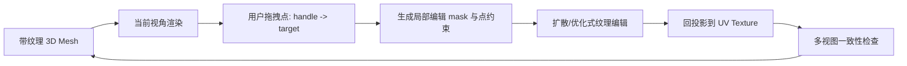

### Dragtex：基于点约束的交互式 3D 纹理编辑
```yaml
id: dragtex
name: Dragtex
full_name: 拖拽纹理编辑 (Dragtex)
year: "2026.02"
org: IEEE
paper_url: https://ieeexplore.ieee.org/document/11368713
category: texture
parent: hunyuan3d_21
motivation: 基于点的交互式纹理编辑
```

#### 📝 一句话总结
Dragtex 面向交互式纹理编辑，让用户通过拖拽点或指定点对来控制 3D 表面纹理的局部变化，解决纯文本编辑难以精确控制纹理位置和形状的问题。IEEE 页面在本次环境中不适合深度抓取，以下基于 manifest 元信息和交互式纹理编辑通用机制整理。

#### 🎯 核心要点
- 点式交互：用户在渲染视图或纹理表面选择 handle point 和 target point。
- 局部编辑：只修改 mask 覆盖的纹理区域，尽量保持其他区域不变。
- 3D 一致性：通过 UV/表面坐标把 2D 拖拽约束传播到 3D texture map。
- 扩散先验：使用图像编辑或纹理扩散模型保持编辑后纹理自然。
- 可迭代反馈：用户可多轮拖拽、预览、确认，逐步完成细粒度纹理编辑。

#### 🔬 深入细节
资料限制：未取得可公开嵌入的论文框架图直链，下面给出按点约束纹理编辑流程整理的框架图。



```python
# Dragtex 核心流程伪代码
mesh, texture = load_textured_asset()
view = render_current_view(mesh, texture)

handle_points, target_points = user_drag_points(view)
mask = build_local_edit_mask(handle_points, target_points, mesh.uv)

for step in range(edit_steps):
    edited_view = texture_edit_model(
        image=view.rgb,
        mask=mask,
        point_constraints=(handle_points, target_points),
        prompt=optional_text_prompt,
    )
    texture_candidate = project_to_uv(edited_view, mesh, view.camera)
    loss = point_alignment_loss(texture_candidate, target_points)
    loss += preserve_loss(texture_candidate, texture, outside=mask)
    texture = update_texture(texture, texture_candidate, mask, loss)

preview = render_multiview(mesh, texture)
```

纯文本纹理编辑的问题是控制粒度不够。用户说“把花纹往右移”或“让眼睛变大”时，模型很难知道具体哪个表面区域、移动多少、边界如何保持。Dragtex 类方法把编辑意图转成点约束：handle point 表示要移动的纹理位置，target point 表示目标位置。

在 3D 纹理编辑中，点不应只停留在屏幕坐标。系统需要通过渲染记录把屏幕点映射到 mesh 表面或 UV：

$$
u = \Pi^{-1}(p_{\text{screen}}, c, M)
$$

其中 \(p_{\text{screen}}\) 是用户点击点，\(c\) 是当前相机，\(M\) 是 mesh。映射到 UV 后，同一表面点在其他视角也能保持一致。

编辑模型通常需要两个约束：一是点对齐，让被拖拽区域朝目标点移动；二是保持约束，让 mask 外纹理不变。可以写成：

$$
\mathcal{L} =
\lambda_p \sum_i \| \phi(h_i) - t_i \|_2^2
+ \lambda_{keep}\|(1-m)\odot(T'-T)\|_1
+ \lambda_{prior}\mathcal{L}_{diff}
$$

其中 \(h_i,t_i\) 是 handle/target 点，\(m\) 是编辑 mask，\(T,T'\) 是编辑前后的纹理，\(\mathcal{L}_{diff}\) 表示扩散模型或图像先验带来的自然性约束。

> 💡 关键：Dragtex 的价值是把“用户可操作的点拖拽”转成“可优化、可投影、可保持 3D 一致的纹理约束”。

相对 Text2Tex/Hunyuan3D 这类生成式纹理系统，Dragtex 更偏后期编辑：它不一定重新生成整个资产，而是在已有纹理上做局部、可控、可交互修改。局限是点约束适合形变、移动和局部重绘，但对大范围语义替换或复杂材质物理属性编辑，还需要文本、mask 或 PBR 通道控制配合。

#### 🧪 练习题
```yaml
question: "Dragtex 中 handle point 和 target point 的作用是什么？"
options:
  - "指定纹理局部从哪里移动到哪里，提供精确交互约束"
  - "定义相机的焦距和光圈"
  - "替代 mesh 的所有顶点"
  - "只用于压缩纹理分辨率"
answer: 0
explain: "点对把用户拖拽意图转为可优化约束，再通过 UV/表面坐标传播到 3D 纹理图。"
```
