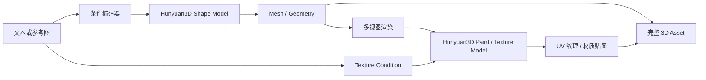

### Hunyuan3D 2.1：高质量形状与纹理联合生成
```yaml
id: hunyuan3d_21
name: Hunyuan3D 2.1
full_name: 混元3D 2.1 (Hunyuan3D 2.1)
year: "2026.03"
org: Tencent
paper_url: https://github.com/tencent/Hunyuan3D-2
category: texture
parent: trellis2
motivation: 78%盲测胜率高质量纹理
```

#### 📝 一句话总结
Hunyuan3D 2.1 面向工业级 3D 资产生产，将图/文到形状生成与高质量纹理生成组合成完整流水线，解决开源 3D 生成中几何可用性和纹理真实感不足的问题。manifest 指向 GitHub 项目而非论文 PDF；以下基于项目公开信息和 manifest 元信息整理。

#### 🎯 核心要点
- 两阶段资产生成：先生成几何/网格，再生成或细化纹理材质。
- 多条件输入：支持图像到 3D、文本到 3D 或图文联合条件。
- 形状生成模型：使用 3D 扩散/Transformer 类模型预测可导出几何。
- 纹理生成模型：基于多视图渲染、扩散补全和 UV 回投影生成高质量纹理。
- 质量目标：强调真实感、材质细节和用户盲测偏好，manifest 中记录 78% 盲测胜率。

#### 🔬 深入细节
资料限制：GitHub 项目入口可访问性和图片直链在本次环境中不稳定，下面给出规范化框架图。



```python
# Hunyuan3D 2.1 核心流程伪代码
condition = encode_text_image(prompt, reference_image)

# 1. 形状生成
shape_latent = shape_diffusion_or_transformer(condition)
mesh = decode_mesh(shape_latent)
mesh = postprocess_mesh(mesh)  # clean, remesh, UV unwrap

# 2. 纹理生成
views = render_geometry_views(mesh)
texture_views = texture_diffusion(
    condition=condition,
    geometry_views=views,
    normal_or_depth=render_normals_depth(mesh),
)
uv_texture = back_project_and_blend(texture_views, mesh.uv)

asset = export(mesh, uv_texture)
```

Hunyuan3D 2.1 代表的是工程化 3D 生成系统路线：单篇论文中的某个模型往往只解决形状或纹理的一部分，而真实资产生产需要几何、UV、纹理、材质、导出格式和交互工具串起来。它通常先用形状模型生成可用 mesh，再在该 mesh 上做多视图纹理生成。

形状阶段可以抽象为条件生成：

$$
G = D_{\theta}(z, c)
$$

其中 \(c\) 是文本/图像条件，\(z\) 是噪声或潜变量，\(G\) 是网格、隐式场或 3D latent。为了进入纹理阶段，系统需要得到拓扑相对干净、带 UV 或可自动展开 UV 的 mesh。

纹理阶段和 TEXTure/Text2Tex 有相似处，但更偏系统化。模型从多个相机渲染几何的 normal/depth/position map，再用扩散模型生成一致的纹理视图，最后回投影到 UV。损失或后处理会关注跨视图一致性：

$$
\mathcal{L}_{cons} =
\sum_{(i,j)} \| \Pi_i(T_i) - \Pi_j(T_j) \|_1
$$

其中 \(\Pi_i\) 表示把第 \(i\) 个视图的纹理结果映射到公共表面坐标。

> 💡 关键：Hunyuan3D 2.1 的优势来自端到端资产流水线质量，而不是单独某个纹理步骤；形状质量、UV、视图选择和纹理扩散都影响最终盲测偏好。

相对 TRELLIS 2 的原生 PBR 潜空间路线，Hunyuan3D 2.1 更像可落地的 shape-then-paint 系统；相对 Text2Tex，它的条件模型和工程后处理更完整，目标是直接产出可下载和编辑的 3D 资产。局限是复杂材质的物理分解、透明/毛发/布料等细节仍然很难完全自动化。

#### 🧪 练习题
```yaml
question: "Hunyuan3D 2.1 为什么通常采用先形状后纹理的流水线？"
options:
  - "因为纹理生成需要稳定几何、UV 和多视图渲染作为条件"
  - "因为形状生成不需要任何条件输入"
  - "因为纹理可以替代 mesh 拓扑"
  - "因为多视图渲染会降低一致性"
answer: 0
explain: "高质量纹理依赖可靠几何和表面参数化；先得到 mesh 后，才能渲染 normal/depth 并把纹理稳定回投影到 UV。"
```
