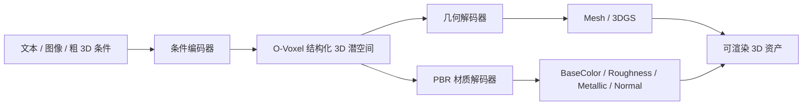

### TRELLIS 2：面向 PBR 材质的原生 3D 生成框架
```yaml
id: trellis2
name: TRELLIS 2
full_name: 微软TRELLIS 2 (TRELLIS 2)
year: "2025.12"
org: Microsoft Research
paper_url: https://trellis2.app/
category: texture
parent: text2tex
motivation: O-Voxel原生PBR材质生成
```

#### 📝 一句话总结
TRELLIS 2 面向原生 3D 资产生成，将几何与 PBR 材质统一到结构化体素/潜表示中建模，解决传统后贴图流程难以生成一致材质通道的问题。本次环境未取得稳定论文 PDF 或图片直链，以下基于 manifest 元信息、项目入口和 TRELLIS 系列公开技术脉络整理。

#### 🎯 核心要点
- 原生 3D 路线：不只生成多视图图片，而是在 3D 潜空间中生成资产。
- O-Voxel 表示：用结构化体素 token 承载占据、几何和材质属性。
- PBR 材质生成：同时预测 base color、roughness、metallic、normal 等材质通道。
- 多模态条件：可从文本、图像或粗几何条件生成完整 3D 资产。
- 解码器分离：潜表示可解码为 mesh、3DGS、纹理图或 PBR 材质贴图。

#### 🔬 深入细节
资料限制：项目页可作为入口，但未取得可稳定嵌入的框架图直链。下面是按 TRELLIS 2 描述整理的核心框架图。



```python
# TRELLIS 2 核心流程伪代码
condition = encode_condition(text=text_prompt, image=reference_image)

# 在结构化 O-Voxel 潜空间中生成 3D asset latent
z = initialize_3d_latent_grid()
for t in diffusion_or_flow_steps:
    z = denoise_or_flow_step(z, condition, timestep=t)

geometry = geometry_decoder(z)      # occupancy / SDF / mesh / Gaussian
pbr = material_decoder(z)           # albedo, roughness, metallic, normal
asset = package_asset(geometry, pbr)
```

传统纹理方法通常先得到几何，再在 UV 或多视图上补贴图。这种流程对 base color 有效，但对 PBR 材质不够自然，因为 roughness、metallic、normal 等通道必须与几何和语义保持一致。例如金属区域应同时影响颜色、高光和粗糙度，不能只在 RGB 纹理里局部涂亮。

TRELLIS 2 的思路是把材质作为 3D 资产的原生属性，而不是后处理贴图。O-Voxel 可以理解为一组结构化 3D token：

$$
z = \{z_i = (p_i, h_i)\}_{i=1}^{N}
$$

其中 \(p_i\) 表示体素或稀疏单元的位置，\(h_i\) 是包含几何和材质信息的隐向量。生成模型在这些 token 上进行扩散或 flow matching，直接学习 3D 资产分布。

PBR 解码器从同一个 3D latent 中预测多通道材质：

$$
M = \{A, R, Me, N\}
$$

其中 \(A\) 是 base color/albedo，\(R\) 是 roughness，\(Me\) 是 metallic，\(N\) 是 normal 或法线细节。因为这些通道来自共享 latent，它们更容易在语义和几何上对齐。

> 💡 关键：TRELLIS 2 的重点是“生成可用于真实渲染管线的材质资产”，而不只是生成看起来像 3D 的 RGB 外观。

相对 Text2Tex，TRELLIS 2 更接近原生 3D 生成：Text2Tex 在已有 mesh 上逐视角绘制纹理，TRELLIS 2 则在 3D latent 中联合生成几何和材质。它的挑战是训练数据必须包含高质量 PBR 标注或可分解材质，且 O-Voxel 表示需要同时兼顾稀疏性、细节和解码稳定性。

#### 🧪 练习题
```yaml
question: "TRELLIS 2 强调 PBR 材质生成的原因是什么？"
options:
  - "PBR 通道能与真实渲染管线中的光照交互，比单纯 RGB 纹理更可编辑和可复用"
  - "PBR 材质可以完全替代几何"
  - "PBR 只包含一张灰度图"
  - "PBR 会让模型不再需要训练数据"
answer: 0
explain: "PBR 材质包含 albedo、roughness、metallic、normal 等通道，能在不同光照和渲染器中保持物理一致的外观。"
```
