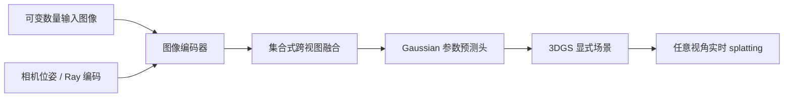

### YoNoSplat：单模型前馈 3DGS 重建
```yaml
id: yonosplat
name: YoNoSplat
full_name: 单模型前馈3DGS (YoNoSplat)
year: "2026.04"
org: ICLR
paper_url: https://openreview.net/forum?id=yono2026
category: feed_forward
parent: ilrm
motivation: 毫秒级任意视图重建
```

#### 📝 一句话总结
YoNoSplat 旨在用单一前馈模型从任意输入视图集合直接预测 3D Gaussian，实现毫秒级新视角重建。manifest 中的 OpenReview 链接在本次环境中无法稳定定位到论文页面；以下依据 manifest 元信息和前馈 3DGS 系列公开技术脉络整理。

#### 🎯 核心要点
- 单模型设定：不为不同视图数量、不同数据集或不同场景单独训练专用重建器。
- 任意视图输入：把输入图像集合当作无序 set 或可变长序列处理。
- 直接 3DGS 输出：预测 Gaussian 的位置、尺度、旋转、不透明度和颜色特征。
- 几何感知融合：使用相机编码、ray token 或代价体线索把跨视图证据对齐。
- 毫秒级渲染：输出 3DGS 后用 splatting 实现快速任意视角渲染。

#### 🔬 深入细节
资料限制：未取得稳定论文图片直链，下面给出按公开描述整理的框架图。



```python
# YoNoSplat 核心流程伪代码
images, cameras = load_variable_view_inputs()
tokens = []
for image, camera in zip(images, cameras):
    feat = image_encoder(image)
    ray = ray_embedding(camera, image.shape)
    tokens.append(fuse(feat, ray))

scene_tokens = set_transformer(tokens)       # 对输入视图数量不敏感
gaussians = gaussian_decoder(scene_tokens)   # xyz, scale, rotation, opacity, color

for cam in novel_views:
    pred = gaussian_splatting(gaussians, cam)
loss = photometric_loss(pred, target_images)
```

YoNoSplat 所处的问题背景是前馈 3DGS 重建的“专用化”倾向。许多模型在固定视图数、固定分辨率或固定场景类型上表现很好，但部署时输入往往是任意数量的图片：有时只有两三张，有时有几十张；有时视角稀疏，有时覆盖充分。单模型目标就是让同一个网络在这些输入条件下保持稳定。

为了处理可变视图，模型需要避免把输入写死成固定通道或固定网格。常见做法是把每张图像编码成 token，并附加相机或 ray 信息：

$$
z_i = E(I_i, c_i)
$$

然后用集合式 Transformer、交叉注意力或池化机制得到场景表示：

$$
S = F(\{z_i\}_{i=1}^{N})
$$

其中 \(F\) 应该对输入顺序尽量不敏感，并能随视图数量增加吸收更多证据。

输出 3DGS 的好处是推理路径短。Gaussian 参数可以直接进入 rasterizer：

$$
g_k=(\mu_k, s_k, q_k, \alpha_k, \mathbf{c}_k)
$$

其中 \(\mu_k\) 是中心，\(s_k\) 是尺度，\(q_k\) 表示旋转，\(\alpha_k\) 是不透明度，\(\mathbf{c}_k\) 是颜色或球谐特征。渲染损失对目标视角监督后，网络学会把多视图证据融合成显式高斯场。

> 💡 关键：YoNoSplat 的“单模型”价值在于减少工程部署中的模型选择和输入规格限制，而不只是把某个固定 benchmark 做快。

与 iLRM 的关系可以理解为同属前馈 3DGS 路线：iLRM 更强调迭代高效融合和高分辨率扩展，YoNoSplat 更强调单模型覆盖任意视图场景。与优化式 3DGS 相比，它用训练好的网络摊销优化成本，牺牲少量逐场景最优性换取毫秒级或近实时响应。

#### 🧪 练习题
```yaml
question: "YoNoSplat 中单模型设计的主要目的是什么？"
options:
  - "让每个测试场景都从零训练一个网络"
  - "在不同输入视图数量和场景条件下复用同一前馈 3DGS 重建器"
  - "只支持固定四视图输入"
  - "避免使用 Gaussian Splatting 渲染"
answer: 1
explain: "单模型设计面向可变视图输入和部署泛化，直接输出 3DGS 后可快速渲染任意视角。"
```
