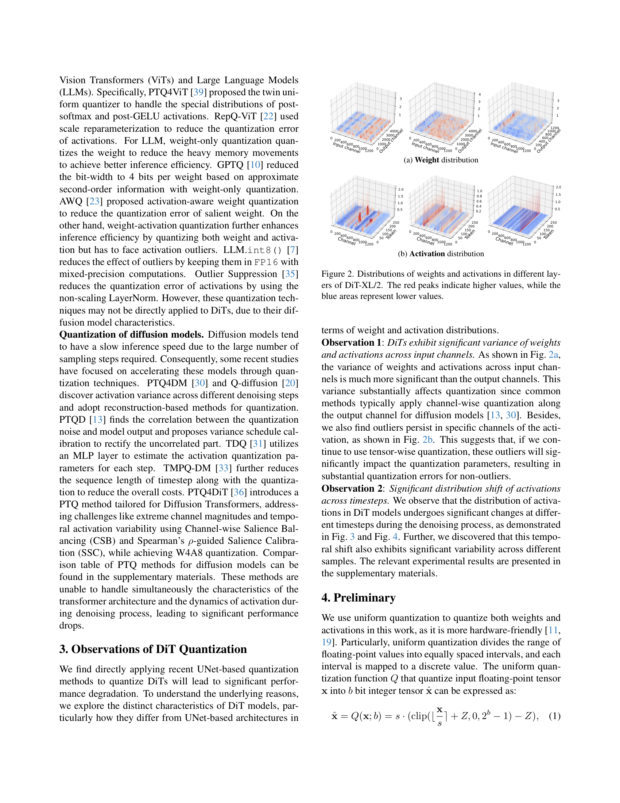
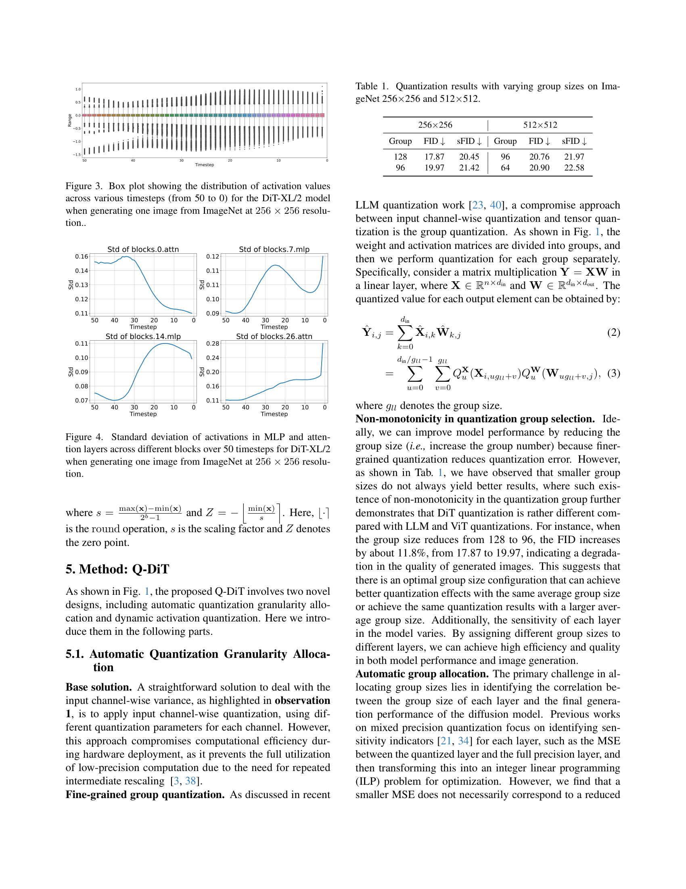
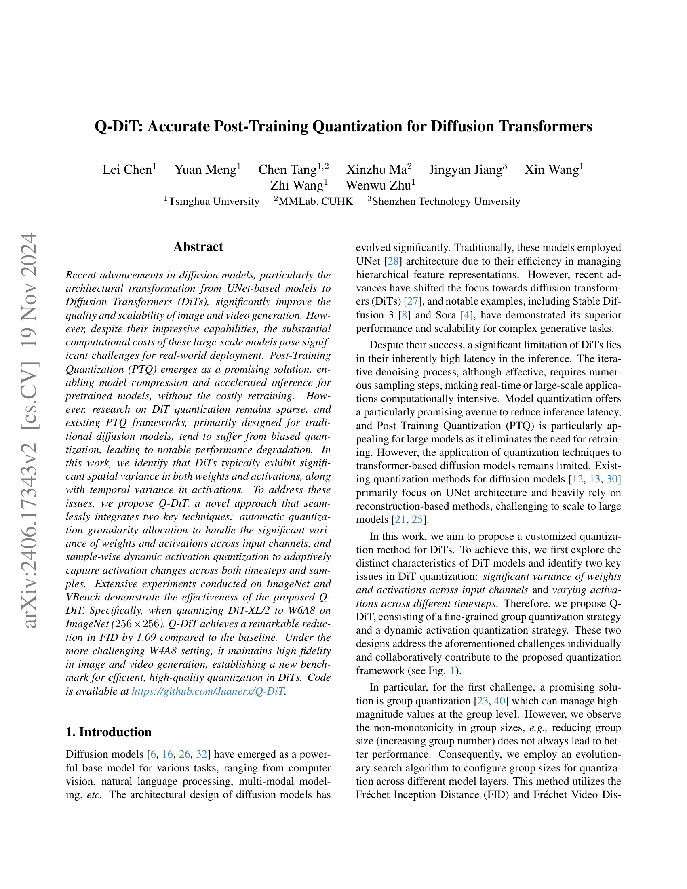
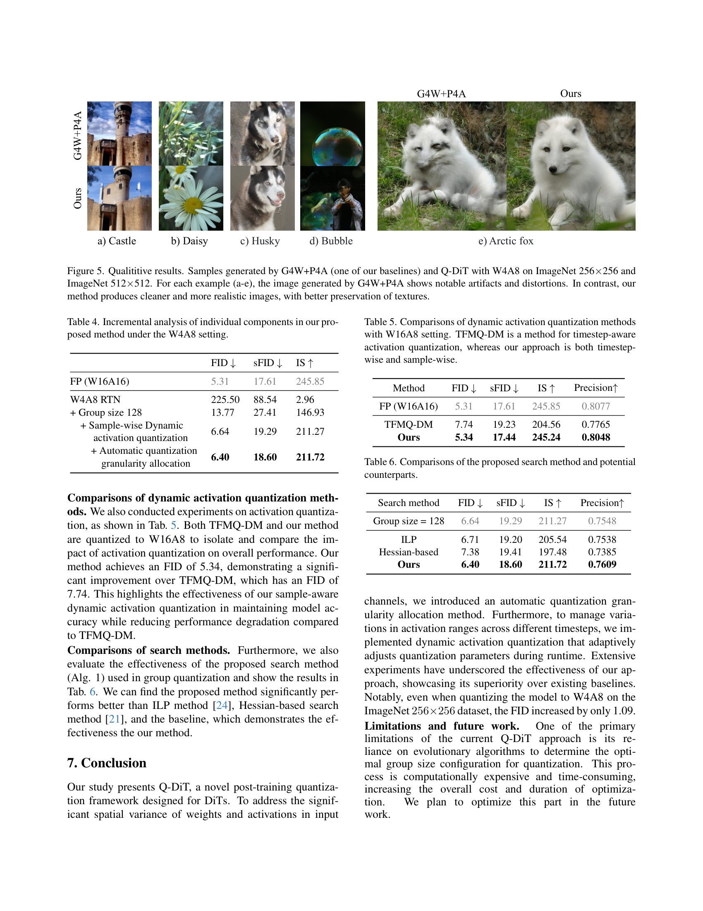

# [Q-DiT: Accurate Post-Training Quantization for Diffusion Transformers](https://arxiv.org/abs/2406.17343)

```yaml
id: q-dit
tags: [diffusion-transformer, post-training-quantization, low-bit-inference, image-generation, video-generation]
date: 2024-06-25
significance: 8/10
```

## 一句话总结

Q-DiT 提出了面向 Diffusion Transformer (DiT) 的后训练量化框架，通过**自动量化粒度分配**（进化搜索逐层最优 group size）和**样本级动态激活量化**（推理时在线计算量化参数），在 W4A8 设置下将 DiT-XL/2 的 FID 劣化控制在仅 1.09 以内。

## 要点

- **问题发现**：DiT 的权重和激活在**输入通道维度**上存在显著方差（Observation 1），且激活分布随去噪时间步和不同样本发生**剧烈漂移**（Observation 2），导致直接套用 UNet 量化方法会严重退化。
- **组量化的非单调性**：减小 group size 并不总能改善量化效果（如 group 128→96 时 FID 反而上升 11.8%），因此需要逐层自适应分配 group size。
- **自动量化粒度分配**：以 FID/FVD 为直接优化目标，通过进化算法（交叉+变异）在 BitOps 约束下搜索每层最优 group size 配置。
- **样本级动态激活量化**：推理时根据当前样本和时间步的实际 min-max 值在线计算每组量化参数，并通过算子融合使开销可忽略。
- **实验效果**：在 ImageNet 256×256 W4A8 + cfg=1.5 下，Q-DiT FID=6.40（FP=5.31），大幅优于 PTQ4DiT 的 7.75 和 G4W+P4A 的 7.66；在视频生成（STDiT3/VBench）16 个指标中 15 个优于基线。

## 细节

### 1. 背景与动机

Diffusion Transformer (DiT) 将 Transformer 架构引入扩散模型，在图像和视频生成中取得了 SOTA 效果，但其推理成本极高。后训练量化（PTQ）是一种无需重训练即可压缩模型的高效方法，但现有 PTQ 方法（面向 UNet 或 ViT）直接应用于 DiT 时效果不佳。

**两个关键观察：**


*Figure 2: DiT-XL/2 不同层的权重（上）和激活（下）分布。红色峰值表示高值，蓝色区域表示低值。输入通道维度的方差远大于输出通道。*

**Observation 1 — 输入通道方差显著**：DiT 的权重和激活在输入通道方向上的方差远大于输出通道方向。传统扩散模型量化沿输出通道做 channel-wise 量化，无法处理输入通道的异常值。


*Figure 3-4: 激活值的范围和标准差随去噪时间步（50→0）显著变化，且不同 block 的变化模式各异。*

**Observation 2 — 激活分布随时间步和样本剧烈漂移**：不同时间步的激活范围差异巨大，且同一时间步下不同样本的分布也有显著差异，使得静态量化参数无法适配。

### 2. 量化基础

采用均匀量化（uniform quantization），将浮点张量 $\mathbf{x}$ 量化为 $b$ 比特整数：

$$\hat{\mathbf{x}} = Q(\mathbf{x}; b) = s \cdot \left(\text{clip}\left(\left\lfloor \frac{\mathbf{x}}{s} \right\rceil + Z,\; 0,\; 2^b - 1\right) - Z\right)$$

其中缩放因子和零点为：

$$s = \frac{\max(\mathbf{x}) - \min(\mathbf{x})}{2^b - 1}, \quad Z = -\left\lfloor \frac{\min(\mathbf{x})}{s} \right\rceil$$

### 3. 方法一：自动量化粒度分配（Automatic Quantization Granularity Allocation）

#### 3.1 组量化（Group Quantization）

在输入通道维度上将权重和激活矩阵分组，每组独立量化。对于矩阵乘法 $\mathbf{Y} = \mathbf{X}\mathbf{W}$（$\mathbf{X} \in \mathbb{R}^{n \times d_{in}}$，$\mathbf{W} \in \mathbb{R}^{d_{in} \times d_{out}}$），量化后的输出为：

$$\hat{Y}_{i,j} = \sum_{u=0}^{d_{in}/g_{ll} - 1} \sum_{v=0}^{g_{ll}} Q_u^X(X_{i, u \cdot g_{ll}+v}) \cdot Q_u^W(W_{u \cdot g_{ll}+v, j})$$

其中 $g_{ll}$ 为组大小，每组使用独立的量化函数 $Q_u^X$ 和 $Q_u^W$。

#### 3.2 非单调性现象

| 分辨率 | Group Size | FID ↓ | sFID ↓ |
|--------|-----------|-------|--------|
| 256×256 | 128 | 17.87 | 20.45 |
| 256×256 | 96 | 19.97 | 21.42 |
| 512×512 | 96 | 20.76 | 21.97 |
| 512×512 | 64 | 20.90 | 22.58 |

减小 group size 并不总能改善效果，说明存在最优配置，需要逐层搜索。

#### 3.3 进化搜索算法

直接以 FID（图像）或 FVD（视频）为优化目标：

$$\mathbf{g}^* = \arg\min_{\mathbf{g}} L(\mathbf{g}), \quad \text{s.t.} \; B(\mathbf{g}) \leq N_{\text{bitops}}$$

其中 $L(\mathbf{g}) = \text{FID}(\mathcal{R}, \mathcal{G}_{\mathbf{g}})$，$\mathbf{g} = \{g_1, g_2, \ldots, g_N\}$ 为逐层 group size 配置，$B(\cdot)$ 计算 BitOps。

```
Algorithm 1: Automatic Quantization Granularity Allocation
────────────────────────────────────────────────────
Input: 搜索空间 S_g = {32, 64, 128, 192, 288}
       层数 L, 种群大小 N_p, 迭代次数 N_iter
       变异概率 p, BitOps 约束 N_bitops

1. 初始化种群 P = {g_j}_{j=1}^{N_p}，每层 group size 从 S_g 随机选取
2. 初始化 TopK 候选集 S_TopK = ∅
3. FOR t = 1 to N_iter:
   a. 对每个配置 g_j 计算 FID（或 FVD）
   b. 用排名最优的 K 个配置更新 S_TopK
   c. 清空种群 P
   d. 交叉阶段：从 S_TopK 中交叉产生 N_p/2 个新配置
      （仅保留满足 BitOps 约束的）
   e. 变异阶段：从 S_TopK 中变异产生 N_p/2 个新配置
      （仅保留满足 BitOps 约束的）
4. 返回最优配置 g_best，用于量化模型
```

**关键设计选择**：不使用 MSE 等代理指标（实验发现 MSE 更小不一定 FID 更低），而是直接用生成质量指标作为搜索目标。搜索空间为 $\{32, 64, 128, 192, 288\}$，同一层的权重和激活使用相同 group size。

### 4. 方法二：样本级动态激活量化（Sample-wise Dynamic Activation Quantization）

传统方法为每个时间步预存量化参数（如 TFMQ-DM），但在细粒度组量化下，50 个时间步的参数存储开销可达全精度模型的 39%。

Q-DiT 的方案：**推理时在线计算**每组激活的量化参数：

$$s_{i,t} = \frac{\max(\mathbf{x}_{i,t}) - \min(\mathbf{x}_{i,t})}{2^b - 1}, \quad Z_{i,t} = -\left\lfloor \frac{\min(\mathbf{x}_{i,t})}{s_{i,t}} \right\rceil$$

其中 $i$ 为样本索引，$t$ 为时间步。通过将 min-max 计算融合到前序算子中（operator fusion），动态量化的额外开销相比 Transformer 块中的矩阵乘法可忽略不计。

**与 TFMQ-DM 的对比**（W16A8）：

| 方法 | FID ↓ | sFID ↓ | IS ↑ | Precision ↑ |
|------|-------|--------|------|------------|
| FP (W16A16) | 5.31 | 17.61 | 245.85 | 0.8077 |
| TFMQ-DM | 7.74 | 19.23 | 204.56 | 0.7765 |
| **Q-DiT (Ours)** | **5.34** | **17.44** | **245.24** | **0.8048** |

Q-DiT 的动态量化几乎无损（FID 仅增加 0.03），而 TFMQ-DM 的时间步感知方法 FID 劣化 2.43。

### 5. 整体框架


*Figure 1: Q-DiT 框架概览。左侧展示自动量化粒度分配（进化搜索逐层 group size），右侧展示样本级动态激活量化（推理时在线计算量化参数）。*

权重量化采用 GPTQ，激活量化采用非对称均匀量化 + 动态参数。默认 group size 为 128，通过进化搜索为每层分配最优 group size。

### 6. 实验结果

#### 6.1 图像生成（DiT-XL/2, ImageNet）

**核心结果（256×256, 100 steps, cfg=1.5）：**

| 方法 | W/A | Size(MB) | FID ↓ | sFID ↓ | IS ↑ | Precision ↑ |
|------|-----|----------|-------|--------|------|------------|
| FP | 16/16 | 1349 | 5.31 | 17.61 | 245.85 | 0.8077 |
| PTQ4DM | 4/8 | 339 | 215.68 | 86.63 | 3.24 | 0.0741 |
| RepQ-ViT | 4/8 | 339 | 226.60 | 77.93 | 3.61 | 0.0337 |
| TFMQ-DM | 4/8 | 339 | 141.90 | 56.01 | 6.24 | 0.0439 |
| PTQ4DiT | 4/8 | 339 | 7.75 | 22.01 | 190.38 | 0.7292 |
| G4W+P4A | 4/8 | 351 | 7.66 | 20.76 | 193.76 | 0.7261 |
| **Q-DiT** | **4/8** | **347** | **6.40** | **18.60** | **211.72** | **0.7609** |

W4A8 下 Q-DiT 的 FID 仅比 FP 高 1.09，而次优方法 G4W+P4A 高 2.35。在 W6A8 下 Q-DiT 几乎无损（FID 5.32 vs FP 5.31）。

**512×512 分辨率（50 steps, cfg=1.5, W4A8）：**

| 方法 | FID ↓ | sFID ↓ | IS ↑ | Precision ↑ |
|------|-------|--------|------|------------|
| FP | 6.27 | 18.45 | 204.47 | 0.8343 |
| PTQ4DiT | 11.69 | 22.86 | 117.34 | 0.7121 |
| G4W+P4A | 9.98 | 20.76 | 156.07 | 0.7840 |
| **Q-DiT** | **7.82** | **19.60** | **174.18** | **0.8127** |

#### 6.2 视频生成（STDiT3, VBench, W4A8）

在 VBench 的 16 个评估维度中，Q-DiT 在 15 个维度上优于 G4W+P4A 基线，且多数指标接近全精度模型。

#### 6.3 消融实验

**各组件增量贡献（256×256, 100 steps, cfg=1.5, W4A8）：**

| 配置 | FID ↓ | sFID ↓ | IS ↑ |
|------|-------|--------|------|
| FP (W16A16) | 5.31 | 17.61 | 245.85 |
| W4A8 RTN | 225.50 | 88.54 | 2.96 |
| + Group size 128 | 13.77 | 27.41 | 146.93 |
| + 动态激活量化 | 6.64 | 19.29 | 211.27 |
| + 自动粒度分配 | **6.40** | **18.60** | **211.72** |

组量化是最大的改进来源（FID 225.50→13.77），动态激活量化进一步将 FID 降至 6.64，自动粒度分配提供额外 0.24 的 FID 改善。

**搜索方法对比：**

| 搜索方法 | FID ↓ | IS ↑ | Precision ↑ |
|---------|-------|------|------------|
| 固定 Group=128 | 6.64 | 211.27 | 0.7548 |
| ILP | 6.71 | 205.54 | 0.7538 |
| Hessian-based | 7.38 | 197.48 | 0.7385 |
| **进化搜索 (Ours)** | **6.40** | **211.72** | **0.7609** |

直接以 FID 为目标的进化搜索优于基于 MSE 代理指标的 ILP 和 Hessian 方法。

### 7. 可视化对比


*Figure 5: W4A8 下 G4W+P4A 与 Q-DiT 的生成样本对比。G4W+P4A 产生明显伪影和失真，Q-DiT 生成更清晰、纹理保持更好的图像。*

### 8. 局限性

- 进化搜索过程计算开销较大，增加了优化的总成本和时间。
- 未探索更低比特（如 W3A4 或 W2A8）的极端量化场景。

## 练习题

1. **概念理解**：为什么 DiT 中减小量化 group size 不一定能改善生成质量（非单调性现象）？请从量化误差累积和矩阵乘法的角度分析可能的原因。

2. **方法对比**：Q-DiT 的动态激活量化与 TFMQ-DM 的时间步感知量化有何本质区别？为什么前者在细粒度组量化下更有优势？

3. **算法设计**：如果将进化搜索中的 FID 目标替换为逐层 MSE 最小化 + ILP 求解，实验表明效果会变差。请解释为什么 MSE 作为代理指标在 DiT 量化中不够可靠。

4. **工程实现**：Q-DiT 声称动态量化的 min-max 计算通过算子融合使开销可忽略。请设计一个具体的算子融合方案，说明如何将 min-max 统计嵌入到 LayerNorm 或前一个线性层的输出计算中。

5. **扩展思考**：Q-DiT 目前仅在 DiT-XL/2 和 STDiT3 上验证。如果要将其应用到更大规模的视频生成模型（如 Sora 级别），你预期会遇到哪些新的挑战？进化搜索的成本如何控制？