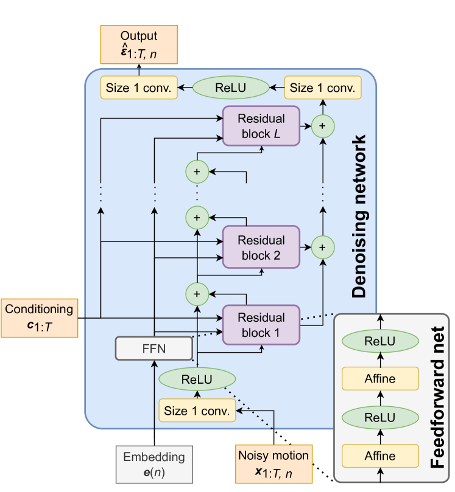
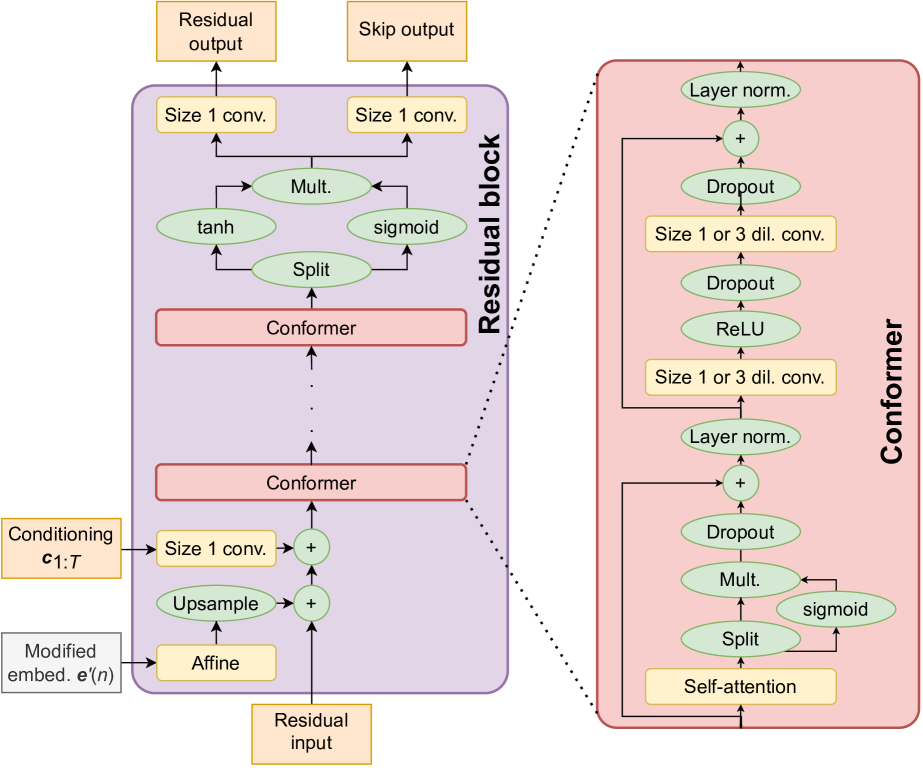

## 总结

本文提出 **LDA (Listen, Denoise, Action!)**，一个基于扩散概率模型的音频驱动人体运动合成通用框架。核心架构改编自语音合成模型 DiffWave，使用残差膨胀卷积堆叠配合 Conformer 模块（自注意力 + 卷积），以非自回归方式并行生成与输入音频等帧率的运动序列。该方法首次将扩散模型引入手势生成领域，通过 classifier-free guidance 实现无需额外分类器的风格控制，并创新性地提出 product-of-experts (PoE) 机制将多个异构扩散模型的输出融合，实现风格插值与迁移。在 Trinity Speech-Gesture、ZeroEGGS、Motorica Dance、100STYLE 和 MMA 格斗等五个数据集上的大规模用户研究表明，LDA 在自然度和风格适配性上显著优于现有方法。

## 要点

1. **首个扩散模型用于手势生成**：将 DiffWave 架构从 1D 音频波形生成适配到多维人体运动序列生成，输出为与输入音频同帧率的向量值序列（关节旋转的指数映射表示）。

2. **Conformer 架构融合局部与全局建模**：在残差块中引入 Conformer 模块，结合自注意力（捕获长程依赖）和深度可分离卷积（捕获局部模式），显著提升运动质量。

3. **Classifier-free guidance 实现风格控制**：训练时以一定概率丢弃风格标签（替换为空标签 ∅），推理时通过引导强度参数 $s$ 在无条件与条件预测之间插值，无需训练额外分类器即可增强风格表达。

4. **Product-of-Experts (PoE) 组合异构模型**：将多个独立训练的扩散模型视为 experts，通过加权组合其噪声预测实现风格插值与迁移，可跨数据集、跨骨骼拓扑组合模型。

5. **大规模用户研究验证**：在 5 个数据集上进行系统性用户研究（MUSHRA 协议），LDA 在手势自然度、舞蹈质量、风格适配等维度上均显著优于 Flow-based、GAN-based 和 Transformer-based 基线方法。

## 深入

### 3.1 问题定义与动机

音频驱动的人体运动合成是一个 **一对多映射** 问题：同一段音频可以对应多种合理的运动。传统确定性模型（如回归模型）倾向于输出所有可能运动的均值，导致生成结果过于平滑、缺乏表现力。概率生成模型（如 VAE、Normalizing Flow、GAN）虽然能建模多模态分布，但各有局限——VAE 的后验坍缩、Flow 的架构限制、GAN 的训练不稳定和模式坍缩。

扩散模型（Denoising Diffusion Probabilistic Models, DDPM）通过逐步去噪的方式生成样本，具有训练稳定、分布覆盖全面的优势，已在图像和音频生成中取得巨大成功。本文首次将其系统性地应用于音频驱动的运动合成。

### 3.2 扩散过程


*图 1：LDA 系统概览。左侧为训练过程（前向扩散 + 去噪网络学习），右侧为推理过程（从噪声逐步去噪生成运动）。*

**前向过程（Forward Process）**：给定干净的运动数据 $\mathbf{x}_0$，通过逐步添加高斯噪声得到一系列越来越嘈杂的版本：

$$q(\mathbf{x}_n | \mathbf{x}_0) = \mathcal{N}(\mathbf{x}_n; \sqrt{\bar{\alpha}_n} \mathbf{x}_0, (1 - \bar{\alpha}_n)\mathbf{I})$$

其中 $\bar{\alpha}_n = \prod_{i=1}^{n} \alpha_i$，$\alpha_i = 1 - \beta_i$，$\beta_i$ 为预定义的噪声调度。当 $n$ 足够大时，$\mathbf{x}_N \approx \mathcal{N}(\mathbf{0}, \mathbf{I})$。

**反向过程（Reverse Process）**：从纯噪声 $\mathbf{x}_N \sim \mathcal{N}(\mathbf{0}, \mathbf{I})$ 出发，通过学习到的去噪网络 $\boldsymbol{\epsilon}_\theta$ 逐步去噪：

$$\mathbf{x}_{n-1} = \frac{1}{\sqrt{\alpha_n}} \left( \mathbf{x}_n - \frac{\beta_n}{\sqrt{1 - \bar{\alpha}_n}} \boldsymbol{\epsilon}_\theta(\mathbf{x}_n, \mathbf{c}, n) \right) + \sigma_n \mathbf{z}$$

其中 $\mathbf{c}$ 为条件信息（音频特征、风格标签等），$\mathbf{z} \sim \mathcal{N}(\mathbf{0}, \mathbf{I})$，$\sigma_n$ 为噪声标准差。

**训练目标**：简化的噪声预测损失（score matching）：

$$\mathcal{L} = \mathbb{E}_{n, \mathbf{x}_0, \boldsymbol{\epsilon}} \left[ \| \boldsymbol{\epsilon} - \boldsymbol{\epsilon}_\theta(\mathbf{x}_n, \mathbf{c}, n) \|_2^2 \right]$$

```
算法 1: LDA 训练过程
────────────────────────────────
输入: 运动数据 x_0, 条件 c (音频+风格), 噪声调度 {β_n}
输出: 训练好的去噪网络 ε_θ

repeat:
    从训练集采样 (x_0, c)
    采样 n ~ Uniform(1, N)
    采样 ε ~ N(0, I)
    计算 x_n = √(ᾱ_n) * x_0 + √(1 - ᾱ_n) * ε
    
    # Classifier-free guidance: 以概率 p_uncond 丢弃风格标签
    if random() < p_uncond:
        c_style = ∅  (空标签)
    
    计算损失 L = ||ε - ε_θ(x_n, c, n)||²
    梯度下降更新 θ
until 收敛
```

```
算法 2: LDA 推理过程 (带 Classifier-free Guidance)
────────────────────────────────
输入: 条件 c, 风格标签 y, 引导强度 s, 扩散步数 N
输出: 生成的运动序列 x_0

x_N ~ N(0, I)
for n = N, N-1, ..., 1:
    # Classifier-free guidance
    ε_guided = (1 + s) * ε_θ(x_n, c, y, n) - s * ε_θ(x_n, c, ∅, n)
    
    # 去噪一步
    x_{n-1} = (1/√α_n) * (x_n - β_n/√(1-ᾱ_n) * ε_guided) + σ_n * z
    
    其中 z ~ N(0, I) if n > 1, else z = 0
return x_0
```

### 3.3 网络架构


*图 2：LDA 网络架构详解。(a) 整体去噪网络：残差块堆叠 + skip connections；(b) 单个残差块：膨胀卷积 + 条件注入；(c) Conformer 模块：自注意力 + 深度可分离卷积的串联。*

LDA 的去噪网络改编自 **DiffWave**（原用于语音合成），核心设计如下：

#### 整体架构（图 2a）

- **输入**：噪声运动 $\mathbf{x}_n \in \mathbb{R}^{T \times D}$（$T$ 帧，$D$ 维关节旋转）
- **输入投影**：1×1 卷积将 $D$ 维映射到隐藏维度 $H$
- **残差堆叠**：$L$ 个残差块，使用 **循环膨胀** 的因果卷积（dilation rates: 1, 2, 4, ..., 循环多次）
- **Skip connections**：每个残差块输出一个 skip 分支，所有 skip 分支求和后经两层 1×1 卷积 + ReLU 投影回 $D$ 维
- **输出**：预测的噪声 $\hat{\boldsymbol{\epsilon}} \in \mathbb{R}^{T \times D}$

#### 残差块（图 2b）

每个残差块的处理流程：

1. **膨胀卷积**：对时间维度进行膨胀卷积，捕获不同尺度的时序模式
2. **条件注入**：
   - **扩散步 $n$**：通过正弦位置编码 + 线性层，以 bias 形式加入
   - **音频特征 $\mathbf{c}$**：通过 1×1 卷积投影后加入
   - **风格标签 $y$**：通过 embedding + 线性层，以 FiLM 方式（scale + shift）调制
3. **非线性**：Gated activation（sigmoid × tanh，类似 WaveNet）
4. **输出分支**：分为 residual 和 skip 两个 1×1 卷积输出

#### Conformer 模块（图 2c）

这是 LDA 相对于原始 DiffWave 的**关键改进**。Conformer 源自语音识别领域，结合了：

- **多头自注意力（MHSA）**：捕获全局长程依赖，使模型能够建模运动序列中远距离帧之间的关系
- **深度可分离卷积（Depthwise Separable Conv）**：高效捕获局部时序模式
- **前馈网络（FFN）**：两个 "半步" FFN 分别放在 MHSA 前后（Macaron-Net 结构）
- **Layer Normalization**：每个子模块前都有 LayerNorm

Conformer 模块被插入到残差块的膨胀卷积之后、条件注入之前。消融实验表明，加入 Conformer 显著提升了生成运动的自然度。

### 3.4 运动表示

- **关节旋转**：使用相对于 T-pose 的 **指数映射（exponential map）** 表示，每个关节 3 个参数
- **根运动**：包含根关节的位移和旋转
- **帧率**：30 fps
- **优势**：指数映射避免了四元数的符号歧义和欧拉角的万向锁问题，同时维度紧凑

### 3.5 Classifier-Free Guidance 实现风格控制

对于带风格标签的数据集（如 100STYLE 的 100 种运动风格），LDA 使用 classifier-free guidance 来增强风格表达：

**训练阶段**：以概率 $p_\text{uncond}$（论文中取 0.1-0.2）将风格标签替换为空标签 $\varnothing$，使模型同时学习条件和无条件分布。

**推理阶段**：通过引导强度 $s$ 控制风格表达程度：

$$\hat{\boldsymbol{\epsilon}}_\text{guided} = (1 + s) \cdot \boldsymbol{\epsilon}_\theta(\mathbf{x}_n, \mathbf{c}, y, n) - s \cdot \boldsymbol{\epsilon}_\theta(\mathbf{x}_n, \mathbf{c}, \varnothing, n)$$

- $s = 0$：标准条件生成
- $s > 0$：增强风格表达（远离无条件分布）
- $s < 0$：弱化风格表达

这种方法的优势在于：
1. 不需要训练额外的分类器
2. 引导强度可在推理时灵活调节
3. 一个模型即可处理所有风格

### 3.6 Product-of-Experts (PoE) 组合异构模型

这是论文的另一个重要创新。当有多个独立训练的扩散模型时（可能在不同数据集、不同骨骼拓扑上训练），PoE 允许在推理时将它们组合：

**核心思想**：多个高斯分布的乘积仍然是高斯分布。如果每个模型 $k$ 在去噪步 $n$ 预测的后验为 $\mathcal{N}(\boldsymbol{\mu}_k, \sigma_n^2 \mathbf{I})$，则组合后的分布为：

$$\boldsymbol{\mu}_\text{PoE} = \sum_k w_k \boldsymbol{\mu}_k, \quad \text{where} \sum_k w_k = 1$$

等价于对噪声预测的加权平均：

$$\hat{\boldsymbol{\epsilon}}_\text{PoE} = \sum_k w_k \hat{\boldsymbol{\epsilon}}_k$$

**实际应用场景**：

1. **同一数据集内的风格插值**：组合同一模型在不同风格标签下的预测
2. **跨数据集风格迁移**：组合在不同数据集上训练的模型（如手势模型 + 风格locomotion模型）
3. **跨骨骼拓扑组合**：不同模型可能使用不同的骨骼定义，只需在共有关节上进行组合

```
算法 3: Product-of-Experts 推理
────────────────────────────────
输入: K 个扩散模型 {ε_θ^k}, 权重 {w_k}, 条件 {c_k}
输出: 组合生成的运动 x_0

x_N ~ N(0, I)
for n = N, N-1, ..., 1:
    for k = 1, ..., K:
        ε_k = ε_θ^k(x_n, c_k, n)  # 每个模型独立预测噪声
    
    # 加权组合（仅在共有关节维度上）
    ε_combined = Σ_k w_k * ε_k
    
    # 用组合噪声去噪
    x_{n-1} = denoise_step(x_n, ε_combined, n)
return x_0
```

### 3.7 实验设置

#### 数据集

| 数据集 | 时长 | 任务 | 特点 |
|--------|------|------|------|
| **Trinity Speech-Gesture (TSG)** | 244 min | 语音手势 | 单人录制，自发语音 |
| **ZeroEGGS** | 135 min | 情感手势 | 19种情感风格标签 |
| **Motorica Dance** | 373 min | 舞蹈 | 多种舞蹈风格 |
| **100STYLE** | 1125 min | 风格化locomotion | 100种运动风格 |
| **MMA** | 60 min | 格斗动作 | 用于PoE跨数据集实验 |

#### 评估方法

论文强调**用户研究是评估运动生成质量的金标准**，因为现有客观指标（如 FGD）与人类感知的相关性尚未充分验证。

**MUSHRA 协议**：
- 参与者同时观看多个系统的输出（随机排列）+ 隐藏的真实参考
- 对每个样本在 0-100 分范围内评分
- 包含锚点（anchor）用于质量控制
- 每个实验约 20-30 名参与者

### 3.8 实验结果

#### 手势生成（TSG 数据集）

在 Trinity Speech-Gesture 数据集上，LDA 与以下基线比较：
- **MoGlow**：基于 Normalizing Flow 的方法
- **Diff-TTSG**：基于 Transformer 的扩散模型
- **Ground Truth**：真实动作捕捉数据

用户研究结果显示 LDA 显著优于所有基线方法，且与真实数据的差距较小。

#### 风格化手势（ZeroEGGS 数据集）

在 ZeroEGGS 数据集上评估情感风格手势生成：
- LDA 在自然度和风格适配性两个维度上均优于 ZeroEGGS 原方法
- Classifier-free guidance 有效增强了情感表达

#### 舞蹈生成（Motorica Dance）

与 EDGE（基于 Transformer 的扩散模型）比较：
- LDA 在舞蹈自然度上获得更高评分
- 节拍对齐（beat alignment）指标上两者接近

#### 100STYLE 风格化运动

在 100 种运动风格上的实验：
- 使用 classifier-free guidance 的 LDA 在风格识别率上显著优于无 guidance 版本
- 引导强度 $s$ 的增大可以增强风格表达，但过大会导致运动失真

#### PoE 跨模型组合

实验验证了 PoE 的有效性：
- **风格插值**：在两种风格之间平滑过渡
- **跨数据集迁移**：将 100STYLE 的风格迁移到 TSG 的手势模型上
- 用户研究确认组合结果保持了自然度同时融合了目标风格

### 3.9 消融实验与分析

| 组件 | 效果 |
|------|------|
| **Conformer** | 移除后运动质量显著下降，用户评分降低约 10-15 分 |
| **Classifier-free guidance** | $s=0$ 时风格表达较弱，$s=1\sim3$ 为最佳范围 |
| **扩散步数** | 使用 DDIM 加速可将步数从 1000 减至 25-50 步，质量损失很小 |
| **膨胀卷积** | 循环膨胀结构对捕获多尺度时序模式至关重要 |

### 3.10 关键设计选择讨论

**为什么选择 DiffWave 而非 U-Net？**
- DiffWave 的 1D 卷积架构天然适合时序数据
- 残差膨胀卷积的感受野可以覆盖长时间窗口
- 相比 U-Net 的下采样-上采样结构，DiffWave 保持了全分辨率处理，避免了时序信息损失

**为什么使用指数映射而非其他旋转表示？**
- 避免四元数的双覆盖问题（$q$ 和 $-q$ 表示同一旋转）
- 避免欧拉角的万向锁
- 3 参数表示比 6D/9D 旋转表示更紧凑
- 相对于 T-pose 的表示使得不同骨骼拓扑间的 PoE 组合更容易

**非自回归 vs 自回归**：
- LDA 采用非自回归生成，一次性生成整个序列
- 优势：避免误差累积，可并行计算
- 劣势：需要预知序列长度，长序列需要分段处理（使用重叠窗口拼接）

### 3.11 局限性

1. **推理速度**：扩散模型需要多步迭代去噪，实时性受限（虽然 DDIM 可加速）
2. **长序列处理**：非自回归架构需要固定窗口长度，长序列需要滑动窗口拼接
3. **手指细节**：当前实验未涉及手指运动，主要关注身体和手臂
4. **客观评估**：论文承认现有客观指标（FGD 等）与人类感知的相关性不够强，主要依赖用户研究

## 练习题

### Q1: 为什么扩散模型特别适合音频驱动的运动生成任务？相比 VAE、GAN、Normalizing Flow 各有什么优势？

<details>
<summary>参考答案</summary>

音频驱动运动生成是一个**一对多映射**问题，同一段音频对应多种合理运动。扩散模型的优势在于：

1. **vs VAE**：VAE 常遭受后验坍缩（posterior collapse），生成结果趋于均值化；扩散模型通过逐步去噪避免了这一问题，能生成更多样化的样本。

2. **vs GAN**：GAN 训练不稳定，容易模式坍缩（mode collapse），且缺乏显式的似然函数；扩散模型训练稳定（简单的 MSE 损失），分布覆盖更全面。

3. **vs Normalizing Flow**：Flow 模型要求网络必须可逆，严重限制了架构设计空间；扩散模型对网络架构没有特殊限制，可以使用任意架构。

此外，扩散模型的条件生成机制（通过条件注入）非常灵活，可以方便地融入音频、风格标签等多种条件信息。
</details>

### Q2: 请解释 Classifier-Free Guidance 的工作原理。为什么训练时需要随机丢弃风格标签？引导强度 $s$ 的物理含义是什么？

<details>
<summary>参考答案</summary>

**工作原理**：Classifier-free guidance 通过在推理时对比"有条件预测"和"无条件预测"来增强条件信号的影响。公式为：

$$\hat{\boldsymbol{\epsilon}} = (1+s) \cdot \boldsymbol{\epsilon}_\theta(\mathbf{x}_n, c, y, n) - s \cdot \boldsymbol{\epsilon}_\theta(\mathbf{x}_n, c, \varnothing, n)$$

**为什么需要随机丢弃标签**：为了让同一个模型既能做条件预测又能做无条件预测。训练时以概率 $p_\text{uncond}$ 将风格标签替换为空标签 $\varnothing$，使模型学会在没有风格信息时也能生成合理运动。这样推理时只需一个模型即可计算两种预测。

**引导强度 $s$ 的含义**：
- $s = 0$：标准条件生成，不做额外引导
- $s > 0$：沿着"有风格→无风格"方向的反方向外推，增强风格表达。可以理解为"比训练数据中的风格更加风格化"
- $s$ 过大：会导致运动过度夸张甚至失真，需要找到平衡点（论文中 $s=1\sim3$ 效果最佳）
</details>

### Q3: Product-of-Experts (PoE) 如何实现跨数据集、跨骨骼拓扑的模型组合？这种方法有什么前提假设和局限性？

<details>
<summary>参考答案</summary>

**实现方式**：PoE 利用了高斯分布乘积仍为高斯的性质。每个扩散模型在去噪步中预测的后验近似为高斯分布，多个模型的预测可以通过加权平均噪声预测来组合：

$$\hat{\boldsymbol{\epsilon}}_\text{PoE} = \sum_k w_k \hat{\boldsymbol{\epsilon}}_k$$

对于跨骨骼拓扑的情况，只在**共有关节**的维度上进行加权平均，非共有关节保持各自模型的预测。

**前提假设**：
1. 各模型的后验分布近似为各向同性高斯（即方差相同），这在扩散模型中由噪声调度保证
2. 各模型使用相同的噪声调度和扩散步数
3. 运动表示需要兼容（使用相对于 T-pose 的指数映射使这一点更容易满足）

**局限性**：
1. 组合权重需要手动设定，缺乏自动优化机制
2. 当两个模型的预测差异过大时，简单加权平均可能产生不自然的结果
3. 跨骨骼拓扑组合仅限于共有关节，无法处理完全不同的骨骼结构
</details>

### Q4: LDA 使用 DiffWave 架构而非图像扩散常用的 U-Net 架构，请分析这一选择的合理性以及 Conformer 模块的作用。

<details>
<summary>参考答案</summary>

**DiffWave vs U-Net 的合理性**：

1. **数据结构匹配**：运动序列是 1D 时序数据（$T \times D$），DiffWave 的 1D 膨胀卷积天然适合，而 U-Net 主要为 2D 图像设计
2. **全分辨率处理**：DiffWave 不做下采样，保持全时间分辨率，避免了 U-Net 下采样导致的时序细节损失
3. **感受野控制**：膨胀卷积通过指数增长的 dilation rate（1, 2, 4, 8, ...）高效扩大感受野，无需池化操作
4. **计算效率**：1D 卷积比 2D 卷积更轻量

**Conformer 的作用**：

原始 DiffWave 仅使用局部卷积，缺乏全局建模能力。Conformer 通过：
- **自注意力**：建模任意两帧之间的依赖关系（如运动的周期性、远距离的因果关系）
- **深度可分离卷积**：在自注意力的基础上补充局部模式的精细建模
- **Macaron-Net 结构**：两个半步 FFN 包裹注意力和卷积，增强特征变换能力

消融实验表明移除 Conformer 会导致用户评分下降 10-15 分，证明全局建模对运动生成至关重要。
</details>

### Q5: 论文为什么强调用户研究是评估运动生成的"金标准"？现有客观指标（如 FGD、Beat Alignment）有什么不足？

<details>
<summary>参考答案</summary>

**用户研究作为金标准的原因**：

1. **感知对齐**：运动生成的最终目标是让人类观察者觉得自然，而人类感知是复杂的、多维度的，难以用单一数值指标完全捕获
2. **多模态问题**：同一音频对应多种合理运动，客观指标难以评估"多样性中的合理性"
3. **风格主观性**：风格适配性本质上是主观判断

**客观指标的不足**：

1. **FGD (Fréchet Gesture Distance)**：类似图像领域的 FID，衡量生成分布与真实分布的距离。但：
   - 依赖特征提取器的质量，而运动领域缺乏像 ImageNet 预训练那样的标准特征提取器
   - 与人类感知的相关性未被充分验证
   - 对运动的语义合理性不敏感

2. **Beat Alignment**：衡量运动节拍与音频节拍的对齐程度。但：
   - 仅捕获节奏维度，忽略了运动的空间质量
   - 节拍检测算法本身可能不准确
   - 不同类型的运动（手势 vs 舞蹈）对节拍对齐的要求不同

3. **通用问题**：现有指标大多是统计性的，无法评估单个样本的质量；且不同指标之间可能矛盾（如多样性高但质量低）。

论文建议将客观指标作为辅助参考，但最终结论应以用户研究为准。
</details>