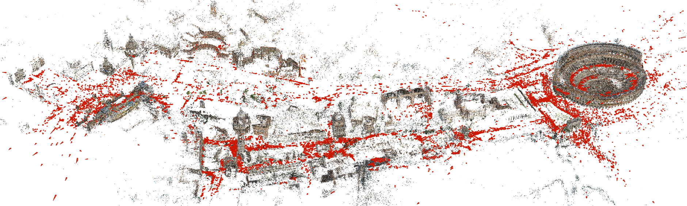

### COLMAP — 增量式运动恢复结构 (Structure-from-Motion Revisited)

```yaml
id: colmap
name: COLMAP
full_name: "增量式运动恢复结构 (Structure-from-Motion Revisited)"
year: 2016
org: "ETH Zurich / UNC Chapel Hill"
paper_url: "https://openaccess.thecvf.com/content_cvpr_2016/papers/Schonberger_Structure-From-Motion_Revisited_CVPR_2016_paper.pdf"
category: foundation
parent: "—"
motivation: "提出完整的增量式SfM流水线，通过场景图增强、鲁棒三角化、迭代BA等改进，成为三维重建的工业标准工具"
```

#### 📝 一句话总结

COLMAP 提出了一套完整的增量式 Structure-from-Motion 流水线，通过**场景图增强**、**鲁棒的下一最佳视图选择**、**鲁棒三角化**、**迭代式 Bundle Adjustment** 和**冗余视图挖掘**五大改进，系统性地解决了增量式 SfM 在鲁棒性、完整性和可扩展性上的核心挑战，成为三维重建领域事实上的工业标准工具。

#### 🎯 核心要点

- **增量式 SfM 完整流水线**：对应搜索（特征提取→匹配→几何验证）和增量重建（初始化→图像注册→三角化→BA→滤波）两大阶段
- **场景图增强**：多模型几何验证（同时拟合 F/H/E/H+E），检测并剔除 WTF（水印/时间戳/边框）导致的虚假匹配
- **下一最佳视图（NBV）选择**：基于多分辨率网格的评分函数，同时优化可见 3D 点数量和空间分布均匀性，避免退化配置
- **鲁棒三角化**：RANSAC 采样 + 递归恢复多 inlier 集合，结合角度约束和正深度约束，最大化三角化成功率
- **迭代式 BA + 重三角化 + 滤波**：每次注册后执行局部/全局 BA，交替进行重三角化和观测滤波，持续优化模型
- **冗余视图挖掘**：基于可见性向量聚类高重叠相机，将组内相机参数化为单一相机，大幅加速大规模 BA
- **使用 SIFT 特征 + Ceres Solver**，支持自标定（焦距、径向畸变等）

#### 🔬 深入细节

##### 总体框架


*图 1：COLMAP 增量式 SfM 流水线总览（论文 Figure 1）。左侧为对应搜索阶段（特征提取、匹配、几何验证），右侧为增量重建阶段（初始化、注册、三角化、BA、滤波的迭代循环）。*

> 💡 **关键直觉**：增量式 SfM 的核心思想是"逐步生长"——从一对初始图像开始重建，每次选择最优的下一张图像加入模型，通过三角化扩展 3D 点云，再用 Bundle Adjustment 全局优化。COLMAP 的贡献在于让这个过程的每一步都更加鲁棒和高效。

##### 算法伪代码

```python
# COLMAP 增量式 SfM 核心流程
def incremental_sfm(images, features, matches):
    # === 阶段一：对应搜索 ===
    scene_graph = build_scene_graph(images, features, matches)
    scene_graph = geometric_verification(scene_graph)  # 多模型: F/H/E
    scene_graph = filter_wtf(scene_graph)               # 剔除水印/时间戳匹配

    # === 阶段二：增量重建 ===
    # 1. 初始化：选择最佳图像对
    (img_i, img_j) = select_initial_pair(scene_graph)   # 多 inlier + 足够基线
    model = initialize(img_i, img_j)                     # 两视图重建

    # 2. 迭代注册
    while has_unregistered_images():
        img_next = next_best_view(model, scene_graph)    # 多分辨率网格评分
        pose = register_image(img_next, model)           # PnP + RANSAC
        
        triangulate_new_points(model, img_next)          # 鲁棒三角化
        
        # 3. 迭代优化
        bundle_adjustment(model, local=True)             # 局部 BA
        if should_global_ba():
            re_triangulate(model)                        # 重三角化
            filter_observations(model)                   # 滤波
            bundle_adjustment(model, local=False)        # 全局 BA
    
    return model
```

##### 动机与背景

增量式 SfM 是从无序图像集合恢复相机位姿和稀疏 3D 结构的经典方法。尽管此前已有 Bundler、VisualSFM 等工具，但它们在以下方面存在显著不足：

1. **鲁棒性不足**：初始化失败、退化配置（如纯旋转运动）、错误匹配累积等问题频繁导致重建失败
2. **完整性不够**：许多图像无法成功注册，三角化的 3D 点不够密集
3. **可扩展性差**：随着图像数量增长，Bundle Adjustment 的计算开销急剧增加

COLMAP 针对这三个核心挑战，在 SfM 流水线的每个关键环节都提出了改进方案。

##### 核心机制一：场景图增强

传统方法仅使用基础矩阵 \(F\) 进行几何验证。COLMAP 提出**多模型几何验证**策略：

对每对图像同时估计多种几何模型：
- **基础矩阵 \(F\)**：适用于一般运动
- **单应矩阵 \(H\)**：适用于纯旋转或平面场景
- **本质矩阵 \(E\)**：已标定相机的一般运动
- **混合模型 \(H + E\)**：部分平面 + 一般运动

通过 GRIC（Geometric Robust Information Criterion）选择最优模型，避免将纯旋转运动误判为有平移的情况。

> ⚠️ **注意**：纯旋转运动下基线为零，三角化会产生无穷远点。正确识别这种退化配置对于避免灾难性的初始化失败至关重要。

此外，COLMAP 引入 **WTF 检测**（Watermarks, Timestamps, Frames）：互联网照片中常见的水印、时间戳和相框会导致大量虚假匹配。通过分析匹配点的空间分布模式（WTF 匹配通常集中在图像边缘的固定区域），自动检测并剔除这类干扰。

##### 核心机制二：下一最佳视图选择

NBV 选择决定了增量重建的顺序，直接影响重建质量。COLMAP 的评分函数同时考虑**数量**和**分布**：

$$S(I_i) = \sum_{l=1}^{L} 2^{L-l} \cdot N_l(I_i)$$

其中 \(L\) 是网格分辨率层数，\(N_l(I_i)\) 是在第 \(l\) 层网格中至少包含一个可见 3D 点的网格单元数。

> 💡 **关键**：这个多分辨率设计的巧妙之处在于——高分辨率层（大 \(l\)）的权重低，鼓励点的数量；低分辨率层（小 \(l\)）的权重高，鼓励点的空间均匀分布。这样既避免了选择只能看到少量点的图像，也避免了选择所有点都聚集在一小块区域的图像（后者会导致 PnP 求解的数值不稳定）。

##### 核心机制三：鲁棒三角化

传统三角化方法对每对观测只尝试一次，失败则放弃。COLMAP 提出**RANSAC + 递归多点恢复**策略：

1. 对一个 3D 点的所有观测，用 RANSAC 采样两个观测进行三角化
2. 验证三角化结果需满足：
   - **充分三角化角度**：两条射线的夹角 \(\alpha\) 需满足：

$$\alpha > \alpha_{\min}$$

   - **正深度约束**：点在两个相机前方
   - **重投影误差约束**：误差小于阈值
3. 找到最大一致集后，**递归地**对剩余观测继续三角化，恢复可能被 RANSAC 遗漏的其他有效 inlier 子集

> 💡 **关键**：递归恢复机制的价值在于——同一个特征轨迹（track）中可能混入了错误匹配，传统方法会因为这些 outlier 而整体失败。COLMAP 通过 RANSAC 隔离 outlier，并递归尝试恢复所有可能的有效三角化，最大化 3D 点的产出。

##### 核心机制四：迭代式 Bundle Adjustment

Bundle Adjustment 是 SfM 的核心优化步骤，最小化所有观测的重投影误差：

$$E = \sum_{j} \rho_j \left( \left\| \pi(P_c, X_k) - x_j \right\|_2^2 \right)$$

其中 \(\pi\) 是投影函数，\(P_c \in SE(3)\) 是相机位姿，\(X_k \in \mathbb{R}^3\) 是 3D 点坐标，\(x_j\) 是 2D 观测，\(\rho_j\) 是 Cauchy 鲁棒核函数（抑制 outlier 的影响）。

COLMAP 的关键创新是将 BA 与**重三角化**和**观测滤波**交替执行：

1. **局部 BA**：每次注册新图像后，仅优化新图像及其邻域的参数
2. **全局 BA**：定期优化所有参数，同时自标定相机内参（焦距 \(f\)、主点 \((c_x, c_y)\)、径向畸变 \(k_1, k_2\)）
3. **重三角化**：BA 优化后相机参数更准确，之前失败的三角化可能成功，同时合并重叠的 3D 点
4. **观测滤波**：剔除重投影误差过大或三角化角度不足的观测，防止错误累积

> ⚠️ **注意**：BA 使用 Ceres Solver 求解，利用 Schur 补（先消去 3D 点参数，求解相机参数的 reduced camera system）来高效处理稀疏结构。

##### 核心机制五：冗余视图挖掘

对于大规模场景（数千张图像），全局 BA 的计算开销是主要瓶颈。COLMAP 观察到：

1. 增量扩展通常是局部的，大部分场景在最新扩展后未受影响
2. 互联网照片集合中存在大量冗余视角

基于此，COLMAP 将未受影响的图像聚类为高重叠组。两张图像 \(a\) 和 \(b\) 的重叠度定义为：

$$V_{ab} = \frac{\|v_a \wedge v_b\|}{\|v_a \vee v_b\|}$$

其中 \(v_i \in \{0,1\}^{N_X}\) 是图像 \(i\) 的二值可见性向量。组内所有相机被参数化为一个公共的组坐标系 \(G_r \in SE(3)\)，组内各相机相对于组坐标系的位姿 \(P_c\) 固定不变。分组后的 BA 目标函数为：

$$E_g = \sum_j \rho_j \left( \left\| \pi_g(G_r, P_c, X_k) - x_j \right\|_2^2 \right)$$

其中投影矩阵为 \(P_{cr} = P_c G_r\)，即组内相机位姿与组位姿的级联。

> 💡 **关键**：这种分组策略将 BA 中的相机参数数量从 \(N\) 降低到 \(N_G + N_{\text{affected}}\)（组数 + 受影响的独立相机数），在保持精度的同时大幅提升了计算效率。

##### 与传统方法的对比

| 特性 | Bundler | VisualSFM | COLMAP |
|------|---------|-----------|--------|
| 几何验证 | 仅 \(F\) | 仅 \(F\) | 多模型 \(F/H/E\) |
| NBV 选择 | 仅点数量 | 仅点数量 | 数量 + 分布均匀性 |
| 三角化 | 单次尝试 | 单次尝试 | RANSAC + 递归恢复 |
| BA 策略 | 全局 BA | 局部 BA | 迭代 BA + 重三角化 + 滤波 |
| 冗余处理 | 无 | 无 | 视图分组加速 |
| 完整性 | 低 | 中 | 高（注册率最高） |

实验表明，COLMAP 在多个基准数据集上实现了最高的图像注册率和最密集的 3D 点云，同时保持了最低的重投影误差（通常 < 1 像素）。在包含 1000+ 张图像的大规模场景中，冗余视图挖掘带来了显著的加速效果。

#### 🧪 练习题

```yaml
question: "COLMAP 的下一最佳视图（NBV）选择评分函数使用多分辨率网格的主要目的是什么？"
options:
  - "加快评分计算速度"
  - "同时优化可见3D点的数量和空间分布均匀性"
  - "检测并剔除水印和时间戳导致的虚假匹配"
  - "减少 Bundle Adjustment 的计算开销"
answer: 1
explain: "多分辨率网格评分函数通过低分辨率层赋予高权重来鼓励空间均匀分布，通过高分辨率层计数来鼓励点的数量，从而避免选择退化配置的视图。"
```