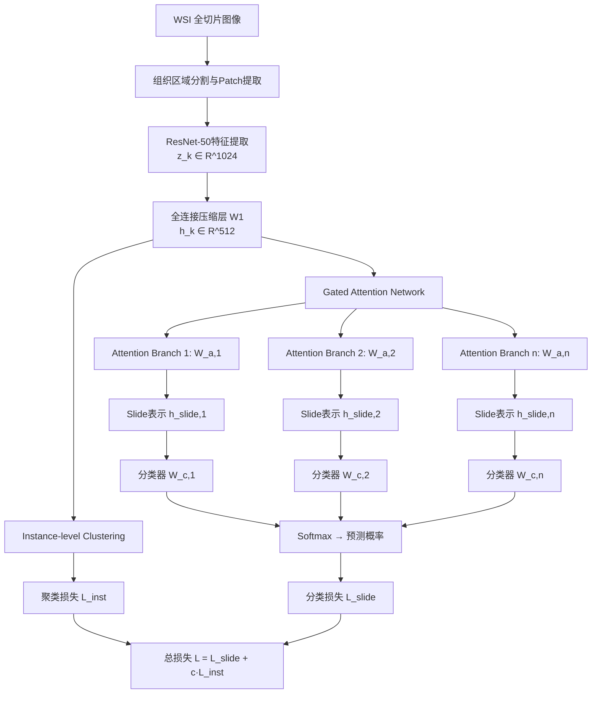

# Data Efficient and Weakly Supervised Computational Pathology on Whole Slide Images (CLAM)

| 属性 | 内容 |
|------|------|
| 标题 | Data Efficient and Weakly Supervised Computational Pathology on Whole Slide Images |
| 作者 | Ming Y. Lu, Drew F.K. Williamson, Tiffany Y. Chen, Richard J. Chen, Matteo Barbieri, Faisal Mahmood |
| 机构 | Harvard Medical School, Brigham and Women's Hospital |
| 发表 | Nature Biomedical Engineering, 2021 |
| 链接 | https://arxiv.org/abs/2004.09666 |
| 领域 | 计算病理学 / 弱监督学习 / 多示例学习 |

---

## 1. 研究背景与动机

### 1.1 研究领域现状

全切片病理图像（Whole Slide Images, WSI）是数字病理学的核心数据形式，单张WSI通常包含数十亿像素（gigapixel级），分辨率可达100,000×100,000。传统的深度学习方法要求对WSI中的每个区域进行像素级或patch级标注，这需要病理专家大量的标注时间，成本极高且难以规模化。

现有方法主要面临以下挑战：
- **标注瓶颈**：全监督方法需要逐区域的细粒度标注（ROI annotation），一张WSI可能包含数万个patch，逐一标注不现实
- **弱监督困难**：仅有slide级标签时，如何从海量patch中学习有效特征是核心难题
- **可解释性不足**：临床应用要求模型不仅给出诊断结论，还需指出决策依据区域
- **数据效率低**：病理数据获取困难，需要模型在小样本下也能有效学习

### 1.2 核心问题与动机

本文的核心动机是：**能否仅使用slide级别的诊断标签（如"肺腺癌"vs"肺鳞癌"），在无需任何区域级标注的情况下，实现高精度的WSI分类，同时提供可解释的诊断依据？**

作者将此问题建模为多示例学习（Multiple Instance Learning, MIL）问题：每张WSI视为一个"bag"，其中的patch视为"instance"，仅bag级标签可用。关键挑战在于：
1. 如何从数千个patch中识别出对诊断最关键的区域
2. 如何将patch级特征有效聚合为slide级表示
3. 如何在弱监督条件下保持与全监督方法可比的性能

### 1.3 与前人工作的差异

| 维度 | 前人方法 | CLAM |
|------|---------|------|
| 监督方式 | 全监督（需ROI标注） | 弱监督（仅slide标签） |
| 聚合策略 | max/mean pooling或固定函数 | 可学习的gated attention pooling |
| 多类处理 | 单一attention分支 | 多类并行attention分支 |
| 实例级学习 | 无 | 实例级聚类辅助任务 |
| 可解释性 | 有限 | 高分辨率attention heatmap |

---

## 2. 方法与模型架构

### 2.1 整体框架

CLAM（Clustering-constrained Attention Multiple instance learning）的核心思想是：通过注意力机制自动学习每个patch对slide级诊断的重要性权重，并引入实例级聚类约束来增强类别特异性特征的学习。

### 2.2 处理流程

**阶段一：预处理与特征提取**
1. 对WSI进行自动组织区域分割（基于HSV颜色空间阈值或Otsu方法），去除背景区域
2. 将组织区域切分为256×256像素的patch（20×放大倍率下约等于128μm×128μm）
3. 使用ImageNet预训练的ResNet-50截断至第3个残差块，提取每个patch的1024维特征向量 $\mathbf{z}_k \in \mathbb{R}^{1024}$

**阶段二：特征压缩**
- 全连接层 $\mathbf{W}_1 \in \mathbb{R}^{512 \times 1024}$ 将patch特征压缩至512维：$\mathbf{h}_k = \mathbf{W}_1 \mathbf{z}_k^\top$

**阶段三：Gated Attention Pooling**
- 注意力骨干网络由两个共享层 $\mathbf{U}_a, \mathbf{V}_a \in \mathbb{R}^{256 \times 512}$ 组成
- 分裂为 $n$ 个并行attention分支 $\mathbf{W}_{a,1}, ..., \mathbf{W}_{a,n} \in \mathbb{R}^{1 \times 256}$
- 计算类别特异性attention分数并聚合slide表示

**阶段四：分类与聚类**
- $n$ 个独立分类器 $\mathbf{W}_{c,m} \in \mathbb{R}^{1 \times 512}$ 分别对各类slide表示打分
- 实例级聚类网络 $\mathbf{W}_{inst,m} \in \mathbb{R}^{2 \times 512}$ 提供辅助监督

### 2.3 关键创新点

1. **多类并行Attention分支**：为每个类别学习独立的attention分布，使模型能区分不同类别关注的形态学特征
2. **Gated Attention机制**：使用 $\tanh \odot \text{sigm}$ 门控结构，比标准attention更具表达能力
3. **实例级聚类约束**：利用attention分数生成伪标签，对高/低attention的patch进行二分类聚类，增强特征判别性
4. **互斥假设（Mutual Exclusivity）**：在CLAM-MB变体中，对非目标类别的attention分支施加互补聚类约束

---

## 3. 关键技术细节

### 3.1 核心公式

**Gated Attention Score（公式1）**：

$$a_{k,m} = \frac{\exp\left\{\mathbf{W}_{a,m}\left(\tanh\left(\mathbf{V}_a \mathbf{h}_k^\top\right) \odot \text{sigm}\left(\mathbf{U}_a \mathbf{h}_k^\top\right)\right)\right\}}{\sum_{j=1}^{N}\exp\left\{\mathbf{W}_{a,m}\left(\tanh\left(\mathbf{V}_a \mathbf{h}_j^\top\right) \odot \text{sigm}\left(\mathbf{U}_a \mathbf{h}_j^\top\right)\right)\right\}}$$

其中 $\odot$ 为逐元素乘法（Hadamard积），$\tanh$ 提供特征变换，$\text{sigm}$（sigmoid）作为门控信号控制信息流通。分母为所有patch的softmax归一化。

**Slide级表示聚合（公式2）**：

$$\mathbf{h}_{slide,m} = \sum_{k=1}^{N} a_{k,m} \mathbf{h}_k$$

每个类别 $m$ 拥有独立的attention权重分布，因此聚合出不同的slide级表示。

**实例级聚类预测（公式3）**：

$$\mathbf{p}_{m,k} = \mathbf{W}_{inst,m} \mathbf{h}_k^\top$$

其中 $\mathbf{W}_{inst,m} \in \mathbb{R}^{2 \times 512}$ 为二分类聚类层。

**总损失函数**：

$$\mathcal{L} = \mathcal{L}_{slide} + c \cdot \mathcal{L}_{inst}$$

- $\mathcal{L}_{slide}$：slide级交叉熵分类损失（对softmax后的预测概率）
- $\mathcal{L}_{inst}$：实例级聚类的SVM损失（smooth SVM loss），对每个类别的top-B和bottom-B attention patch施加二分类约束
- $c$：平衡系数

### 3.2 实例级聚类的伪标签生成

由于缺乏patch级标注，CLAM利用attention分数生成伪标签：
- **In-the-class分支**（对应真实类别Y）：attention最高的B个patch标记为正例（$y=1$），最低的B个标记为负例（$y=0$）
- **Out-of-the-class分支**（非目标类别）：
  - **CLAM-SB**（Single Branch）：仅使用in-the-class分支的聚类
  - **CLAM-MB**（Multi Branch）：额外对非目标类别分支的最高attention patch标记为负例（互斥假设——被某类高度关注的patch不应属于其他类别）

### 3.3 模型变体

| 变体 | Attention分支 | 聚类策略 | 特点 |
|------|-------------|---------|------|
| CLAM-SB | 单分支 | 仅in-the-class | 参数更少，适合二分类 |
| CLAM-MB | 多分支（每类一个） | in + out-of-the-class | 多类更强，互斥约束 |

### 3.4 实现细节

- **特征提取器**：ResNet-50（ImageNet预训练），截断至第3个残差块（conv3_x），输出1024维
- **Patch大小**：256×256 pixels @ 20×放大
- **优化器**：Adam，学习率 $2 \times 10^{-4}$
- **训练策略**：每个epoch随机采样slide中的patch子集（而非全部），提高训练效率
- **数据增强**：训练时对patch进行随机翻转、旋转等
- **超参数B**：聚类中选取的top/bottom patch数量，实验中设为8

---

## 4. 实验设计与结果

### 4.1 数据集

| 数据集 | 任务 | 类别数 | Slide数量 | 来源 |
|--------|------|--------|-----------|------|
| TCGA-RCC | 肾细胞癌亚型分类 | 3（CHRCC/CCRCC/PRCC） | ~940 | TCGA |
| TCGA-NSCLC | 非小细胞肺癌亚型分类 | 2（LUAD/LUSC） | ~1,054 | TCGA |
| CPTAC-RCC | 外部验证（肾癌） | 3 | 独立测试集 | CPTAC |
| CPTAC-NSCLC | 外部验证（肺癌） | 2 | 独立测试集 | CPTAC |

### 4.2 主要实验结果

**TCGA内部验证（10折交叉验证）**：

| 方法 | RCC AUC | NSCLC AUC |
|------|---------|-----------|
| Mean-pool MIL | 0.982 | 0.952 |
| Max-pool MIL | 0.951 | 0.940 |
| DeepAttnMISL | - | 0.958 |
| CLAM-SB | 0.986 | 0.981 |
| **CLAM-MB** | **0.991** | **0.988** |

**CPTAC外部验证**：

| 方法 | RCC AUC | NSCLC AUC |
|------|---------|-----------|
| CLAM-SB | 0.990 | 0.958 |
| CLAM-MB | 0.988 | 0.963 |

关键发现：
- CLAM在仅使用slide级标签的情况下，达到了与全监督方法可比甚至更优的性能
- 在RCC三分类任务上AUC达到0.991，几乎完美
- 外部验证（CPTAC）性能保持稳定，证明泛化能力

### 4.3 数据效率实验

作者系统评估了训练数据量对性能的影响：
- 使用全部训练数据的**25%**（约250张slide），CLAM-MB在RCC上仍达到AUC > 0.97
- 使用全部训练数据的**50%**，性能接近使用100%数据
- 在极端小样本（~100张slide）下仍能获得有意义的分类性能

这证明了CLAM的高数据效率，对标注资源有限的临床场景具有重要意义。

### 4.4 可解释性分析

CLAM生成的attention heatmap具有高度临床可解释性：
- **高attention区域**精确定位到肿瘤组织的关键形态学特征（如肾透明细胞癌的透明胞质、肺腺癌的腺体结构）
- **低attention区域**对应正常组织、坏死区域或非信息性背景
- 不同类别的attention分支关注不同的形态学模式，验证了多分支设计的有效性
- 病理专家评估确认attention heatmap与临床诊断依据高度一致

---

## 5. 消融实验与分析

### 5.1 实例级聚类的贡献

| 配置 | RCC AUC | NSCLC AUC |
|------|---------|-----------|
| 无聚类（纯attention） | 0.981 | 0.972 |
| + In-the-class聚类（CLAM-SB） | 0.986 | 0.981 |
| + 互斥聚类（CLAM-MB） | 0.991 | 0.988 |

实例级聚类带来约0.5-1.6%的AUC提升，互斥约束在多类任务上效果更显著。

### 5.2 Attention机制对比

| Attention类型 | 性能 |
|--------------|------|
| Standard Attention（仅tanh） | 较低 |
| Gated Attention（tanh⊙sigm） | 更优 |

Gated attention通过sigmoid门控提供了额外的特征选择能力，在病理图像的异质性特征中更有效。

### 5.3 多分支 vs 单分支

- **二分类任务**（NSCLC）：CLAM-SB和CLAM-MB性能接近
- **三分类任务**（RCC）：CLAM-MB明显优于CLAM-SB，多分支设计在多类场景下更有优势

### 5.4 特征提取器的影响

论文使用ImageNet预训练的ResNet-50作为固定特征提取器（不微调），这一设计选择的合理性在于：
- 病理图像的低级纹理特征（如细胞形态、组织结构）与自然图像有一定共性
- 固定特征提取器大幅降低计算成本（仅需一次前向传播提取所有patch特征）
- 后续工作可探索病理专用预训练模型的提升空间

---

## 6. 论文优缺点

### 6.1 优点

1. **实用性极强**：仅需slide级标签即可训练，大幅降低标注成本，具有直接的临床部署价值
2. **可解释性出色**：attention heatmap提供直观的诊断依据可视化，满足临床对"可解释AI"的需求
3. **系统性完整**：从预处理、特征提取到分类、可视化提供了完整的端到端pipeline
4. **数据效率高**：在小样本下仍能保持良好性能，适合罕见疾病或新建数据集场景
5. **泛化性好**：CPTAC外部验证证明跨数据集泛化能力
6. **开源贡献**：代码和预训练模型完全开源，推动了领域发展

### 6.2 不足

1. **特征提取器固定**：使用ImageNet预训练的ResNet-50且不微调，可能丢失病理特异性的细粒度特征；后续工作（如基于自监督学习的病理基础模型）已证明端到端训练或领域特定预训练可显著提升性能
2. **Patch独立假设**：每个patch独立提取特征，忽略了patch间的空间关系和上下文信息（如肿瘤浸润前沿的空间模式）
3. **聚类伪标签噪声**：实例级聚类依赖attention分数生成伪标签，训练初期attention不准确时伪标签质量差，可能引入噪声
4. **计算开销**：虽然是弱监督，但gigapixel WSI的特征提取仍需大量计算资源（每张WSI数千个patch的ResNet前向传播）
5. **任务范围有限**：仅验证了癌症亚型分类任务，未涉及更复杂的预后预测、基因突变预测等任务
6. **Attention的局限**：softmax归一化的attention可能过度集中在少数patch上，忽略分散但重要的弱信号

### 6.3 改进方向

- 引入图神经网络（GNN）建模patch间空间关系
- 使用病理领域自监督预训练（如DINO、MAE）替代ImageNet特征
- 探索Transformer架构替代attention pooling
- 扩展至多任务学习（同时预测亚型、分级、预后）
- 结合主动学习策略进一步提升数据效率

---

## 7. 个人思考与延伸

### 7.1 方法论启示

CLAM的核心贡献在于将**注意力机制**与**多示例学习**优雅结合，解决了计算病理学中最关键的标注瓶颈问题。其设计哲学——"让模型自己学会看哪里"——与病理医生的诊断过程高度一致：先低倍扫视全片，再高倍聚焦关键区域。

实例级聚类的引入体现了一个重要思想：**在弱监督场景下，利用模型自身的中间输出（attention分数）构造辅助监督信号**。这种"自举"（bootstrapping）策略在后续的自监督学习和伪标签方法中被广泛采用。

### 7.2 对后续工作的影响

CLAM作为计算病理学的里程碑工作，直接催生了多个重要后续方向：
- **TransMIL**（2021）：将Transformer引入MIL，建模patch间长程依赖
- **DTFD-MIL**（2022）：双层特征蒸馏，解决MIL中的特征冗余
- **HIPT**（2022）：层次化Vision Transformer，从patch到slide的多尺度建模
- **病理基础模型**（2023-2024）：如UNI、Virchow等，用大规模病理数据自监督预训练替代ImageNet特征

### 7.3 局限性的深层思考

CLAM的"bag of patches"假设（patch独立、无空间关系）是其最根本的局限。在真实病理诊断中，**空间上下文**至关重要——例如，肿瘤浸润淋巴细胞（TIL）的诊断意义取决于其与肿瘤细胞的空间关系，而非单个patch的形态。后续的图网络方法（如Patch-GCN）和Transformer方法正是为解决这一问题而提出。

### 7.4 临床转化前景

CLAM的最大价值在于其**临床可部署性**：
- 仅需常规病理报告中已有的诊断标签即可训练
- Attention heatmap可辅助病理医生快速定位关键区域
- 在资源有限的医疗机构中，可作为初筛或质控工具
- 开源代码降低了部署门槛

然而，从研究到临床的转化仍面临挑战：染色变异、扫描仪差异、罕见亚型的长尾分布等问题需要进一步解决。