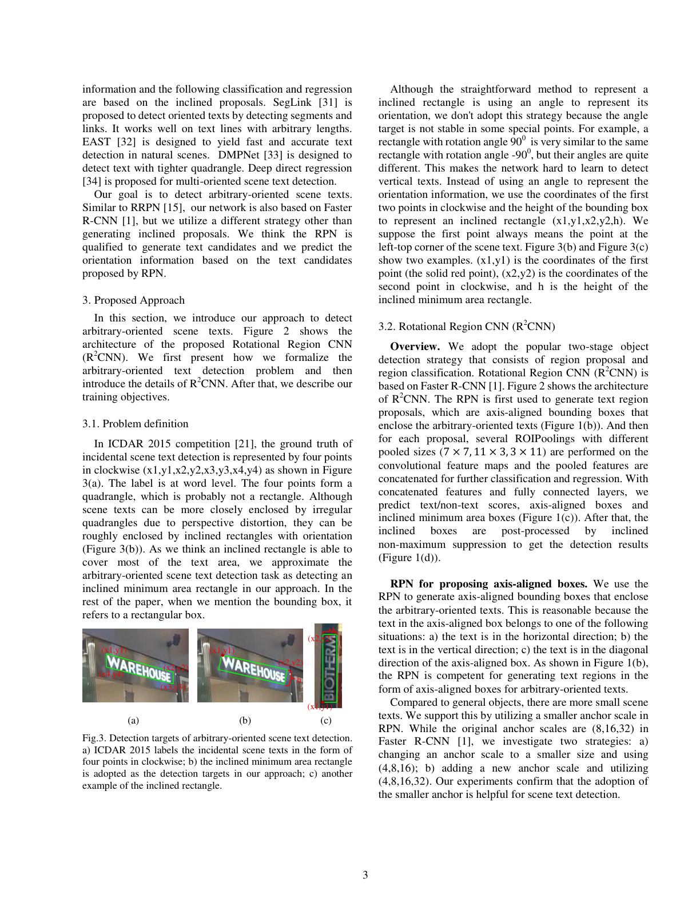

### R2CNN: Rotational Region CNN for Orientation Robust Scene Text Detection

```yaml
id: r2cnn
name: R2CNN
full_name: "旋转区域卷积神经网络 (Rotational Region CNN)"
year: 2017
org: Samsung R&D Institute China - Beijing
paper_url: "https://arxiv.org/abs/1706.09579"
category: object_detection
parent: Faster R-CNN
motivation: "在 Faster R-CNN 基础上增加旋转分支，实现任意方向场景文本的精确检测"
```

#### 📝 一句话总结

R2CNN 在 Faster R-CNN 框架上引入多尺度 ROI Pooling 与倾斜矩形回归分支，结合倾斜非极大值抑制（Inclined NMS），实现了对任意方向场景文本的高精度检测，无需预设文本方向先验。

#### 🎯 核心要点

- 基于 Faster R-CNN 的两阶段检测框架，同时输出水平框和倾斜框
- 多尺度 ROI Pooling：使用 \(7 \times 7\)、\(11 \times 3\)、\(3 \times 11\) 三种池化尺寸捕获不同方向文本特征
- 倾斜矩形表示法：用 \((u_{x1}, u_{y1}, u_{x2}, u_{y2}, h)\) 五参数表示旋转框（长边两端点 + 短边高度）
- 多任务损失：分类损失 + 水平框回归损失 + 倾斜框回归损失联合训练
- 倾斜 NMS（Inclined NMS）：基于旋转矩形 IoU 进行后处理，避免标准 NMS 对倾斜文本的误抑制
- 在 ICDAR 2015 上达到 F-measure 82.54%，ICDAR 2013 上达到 F-measure 87.73%

#### 🔬 深入细节

##### 核心框架图


*图：R2CNN 整体框架（论文 Figure 1）。输入图像经 VGG16 提取特征后，RPN 生成候选区域，再通过三种不同尺寸的 ROI Pooling 提取特征并拼接，最终同时预测文本置信度、水平包围框和倾斜最小外接矩形。*

##### 算法伪代码

```python
# R2CNN 推理流程伪代码
def R2CNN_inference(image):
    # Stage 1: 特征提取 + RPN
    feature_map = VGG16(image)                    # 共享卷积特征
    proposals = RPN(feature_map)                   # 生成水平候选框
    
    # Stage 2: 多尺度 ROI Pooling
    pool_7x7 = ROIPooling(feature_map, proposals, size=(7, 7))
    pool_11x3 = ROIPooling(feature_map, proposals, size=(11, 3))
    pool_3x11 = ROIPooling(feature_map, proposals, size=(3, 11))
    
    # 拼接多尺度特征
    concat_feat = Concat(FC(pool_7x7), FC(pool_11x3), FC(pool_3x11))
    
    # Stage 3: 多任务预测
    text_score = FC_cls(concat_feat)               # 文本/非文本二分类
    bbox_aligned = FC_reg1(concat_feat)            # 水平框回归 (dx, dy, dw, dh)
    bbox_inclined = FC_reg2(concat_feat)           # 倾斜框回归 (ux1, uy1, ux2, uy2, uh)
    
    # Stage 4: 后处理
    # 先用水平框 NMS 粗筛
    keep = NMS(bbox_aligned, text_score, threshold=0.7)
    # 再用倾斜 NMS 精筛
    final = Inclined_NMS(bbox_inclined[keep], text_score[keep], threshold=0.2)
    return final
```

##### 动机与背景

场景文本检测面临的核心挑战是文本可能以任意角度出现（如路标、广告牌等）。传统基于 Faster R-CNN 的方法只能输出水平矩形框（axis-aligned bounding box），对于倾斜文本会引入大量背景噪声，严重影响后续文本识别的精度。

> 💡 关键：水平框对倾斜文本的覆盖率低、背景干扰大，直接影响下游 OCR 识别准确率。

已有方法如 TextBoxes 虽然针对文本设计了特殊 anchor，但仍局限于水平检测。RRPN 虽然引入了旋转 anchor，但需要大量预设角度，计算开销大且覆盖不完整。

##### 核心机制详解

**1. 多尺度 ROI Pooling 设计**

R2CNN 的关键创新在于使用三种不同尺寸的 ROI Pooling 来捕获文本的方向信息：

$$\text{Feature} = \text{Concat}(f_{7\times7}, f_{11\times3}, f_{3\times11})$$

- \(7 \times 7\)：标准正方形池化，捕获全局空间信息
- \(11 \times 3\)：水平长条形池化，对水平方向文本敏感
- \(3 \times 11\)：垂直长条形池化，对垂直方向文本敏感

这种设计的直觉是：不同方向的文本在不同形状的池化窗口中会产生不同的响应模式，网络可以从拼接特征中隐式学习文本的方向信息。

> ⚠️ 注意：三种池化的总元素数相同（\(7 \times 7 = 49\)，\(11 \times 3 = 33\)，\(3 \times 11 = 33\)），保证特征维度平衡。

**2. 倾斜矩形表示法**

不同于常见的 \((x, y, w, h, \theta)\) 五参数旋转框表示，R2CNN 采用更直观的端点表示法：

$$(u_{x1}, u_{y1}, u_{x2}, u_{y2}, h)$$

其中 \((u_{x1}, u_{y1})\) 和 \((u_{x2}, u_{y2})\) 是矩形**较长边**的两个端点坐标，\(h\) 是**较短边**的长度（即矩形的"高度"）。

这种表示法的优势：
- 避免了角度回归的周期性问题（\(\theta\) 在 0° 和 180° 处不连续）
- 端点坐标可以直接用标准的 Smooth L1 Loss 回归
- 几何含义直观，便于计算旋转 IoU

回归目标的编码方式类似标准 Faster R-CNN 的框回归：

$$t_{ux1} = \frac{u_{x1} - x_a}{w_a}, \quad t_{uy1} = \frac{u_{y1} - y_a}{h_a}$$
$$t_{ux2} = \frac{u_{x2} - x_a}{w_a}, \quad t_{uy2} = \frac{u_{y2} - y_a}{h_a}$$
$$t_h = \log\frac{h}{h_a}$$

其中 \((x_a, y_a, w_a, h_a)\) 是对应 anchor/proposal 的参数。

**3. 多任务损失函数**

R2CNN 的总损失由三部分组成：

$$L = L_{cls} + \lambda_1 L_{reg}^{aligned} + \lambda_2 L_{reg}^{inclined}$$

- \(L_{cls}\)：Softmax 交叉熵损失，判断是否为文本
- \(L_{reg}^{aligned}\)：水平框的 Smooth L1 回归损失
- \(L_{reg}^{inclined}\)：倾斜框的 Smooth L1 回归损失

> 💡 关键：实验表明 \(\lambda_1 = 1, \lambda_2 = 2\) 效果最佳。水平框回归起到辅助作用，帮助网络学习更好的空间定位特征，同时为第一轮 NMS 提供依据。

**4. 倾斜 NMS（Inclined NMS）**

标准 NMS 基于水平框 IoU 计算重叠度，对于相邻的倾斜文本行会产生误抑制。R2CNN 提出 Inclined NMS：

1. 首先用水平框 NMS（阈值 0.7）进行粗筛，去除明显重复的候选
2. 然后计算倾斜框之间的旋转 IoU（基于多边形交集面积）
3. 以较低阈值（0.2）进行倾斜 NMS 精筛

旋转 IoU 的计算通过求两个旋转矩形的交集多边形面积实现，虽然计算复杂度高于标准 IoU，但由于经过第一轮粗筛后候选框数量已大幅减少，整体效率可接受。

##### 与传统方法的区别

| 方法 | 框类型 | Anchor 设计 | 后处理 |
|------|--------|------------|--------|
| Faster R-CNN | 水平框 | 标准 anchor | 标准 NMS |
| RRPN | 旋转框 | 旋转 anchor（6个角度） | 旋转 NMS |
| TextBoxes | 水平框 | 长宽比 anchor | 标准 NMS |
| **R2CNN** | **水平框 + 倾斜框** | **标准 anchor** | **两阶段 NMS** |

R2CNN 的优势在于：
- 无需修改 RPN 结构，保持标准水平 anchor，降低实现复杂度
- 通过多尺度池化隐式学习方向信息，而非显式枚举角度
- 两阶段 NMS 策略兼顾效率和精度

##### 实验结果

在 ICDAR 2015 Incidental Scene Text 数据集上：
- Recall: 79.68%, Precision: 85.62%, **F-measure: 82.54%**
- 超越同期 CTPN (61.22%)、RRPN (77.13%)、SegLink (76.80%) 等方法

消融实验关键发现：
- 多尺度池化（7×7 + 11×3 + 3×11）比单一 7×7 池化 F-measure 提升约 3%
- 加入水平框辅助回归比仅用倾斜框回归提升约 2%
- Inclined NMS 比标准 NMS 提升约 1.5%

#### 🧪 练习题

```yaml
question: "R2CNN 使用多种尺寸的 ROI Pooling 的主要目的是什么？"
options:
  - "增加模型参数量以提升拟合能力"
  - "捕获不同方向文本的特征响应，隐式学习文本方向信息"
  - "加速推理过程中的特征提取"
  - "替代 RPN 生成旋转候选框"
answer: 1
explain: "11×3 和 3×11 的长条形池化分别对水平和垂直方向敏感，与 7×7 拼接后使网络能从特征差异中推断文本方向，无需显式旋转 anchor。"
```