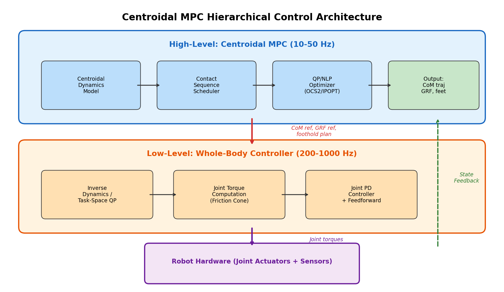

### Centroidal MPC — 质心动力学MPC (Centroidal Dynamics MPC)

```yaml
id: centroidal_mpc
name: Centroidal MPC
full_name: "质心动力学MPC (Centroidal Dynamics MPC)"
year: "2015"
org: ETH Zurich
paper_url: https://ieeexplore.ieee.org/document/7353848
category: mpc
parent: lipm
motivation: "基于质心动量的MPC框架"
```

#### 📝 一句话总结

Centroidal Dynamics MPC 将多刚体机器人的全身动力学抽象为质心线动量与角动量的演化方程（牛顿-欧拉方程），并在模型预测控制框架下滚动优化接触力与质心轨迹，解决了传统 LIPM 仅适用于准静态步态、无法处理三维角动量与多接触场景的局限性。

#### 🎯 核心要点

- **质心动力学模型 (Centroidal Dynamics)**：将浮动基多刚体系统的全身动量投影到质心，用 6 维动量向量（3 维线动量 + 3 维角动量）描述整体运动状态
- **牛顿-欧拉约束**：质心线加速度由所有接触力之和决定，角动量变化率由接触力矩之和决定
- **MPC 滚动优化**：在有限时域内预测质心状态演化，优化各足端接触力序列，实现实时反馈控制
- **摩擦锥约束**：将库仑摩擦锥线性化为多面体锥，作为不等式约束纳入 QP 求解
- **步态调度 (Gait Scheduling)**：通过接触时序表控制各足的站立/摆动相，支持 trot、pace、bound、gallop 等多种步态
- **与 LIPM 的关键区别**：保留完整的三维角动量信息，不假设恒定质心高度，支持动态步态与非共面接触
- **层次化控制架构**：Centroidal MPC 作为高层规划器输出期望接触力与质心轨迹，下层由全身控制器 (WBC) 映射到关节力矩

#### 🔬 深入细节

##### 核心框架示意


*图：基于质心动力学的 MPC 层次化控制架构。高层 Centroidal MPC 优化质心轨迹与接触力，低层 WBC 将其映射为关节力矩。*

Centroidal MPC 的核心思想是：不直接优化机器人全部关节自由度（通常 12-30 维），而是将问题分解为两层——上层在质心空间（6 维状态 + 接触力）进行 MPC 优化，下层通过全身控制器跟踪上层指令。这种分层策略在保持物理一致性的同时，大幅降低了在线优化的计算复杂度。

##### 算法伪代码

```python
# Centroidal Dynamics MPC 核心流程
def centroidal_mpc(x0, gait_schedule, N_horizon, dt):
    """
    x0: 当前状态 [com_pos, com_vel, angular_momentum]  (9维)
    gait_schedule: 各足接触时序表 {leg_id: [contact_flags]}
    N_horizon: 预测时域步数
    dt: 时间步长
    """
    # 1. 构建参考轨迹
    x_ref = generate_reference_trajectory(x0, v_cmd, N_horizon, dt)
    
    # 2. 滚动优化：求解 QP
    for k in range(N_horizon):
        # 质心动力学离散化
        # x_{k+1} = A_k * x_k + B_k * u_k + g_vec
        # 其中 u_k = [f_1, f_2, ..., f_n_c]  (各足接触力)
        
        # 目标函数：跟踪误差 + 力正则化
        # min Σ ||x_k - x_ref_k||²_Q + ||u_k||²_R
        
        # 约束条件：
        # (a) 动力学约束: x_{k+1} = f(x_k, u_k)
        # (b) 摩擦锥约束: A_friction * f_i <= 0  (线性化锥)
        # (c) 接触互补: f_i = 0 if leg_i in swing
        # (d) 法向力非负: f_iz >= 0
    
    u_opt, x_opt = solve_qp(Q, R, A, B, constraints)
    
    # 3. 仅执行第一步最优力
    f_applied = u_opt[0]
    
    # 4. 传递给全身控制器
    tau = whole_body_controller(f_applied, x_opt[1], joint_state)
    
    return tau
```

##### 方法深入解析

**1. 动机与背景：为什么需要质心动力学？**

传统的线性倒立摆模型 (LIPM) 假设质心高度恒定、角动量为零，这使得它只能处理准静态步行。当机器人需要执行 trot、gallop 等动态步态，或在非平坦地形上运动时，角动量的变化不可忽略。质心动力学模型保留了完整的牛顿-欧拉方程，是全身动力学的"最紧凑投影"：

$$
\begin{bmatrix} \dot{\mathbf{p}} \\ \dot{\mathbf{L}} \end{bmatrix} = \begin{bmatrix} m\mathbf{g} \\ \mathbf{0} \end{bmatrix} + \sum_{i=1}^{n_c} \begin{bmatrix} \mathbf{f}_i \\ (\mathbf{c}_i - \mathbf{r}) \times \mathbf{f}_i \end{bmatrix}
$$

其中 \(\mathbf{p} = m\dot{\mathbf{r}}\) 为线动量，\(\mathbf{L}\) 为绕质心的角动量，\(\mathbf{r}\) 为质心位置，\(\mathbf{f}_i\) 为第 \(i\) 个接触点的力，\(\mathbf{c}_i\) 为接触点位置，\(n_c\) 为当前接触点数。

> 💡 **关键直觉**：质心动力学本质上是牛顿第二定律和角动量定理在整个多刚体系统上的应用——不管机器人有多少关节，其质心的运动完全由外力（接触力 + 重力）决定。

**2. 状态空间与动力学模型**

系统状态定义为：

$$
\mathbf{x} = \begin{bmatrix} \mathbf{r} \\ \dot{\mathbf{r}} \\ \boldsymbol{\Theta} \end{bmatrix} \in \mathbb{R}^{9}
$$

其中 \(\mathbf{r} \in \mathbb{R}^3\) 为质心位置，\(\dot{\mathbf{r}} \in \mathbb{R}^3\) 为质心速度，\(\boldsymbol{\Theta} \in \mathbb{R}^3\) 为躯干姿态（欧拉角或等效表示）。控制输入为所有接触足的地面反力：

$$
\mathbf{u} = \begin{bmatrix} \mathbf{f}_1 \\ \mathbf{f}_2 \\ \vdots \\ \mathbf{f}_{n_c} \end{bmatrix} \in \mathbb{R}^{3n_c}
$$

连续时间动力学方程为：

$$
\dot{\mathbf{x}} = \begin{bmatrix} \dot{\mathbf{r}} \\ \frac{1}{m}\sum_{i=1}^{n_c} \mathbf{f}_i + \mathbf{g} \\ \mathbf{I}^{-1}\left(\sum_{i=1}^{n_c} (\mathbf{c}_i - \mathbf{r}) \times \mathbf{f}_i\right) \end{bmatrix}
$$

其中 \(\mathbf{I}\) 为躯干惯性张量（在质心动力学简化中通常取为常数近似），\(\mathbf{g} = [0, 0, -9.81]^T\)。

通过前向欧拉或零阶保持离散化，得到线性时变系统：

$$
\mathbf{x}_{k+1} = \mathbf{A}_k \mathbf{x}_k + \mathbf{B}_k \mathbf{u}_k + \mathbf{d}_k
$$

> ⚠️ **注意**：角动量方程中 \((\mathbf{c}_i - \mathbf{r}) \times \mathbf{f}_i\) 包含状态与控制的交叉项，使得原始问题非线性。实际实现中常在当前状态点线性化，将交叉项展开为线性近似，从而转化为 QP 可解的形式。

**3. MPC 优化问题公式化**

在预测时域 \(N\) 内，MPC 求解如下二次规划问题：

$$
\min_{\mathbf{u}_{0:N-1}} \sum_{k=0}^{N-1} \left[ (\mathbf{x}_k - \mathbf{x}_k^{\text{ref}})^T \mathbf{Q} (\mathbf{x}_k - \mathbf{x}_k^{\text{ref}}) + \mathbf{u}_k^T \mathbf{R} \mathbf{u}_k \right] + (\mathbf{x}_N - \mathbf{x}_N^{\text{ref}})^T \mathbf{Q}_f (\mathbf{x}_N - \mathbf{x}_N^{\text{ref}})
$$

$$
\text{s.t.} \quad \mathbf{x}_{k+1} = \mathbf{A}_k \mathbf{x}_k + \mathbf{B}_k \mathbf{u}_k + \mathbf{d}_k
$$

$$
\mathbf{D} \mathbf{f}_i \leq \mathbf{0}, \quad f_{i,z} \geq f_{\min}, \quad \forall i \in \mathcal{C}_k
$$

$$
\mathbf{f}_i = \mathbf{0}, \quad \forall i \notin \mathcal{C}_k
$$

其中：
- \(\mathbf{Q}, \mathbf{R}, \mathbf{Q}_f\) 为权重矩阵，分别惩罚状态偏差、力大小和终端误差
- \(\mathbf{D}\) 为线性化摩擦锥矩阵（将圆锥近似为 4 面或 8 面多面体）
- \(\mathcal{C}_k\) 为第 \(k\) 步的接触足集合，由步态调度器决定
- \(f_{\min}\) 为最小法向力，防止接触力过小导致滑动

**4. 摩擦锥线性化**

库仑摩擦锥约束要求接触力位于摩擦锥内：

$$
\sqrt{f_{i,x}^2 + f_{i,y}^2} \leq \mu f_{i,z}
$$

这是一个二阶锥约束（SOCP），为保持 QP 可解性，将其线性化为多面体近似：

$$
\begin{bmatrix} 1 & 0 & -\mu \\ -1 & 0 & -\mu \\ 0 & 1 & -\mu \\ 0 & -1 & -\mu \end{bmatrix} \mathbf{f}_i \leq \mathbf{0}
$$

这是最简单的 4 面近似，实际中常用 8 面或 16 面以提高精度。

**5. 步态调度与接触时序**

步态调度器定义了每条腿在预测时域内的接触/摆动状态。以四足机器人为例：

| 步态 | LF | RF | LH | RH | 特点 |
|------|----|----|----|----|------|
| Trot | ■□ | □■ | □■ | ■□ | 对角足同步，最常用 |
| Pace | ■□ | □■ | ■□ | □■ | 同侧足同步 |
| Bound | ■□ | ■□ | □■ | □■ | 前后足同步 |
| Gallop | ■□□□ | □■□□ | □□■□ | □□□■ | 四足依次着地 |

（■=站立相, □=摆动相）

接触时序直接决定了 MPC 中哪些力变量被激活（站立相）或强制为零（摆动相），从而改变优化问题的结构。

**6. 与传统方法的区别**

| 特性 | LIPM | Centroidal MPC |
|------|------|----------------|
| 质心高度 | 恒定假设 | 可变 |
| 角动量 | 忽略（假设为零） | 完整建模 |
| 接触模式 | 单/双支撑 | 任意多接触 |
| 适用步态 | 准静态行走 | 动态步态（trot/gallop等） |
| 地形适应 | 仅平地 | 非平坦地形 |
| 计算方法 | 解析解/简单QP | 在线QP求解 |
| 典型求解频率 | — | 50-400 Hz |

> 💡 **关键优势**：Centroidal MPC 在计算复杂度（~10ms QP 求解）和模型精度之间取得了最佳平衡，既比 LIPM 更准确地捕捉动态效应，又比全身动力学 MPC 计算量小一个数量级，成为当前四足/人形机器人运动控制的主流框架。

**7. 实际实现中的关键技巧**

- **热启动 (Warm-starting)**：用上一次 MPC 求解结果平移初始化当前问题，显著加速 QP 收敛
- **自适应时域**：近端用短时间步（高精度），远端用长时间步（降低变量数）
- **参考轨迹生成**：通常由速度指令积分得到质心参考位置，姿态参考保持水平或跟踪地形法线
- **典型参数**：预测时域 0.5-1.0s，时间步 10-50ms，QP 变量数 ~200-500

#### 🧪 练习题

```yaml
question: "与线性倒立摆模型 (LIPM) 相比，Centroidal Dynamics MPC 的核心改进是什么？"
options:
  - "使用非线性优化器替代线性 QP 求解"
  - "保留完整的三维角动量建模，支持动态步态与多接触场景"
  - "直接优化全部关节力矩，无需全身控制器"
  - "引入深度强化学习替代传统优化方法"
answer: 1
explain: "Centroidal MPC 的核心贡献是将 LIPM 中被忽略的角动量纳入建模，使用完整的牛顿-欧拉方程描述质心动力学，从而支持 trot、gallop 等动态步态以及非共面多接触场景。它仍然使用 QP 求解（非选项A），仍需下层 WBC（非选项C），也不涉及强化学习（非选项D）。"
```