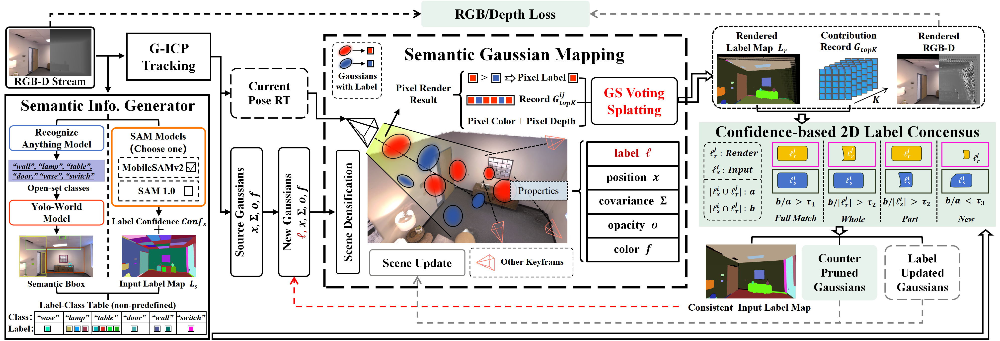
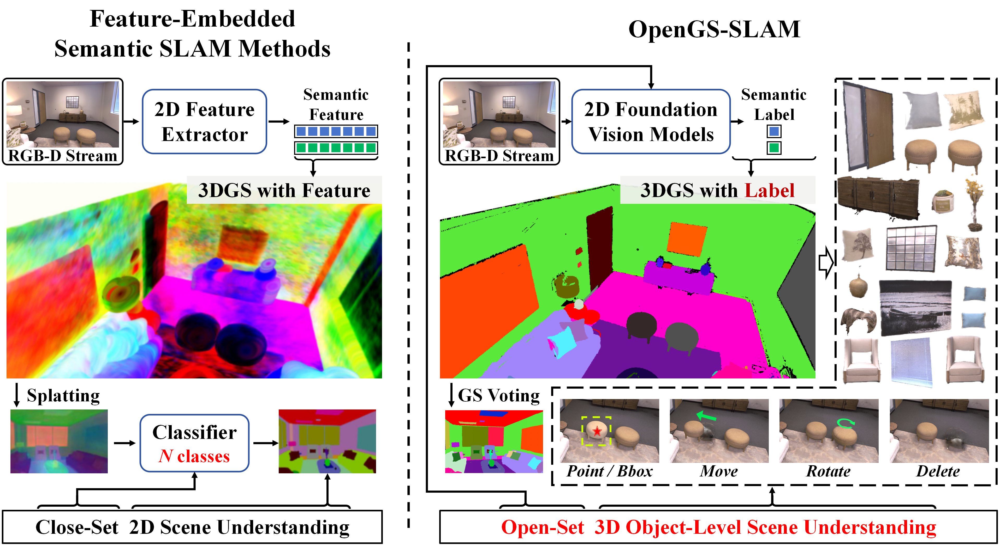
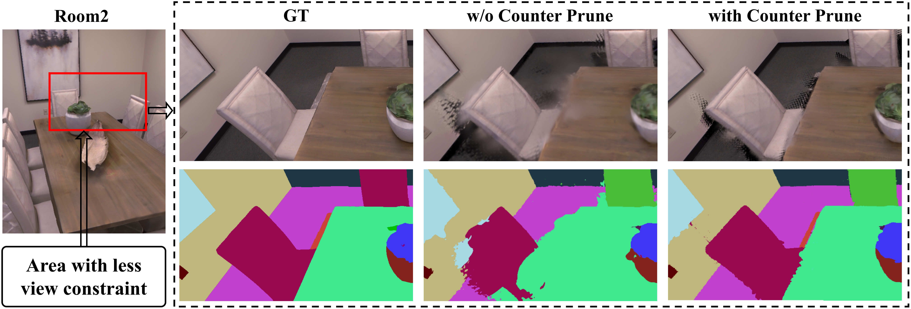

### OpenGS-SLAM — 开放词汇高斯溅射SLAM (Open-Vocabulary Gaussian Splatting SLAM)

```yaml
id: opengs-slam
name: OpenGS-SLAM
full_name: "开放词汇高斯溅射SLAM (Open-Vocabulary Gaussian Splatting SLAM)"
year: 2025
org: "HKUST / Zhejiang University"
paper_url: "https://arxiv.org/abs/2503.01646"
project_url: "https://young-bit.github.io/opengs-slam.github.io/"
category: navigation
parent: "—"
motivation: "用1D GS Label替代高维语义特征嵌入，结合高斯投票渲染与置信度标签共识，实现高效开放词汇语义3DGS-SLAM"
```

#### 📝 一句话总结

OpenGS-SLAM 提出用**1维离散GS Label**替代传统高维语义特征嵌入来为3D高斯赋予语义，并设计了**Gaussian Voting Splatting**（标签感知α-blending投票）和**Confidence-based 2D Label Consensus**（置信度驱动的跨帧标签一致性机制），在不增加可微参数的前提下实现了开放词汇语义SLAM，渲染速度提升10倍、参数量减少2倍，同时语义分割精度达到SOTA水平。

#### 🎯 核心要点

- **集成语义生成器**：串联 RAM (Recognize Anything Model) → YOLO-World → SAM，实现零样本开放词汇2D语义分割，无需预定义类别
- **GS Label 设计**：为每个3D高斯附加1维离散标签属性（非可微），替代传统方法中的高维语义特征向量（如CLIP 512维），大幅降低存储与计算开销
- **Gaussian Voting Splatting (GVS)**：基于标签感知的α-blending投票机制渲染语义图，按标签分组累积不透明度并取最高票标签，无需梯度反传
- **Confidence-based 2D Label Consensus**：通过Full Match、Partial Match、Whole Match、New四种匹配模式，结合IoU阈值实现跨帧语义标签的一致性融合
- **Input Confidence Update**：利用渲染语义图与输入语义图的一致性动态调整输入置信度，抑制噪声帧的影响
- **Part Label Decay**：对部分匹配（Partial Match）中的旧标签施加置信度衰减，促进语义标签的自然更新
- **Segmentation Counter Pruning**：为每个高斯维护分割计数器，当高斯长期未被任何分割覆盖时将其剪枝，减少冗余
- **实验结果**：在Replica数据集上mIoU达61.91%（SAM 1.0）/ 72.40%（SAM 2），渲染速度约200 FPS，ATE仅0.16 cm

#### 🔬 深入细节

##### 系统总览


*图：OpenGS-SLAM 系统流水线。左侧为集成语义生成器（RAM + YOLO-World + SAM），中间为Gaussian Voting Splatting渲染与场景更新，右侧为Confidence-based 2D Label Consensus模块。*


*图：OpenGS-SLAM 在Replica数据集上的开放词汇语义分割效果。支持任意文本查询的3D场景语义理解。*

##### 算法伪代码

```python
# OpenGS-SLAM 核心流程伪代码
def opengs_slam(rgb_stream, depth_stream):
    gaussians = []  # 3D高斯集合，每个含 {μ, Σ, color, opacity, gs_label, confidence, seg_counter}
    
    for frame_t in rgb_stream:
        # ===== Step 1: 集成语义生成器 =====
        tags = RAM(frame_t)                          # 识别图像中所有物体标签
        bboxes = YOLO_World(frame_t, tags)           # 开放词汇目标检测
        masks_2d = SAM(frame_t, bboxes)              # 生成精细分割掩码
        # 每个mask关联一个语义标签 l_i 和初始置信度 c_i
        
        # ===== Step 2: Gaussian Voting Splatting =====
        rendered_semantic = gaussian_voting_render(gaussians, camera_pose_t)
        # 对每个像素：按gs_label分组累积α-blending权重，投票选最高票标签
        
        # ===== Step 3: Confidence-based 2D Label Consensus =====
        for mask_input in masks_2d:
            mask_rendered = find_matching_region(rendered_semantic, mask_input)
            iou = compute_iou(mask_input, mask_rendered)
            
            if iou > τ_full:        # Full Match: 输入与渲染完全一致
                update_confidence(mask_input, boost=True)
            elif iou > τ_partial:   # Partial Match: 部分重叠
                apply_part_label_decay(old_labels)
                assign_new_label_to_unmatched(mask_input)
            elif iou > τ_whole:     # Whole Match: 渲染区域被输入完全包含
                merge_labels(mask_rendered → mask_input)
            else:                   # New: 全新物体
                assign_new_label(mask_input)
        
        # ===== Step 4: 场景更新 =====
        update_gs_labels(gaussians, masks_2d, confidence)
        
        # ===== Step 5: Input Confidence Update =====
        consistency = compare(rendered_semantic, masks_2d)
        adjust_input_confidence(masks_2d, consistency)
        
        # ===== Step 6: Segmentation Counter Pruning =====
        for g in gaussians:
            if g.seg_counter > threshold:
                prune(g)  # 移除长期未被分割覆盖的高斯
    
    return gaussians
```

##### 方法详解

**1. 动机与背景：为什么需要新的语义SLAM方案？**

现有的开放词汇语义3DGS-SLAM方法（如SemGauss-SLAM、SGS-SLAM等）普遍采用**高维语义特征嵌入**的方式为3D高斯附加语义信息——即为每个高斯存储一个高维向量（如CLIP的512维特征），并通过可微渲染和特征蒸馏进行优化。这种方案存在三个核心问题：

1. **存储开销巨大**：每个高斯额外存储数百维浮点向量，场景中数十万高斯导致参数量翻倍
2. **渲染速度下降**：高维特征需要参与α-blending的可微渲染，计算量显著增加
3. **语义精度受限**：特征蒸馏过程中的信息损失导致语义边界模糊

> 💡 **关键洞察**：语义标签本质上是**离散的类别信息**，不需要连续的高维特征空间来表示。OpenGS-SLAM 的核心思想是：用一个1维整数标签（GS Label）直接表示语义类别，完全绕开特征嵌入和蒸馏。

**2. 集成语义生成器（Integrated Semantic Generator）**

OpenGS-SLAM 构建了一个三阶段的零样本语义分割流水线：

- **RAM (Recognize Anything Model)**：输入RGB图像，输出图像中所有可识别物体的文本标签集合 \(\{t_1, t_2, ..., t_K\}\)
- **YOLO-World**：以RAM输出的标签作为开放词汇提示，进行目标检测，输出边界框 \(\{b_1, b_2, ..., b_M\}\)
- **SAM (Segment Anything Model)**：以边界框作为提示，生成像素级精细分割掩码 \(\{m_1, m_2, ..., m_M\}\)

每个分割掩码 \(m_i\) 关联一个语义标签 \(l_i\) 和初始置信度 \(c_i\)。这种级联设计使系统无需预定义类别列表即可处理任意场景。

**3. GS Label：1维离散语义属性**

与传统方法不同，OpenGS-SLAM 为每个3D高斯 \(G_k\) 附加一个**1维整数属性** \(\hat{l}_k\)（GS Label）和对应的置信度 \(\hat{c}_k\)：

$$G_k = \{\mu_k, \Sigma_k, \text{color}_k, \alpha_k, \hat{l}_k, \hat{c}_k, \text{seg\_counter}_k\}$$

其中 \(\hat{l}_k \in \mathbb{Z}^+\) 是离散标签ID，\(\hat{c}_k \in [0, 1]\) 是该标签的置信度。由于标签是离散的非可微属性，它**不参与梯度反传**，不影响几何和外观的优化过程。

> ⚠️ **注意**：GS Label 的更新完全通过投票和规则驱动，而非梯度下降。这是与特征嵌入方法的根本区别。

**4. Gaussian Voting Splatting (GVS)：标签感知的投票渲染**

传统3DGS渲染通过α-blending混合颜色：

$$C(p) = \sum_{i \in \mathcal{N}} c_i \cdot \alpha_i \cdot \prod_{j=1}^{i-1}(1 - \alpha_j)$$

但对于离散标签，直接混合没有意义（标签3和标签5的"平均"标签4毫无语义含义）。OpenGS-SLAM 提出**Gaussian Voting Splatting**：

对像素 \(p\)，将所有影响该像素的高斯按其GS Label分组，累积每个标签的α-blending权重作为"投票"：

$$V_l(p) = \sum_{i \in \mathcal{N}, \hat{l}_i = l} \alpha_i \cdot \prod_{j=1}^{i-1}(1 - \alpha_j)$$

最终该像素的渲染标签为获得最高投票的标签：

$$L(p) = \arg\max_l V_l(p)$$

> 💡 **直觉**：想象每个高斯在渲染时对像素"投票"，票数等于其α-blending贡献权重。票数最多的标签胜出。这完全避免了连续特征的混合与蒸馏。

**5. 场景语义更新（Scene Semantic Update）**

当新帧的2D语义分割结果到来时，需要将其融合到3D高斯的GS Label中。对于被2D掩码 \(m_i\)（标签 \(l_i\)，置信度 \(c_i\)）覆盖的高斯 \(G_k\)：

- 若 \(c_i > \hat{c}_k\)（输入置信度高于当前GS置信度），则更新：\(\hat{l}_k \leftarrow l_i, \hat{c}_k \leftarrow c_i\)
- 否则保持不变

同时，被掩码覆盖的高斯的分割计数器重置为0：\(\text{seg\_counter}_k \leftarrow 0\)。

**6. Confidence-based 2D Label Consensus：跨帧标签一致性**


*图：四种标签匹配模式示意。Full Match（完全匹配）、Partial Match（部分匹配）、Whole Match（整体匹配）和New（新物体）。*

这是OpenGS-SLAM最精巧的设计之一。由于不同帧的2D分割器可能对同一物体产生不同的标签ID，需要一个机制来建立跨帧的标签对应关系。系统通过计算输入掩码与渲染语义图之间的IoU来判断匹配类型：

设输入掩码为 \(m_{\text{in}}\)（标签 \(l_{\text{in}}\)），渲染语义图中与之重叠最大的区域为 \(m_{\text{ren}}\)（标签 \(l_{\text{ren}}\)）：

$$\text{IoU} = \frac{|m_{\text{in}} \cap m_{\text{ren}}|}{|m_{\text{in}} \cup m_{\text{ren}}|}$$

根据IoU值和阈值 \(\tau_f, \tau_p\) 判断四种情况：

| 匹配类型 | 条件 | 操作 |
|---------|------|------|
| **Full Match** | \(\text{IoU} > \tau_f\) | 标签一致，提升置信度 |
| **Partial Match** | \(\tau_p < \text{IoU} < \tau_f\) | 部分重叠，旧标签衰减 + 新区域赋新标签 |
| **Whole Match** | \(m_{\text{ren}} \subset m_{\text{in}}\) 且 IoU较低 | 渲染区域被输入包含，合并为输入标签 |
| **New** | IoU极低或无匹配 | 全新物体，直接赋新标签 |

**Part Label Decay**（部分标签衰减）：在Partial Match中，对旧标签区域中未被新掩码覆盖的高斯施加置信度衰减：

$$\hat{c}_k \leftarrow \hat{c}_k \cdot \gamma, \quad \gamma \in (0, 1)$$

这使得错误的旧标签会随时间逐渐被更可靠的新观测替代。

**7. Input Confidence Update：动态输入质量评估**

2D分割器的输出质量不稳定——某些帧可能因遮挡、运动模糊等产生噪声分割。OpenGS-SLAM 通过比较渲染语义图与输入语义图的一致性来动态调整输入置信度：

- 若渲染结果与输入高度一致（Full Match多），说明当前3D模型已经很好地捕获了场景语义，输入的边际贡献较小
- 若渲染结果与输入严重不一致，可能是输入噪声大，应降低其置信度

这形成了一个自适应的反馈机制，使系统对噪声输入具有鲁棒性。

**8. Segmentation Counter Pruning：语义感知的高斯剪枝**

每个高斯维护一个分割计数器 \(\text{seg\_counter}_k\)。每次该高斯被渲染但未被任何2D分割掩码覆盖时，计数器递增。当计数器超过阈值时，该高斯被剪枝移除。

> 💡 **直觉**：如果一个高斯反复出现在渲染视图中但从未被任何分割器"认领"，它很可能是浮动伪影（floater）或噪声点，应当被移除。这利用语义信息反过来提升了几何重建质量。

**9. 与传统方法的核心区别**

| 特性 | 特征嵌入方法 (SemGauss等) | OpenGS-SLAM |
|------|-------------------------|-------------|
| 语义表示 | 高维连续向量 (512D) | 1D离散标签 |
| 渲染方式 | 可微α-blending特征混合 | 不可微投票机制 |
| 优化方式 | 梯度下降 + 特征蒸馏 | 规则驱动 + 置信度更新 |
| 额外参数 | ~512×N | ~3×N (标签+置信度+计数器) |
| 渲染速度 | ~20 FPS | ~200 FPS |
| 开放词汇查询 | 运行时CLIP相似度计算 | 预计算标签-文本映射 |

#### 🧪 练习题

```yaml
question: "OpenGS-SLAM 中 Gaussian Voting Splatting 的核心思想是什么？"
options:
  - "将高维CLIP特征通过α-blending混合后解码为语义标签"
  - "按GS Label分组累积α-blending权重，选择最高票标签作为像素语义"
  - "对每个高斯的语义特征进行梯度下降优化以匹配2D标注"
  - "使用transformer对所有高斯的语义特征进行全局注意力聚合"
answer: 1
explain: "GVS将影响同一像素的高斯按其离散GS Label分组，累积各组的α-blending权重作为投票，最高票标签即为该像素的渲染语义。这完全避免了连续特征混合和梯度优化。"
```