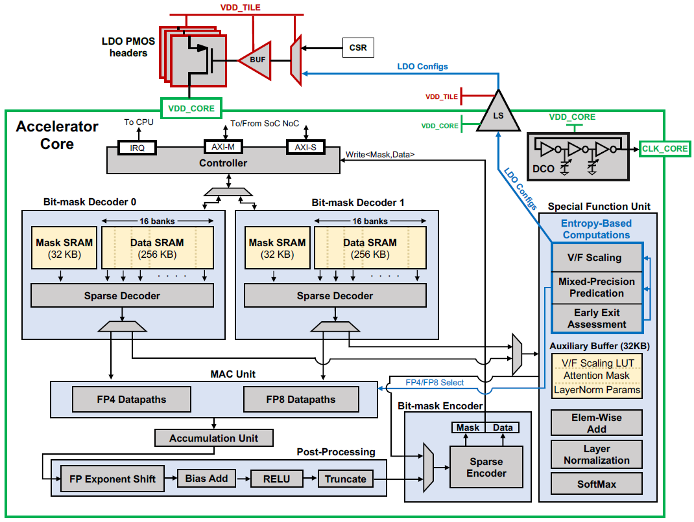
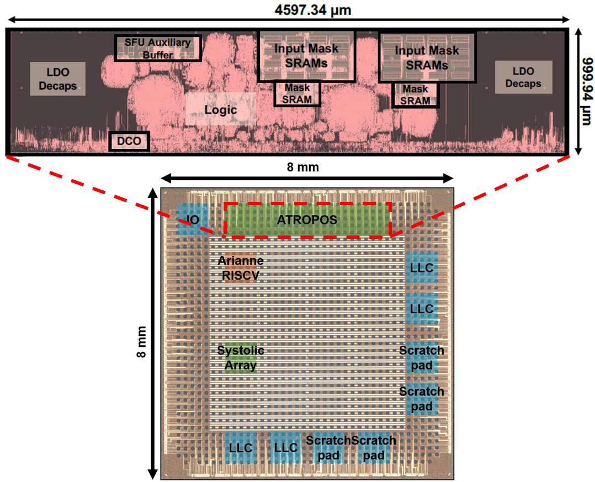
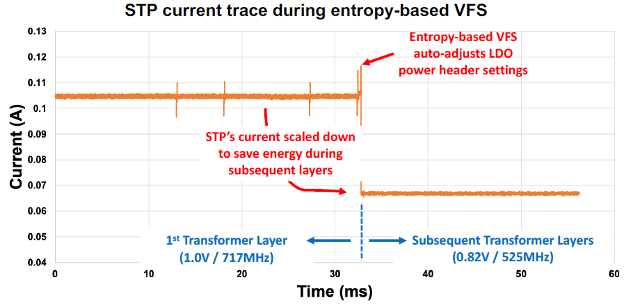
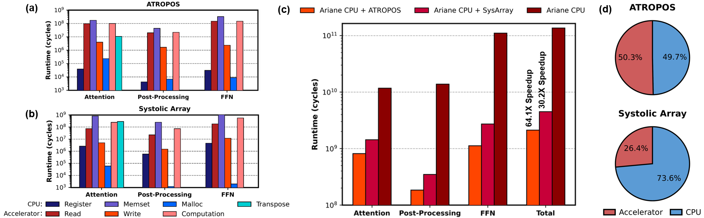
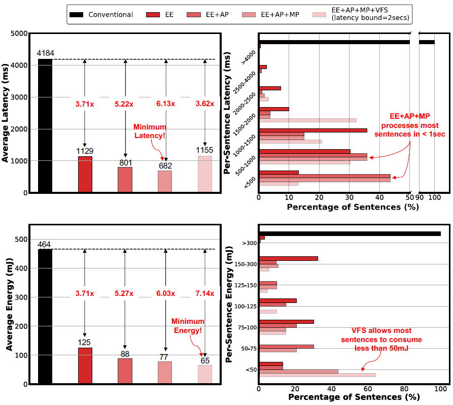

### Atropos — 12nm 18.1 TFLOPs/W 稀疏 Transformer 加速器

```yaml
id: atropos
name: "Atropos"
full_name: "Atropos: A 12nm 18.1TFLOPs/W Sparse Transformer Processor with Entropy-Based Early Exit, Mixed-Precision Predication and Fine-Grained Power Management"
year: "2023"
org: "Stanford / Harvard"
paper_url: "https://doi.org/10.1109/OJSSCS.2026.3674438"
category: "device"
parent: "—"
motivation: "利用输入语句的熵信号统一控制提前退出、混合精度切换和电压频率缩放，实现逐句自适应的延迟与能耗优化，达到 18.1 TFLOPs/W 能效比"
```

#### 📝 一句话总结

Atropos 是一颗 12 nm FinFET Transformer 推理加速器，首次将**熵信号**同时用于三项优化——提前退出（Early Exit）、FP4/FP8 混合精度切换和逐句电压-频率缩放（DVFS），在 BERT/ALBERT 推理中实现 18.1 TFLOPs/W 峰值能效和 65 mJ/句的能耗，较传统 12 层全推理节省 7.14× 能量。

#### 🎯 核心要点

- **芯片规格**：12 nm FinFET，面积 4.60 mm²，集成于 64 mm² SoC（含 Ariane RISC-V CPU + 32×32 Systolic Array）
- **三合一熵控制**：第一层 Transformer 输出的熵值同时驱动 (1) 提前退出层预测、(2) FP4/FP8 精度选择、(3) 供电电压与时钟频率缩放
- **提前退出**：基于熵阈值 \(E_T\) 预测退出层，SST-2 任务平均仅需 3.9 层（vs 12 层），延迟降低 6.13×
- **混合精度 MAC**：FP8 (E4M3) 与 FP4 (E3M0) 双数据通路，FP4 向量宽度 32（FP8 为 16），配合 per-vector INT6 指数偏置，FP4 精度损失仅 1.2%（91.0% vs 92.2% baseline）
- **细粒度 DVFS**：16 组 V/F 对（0.62–1.0 V，77–717 MHz），通过 cell-based PMOS header + 无反馈 LDO + DCO 实现，切换粒度为单句
- **能效**：FP4 峰值 18.1 TFLOPs/W，FP8 峰值 8.24 TFLOPs/W；2 秒 QoS 目标下 65 mJ/句
- **加速比**：相比同 SoC 上的 Ariane CPU 加速 64.1×，相比 Systolic Array 加速 2.12×
- **模型**：ALBERT（BERT-base 参数共享变体），SST-2/MNLI/QQP 三个 NLP 任务验证

#### 🔬 深入细节

##### 系统架构总览


*图：Atropos 系统级架构。核心包括混合精度 MAC 单元、SFU（特殊功能单元，含 32 KB 辅助缓冲）、熵计算引擎、cell-based PMOS power header + 无反馈 LDO + DCO 构成的本地电源域。*

Atropos 的设计核心是将**语义复杂度**（以熵量化）映射为硬件控制信号。整个推理流程如下：

1. **第一层推理**：以最高频率（717 MHz）执行第一个 Transformer 层，获得分类 logits
2. **熵计算**：SFU 中的向量化熵引擎计算 softmax 输出的自熵 \(H(z^{(\ell)})\)
3. **三路决策**：
   - 若 \(H < E_T\)，直接退出（句子已"确定"）
   - 否则，查 LUT 预测退出层 \(L\)，计算目标频率 \(f' = N / (T - T_{\text{curr}})\)，查 DVFS LUT 获得最优电压 \(V'_{DD}\)
   - 同时根据熵值决定后续层使用 FP4 还是 FP8 精度
4. **降频推理**：以降低后的 V/F 完成第 2 到第 \(L\) 层推理

##### 熵引导的提前退出算法

传统提前退出（Algorithm 1）在每层都计算熵并判断是否退出，但这导致延迟不可预测。Atropos 的改进（Algorithm 2）在**仅第一层**就预测退出层，从而可以提前规划频率：

```python
# Algorithm 2: Atropos Early Exit Inference
for sentence_i in sentences:
    # Phase 1: 全速执行第一层
    z_1 = transformer_layer_1(sentence_i)
    H = entropy(z_1)
    
    if H < E_T:
        exit()  # 第一层就够了
    
    # Phase 2: 预测退出层，规划频率
    L = LUT_EE(H, E_T)           # 查表：熵 → 预测退出层
    f_prime = N / (T - T_curr)    # 剩余周期数 / 剩余时间
    V_DD = LUT_DVFS(f_prime)      # 查表：频率 → 最优电压
    
    # Phase 3: 降频执行剩余层
    for layer in range(2, L+1):
        z_l = transformer_layer(sentence_i)
        if entropy(z_l) < E_T:
            exit()  # 提前退出仍然可能
```

> 💡 **关键设计思想**：第一层的熵与最终退出层之间存在强相关性（论文通过线性层/LUT 建模）。利用这一点，Atropos 将"何时退出"的不确定性转化为"以什么速度跑完"的确定性调度，从而给出**统一的延迟保证**（如 2 秒 QoS 目标）。

##### 混合精度 FP4/FP8 MAC 数据通路


*图：(上) FP4/FP8 混合精度 MAC 单元结构，展示 per-vector 指数偏置机制；(下) 熵计算引擎的向量化实现。*

MAC 单元支持两种模式：

| 特性 | FP8 (E4M3) | FP4 (E3M0) |
|------|-----------|-----------|
| 向量宽度 | 16 | 32 |
| 是否有尾数乘法器 | 有 | 无（仅指数加法） |
| 吞吐量 | 1× | 2× |
| 峰值能效 | 8.24 TFLOPs/W | 18.1 TFLOPs/W |

FP4 格式编码为：

$$(-1)^{\text{sign}} \times 2^{\text{exponent} + \text{expbias} / \gamma}$$

其中 \(\gamma\) 控制数值间距。关键创新在于 **per-vector 指数偏置**（而非 per-tensor）：每个向量附带一个 INT6 指数偏置值，存储在 PE 内部寄存器中。这将 FP4 per-tensor 量化的 SST-2 精度从 69.0% 提升至 88.3%（per-vector），结合熵引导的混合精度切换最终达到 91.0%（仅比 baseline 92.2% 低 1.2%）。

| 量化策略 | SST-2 准确率 |
|---------|------------|
| Baseline (FP32) | 92.2% |
| FP8 per-tensor expbias | 92.1% |
| FP4 per-tensor expbias | 69.0% |
| FP4 per-vector expbias | 88.3% |
| 熵引导混合精度（本工作） | 91.0% |

> ⚠️ **注意**：FP4 (E3M0) 没有尾数位，仅靠 3 位指数 + 1 位符号表示数值。如果没有 per-vector expbias 补偿动态范围，精度会灾难性下降（69%）。per-vector 粒度的偏置是使 FP4 可用的关键。

##### 熵计算的硬件实现


*图：熵函数硬件实现。输出同时驱动 V/F 缩放、混合精度选择和提前退出信号。*

熵计算通过 3 步向量化流水线实现（Algorithm 3）：

```python
# Algorithm 3: Vectorized Softmax & Entropy Calculation
# Input: early exit vector z_l[0..k-1], vector width n

# Step 1: 找最大值（数值稳定性）
max_k = -inf
for i in range(ceil(k/n)):
    v = LOAD(z_l[n*i : n*i+n-1])
    max_k = max(max_k, MAX(v))

# Step 2: 计算指数和与加权指数和
sum_exp = 0
x_sum_exp = 0
for i in range(ceil(k/n)):
    v = LOAD(z_l[n*i : n*i+n-1])
    sum_exp  += SUM(exp(v - max_k))
    x_sum_exp += SUM(v * exp(v - max_k))

# Step 3: 计算熵
H = ln(sum_exp) - max_k - x_sum_exp / sum_exp
```

> 💡 **数值稳定性技巧**：通过减去最大值 \(\text{max}_k\) 避免指数运算溢出。`exp()` 和 `ln()` 均使用**分段线性近似**（bit-accurate piecewise linear）实现，兼顾精度与面积效率。

##### 细粒度电压-频率缩放


*图：(左) 后硅实测 LDO 电流响应轨迹，展示熵控制的 VFS 切换过程；(右) 每句熵值与对应 V/F 缩放的相关性。*

电源管理子系统的独特设计：

- **Cell-based PMOS power headers**：而非传统的片外稳压器，使用标准单元库中的 PMOS 管作为电源开关
- **无反馈 LDO（Free-running LDO）**：省去传统 LDO 的反馈环路，通过 16 个预表征的电阻值（存储在 SFU 的 32 KB LUT 中）直接设置输出电压
- **DCO（数字控制振荡器）**：由 LDO 输出供电，电压降低时频率自然降低，实现 V/F 的自然耦合
- **16 组 V/F 对**：覆盖 0.62–1.0 V 和 77–717 MHz 范围

这种设计的优势是**切换速度快**（无需等待反馈环路稳定）且**完全自包含**（不依赖主时钟域），使得逐句级别的 DVFS 成为可能。

##### 测量结果与对比


*图：(a) 芯片显微照片与面积分布；(b) Shmoo 图展示功能正确的 V/F 工作范围；(c) 各处理阶段运行时间对比；(d) CPU vs 加速器运行时间对比。*

**关键测量数据**：

| 指标 | 数值 |
|------|------|
| 工艺 | 12 nm FinFET |
| 面积 | 4.60 mm²（SoC 总 64 mm²） |
| 电压范围 | 0.62 – 1.0 V |
| 频率范围 | 77 – 717 MHz |
| 功耗（FP4） | 9 – 111 mW |
| 功耗（FP8） | 10 – 122 mW |
| 峰值吞吐（FP4） | 0.734 TOPS |
| 峰值吞吐（FP8） | 0.367 TOPS |
| 峰值能效（FP4） | 18.1 TFLOPs/W |
| 峰值能效（FP8） | 8.24 TFLOPs/W |
| SRAM | 647 KB |
| 每句能耗 | 65 mJ（2s QoS 目标） |
| 平均退出层（SST-2） | 3.9 / 12 层 |
| SST-2 准确率 | 91.0%（vs 92.2% baseline） |

**与先前工作对比**（Table 3）：

| 工作 | 工艺 | 面积 | 数据类型 | 峰值能效 | 逐句自适应 |
|------|------|------|---------|---------|-----------|
| JSSC'22 | 16 nm | 8.84 mm² | FP8/Posit8 | 7.8 TOPS/W | ✗ |
| VLSI'22 | 5 nm | 0.153 mm² | INT4 | 95.6 TOPS/W | ✗ |
| ISSCC'22 | 28 nm | 6.82 mm² | INT8 | 4.25 TOPS/W | ✗ |
| VLSI'24 | 22 nm | 6.4 mm² | INT12 | 20.58 TOPS/W | ✗ |
| JSSC'25 | 40 nm | 65.6 mm² | BF16 | 0.50 TOPS/W | ✗ |
| **Atropos** | **12 nm** | **4.60 mm²** | **FP4/FP8** | **18.1 TOPS/W** | **✓ (EE+MP+VFS)** |

> 💡 **独特优势**：Atropos 是唯一支持**逐句自适应优化**（Sentence-Level Adaptive Optimization）的设计。虽然 VLSI'22 在 5 nm 工艺下以 INT4 达到了更高的绝对能效（95.6 TOPS/W），但其不具备根据输入复杂度动态调整计算量和功耗的能力。Atropos 的核心贡献不在于绝对峰值数字，而在于**将算法级自适应（early exit + mixed precision）与电路级自适应（DVFS）统一到一个熵信号下**的系统级协同设计方法学。

##### 与传统方法的区别

| 维度 | 传统 Transformer 加速器 | Atropos |
|------|----------------------|---------|
| 推理层数 | 固定（12 层） | 自适应（平均 3.9 层） |
| 数据精度 | 固定（FP8 或 INT8） | 熵引导动态切换 FP4/FP8 |
| 电压/频率 | 固定或粗粒度调节 | 逐句 16 级 DVFS |
| 延迟保证 | 最坏情况设计 | QoS 目标驱动（如 2 秒） |
| 控制信号 | 无统一信号 | 单一熵信号驱动三项优化 |

#### 🧪 练习题

```yaml
question: "Atropos 为什么选择在第一层 Transformer 输出上计算熵，而不是在每一层都计算？"
options:
  - "第一层的熵计算精度最高"
  - "为了在推理早期就预测退出层并规划降频策略，从而提供统一的延迟保证"
  - "后续层没有分类输出，无法计算熵"
  - "为了减少熵计算硬件的面积开销"
answer: 1
explain: "Atropos 的核心设计目标是提供统一的延迟保证（如 2 秒 QoS）。通过在第一层就预测退出层，可以计算剩余所需周期数并降低频率，将不确定的提前退出转化为确定的调度计划。虽然减少面积也是好处，但这不是主要动机。"
```