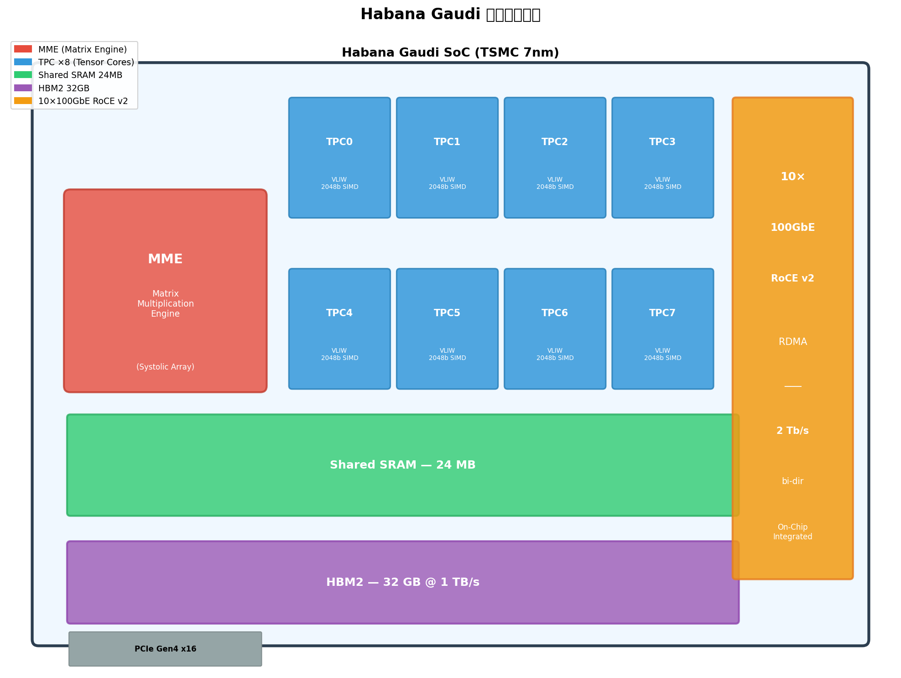
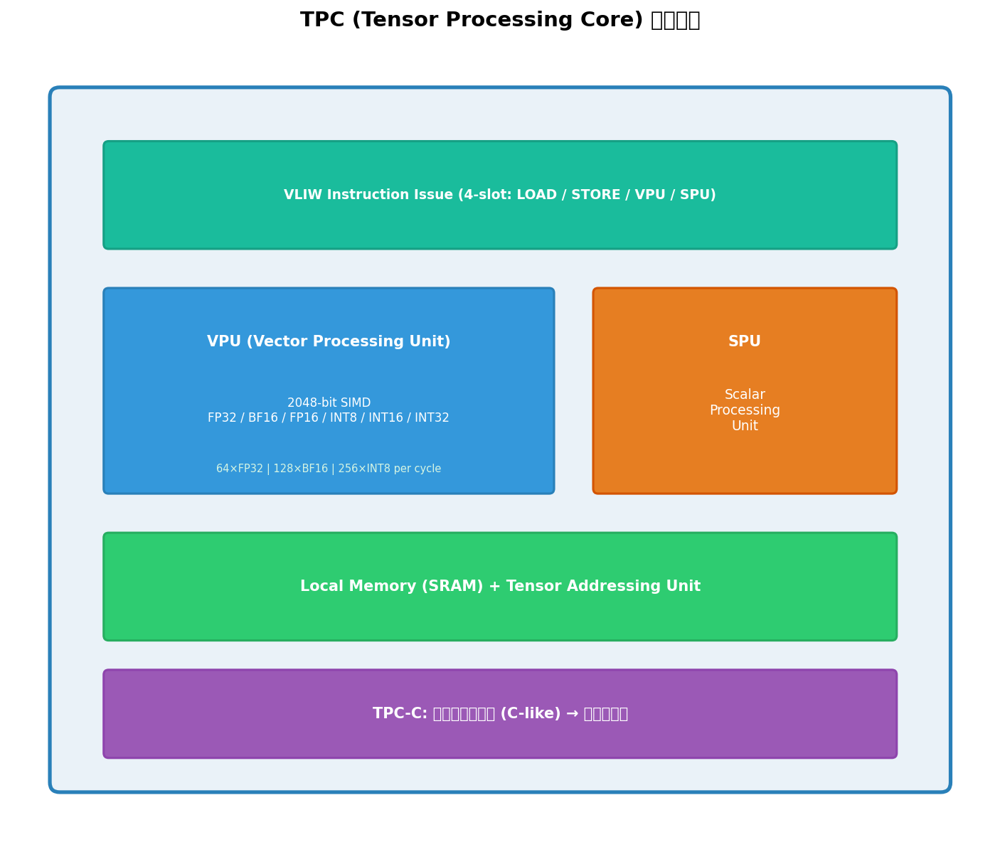
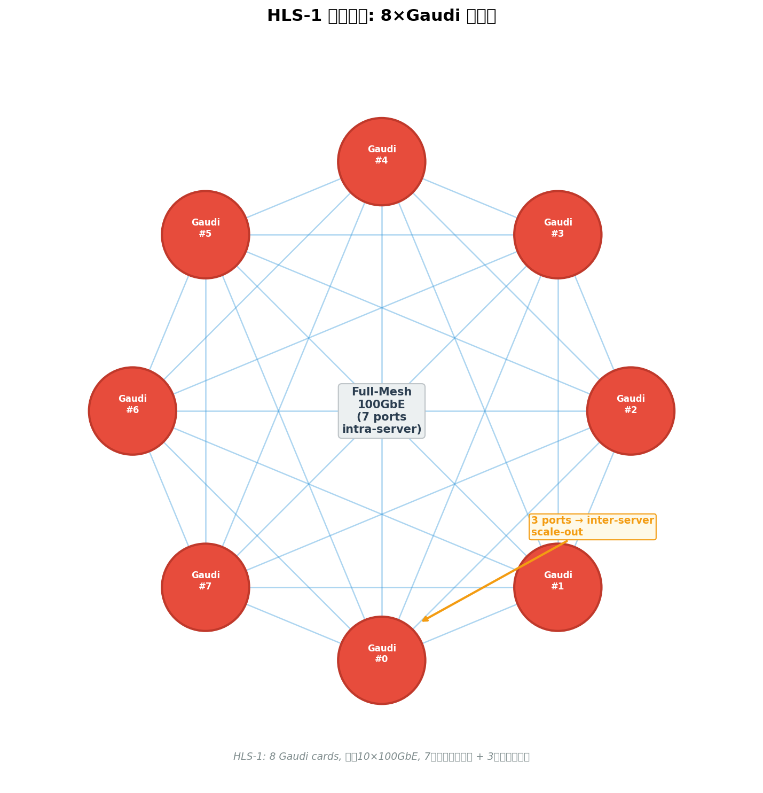
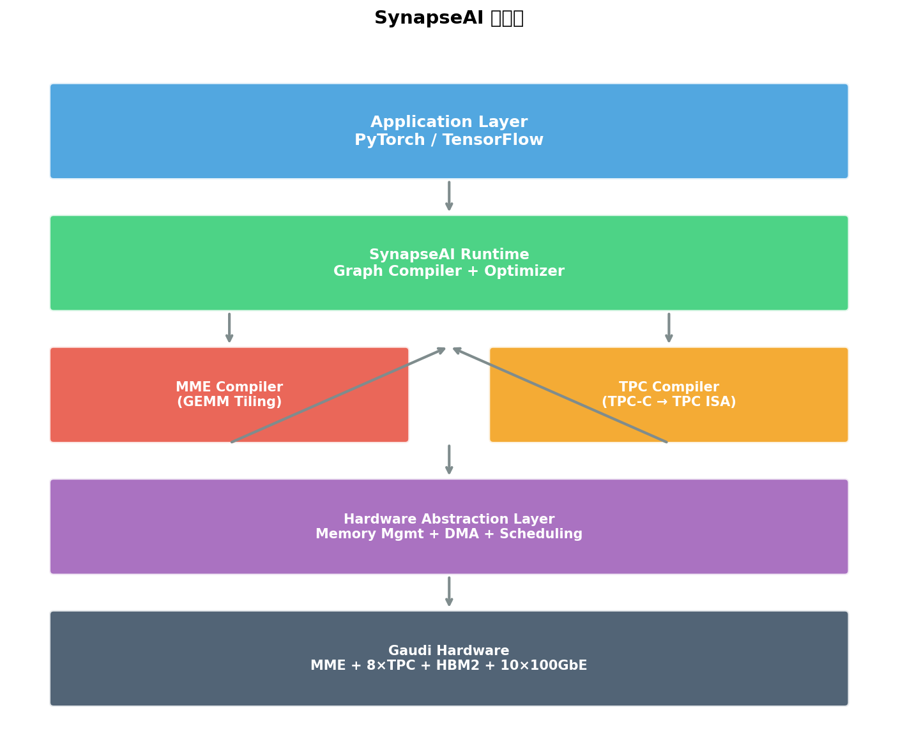

### Habana Gaudi 深度学习训练处理器架构

```yaml
id: habana_gaudi
name: "Habana Gaudi"
full_name: "Habana Gaudi Deep Learning Training Processor"
year: "2020"
org: "Habana Labs (Intel)"
paper_url: "https://ieeexplore.ieee.org/document/9220735"
category: "infrastructure/device"
parent: "—"
motivation: "通过在芯片上集成10×100GbE RDMA网络接口，消除外部网络交换机瓶颈，实现高效以太网原生横向扩展的深度学习训练加速器"
```

#### 📝 一句话总结

Habana Gaudi 是一款面向深度学习训练的异构加速处理器，其核心创新在于**片上集成 10 个 100GbE RoCE v2 RDMA 端口**（总带宽 2 Tb/s 双向），配合异构计算架构（1 个 MME 矩阵引擎 + 8 个可编程 TPC 张量核心），在无需外部 InfiniBand 交换机的前提下实现高效的多卡/多节点横向扩展训练。

#### 🎯 核心要点

- **异构双引擎架构**：1 个 MME（Matrix Multiplication Engine，脉动阵列）负责 GEMM 运算 + 8 个 TPC（Tensor Processing Core，VLIW SIMD）负责非矩阵张量运算，两类引擎可完全并行
- **片上集成以太网**：10×100GbE RoCE v2 端口直接集成在芯片上，提供 2 Tb/s 双向 RDMA 带宽，是区别于 NVIDIA GPU 的核心差异化设计
- **HLS-1 系统拓扑**：8 张 Gaudi 卡通过 100GbE 全互联（7 端口卡间 + 3 端口跨服务器），无需外部交换机即可构建训练集群
- **TPC 可编程性**：TPC 采用 2048-bit SIMD 向量引擎，支持 TPC-C 编程语言自定义算子内核，覆盖 FP32/BF16/FP16/INT8/INT16/INT32 多种数据类型
- **大容量片上存储**：32 GB HBM2 显存（1 TB/s 带宽）+ 24 MB 共享 SRAM，SRAM 作为 MME 与 TPC 之间的高速数据交换缓冲
- **SynapseAI 软件栈**：包含图编译器（Graph Compiler）、TPC 编译器、运行时系统，原生支持 PyTorch 和 TensorFlow 框架
- **TSMC 7nm 工艺**：采用台积电 7nm FinFET 制程，在功耗和面积效率上具有竞争力

#### 🔬 深入细节

##### 1. 设计动机与背景

深度学习训练工作负载对计算和通信能力提出了双重挑战。在计算层面，训练过程中的前向传播和反向传播包含大量矩阵乘法（GEMM）运算，同时也包含激活函数、归一化（Normalization）、损失计算等非矩阵运算。在通信层面，分布式训练（如数据并行）需要在多个加速器之间高频执行 AllReduce 等集合通信操作，梯度同步的带宽和延迟直接影响训练的扩展效率。

传统方案（如 NVIDIA GPU + InfiniBand）中，计算芯片与网络接口是分离的：GPU 通过 PCIe 连接到主机，再由主机上的 InfiniBand HCA（Host Channel Adapter）或 NVLink/NVSwitch 完成卡间通信。这种架构存在以下问题：

1. **外部交换机成本高昂**：InfiniBand 交换机价格昂贵，且随着集群规模增长，交换机层级和成本呈超线性增长
2. **PCIe 瓶颈**：GPU 到网络接口之间需要经过 PCIe 总线，增加了通信延迟
3. **灵活性受限**：InfiniBand 拓扑相对固定，难以灵活适配不同规模的训练集群

Habana Labs（2019 年被 Intel 收购）提出了一种根本性的架构创新：**将高速以太网 RDMA 接口直接集成到加速器芯片上**。这一设计使得：
- 加速器之间可以通过标准以太网直连，无需昂贵的专用交换机
- 数据从计算引擎到网络端口的路径极短，减少通信延迟
- 以太网生态成熟、成本低廉，有利于大规模部署


*图 1：Habana Gaudi 芯片架构框图。芯片包含 1 个 MME 矩阵引擎、8 个 TPC 张量处理核心、24 MB 共享 SRAM、32 GB HBM2 以及 10 个 100GbE RoCE v2 网络端口。*

##### 2. 芯片架构详解

Gaudi 采用 TSMC 7nm FinFET 工艺制造，芯片内部采用**异构计算架构**，将深度学习训练中的不同运算类型映射到专用的硬件引擎上。

###### 2.1 MME（Matrix Multiplication Engine）

MME 是 Gaudi 的矩阵运算核心，采用**脉动阵列（Systolic Array）**架构，专门优化大规模矩阵乘法运算。在深度学习训练中，卷积层（通过 im2col 转换为 GEMM）、全连接层、注意力机制中的 \(QK^T\) 和 \(AV\) 运算等均由 MME 处理。

MME 的关键设计特点包括：

- **高吞吐量脉动阵列**：数据在阵列中以流水线方式传播，每个时钟周期完成大量乘累加（MAC）运算
- **混合精度支持**：原生支持 BF16（Brain Floating Point 16）和 FP32 运算，BF16 模式下吞吐量翻倍
- **自动分块（Tiling）**：MME 编译器自动将大矩阵分解为适合硬件阵列尺寸的小块，最大化硬件利用率

> 💡 **关键设计理念**：MME 是一个"固定功能"引擎——它只做矩阵乘法，但做得极其高效。所有非 GEMM 运算（如激活函数、BatchNorm、损失计算）则交给 TPC 处理。这种分工使得两类引擎可以**流水线并行**执行，MME 计算下一层的矩阵乘法时，TPC 同时处理当前层的后处理运算。

###### 2.2 TPC（Tensor Processing Core）

TPC 是 Gaudi 架构中最具创新性的组件之一。每颗 Gaudi 芯片包含 **8 个 TPC**，每个 TPC 是一个完全可编程的 VLIW（Very Long Instruction Word）处理器，配备宽向量 SIMD 执行单元。


*图 2：TPC 内部架构。每个 TPC 包含 VLIW 指令发射单元、2048-bit 向量处理单元（VPU）、标量处理单元（SPU）、本地存储和张量寻址单元。*

TPC 的核心规格：

| 特性 | 规格 |
|------|------|
| 指令架构 | VLIW（4 槽位：LOAD / STORE / VPU / SPU） |
| 向量宽度 | 2048-bit SIMD |
| FP32 吞吐 | 64 ops/cycle（每 TPC） |
| BF16 吞吐 | 128 ops/cycle（每 TPC） |
| INT8 吞吐 | 256 ops/cycle（每 TPC） |
| 支持数据类型 | FP32, BF16, FP16, INT8, INT16, INT32 |
| 编程模型 | TPC-C（类 C 语言） |

TPC 的 **VLIW 4 槽位设计**允许在单个时钟周期内同时发射：
- 一条 **LOAD** 指令（从 SRAM/HBM 加载数据到本地寄存器）
- 一条 **STORE** 指令（将结果写回 SRAM/HBM）
- 一条 **VPU** 指令（2048-bit 向量运算）
- 一条 **SPU** 指令（标量运算，用于控制流和地址计算）

这种设计使得 TPC 能够在执行向量计算的同时进行数据搬运，有效隐藏内存访问延迟。

**TPC-C 可编程性**是 Gaudi 相对于竞品的重要差异化特性。开发者可以使用类 C 语言（TPC-C）编写自定义算子内核，编译为 TPC 指令集架构（ISA）后在硬件上执行。这意味着：

- 新的激活函数、归一化方法等可以快速实现，无需等待硬件更新
- 研究人员可以实验自定义运算，不受固定硬件功能的限制
- 软件栈可以持续优化，通过更新 TPC 内核提升已部署硬件的性能

```c
// TPC-C 自定义算子示例：GELU 激活函数
void main(tensor input, tensor output) {
    int5 index = get_index_space_offset();
    int5 end = get_index_space_size() + index;
    
    // 2048-bit SIMD 向量化处理
    float64 x = v_f32_ld_tnsr(index, input);
    
    // GELU(x) = 0.5 * x * (1 + tanh(sqrt(2/π) * (x + 0.044715 * x³)))
    float64 x3 = x * x * x;
    float64 inner = 0.7978845608f * (x + 0.044715f * x3);
    float64 result = 0.5f * x * (1.0f + v_f32_tanh(inner));
    
    v_f32_st_tnsr(index, output, result);
}
```

> ⚠️ **注意**：上述代码为简化示意。实际 TPC-C 编程需要处理张量维度映射、内存对齐、流水线调度等细节，Habana 提供了完整的 TPC SDK 和编程指南。

###### 2.3 存储层次

Gaudi 的存储层次设计体现了对深度学习训练数据流的深入理解：

$$\text{存储层次}: \underbrace{\text{TPC Local Regs}}_{\text{最快}} \rightarrow \underbrace{\text{Shared SRAM (24 MB)}}_{\text{片上}} \rightarrow \underbrace{\text{HBM2 (32 GB)}}_{\text{片外}}$$

- **共享 SRAM（24 MB）**：这是 Gaudi 架构的关键设计。24 MB 的片上 SRAM 被 MME 和所有 8 个 TPC 共享，作为高速数据交换缓冲区。MME 将矩阵乘法的中间结果写入 SRAM，TPC 从 SRAM 读取数据执行后处理（如 BatchNorm、ReLU），然后将结果写回 SRAM 供 MME 读取进行下一层计算。这种设计避免了中间结果频繁读写 HBM 的带宽浪费。

- **HBM2（32 GB，1 TB/s）**：用于存储模型权重、激活值、梯度等大容量数据。1 TB/s 的带宽确保了大批量训练时的数据供给能力。

> 💡 **关键洞察**：24 MB SRAM 的设计哲学是"让数据尽可能留在片上"。在典型的 ResNet-50 训练中，单层的中间激活值通常在几 MB 量级，可以完全放入 SRAM。这使得 MME→SRAM→TPC→SRAM→MME 的流水线几乎不需要访问 HBM，极大提升了能效比。

##### 3. 片上集成网络：核心创新

Gaudi 最具颠覆性的设计是**将 10 个 100GbE RoCE v2（RDMA over Converged Ethernet v2）端口直接集成在芯片上**。这是 Gaudi 区别于所有竞品（包括 NVIDIA GPU、Google TPU）的核心差异化特性。

###### 3.1 为什么选择以太网而非 InfiniBand？

| 维度 | InfiniBand | 以太网（RoCE v2） |
|------|-----------|-------------------|
| 生态成熟度 | 专用 HPC 生态 | 全球最广泛的网络生态 |
| 交换机成本 | 极高（专用 ASIC） | 相对低廉（商用交换机） |
| 运维复杂度 | 需要专业 IB 运维团队 | 数据中心运维团队可复用 |
| 带宽 | HDR 200 Gb/s | 100 GbE × 10 = 1 Tb/s |
| RDMA 支持 | 原生 RDMA | RoCE v2（基于 UDP/IP） |
| 可扩展性 | 需要专用交换机层级 | 可利用现有以太网基础设施 |

Habana 选择以太网的核心逻辑是：**以太网的总体拥有成本（TCO）远低于 InfiniBand**，尤其在大规模集群部署场景下。虽然单端口带宽不如 InfiniBand HDR（200 Gb/s），但 Gaudi 通过集成 10 个端口实现了 **1 Tb/s 单向 / 2 Tb/s 双向**的总带宽，在聚合带宽上具有竞争力。

###### 3.2 片上集成的技术优势

将网络接口集成在加速器芯片上（而非作为外部 NIC）带来了多重优势：

1. **零拷贝 RDMA**：计算引擎的输出可以直接通过片上网络端口发送到远端加速器，无需经过 PCIe 总线和主机内存，实现真正的零拷贝数据传输

2. **极低延迟**：数据从 HBM/SRAM 到网络端口的路径完全在芯片内部，延迟仅为纳秒级，远低于通过 PCIe 到外部 NIC 的微秒级延迟

3. **计算-通信重叠**：由于网络端口与计算引擎共享同一芯片，DMA 引擎可以在计算进行的同时异步发送/接收梯度数据，实现高效的计算-通信重叠（overlap）

4. **简化系统设计**：无需外部 NIC、无需额外的 PCIe 通道分配，系统板卡设计更简洁

###### 3.3 HLS-1 系统拓扑

Habana 设计了 HLS-1（Habana Labs Server 1）作为 Gaudi 的标准服务器配置，包含 **8 张 Gaudi 加速卡**。


*图 3：HLS-1 系统拓扑。8 张 Gaudi 卡通过 100GbE 全互联，每卡使用 7 个端口进行卡间通信，剩余 3 个端口用于跨服务器扩展。*

每张 Gaudi 卡的 10 个 100GbE 端口分配如下：

$$\underbrace{7 \text{ ports}}_{\text{intra-server (全互联)}} + \underbrace{3 \text{ ports}}_{\text{inter-server (跨服务器)}} = 10 \text{ ports total}$$

- **7 个端口用于服务器内全互联**：8 张卡之间形成全连接（full-mesh）拓扑，任意两张卡之间有直连的 100GbE 链路。AllReduce 操作可以在不经过任何交换机的情况下完成，延迟极低。

- **3 个端口用于跨服务器扩展**：每张卡有 3 个端口连接到 ToR（Top-of-Rack）以太网交换机，用于多服务器之间的通信。这 3 个端口提供 300 Gb/s 的跨服务器带宽。

这种拓扑设计的优势在于：
- 服务器内 AllReduce 完全无交换机，延迟最低
- 跨服务器通信利用标准以太网交换机，成本可控
- 8 卡全互联拓扑天然适合 Ring-AllReduce 和 Recursive Halving-Doubling 等集合通信算法

##### 4. SynapseAI 软件栈

硬件创新需要配套的软件栈才能发挥效能。Habana 开发了 **SynapseAI** 作为 Gaudi 的完整软件栈。


*图 4：SynapseAI 软件栈层次结构。从上到下依次为框架层、图编译器、MME/TPC 编译器、硬件抽象层和硬件层。*

SynapseAI 的核心组件包括：

1. **Graph Compiler（图编译器）**：接收来自 PyTorch 或 TensorFlow 的计算图，执行图级优化（算子融合、内存规划、调度优化），然后将运算分配给 MME 或 TPC

2. **MME Compiler**：将 GEMM 运算编译为 MME 指令，自动完成矩阵分块（tiling）、数据布局转换等优化

3. **TPC Compiler**：将 TPC-C 内核编译为 TPC ISA 指令，执行向量化、循环展开、寄存器分配等优化

4. **Runtime**：管理设备内存、DMA 传输、多流（stream）调度、集合通信等运行时功能

5. **框架集成**：通过 Habana PyTorch Bridge 和 TensorFlow Integration 提供对主流框架的透明支持，用户代码只需少量修改即可在 Gaudi 上运行

```python
# PyTorch on Gaudi 示例代码
import torch
import habana_frameworks.torch.core as htcore

# 将模型和数据移动到 Gaudi 设备
device = torch.device("hpu")  # Habana Processing Unit
model = model.to(device)
optimizer = torch.optim.SGD(model.parameters(), lr=0.01)

for data, target in train_loader:
    data, target = data.to(device), target.to(device)
    output = model(data)
    loss = criterion(output, target)
    loss.backward()
    optimizer.step()
    htcore.mark_step()  # Gaudi 特有：触发图编译和执行
```

> 💡 **关键**：`htcore.mark_step()` 是 Gaudi 编程模型的核心概念。Gaudi 采用**延迟执行（lazy execution）**模式——PyTorch 操作被记录为计算图，直到 `mark_step()` 被调用时才触发图编译和硬件执行。这使得图编译器有机会看到完整的计算图并执行全局优化。

##### 5. 对比分析与个人评价

###### 5.1 与 NVIDIA A100 的对比

| 维度 | Habana Gaudi | NVIDIA A100 |
|------|-------------|-------------|
| 制程 | TSMC 7nm | TSMC 7nm |
| 计算架构 | MME + 8×TPC（异构） | 108 SM（同构 CUDA 核心 + Tensor Core） |
| 显存 | 32 GB HBM2, 1 TB/s | 40/80 GB HBM2e, 1.6/2.0 TB/s |
| 片上 SRAM | 24 MB 共享 | 40 MB L2 Cache |
| 卡间互联 | 10×100GbE RoCE v2（片上） | NVLink 3.0（600 GB/s） |
| 跨节点互联 | 100GbE（片上集成） | InfiniBand HDR（外部 NIC） |
| 编程模型 | SynapseAI + TPC-C | CUDA + cuDNN |
| 生态成熟度 | 新兴生态 | 极度成熟 |

**个人分析**：

Gaudi 的**片上集成网络**是一个极具前瞻性的设计决策。在大模型训练时代，通信带宽已经成为与计算能力同等重要的瓶颈。NVIDIA 通过 NVLink/NVSwitch 解决了服务器内的互联问题，但跨节点仍依赖外部 InfiniBand 网络。Gaudi 将网络接口内化为芯片的一部分，从架构层面消除了"计算芯片"和"网络芯片"之间的边界，这一思路在后续的 Gaudi2 和 Gaudi3 中得到了延续和强化。

然而，Gaudi 的**软件生态**是其最大的短板。CUDA 经过 15 年以上的积累，拥有海量的优化库、开发工具和社区支持。SynapseAI 虽然功能完整，但在算子覆盖率、调试工具成熟度、第三方库支持等方面仍有差距。这也是为什么尽管 Gaudi 在性价比上具有优势，但市场份额仍然有限的主要原因。

###### 5.2 与 Google TPU v3 的对比

| 维度 | Habana Gaudi | Google TPU v3 |
|------|-------------|---------------|
| 计算核心 | MME + TPC（可编程） | MXU（脉动阵列，固定功能） |
| 可编程性 | TPC-C 自定义算子 | XLA 编译器优化（用户不可编程硬件） |
| 互联 | 以太网（开放标准） | ICI（专用互联，仅限 Google Cloud） |
| 可用性 | 可购买硬件 | 仅 Google Cloud 租用 |
| 存储 | 32 GB HBM2 | 32 GB HBM |

**个人分析**：

Gaudi 与 TPU 在架构哲学上有相似之处——都采用了脉动阵列作为矩阵运算核心。但两者在**可编程性**和**开放性**上存在根本差异。TPU 的 MXU 是纯固定功能单元，所有优化依赖 XLA 编译器；而 Gaudi 的 TPC 提供了硬件级的可编程性，允许开发者直接编写自定义算子。这种设计在面对快速演进的深度学习算法时更具灵活性——例如，当新的激活函数（如 SwiGLU）或归一化方法（如 RMSNorm）出现时，TPC 可以快速实现而无需等待硬件迭代。

在互联方面，TPU 使用 Google 专有的 ICI（Inter-Chip Interconnect）构建 Pod 级别的超大规模互联网络（TPU v3 Pod 包含 1024 个 TPU 核心），但这一能力仅限于 Google Cloud 内部。Gaudi 选择开放的以太网标准，虽然单跳带宽不如 ICI，但**任何数据中心都可以部署**，不受云厂商锁定。

###### 5.3 架构创新的深远影响

Gaudi 的片上集成网络设计对行业产生了深远影响：

1. **验证了以太网训练的可行性**：在 Gaudi 之前，业界普遍认为 InfiniBand 是大规模训练的唯一选择。Gaudi 证明了基于 RoCE v2 的以太网方案在性能上可以满足训练需求，推动了更多厂商探索以太网训练方案。

2. **推动了"计算-网络融合"趋势**：Gaudi 的设计理念——将网络接口作为计算芯片的一等公民——影响了后续芯片设计。NVIDIA 在 Grace Hopper 超级芯片中也开始将 NVLink 和网络功能更紧密地集成。

3. **降低了 AI 基础设施门槛**：以太网方案的 TCO 优势使得更多组织能够构建自己的训练集群，不再被 InfiniBand 的高成本所限制。

总体而言，Habana Gaudi 是一款**设计理念领先于时代**的处理器。其片上集成网络的创新在 2020 年发布时显得激进，但随着大模型训练对通信带宽需求的爆发式增长，这一设计的前瞻性已经得到充分验证。Gaudi 的主要挑战在于软件生态的追赶——这不是一个技术问题，而是一个时间和投入的问题。

#### 🧪 练习题

```yaml
question: "Habana Gaudi 芯片上集成了多少个 100GbE RoCE v2 网络端口？在 HLS-1 系统（8卡配置）中，这些端口如何分配？"
options:
  - "8 个端口：4 个卡间 + 4 个跨服务器"
  - "10 个端口：7 个卡间全互联 + 3 个跨服务器扩展"
  - "12 个端口：8 个卡间 + 4 个跨服务器"
  - "10 个端口：5 个卡间 + 5 个跨服务器"
answer: 1
explain: "Gaudi 集成 10 个 100GbE 端口，在 HLS-1 的 8 卡配置中，7 个端口用于服务器内 8 卡全互联（full-mesh），3 个端口用于跨服务器扩展通信。"
```