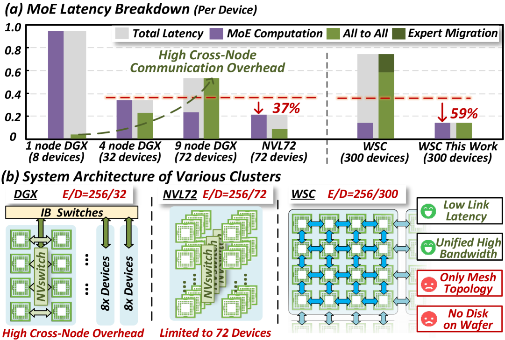
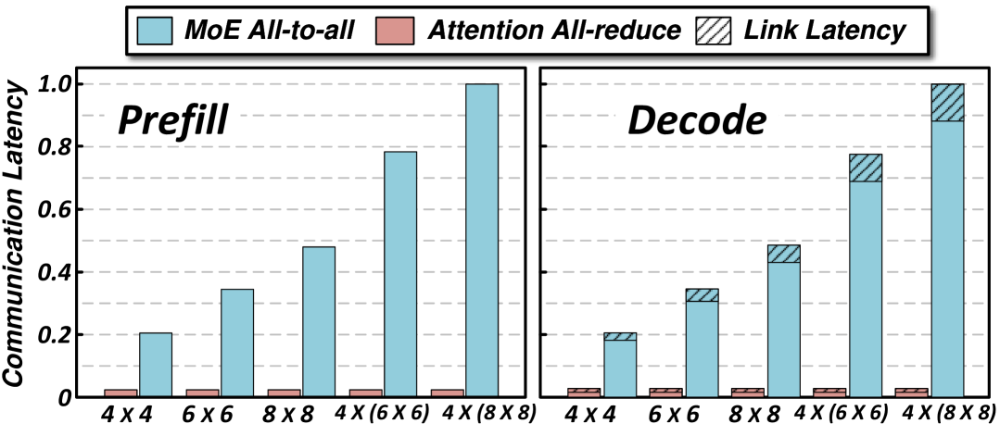
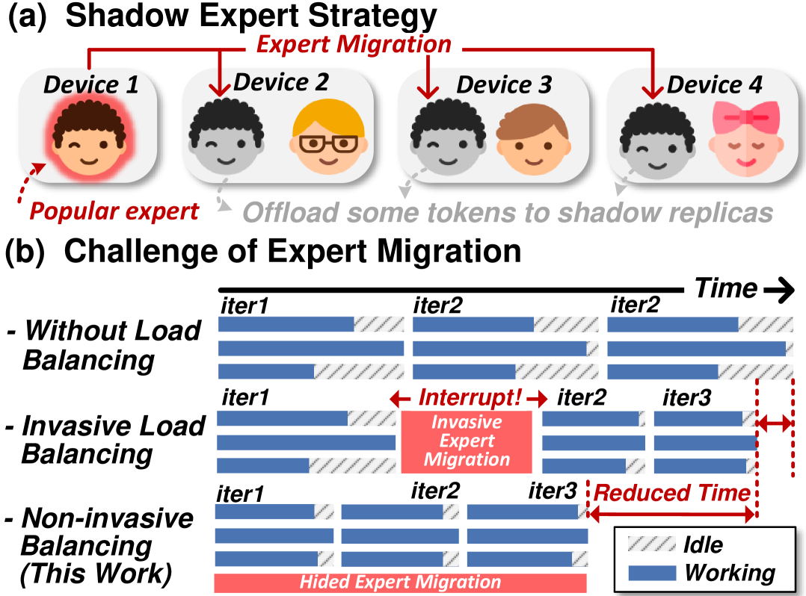
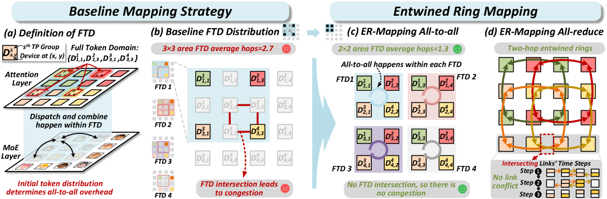
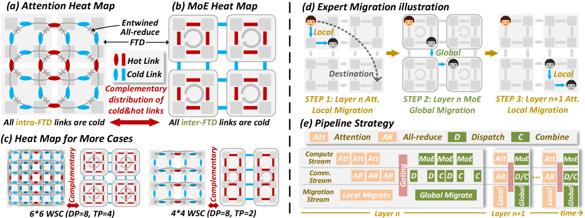
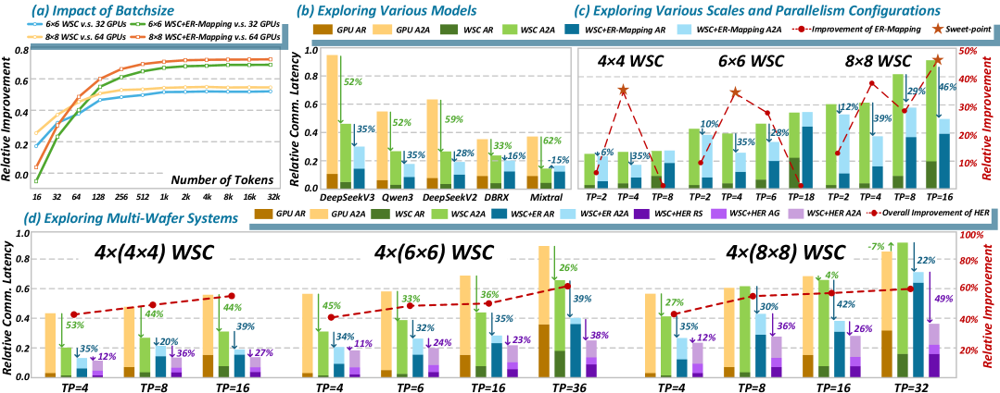
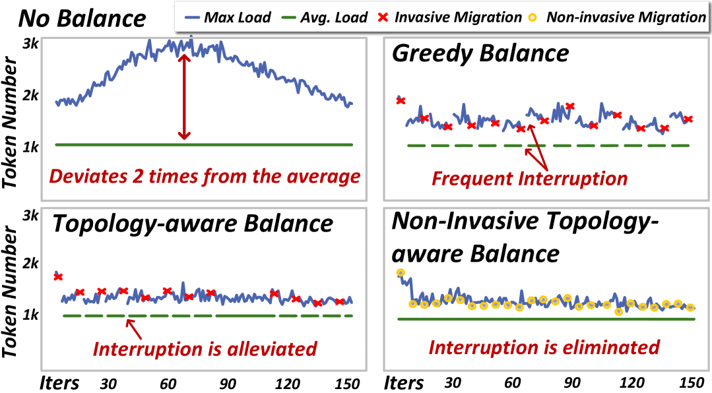
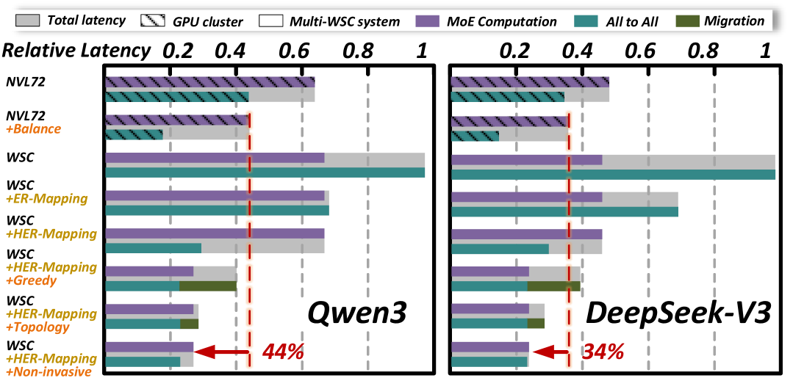

### MoEntwine — 晶圆级计算机上的 MoE 推理拓扑与负载均衡协同优化

```yaml
id: moentwine
name: MoEntwine
full_name: "MoEntwine: Entwined Mapping and Non-Invasive Balancing for MoE Inference on Wafer-Scale Computers"
year: "2025"
org: "清华大学 (HPCA 2026)"
paper_url: "https://arxiv.org/abs/2510.25258"
category: "infra/device"
parent: "—"
motivation: "针对晶圆级计算机(WSC) mesh拓扑下MoE推理的all-to-all通信拥塞与无盘环境专家迁移开销问题，提出拓扑感知映射与非侵入式负载均衡方案，释放WSC上MoE并行推理潜力"
```

#### 📝 一句话总结

MoEntwine 提出 **Entwined Ring Mapping (ER-Mapping)** 与 **Non-Invasive Balancer (NI-Balancer)** 两项协同技术，通过将 TP 组交错编织为紧凑的 Full Token Domain 消除 mesh 网络中心拥塞，并利用通信阶段的冷链路实现零开销专家迁移，在晶圆级计算机上相比 NVL72 实现平均 39% 的 MoE 推理性能提升。

#### 🎯 核心要点

- **目标平台**：Wafer-Scale Computer (WSC)，单片晶圆集成数百 die，die 间通过 2D mesh 拓扑直连，带宽远超传统 GPU 集群但受限于多跳路由
- **核心问题一 — 通信拥塞**：MoE Expert Parallelism 的 all-to-all 通信在 mesh 中心产生严重拥塞，传统 TP 组角落映射导致 Full Token Domain (FTD) 面积大且相互交叉
- **核心问题二 — 专家迁移开销**：WSC 无片上磁盘，动态负载均衡必须通过 mesh 网络迁移专家权重，侵入式迁移中断推理流水线
- **ER-Mapping**：将 TP 组交错编织为相邻排列，使 FTD 从 3×3 缩小为 2×2 且互不交叉，all-to-all 通信距离降低 >50%；代价是 all-reduce 变为 2-hop entwined ring（延迟 ×2 但绝对值小）
- **Hierarchical ER-Mapping (HER-Mapping)**：多晶圆场景下将 all-reduce 拆分为 reduce-scatter + all-gather 两阶段，消除跨晶圆多跳开销
- **NI-Balancer**：利用 all-reduce 阶段 FTD 内链路空闲（冷链路）执行 Local Migration，all-to-all 阶段 FTD 间链路空闲执行 Global Migration，通过 CUDA stream 流水线化实现零开销
- **拓扑感知贪心算法**：基于历史负载预测，选择最热设备的最热门专家，复制到拓扑距离最近的冷设备 shadow slot
- **评估**：基于 ASTRA-sim 2.0 模拟 B200 等效 WSC die，在 DeepSeek-V3/V2、Qwen3、DBRX、Mixtral 上验证，ER-Mapping 最高降低 62% 通信延迟，NI-Balancer 降低 54% 计算延迟，整体比 NVL72 提升 39%

#### 🔬 深入细节


*图 1：晶圆级计算机架构总览。单片晶圆集成数百个 die，die 间通过 2D mesh 拓扑直连，带宽远超传统 NVLink 集群，但多跳路由在中心区域产生严重拥塞。*

**动机与背景：WSC 上 MoE 推理的两大瓶颈。** Mixture-of-Experts (MoE) 模型通过稀疏激活实现参数规模的高效扩展，Expert Parallelism (EP) 将不同专家分布在多个设备上，推理时需要 all-to-all 通信将 token 路由到对应专家设备。在传统 GPU 集群（如 DGX B200）中，节点内设备通过 NVSwitch 全连接，all-to-all 为单跳通信。然而在 WSC 的 2D mesh 拓扑中，远距离设备间的通信必须经过多个中间节点，导致中心链路成为瓶颈。论文通过理论分析证明：当 TP 组按传统方式映射到网格角落时，每个 Full Token Domain（FTD，即持有一个 TP 组全部 token 的最小设备集合）面积为 3×3，且不同 FTD 在中心区域严重交叉，all-to-all 流量在中心链路叠加产生 \(O(n)\) 级拥塞。同时，WSC 没有片上磁盘存储，动态负载均衡所需的专家迁移只能通过已经拥塞的 mesh 网络完成，传统侵入式迁移（暂停推理→迁移→恢复）每次中断相当于 2 个推理迭代的开销。


*图 6：Full Token Domain (FTD) 概念。左：传统角落映射下 FTD 为 3×3 区域且相互交叉；右：ER-Mapping 下 FTD 缩小为 2×2 且互不交叉。*

**核心机制一：Entwined Ring Mapping (ER-Mapping)。** ER-Mapping 的核心洞察是：all-to-all 通信的瓶颈源于 FTD 过大和交叉，而 all-reduce 的延迟天然较低（数据量小）。因此可以牺牲少量 all-reduce 性能来大幅优化 all-to-all。具体做法是将属于不同 TP 组的设备交错编织排列，使得每个 FTD 仅占 2×2 的紧凑区域且互不重叠。在 Attention 层，ER-Mapping 保留 all-gather 操作使每个设备持有完整 KV cache，这样后续 all-to-all 的源和目的都在同一个 2×2 FTD 内，通信距离从多跳降为 1-2 跳。代价是 all-reduce 不再能在连续设备上执行经典 ring，而是形成"entwined ring"——环上相邻节点在物理拓扑上间隔 2 跳，all-reduce 延迟约为原来的 2 倍。但由于 all-reduce 数据量（hidden_size 级别）远小于 all-to-all 数据量（token_count × hidden_size 级别），这一权衡在绝大多数配置下都是有利的。


*图 7：ER-Mapping 将 TP 组交错编织，形成紧凑的 2×2 FTD。右侧展示了 all-to-all 通信路径的显著缩短。*


*图 8：Entwined Ring 上的 all-reduce 操作。环上相邻逻辑节点在物理 mesh 上间隔 2 跳，延迟约为传统 ring 的 2 倍，但绝对值仍远小于 all-to-all。*

对于多晶圆系统，论文进一步提出 **Hierarchical ER-Mapping (HER-Mapping)**：将 all-reduce 拆分为晶圆内 reduce-scatter 和跨晶圆 all-gather 两个阶段。reduce-scatter 在本地 entwined ring 上执行，all-gather 通过晶圆间高速互连完成，避免了跨晶圆多跳 ring 的长延迟。HER-Mapping 在所有并行配置下都能稳定带来性能提升，最高达 62%。

> 💡 **关键洞察**：ER-Mapping 的本质是用 all-reduce 的"富余带宽"换取 all-to-all 的"拓扑距离"——在 MoE 推理中 all-to-all 数据量通常是 all-reduce 的 \(K\)（激活专家数）倍，因此即使 all-reduce 延迟翻倍，总通信时间仍大幅下降。

**核心机制二：Non-Invasive Balancer (NI-Balancer)。** MoE 推理中 gating 函数的动态路由导致专家负载不均衡，最热设备负载可达平均值的 2 倍。传统方法通过复制热门专家到空闲设备来均衡负载，但迁移专家权重（数百 MB）需要占用网络带宽并中断推理流水线。NI-Balancer 的核心洞察是 **冷热链路的时间互补性**：

- **All-Reduce 阶段**：FTD 内部链路繁忙，但 FTD 之间的链路空闲 → 利用空闲链路执行 **Global Migration**（跨 FTD 的专家复制）
- **All-to-All 阶段**：FTD 之间链路繁忙，但 FTD 内部链路空闲 → 利用空闲链路执行 **Local Migration**（FTD 内的专家复制）


*图 11：NI-Balancer 利用通信阶段的冷链路执行专家迁移，通过 CUDA stream 流水线化实现零开销。Compute、Communication、Migration 三个 stream 并行执行。*

迁移操作通过独立的 CUDA stream 与计算/通信并行执行，完全不阻塞推理流水线。论文还利用了专家负载的 **时间局部性**——在固定场景下负载比例在 warm-up 后趋于稳定，混合场景下也呈现缓慢变化的趋势——通过历史窗口预测未来负载，仅在累积不均衡超过阈值 \(\alpha\) 时触发迁移，避免频繁无效操作。

```python
# NI-Balancer 拓扑感知贪心算法（简化伪代码）
def topology_aware_balance(devices, load_history, mesh_topology):
    predicted_load = predict_from_history(load_history)  # 时间局部性预测
    
    while max(predicted_load) / avg(predicted_load) > 1 + alpha:
        # 找到最热设备上最热门的专家
        hot_device = argmax(predicted_load)
        hot_expert = most_popular_expert(hot_device)
        
        # 在拓扑距离最近的冷设备上找到空闲 shadow slot
        cold_devices = sorted_by_topology_distance(
            [d for d in devices if has_shadow_slot(d)], 
            center=hot_device
        )
        target = cold_devices[0]
        
        # 调度迁移（在下一个冷链路窗口执行）
        if same_ftd(hot_device, target):
            schedule_local_migration(hot_expert, target)   # A2A阶段执行
        else:
            schedule_global_migration(hot_expert, target)  # AR阶段执行
        
        # 更新预测负载
        predicted_load[hot_device] -= expert_load(hot_expert) * redistribution_ratio
        predicted_load[target] += expert_load(hot_expert) * redistribution_ratio
```

**实验验证与消融分析。** 论文基于 ASTRA-sim 2.0 构建了精确的 WSC 模拟器，每个 die 等效于 NVIDIA B200 GPU（2250 TFLOPS BF16、180GB HBM、8TB/s 带宽），die 间互连带宽 900GB/s。在 DeepSeek-V3（671B, 256 experts）、DeepSeek-V2（236B）、Qwen3（235B）、DBRX（132B）、Mixtral-8x22B（141B）五个主流 MoE 模型上进行了全面评估。


*图 13：ER-Mapping 在不同模型、规模、并行度下的通信延迟对比。WSC 相比 DGX 平均降低 56% 通信延迟，ER-Mapping 进一步带来最高 35% 的额外提升。*

ER-Mapping 的通信优化效果随激活专家数增加而增强（all-to-all 占比更高），在 DeepSeek-V3（激活 8/256 experts）上效果最为显著。对于仅激活 2 个专家的 Mixtral，all-to-all 占比较小，ER-Mapping 的增益有限。HER-Mapping 在多晶圆场景下表现稳定，所有配置均有提升，最高达 62%。


*图 15：运行时专家负载轨迹。无均衡时最大负载偏离均值 2×；贪心均衡频繁中断推理；拓扑感知均衡减少中断；非侵入式均衡完全消除中断。*

NI-Balancer 的消融实验显示：无负载均衡时最大设备负载偏离均值 2 倍；基线贪心均衡（EPLB）平均每 10 次迭代中断一次，每次中断等效 2 次迭代开销；在混合场景的 Decode-only 模式下，侵入式迁移开销高达 45%。NI-Balancer 完全消除迁移开销，MoE 计算延迟降低最高 54%，all-to-all 通信延迟降低 23%。


*图 17：端到端消融分析。以 NVL72 为基线，逐步叠加 ER-Mapping → HER-Mapping → 负载均衡 → 拓扑感知 → 非侵入式，最终 WSC 相比 NVL72 实现平均 39% 的每设备 MoE 性能提升。*

端到端消融以 NVIDIA NVL72（72 设备全连接超级节点）为基线，WSC 使用 4 块 8×8 晶圆（256 设备）。NVL72 的 EP=72 导致每设备多专家、内存访问主导执行时间，负载均衡增益仅 26%。WSC 的 EP=256 实现单专家每设备，但原始 mesh 拓扑下 all-to-all 延迟远超计算时间。ER-Mapping 降低 30% all-to-all 延迟，HER-Mapping 将降幅扩大到 71%，消除通信瓶颈。叠加 NI-Balancer 后计算和通信分别再降 49% 和 20%，最终 WSC 相比 NVL72 实现平均 **39%** 的每设备 MoE 推理性能提升。

> ⚠️ **注意**：ER-Mapping 的收益依赖于 all-to-all/all-reduce 的数据量比值。对于激活专家数极少（如 Mixtral 的 2/8）的模型，all-to-all 占比小，ER-Mapping 的权衡可能不利。论文建议此类模型考虑 ESP（Expert Sharding Parallelism）替代方案。

#### 🧪 练习题

```yaml
question: "MoEntwine 的 ER-Mapping 将 TP 组交错编织排列的核心收益是什么？"
options:
  - "降低 all-reduce 通信延迟"
  - "将 Full Token Domain (FTD) 从 3×3 缩小为 2×2 且互不交叉，大幅减少 all-to-all 通信距离"
  - "增加每个设备上的专家数量以提高计算利用率"
  - "消除 MoE gating 函数带来的负载不均衡"
answer: 1
explain: "ER-Mapping 通过交错编织 TP 组使 FTD 紧凑化（2×2）且互不重叠，all-to-all 通信被限制在小范围内，距离从多跳降为 1-2 跳。代价是 all-reduce 延迟约翻倍，但由于 all-reduce 数据量远小于 all-to-all，总通信时间仍大幅下降。"
```