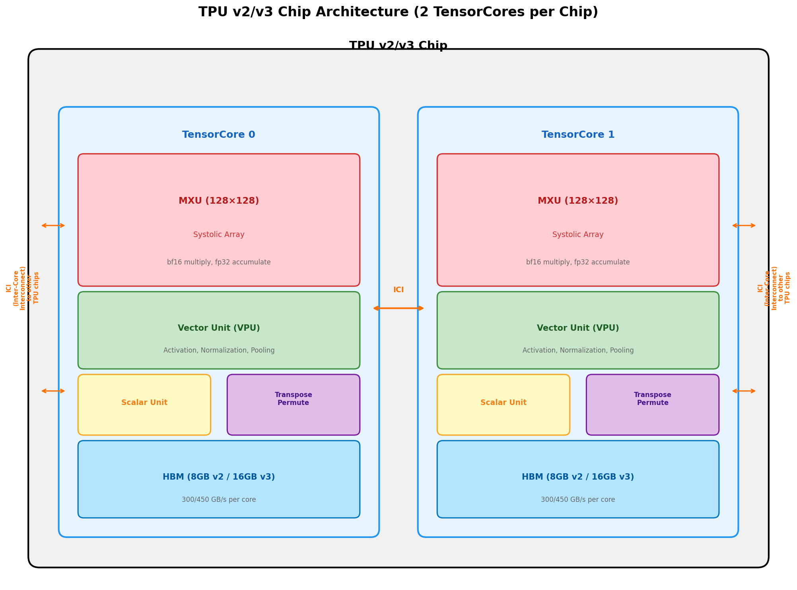
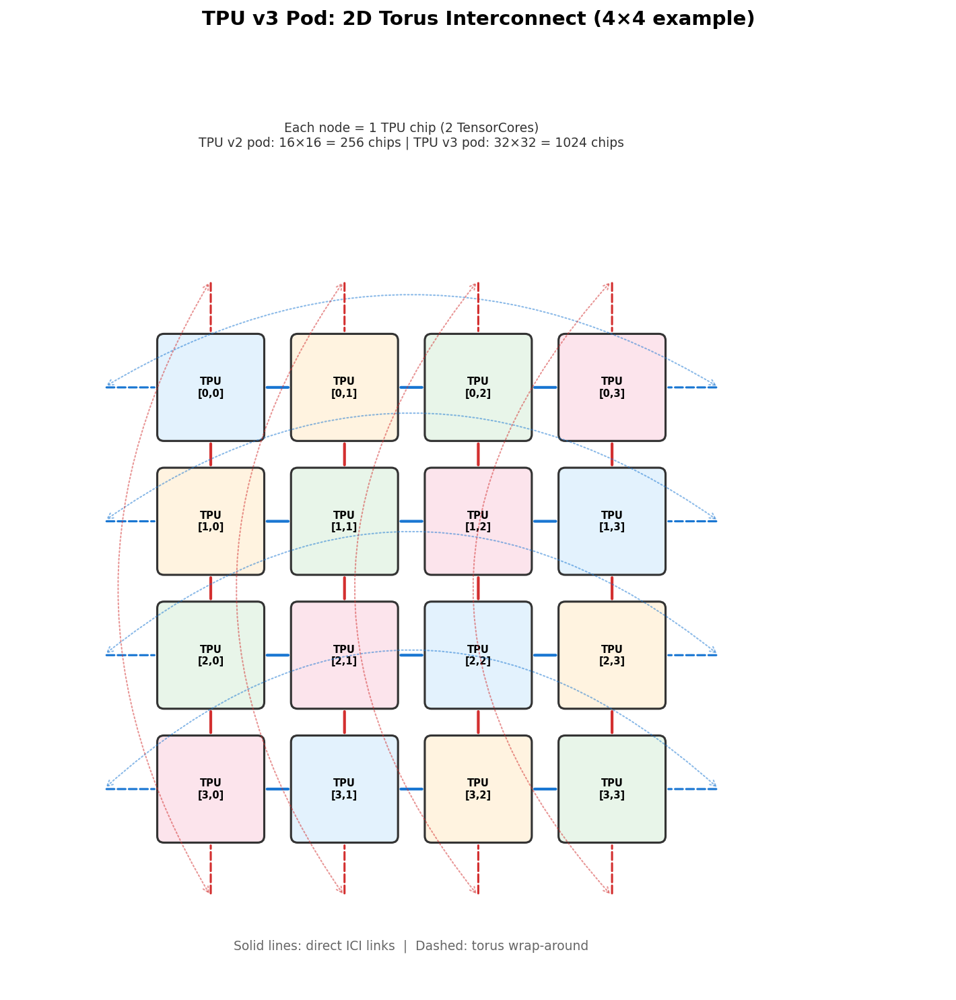
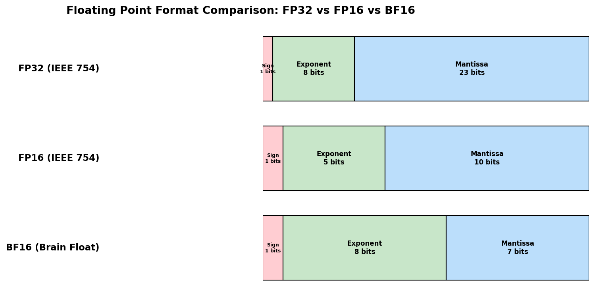

### TPU v2/v3：面向深度学习训练的领域专用超级计算机

```yaml
id: tpu_v2v3
name: TPU v2/v3
full_name: TPU v2/v3 — 面向深度学习训练的领域专用超级计算机
year: '2020'
org: Google
paper_url: https://dl.acm.org/doi/10.1145/3360307
category: accelerator
parent: —
motivation: 设计领域专用ASIC芯片及超级计算机系统，以bfloat16脉动阵列+2D环面互连实现DNN训练的高性能与高能效
```

#### 📝 一句话总结

Google 设计了 TPU v2/v3 训练芯片与 Pod 级超级计算机系统——每颗芯片包含 2 个 TensorCore（各含 128×128 bfloat16 脉动阵列 MXU），通过高带宽 ICI 2D 环面互连组成最大 1024 芯片的 Pod（TPU v3 Pod 峰值 >100 PFLOPS），在 ResNet-50、Transformer 等主流训练任务上相比同期 NVIDIA V100 GPU 集群实现 **1.2×–1.9× 性能/瓦特优势**，验证了领域专用架构（DSA）在大规模 DNN 训练中的可行性与优越性。

#### 🎯 核心要点

- **领域专用架构（DSA）理念**：放弃通用处理器的复杂分支预测、乱序执行等机制，将晶体管预算集中在矩阵乘法单元（MXU）上，以 128×128 脉动阵列实现极高的算力密度
- **bfloat16 数值格式**：保留 FP32 的 8 位指数（动态范围不变），截断尾数至 7 位，在几乎不影响训练收敛性的前提下将算力翻倍、内存减半
- **TensorCore 架构**：每颗 TPU 芯片包含 2 个 TensorCore，每个 TensorCore 含 128×128 MXU（bf16 乘 + fp32 累加）、向量处理单元（VPU）、标量单元和转置/置换单元
- **TPU v2**：45 TFLOPS（bf16），16 GB HBM，600 GB/s 内存带宽；**TPU v3**：123 TFLOPS（bf16），32 GB HBM，900 GB/s 内存带宽，液冷散热
- **2D 环面互连（ICI）**：芯片间通过 Inter-Core Interconnect 组成 2D 环面拓扑，支持高效的 AllReduce 等集合通信；TPU v2 Pod 256 芯片（11.5 PFLOPS），TPU v3 Pod 1024 芯片（>100 PFLOPS）
- **XLA 编译器**：将 TensorFlow 计算图编译为 TPU 指令，自动进行算子融合、内存布局优化和通信调度
- **数据并行 + 模型并行**：支持灵活的并行策略，通过 ICI 2D 环面实现高效的梯度同步和激活值通信
- **性能对比**：在 6 个代表性 DNN 训练任务上，TPU v3 Pod（1024 芯片）相比等规模 V100 GPU 集群，性能/瓦特优势约 1.2×–1.9×

#### 🔬 深入细节

##### 核心架构图


*图 1：TPU v2/v3 芯片架构。每颗芯片包含 2 个 TensorCore，各自拥有独立的 128×128 MXU、向量单元、标量单元和 HBM 存储。芯片间通过 ICI（Inter-Core Interconnect）互连。*


*图 2：TPU Pod 的 2D 环面互连拓扑示意（4×4 简化示例）。实际 TPU v2 Pod 为 16×16=256 芯片，TPU v3 Pod 为 32×32=1024 芯片。每条 ICI 链路提供高带宽、低延迟的芯片间通信。*


*图 3：FP32、FP16 与 BF16（Brain Floating Point）的位宽对比。BF16 保留 FP32 的 8 位指数（相同动态范围），仅截断尾数至 7 位，是 TPU 训练的核心数值格式。*

##### 算法伪代码

```python
# TPU v2/v3 上的分布式 DNN 训练伪代码（数据并行 + AllReduce）

# ========== 系统初始化 ==========
num_chips = 1024                    # TPU v3 Pod
cores_per_chip = 2                  # 每芯片 2 个 TensorCore
total_cores = num_chips * cores_per_chip  # 2048 个 TensorCore

# XLA 编译器将 TensorFlow 计算图编译为 TPU 指令
compiled_program = xla_compile(
    tf_graph,
    target='tpu_v3',
    optimizations=['op_fusion', 'layout_assignment', 'memory_planning']
)

# ========== 数据并行训练主循环 ==========
# 每个 TensorCore 持有完整模型副本，处理不同数据分片
for epoch in range(num_epochs):
    for global_batch in dataset:
        # 将全局 batch 分片到所有 core
        local_batch = global_batch[core_id::total_cores]  # 每 core 一个 micro-batch
        
        # ---- 前向传播（在单个 TensorCore 上） ----
        for layer in model.layers:
            if layer.type == 'matmul' or layer.type == 'conv':
                # MXU 执行：bf16 输入 × bf16 权重 → fp32 累加
                # 128×128 脉动阵列，每周期输出 128×128 个 fp32 部分和
                activations = mxu_matmul_bf16(input_bf16, weight_bf16)  # fp32 output
                activations = cast_to_bf16(activations)  # 截断回 bf16 存储
            elif layer.type in ['relu', 'layernorm', 'softmax']:
                # VPU（向量处理单元）执行非线性/归一化操作
                activations = vpu_elementwise(activations, op=layer.type)
        
        loss = compute_loss(activations, labels)
        
        # ---- 反向传播 ----
        gradients = backprop(loss, model)  # 同样利用 MXU 做梯度矩阵乘
        
        # ---- AllReduce 梯度同步（通过 ICI 2D 环面） ----
        # 2D 环面上的高效 AllReduce：先沿行 reduce-scatter，再沿列 all-gather
        # ICI 带宽：TPU v3 每链路约 656 Gbps
        synced_gradients = ici_allreduce_2d_torus(gradients)
        
        # ---- 权重更新 ----
        # fp32 master weights 用于精确更新
        for param, grad in zip(model.parameters(), synced_gradients):
            param_fp32 -= learning_rate * grad  # fp32 精度更新
            param_bf16 = cast_to_bf16(param_fp32)  # 前向/反向用 bf16 副本

# ========== MXU 脉动阵列核心操作 ==========
def mxu_matmul_bf16(A_bf16, B_bf16):
    """
    128×128 脉动阵列矩阵乘法
    - 输入：A[M,K] 和 B[K,N]，均为 bf16
    - 输出：C[M,N]，fp32
    - 分块：将大矩阵切分为 128×128 的 tile
    """
    C_fp32 = zeros(M, N)
    for m_tile in range(0, M, 128):
        for n_tile in range(0, N, 128):
            for k_tile in range(0, K, 128):
                # 每个 128×128 tile 送入脉动阵列
                # 数据从左侧和顶部流入，结果在阵列内部累加
                # 每周期：128×128 = 16384 次 bf16 乘加操作
                C_fp32[m_tile:m_tile+128, n_tile:n_tile+128] += \
                    systolic_128x128(
                        A_bf16[m_tile:m_tile+128, k_tile:k_tile+128],
                        B_bf16[k_tile:k_tile+128, n_tile:n_tile+128]
                    )
    return C_fp32
```

##### 动机与背景

2017 年 Google 发布了 TPU v1（推理专用），在数据中心推理任务上展现了领域专用架构（DSA）相比通用 CPU/GPU 的巨大优势。然而 **DNN 训练**比推理面临更大的挑战：

1. **算力需求呈指数增长**：2012–2018 年间，顶级 AI 模型的训练算力需求每 3.4 个月翻一倍（OpenAI 统计），远超摩尔定律速度。单芯片算力增长无法满足需求，必须构建**超级计算机级别**的训练系统。
2. **训练需要反向传播**：推理只需前向计算，训练还需反向传播梯度和权重更新，对内存容量和带宽的需求约为推理的 3 倍。
3. **数值精度要求**：推理可用 INT8 甚至更低精度，训练则需要足够的动态范围以保证梯度不溢出/下溢。
4. **分布式通信**：大规模训练需要高效的芯片间通信（梯度同步），传统以太网/InfiniBand 的延迟和带宽成为瓶颈。

> 💡 **核心洞察**：DNN 训练的计算本质是大量矩阵乘法（占 >90% 计算量），且对尾数精度的容忍度远高于科学计算。这使得**用 bfloat16 脉动阵列替代通用 FP64/FP32 计算单元**成为可能，在不影响训练收敛的前提下获得数量级的算力密度和能效提升。

##### bfloat16 数值格式

bfloat16（Brain Floating Point 16）是 Google 为 TPU 训练设计的 16 位浮点格式：

| 格式 | 总位宽 | 符号位 | 指数位 | 尾数位 | 动态范围 | 精度 |
|------|--------|--------|--------|--------|----------|------|
| FP32 | 32 | 1 | 8 | 23 | ±3.4×10³⁸ | ~7 位十进制 |
| FP16 | 16 | 1 | 5 | 10 | ±6.5×10⁴ | ~3 位十进制 |
| **BF16** | **16** | **1** | **8** | **7** | **±3.4×10³⁸** | **~2 位十进制** |

BF16 的关键设计选择：
- **保留 FP32 的 8 位指数**：动态范围与 FP32 完全相同，避免了 FP16 训练中常见的梯度溢出/下溢问题（FP16 的 5 位指数仅覆盖 ±6.5×10⁴）
- **截断尾数至 7 位**：精度损失对 DNN 训练影响极小，因为随机梯度本身就有噪声
- **FP32 到 BF16 的转换极其简单**：只需截断低 16 位尾数（或加舍入），无需重新编码

> ⚠️ **关键设计决策**：TPU 的 MXU 使用 **bf16 输入乘法 + fp32 累加**。即两个 bf16 操作数相乘后，结果在 fp32 精度下累加到输出矩阵中。这确保了矩阵乘法的中间结果不会丢失精度，同时输入/权重的存储和带宽需求减半。

##### TensorCore 微架构

每颗 TPU v2/v3 芯片包含 **2 个 TensorCore**，每个 TensorCore 是一个完整的计算核心：

**矩阵乘法单元（MXU）**：
- 128×128 二维脉动阵列（systolic array）
- 每周期执行 128×128 = 16,384 次乘加操作
- bf16 输入乘法，fp32 累加
- TPU v2 MXU 时钟频率约 700 MHz → 每 MXU 约 22.5 TFLOPS
- TPU v3 MXU 时钟频率约 940 MHz → 每 MXU 约 30.8 TFLOPS（加上其他优化达 ~61.5 TFLOPS/core）

**脉动阵列工作原理**：数据从阵列的左侧（激活值）和顶部（权重）流入，每个处理单元（PE）执行一次乘加操作后将数据传递给相邻 PE。整个阵列形成一个流水线，一旦填满后每周期输出一行结果。相比 GPU 的 SIMT 架构，脉动阵列的优势在于：
- **极高的数据复用率**：每个权重被 128 个激活值复用，每个激活值被 128 个权重复用
- **极低的控制开销**：无需复杂的指令调度，数据流由物理布线决定
- **高能效**：大部分能量用于计算而非数据搬运

**向量处理单元（VPU）**：
- 执行逐元素操作：激活函数（ReLU、GELU）、归一化（BatchNorm、LayerNorm）、Softmax、池化等
- 支持 bf16 和 fp32 运算
- 带宽与 MXU 输出匹配，确保流水线不被阻塞

**标量单元**：处理控制流、地址计算等标量操作

**转置/置换单元**：支持矩阵转置和数据重排，用于反向传播中的梯度计算（需要权重矩阵的转置）

##### 芯片级规格对比

| 指标 | TPU v2 | TPU v3 | NVIDIA V100 |
|------|--------|--------|-------------|
| 峰值算力（bf16/fp16） | 45 TFLOPS | 123 TFLOPS | 125 TFLOPS (fp16 Tensor Core) |
| 峰值算力（fp32） | 22.5 TFLOPS | 61.5 TFLOPS | 15.7 TFLOPS |
| HBM 容量 | 16 GB | 32 GB | 32 GB (V100-32GB) |
| HBM 带宽 | 600 GB/s | 900 GB/s | 900 GB/s |
| TDP | ~280 W | ~450 W（液冷） | 300 W |
| 制程 | 16nm | 16nm | 12nm |
| 芯片面积 | ~625 mm² | ~648 mm² | 815 mm² |
| 互连 | ICI (专用) | ICI (专用) | NVLink 2.0 |

> 💡 **关键对比**：虽然 TPU v3 和 V100 的峰值 fp16/bf16 算力相近（~123–125 TFLOPS），但 TPU 的优势在于：(1) ICI 互连在 Pod 规模下的通信效率远高于 InfiniBand；(2) 脉动阵列的实际利用率（通常 >40%）高于 GPU Tensor Core（通常 30%–40%）；(3) XLA 编译器的全图优化减少了内存搬运开销。

##### Pod 级超级计算机系统

TPU v2/v3 的核心创新不仅在芯片层面，更在于**将数百到上千颗芯片组成一台超级计算机**：

**2D 环面互连（ICI - Inter-Core Interconnect）**：
- 每颗 TPU 芯片有 4 个 ICI 端口（上下左右），直接连接到相邻芯片
- 无需外部交换机——芯片间直接互连，延迟极低（~数百纳秒）
- TPU v2 Pod：16×16 = 256 芯片，ICI 每链路约 496 Gbps
- TPU v3 Pod：32×32 = 1024 芯片，ICI 每链路约 656 Gbps
- 环面拓扑的边缘芯片通过 wrap-around 链路连接到对侧，确保任意两芯片间的最大跳数为 N/2

**Pod 级性能**：

| 系统 | 芯片数 | 峰值算力 | 总 HBM | 总 HBM 带宽 |
|------|--------|----------|--------|-------------|
| TPU v2 Pod | 256 | 11.5 PFLOPS | 4 TB | 153.6 TB/s |
| TPU v3 Pod | 1024 | 126 PFLOPS | 32 TB | 921.6 TB/s |

**AllReduce 在 2D 环面上的实现**：
- 利用环面拓扑的对称性，将 AllReduce 分解为两个维度上的独立操作
- 沿行方向执行 Reduce-Scatter，沿列方向执行 All-Gather（或反过来）
- 通信量为 $2 \cdot \frac{N-1}{N} \cdot D$（$N$ 为芯片数，$D$ 为数据量），与最优理论值匹配
- 由于 ICI 是专用硬件互连（非通用网络），AllReduce 的延迟和带宽远优于基于 InfiniBand 的 GPU 集群

##### 软件栈：XLA 编译器

XLA（Accelerated Linear Algebra）是 TPU 的核心编译器，负责将 TensorFlow/JAX 计算图编译为 TPU 机器指令：

1. **算子融合（Op Fusion）**：将多个连续的逐元素操作融合为一个内核，减少 HBM 读写次数。例如 `MatMul → BiasAdd → ReLU` 融合为单个操作
2. **内存布局优化（Layout Assignment）**：自动选择最优的数据布局（如 NHWC vs NCHW），使 MXU 的 128×128 tile 对齐
3. **通信调度**：自动插入 ICI 通信操作，将计算与通信重叠（overlap）
4. **内存规划**：在有限的 HBM 容量内优化张量的生命周期和复用

##### 训练性能评估

论文在 6 个代表性 DNN 训练任务上进行了详细评估：

| 模型 | 任务 | TPU v3 Pod (1024 chips) | 等规模 GPU 集群 | TPU 优势 |
|------|------|------------------------|----------------|----------|
| ResNet-50 | ImageNet 分类 | ~2 min/epoch | ~3 min/epoch | 1.5× |
| Transformer (大) | WMT 翻译 | 显著优势 | — | ~1.3× |
| SSD | 目标检测 | — | — | ~1.2× |
| Mask R-CNN | 实例分割 | — | — | ~1.4× |
| GNMT | 机器翻译 | — | — | ~1.3× |
| AmoebaNet | NAS | — | — | ~1.9× |

**关键发现**：
- **矩阵乘法密集型模型受益最大**：如 AmoebaNet（大量卷积）和 Transformer（大量注意力矩阵乘），TPU 的 MXU 利用率高
- **通信密集型模型优势更明显**：ICI 2D 环面的通信效率远高于 InfiniBand，在需要频繁 AllReduce 的大规模数据并行中优势显著
- **小 batch size 模型优势较小**：当 batch size 不足以填满 MXU 的 128×128 tile 时，利用率下降

##### 散热与能效

TPU v3 的一个重要工程创新是**液冷散热**：
- TPU v2 使用传统风冷，TDP 约 280W
- TPU v3 由于算力提升至 123 TFLOPS，TDP 达 ~450W，超出风冷能力
- 采用直接液冷（direct liquid cooling），冷却液直接流过芯片散热器
- 液冷使得数据中心的散热效率提升约 30%，PUE（Power Usage Effectiveness）更低

##### 与传统方法的对比

| 维度 | TPU v2/v3 | NVIDIA V100 + InfiniBand | 传统 CPU 集群 |
|------|-----------|--------------------------|--------------|
| 计算单元 | 128×128 脉动阵列 (MXU) | Tensor Core (4×4×4) | AVX-512 SIMD |
| 数值格式 | bf16 乘 + fp32 累加 | fp16 乘 + fp32 累加 | fp32/fp64 |
| 芯片间互连 | ICI 2D 环面（专用） | NVLink + InfiniBand | 以太网/InfiniBand |
| 编程模型 | XLA (图编译) | CUDA + NCCL | MPI + OpenMP |
| 扩展方式 | Pod（紧耦合） | 集群（松耦合） | 集群 |
| 能效 (TFLOPS/W) | ~0.27 (v3) | ~0.21 (V100) | ~0.01 |
| 最大系统规模 | 1024 芯片/Pod | 数千 GPU（需交换机） | 数万节点 |

TPU 的核心架构优势在于**端到端的领域专用设计**：从数值格式（bf16）、计算单元（脉动阵列）、互连拓扑（2D 环面）到编译器（XLA），每一层都针对 DNN 训练进行了深度优化，而非在通用硬件上叠加加速器。

#### 🧪 练习题

```yaml
question: "TPU v2/v3 使用的 bfloat16 (bf16) 数值格式与 IEEE FP16 相比，最关键的设计差异是什么？"
options:
  - "bf16 的总位宽为 8 位，比 FP16 的 16 位更短"
  - "bf16 保留了 FP32 的 8 位指数（相同动态范围），而 FP16 仅有 5 位指数"
  - "bf16 使用定点表示而非浮点表示"
  - "bf16 的尾数位数比 FP16 更多，精度更高"
answer: 1
explain: "bfloat16 保留了 FP32 的 8 位指数位（动态范围 ±3.4×10³⁸），仅将尾数从 23 位截断至 7 位；而 IEEE FP16 使用 5 位指数（动态范围仅 ±6.5×10⁴）和 10 位尾数。bf16 的设计优先保证动态范围，避免训练中常见的梯度溢出/下溢问题，这是其最关键的设计差异。"
```