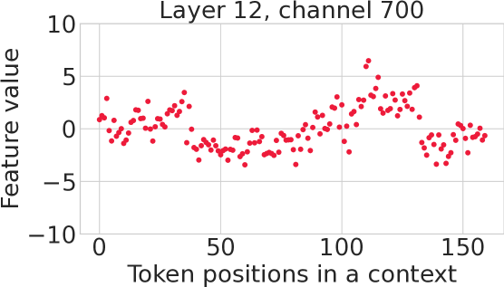
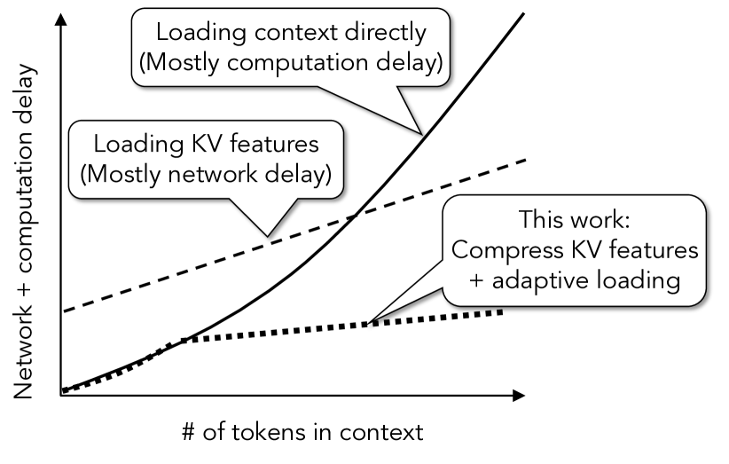
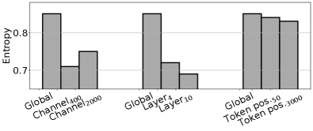
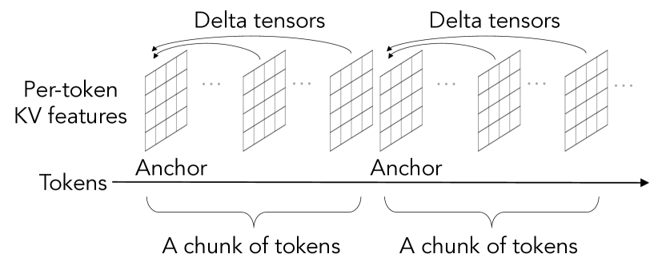
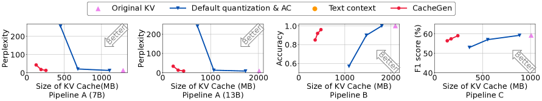
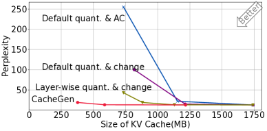

### CacheGen: KV Cache 流式压缩加速长上下文推理

```yaml
id: cachegen
name: CacheGen
full_name: "CacheGen: KV Cache Compression and Streaming for Fast Large Language Model Serving"
year: 2024
org: University of Chicago
paper_url: "https://arxiv.org/abs/2310.07240"
category: kv_cache
parent: "—"
motivation: "通过流式传输与张量编码降低TTFT"
```

#### 📝 一句话总结

CacheGen 将 LLM 的 KV Cache 压缩为紧凑比特流（而非直接传输原始张量），通过**差分编码 + 层级量化 + 通道级算术编码**三步流水线实现 3.5–4.3× 压缩，配合自适应加载控制器将 Time-To-First-Token (TTFT) 降低 2.7–3.2×，且生成质量损失不超过 0.2%。

#### 🎯 核心要点

- **KV Cache 编码器**：三步压缩流水线——差分编码（Delta Encoding）→ 层级量化（Layer-wise Quantization）→ 通道级算术编码（Channel-wise Arithmetic Coding）
- **三个关键 Insight 驱动设计**：
  - Insight 1：相邻 token 的 KV 值具有高度局部性（差分后信息熵更低）
  - Insight 2：同一 channel-layer 组合内的 KV 值共享相似概率分布（可用通道级先验做 AC）
  - Insight 3：浅层 KV 特征对量化更敏感（浅层分配更多比特）
- **层级量化策略**：将 Transformer 层分为三组（浅 1/3、中 1/3、深 1/3），分别使用 \(x\)、\(y\)、\(z\) bit 量化（\(x \geq y \geq z\)），锚点 token 保留 8-bit 高精度
- **上下文加载控制器**：根据 TTFT 预算和网络带宽，动态选择压缩级别或直接传输原始文本
- **评估覆盖 3 个管线**：Wikitext（Perplexity）、LongChat（Accuracy）、Natural Questions（F1 Score），涵盖 7B–13B 模型
- **端到端效果**：KV Cache 压缩 3.5–4.3×，TTFT 降低 2.7–3.2×，生成质量损失 < 0.2%

#### 🔬 深入细节

##### 系统架构总览


*图：CacheGen 系统架构。左侧为离线 KV 编码器，将 KV Cache 压缩为多个不同压缩级别的比特流；右侧为在线加载控制器，根据 TTFT 预算选择最优压缩级别进行流式传输和解码。*

CacheGen 的核心思路是：**不传输原始 KV 张量，而是将其编码为紧凑比特流**。与 token 剪枝方法（如 Scissorhands、H₂O）不同，CacheGen 不丢弃任何 token，而是通过信息论编码技术压缩全部 KV 特征，在解码端无损或近无损恢复。

##### KV Cache 编码流水线

KV Cache 的形状为 \([N, l, c]\)，其中 \(N\) 为 token 数、\(l\) 为层数、\(c\) 为通道数。CacheGen 的三步压缩流程如下：

```
输入: KV Cache 张量 [N, l, c] (float16)
│
├─ Step 1: 差分编码 (Delta Encoding)
│   ├─ 将 token 分为大小为 S 的 chunk
│   ├─ 每个 chunk 的第一个 token 为锚点 (anchor)
│   └─ 其余 token 存储与前一 token 的差值: δ_i = KV_i - KV_{i-1}
│
├─ Step 2: 层级量化 (Layer-wise Quantization)
│   ├─ 浅层 1/3: x-bit 量化 (高精度)
│   ├─ 中层 1/3: y-bit 量化
│   ├─ 深层 1/3: z-bit 量化 (低精度)
│   └─ 锚点 token: 统一 8-bit 量化
│
├─ Step 3: 通道级算术编码 (Channel-wise AC)
│   ├─ 为每个 (layer, channel) 组合维护概率分布
│   ├─ 利用同通道 token 间分布一致性
│   └─ 仅存储 l×c 个分布 (而非 N×l×c)
│
输出: 紧凑比特流 + 概率分布表
```

##### 动机与背景

在 RAG（检索增强生成）和长上下文对话等场景中，LLM 需要处理数千到数万 token 的上下文。为了避免重复计算，系统通常会预先缓存上下文的 KV Cache 并在用户查询到达时加载。然而，KV Cache 的体积随上下文长度线性增长——例如 Llama-13B 处理 10K token 的上下文会产生约 **10.2 GB** 的 KV Cache（FP16 格式）。


*图：不同 LLM 的 KV Cache 大小随输入 token 长度的增长趋势。即使是 7B 模型，10K token 也需要数 GB 存储。*

传输如此大的张量会导致严重的网络延迟，成为 TTFT 的瓶颈。传统方法要么剪枝 token（需要知道 query，无法离线预处理），要么使用更小的模型（牺牲质量），都不理想。

> 💡 **关键洞察**：KV Cache 虽然体积大，但其内部存在大量可利用的统计冗余——相邻 token 间的 KV 值高度相似，同一通道内的值服从相似分布。CacheGen 正是利用这些冗余实现高效压缩。

##### 核心机制详解

**Step 1: 差分编码——利用 token 局部性**

CacheGen 发现相邻 token 的 KV 特征值高度相关（Insight 1）。直觉上，相邻 token 在同一文档中往往语义相近，其 KV 表示自然相似。因此，存储差分值 \(\delta_i = \text{KV}_i - \text{KV}_{i-1}\) 比存储原始值的信息熵更低。

具体实现中，token 被分为大小为 \(S\) 的 chunk。每个 chunk 的第一个 token 作为**锚点（anchor）**，存储完整值；其余 token 仅存储与前一 token 的差值。这样做的好处是：
1. 差分值的分布更集中在零附近，有利于后续的算术编码
2. chunk 化设计使得解码可以并行进行

**Step 2: 层级量化——浅层多 bit、深层少 bit**


*图：不同层组的量化比特数对 LLM 输出质量的影响。浅层（前 1/3）对量化最敏感，深层（后 1/3）容忍度最高。*

CacheGen 的关键发现是：**浅层 KV 特征对量化损失更敏感**（Insight 3）。直觉上，浅层嵌入了更原始的语义信息，其精度损失会逐层传播并放大；而深层提取的是高层结构，对细微精度变化更鲁棒。

基于此，CacheGen 将 Transformer 的 \(l\) 层分为三组，分别应用不同精度的量化：

$$\text{Quantization bits} = \begin{cases} x \text{ bits} & \text{浅层 (layer 1 to } l/3\text{)} \\ y \text{ bits} & \text{中层 (layer } l/3 \text{ to } 2l/3\text{)} \\ z \text{ bits} & \text{深层 (layer } 2l/3 \text{ to } l\text{)} \end{cases}$$

其中 \(x \geq y \geq z\)。例如，典型配置为 \((x, y, z) = (4, 3, 2)\)。锚点 token 始终使用 8-bit 量化以保持差分基准的精度。

**Step 3: 通道级算术编码——利用分布一致性**


*图：同一 (layer, channel) 组合内，不同 token 的 KV 值分布高度一致（左），而不同 channel 间分布差异显著（右）。*

算术编码（AC）是一种接近信息熵下界的无损压缩技术，其效果取决于概率模型的准确性。CacheGen 发现：**同一 channel-layer 组合内的 KV 值跨 token 共享相似的概率分布**（Insight 2），但不同 channel 间分布差异很大。

因此，CacheGen 为每个 \((\text{layer}, \text{channel})\) 组合维护一个概率分布，用于算术编码。这样只需存储 \(l \times c\) 个分布（而非 \(N \times l \times c\)），存储开销可忽略不计（因为 \(N\) 通常为数千）。

> ⚠️ **注意**：差分编码和算术编码本身是**无损**的，信息损失仅来自量化步骤。这意味着 CacheGen 可以通过调整量化比特数精确控制压缩率与质量的权衡。

##### 上下文加载控制器


*图：不同网络带宽下，CacheGen 与基线方法的 TTFT 对比。CacheGen 在各带宽条件下均显著降低 TTFT。*

不同的应用场景对 TTFT 的容忍度不同。CacheGen 的控制器在用户查询到达时：

1. **估算 TTFT**：对每个压缩级别 \((x, y, z)\)，基于历史测量预测网络传输时间 + 解压时间
2. **选择最优级别**：在满足 TTFT 预算的前提下，选择压缩率最低（质量最高）的版本
3. **回退机制**：当上下文较短或带宽较低时，直接传输原始文本可能比传输压缩 KV Cache 更快，控制器会自动切换

##### 组件消融分析


*图：逐步叠加各编码组件的压缩效果。差分编码、通道级 AC 和层级量化各贡献约 1.2–1.5× 的额外压缩。*

消融实验表明，三个编码组件各自贡献显著：
- **差分编码**：将均匀量化 + 默认 AC 的压缩率从 ~1.5× 提升到 ~2.2×
- **通道级 AC**：进一步提升到 ~3.0×
- **层级量化**：最终达到 3.5–4.3×

##### 与现有方法的对比

| 方法 | 是否需要 Query | 是否修改模型 | 压缩方式 | TTFT 影响 |
|------|:-:|:-:|------|------|
| Token 剪枝 (Scissorhands, H₂O) | ✅ | ❌ | 丢弃低注意力 token | 无法离线预处理 |
| Gisting | ❌ | ✅ | 将上下文压缩为 gist token | 需要重训练模型 |
| 小模型替代 | ❌ | ✅ | 使用更小的 LLM | 质量显著下降 |
| **CacheGen** | **❌** | **❌** | **信息论编码压缩 KV** | **TTFT ↓ 2.7–3.2×** |

CacheGen 的独特优势在于：**不需要知道用户查询、不修改模型结构、不丢弃任何 token**，且可以与上述方法正交组合使用。

#### 🧪 练习题

```yaml
question: "CacheGen 在层级量化中对不同深度的 Transformer 层采用不同比特数，其设计依据是什么？"
options:
  - "深层参数量更大，需要更多比特来表示"
  - "浅层 KV 特征对量化更敏感，精度损失会逐层传播放大"
  - "深层的 KV Cache 体积更大，需要更激进的压缩"
  - "浅层的 token 数量更多，需要更高精度来区分"
answer: 1
explain: "浅层嵌入了更原始的语义信息，其量化误差会在后续层中传播和放大，因此需要分配更多比特（更高精度）来保护浅层特征。"
```