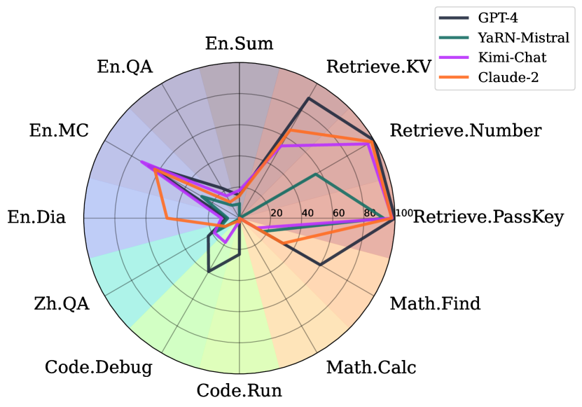
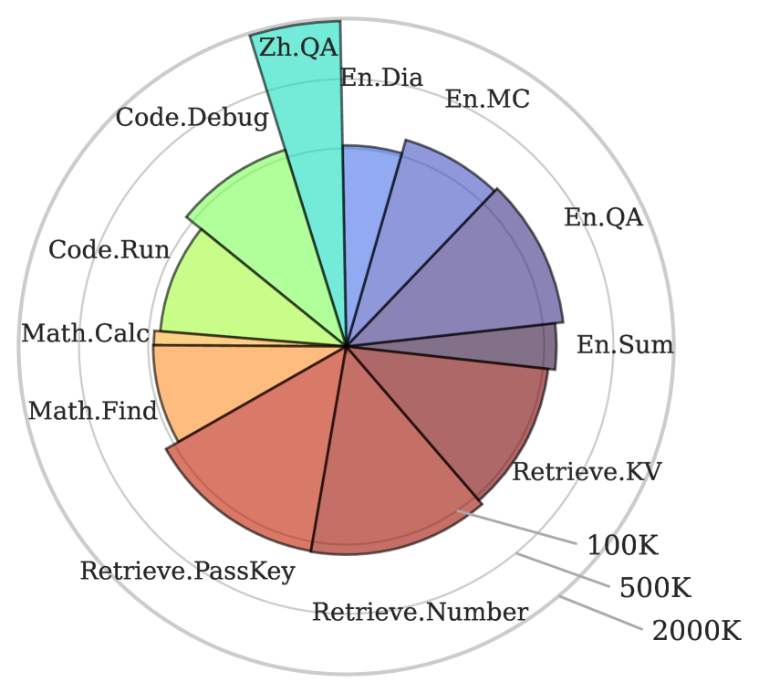
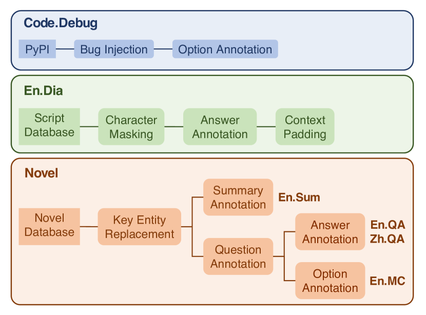
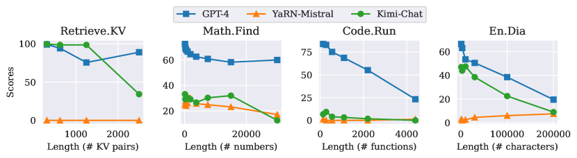
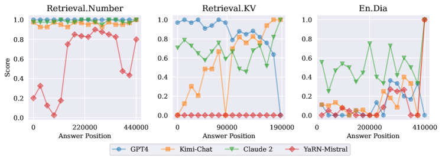

### ∞Bench (InfiniteBench)

```yaml
id: infinitebench
name: "∞Bench"
full_name: "∞Bench: Extending Long Context Benchmark Beyond 100K Tokens"
year: "2024"
org: "Tsinghua University, University of Waterloo, Peking University"
paper_url: "https://arxiv.org/abs/2402.13718"
category: "llm_evaluation"
parent: "—"
motivation: "首个平均长度超100K token的长上下文基准，系统评估LLM在超长文本上的真实能力"
```

#### 📝 一句话总结

∞Bench 提出了首个平均输入长度超过 100K token（实际平均约 200K）的长上下文评测基准，涵盖 5 大领域 12 项任务，揭示了当前 LLM 在处理超长上下文时性能显著下降的问题，并发现"上下文回忆"（Context Recalling）提示技术可大幅提升长文本推理准确率。

#### 🎯 核心要点

- **首个 100K+ 基准**：平均输入长度约 200K tokens，远超此前基准（LongBench ~7K、L-Eval ~4K），填补超长上下文评测空白
- **12 项任务 × 5 大领域**：检索（PassKey / Number / KV）、代码（Debug / Run）、数学（Find / Calc）、小说理解（En.QA / En.MC / En.Sum / Zh.QA）、对话（En.Dia），共 3,946 个样例
- **双语支持**：同时覆盖英文和中文任务，评估跨语言长上下文能力
- **实体替换防记忆**：对小说类任务中的人名/地名进行系统性替换，防止模型利用预训练记忆"作弊"
- **合成任务测试 4 种核心能力**：前向/后向检索、高分辨率信息识别、状态保持、顺序处理
- **4 个基线模型评测**：GPT-4（128K）、Claude 2（200K）、Kimi-Chat（200K）、YaRN-Mistral-7B（128K）
- **关键发现**：所有模型随上下文长度增加性能显著下降；"Lost in the Middle" 现象在 100K+ 场景下并不一致
- **Context Recalling 技术**：引导模型先复述相关上下文再推理，Code.Debug 准确率从 15.74% 提升至 39.59%

#### 🔬 深入细节

##### 基准总览与任务分类


*图 1：四个基线模型在 ∞Bench 各任务上的性能雷达图。GPT-4 在多数任务上领先，但所有模型在超长上下文下均存在明显短板。*


*图 2：∞Bench 的任务分类体系。左侧为合成任务（检索、代码、数学），右侧为真实任务（小说理解、对话），合成任务分别对应 4 种核心长上下文处理能力。*

##### 任务设计与评测方法

∞Bench 的核心设计理念是：**真正的长上下文理解不应仅是"大海捞针"式检索，而需要对长距离依赖信息进行聚合与推理**。论文将任务分为两大类：

**合成任务（Synthetic Tasks）**——精确控制难度与长度，测试 4 种原子能力：

```
┌─────────────────────────────────────────────────────────┐
│  能力维度          │  对应任务          │  核心挑战        │
├─────────────────────────────────────────────────────────┤
│  前向/后向检索     │  Ret.PassKey       │  在噪声文本中    │
│  (Retrieval)       │  Ret.Number        │  定位目标信息    │
│                    │  Ret.KV            │                  │
├─────────────────────────────────────────────────────────┤
│  高分辨率信息识别  │  Ret.Number        │  区分连续重复    │
│  (Elevated Res.)   │                    │  数字(如9998877) │
├─────────────────────────────────────────────────────────┤
│  状态保持          │  Code.Run          │  跨多层函数调用  │
│  (State Tracking)  │  Math.Find         │  追踪变量状态    │
├─────────────────────────────────────────────────────────┤
│  顺序处理          │  Math.Calc         │  逐步计算长      │
│  (Sequential Proc.)│                    │  算术表达式      │
└─────────────────────────────────────────────────────────┘
```

**真实任务（Realistic Tasks）**——基于完整长篇小说和电视剧剧本：

- **En.QA / Zh.QA**：基于整本小说的问答，答案需要综合全书信息（非单段落可回答）
- **En.MC**：多选题形式，测试对小说情节的深层理解
- **En.Sum**：对整本小说生成摘要，使用 ROUGE 评分
- **En.Dia**：基于电视剧剧本，根据角色台词判断说话者身份

> 💡 **关键设计——实体替换防记忆泄露**：对于小说类任务，论文系统性地将人名、地名等命名实体替换为随机生成的名称。例如将 "Harry Potter" 替换为 "Zephyr Thornwood"。这确保模型无法依赖预训练阶段记忆的小说内容来"作弊"，必须真正阅读和理解输入的长文本。

##### 数据集统计


*图 3：∞Bench 各任务的数据统计。平均输入长度约 200K tokens，最长可达 200K+ tokens。*

各任务的关键统计数据：

| 任务 | 样例数 | 平均长度(tokens) | 评测指标 |
|------|--------|-----------------|----------|
| Ret.PassKey | 590 | ~122K | Accuracy |
| Ret.Number | 590 | ~122K | Accuracy |
| Ret.KV | 500 | ~89K | Accuracy |
| En.Sum | 103 | ~171K | ROUGE |
| En.QA | 351 | ~171K | F1 |
| En.MC | 229 | ~184K | Accuracy |
| En.Dia | 200 | ~103K | Accuracy |
| Zh.QA | 200 | ~2068K | F1 |
| Code.Debug | 394 | ~114K | Accuracy |
| Code.Run | 400 | ~75K | Accuracy |
| Math.Find | 350 | ~87K | Accuracy |
| Math.Calc | 50 | ~43K | Accuracy |

##### 主要实验结果

论文评测了 4 个声称支持 100K+ 上下文的模型：

| 模型 | Ret.PK | Ret.Num | Ret.KV | En.Sum | En.QA | En.MC | En.Dia | Zh.QA | Code.Dbg | Code.Run | Math.Find | Math.Calc | **Avg** |
|------|--------|---------|--------|--------|-------|-------|--------|-------|----------|----------|-----------|-----------|---------|
| GPT-4 | 100 | 100 | 89.00 | 14.73 | 22.44 | 67.25 | 8.50 | 25.96 | 39.59 | 23.25 | 60.00 | 0.00 | **45.63** |
| Claude 2 | 97.80 | 98.14 | 65.40 | 14.50 | 11.97 | 62.88 | 46.50 | 6.75 | 1.52 | 20.00 | 32.29 | 0.00 | **37.06** |
| Kimi-Chat | 98.14 | 95.42 | 53.60 | 18.36 | 16.52 | 72.49 | 11.50 | 12.31 | 11.17 | 19.25 | 4.00 | 0.00 | **34.73** |
| YaRN-Mistral | 92.71 | 56.61 | 0.00 | 9.09 | 9.55 | 36.68 | 7.50 | 2.76 | 2.28 | 1.25 | 17.14 | 0.00 | **19.96** |

> ⚠️ **注意**：所有模型在 Math.Calc 上均得 0 分，表明当前 LLM 完全无法处理超长序列的逐步算术计算。GPT-4 虽然平均分最高，但在 En.Dia（8.50）和 En.Sum（14.73）等需要深度理解的任务上表现也不理想。

##### 长度消融与关键分析


*图 4：不同输入长度下的模型性能变化。随着上下文长度增加，所有模型性能均显著下降，说明"声称支持 128K/200K"与"有效利用 128K/200K"之间存在巨大差距。*

**长度消融实验**揭示了一个核心问题：虽然这些模型在技术上能够接受超长输入，但其有效处理能力随长度增加而急剧衰减。这表明当前的位置编码扩展方法（如 YaRN）和长上下文训练策略仍有很大改进空间。


*图 5：模型性能与答案在上下文中位置的关系。与此前研究不同，∞Bench 在 100K+ 场景下未观察到一致的"Lost in the Middle"现象。*

**"Lost in the Middle" 分析**：此前 Liu et al. (2023) 在 16K 以内的上下文中发现模型对中间位置信息的利用较差。然而 ∞Bench 的实验表明，在 100K+ 场景下，**不同模型对答案位置的偏好各不相同**：GPT-4 在 Ret.KV 中偏好靠前的答案但在 En.Dia 中偏好靠后的；Claude 2 对位置不敏感；YaRN-Mistral 和 Kimi-Chat 则偏好末尾位置。论文推测 "Lost in the Middle" 可能仅在特定任务和模型组合下出现。

##### Context Recalling 提示技术

论文发现了一种有效的长上下文提示策略——**Context Recalling**：

```python
# 传统提示（Code.Debug 任务）
prompt_v1 = """
One function in this repo is deliberately made to include an obvious error. Find it.
<code>
Think step by step and at last give me your answer.
<list of options>
"""
# 准确率: 15.74%

# Context Recalling 提示
prompt_v2 = """
One function in this repo is deliberately made to include an obvious error. Find it.
<code>
Locate the functions in the options, repeat their content, 
inspect through code, and at last give me your answer.
<list of options>
"""
# 准确率: 39.59% (提升 +23.85%)
```

> 💡 **关键洞察**：虽然相关信息已在上下文中且模型可通过注意力机制直接访问，但显式要求模型先"复述"相关片段再进行推理，能显著提升准确率。这可能是因为复述过程将关键信息"搬运"到生成窗口的近端位置，降低了远距离注意力的负担。

##### 与现有基准的对比

∞Bench 与此前长上下文基准的核心差异：

| 特性 | LongBench | L-Eval | SCROLLS | **∞Bench** |
|------|-----------|--------|---------|------------|
| 平均长度 | ~7K | ~4K | ~10K | **~200K** |
| 最大长度 | ~30K | ~60K | ~50K | **>200K** |
| 双语支持 | ✓ | ✗ | ✗ | **✓** |
| 防记忆泄露 | ✗ | ✗ | ✗ | **✓** |
| 合成+真实任务 | 部分 | 部分 | 真实 | **✓** |
| 需全文理解 | 部分 | 部分 | 部分 | **✓** |

∞Bench 的设计确保任务无法通过仅阅读局部片段完成——小说 QA 需要综合全书信息，代码调试需要理解整个代码库的函数依赖关系，数学任务需要处理完整的数字序列。

#### 🧪 练习题

```yaml
question: "∞Bench 中的 Context Recalling 技术为何能显著提升长上下文任务的准确率？"
options:
  - "它通过压缩上下文减少了输入长度"
  - "它引导模型先复述相关信息再推理，将关键内容拉近生成窗口"
  - "它使用了额外的检索增强生成（RAG）模块"
  - "它对模型进行了针对性的微调训练"
answer: 1
explain: "Context Recalling 不改变模型或输入，而是通过提示要求模型先复述相关代码/文本片段，再进行分析推理。这将远距离的关键信息'搬运'到生成序列的近端，降低了长距离注意力的负担，在 Code.Debug 上将 GPT-4 的准确率从 15.74% 提升至 39.59%。"
```