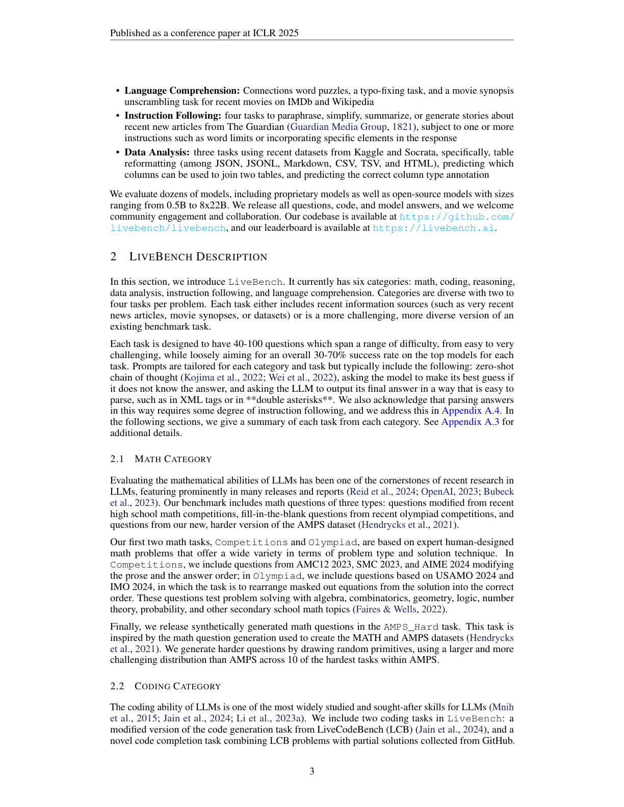
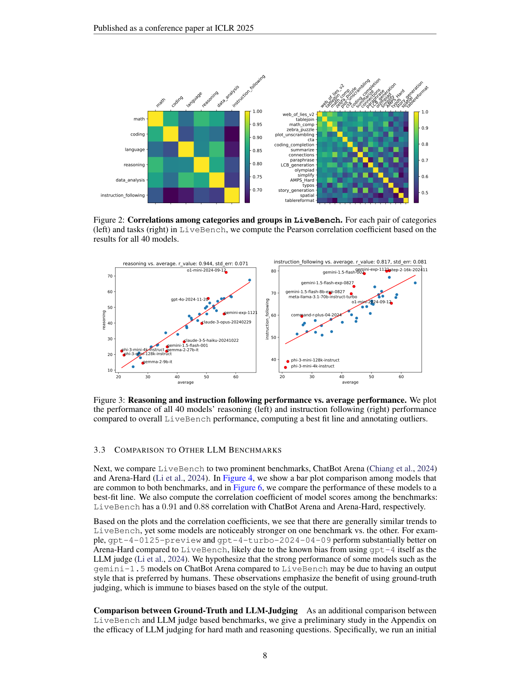
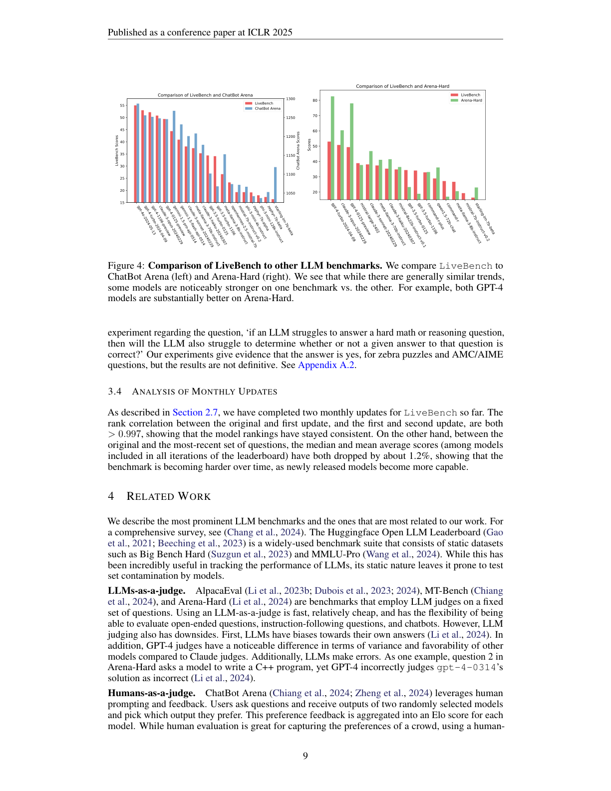

### LiveBench — 面向 LLM 的抗污染动态评测基准

```yaml
id: livebench
name: LiveBench
full_name: "LiveBench: A Challenging, Contamination-Free LLM Benchmark"
year: "2024"
venue: "ICLR 2025"
org: "Abacus.AI, CMU, UIUC 等"
paper_url: "https://arxiv.org/abs/2406.19314"
category: "llm_evaluation"
parent: "—"
motivation: "现有 LLM 基准面临数据污染、LLM-judge 偏差和题目饱和三大问题，LiveBench 通过月度更新题目、客观自动评分和多样化高难度任务来解决"
```

#### 📝 一句话总结

LiveBench 提出了一个按月更新、使用客观 ground-truth 自动评分（无需 LLM judge）的 LLM 评测基准，涵盖数学、编程、推理、语言理解、指令遵循和数据分析 6 大类 18 个子任务，有效缓解了数据污染和评分偏差问题。

#### 🎯 核心要点

- **三大设计原则**：(1) 从不断更新的信息源获取题目以限制污染；(2) 使用客观、可验证的 ground-truth 自动评分，完全避免 LLM judge 偏差；(3) 涵盖多样化且足够困难的任务，最强模型准确率不超过 65%
- **6 大评测类别、18 个子任务**：Math（AMC/AIME 竞赛题、奥赛题、AMPS_Hard）、Coding（LeetCode/Codeforces 代码生成与补全）、Reasoning（Web of Lies v2、Zebra Puzzle、Spatial）、Language（Connections 词谜、Typos 纠错、Plot Unscrambling 情节排序）、Instruction Following（基于 Guardian 新闻的改写/摘要/故事生成 + 可验证约束）、Data Analysis（列类型标注 CTA、表格重格式化、表格连接）
- **月度更新机制**：每月从 AMC/AIME 竞赛、Codeforces/LeetCode 新题、IMDb 新电影、Guardian 新闻、Kaggle/Socrata 新数据集等动态来源获取新题，并逐步增加难度
- **评分方式**：所有任务均有确定性正确答案，使用精确匹配、编辑距离、代码测试用例通过率等客观指标，无需人工或 LLM 评判
- **实验规模**：评测了 40+ 个模型（含 GPT-4o、Claude-3.5、o1-preview、Llama-3.1-405B 等），与 ChatBot Arena 相关系数 0.91，与 Arena-Hard 相关系数 0.88
- **关键发现**：o1-preview 综合最强；月度更新后排名 Spearman 相关 > 0.997 表明排名稳定；LLM judge 在困难数学/推理题上准确率仅约 50%，远不如 ground-truth 评分

#### 🔬 深入细节


*图 1：LiveBench 的 6 大类别及其子任务概览。每个类别包含 2-3 个子任务，题目来源于不断更新的外部数据源。*

**动机与背景：为什么需要 LiveBench？**

当前 LLM 评测面临三个核心挑战。第一，**数据污染**（data contamination）：随着 LLM 训练数据规模爆炸式增长，MMLU、GSM8K 等经典基准的题目极有可能已被纳入训练集，导致评测分数虚高。研究表明，部分模型在被污染的基准上得分可提升 10% 以上。第二，**LLM judge 偏差**：AlpacaEval、MT-Bench 等基准使用 GPT-4 作为裁判，但 LLM judge 存在系统性偏差——偏好冗长回答、偏好与自身风格相似的输出，且在困难推理题上判断准确率仅约 50%。第三，**题目饱和**：静态基准一旦发布就不再更新，模型性能逐渐趋近满分，失去区分能力。LiveBench 通过动态更新 + 客观评分的组合方案，同时解决了这三个问题。

**核心机制：六大类别的任务设计**

LiveBench 的任务设计遵循"从动态来源获取新鲜题目 + 程序化生成变体"的原则。以下逐一说明各类别的关键设计：

**数学类（Math）** 包含三个子任务：(1) **Math Competitions**——从 AMC 10/12 和 AIME 等数学竞赛中提取最新题目，将原始多选题改为开放式作答以增加难度，并对数值和选项进行扰动以防止记忆；(2) **Olympiad**——来自 USAMO、IMO 等奥赛的证明题，要求模型给出最终数值答案；(3) **AMPS_Hard**——基于 Khan Academy 和 MIT 课程的程序化生成数学题，每月生成新实例。

**编程类（Coding）** 包含两个子任务：(1) **LCB Generation**——来自 LiveCodeBench 的 78 道竞赛编程题（源自 Codeforces/LeetCode 近期题目），要求模型从零编写完整解答，通过测试用例评分；(2) **Completion**——给出 LeetCode 题目的部分正确解法（删除最后 15%-70% 的代码），要求模型补全，测试代码理解与续写能力。

**推理类（Reasoning）** 包含三个子任务：(1) **Web of Lies v2**——在 Big-Bench Hard 原版基础上大幅增加难度，加入额外推理步骤和多种干扰项（red herrings），要求评估自然语言表述的布尔函数真值；(2) **Zebra Puzzle**——程序化生成的逻辑约束推理题，给定一组约束条件，推断特定属性值；(3) **Spatial**——50 道手写的 2D/3D 空间推理题，测试模型对几何形状交叉和方向关系的推断能力。

**语言理解类（Language）** 包含：(1) **Connections**——类似 NYT 词谜游戏，将 8/12/16 个词分成若干组，每组 4 个词有共同联系；(2) **Typos**——在最新 ArXiv 摘要中程序化注入常见拼写错误，要求模型仅修复拼写而保留其他风格；(3) **Plot Unscrambling**——将 IMDb/Wikipedia 上近期电影的情节摘要打乱句序，要求模型恢复原始顺序。

**指令遵循类（Instruction Following）** 基于 IFEval 的 16 种可验证指令（如字数限制、特定短语包含等），结合 Guardian 新闻文章，要求模型在完成改写/摘要/简化/故事生成任务的同时严格遵守多个随机抽取的约束条件。评分仅考察指令遵守程度。

**数据分析类（Data Analysis）** 使用 Kaggle/Socrata 最新数据集，包含：(1) **CTA（Column Type Annotation）**——给定表格列的样本值和所有列名，预测该列的正确列名；(2) **TableReformat**——在 JSON/CSV/XML/TSV 等格式间转换表格；(3) **TableJoin**——给定两个部分重叠的表格，预测正确的列映射关系。

```python
# LiveBench 评测流程伪代码
def livebench_evaluate(model, month):
    """每月评测一个模型的完整流程"""
    scores = {}
    
    # 1. 从动态来源获取/生成当月新题
    questions = {}
    questions['math'] = fetch_recent_competitions(AMC, AIME) + generate_AMPS(month)
    questions['coding'] = fetch_LiveCodeBench(after=month) + create_completions(LeetCode)
    questions['reasoning'] = generate_web_of_lies_v2() + generate_zebra_puzzles()
    questions['language'] = fetch_NYT_connections() + inject_typos(recent_arxiv)
    questions['IF'] = combine(Guardian_articles, sample_instructions(k=16))
    questions['data_analysis'] = sample_tables(Kaggle, Socrata)
    
    # 2. 单轮推理，temperature=0
    for category, qs in questions.items():
        task_scores = []
        for q in qs:
            response = model.generate(q.prompt, temperature=0)
            # 3. 客观评分：精确匹配 / 编辑距离 / 测试用例
            score = objective_score(response, q.ground_truth, q.metric)
            task_scores.append(score)  # score ∈ [0, 1]
        scores[category] = mean(task_scores)
    
    # 4. 最终分数 = 6 个类别的平均
    return mean(scores.values())
```

> 💡 **关键设计**：LiveBench 的评分完全不依赖 LLM judge。论文在附录中对比了 GPT-4 作为 judge 在困难数学题上的表现，发现其判断准确率仅约 46-62%，甚至不如随机猜测可靠，这有力地证明了客观评分的必要性。

**月度更新与抗污染验证**

LiveBench 的核心创新之一是月度更新机制。每月从竞赛网站、新闻源、数据平台等获取新题，同时逐步提升难度（平均每月难度增加约 1.2%）。论文通过计算相邻月份模型排名的 Spearman 相关系数来验证更新的有效性：相关系数始终 > 0.997，说明虽然题目完全更换，但模型的相对能力排序高度稳定，证明了评测的信度。


*图 2：左图为 6 大类别间的 Pearson 相关系数热力图；右图为各子任务间的相关性。Math Competitions 与整体表现相关性最高，Instruction Following 与其他类别相关性最低。*

**与现有基准的对比**

LiveBench 与 ChatBot Arena（人类投票排名）的相关系数为 0.91，与 Arena-Hard（GPT-4 judge）的相关系数为 0.88，表明 LiveBench 的排名与社区公认的模型能力排序高度一致。但 LiveBench 能揭示一些有趣差异：例如 GPT-4-turbo 在 Arena-Hard 上表现异常好（因为 Arena-Hard 使用 GPT-4 自身作为 judge，存在自我偏好偏差），而 Gemini-1.5 系列在 ChatBot Arena 上排名偏高（可能因为输出风格受人类偏好）。这些差异恰好体现了客观评分的优势。


*图 3：LiveBench 与 ChatBot Arena、Arena-Hard 的模型得分对比。*

**与传统评测方法的区别**

与 MMLU、HumanEval 等静态基准相比，LiveBench 通过月度更新从根本上解决了污染问题。与 AlpacaEval、MT-Bench 等 LLM-judge 基准相比，LiveBench 使用客观 ground-truth 评分，消除了评判偏差。与 ChatBot Arena 的人类投票相比，LiveBench 完全自动化且可复现，成本极低。LiveBench 的独特定位是：**同时满足抗污染、客观评分和高区分度三个要求的唯一基准**。

> ⚠️ **注意**：LiveBench 的局限性在于：(1) 仅覆盖可客观评分的任务，无法评测开放式创意写作等主观能力；(2) 月度更新需要持续的人力维护；(3) 部分任务（如 Spatial）依赖手写题目，规模有限。

#### 🧪 练习题

```yaml
question: "LiveBench 为什么不使用 LLM（如 GPT-4）作为评分裁判？"
options:
  - "因为 LLM judge 的 API 调用成本太高"
  - "因为 LLM judge 在困难推理题上准确率低且存在系统性偏差（如偏好冗长输出）"
  - "因为 LLM judge 的推理速度太慢，无法支持月度更新"
  - "因为 OpenAI 不允许将 GPT-4 用作评测裁判"
answer: 1
explain: "论文实验表明 GPT-4 作为 judge 在困难数学/推理题上准确率仅约 46-62%，且存在偏好自身风格输出的系统性偏差，因此 LiveBench 选择使用客观 ground-truth 自动评分。"
```