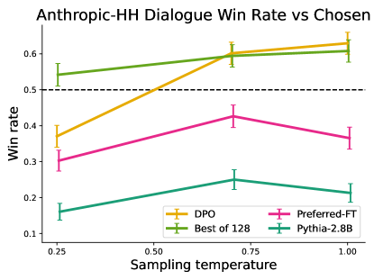

# Direct Preference Optimization: Your Language Model is Secretly a Reward Model

## 一句话总结

DPO 通过将奖励函数重参数化为策略与参考策略的对数概率比，将 RLHF 中的约束奖励最大化问题转化为一个简单的二元交叉熵分类损失，从而完全绕过了显式奖励建模和强化学习训练循环，在情感控制、摘要生成和对话任务上达到或超越了 PPO-based RLHF 的性能。

## 研究背景与动机

### 问题定义

大规模语言模型（LM）通过无监督预训练获得了广泛的知识和能力，但其行为难以精确控制。为了使模型输出与人类偏好对齐，主流方法采用**基于人类反馈的强化学习（RLHF）**流程：

1. **收集偏好数据**：对同一提示（prompt）$x$ 的两个回复 $y_1, y_2$ 进行人类标注，得到偏好对 $(y_w, y_l)$；
2. **训练奖励模型**：拟合一个参数化奖励函数 $r_\phi(x, y)$，使其与人类偏好一致；
3. **RL 微调**：使用 PPO 等算法最大化学到的奖励，同时通过 KL 散度约束防止策略偏离参考模型过远。

### 现有方法的痛点

| 痛点 | 具体表现 |
|------|----------|
| **流程复杂** | 需要训练至少 3 个模型（SFT → 奖励模型 → RL 策略），工程开销巨大 |
| **训练不稳定** | PPO 对超参数极其敏感，奖励模型的误差会在 RL 阶段被放大 |
| **计算昂贵** | RL 训练循环中需要在线采样（on-policy sampling），显存和算力需求高 |
| **奖励过度优化** | 策略可能利用奖励模型的漏洞（reward hacking），导致实际质量下降 |

### 核心动机

> 能否跳过显式奖励建模和 RL 训练，直接从偏好数据优化策略？

作者的关键洞察是：**在 Bradley-Terry 偏好模型下，最优策略与奖励函数之间存在解析映射关系**。通过变量替换（change of variables），可以将奖励函数上的偏好损失直接转化为策略上的损失函数，从而用一个简单的分类目标替代整个 RLHF 流程。

## 方法详解

### 前置知识：RLHF 标准流程

RLHF 的目标是求解如下 KL 约束的奖励最大化问题：

$$\max_{\pi_\theta} \; \mathbb{E}_{x \sim \mathcal{D}, \, y \sim \pi_\theta(\cdot|x)} \left[ r(x, y) \right] - \beta \, \mathbb{D}_{\text{KL}} \left[ \pi_\theta(y|x) \| \pi_{\text{ref}}(y|x) \right] \tag{1}$$

其中 $r(x,y)$ 是奖励函数，$\pi_{\text{ref}}$ 是参考策略（通常为 SFT 模型），$\beta$ 控制 KL 惩罚强度。

**直觉**：我们希望策略生成高奖励的回复，但又不能偏离参考模型太远（避免生成不通顺或退化的文本）。

### 步骤一：最优策略的闭式解

对于上述 KL 约束优化问题，最优策略具有如下闭式形式：

$$\pi_r(y|x) = \frac{1}{Z(x)} \pi_{\text{ref}}(y|x) \exp\!\left(\frac{1}{\beta} r(x,y)\right) \tag{2}$$

其中 $Z(x) = \sum_y \pi_{\text{ref}}(y|x) \exp\!\left(\frac{1}{\beta} r(x,y)\right)$ 是配分函数（partition function）。

**直觉**：最优策略是参考策略按奖励进行指数加权的结果——奖励越高的回复概率越大，$\beta$ 越小则加权越激进。

### 步骤二：奖励的重参数化（核心创新）

对公式 (2) 取对数并求解 $r(x,y)$，得到：

$$r(x, y) = \beta \log \frac{\pi_r(y|x)}{\pi_{\text{ref}}(y|x)} + \beta \log Z(x) \tag{3}$$

**关键洞察**：奖励函数可以完全用最优策略 $\pi_r$ 与参考策略 $\pi_{\text{ref}}$ 的对数概率比来表达（配分函数 $Z(x)$ 仅依赖于 $x$，在偏好比较中会被消去）。

### 步骤三：代入 Bradley-Terry 模型

Bradley-Terry 偏好模型假设人类偏好概率为：

$$p^*(y_w \succ y_l | x) = \sigma\!\left(r^*(x, y_w) - r^*(x, y_l)\right) \tag{4}$$

其中 $\sigma$ 是 sigmoid 函数。将公式 (3) 代入公式 (4)，配分函数 $Z(x)$ 在差值中消去，得到：

$$p^*(y_w \succ y_l | x) = \sigma\!\left(\beta \log \frac{\pi^*(y_w|x)}{\pi_{\text{ref}}(y_w|x)} - \beta \log \frac{\pi^*(y_l|x)}{\pi_{\text{ref}}(y_l|x)}\right) \tag{5}$$

### 步骤四：DPO 损失函数

将公式 (5) 中的最优策略 $\pi^*$ 替换为可训练策略 $\pi_\theta$，构造最大似然目标的负对数，得到 **DPO 损失**：

$$\boxed{\mathcal{L}_{\text{DPO}}(\pi_\theta; \pi_{\text{ref}}) = -\mathbb{E}_{(x, y_w, y_l) \sim \mathcal{D}} \left[ \log \sigma\!\left(\beta \log \frac{\pi_\theta(y_w|x)}{\pi_{\text{ref}}(y_w|x)} - \beta \log \frac{\pi_\theta(y_l|x)}{\pi_{\text{ref}}(y_l|x)}\right) \right]} \tag{6}$$

**直觉解读**：
- DPO 损失衡量的是策略对偏好对的"排序正确性"：如果策略给 $y_w$ 的相对概率提升（相对于参考模型）大于给 $y_l$ 的提升，则损失较低；
- $\beta$ 控制了隐式奖励的尺度：$\beta$ 越大，策略越保守（更接近参考模型）；
- **无需采样、无需奖励模型、无需 RL**——仅需前向传播计算对数概率，然后做梯度下降。

### 梯度分析

DPO 损失的梯度具有直观的形式：

$$\nabla_\theta \mathcal{L}_{\text{DPO}} = -\beta \, \mathbb{E} \Big[ \underbrace{\sigma(\hat{r}_\theta(y_l) - \hat{r}_\theta(y_w))}_{\text{权重：当前模型排错的程度}} \Big[ \underbrace{\nabla_\theta \log \pi_\theta(y_w|x)}_{\text{增大偏好回复概率}} - \underbrace{\nabla_\theta \log \pi_\theta(y_l|x)}_{\text{减小非偏好回复概率}} \Big] \Big] \tag{7}$$

其中 $\hat{r}_\theta(y) = \beta \log \frac{\pi_\theta(y|x)}{\pi_{\text{ref}}(y|x)}$ 是隐式奖励。

**直觉**：梯度前面的权重项起到了**自适应重要性加权**的作用——当模型已经正确排序偏好对时（$\hat{r}_\theta(y_w) \gg \hat{r}_\theta(y_l)$），权重接近 0，梯度很小；当模型排错时，权重接近 1，梯度较大。这种机制防止了朴素概率比目标导致的模型退化。

### 算法流程

*图 1：DPO 与传统 RLHF 流程对比。传统方法需要先训练奖励模型再用 RL 优化策略；DPO 直接用偏好数据通过分类损失优化策略，同时隐式拟合了一个奖励模型。*

**DPO 训练流程**：
1. **SFT 阶段**：在高质量数据上监督微调，得到参考策略 $\pi_{\text{ref}}$；
2. **偏好优化阶段**：固定 $\pi_{\text{ref}}$，在偏好数据集 $\mathcal{D} = \{(x^{(i)}, y_w^{(i)}, y_l^{(i)})\}_{i=1}^N$ 上最小化 $\mathcal{L}_{\text{DPO}}$。

整个过程仅需标准的监督学习基础设施，无需在线采样或价值函数估计。

### 理论保证

作者证明了两个重要性质：
1. **等价性**：在 Bradley-Terry 偏好模型下，DPO 的全局最优解与标准 RLHF（先学奖励再 RL 优化）的全局最优解一致；
2. **隐式奖励**：训练好的 DPO 策略 $\pi_\theta$ 隐式定义了奖励函数 $r(x,y) = \beta \log \frac{\pi_\theta(y|x)}{\pi_{\text{ref}}(y|x)}$，可以直接提取用于评估或下游任务。

## 实验与结果

### 实验设置

| 任务 | 数据集 | 基础模型 | 偏好来源 |
|------|--------|----------|----------|
| 情感控制生成 | IMDb 影评 | GPT-2-large | 情感分类器（已知 ground-truth 奖励） |
| 摘要生成 | Reddit TL;DR | GPT-J-6B | 人类标注偏好 (Stiennon et al.) |
| 单轮对话 | Anthropic-HH | Pythia-2.8B | 人类标注偏好 |

**对比方法**：Preferred-FT（仅在偏好回复上 SFT）、Unlikelihood（最大化 $y_w$ 概率 + 最小化 $y_l$ 概率）、PPO（学到的奖励）、PPO-GT（ground-truth 奖励，仅情感任务）、Best-of-N（采样 N 个取最优）。

**评估方式**：
- 情感任务：奖励-KL 前沿曲线（ground-truth 奖励可用）；
- 摘要和对话任务：GPT-4 作为评估器计算 win rate（经人类研究验证与人类判断高度一致）。

### 核心结果

#### 1. 情感控制：DPO 达到最优奖励-KL 前沿

*图 2：左图为情感任务的奖励-KL 前沿曲线，DPO 在所有 KL 值下均达到最高期望奖励；右图为 TL;DR 摘要任务中各方法对比 ground-truth 摘要的 GPT-4 win rate。*

- DPO 在**所有 KL 预算**下均优于 PPO（包括使用 ground-truth 奖励的 PPO-GT）；
- DPO 甚至超越了 Best-of-128 采样策略，后者在推理时需要 128 倍的计算量。

#### 2. 摘要生成：DPO 超越 PPO 最佳表现

- 在 TL;DR 测试集上，DPO 的 GPT-4 win rate 达到约 **61%**（vs. ground-truth 摘要），超过 PPO 的最佳配置（约 57%）；
- DPO 对采样温度更加鲁棒：PPO 在不同温度下性能波动较大，而 DPO 表现稳定；
- 在分布外泛化测试（CNN/DailyMail 数据集）中，DPO 同样保持优势。

#### 3. 单轮对话：DPO 是唯一超越数据集标签的方法

*图 3：左图为 Anthropic-HH 对话任务的 GPT-4 win rate，DPO 是唯一超过数据集中偏好回复的方法；右图为不同采样温度下训练过程中的 win rate 变化。*

- DPO 的 win rate 超过 **50%**（即优于数据集中的人类偏好回复），而 PPO 和其他基线均未达到；
- Unlikelihood 方法表现最差，说明朴素的概率调整（无自适应权重）容易导致退化。

#### 4. 人类评估验证

作者进行了人类评估研究，发现 GPT-4 与人类评估者的一致率与人类评估者之间的互相一致率相当（约 65-70%），验证了使用 GPT-4 评估的可靠性。

### 关键发现总结

| 发现 | 意义 |
|------|------|
| DPO 在奖励-KL 前沿上全面优于 PPO | 证明 DPO 不仅更简单，优化质量也更高 |
| DPO 对超参数和采样温度更鲁棒 | 降低了实际部署的调参成本 |
| DPO 无需在线采样即可匹配/超越 PPO | 大幅减少训练计算量 |
| 隐式奖励可直接提取 | DPO 策略同时也是一个奖励模型 |

## 局限性与未来方向

### 论文自述局限

1. **分布外泛化**：DPO 策略在分布外的泛化能力尚需更全面的研究。初步结果显示与 PPO 类似，但缺乏系统性验证；
2. **奖励过度优化**：在 DPO 设置下，奖励过度优化如何表现尚不清楚（图 3 右图中训练后期的轻微性能下降可能是其表现）；
3. **规模验证**：实验仅在最大 6B 参数的模型上进行，尚未在数百亿参数的 SOTA 模型上验证；
4. **自动评估局限**：GPT-4 的 win rate 受评估 prompt 影响，最优的自动评估方式仍需探索。

### 笔者补充分析

5. **离线数据假设**：DPO 依赖固定的离线偏好数据集，无法像在线 RLHF 那样通过迭代采样持续改进。当偏好数据与当前策略分布差异较大时，可能出现分布偏移问题；
6. **Bradley-Terry 模型假设**：DPO 的推导依赖于 Bradley-Terry 偏好模型，该模型假设偏好是传递的且可以用标量奖励差异解释，这在复杂的人类偏好场景中可能不成立；
7. **偏好数据质量敏感**：由于没有独立的奖励模型作为中间抽象层，DPO 对偏好数据中的噪声和标注不一致可能更加敏感；
8. **多轮对话扩展**：论文仅验证了单轮对话场景，多轮对话中的偏好优化需要进一步研究。

### 后续发展方向

- **迭代 DPO / 在线 DPO**：结合在线采样，用当前策略生成新的偏好对进行迭代训练；
- **超越 Bradley-Terry**：探索更一般的偏好模型（如 Plackett-Luce 排序模型）下的直接优化方法；
- **多模态扩展**：将 DPO 应用于图像生成、语音合成等其他模态的偏好学习；
- **与 RLHF 的混合方法**：在 DPO 初始化的基础上进行少量 RL 微调，结合两者优势。

## 关键术语表

| 术语 | 英文 | 定义 |
|------|------|------|
| 直接偏好优化 | Direct Preference Optimization (DPO) | 本文提出的方法，通过将奖励重参数化为策略对数比，将 RLHF 转化为简单分类损失 |
| 基于人类反馈的强化学习 | RLHF (Reinforcement Learning from Human Feedback) | 先学奖励模型再用 RL 优化策略的偏好对齐范式 |
| Bradley-Terry 模型 | Bradley-Terry Model | 一种偏好概率模型，假设偏好概率为奖励差的 sigmoid 函数 |
| KL 散度约束 | KL Divergence Constraint | 限制策略不偏离参考模型过远的正则化项，防止模型退化 |
| 参考策略 | Reference Policy ($\pi_{\text{ref}}$) | 通常为 SFT 模型，作为 KL 约束的锚点 |
| 隐式奖励 | Implicit Reward | DPO 策略隐式定义的奖励函数 $r(x,y) = \beta \log \frac{\pi_\theta(y|x)}{\pi_{\text{ref}}(y|x)}$ |
| 配分函数 | Partition Function ($Z(x)$) | 归一化常数，在 DPO 推导中因偏好比较而消去 |
| 近端策略优化 | Proximal Policy Optimization (PPO) | OpenAI 提出的 RL 算法，是 RLHF 中最常用的策略优化方法 |
| 奖励过度优化 | Reward Over-optimization | 策略利用奖励模型漏洞获得高奖励但实际质量下降的现象 |
| Best-of-N 采样 | Best-of-N Sampling | 采样 N 个回复并用奖励模型选最优的推理时方法，计算开销大但效果好 |