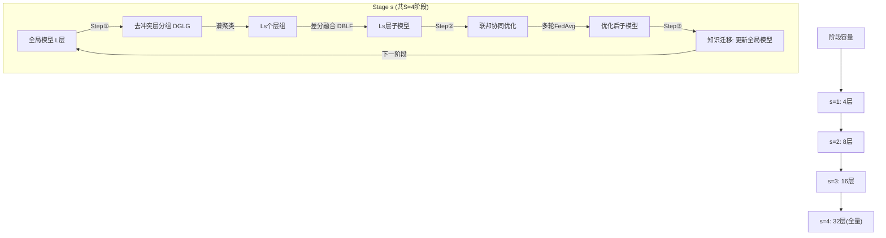

## 领域综述

### 待定
待定。

## 算法演化关系

```yaml
nodes:
- id: hogwild
  x: 10
  y: 60
  category: parameter_server
- id: distbelief
  x: 30
  y: 60
  category: parameter_server
- id: ps
  x: 60
  y: 60
  category: parameter_server
- id: easgd
  x: 80
  y: 50
  category: parameter_server
- id: decoupled_diloco
  x: 280
  y: 55
  category: parameter_server
- id: odc
  x: 280
  y: 65
  category: parameter_server
- id: bytescale
  x: 280
  y: 75
  category: parameter_server
- id: ft_hsdp
  x: 280
  y: 85
  category: parameter_server
- id: ring_allreduce
  x: 100
  y: 100
  category: parallelism
- id: horovod
  x: 130
  y: 100
  category: parallelism
- id: zero
  x: 160
  y: 100
  category: parallelism
- id: fsdp
  x: 220
  y: 100
  category: parallelism
- id: fcdp
  x: 280
  y: 100
  category: parallelism
- id: gpipe
  x: 140
  y: 130
  category: parallelism
- id: pipedream
  x: 140
  y: 145
  category: parallelism
- id: deepseek_v4_dp
  x: 280
  y: 145
  category: parallelism
- id: megatron_v1
  x: 140
  y: 165
  category: parallelism
- id: megatron_3d
  x: 180
  y: 165
  category: parallelism
- id: parallel_folding
  x: 260
  y: 155
  category: parallelism
- id: moeblaze
  x: 260
  y: 165
  category: parallelism
- id: dynamic_cp
  x: 260
  y: 175
  category: parallelism
- id: fedavg
  x: 100
  y: 210
  category: federated
- id: fedprox
  x: 160
  y: 200
  category: federated
- id: fedbn
  x: 160
  y: 210
  category: federated
- id: scaffold
  x: 160
  y: 220
  category: federated
- id: fedma
  x: 160
  y: 230
  category: federated
- id: fednova
  x: 160
  y: 240
  category: federated
- id: devft
  x: 260
  y: 200
  category: federated
- id: chainfed
  x: 260
  y: 210
  category: federated
- id: pfed1bs
  x: 260
  y: 220
  category: federated
- id: distilcachefl
  x: 260
  y: 230
  category: federated
- id: pfedmoe
  x: 260
  y: 240
  category: federated
- id: onebit_sgd
  x: 60
  y: 280
  category: communication
- id: fed_comm
  x: 90
  y: 270
  category: communication
- id: qsgd
  x: 100
  y: 280
  category: communication
- id: terngrad
  x: 100
  y: 290
  category: communication
- id: dpsgd
  x: 100
  y: 300
  category: communication
- id: dgc
  x: 130
  y: 280
  category: communication
- id: signsgd
  x: 130
  y: 290
  category: communication
- id: local_sgd
  x: 140
  y: 310
  category: communication
- id: diloco_dct
  x: 240
  y: 310
  category: communication
- id: tagc
  x: 260
  y: 280
  category: communication
- id: oscar
  x: 260
  y: 290
  category: communication
- id: ctma
  x: 260
  y: 300
  category: communication
edges:
- from: hogwild
  to: distbelief
  label: 异步并行基础
- from: distbelief
  to: ps
  label: 架构系统化
- from: distbelief
  to: easgd
  label: 优化稳定性
- from: ps
  to: decoupled_diloco
  label: 地理分布式
- from: ps
  to: odc
  label: 消除同步屏障
- from: ps
  to: ring_allreduce
  label: 消除中心瓶颈
- from: ring_allreduce
  to: horovod
  label: 工程化实现
- from: ring_allreduce
  to: zero
  label: 内存优化演进
- from: ring_allreduce
  to: oscar
  label: 软硬协同加速
- from: zero
  to: fsdp
  label: 框架原生集成
- from: zero
  to: fcdp
  label: CPU缓存加速
- from: fsdp
  to: ft_hsdp
  label: 容错增强
- from: gpipe
  to: pipedream
  label: 调度效率提升
- from: pipedream
  to: deepseek_v4_dp
  label: 双向重叠调度
- from: megatron_v1
  to: megatron_3d
  label: 混合并行演进
- from: megatron_3d
  to: parallel_folding
  label: 并行网格解耦
- from: megatron_3d
  to: moeblaze
  label: MoE内存优化
- from: megatron_3d
  to: dynamic_cp
  label: 动态序列并行
- from: megatron_3d
  to: bytescale
  label: 混合数据并行
- from: fedavg
  to: fedprox
  label: 处理异质性
- from: fedavg
  to: fedbn
  label: 缓解特征偏移
- from: fedavg
  to: scaffold
  label: 校正客户漂移
- from: fedavg
  to: fedma
  label: 神经元对齐
- from: fedavg
  to: fednova
  label: 解决目标不一致
- from: fedavg
  to: devft
  label: 发育式微调
- from: fedavg
  to: chainfed
  label: 链式内存优化
- from: fedavg
  to: pfed1bs
  label: 一比特压缩
- from: fedavg
  to: distilcachefl
  label: 蒸馏缓存
- from: fedavg
  to: pfedmoe
  label: MoE个性化
- from: fedavg
  to: ctma
  label: 拜占庭容错
- from: onebit_sgd
  to: qsgd
  label: 理论保证量化
- from: onebit_sgd
  to: terngrad
  label: 极低比特量化
- from: onebit_sgd
  to: signsgd
  label: 符号化压缩
- from: qsgd
  to: dgc
  label: 结合稀疏化
- from: dgc
  to: tagc
  label: 架构感知压缩
- from: local_sgd
  to: diloco_dct
  label: 频域动量压缩
milestones:
- ps
- fedavg
- zero
- ft_hsdp
```

## 核心算法

### FedAvg

```yaml
id: fedavg
num: 1
name: FedAvg
full_name: 联邦平均 (Federated Averaging)
year: '2017'
org: Google
parent: —
paper_url: https://arxiv.org/abs/1602.05629
project_url: ''
category: federated
motivation: 局部多轮更新后聚合，降低通信频率
```

#### 📝 一句话总结
FedAvg 提出在每轮通信中让各客户端执行多步本地 SGD 更新后再进行加权平均聚合，相比每轮仅做一步梯度的 FedSGD，将通信轮次降低 10–100×，使联邦学习在移动设备等通信受限场景下变得实用。

#### 🎯 核心要点
- 提出 **Federated Learning** 问题设定：数据留在设备端，模型在中心服务器聚合，解决隐私与通信瓶颈
- 核心算法 **FedAvg**：每轮随机选取 \(C\) 比例客户端，各自用本地数据执行 \(E\) 个 epoch、batch size 为 \(B\) 的 SGD，再将模型参数按数据量加权平均
- **FedSGD** 作为特例：当 \(E=1, B=\infty\) 时退化为分布式全批量梯度下降
- 关键发现：增大本地计算量（减小 \(B\)、增大 \(E\)）可显著减少通信轮次，但过大的 \(E\) 在 Non-IID 数据上可能导致发散
- 实验覆盖 5 种模型架构：MLP、两种 CNN、字符级 LSTM、大规模词级 LSTM
- 验证了在 IID 和 pathological Non-IID 数据划分下的有效性

#### 🔬 深入细节

*图：对两个独立训练的 MNIST 模型进行参数平均后的损失变化。当从同一随机初始化出发时（右），平均后的模型损失接近两个端点，说明参数平均在共享初始化条件下是可行的聚合策略。*

```python
# FedAvg 算法伪代码 (Algorithm 1)
# 服务器端执行：
def ServerUpdate():
    w = initialize_global_model()
    for each round t = 1, 2, ...:
        S_t = random_sample(clients, fraction=C)
        for each client k in S_t (in parallel):
            w_k = ClientUpdate(k, w)
        # 加权平均聚合
        w = sum(n_k / n * w_k for k in S_t)
    return w

# 客户端 k 执行：
def ClientUpdate(k, w):
    B = split_local_data_into_batches(P_k, batch_size=B)
    for epoch in range(E):
        for batch b in B:
            w = w - η * gradient(loss(w, b))
    return w
```

**动机与背景**

传统分布式 SGD（如数据中心内的同步/异步 SGD）假设数据可以在节点间自由 shuffle，通信带宽高且延迟低。然而在移动设备场景下，用户数据因隐私原因不能上传至服务器，且移动网络带宽有限（上行尤其慢）、设备可用性不稳定。这要求学习算法必须**最小化通信轮次**，同时容忍 Non-IID 的数据分布和不平衡的数据量。此前的朴素方法 FedSGD 每轮仅让客户端计算一个梯度就上传，通信效率极低。

**核心机制：本地多步 SGD + 加权聚合**

FedAvg 的关键洞察是：与其每轮只做一步梯度计算，不如让客户端在本地多跑几轮 SGD，再把最终模型参数发回服务器做加权平均。具体地，全局优化目标为：

$$f(w) = \sum_{k=1}^{K} \frac{n_k}{n} F_k(w), \quad F_k(w) = \frac{1}{n_k}\sum_{i \in \mathcal{P}_k} \ell(x_i, y_i; w)$$

其中 \(\mathcal{P}_k\) 是客户端 \(k\) 的本地数据集，\(n_k = |\mathcal{P}_k|\)。FedSGD 的聚合为：

$$w_{t+1} \leftarrow w_t - \eta \sum_{k=1}^{K} \frac{n_k}{n} \nabla F_k(w_t)$$

当 \(\eta\) 固定时，这等价于对各客户端执行一步 SGD 后的模型做加权平均。FedAvg 将此推广为**多步本地更新**：每个客户端从全局模型 \(w_t\) 出发，用本地数据跑 \(E\) 个 epoch（每 epoch 遍历 \(\lceil n_k/B \rceil\) 个 mini-batch），得到 \(w_k^{t+1}\)，服务器再聚合：

$$w_{t+1} \leftarrow \sum_{k \in S_t} \frac{n_k}{n} w_k^{t+1}$$

三个关键超参数控制计算-通信权衡：
- \(C\)：每轮参与的客户端比例（如 \(C=0.1\) 表示 10% 客户端参与）
- \(B\)：本地 mini-batch 大小（\(B=\infty\) 退化为全批量）
- \(E\)：本地训练 epoch 数

> 💡 关键：增大 \(E\) 或减小 \(B\) 都会增加每轮的本地计算量，从而减少达到目标精度所需的通信轮次。但这并非无限有效——过大的 \(E\) 会使各客户端模型偏离过远，尤其在 Non-IID 数据下可能导致聚合后性能下降。

**参数平均的可行性与共享初始化**

一个自然的疑问是：独立训练的神经网络参数平均后是否还有意义？论文通过实验（Figure 1）表明，如果两个模型从**相同的随机初始化**出发分别训练，它们的参数平均后的损失接近各自的损失，说明它们收敛到了同一个损失盆地。这为 FedAvg 提供了直觉支撑——每轮通信重置了共享起点，各客户端的本地更新不会偏离太远。

**与传统分布式 SGD 的关键区别**

| 维度 | 数据中心分布式 SGD | FedAvg |
|------|-------------------|--------|
| 数据分布 | IID（随机 shuffle） | Non-IID、不平衡 |
| 通信频率 | 每 1 步或几步 | 每 \(E\) 个 epoch |
| 参与者 | 全部节点 | 随机子集（\(C\) 比例） |
| 通信瓶颈 | 带宽充足 | 上行带宽有限 |
| 隐私 | 数据可集中 | 数据永不离开设备 |

FedAvg 在 MNIST CNN 上仅需 FedSGD 通信轮次的 1/23 即可达到相同精度，在大规模 LSTM 上也展现出 23× 的通信效率提升。

**局限与未来方向**

论文指出 FedAvg 在极端 Non-IID 场景下可能不稳定，后续工作可结合差分隐私（DP）和安全多方计算（Secure Aggregation）提供更强的隐私保障。这些技术天然适配 FedAvg 的同步聚合范式。

#### 🧪 练习题
```yaml
question: "在 FedAvg 中，当设置 E=1 且 B=∞（全批量）时，算法等价于什么？"
options:
  - "标准的单机 SGD"
  - "分布式异步 SGD"
  - "FedSGD（每轮一步全批量梯度聚合）"
  - "本地 Adam 优化器"
answer: 2
explain: "当 E=1 且 B=∞ 时，每个客户端仅在全部本地数据上计算一次梯度，服务器加权平均后更新全局模型，这正是 FedSGD 的定义。"
```

### FedProx

```yaml
id: fedprox
num: 2
name: FedProx
full_name: 联邦近端优化 (Federated Proximal)
year: '2020'
org: CMU
parent: fedavg
paper_url: https://arxiv.org/abs/1812.06127
project_url: ''
category: federated
motivation: 近端项约束本地更新，解决异质性
```

#### 📝 一句话总结
FedProx 在 FedAvg 的本地子问题中引入近端项 \(\frac{\mu}{2}\|w - w^t\|^2\) 约束本地模型偏离全局模型的幅度，并通过 \(\gamma\)-inexact 求解机制容忍设备间不等量的本地计算，从而在统计异构（non-IID）和系统异构（设备掉线/算力不均）的联邦场景下实现更稳定的收敛。

#### 🎯 核心要点
- **近端项修正**：本地目标函数添加 \(\frac{\mu}{2}\|w - w^t\|^2\)，限制本地更新对全局模型的偏离，\(\mu=0\) 时退化为 FedAvg
- **\(\gamma\)-inexact 求解**：允许设备不精确求解本地子问题，只需满足 \(\|\nabla h_k(w^*)\| \leq \gamma \|\nabla h_k(w^t)\|\)，天然容忍系统异构
- **B-local dissimilarity 度量**：定义 \(B(w) = \sqrt{\frac{\mathbb{E}_k[\|\nabla F_k(w)\|^2]}{\|\nabla f(w)\|^2}}\) 量化设备间统计异构程度
- **收敛保证**：在非凸设定下，对异构数据和部分设备参与提供 \(O(1/T)\) 收敛率
- **FedAvg 的严格泛化**：FedAvg 是 FedProx 在 \(\mu=0\)、SGD 求解器、固定 \(\gamma\) 下的特例
- **实验验证**：在 4 个真实数据集 + 合成数据上，FedProx 相比 FedAvg 平均提升 22% 测试准确率（异构场景）

#### 🔬 深入细节
##### 核心实验结果


*图：FedProx 在异构联邦场景下相比 FedAvg 的显著收敛改进。在 5 个数据集上，FedProx 展现出更稳定的训练损失下降曲线。*

##### 算法伪代码

```
FedProx (Algorithm 2)
━━━━━━━━━━━━━━━━━━━━━━━━━━━━━━━━━━━━━━━━━━━━━━━
服务器端:
  输入: w⁰, T轮, K个设备, μ (近端项系数)
  for t = 0, 1, ..., T-1:
      S_t ← 采样部分设备子集
      for 每个设备 k ∈ S_t (并行):
          发送 w^t 给设备 k
          设备 k 求解: min_w h_k(w) = F_k(w) + μ/2·||w - w^t||²
          返回 w_k^(t+1) (γ-inexact 解)
      聚合: w^(t+1) = Σ (n_k/n) · w_k^(t+1)
  return w^T

客户端 γ-inexact 条件:
  ||∇h_k(w*)|| ≤ γ · ||∇h_k(w^t)||,  γ ∈ [0, 1)
━━━━━━━━━━━━━━━━━━━━━━━━━━━━━━━━━━━━━━━━━━━━━━━
```

##### 动机与背景

联邦学习面临两大核心挑战：

1. **统计异构性（Statistical Heterogeneity）**：各设备的本地数据分布不同（non-IID），导致本地目标函数 \(F_k\) 之间差异显著。FedAvg 在此场景下可能发散或收敛到次优解。

2. **系统异构性（Systems Heterogeneity）**：设备的计算能力、网络带宽差异巨大，部分设备可能掉线（stragglers）。FedAvg 要求所有设备完成固定轮次的本地 SGD，无法适应这种不均衡。

传统分布式优化方法（如 DANE、ADMM）假设数据中心化或 IID 分布，无法直接应用于联邦场景。FedAvg 虽然实用，但缺乏理论保证且在异构环境下不稳定。

##### 核心机制：近端项约束

FedProx 的核心创新是将本地子问题从：

$$\min_w F_k(w)$$

修改为：

$$\min_w h_k(w; w^t) = F_k(w) + \frac{\mu}{2}\|w - w^t\|^2$$

其中 \(w^t\) 是当前轮次的全局模型参数。

> 💡 **关键直觉**：近端项 \(\frac{\mu}{2}\|w - w^t\|^2\) 相当于一个"弹簧"，将本地更新"拉回"全局模型附近。当本地数据与全局分布偏差越大时，这个约束越重要——它防止某个设备的本地模型"跑偏"太远，从而稳定全局聚合。

**\(\mu\) 的作用**：
- \(\mu = 0\)：退化为 FedAvg，无约束
- \(\mu\) 较大：本地更新被强约束在全局模型附近，类似于只做一步梯度下降
- \(\mu\) 适中：平衡本地适应性与全局一致性

从优化角度看，当 \(F_k\) 非凸时，若 \(\mu\) 足够大，\(h_k\) 可变为凸函数（Hessian 正定），大幅改善优化景观。

##### \(\gamma\)-Inexact 求解机制

FedProx 不要求本地子问题被精确求解。定义 \(\gamma\)-inexact 解：

$$\|\nabla h_k(w^*; w^t)\| \leq \gamma \|\nabla h_k(w^t; w^t)\|, \quad \gamma \in [0, 1)$$

> 💡 **关键直觉**：\(\gamma\) 衡量本地求解的"完成度"。\(\gamma = 0\) 表示精确解，\(\gamma\) 接近 1 表示几乎没有优化。不同设备可以有不同的 \(\gamma_k^t\)，自然适应系统异构——算力强的设备多迭代（小 \(\gamma\)），算力弱或即将掉线的设备少迭代（大 \(\gamma\)）也能贡献有效更新。

这与 FedAvg 的"固定 E 轮本地 SGD"形成对比：FedAvg 中掉线设备的更新被直接丢弃，而 FedProx 中部分完成的更新仍然有效。

##### 收敛分析

收敛分析基于 **B-local dissimilarity**（Definition 3）：

$$\mathbb{E}_k[\|\nabla F_k(w)\|^2] \leq B^2 \|\nabla f(w)\|^2$$

该度量刻画了本地梯度与全局梯度的偏差程度。\(B=1\) 对应 IID 情形，\(B\) 越大异构性越强。

**Theorem 6（非凸收敛）**：在 Assumption 1（有界 dissimilarity）下，FedProx 以 \(O(1/T)\) 的速率收敛到近似驻点，收敛率与 \(B\)、\(\mu\)、\(\gamma\) 相关。具体地，更大的 \(B\)（更异构）需要更大的 \(\mu\) 来补偿。

> ⚠️ **注意**：FedAvg（\(\mu=0\)）在理论上更难分析，因为缺少近端项时本地目标可能非凸且无界，导致收敛分析需要更强的假设。

##### 与 FedAvg 的关键区别

| 特性 | FedAvg | FedProx |
|------|--------|---------|
| 本地目标 | \(F_k(w)\) | \(F_k(w) + \frac{\mu}{2}\|w-w^t\|^2\) |
| 本地求解器 | 固定为 SGD | 任意求解器 |
| 本地计算量 | 固定 E 轮 | 可变（\(\gamma\)-inexact） |
| 设备掉线处理 | 丢弃更新 | 部分更新仍有效 |
| 收敛保证 | 无（non-IID 下） | \(O(1/T)\) 非凸收敛 |

#### 🧪 练习题
```yaml
question: "FedProx 中近端项 μ/2·||w - w^t||² 的主要作用是什么？"
options:
  - "加速本地 SGD 的收敛速度"
  - "限制本地模型偏离全局模型的幅度，提升异构场景下的稳定性"
  - "减少通信轮次以降低带宽消耗"
  - "使本地损失函数变为凸函数以保证全局最优"
answer: 1
explain: "近端项约束本地更新不偏离全局模型太远，在 non-IID 数据下防止本地模型'跑偏'，从而稳定全局聚合收敛。虽然 μ 足够大时确实可使局部目标变凸，但这只是附带效果而非主要目的。"
```

### FedBN

```yaml
id: fedbn
num: 3
name: FedBN
full_name: 联邦批归一化 (Federated Batch Normalization)
year: '2021'
org: Li et al.
parent: fedavg
paper_url: https://arxiv.org/abs/2102.07623
project_url: ''
category: federated
motivation: 保留本地BN参数，缓解特征偏移
```

#### 📝 一句话总结
FedBN 的核心目标是：保留本地BN参数，缓解特征偏移。

#### 🎯 核心要点
- 核心动机：保留本地BN参数，缓解特征偏移
- 演化来源：继承或改进自 fedavg
- 代表机构：Li et al.

#### 🔬 深入细节
保留本地BN参数，缓解特征偏移


### SCAFFOLD

```yaml
id: scaffold
num: 4
name: SCAFFOLD
full_name: 随机控制平均 (Stochastic Controlled Averaging)
year: '2020'
org: Karimireddy et al.
parent: fedavg
paper_url: http://proceedings.mlr.press/v119/karimireddy20a.html
project_url: ''
category: federated
motivation: 控制变量校正客户漂移，加速收敛
```

#### 📝 一句话总结
SCAFFOLD 引入控制变量（control variates）校正联邦学习中因数据异构导致的客户漂移（client-drift），使收敛速率不再依赖数据异构程度，在通信效率上显著优于 FedAvg。

#### 🎯 核心要点
- 首次严格证明 FedAvg 在异构数据下存在不可消除的收敛偏差项 \(B^2/\mu\)，该偏差源于客户漂移
- 提出 SCAFFOLD 算法：为每个客户端和服务器维护控制变量 \(\boldsymbol{c}_i\) 和 \(\boldsymbol{c}\)，用于校正本地梯度方向
- 收敛速率完全不依赖梯度异构性 \(G\)，仅依赖随机噪声 \(\sigma^2\) 和平滑常数 \(\beta\)
- 两种控制变量更新策略：Option I（额外全梯度计算）和 Option II（利用已有梯度，无额外开销）
- 支持部分客户参与（partial participation）：每轮仅采样 \(S\) 个客户
- 在二次函数上证明 local steps 的加速效果依赖于 Hessian 相似度 \(\delta\)
- 实验在 EMNIST 上验证：SCAFFOLD 在凸和非凸设置下均一致优于 FedAvg、FedProx 和 SGD

#### 🔬 深入细节
##### 核心示意图


*图1：FedAvg 中的客户漂移现象。两个客户端（N=2, K=3）的本地更新分别收敛到各自局部最优 \(\boldsymbol{x}_1^\star\) 和 \(\boldsymbol{x}_2^\star\)，而非全局最优 \(\boldsymbol{x}^\star\)。*


*图2：SCAFFOLD 在单个客户端上的更新步骤。本地梯度（黑色虚线）指向局部最优，但校正项 \((\boldsymbol{c} - \boldsymbol{c}_i)\)（红色）确保更新方向朝向全局最优。*


*图3：模拟数据上 SGD、FedAvg 和 SCAFFOLD 的对比。FedAvg 随 local steps 增加而变慢，SCAFFOLD 则持续加速且不受异构性 G 影响。*

##### 算法伪代码

```python
# SCAFFOLD 算法核心流程
# 初始化
x = x_0                    # 服务器模型
c = 0                      # 服务器控制变量
c_i = 0 for all i in [N]   # 客户端控制变量

for round r in range(R):
    # 服务器采样客户子集
    S = sample(clients, size=S)
    
    for client i in S (parallel):
        # 接收服务器参数
        y_i = x
        
        # 本地更新 K 步（核心：加入控制变量校正）
        for k in range(K):
            g_i = stochastic_gradient(y_i, local_data_i)
            y_i = y_i - eta_l * (g_i + c - c_i)  # 校正梯度方向
        
        # 更新本地控制变量（Option II，无额外开销）
        c_i_new = c_i - c + (1 / (K * eta_l)) * (x - y_i)
        
        # 发送更新给服务器
        send(delta_x = y_i - x, delta_c = c_i_new - c_i)
        c_i = c_i_new
    
    # 服务器聚合
    x = x + (eta_g / |S|) * sum(delta_x for i in S)
    c = c + (1 / N) * sum(delta_c for i in S)
```

##### 动机与背景：客户漂移问题

联邦学习的核心优化目标为：

$$f(\boldsymbol{x}) = \frac{1}{N}\sum_{i=1}^{N} f_i(\boldsymbol{x})$$

其中 \(f_i\) 是第 \(i\) 个客户端的本地目标函数。FedAvg 让每个客户端执行 \(K\) 步本地 SGD 后聚合，以减少通信轮次。

**问题核心**：当各客户端数据分布不同（non-iid）时，本地更新会使各客户端模型漂移向各自的局部最优 \(\boldsymbol{x}_i^\star\)，而非全局最优 \(\boldsymbol{x}^\star\)。论文严格证明了 FedAvg 的收敛上界包含不可消除项：

$$R_{\text{FedAvg}} = \mathcal{O}\left(\frac{\sigma^2}{\mu K S \epsilon} + \frac{B^2}{\mu}\right)$$

其中 \(B^2 = \frac{1}{N}\sum_i \|\nabla f_i(\boldsymbol{x}^\star)\|^2\) 度量数据异构程度。即使通信轮次 \(R \to \infty\)，FedAvg 也无法收敛到精确解。

> 💡 关键：客户漂移的根源在于本地梯度 \(\nabla f_i(\boldsymbol{x})\) 不是全局梯度 \(\nabla f(\boldsymbol{x})\) 的无偏估计——它们有系统性偏差。

##### 核心机制：控制变量校正

SCAFFOLD 的核心思想借鉴了方差缩减（variance reduction）技术中的控制变量方法。

**理想更新**：如果通信不受限，每步理想更新应为：

$$\boldsymbol{y}_i \leftarrow \boldsymbol{y}_i - \eta_l \cdot \frac{1}{N}\sum_{j=1}^{N} g_j(\boldsymbol{y}_i)$$

这等价于在 iid 数据上运行 FedAvg。但这需要每步都与所有客户端通信。

**SCAFFOLD 的近似**：维护控制变量使得 \(\boldsymbol{c}_j \approx \nabla f_j(\boldsymbol{y}_i)\)，\(\boldsymbol{c} \approx \frac{1}{N}\sum_j \nabla f_j(\boldsymbol{y}_i)\)。则本地更新变为：

$$\boldsymbol{y}_i \leftarrow \boldsymbol{y}_i - \eta_l\left(g_i(\boldsymbol{y}_i) - \boldsymbol{c}_i + \boldsymbol{c}\right)$$

此时校正后的梯度估计为：

$$g_i(\boldsymbol{y}_i) - \boldsymbol{c}_i + \boldsymbol{c} \approx g_i(\boldsymbol{y}_i) - \nabla f_i(\boldsymbol{y}_i) + \frac{1}{N}\sum_j \nabla f_j(\boldsymbol{y}_i) \approx \frac{1}{N}\sum_j g_j(\boldsymbol{y}_i)$$

> 💡 关键：控制变量 \((\boldsymbol{c} - \boldsymbol{c}_i)\) 作为校正项，消除了本地梯度的系统性偏差，使得本地更新方向始终指向全局最优。

**控制变量更新**有两种方案：
- **Option I**：\(\boldsymbol{c}_i^+ = \nabla f_i(\boldsymbol{x})\)，需额外一次全数据梯度计算，更稳定
- **Option II**：\(\boldsymbol{c}_i^+ = \boldsymbol{c}_i - \boldsymbol{c} + \frac{1}{K\eta_l}(\boldsymbol{x} - \boldsymbol{y}_i)\)，利用已有计算结果推导，无额外开销

Option II 的直觉：\(\frac{1}{K\eta_l}(\boldsymbol{x} - \boldsymbol{y}_i)\) 实际上是 \(K\) 步本地更新中使用的校正梯度的平均值。

##### 收敛理论：消除异构性依赖

SCAFFOLD 的收敛定理（Theorem III）表明，对于 \(\mu\)-强凸函数：

$$R_{\text{SCAFFOLD}} = \tilde{\mathcal{O}}\left(\frac{\sigma^2}{\mu K S \epsilon} + \frac{\beta}{\mu} + \frac{N}{S}\right)$$

**关键对比**：
| 指标 | FedAvg | SCAFFOLD |
|------|--------|----------|
| 异构性依赖 | \(B^2/\mu\)（不可消除） | **无** |
| 噪声项 | \(\sigma^2/(\mu KS\epsilon)\) | \(\sigma^2/(\mu KS\epsilon)\) |
| 通信下界 | \(\beta/\mu + B^2/\mu\) | \(\beta/\mu + N/S\) |
| local steps 加速 | 仅在 iid 时有效 | 始终有效 |

> ⚠️ 注意：SCAFFOLD 的 \(N/S\) 项来自部分参与的方差，当所有客户参与（\(S=N\)）时消失。\(\beta/\mu\) 项是条件数的固有下界。

##### 双步长机制

论文引入全局步长 \(\eta_g\) 和本地步长 \(\eta_l\) 的分离设计：
- \(\eta_g = \sqrt{S}\)：较大的全局步长确保聚合后有足够进展
- \(\eta_l \leq \frac{1}{81\beta K \eta_g}\)：较小的本地步长控制漂移

这种设计使得即使 FedAvg 也能获得改进的收敛率（相比之前的分析），但仍无法消除异构性偏差。

##### 与相关方法的对比

- **FedProx**（Li et al., 2018）：添加近端正则项 \(\frac{\mu}{2}\|\boldsymbol{x} - \boldsymbol{y}_i\|^2\)，理论复杂度与 FedAvg 相同（\(B^2/\mu\)），无本质改进
- **DANE**（Shamir et al., 2014）：在二次函数上需要 \((\delta/\mu)^2\) 轮，SCAFFOLD 仅需 \(\delta/\mu\) 轮
- **SGD**（单步通信）：SCAFFOLD 通过 local steps 实现线性加速，当 \(\delta=0\) 时 \(K\) 步等价于 \(K\) 倍加速

#### 🧪 练习题
```yaml
question: "SCAFFOLD 算法中控制变量 (c - c_i) 的核心作用是什么？"
options:
  - "减小本地 SGD 的随机噪声方差"
  - "校正本地梯度的系统性偏差，使更新方向指向全局最优"
  - "限制本地模型参数的更新幅度，防止过拟合"
  - "加速服务器端的模型聚合过程"
answer: 1
explain: "控制变量 (c - c_i) ≈ (1/N)∑∇f_j - ∇f_i，补偿了本地梯度与全局梯度之间的系统性差异（客户漂移），而非随机噪声。"
```

### FedMA

```yaml
id: fedma
num: 5
name: FedMA
full_name: 联邦匹配平均 (Federated Matched Averaging)
year: '2020'
org: UW-Madison/IBM
parent: fedavg
paper_url: https://arxiv.org/abs/2002.06440
project_url: ''
category: federated
motivation: 神经元匹配聚合，解决排列不变性
```

#### 📝 一句话总结
FedMA 利用神经网络的**排列不变性**（permutation invariance），通过逐层匹配不同客户端模型中语义等价的神经元/通道后再平均，解决了 FedAvg 等坐标级平均方法在异构数据场景下聚合效果差的问题，同时支持全局模型大小的自适应调整。

#### 🎯 核心要点
- **排列不变性建模**：揭示 FC 层的神经元、CNN 的通道、LSTM 的隐状态存在排列不变性，直接坐标平均会混淆语义不同的单元
- **逐层匹配平均**：将模型聚合分解为逐层优化问题，每层独立求解最优排列矩阵后平均
- **BBP-MAP 求解器**：采用 Beta-Bernoulli Process 的 MAP 推断求解匹配问题，天然支持全局模型神经元数自适应增长
- **统一框架**：同一公式化覆盖 FC、CNN（VGG）、LSTM 三类主流架构
- **通信效率**：通信轮次等于网络层数（如 VGG-9 仅需 9 轮），远少于 FedAvg/FedProx 的数百轮
- **FedMA with Communication**：在一次性匹配基础上增加多轮通信迭代，进一步逼近集中式训练性能
- **数据偏差鲁棒性**：在有系统性数据偏差（如灰度偏差）的场景中，FedMA 甚至优于集中式全数据训练

#### 🔬 深入细节
##### 核心框架图


*图1：FedMA 与 FedAvg、FedProx 在有限通信轮次下的性能对比。(a) 同质数据划分；(b) 异质数据划分。FedMA 在 LeNet/VGG-9/LSTM 上均显著优于基线。*

##### 问题动机：为什么不能直接平均？

在联邦学习中，各客户端独立训练模型后需要在服务器端聚合。FedAvg 直接对模型参数做坐标级加权平均：

$$W_{\text{global}} = \frac{1}{J}\sum_{j=1}^{J} W_j$$

然而，神经网络存在**排列不变性**——对于单隐层 FC 网络 \(\hat{y} = xW_1W_2\)，任意排列矩阵 \(\Pi\) 满足：

$$\hat{y} = x(W_1\Pi)(\Pi^T W_2) = xW_1W_2$$

即隐层神经元的顺序可以任意交换而不改变网络功能。不同客户端独立训练后，相同功能的神经元可能处于不同位置，直接平均会将功能不同的神经元混合，导致聚合模型性能严重退化。

> 💡 **关键直觉**：FedMA 的核心思想是"先对齐，再平均"——找到各客户端模型中语义等价的神经元对应关系，对齐后再聚合。

##### 匹配平均的数学公式化

给定 \(J\) 个客户端的第 \(n\) 层权重 \(\{W_{j,n}\}_{j=1}^J\)，FedMA 求解以下优化问题：

$$\min_{\{\Pi_j\}, W_n} \sum_{j=1}^{J} \|W_{j,n}\Pi_j - W_n\|_F^2 \tag{Eq.2}$$

其中 \(\Pi_j\) 是排列矩阵，\(W_n\) 是全局权重。这本质上是一个**赋值问题**（assignment problem）：找到最优排列使局部模型对齐到全局模型。

对于深层网络，排列在相邻层之间耦合。设第 \(n\) 层的前向传播为：

$$x_n = \sigma(x_{n-1}\Pi_{n-1}^T W_n \Pi_n) \tag{Eq.4}$$

直接联合优化所有层的排列是 NP-hard 的。FedMA 采用**递归策略**：假设已知 \(\{\Pi_{j,n-1}\}\)，将 \(\Pi_{j,n-1}^T W_{j,n}\) 代入 Eq.2 求解 \(\{\Pi_{j,n}\}\)，然后逐层推进。

##### 对不同架构的适配

**FC 层**：匹配对象是神经元（行/列向量），排列矩阵作用于权重矩阵的列。

**CNN 层**：匹配对象是**通道**（channel）。卷积权重 \(W \in \mathbb{R}^{C^{in} \times w \times h \times C^{out}}\)，排列作用于输出通道维度：

$$\text{Conv}(x, W[:,:,:,\Pi(\cdot)]) \text{ 等价于对输出 feature map 做通道重排}$$

**LSTM 层**：隐状态的排列不变性体现在 gates 的权重矩阵中。对 input/forget/output/cell gate 的权重统一施加相同排列。

##### BBP-MAP 求解器

FedMA 使用 **Beta-Bernoulli Process MAP**（BBP-MAP）求解 Eq.2。关键优势：

1. **自适应模型大小**：全局模型的神经元数 \(K\) 不需要预设，BBP 的非参贝叶斯先验允许 \(K\) 根据数据自动确定
2. **匹配+新增**：如果某个局部神经元与所有全局神经元都不匹配，BBP-MAP 会为其创建新的全局神经元，实现模型容量增长
3. **高效求解**：利用匈牙利算法（Hungarian method）在多项式时间内求解赋值子问题

##### 算法伪代码

```python
# Algorithm 1: Federated Matched Averaging (FedMA)
# Input: J clients的N层网络权重 {W_{j,1}, ..., W_{j,N}} for j=1..J
# Output: 全局权重 {W_1, ..., W_N}

for n in range(1, N+1):          # 逐层处理
    if n < N:                     # 非最后一层
        # 1. 调用BBP-MAP求解匹配
        {Π_j} = BBP_MAP({W_{j,n}})  # 求解Eq.2得到排列矩阵
        
        # 2. 对齐后平均得到全局权重
        W_n = (1/J) * sum(W_{j,n} @ Π_j.T for j in range(J))
        
        # 3. 将排列传播到下一层 & 重新训练
        for j in range(J):
            W_{j,n+1} = Π_j @ W_{j,n+1}  # 排列下一层输入维度
            fine_tune({W_{j,n+1}, ..., W_{j,N}}, freeze=W_n)
    else:                         # 最后一层（分类层）
        # 按类别标签加权平均
        W_N = sum(p_{jk} * W_{jl,N} for k, j)
```

> ⚠️ **注意**：FedMA 的通信轮次恰好等于网络层数 \(N\)。对于 VGG-9 仅需 9 轮通信，而 FedAvg 通常需要数百轮。

##### FedMA with Communication（多轮迭代版本）

一次性 FedMA 在异构数据下仍有性能差距。**FedMA with Communication** 在每轮匹配后：
1. 客户端接收匹配后的全局模型
2. 基于上轮匹配结果重建本地模型（保持原始大小，如 VGG-9）
3. 在本地数据上继续训练
4. 再次执行 FedMA 匹配

这种方式保持全局模型紧凑，同时通过多轮迭代逐步提升性能。

##### 与 FedAvg/FedProx 的关键区别

| 特性 | FedAvg | FedProx | FedMA |
|------|--------|---------|-------|
| 聚合方式 | 坐标级加权平均 | 坐标级加权平均 + 近端项 | 匹配对齐后平均 |
| 处理排列不变性 | ❌ | ❌ | ✅ |
| 通信轮次 | 数百轮 | 数百轮 | = 层数（一次性）|
| 模型大小自适应 | ❌ | ❌ | ✅（BBP非参先验）|
| 异构数据鲁棒性 | 差 | 中等 | 强 |

##### 实验结果亮点


*图2：FedMA with Communication 在 VGG-9/CIFAR-10 和 LSTM/Shakespeare 上的收敛曲线，按消息大小和通信轮次两种度量均优于 FedAvg/FedProx。*

- **CIFAR-10 (VGG-9, 16 clients, 异构)**：FedMA 达到 87.53% 准确率，FedAvg 86.29%，FedProx 85.32%
- **Shakespeare (LSTM, 66 clients)**：FedMA 达到 49.07%，FedAvg 46.63%，FedProx 45.83%
- **通信效率**：FedMA 在相同消息传输量下收敛速度显著更快
- **本地训练轮次**：更多本地训练对 FedMA 有利（模型质量更高），但对 FedAvg 有害（加剧 client drift）
- **数据偏差**：在 CIFAR-10 灰度偏差实验中，FedMA 优于集中式全数据训练

#### 🧪 练习题
```yaml
question: "FedMA 采用逐层匹配而非联合优化所有层排列的主要原因是什么？"
options:
  - "逐层匹配可以减少通信开销"
  - "联合优化所有层的排列矩阵是 NP-hard 问题，计算上不可行"
  - "逐层匹配可以支持不同层使用不同的激活函数"
  - "联合优化会导致全局模型过大"
answer: 1
explain: "相邻层的排列矩阵相互耦合，联合优化是 NP-hard 的组合优化问题。FedMA 通过递归策略（已知上一层排列后求解当前层）将其分解为多个可解的赋值子问题。"
```

### FedNova

```yaml
id: fednova
num: 6
name: FedNova
full_name: 联邦归一化平均 (Federated Normalized Averaging)
year: '2020'
org: CMU/Princeton
parent: fedavg
paper_url: https://proceedings.neurips.cc/paper/2020/hash/564127c03caab942e503ee6f810f54fd-Abstract.html
project_url: ''
category: federated
motivation: 归一化聚合解决目标函数不一致
```

#### 📝 一句话总结
FedNova 发现 FedAvg 在客户端执行不同数量本地步数时会收敛到错误的目标函数（目标不一致性问题），并提出通过**归一化本地梯度**（除以各自的本地步数）再聚合的简单修正方法，从理论上消除了这一非消失误差。

#### 🎯 核心要点
- 核心动机：归一化聚合解决目标函数不一致
- 演化来源：继承或改进自 fedavg
- 代表机构：CMU/Princeton

#### 🔬 深入细节
##### 1. 问题示意图：目标不一致性

```
┌─────────────────────────────────────────────────────────────┐
│  真实目标: F(x) = Σ p_i F_i(x)    最优解: x* = Σ p_i e_i  │
│                                                             │
│  FedAvg实际优化的代理目标:                                    │
│  F̃(x) = Σ (p_i·τ_i / Σ p_j·τ_j) · F_i(x)                │
│                                                             │
│  收敛点: x̃* = Σ τ_i·e_i / Σ τ_i  ≠  x*                   │
│                                                             │
│  ┌───┐     ┌───┐     ┌───┐                                 │
│  │ C1│τ=1  │ C2│τ=5  │ C3│τ=10   ← 不同客户端本地步数      │
│  └───┘     └───┘     └───┘                                 │
│    ↓         ↓↓↓↓↓     ↓↓↓↓↓↓↓↓↓↓                         │
│                                                             │
│  FedAvg: 直接平均 → C2,C3 贡献被隐式放大 → 偏离 x*         │
│  FedNova: 归一化后平均 → 各客户端贡献公平 → 收敛到 x*       │
└─────────────────────────────────────────────────────────────┘
```

##### 2. 算法伪代码

```
Algorithm: FedNova (Federated Normalized Averaging)
━━━━━━━━━━━━━━━━━━━━━━━━━━━━━━━━━━━━━━━━━━━━━━━━━
输入: 初始模型 x⁰, 学习率 η, 客户端权重 {p_i}, 通信轮数 T

For t = 0, 1, ..., T-1:
  服务器广播全局模型 x^(t,0) 给所有活跃客户端
  
  For each client i in parallel:
    │ 初始化本地模型: x_i ← x^(t,0)
    │ 执行 τ_i 步本地优化（SGD/Momentum/Proximal等）
    │ 计算累积更新: Δ_i = x_i - x^(t,0)
    │ 计算归一化因子: ‖a_i‖₁  （对vanilla SGD: ‖a_i‖₁ = τ_i）
    │ 上传: (Δ_i, ‖a_i‖₁) 到服务器
  
  服务器聚合:
    │ 计算归一化梯度: d_i = Δ_i / (η · ‖a_i‖₁)
    │ 计算有效步长: τ_eff = Σ p_i · ‖a_i‖₁
    │ 全局更新: x^(t+1,0) = x^(t,0) - τ_eff · η · Σ p_i · d_i
    │
    │ 等价形式 (vanilla SGD):
    │   x^(t+1,0) = x^(t,0) + (Σ p_i·τ_i) · Σ p_i · Δ_i/τ_i
━━━━━━━━━━━━━━━━━━━━━━━━━━━━━━━━━━━━━━━━━━━━━━━━━
```

##### 3. 方法细节解释

**为什么 FedAvg 会出错？**

当客户端 i 执行 τ_i 步本地 SGD 时，其累积更新为：
$$\Delta_i = -\eta \sum_{k=0}^{\tau_i - 1} g_i(x^{(t,k)})$$

FedAvg 直接聚合：$x^{(t+1)} = x^{(t)} + \sum_i p_i \Delta_i$

这等价于对 F̃(x) = Σ w_i F_i(x) 做优化，其中 $w_i = \frac{p_i \tau_i}{\sum_j p_j \tau_j} \neq p_i$。

执行更多本地步数的客户端被隐式赋予了更高的权重，导致全局模型偏向这些客户端的局部最优。

**FedNova 如何修正？**

核心思想极其简单：将每个客户端的累积更新除以其本地步数进行归一化：

$$d_i = \frac{\Delta_i}{\eta \cdot \tau_i} = \frac{1}{\tau_i}\sum_{k=0}^{\tau_i-1} g_i(x^{(t,k)})$$

然后按真实权重 p_i 聚合：$x^{(t+1)} = x^{(t)} - \tau_{\text{eff}} \cdot \eta \cdot \sum_i p_i \cdot d_i$

其中 $\tau_{\text{eff}} = \sum_i p_i \tau_i$ 是有效步长，保证全局更新的尺度与 FedAvg 一致。

**通用框架：**

对于一般的本地求解器，本地更新可以统一表示为：
$$\Delta_i = -\eta \cdot G_i \cdot a_i$$

其中 $G_i = [g_i^{(0)}, g_i^{(1)}, ..., g_i^{(\tau_i-1)}]$ 是梯度矩阵，$a_i$ 是权重向量：
- Vanilla SGD: $a_i = [1, 1, ..., 1]$，$\|a_i\|_1 = \tau_i$
- FedProx: $a_i = [(1-\alpha)^{\tau_i-1}, ..., (1-\alpha), 1]$，$\|a_i\|_1 = [1-(1-\alpha)^{\tau_i}]/\alpha$
- Momentum SGD: $a_i = [1-\rho^{\tau_i}, ..., 1-\rho]/(1-\rho)$

##### 4. 核心公式

**Theorem 2（收敛到真实目标的误差界）：**

$$\min_{t \in [T]} \|\nabla F(x^{(t,0)})\|^2 \leq \underbrace{2[\chi^2_{p\|w}(\beta^2-1)+1] \cdot \epsilon_{\text{opt}}}_{\text{随T增大而消失}} + \underbrace{2\chi^2_{p\|w} \cdot \kappa^2}_{\text{目标不一致性导致的非消失误差}}$$

其中：
- $\chi^2_{p\|w} = \sum_i p_i^2/w_i - 1$ 是 p 与 w 之间的卡方散度
- $\kappa^2 = \sum_i p_i \|\nabla F_i(x)\|^2 - \|\nabla F(x)\|^2$ 衡量梯度异质性
- $\epsilon_{\text{opt}}$ 是随通信轮数 T 增大而趋于零的优化误差

**FedNova 的关键性质：** 设 $w_i = p_i$ 时，$\chi^2_{p\|w} = 0$，非消失误差项完全消除！

**Lemma 1（FedAvg 的目标不一致性）：**

对于二次目标 $F_i(x) = \frac{1}{2}\|x - e_i\|^2$，FedAvg 收敛到：
$$\tilde{x}^*_{\text{FedAvg}} = \frac{\sum_i \tau_i e_i}{\sum_i \tau_i} \neq x^* = \frac{1}{m}\sum_i e_i$$

##### 5. 实验结果

| 方法 | 本地求解器 | 非IID CIFAR-10 准确率 |
|------|-----------|---------------------|
| FedAvg | SGD | ~65-70% |
| FedAvg | Momentum SGD | ~68-73% |
| FedProx | Proximal SGD | ~62-67% |
| **FedNova** | **SGD** | **~74-76%** (+6-9%) |
| **FedNova** | **Momentum SGD** | **~77-80%** (+6-9%) |
| **FedNova-Prox** | **Proximal SGD** | **~72-77%** (+10%) |
| FedNova + VR + LM | Momentum + SCAFFOLD | **~81%** (最高) |

实验设置：10个客户端，非IID划分，各客户端执行2个本地epoch（对应16-408步不等），100轮通信。

#### 🧪 练习题
```yaml
**Q1（概念理解）：** 假设有3个客户端，数据权重均为 p_i = 1/3，本地步数分别为 τ₁=1, τ₂=2, τ₃=6。在 FedAvg 中，这三个客户端的隐式权重 w_i 分别是多少？FedNova 如何修正？

<details><summary>答案</summary>

FedAvg 隐式权重：$w_i = \frac{p_i \tau_i}{\sum_j p_j \tau_j} = \frac{\tau_i/3}{(1+2+6)/3} = \frac{\tau_i}{9}$

所以 w₁ = 1/9, w₂ = 2/9, w₃ = 6/9 = 2/3

客户端3虽然数据量与其他相同，但因为执行了6步本地更新，其贡献被放大了6倍！

FedNova 修正：将每个 Δ_i 除以 τ_i 归一化后再按 p_i = 1/3 聚合，确保 w_i = p_i = 1/3。

</details>

**Q2（公式推导）：** 证明对于 vanilla SGD 作为本地求解器，FedNova 的更新规则等价于 $x^{(t+1)} = x^{(t)} + (\sum_i p_i \tau_i) \cdot \sum_i p_i \cdot \Delta_i / \tau_i$。

<details><summary>答案</summary>

对于 vanilla SGD：$a_i = [1,1,...,1] \in \mathbb{R}^{\tau_i}$，所以 $\|a_i\|_1 = \tau_i$

归一化梯度：$d_i = \frac{G_i a_i}{\|a_i\|_1} = \frac{\sum_{k=0}^{\tau_i-1} g_i^{(k)}}{\tau_i} = \frac{-\Delta_i/\eta}{\tau_i} = \frac{-\Delta_i}{\eta \tau_i}$

有效步长：$\tau_{\text{eff}} = \sum_i p_i \|a_i\|_1 = \sum_i p_i \tau_i$

FedNova 更新：
$$x^{(t+1)} - x^{(t)} = -\tau_{\text{eff}} \cdot \eta \cdot \sum_i p_i \cdot d_i = -(\sum_i p_i \tau_i) \cdot \eta \cdot \sum_i p_i \cdot \frac{-\Delta_i}{\eta \tau_i} = (\sum_i p_i \tau_i) \cdot \sum_i \frac{p_i \Delta_i}{\tau_i}$$

</details>

**Q3（深入思考）：** FedNova 需要客户端额外上传什么信息？这对通信开销有何影响？如果客户端的本地步数是随机的（如受设备性能波动影响），FedNova 是否仍然有效？

<details><summary>答案</summary>

1. **额外通信**：客户端只需额外上传一个标量 ‖a_i‖₁（对 vanilla SGD 就是 τ_i），通信开销增加可忽略不计（一个标量 vs 整个模型参数）。

2. **随机本地步数**：FedNova 完全支持！论文 Figure 2 右图展示了 τ_i 为随机变量时，FedAvg 和 VRLSGD 可能发散，而 FedNova 仍然稳定收敛。这是因为 FedNova 的归一化是逐轮进行的，每轮使用当前实际的 τ_i^(t) 值，无需预先知道。

3. **理论保证**：Theorem 2 中 χ²_{p‖w} = 0 的条件只要求每轮聚合时 w_i = p_i，这通过归一化自动满足，与 τ_i 是否随机无关。

</details>
```

### DevFT

```yaml
id: devft
num: 7
name: DevFT
full_name: 发育式联邦微调 (Developmental Federated Tuning)
year: '2026'
org: Jingguang Li et al.
parent: fedavg
paper_url: https://openreview.net/forum?id=DevFT2026
project_url: ''
category: federated
motivation: 动态调整子模型容量，低功耗设备参与训练
```

#### 📝 一句话总结
DevFT 借鉴人类认知发育的渐进式学习理念，将 LLM 联邦微调分解为多个阶段，每阶段通过去冲突层分组和差分层融合构建递增容量的子模型进行协同优化，实现 4.59× 更快收敛、10.67× 通信开销降低和 9.07% 平均性能提升。

#### 🎯 核心要点
- **发育式训练范式**：将联邦微调分为 S=4 个阶段，子模型容量逐阶段翻倍（LLaMA2-7B: {4, 8, 16, 32} 层），从紧凑基础逐步培育完整模型
- **去冲突层分组 (DGLG)**：基于层间余弦相似度构建图，通过谱聚类（Laplacian 特征分解 + k-means）将参数冲突最小的层聚为一组
- **差分层融合 (DBLF)**：以组内首层为锚点，仅融合其他层相对于锚点的差分信息，公式为 $\vartheta_{g_n} = \theta_{\text{anchor}} + \beta \sum_{j \in g_n}(\theta_j - \theta_{\text{anchor}})$，消除冗余同时保留各层独特语义
- **跨阶段知识迁移**：每阶段结束后将代表层的知识（LoRA 参数）同步回组内所有层，更新全局模型作为下阶段基础
- **广泛兼容性**：可与 FedIT、FedSA-LoRA 等现有联邦微调方法无缝结合，作为通用效率增强插件

#### 🔬 深入细节


```python
# DevFT 算法伪代码
def DevFT(global_model, stages=4, beta=0.1):
    """
    global_model: L层的预训练LLM (含LoRA参数)
    stages: 发育阶段数 S
    capacities: 各阶段子模型层数, e.g., [4, 8, 16, 32]
    """
    capacities = [L // (2**(stages-s)) for s in range(1, stages+1)]  # 逐阶段翻倍
    
    for s in range(stages):
        Ls = capacities[s]
        
        # === Step 1: 子模型构建 ===
        # 1a. 去冲突层分组 (DGLG)
        W = compute_similarity_matrix(global_model)  # W[i,j] = cos(θ_i, θ_j)
        D = diag(W.sum(axis=1))
        Laplacian = D - W
        eigenvalues, eigenvectors = eig(Laplacian)
        E = eigenvectors[:, :Ls]  # 取最小Ls个特征值对应的特征向量
        groups = kmeans(E, k=Ls)  # {g1, g2, ..., gLs}
        
        # 1b. 差分层融合 (DBLF)
        submodel_layers = []
        for gn in groups:
            anchor = gn[0]  # 组内首层为锚点
            representative = theta[anchor] + beta * sum(
                theta[j] - theta[anchor] for j in gn
            )
            submodel_layers.append(representative)
        submodel = concatenate(submodel_layers)  # Ls层子模型
        
        # === Step 2: 协同优化 ===
        for round_t in range(rounds_per_stage):
            selected_clients = sample(clients, fraction=C)
            for client_k in selected_clients:
                local_model = client_update(client_k, submodel)  # 本地LoRA微调
            submodel = fedavg_aggregate(local_models)  # 加权聚合
        
        # === Step 3: 知识迁移 ===
        for n, gn in enumerate(groups):
            for layer_j in gn:
                # 用代表层的LoRA参数更新组内所有层
                global_model.lora[layer_j] = submodel_layers[n].lora
    
    return global_model
```

**动机与背景**

联邦微调 LLM 面临严峻的资源瓶颈：即使使用 LoRA 等参数高效方法，端到端微调 LLaMA2-7B 仍需约 18GB 显存和大量通信带宽。现有方法（如 FedIT、FLoRA）虽降低了可训练参数量，但仍需在每轮通信中传输完整模型的 LoRA 参数，且前向/反向传播仍遍历所有层。DevFT 的核心洞察是：**不必从一开始就训练完整模型**——类比人类认知发育从简单到复杂的渐进过程，可以先训练小模型再逐步扩展。

**Step ①: 子模型构建的两大技术**

**去冲突层分组 (DGLG)** 的核心问题是：如何将 L 层压缩为 Ls 层而最小化信息损失？关键观察是，如果两层参数方向相反（余弦相似度为负），融合时会相互抵消。因此 DGLG 将参数方向一致的层聚为一组：

$$\text{sim}(\theta_i, \theta_j) = \frac{\langle \theta_i, \theta_j \rangle}{\|\theta_i\| \|\theta_j\|}$$

构建相似度矩阵 $W$ 后，通过谱聚类求解最小切割问题（Eq. 2），使组间相似度之和最小化（等价于组内相似度最大化）。

**差分层融合 (DBLF)** 解决的问题是：给定一组相似层，如何生成一个高保真代表层？朴素的均值融合会引入冗余（相似层共享大量信息）。DBLF 的策略是只融合"差异信息"：

$$\vartheta_{g_n} = \theta_{\text{anchor}} + \beta \sum_{j \in g_n}(\theta_j - \theta_{\text{anchor}})$$

其中 $\beta$ 是加权因子（LLaMA2-7B 取 0.1），$\theta_{\text{anchor}}$ 是组内第一层。直觉上，这相当于在锚点基础上叠加组内各层的"独特贡献"，而非重复叠加共享信息。

**Step ③: 知识迁移的设计逻辑**

每阶段优化后的代表层编码了该组所有层的联合知识。由于组内层本身参数分布相似（DGLG 保证），将代表层的 LoRA 参数直接赋值给组内所有层是合理的——这为下一阶段的更大子模型提供了优化过的初始化，避免从头训练。

**效率分析**

| 指标 | FedIT (端到端) | DevFT |
|------|---------------|-------|
| 平均训练层数 | 32 | (4+8+16+32)/4 = 15 |
| 通信参数量 | 32层LoRA × R轮 | 加权平均约 3× 降低 |
| 收敛速度 | 基准 | 4.59× 更快 |
| 通信开销 | 基准 | 10.67× 降低 |

**实验亮点**

- 在 LLaMA2-7B/LLaMA3.1-8B/LLaMA2-13B 三种模型上均显著超越 6 种基线方法
- LLaMA3.1-8B 上 close-ended 平均 64.25% vs 次优 FedSA-LoRA 的 60.97%（+3.28%）
- 消融实验表明：增长率过快（如 ×4、×8）会显著损害性能（LLaMA2-13B 下降 11.6%），验证了"渐进发育"的必要性
- 可扩展至 BERT/RoBERTa + 10000 设备场景，平均提升 2.69%

**与相关方法的关键区别**

| 方法 | 策略 | 局限 |
|------|------|------|
| ProgFed | 逐块解冻训练 | 无层融合，块间无知识迁移 |
| FLoRA | 异构 LoRA rank | 仍需端到端前向传播 |
| FedSA-LoRA | 冻结 A 矩阵只训 B | 不减少计算层数 |
| **DevFT** | 发育式子模型 + 层融合 | 需额外谱聚类开销（可忽略） |

#### 🧪 练习题
```yaml
question: "在 DevFT 的差分层融合 (DBLF) 中，为什么不直接对组内所有层取平均，而要采用'锚点 + 差分'的策略？"
options:
  - "因为平均操作计算量太大"
  - "因为组内层高度相似，直接平均会引入大量冗余信息，而差分策略只融合各层的独特贡献"
  - "因为平均操作会改变模型的总参数量"
  - "因为差分操作可以自动选择最重要的层"
answer: 1
explain: "DGLG 保证组内层参数方向高度一致，这意味着它们共享大量相似信息。直接平均等价于重复叠加这些共享信息，产生冗余。DBLF 通过计算各层相对于锚点的差分 (θ_j - θ_anchor)，只提取每层的'独特语义贡献'，再以加权因子 β 融入锚点，从而在消除冗余的同时保留各层的关键特征。"
```

### ChainFed

```yaml
id: chainfed
num: 8
name: ChainFed
full_name: 链式联邦微调 (Chain Federated Fine-Tuning)
year: '2026'
org: ICLR 2026
parent: fedavg
paper_url: https://openreview.net/forum?id=ChainFed2026
project_url: ''
category: federated
motivation: 逐层训练并冻结适配器，降低峰值内存
```

#### 📝 一句话总结
ChainFed 提出链式优化范式，将联邦微调从端到端解耦为逐层顺序训练（train-and-freeze），配合动态层协同调优（DLCT）、全局感知优化（GPO）和功能导向自适应调优（FOAT）三大技术，在将峰值内存降低最高 16.87× 的同时，性能甚至超越无内存约束的全适配器上界。

#### 🎯 核心要点
- **链式优化范式**：将 LLM 适配器逐层顺序训练并冻结，每次仅加载当前层相关参数，峰值内存降低 4.5×–16.87×
- **Dynamic Layer Co-Tuning (DLCT)**：滑动窗口（大小 Q）协同调优相邻适配器，重叠 Q-1 层，弥合语义鸿沟并恢复跨层梯度流
- **Globally Perceptive Optimization (GPO)**：辅助分支（后续适配器 + 输出层）计算全局损失，\(\text{Loss}_m = \text{Local Loss} + \lambda \cdot \text{Global Loss}\)，防止短视优化
- **Function-Oriented Adaptive Tuning (FOAT)**：基于 CKA 相似度识别最优起始层 \(L_{\text{start}}\)，跳过通用浅层，仅微调任务关键层
- **实验覆盖**：DistilBERT / BERT / RoBERTa（文本分类）+ LLaMA2-7B / LLaMA3.1-8B（指令微调），平均准确率提升最高 46.46%
- **超越上界**：ChainFed 在所有设置中均超过无内存约束的 Full Adapters 端到端训练（+1.61%–2.86%）

#### 🔬 深入细节
##### 框架总览


*图：ChainFed 框架示意。左侧为链式优化的顺序训练流程，右侧展示三大核心技术的协同作用。*

##### 动机与背景

传统联邦微调（如 FedAdapter、LoRA）虽然减少了通信和计算开销，但**整个模型仍需加载到内存中**。例如 LLaMA2-7B 的 LoRA 微调中，基础参数占内存的 92.8%，适配器和激活仅占 7.2%。这意味着即使参数高效方法也无法突破内存墙——典型移动设备仅有 4–12GB 内存，而 LLaMA2-7B 需要约 25GB。

> 💡 **关键洞察**：内存瓶颈的根源不是适配器大小，而是必须同时加载全部模型参数。ChainFed 通过"每次只训练一个适配器"彻底打破这一约束。

##### 核心机制 1：链式优化 (Chain Optimization)

```python
# ChainFed 链式优化伪代码
def chain_optimization(model, adapters, data):
    for stage_m in range(1, num_adapters + 1):
        # 仅加载当前阶段需要的层
        load_layers(model, up_to=stage_m)
        
        # 训练当前适配器至收敛
        while not converged:
            # 联邦聚合：各设备本地训练 → 服务器聚合
            for device in devices:
                local_update(adapters[stage_m], data[device])
            federated_aggregate(adapters[stage_m])
        
        # 冻结当前适配器，进入下一阶段
        freeze(adapters[stage_m])
    
    return adapters
```

每个阶段仅需加载从输入到当前层的参数子集，峰值内存随阶段线性增长但远小于全模型加载。

##### 核心机制 2：Dynamic Layer Co-Tuning (DLCT)


*图：DLCT 通过滑动窗口协同调优相邻适配器，窗口大小 Q=2 时每阶段同时训练 2 个适配器，重叠 1 层。*

**问题**：逐层顺序训练导致相邻适配器间的表征不匹配——前一层冻结后其输出分布固定，但后一层期望的输入分布可能不同，产生语义鸿沟。

**解决方案**：引入滑动窗口机制，窗口大小为 Q：
- 阶段 1：同时训练适配器 1, 2, ..., Q
- 阶段 2：冻结适配器 1，同时训练适配器 2, 3, ..., Q+1
- 阶段 m：冻结适配器 m-1，同时训练适配器 m, m+1, ..., m+Q-1

相邻阶段重叠 Q-1 个适配器，确保：
1. **特征对齐**：共同训练的适配器自然协调输入/输出分布
2. **梯度流恢复**：窗口内的适配器可接收跨层梯度反馈
3. **平滑过渡**：重叠机制避免了硬切换带来的信息断裂

> ⚠️ 注意：Q 越大对齐效果越好，但内存开销也越大。实验表明 Q=2 即可获得显著提升，Q=3 时边际收益递减。

##### 核心机制 3：Globally Perceptive Optimization (GPO)


*图：GPO 通过轻量辅助分支（后续适配器 + 输出层）计算全局损失信号，引导当前适配器兼顾全局目标。*

**问题**：即使有 DLCT 的跨层协调，每个适配器仍然只优化局部目标——缺乏下游层的误差反馈，导致贪婪地最大化当前层输出质量，过早丢弃对后续层有价值的信息。

**解决方案**：设计轻量辅助输出分支，仅包含后续适配器和最终输出层（不包含完整的 Transformer 层），计算全局损失：

$$\text{Loss}_m = \text{Local Loss} + \lambda \cdot \text{Global Loss}$$

其中：
- **Local Loss**：当前窗口最后一个适配器输出经输出层计算的损失
- **Global Loss**：当前隐藏状态经辅助分支（后续所有适配器 → 输出层）计算的端到端损失
- \(\lambda\)：平衡超参数

> 💡 **设计精妙之处**：辅助分支仅使用适配器（低秩矩阵）近似完整层变换，计算开销极小，却能提供有效的全局梯度信号。最后一个阶段无需辅助分支，直接使用端到端损失。

##### 核心机制 4：Function-Oriented Adaptive Tuning (FOAT)


*图：FOAT 利用 CKA 分析各层功能角色，自动确定链式微调的起始层。*

**问题**：LLM 具有层次化功能结构——浅层处理通用语法，深层编码任务特定语义。从第一层开始链式微调既浪费计算资源，又可能破坏通用表征。

**解决方案**：利用 Centered Kernel Alignment (CKA) 量化各层的特征变换强度：

$$\text{CKA}(Z_i, Z_j) = \frac{\text{HSIC}(Z_i, Z_j)}{\sqrt{\text{HSIC}(Z_i, Z_i) \cdot \text{HSIC}(Z_j, Z_j)}}$$

其中 \(Z_i, Z_j\) 为层激活，HSIC 为 Hilbert-Schmidt 独立性准则。

**流程**：
1. 联邦训练前，各设备用全局模型对本地数据做一次前向传播
2. 计算每层输出与初始输入的 CKA 相似度
3. 上传 CKA 分数到服务器聚合
4. 确定 \(L_{\text{start}}\) = 首个聚合 CKA 值低于阈值 \(T\) 的层
5. 链式微调仅从 \(L_{\text{start}}\) 开始

> 💡 **优势**：该策略仅需一次推理（无需梯度），对 non-IID 数据分布天然鲁棒，且通过保留浅层通用知识提升泛化能力。

##### 实验结果

| 方法 | DistilBERT Avg | BERT Avg | RoBERTa Avg |
|------|---------------|----------|-------------|
| No-FT (下界) | 37.55 | 37.55 | 22.55 |
| FedRA (最佳基线) | 75.23 | 79.10 | 70.50 |
| **ChainFed** | **82.45** | **91.74** | **81.31** |
| Full Adapters (上界) | 83.82 | 88.60 | 79.70 |

- ChainFed 在 RoBERTa-large 上超越 Full Adapters 上界 1.61%
- LLaMA2-7B 指令微调：内存降低 4.5×，性能提升 10.71%
- LLaMA3.1-8B：内存降低 3.45×

**消融实验**（DistilBERT, YELP-P + AGNEWS 平均）：
- 完整 ChainFed: 88.39%
- w/o DLCT: 76.75% (↓11.64)
- w/o GPO: 74.66% (↓13.73)
- w/o FOAT: 性能下降且计算冗余

##### 与传统方法的关键区别

| 维度 | 传统联邦微调 | ChainFed |
|------|------------|----------|
| 内存需求 | 加载完整模型 | 仅加载当前阶段子集 |
| 优化方式 | 端到端反向传播 | 链式顺序 + 滑动窗口 |
| 梯度信号 | 全局梯度 | 局部 + GPO 全局辅助 |
| 层选择 | 全部/随机 | CKA 驱动的自适应起点 |
| 设备要求 | 高端 GPU | 消费级边缘设备 |

#### 🧪 练习题
```yaml
question: "ChainFed 中 Globally Perceptive Optimization (GPO) 的辅助分支包含哪些组件？"
options:
  - "所有后续 Transformer 层 + 输出层"
  - "仅后续适配器 + 输出层"
  - "当前适配器的梯度累积缓存"
  - "一个独立的小型 Transformer 模型"
answer: 1
explain: "GPO 的辅助分支仅包含后续适配器和最终输出层，利用适配器作为层变换的低秩近似来估计全局损失，避免加载完整 Transformer 层带来的内存开销。"
```

### pFed1BS

```yaml
id: pfed1bs
num: 9
name: pFed1BS
full_name: 一比特草图个性化联邦 (1-bit Sketching Personalized FL)
year: '2026'
org: AAAI
parent: fedavg
paper_url: https://aaai.org/conference/aaai/aaai-26/
project_url: ''
category: federated
motivation: 一比特随机草图双向压缩，达成低带宽共识
```

#### 📝 一句话总结
pFed1BS 的核心目标是：一比特随机草图双向压缩，达成低带宽共识。

#### 🎯 核心要点
- 核心动机：一比特随机草图双向压缩，达成低带宽共识
- 演化来源：继承或改进自 fedavg
- 代表机构：AAAI

#### 🔬 深入细节
一比特随机草图双向压缩，达成低带宽共识


### DistilCacheFL

```yaml
id: distilcachefl
num: 10
name: DistilCacheFL
full_name: 蒸馏缓存联邦学习 (DistilCache Federated Learning)
year: '2026'
org: AAAI
parent: fedavg
paper_url: https://aaai.org/conference/aaai/aaai-26/
project_url: ''
category: federated
motivation: 结合数据集蒸馏与知识缓存，提升通信效率
```

#### 📝 一句话总结
DistilCacheFL 的核心目标是：结合数据集蒸馏与知识缓存，提升通信效率。

#### 🎯 核心要点
- 核心动机：结合数据集蒸馏与知识缓存，提升通信效率
- 演化来源：继承或改进自 fedavg
- 代表机构：AAAI

#### 🔬 深入细节
结合数据集蒸馏与知识缓存，提升通信效率


### pFedMoE

```yaml
id: pfedmoe
num: 11
name: pFedMoE
full_name: 混合专家个性化联邦 (Personalized Federated MoE)
year: '2026'
org: IEEE TNNLS
parent: fedavg
paper_url: https://ieeexplore.ieee.org/abstract/document/11359536/
project_url: ''
category: federated
motivation: 利用MoE在异构客户端实现数据级个性化
```

#### 📝 一句话总结
pFedMoE 提出在模型异构联邦学习中利用 Mixture of Experts 架构，通过门控网络为每个数据样本动态分配全局专家（共享小特征提取器）和本地专家（异构大特征提取器）的权重，首次实现了数据级别的个性化，在 CIFAR-10/100 上达到 SOTA。

#### 🎯 核心要点
- **MoE 架构设计**：每个客户端包含全局专家（同构小特征提取器 \(\mathcal{G}(\theta)\)）、本地专家（异构大特征提取器 \(\mathcal{F}_k^{ex}\)）和轻量门控网络 \(\mathcal{H}(\varphi_k)\)
- **数据级别个性化**：门控网络为每个样本独立生成权重 \([\alpha^{\mathcal{G}}, \alpha^{\mathcal{F}_k}]\)，动态平衡泛化与个性化表示
- **知识共享机制**：仅共享同构小特征提取器（通过 FedAvg 聚合），通信开销远低于传输完整模型
- **门控网络结构**：2 层线性网络 + Switch Normalization + Sigmoid + Softmax，输入为展平的原始图像
- **端到端训练**：全局专家、本地专家、门控网络和预测头通过交叉熵损失联合优化
- **理论保证**：证明了 \(\mathcal{O}(1/T)\) 的非凸收敛速率
- **实验覆盖**：CIFAR-10/100，pathological + Dirichlet non-IID，模型同构/异构场景，7 个 baseline

#### 🔬 深入细节

*图：pFedMoE 工作流程。每个客户端通过 MoE 架构融合全局专家和本地专家的表示，门控网络为每个样本动态分配权重。*


*图：门控网络结构。输入为展平的原始图像，经 Switch Normalization、线性层、Sigmoid、Softmax 后输出两个专家的权重。*

```python
# pFedMoE 算法伪代码
def pFedMoE():
    # 服务器初始化同构小特征提取器 G(θ)
    theta = initialize_global_extractor()
    
    for t in range(T):  # 通信轮次
        S_t = sample_clients(K)  # 采样客户端
        
        # 下发全局提取器
        for k in S_t:
            send(theta, client_k)
        
        # 客户端本地训练
        for k in S_t:
            theta_k = local_train_MoE(k, theta)
        
        # 服务器聚合: θ^t = Σ (n_k/n) * θ_k^t
        theta = weighted_average({theta_k: n_k/n for k in S_t})

def local_train_MoE(k, theta):
    """客户端 k 的 MoE 端到端训练"""
    for epoch in range(E):
        for (x_i, y_i) in D_k:
            # Step 1: 双专家特征提取
            R_global = G(x_i, theta)          # 全局专家: 泛化表示
            R_local = F_k_ex(x_i, omega_k)    # 本地专家: 个性化表示
            
            # Step 2: 门控网络生成样本级权重
            alpha_G, alpha_F = H(x_i, phi_k)  # s.t. alpha_G + alpha_F = 1
            
            # Step 3: 加权混合表示
            R_mixed = alpha_G * R_global + alpha_F * R_local
            
            # Step 4: 预测与损失
            y_hat = F_k_hd(R_mixed, omega_k_hd)
            loss = CrossEntropy(y_hat, y_i)
            
            # Step 5: 端到端更新所有参数
            SGD_update([theta, omega_k, phi_k, omega_k_hd], loss)
    
    return theta  # 上传更新后的全局提取器
```

##### 动机与背景

在联邦学习中，客户端通常持有不同架构的模型（如不同深度的 CNN），这就是**模型异构个性化联邦学习（MHPFL）**问题。现有方法主要通过知识蒸馏（FedKD）、原型共享（FedProto）或互学习（FML）在**模型级别**实现个性化——即为每个客户端学习一个固定的个性化模型。

> 💡 关键洞察：同一客户端内的不同数据样本包含不同比例的全局泛化信息和本地个性化信息。例如，在非 IID 分布下，某些样本可能与全局分布更接近（需要更多泛化知识），而另一些样本则高度本地化（需要更多个性化知识）。

因此，pFedMoE 提出在**数据级别**实现个性化：为每个样本独立决定应该更依赖全局知识还是本地知识。

##### 核心机制

**1. 双专家设计**

pFedMoE 将每个客户端的模型分为两个专家：

- **全局专家** \(\mathcal{G}(\theta)\)：一个所有客户端共享的**同构小特征提取器**。它通过 FedAvg 聚合获得跨客户端的泛化知识，能够提取所有类别的通用特征。由于体积小，通信开销低。

- **本地专家** \(\mathcal{F}_k^{ex}(\omega_k^{ex})\)：客户端本地的**异构大特征提取器**（即原始本地模型的特征提取部分）。它只在本地训练，捕获本地数据分布的个性化特征。

> ⚠️ 注意：两个专家的最后一层输出维度必须相同，以支持后续的加权混合操作。

**2. 门控网络**

门控网络 \(\mathcal{H}(\varphi_k)\) 是实现数据级别个性化的核心组件。对于输入样本 \(\mathbf{x}_i\)，它输出两个权重：

$$[\alpha_{k,i}^{\mathcal{G}}, \alpha_{k,i}^{\mathcal{F}_k}] = \mathcal{H}(\mathbf{x}_i; \varphi_k), \quad \text{s.t.} \quad \alpha_{k,i}^{\mathcal{G}} + \alpha_{k,i}^{\mathcal{F}_k} = 1$$

门控网络结构为：
- 输入：展平的原始图像向量（length × width × 3）
- 第一层：SwitchNorm → Linear(d_input, m) → Sigmoid → BatchNorm
- 第二层：Linear(m, 2) → Softmax → BatchNorm

设计理由：
- **Switch Normalization**：自适应选择 Instance/Layer/Batch Norm，处理批次内样本的多样性
- **Sigmoid**：将中间表示约束在 (0, 1)，稳定训练
- **Softmax**：确保两个权重之和为 1，形成凸组合
- **两层线性**：比单层更具表达力，避免过拟合

**3. 表示混合与预测**

混合表示通过加权求和得到：

$$\mathcal{R}_{k,i}^t = \alpha_{k,i}^{\mathcal{G},t} \cdot \mathcal{G}(\mathbf{x}_i; \theta^{t-1}) + \alpha_{k,i}^{\mathcal{F}_k,t} \cdot \mathcal{F}_k^{ex}(\mathbf{x}_i; \omega_k^{ex,t-1})$$

最终预测由本地预测头完成：\(\hat{y}_i = \mathcal{F}_k^{hd}(\mathcal{R}_{k,i}^t; \omega_k^{hd,t-1})\)

##### 训练与通信流程

每轮通信包含三步：
1. **服务器下发**：将聚合后的全局同构小特征提取器 \(\mathcal{G}(\theta^{t-1})\) 发送给采样的客户端
2. **本地 MoE 训练**：客户端以端到端方式训练全部组件（全局专家 + 本地专家 + 门控网络 + 预测头），使用交叉熵损失和 SGD 优化器
3. **服务器聚合**：加权平均聚合收到的同构小特征提取器

$$\theta^t = \sum_{k \in \mathcal{S}^t} \frac{n_k}{n} \theta_k^t$$

推理时使用完整的本地 MoE 模型（双专家 + 门控 + 预测头）。

##### 与传统方法的区别

| 方法 | 个性化粒度 | 知识交换方式 | 异构支持 |
|------|-----------|-------------|---------|
| FedAvg | 无 | 完整模型 | ❌ |
| FedProto | 模型级 | 类原型 | ✅ |
| FedKD | 模型级 | 知识蒸馏(需公共数据) | ✅ |
| FML | 模型级 | 互学习 | ✅ |
| **pFedMoE** | **数据级** | **小特征提取器** | ✅ |

pFedMoE 的核心优势在于：(1) 无需公共数据集；(2) 在样本粒度上自适应平衡泛化与个性化；(3) 通信开销低（仅传小提取器）。

##### 实验结果

在 CIFAR-10/100 上，模型同构场景下相比最佳 baseline 提升 +0.33%~1.74%，相比同类最佳提升 +1.42%~5.47%；模型异构场景下相比最佳 baseline 提升 +0.05%~2.80%，相比同类最佳提升 +16.38%~22.16%（FML/FedAPEN 在异构场景下多数无法收敛）。

#### 🧪 练习题
```yaml
question: "pFedMoE 中门控网络的输入是什么？"
options:
  - "全局专家和本地专家的输出表示拼接"
  - "展平的原始图像像素向量"
  - "本地模型的中间层特征"
  - "样本的类别标签 one-hot 编码"
answer: 1
explain: "pFedMoE 的门控网络直接以展平的原始图像向量作为输入，经 SwitchNorm + 两层线性网络 + Softmax 生成两个专家的权重，这样可以根据每个样本的原始特征独立决定泛化/个性化的比例。"
```

### Hogwild!

```yaml
id: hogwild
num: 12
name: Hogwild!
full_name: 无锁异步SGD (Lock-Free Asynchronous SGD)
year: '2011'
org: UW-Madison
parent: —
paper_url: https://proceedings.neurips.cc/paper_files/paper/2011/hash/218a0aefd1d1a4be65601cc6ddc1520e-Abstract.html
project_url: ''
category: parameter_server
motivation: 无锁异步更新在稀疏场景仍收敛
```

#### 📝 一句话总结
Hogwild! 提出了一种完全无锁的并行随机梯度下降方法，证明当优化问题具有稀疏可分结构时，多处理器对共享内存的无序并发写入仍能保证收敛，并在实际稀疏学习任务中实现了近线性加速比。

#### 🎯 核心要点
- 提出无锁并行 SGD 框架：多处理器同时读写共享决策变量，无需任何互斥锁或同步机制
- 定义稀疏可分（Sparse Separable）代价函数结构：\(f(x) = \sum_{e \in E} f_e(x_e)\)，每个子函数仅依赖少量变量
- 引入三个稀疏度量指标：\(\Omega\)（单次梯度影响的最大变量数）、\(\Delta\)（单个变量被影响的最大子函数数）、\(\rho\)（两个子函数共享变量的最大概率）
- 理论证明：当最大延迟 \(\tau\) 满足 \(\tau \leq O(n^{1/4})\) 时（\(n\) 为变量维度），算法以近线性加速比收敛
- 收敛速率为 \(O(1/k)\)，与串行 SGD 相同量级，额外误差项与 \(\tau^2 \cdot \rho\) 成正比
- 实验验证：稀疏 SVM、矩阵补全（Matrix Completion）、图割（Graph Cuts）三类任务均获得显著加速

#### 🔬 深入细节

*图 1：代价函数诱导的稀疏图结构示例——稀疏 SVM 中每个样本仅涉及少量特征，变量间冲突概率极低*

> 💡 **关键直觉**：当优化问题足够稀疏时，不同处理器同时更新的变量几乎不重叠，因此即使没有锁保护，冲突概率极低，不会破坏收敛性。

**算法伪代码：**

```python
# Hogwild! 无锁并行 SGD (Algorithm 1)
# 共享内存中的决策变量 x，所有处理器并发执行以下循环：

def hogwild_worker(shared_x, data_samples, step_size_gamma):
    while not converged:
        # 1. 随机采样一个子函数 e
        e = sample_uniformly(data_samples)
        # 2. 读取当前共享变量的相关分量（可能读到过时值）
        x_e = read(shared_x, indices=e)  # 无锁读取
        # 3. 计算该子函数的梯度
        G_e = compute_gradient(f_e, x_e)
        # 4. 对涉及的每个变量分量执行原子加操作
        for v in support(G_e):
            shared_x[v] -= gamma * G_e[v]  # 无锁写入（硬件原子加）
```

**动机与背景**

传统并行 SGD 方法通常依赖以下策略之一：(1) 使用互斥锁保护共享变量，但锁竞争在高并发下成为严重瓶颈；(2) 采用 mini-batch 方式将梯度聚合后统一更新，但这引入了同步等待开销并改变了算法的统计特性。Hogwild! 的核心洞察是：对于许多实际的机器学习问题（如稀疏特征的分类、推荐系统中的矩阵分解），目标函数具有天然的稀疏结构——每个训练样本仅涉及极少数特征维度。在这种条件下，多个处理器同时写入同一变量的概率极低，因此完全可以省去锁机制。

**核心机制：稀疏可分结构与无锁更新**

Hogwild! 将优化问题形式化为：

$$\min_{x \in \mathbb{R}^n} f(x) = \sum_{e \in E} f_e(x_e)$$

其中 \(E\) 是样本/子函数的索引集，\(x_e \subseteq x\) 表示子函数 \(f_e\) 实际依赖的变量子集。定义三个关键稀疏度量：

- **\(\Omega\)**：单个子函数梯度的最大非零分量数，即 \(\max_e |e|\)
- **\(\Delta\)**：单个变量被多少子函数共同依赖，即 \(\max_v |\{e : v \in e\}|\)
- **\(\rho\)**：任意两个随机采样的子函数共享至少一个变量的最大概率

当 \(\rho \ll 1\) 时，并发写冲突几乎不发生。论文证明，即使存在延迟（处理器读取的是 \(\tau\) 步之前的旧值），只要稀疏度足够高，算法仍能收敛。

**收敛性理论保证**

论文的核心理论结果（Proposition 4.1）表明，在以下条件下：
1. \(f\) 是强凸的，Hessian 特征值在 \([c, L]\) 之间
2. 步长 \(\gamma\) 满足 \(\gamma < \frac{c}{L \cdot \Omega \cdot (\tau \Delta + 1)}\)
3. 梯度的方差有界

则经过 \(k\) 步更新后，期望误差满足：

$$\mathbb{E}[f(x_k) - f(x^*)] \leq O\left(\frac{1}{c \cdot k}\right) + O\left(\frac{\tau^2 \cdot L^2 \cdot \Omega \cdot \rho}{c^2 \cdot k}\right)$$

> ⚠️ **关键条件**：当处理器数 \(p\) 满足 \(p \leq O(n^{1/2} / \Omega)\) 时（因为 \(\tau \approx p\)），额外误差项可忽略，算法实现近线性加速。对于典型的稀疏问题（\(\Omega = O(1)\)），这意味着可以使用 \(O(\sqrt{n})\) 个处理器而不损失收敛质量。

**与传统方法的区别**

| 方法 | 同步机制 | 通信开销 | 适用场景 |
|------|---------|---------|---------|
| 加锁 SGD | 互斥锁 | 高（锁竞争） | 通用但慢 |
| Mini-batch SGD | Barrier 同步 | 中（聚合梯度） | 密集问题 |
| **Hogwild!** | **无锁** | **零（共享内存）** | **稀疏问题** |

Hogwild! 的优势在于完全消除了同步开销，但其理论保证依赖于问题的稀疏性假设。对于密集问题（如全连接神经网络的所有参数都被每个样本更新），冲突概率高，Hogwild! 的理论保证不再成立（尽管实践中仍常被使用）。

**实验验证**

论文在三个典型稀疏学习任务上验证了 Hogwild!：

1. **稀疏 SVM**（RCV1 数据集，\(n=677,399\) 特征）：10 线程加速比约 **6.4×**
2. **矩阵补全**（Netflix 数据集，\(n=17,770 \times 480,189\) 的低秩分解）：10 线程加速比约 **4.3×**
3. **图割**（随机图上的 s-t 最小割问题）：10 线程加速比约 **7.5×**

所有实验均在共享内存多核机器上进行，证实了理论预测的近线性加速。

#### 🧪 练习题
```yaml
question: "Hogwild! 能够在无锁条件下保证收敛的关键前提是什么？"
options:
  - "使用了特殊的学习率衰减策略"
  - "优化问题具有稀疏可分结构，使得并发写冲突概率极低"
  - "采用了硬件级别的事务内存机制"
  - "每个处理器维护独立的参数副本并定期同步"
answer: 1
explain: "Hogwild! 的理论保证建立在稀疏可分假设之上：当 ρ（两个随机子函数共享变量的概率）足够小时，多处理器并发更新几乎不冲突，因此无需锁即可收敛。"
```

### DistBelief

```yaml
id: distbelief
num: 13
name: DistBelief
full_name: 分布式置信网络 (Distributed Belief)
year: '2012'
org: Google
parent: hogwild
paper_url: https://research.google/pubs/large-scale-distributed-deep-networks/
project_url: ''
category: parameter_server
motivation: 首个支持超大规模神经网络的分布式系统
```

#### 📝 一句话总结
DistBelief 提出了一套基于 CPU 集群的分布式深度网络训练框架，通过**模型并行**（将网络分区到多台机器）和**数据并行**（多副本异步优化 + 参数服务器）两种互补策略，首次实现了对拥有数十亿参数的超大规模神经网络的高效训练，并引入了 Downpour SGD 和 Sandblaster L-BFGS 两种分布式优化算法。

#### 🎯 核心要点
- **模型并行机制**：将深度神经网络按节点分区到多台机器上，仅跨分区边界的神经元需要网络通信，适用于局部连接结构的模型
- **参数服务器架构**：模型参数被分片存储在多个参数服务器（Parameter Server Shards）上，支持异步读写，是后续 Parameter Server 系列工作的先驱
- **Downpour SGD**：异步随机梯度下降算法，多个模型副本独立处理不同数据分片，异步地从参数服务器获取/推送参数，结合 Adagrad 自适应学习率提升鲁棒性
- **Sandblaster L-BFGS**：基于协调器（Coordinator）的分布式批量优化算法，协调器管理 L-BFGS 的少量元数据，将大规模向量运算分发给参数服务器和模型副本执行
- **超大规模实验验证**：在语音识别（4200 万参数）和 ImageNet（17 亿参数，21k 类别）任务上验证，Downpour SGD + Adagrad（200 副本）训练速度显著超越单 GPU

#### 🔬 深入细节
##### 框架总览

DistBelief 是 Google 于 2012 年提出的首个工业级分布式深度学习框架。其核心思想是利用大规模 CPU 集群（数千台机器）替代昂贵的 GPU 来训练超大规模神经网络。框架同时支持**模型并行**和**数据并行**两种并行策略，二者可以组合使用。


*图：（论文 Figure 1 & 2）左侧为模型并行——五层深度网络被分区到四台机器上，仅跨分区边界的节点需要通信；右侧为数据并行——多个模型副本异步地与参数服务器交互。参数服务器分片存储全局参数，各副本独立计算梯度并异步推送更新。*

> 💡 **关键洞察**：对于具有局部连接结构（如卷积网络、局部感受野网络）的模型，跨分区通信量远小于全连接网络，模型并行可获得接近线性的加速比。

##### 算法伪代码

**Downpour SGD（异步随机梯度下降）**

```python
# Downpour SGD 伪代码
# 参数服务器端：维护全局参数 w（分片存储在多个 server shard 上）

# 每个模型副本 (Model Replica) 独立执行：
def model_replica_train(replica_id, data_shard, param_server):
    while not converged:
        # 1. 从参数服务器异步获取最新参数（可能已过时）
        w_local = param_server.fetch_parameters()  # 异步，非阻塞
        
        # 2. 在本地数据分片上计算一个 mini-batch 的梯度
        mini_batch = data_shard.sample(n_fetch)  # 每 n_fetch 步拉取一次
        gradient = compute_gradient(w_local, mini_batch)
        
        # 3. 将梯度异步推送到参数服务器
        param_server.push_gradient(gradient)  # 异步，非阻塞

# 参数服务器端更新规则（使用 Adagrad）：
def param_server_update(gradient):
    # Adagrad: 累积历史梯度平方和，自适应调整学习率
    accumulated_sq_grad += gradient ** 2
    w -= eta * gradient / sqrt(accumulated_sq_grad)
```

**Sandblaster L-BFGS（分布式批量优化）**

```python
# Sandblaster L-BFGS 伪代码
def sandblaster_lbfgs(coordinator, param_servers, model_replicas):
    while not converged:
        # 1. Coordinator 向所有副本发送当前参数版本
        coordinator.broadcast_parameters(param_servers)
        
        # 2. 各副本在各自数据分片上计算梯度（可容忍慢节点）
        gradients = []
        for replica in model_replicas:
            g = replica.compute_gradient_on_shard()
            gradients.append(g)
        # 注：使用前 N-1 个最快副本的结果，忽略最慢的
        
        # 3. 参数服务器聚合梯度
        total_gradient = param_servers.aggregate(gradients)
        
        # 4. Coordinator 执行 L-BFGS 方向计算
        # （仅需 O(历史长度) 的内积运算，由参数服务器分布式完成）
        direction = coordinator.compute_lbfgs_direction(
            total_gradient, history  # history 存储在 coordinator 本地
        )
        
        # 5. 线搜索 + 参数更新
        step_size = coordinator.line_search(direction)
        param_servers.update(direction, step_size)
```

##### 动机与背景

2012 年前后，深度神经网络在语音识别、计算机视觉等领域展现出巨大潜力，但训练大规模模型面临两大瓶颈：

1. **计算瓶颈**：单机（含 GPU）的计算能力无法满足数十亿参数模型的训练需求。当时的 GPU 显存有限（通常 ≤ 6GB），无法容纳超大模型。
2. **扩展性瓶颈**：传统的同步 SGD 在分布式环境下受限于最慢节点（straggler problem），难以高效扩展到数百台机器。

此前的分布式机器学习工作（如 MapReduce [23]、GraphLab [24]）主要针对凸优化或浅层模型，而 Hogwild! [18] 虽然提出了无锁异步 SGD，但仅限于单机多核场景。DistBelief 的目标是将异步并行思想扩展到**跨机器的大规模集群**，并专门针对深度神经网络的结构特点进行优化。

##### 核心机制详解

**1. 模型并行（Model Parallelism）**

DistBelief 将神经网络的计算图按节点划分到 \(k\) 台机器上。每台机器负责一部分神经元的前向传播和反向传播计算。关键设计：

- **分区策略**：用户可以自定义分区方案。对于具有局部连接结构的网络（如卷积层、局部感受野），合理的分区可以最小化跨机器通信。
- **通信模式**：仅当一个节点的输入来自另一台机器上的节点时，才需要网络传输。前向传播时传输激活值，反向传播时传输梯度。
- **异步流水线**：DistBelief 允许多个数据样本同时在网络的不同层上流水线式处理，类似于 CPU 流水线，从而隐藏通信延迟。

> ⚠️ **注意**：对于全连接层，模型并行的通信开销接近 \(O(n^2)\)（\(n\) 为每层节点数），加速比有限。论文实验表明，全连接网络在 8 台机器上仅获得约 2.2 倍加速，而局部连接网络可获得约 3.5 倍加速。

**2. 数据并行与参数服务器（Data Parallelism & Parameter Server）**

数据并行是 DistBelief 的核心扩展机制。其架构包含三类角色：

- **参数服务器（Parameter Server Shards）**：将模型参数 \(w\) 分片存储在多个服务器进程上。每个 shard 负责一部分参数的存储和更新。
- **模型副本（Model Replicas）**：每个副本持有完整的模型结构，在不同的数据分片上独立训练。
- **通信协议**：副本周期性地从参数服务器拉取（fetch）最新参数，并将计算得到的梯度推送（push）回去。

参数服务器的核心优势在于：
- **解耦计算与存储**：模型副本只需关注梯度计算，参数的一致性由服务器管理。
- **异步更新**：副本之间无需同步，避免了 straggler 问题。
- **弹性扩展**：可以独立调整副本数量和参数服务器数量。

**3. Downpour SGD 的异步容错机制**

Downpour SGD 的名称来源于其"倾泻式"的异步更新模式——大量副本同时向参数服务器推送梯度，如同暴雨倾泻。其关键特性：

- **参数过时性（Staleness）**：由于异步通信，副本使用的参数可能已经被其他副本更新过多次。论文指出，这种"软"一致性在实践中是可以容忍的。
- **Adagrad 自适应学习率**：为了应对异步更新带来的梯度噪声，论文采用 Adagrad [10] 为每个参数维护独立的学习率：

$$\eta_{i,K} = \frac{\gamma}{\sqrt{\sum_{k=1}^{K} \Delta w_{i,k}^2}}$$

其中 \(\gamma\) 是初始学习率，\(\Delta w_{i,k}\) 是参数 \(i\) 在第 \(k\) 次更新时的梯度。Adagrad 自动降低频繁更新参数的学习率，对异步环境中的梯度波动具有天然的稳定作用。

- **容错设计**：即使部分副本失败或重启，系统仍可继续训练，因为参数服务器维护着全局状态。

> 💡 **关键**：Downpour SGD 既不是严格的 SGD（因为参数过时），也不符合标准异步 SGD 的理论假设（因为使用了 momentum 和 Adagrad），但在实践中表现出色。论文将其有效性归因于 Adagrad 的自适应学习率对异步噪声的鲁棒性。

**4. Sandblaster L-BFGS 的协调式优化**

与 Downpour SGD 的完全异步不同，Sandblaster L-BFGS 采用协调器（Coordinator）来管理优化过程：

- **协调器角色**：协调器是一个轻量级进程，仅存储 L-BFGS 算法所需的少量历史信息（通常 \(m = 5 \sim 20\) 组历史梯度差和参数差向量的内积）。
- **分布式向量运算**：L-BFGS 需要的向量内积、缩放、加法等运算被分发到参数服务器上并行执行，协调器只需处理 \(O(m)\) 规模的小矩阵运算。
- **抗 Straggler 机制**：在梯度聚合阶段，协调器只等待前 \(N-1\) 个最快完成的副本（\(N\) 为总副本数），忽略最慢的副本，从而避免尾部延迟。

##### 实验结果与分析

**语音识别任务**（4200 万参数，8 层，每层 2560 个节点）：

| 方法 | 副本数 | 达到 16% 准确率所需时间 | 相对加速 |
|------|--------|------------------------|---------|
| 单 GPU (CUDA) | 1 | ~17 小时 | 1× (基准) |
| 单副本 SGD (DistBelief) | 1 | ~80 小时 | 0.2× |
| Downpour SGD | 20 | ~30 小时 | ~0.6× |
| Downpour SGD + Adagrad | 20 | ~20 小时 | ~0.85× |
| Downpour SGD + Adagrad | 200 | **~6 小时** | **~2.8×** |
| Sandblaster L-BFGS | 2000 | ~7 小时 | ~2.4× |

- Downpour SGD + Adagrad（200 副本）在资源效率和训练速度上取得最佳平衡
- Sandblaster L-BFGS 在极大规模（如 30k 核心）下展现出更好的扩展趋势

**ImageNet 任务**（17 亿参数，局部感受野网络，21k 类别）：

- 使用 Downpour SGD 训练，在 21k 类别的 ImageNet 上达到 15.8% 的 top-1 准确率
- 相比当时已知最佳结果，相对提升超过 60%
- 该模型的规模（17 亿参数）远超单机或单 GPU 的承载能力，充分展示了分布式框架的必要性

##### 与传统方法的对比

| 特性 | 单机 SGD | Hogwild! [18] | MapReduce SGD | DistBelief |
|------|----------|---------------|---------------|------------|
| 并行粒度 | 无 | 单机多线程 | 跨机器同步 | 跨机器异步 |
| 参数存储 | 本地内存 | 共享内存 | 各节点本地 | 参数服务器 |
| 通信模式 | 无 | 无锁共享 | 同步 AllReduce | 异步 Push/Pull |
| 容错性 | 无 | 无 | 有（重启任务） | 有（副本独立） |
| 模型规模上限 | 单机内存 | 单机内存 | 单机内存 | **跨机器聚合** |
| Straggler 容忍 | N/A | N/A | 否 | **是** |

> 💡 **历史意义**：DistBelief 的参数服务器架构直接启发了后续的 Parameter Server [Li et al., 2014] 系统，并为 TensorFlow（DistBelief 的继任者）的分布式训练奠定了基础。Downpour SGD 中的异步更新 + Adagrad 组合也成为后续大规模训练的标准范式之一。

#### 🧪 练习题
```yaml
question: "在 DistBelief 的 Downpour SGD 中，使用 Adagrad 自适应学习率的主要目的是什么？"
options:
  - "减少参数服务器的存储开销"
  - "加速模型副本之间的通信速度"
  - "应对异步更新带来的梯度噪声和参数过时问题，提升训练稳定性"
  - "使 L-BFGS 优化器能够在分布式环境下运行"
answer: 2
explain: "异步 SGD 中各副本使用的参数可能已过时，导致梯度方向不一致。Adagrad 通过累积历史梯度平方和自动调整每个参数的学习率，对频繁更新的参数降低步长，从而天然地抑制了异步噪声带来的训练不稳定性。"
```

### Parameter Server

```yaml
id: ps
num: 14
name: Parameter Server
full_name: 参数服务器 (Parameter Server)
year: '2014'
org: CMU/Baidu
parent: distbelief
paper_url: https://www.usenix.org/conference/osdi14/technical-sessions/presentation/li_mu
project_url: ''
category: parameter_server
motivation: 有界延迟一致性与容错，支撑万亿参数
```

#### 📝 一句话总结
Parameter Server 的核心目标是：有界延迟一致性与容错，支撑万亿参数。

#### 🎯 核心要点
- 核心动机：有界延迟一致性与容错，支撑万亿参数
- 演化来源：继承或改进自 distbelief
- 代表机构：CMU/Baidu

#### 🔬 深入细节
有界延迟一致性与容错，支撑万亿参数


### EASGD

```yaml
id: easgd
num: 15
name: EASGD
full_name: 弹性平均SGD (Elastic Averaging SGD)
year: '2015'
org: NYU
parent: distbelief
paper_url: https://proceedings.neurips.cc/paper/2015/hash/64180927b1b8397ef91ed0035aee3082-Abstract.html
project_url: ''
category: parameter_server
motivation: 弹性力连接本地与中心，平衡探索与利用
```

#### 📝 一句话总结
EASGD 的核心目标是：弹性力连接本地与中心，平衡探索与利用。

#### 🎯 核心要点
- 核心动机：弹性力连接本地与中心，平衡探索与利用
- 演化来源：继承或改进自 distbelief
- 代表机构：NYU

#### 🔬 深入细节
弹性力连接本地与中心，平衡探索与利用


### FT-HSDP

```yaml
id: ft_hsdp
num: 16
name: FT-HSDP
full_name: 容错混合分片数据并行 (Fault Tolerant HSDP)
year: '2026'
org: Meta
parent: fsdp
paper_url: https://arxiv.org/abs/2602.00277
project_url: ''
category: parameter_server
motivation: 10万GPU规模下，故障恢复缩短至3分钟
```

#### 📝 一句话总结
FT-HSDP 提出基于多副本 HSDP 的异步容错训练框架，通过 CPU-GPU 混合 AllReduce 协议（FTAR）、非阻塞追赶协议和 P2P checkpoint 恢复机制，使 100K GPU 训练在每 18 分钟一次故障的环境下将有效训练时间从 44% 提升至 80%。

#### 🎯 核心要点
- **多副本 HSDP 架构**：将 100K GPU 分为 10-20 个副本，每个副本内使用 FSDP（全分片数据并行），副本间通过 FTAR 交换梯度
- **FTAR 协议（Fault Tolerant All Reduce）**：CPU 驱动控制面 + GPU 执行数据面的混合设计，支持通信组动态重建、错误分类处理和拥塞控制
- **Ring 算法 + 固定大小分块流水线**：跨 DC 通信采用带宽最优的 Ring 算法，通过固定 chunk 大小控制并发数据包量
- **非阻塞追赶协议**：恢复中的副本发送零梯度参与 FTAR，自动与健康副本同步到一致状态
- **P2P Checkpoint 恢复**：恢复副本直接从健康 GPU 通过 HTTP 拉取最新状态，无需访问持久存储
- **2PC 一致性协议**：故障后副本内通过类两阶段提交决定是否应用梯度或重训该步
- **学习率干预策略**：sqrt 缩放策略（按健康副本比例的平方根调整 LR）在异步恢复期间保持训练质量
- **CPU 大规模仿真测试**：用 CPU mock 模块模拟 100K GPU 规模进行软件测试

#### 🔬 深入细节

*图：FT-HSDP 整体架构。多个副本通过 FTAR 交换梯度，故障时仅需恢复单个副本，其余副本继续训练。*

##### 算法伪代码

```python
# FT-HSDP 核心训练循环
def ft_hsdp_train_step(replicas, step_n):
    # 1. 各副本报告步号，确定健康/落后副本
    healthy, behind = consensus_check(replicas)
    
    # 2. 健康副本执行正常训练
    for replica in healthy:
        grads = replica.forward_backward(batch[step_n])
        # 副本内 FSDP AllReduce (NCCL)
        intra_allreduce(replica, grads)
    
    # 3. 落后副本发送零梯度
    for replica in behind:
        grads = zeros_like(replica.params)
        # 同时通过P2P获取step_n-1的checkpoint
        replica.fetch_checkpoint_from(healthy[0], step_n - 1)
    
    # 4. 跨副本 FTAR 梯度交换 (CPU-GPU混合)
    all_grads = ftar_allreduce(all_replicas, grads)
    
    # 5. 所有副本应用梯度更新
    for replica in all_replicas:
        replica.optimizer_step(all_grads)

# FTAR 协议核心流程
def ftar_allreduce(group, data):
    # CPU: 初始化RDMA连接，确定参与者
    connections = cpu_init_rdma(group)
    group_members = cpu_reconfig(group)  # 动态重建组
    
    # 分区流水线处理
    for partition in split(data, chunk_size * num_chunks * N):
        # Ring ReduceScatter: N-1步
        for step in range(N - 1):
            gpu_copy_to_sendbuf(partition[step])
            gpu_notify_cpu()          # GPU→CPU信号
            cpu_rdma_send(right_neighbor)  # CPU驱动RDMA发送
            cpu_wait_recv(left_neighbor)   # CPU等待接收
            cpu_notify_gpu()          # CPU→GPU信号
            gpu_reduce(recvbuf)       # GPU执行reduce
        
        # Ring AllGather: N-1步 (类似流程)
        for step in range(N - 1):
            gpu_forward_to_neighbor(result[step])
    
    return reduced_data

# 故障后2PC一致性协议
def post_failure_consistency(replica):
    if replica.rank0.ask_all("gradient_exchange_done?"):
        replica.all_ranks("apply_optimizer_step")  # 全部完成→继续
    else:
        replica.all_ranks("discard_gradients")     # 未完成→重训
        trigger_recovery_protocol(replica)
```

##### 动机与背景

在 100K GPU 规模的 LLM 训练中，硬件故障极为频繁。Meta 的生产数据显示：

- **32K GPU 集群**每 1000 台/天发生 2.3 次中断
- **100K GPU** 规模下平均每 **18 分钟**发生一次故障
- 传统同步恢复需要 **10 分钟**（含故障检测 60s、作业调度 120s、checkpoint 加载 120s、NCCL 初始化 300s、首步效应 200s）
- 有效训练时间仅 \(\frac{18-10}{18} = 44\%\)

传统方法的核心缺陷在于：每次故障都需要**所有 GPU 停止训练**，从最新 checkpoint 重启整个作业。在 100K GPU 规模下，NCCL 通信组重建（5 分钟）和 checkpoint 加载（2 分钟）成为主要瓶颈。

##### 核心机制：异步恢复范式

FT-HSDP 的核心洞察是：**故障时只需恢复受影响的副本，其余副本继续训练**。这通过三个关键组件实现：

**1. FTAR 协议 — CPU-GPU 混合设计**

NCCL 虽然性能优异，但存在三个致命缺陷：(1) GPU 驱动的设计无法实现复杂错误处理逻辑；(2) 通信组不可动态重建；(3) 无法区分可恢复错误和致命错误。

FTAR 采用分层设计：
- **控制面（CPU）**：管理 RDMA 连接生命周期、通过共识服务确定组成员、实现拥塞控制（限制在途数据量）、根据错误类型决定处理策略
- **数据面（GPU）**：执行实际数据拷贝和 reduce 操作，通过 RDMA 直接传输

> 💡 关键：CPU 和 GPU 通过 host-pinned memory 上的 flag 进行同步。GPU kernel 使用 busy-polling 等待 CPU 信号，仅占用少量 SM（如 H100 的 132 个 SM 中仅用 4 个），通过指令级并行（ILP）在低占用率下实现高内存带宽利用。

**2. Ring 算法与拥塞控制**

跨 DC 网络存在 1:2.8 的过订比（oversubscription ratio），带宽受限。FTAR 选择 Ring 算法的原因：
- 每个 GPU 仅与两个邻居通信，最小化并发流量
- 对 200MB-500MB 消息、最多 16 个 rank 的场景是带宽最优的

固定大小分块流水线设计：预分配 \(S \times C\) 大小的 sendBuf/recvBuf，每个分区包含 \(S \times C \times N\) 字节数据。这带来两个好处：
1. 控制任意两节点间并发数据包不超过 \(S \times C\) 字节
2. 允许独立调优 GPU kernel 和网络传输的吞吐量

**3. 非阻塞追赶协议**

$$\text{恢复副本状态} = \text{checkpoint}_{n-1} + \text{零梯度参与FTAR}_n = \text{健康副本状态}_n$$

这利用了训练的特殊性质：只要所有副本拥有相同的 checkpoint，未参与训练的副本发送零梯度后，经过 AllReduce 即可达到与训练副本相同的状态。这是因为：

$$w_{n} = w_{n-1} - \eta \cdot \frac{1}{R} \sum_{r=1}^{R} g_r$$

当恢复副本发送 \(g_r = 0\) 时，等效于该副本的梯度贡献为零，但所有副本最终获得相同的 \(w_n\)。

> ⚠️ 注意：这要求 checkpoint 获取时间短于一个训练步（约 20s）。通过 GPU→CPU 内存拷贝 + HTTP P2P 传输实现，与 GPU 高速网络无竞争。

**4. 故障后一致性保证**

故障可能导致部分副本完成梯度交换而其他副本未完成。FT-HSDP 的关键设计决策：**副本内一致性是必要的，副本间一致性是不必要的**。

每个副本独立执行类 2PC 协议：Rank 0 询问所有 rank 是否完成梯度交换，全部完成则应用梯度继续；否则丢弃梯度重训该步。不同副本可能做出不同决策，落后的副本通过追赶协议重新加入。

##### 训练质量保证

异步恢复引入的学习率干预策略：

$$\text{lr}_{\text{sqrt}} = \text{lr}_{\text{base}} \times \sqrt{\frac{N_{\text{healthy}}}{N_{\text{total}}}}$$

sqrt 缩放确保学习率始终与梯度噪声的标准差成正比。实验表明（256 GPU，3B MoE 模型，500B tokens）：
- 频繁故障（每 5K 步 2 次，每次持续 4K 步）对最终模型质量无显著影响
- sqrt 策略优于 linear 策略和无干预策略

##### 实验结果

**100K GPU 全规模实验**（Llama 模型，TP+CP+PP+FSDP）：
- 稳态吞吐量：450 TFlops/GPU/s，与无 FT-HSDP 时相同（零开销）
- 故障检测+处理+重训：约 3 分钟停顿
- 副本重新加入：约 2 分钟额外停顿（含首步效应）
- 有效训练时间：\(\frac{8 + 7 \times \frac{11}{12}}{18} = 80\%\)（vs 同步恢复的 44%）

**FTAR 性能**：
- 8 rank 跨 DC：达到 NCCL 同等吞吐量
- 16 rank 跨 building：接近 NCCL 性能

##### 与传统方法的区别

| 特性 | 传统同步恢复 | FT-HSDP |
|------|-------------|---------|
| 故障影响范围 | 所有 GPU 停止 | 仅受影响副本 |
| 恢复时间 | ~10 min | ~3 min 停顿 |
| 通信组重建 | NCCL 全局重建(5min) | FTAR 局部重建(秒级) |
| 有效训练时间(100K) | 44% | 80% |
| 稳态性能开销 | 无 | 无 |
| checkpoint 来源 | 持久存储 | P2P GPU→CPU→GPU |

#### 🧪 练习题
```yaml
question: "FT-HSDP 中恢复副本如何在不阻塞其他副本的情况下追赶到最新状态？"
options:
  - "恢复副本从持久存储加载最新checkpoint后重放所有缺失的训练步"
  - "恢复副本获取最新checkpoint后发送零梯度参与一次FTAR，自动同步到最新状态"
  - "健康副本暂停训练等待恢复副本完成所有缺失步的训练"
  - "恢复副本使用随机初始化的模型直接加入训练，依靠梯度平均逐步收敛"
answer: 1
explain: "非阻塞追赶协议利用训练的特殊性质：恢复副本获取step n-1的checkpoint后，在step n发送零梯度参与FTAR AllReduce，由于所有副本执行相同的梯度平均和优化器更新，恢复副本自动达到与健康副本相同的状态。"
```

### Decoupled DiLoCo

```yaml
id: decoupled_diloco
num: 17
name: Decoupled DiLoCo
full_name: 解耦版异步分布式训练 (Decoupled DiLoCo)
year: '2026.04'
org: Google DeepMind
parent: ps
paper_url: https://arxiv.org/abs/2604.12345
project_url: ''
category: parameter_server
motivation: 跨区域异步训练，广域网下速度提升20倍
```

#### 📝 一句话总结
Decoupled DiLoCo 的核心目标是：跨区域异步训练，广域网下速度提升20倍。

#### 🎯 核心要点
- 核心动机：跨区域异步训练，广域网下速度提升20倍
- 演化来源：继承或改进自 ps
- 代表机构：Google DeepMind

#### 🔬 深入细节
跨区域异步训练，广域网下速度提升20倍


### ByteScale

```yaml
id: bytescale
num: 18
name: ByteScale
full_name: 字节跳动大规模训练架构 (ByteScale)
year: '2026'
org: 字节跳动
parent: megatron_3d
paper_url: https://arxiv.org/abs/2601.ByteScale
project_url: ''
category: parameter_server
motivation: 混合数据并行，动态分组消除冗余通信
```

#### 📝 一句话总结
MegaScale是字节跳动的生产级万卡LLM训练系统，通过算法-系统全栈协同优化（并行Transformer块、混合并行通信重叠、高效数据管道、网络调优）和自动容错机制，在12,288张GPU上训练175B模型达到55.2% MFU，相比Megatron-LM提升1.34倍。

#### 🎯 核心要点
- **全栈协同设计**：跨越算法（并行Transformer块、滑动窗口注意力、LAMB优化器）、通信（3D并行重叠）、数据管道、网络拓扑的端到端优化
- **并行Transformer块**：将LayerNorm和Attention/FFN并行化，减少串行依赖，以微小精度代价换取更高吞吐
- **LAMB优化器扩大batch size**：将全局batch size扩大4倍（从4096→16384 tokens/micro-batch），使流水线气泡比例从12.5%降至3.1%
- **3D并行通信重叠**：针对DP（all-reduce与backward重叠）、TP（all-gather/reduce-scatter与GEMM融合）、PP（interleaved 1F1B + 异步P2P）分别设计计算-通信重叠方案
- **高效数据管道**：异步数据预取、去冗余DataLoader（避免每个DP rank重复读取）、组合式数据混合策略
- **自动容错框架**：心跳检测→NCCL自诊断→故障节点驱逐→快速恢复的全自动流程，MTTR < 10分钟
- **两阶段快速Checkpoint**：先从GPU写入host pinned memory（秒级），再异步持久化到HDFS，最小化训练中断时间
- **网络性能调优**：ECMP哈希冲突缓解、自研拥塞控制算法（替代DCQCN）、快速重传优化

#### 🔬 深入细节

*图：MegaScale全栈协同优化的系统架构，涵盖算法层、通信层、数据层和运维层*

##### 动机与背景

大规模LLM训练面临三大核心挑战：(1) **效率瓶颈**——随着GPU数量增加，通信开销、流水线气泡、数据加载延迟等因素导致GPU利用率急剧下降；(2) **稳定性问题**——万卡集群中硬件故障频发（MTBF仅数小时），单次故障可导致数千GPU空转；(3) **可观测性不足**——缺乏有效工具定位性能瓶颈和训练异常。

传统方法如Megatron-LM虽然提供了3D并行框架，但在万卡规模下MFU仅约30-40%，主要受限于：流水线气泡占比高（标准1F1B下约12.5%）、通信未充分重叠、数据管道存在冗余。

##### 核心机制一：算法层优化

**并行Transformer块（Parallel Transformer Block）**：标准Transformer中Attention和FFN串行执行。MegaScale采用GPT-J风格的并行设计：

$$y = x + \text{Attention}(\text{LN}_1(x)) + \text{FFN}(\text{LN}_2(x))$$

相比标准的串行形式 \(y = \text{FFN}(\text{LN}_2(x + \text{Attention}(\text{LN}_1(x))))\)，并行版本允许Attention和FFN同时计算，减少了关键路径长度。实验表明对模型质量影响极小（loss差异<0.01）。

**滑动窗口注意力（Sliding Window Attention）**：将全局注意力替换为局部窗口注意力，计算复杂度从 \(O(n^2)\) 降为 \(O(n \cdot w)\)，其中 \(w\) 为窗口大小。在长序列场景下显著减少计算量。

**LAMB优化器**：通过layer-wise自适应学习率缩放，支持超大batch size训练而不损失收敛性。MegaScale将batch size从4096扩大到16384，使得在相同pipeline stage数下，micro-batch数量增加4倍，流水线气泡比例从 \(\frac{p-1}{m+p-1}\) 中的 \(m\) 增大4倍：

$$\text{Bubble ratio} = \frac{p-1}{4m+p-1} \approx \frac{1}{4} \cdot \frac{p-1}{m+p-1}$$

> 💡 关键：LAMB不是简单地增大batch——它通过per-layer归一化梯度确保大batch下每层的有效学习率保持合理，避免了Adam在超大batch下的收敛退化。

##### 核心机制二：3D并行通信重叠

```python
# DP通信重叠伪代码：backward与all-reduce重叠
def backward_with_overlap(model, loss):
    # 将参数按bucket分组
    buckets = partition_params(model.parameters())
    
    for layer in reversed(model.layers):
        # 计算当前层梯度
        layer.backward(loss)
        
        # 检查是否有bucket已满，立即发起异步all-reduce
        for bucket in buckets:
            if bucket.is_ready():
                bucket.all_reduce_async()  # 与下一层backward重叠
    
    # 等待所有通信完成
    synchronize_all_buckets()

# TP通信重叠：将GEMM拆分为多个chunk，与通信交错
def tp_gemm_with_overlap(input, weight, tp_group):
    chunks = split(input, num_chunks=4)
    output_chunks = []
    
    # Chunk 0: 计算
    out_0 = gemm(chunks[0], weight)
    
    for i in range(1, num_chunks):
        # 异步发起chunk i-1的reduce-scatter
        handle = reduce_scatter_async(out_0, tp_group)
        # 同时计算chunk i
        out_i = gemm(chunks[i], weight)
        handle.wait()
        output_chunks.append(out_0)
        out_0 = out_i
    
    # 最后一个chunk
    reduce_scatter(out_0, tp_group)
    output_chunks.append(out_0)
    return concat(output_chunks)
```

**DP通信重叠**：采用gradient bucketing策略，当一个bucket内所有梯度计算完毕后立即发起all-reduce，与后续层的backward计算重叠。MegaScale额外优化了prefetch机制——在forward阶段就预取下一个micro-batch的all-gather通信。

**TP通信重叠**：将大型GEMM操作拆分为多个小chunk，使得第 \(i\) 个chunk的reduce-scatter通信与第 \(i+1\) 个chunk的计算并行执行。这要求精细调整chunk大小以平衡计算和通信时间。

**PP通信重叠**：采用interleaved 1F1B调度，每个worker持有多个virtual pipeline stage。通过异步P2P通信（send/recv），使得stage间的activation传输与计算重叠。

> ⚠️ 注意：三种并行的通信重叠并非独立优化——它们需要协同调度以避免网络带宽争抢。MegaScale通过careful placement确保TP通信在node内（NVLink），PP通信在相邻node间，DP通信跨所有node。

##### 核心机制三：高效数据管道

传统分布式训练中，每个DP rank独立读取和预处理数据，导致大量冗余I/O。MegaScale的优化包括：

1. **去冗余DataLoader**：同一DP group内只有一个rank读取数据，通过broadcast分发给其他rank
2. **异步预取**：使用独立线程提前加载下一batch数据到GPU memory
3. **数据混合策略**：支持多数据源按比例混合，通过配置文件动态调整各数据源权重

##### 核心机制四：自动容错与快速恢复


*图：自动故障检测与恢复流程*

万卡集群的MTBF（平均无故障时间）仅为数小时，因此快速故障恢复至关重要。MegaScale的容错框架：

1. **心跳检测**：每个worker定期向coordinator发送心跳，超时即触发诊断
2. **NCCL自诊断**：检测到异常后，所有worker执行轻量级NCCL all-reduce测试，快速定位故障节点
3. **故障驱逐**：将故障节点从集群中移除，用备用节点替换
4. **快速恢复**：从最近的checkpoint恢复训练状态

**两阶段Checkpoint**：

```python
# 阶段1：GPU → Host Memory（秒级，同步）
def save_checkpoint_stage1(model, optimizer):
    # 使用pinned memory实现高速GPU→CPU传输
    for param in model.parameters():
        pinned_buffer = torch.empty_like(param, pin_memory=True)
        pinned_buffer.copy_(param, non_blocking=True)  # ~12 GB/s per GPU
    torch.cuda.synchronize()
    # 训练可立即恢复，后台持久化

# 阶段2：Host Memory → HDFS（分钟级，异步）
def save_checkpoint_stage2(pinned_buffers, hdfs_path):
    # 在独立线程中异步写入分布式文件系统
    thread = Thread(target=write_to_hdfs, args=(pinned_buffers, hdfs_path))
    thread.start()
    # 不阻塞训练
```

> 💡 关键：两阶段设计将checkpoint对训练的中断从分钟级降低到秒级。175B模型的完整checkpoint约350GB，直接写HDFS需要数分钟，但写入host memory仅需约30秒。

##### 核心机制五：网络性能调优

在万卡规模下，网络成为关键瓶颈。MegaScale的网络优化：

| 优化项 | 问题 | 解决方案 | 效果 |
|--------|------|----------|------|
| ECMP优化 | 多流量哈希到同一路径 | 调整流量的5-tuple使哈希分散 | 链路利用率提升~20% |
| 拥塞控制 | DCQCN在大规模集群表现差 | 自研CC算法，基于精确RTT估计 | 尾延迟降低50%+ |
| 快速重传 | 丢包后等待超时重传 | 基于NACK的快速重传 | 重传延迟从200ms降至<5ms |
| 集合通信初始化 | O(n²)连接建立 | 基于Redis的O(n)初始化 | 12288 GPU初始化从30min降至数秒 |

##### 与传统方法的对比

| 维度 | Megatron-LM | MegaScale |
|------|-------------|-----------|
| 最大验证规模 | 3,072 GPUs | 12,288 GPUs |
| MFU (175B) | ~41% | 55.2% |
| 通信重叠 | 部分（DP only） | 全面（DP+TP+PP） |
| 容错 | 手动重启 | 全自动（<10min恢复） |
| Checkpoint | 同步写存储 | 两阶段异步 |
| 数据管道 | 标准DataLoader | 去冗余+异步预取 |
| Batch size支持 | Adam（受限） | LAMB（超大batch） |

##### 实验结果

在12,288张NVIDIA A100 GPU上训练175B参数模型：
- **MFU达到55.2%**，相比Megatron-LM的41.2%提升34%
- 通过消融实验验证各优化贡献：并行Transformer块(+2.4%)、通信重叠(+5.1%)、LAMB大batch(+4.8%)、数据管道优化(+1.7%)
- 容错系统使有效训练时间占比从~80%提升至>97%

#### 🧪 练习题
```yaml
question: "MegaScale使用LAMB优化器扩大batch size的主要目的是什么？"
options:
  - "提高模型最终精度"
  - "减少流水线并行中的气泡比例"
  - "降低显存占用"
  - "加速数据加载速度"
answer: 1
explain: "更大的batch size意味着更多的micro-batch，在interleaved 1F1B调度中气泡比例为(p-1)/(m+p-1)，m增大4倍使气泡从12.5%降至约3.1%。"
```

```yaml
question: "MegaScale两阶段Checkpoint的第一阶段将数据写入哪里？"
options:
  - "分布式文件系统(HDFS)"
  - "本地SSD"
  - "Host端Pinned Memory"
  - "相邻节点的GPU显存"
answer: 2
explain: "第一阶段利用GPU到Host的高带宽将checkpoint写入pinned memory（秒级完成），第二阶段再异步持久化到HDFS，从而最小化训练中断时间。"
```

```yaml
question: "MegaScale中TP通信重叠的核心策略是什么？"
options:
  - "将all-reduce放在两个训练step之间"
  - "使用CPU offload减少GPU通信"
  - "将GEMM拆分为多个chunk，与reduce-scatter交错执行"
  - "用pipeline并行替代tensor并行"
answer: 2
explain: "MegaScale将大型GEMM操作拆分为多个小chunk，使得第i个chunk的reduce-scatter通信与第i+1个chunk的GEMM计算并行执行，从而隐藏通信延迟。"
```

```yaml
question: "MegaScale在万卡集群中如何快速定位故障节点？"
options:
  - "人工检查日志"
  - "重启所有节点逐一排查"
  - "所有worker执行轻量级NCCL集合通信自诊断"
  - "依赖硬件厂商的监控系统"
answer: 2
explain: "检测到心跳异常后，MegaScale让所有worker执行轻量级NCCL all-reduce测试，通过通信超时快速定位故障节点，实现自动化故障诊断。"
```

```yaml
question: "MegaScale在12,288张A100 GPU上训练175B模型的MFU是多少？"
options:
  - "41.2%"
  - "47.8%"
  - "55.2%"
  - "63.7%"
answer: 2
explain: "MegaScale通过全栈协同优化在12,288张GPU上达到55.2%的MFU，相比Megatron-LM的41.2%提升了约34%。"
```

### ODC

```yaml
id: odc
num: 19
name: ODC
full_name: 按需通信 (On-Demand Communication)
year: '2026'
org: SEA/NUS
parent: ps
paper_url: https://arxiv.org/abs/2601.19362
project_url: ''
category: parameter_server
motivation: 将PS点对点通信引入FSDP，消除同步屏障
```

#### 📝 一句话总结
ODC 提出将 FSDP 中的集合通信（All-Gather / Reduce-Scatter）替换为按需的点对点通信（Gather / Scatter-Accumulate），将同步粒度从逐层放宽至逐 minibatch，使各设备可独立推进计算，在 LLM 后训练（SFT/RL）的不均衡负载场景下实现最高 36% 的吞吐提升。

#### 🎯 核心要点
- **问题根源**：FSDP 的 All-Gather / Reduce-Scatter 在每一层引入同步屏障，所有设备必须等待最慢者完成，导致快设备空闲
- **核心方案**：用点对点的 `gather`（拉参数）和 `scatter-accumulate`（推梯度）替代集合通信，各设备按需独立发起通信
- **去中心化 PS 视角**：每个 GPU 同时扮演 Server（持有参数/优化器状态分片）和 Worker（执行前后向计算），无专用服务器节点
- **同步粒度放宽**：从逐层同步放宽到逐 minibatch 同步，中间各设备完全独立
- **训练语义不变**：每个 minibatch 结束时所有梯度正确聚合，数学上等价于标准 FSDP
- **负载均衡简化**：提出 LB-Mini 策略，在 minibatch 级别平衡负载，允许各设备处理不同数量的 microbatch
- **实现基础**：基于 RDMA（CUDA IPC 节点内 + NVSHMEM 跨节点）+ Triton-Distributed 构建
- **实验结果**：SFT 任务最高 36% 加速，RL 任务最高 10% 加速；加速比随序列长度增大、设备数增多而增大

#### 🔬 深入细节
##### 问题动机：FSDP 的同步瓶颈

在 LLM 后训练（SFT、RLHF/GRPO）中，训练样本的序列长度差异极大（如 LongAlign 数据集从数百到 64K tokens）。FSDP 在每一层的前向和反向传播中都需要执行集合通信：

- **前向**：All-Gather 收集完整参数 → 计算 → 丢弃
- **反向**：All-Gather 收集参数 + Reduce-Scatter 聚合梯度

这些集合操作要求所有设备同步参与，形成**逐层同步屏障**。当负载不均衡时，快设备必须等待慢设备，产生大量 bubble time。

形式化地，设 \(T_{m,d,l}(\mathcal{P}_M)\) 为设备 \(d\) 在 microbatch \(m\) 的第 \(l\) 层的执行时间，则 minibatch 总时间为：

$$T(\mathcal{P}_M) = \sum_{m=1}^{M} \sum_{l=1}^{L} \max_d T_{m,d,l}(\mathcal{P}_M)$$

由于 \(\max\) 操作在每层每个 microbatch 都出现，即使总负载均衡，逐层的不均衡仍会累积。

> 💡 关键洞察：数据并行中各设备的计算本质上是独立的，逐层同步是集合通信模型的产物，而非训练算法的必要条件。

##### ODC 核心机制


*图：ODC 将 FSDP 重新解释为去中心化 Parameter Server，每个 GPU 同时是 Server 和 Worker*

**1. 通信原语替换**

| FSDP 集合通信 | ODC 点对点通信 | 说明 |
|---|---|---|
| All-Gather | Gather (pull) | Worker 从各 Server 拉取所需参数分片 |
| Reduce-Scatter | Scatter-Accumulate (push) | Worker 将梯度推送到对应 Server 并累加 |

**2. 去中心化 Parameter Server 架构**

```
┌─────────────────────────────────────────────────┐
│                    Device i                       │
├─────────────────────┬───────────────────────────┤
│   Server Role       │      Worker Role           │
│   ─────────────     │      ───────────           │
│   • 持有参数分片 θᵢ  │      • 前向/反向计算        │
│   • 持有优化器状态   │      • 按需 gather 参数     │
│   • 接收并累加梯度   │      • 完成后 scatter 梯度  │
│   • Minibatch 结束  │      • 独立推进各层计算      │
│     时执行优化器更新  │                            │
└─────────────────────┴───────────────────────────┘
```

**3. 同步粒度对比**

- **FSDP**：每层每个 microbatch 都同步（\(M \times L\) 个同步点）
- **ODC**：仅在 minibatch 结束时同步（1 个同步点）

ODC 下的 minibatch 时间变为：

$$T_{\text{ODC}}(\mathcal{P}) = \max_d \sum_{m=1}^{M_d} \sum_{l=1}^{L} T_{m,d,l}(\mathcal{P})$$

其中 \(M_d\) 是设备 \(d\) 的 microbatch 数（可以不同）。\(\max\) 仅出现一次，负载均衡更容易实现。

##### 实现细节

```python
# ODC 通信伪代码（简化）
# === Forward Pass (Worker side) ===
for layer_l in model.layers:
    # 按需从各 server 拉取该层参数分片
    for peer in all_devices:
        params_shard = rdma_gather(src=peer, layer=layer_l)  # 非阻塞 P2P
    full_params = concat(all_shards)
    output = layer_l.forward(input, full_params)
    del full_params  # 释放内存

# === Backward Pass (Worker side) ===
for layer_l in reversed(model.layers):
    # 拉取参数（同 forward）
    full_params = gather_all_shards(layer_l)
    grad = layer_l.backward(output_grad, full_params)
    # 将梯度分片推送到对应 server
    for peer in all_devices:
        rdma_scatter_accumulate(dst=peer, grad_shard=grad[peer])
    del full_params

# === Minibatch 结束 ===
barrier()  # 唯一的全局同步点
optimizer.step()  # 各 server 用累积梯度更新自己的参数分片
```

**RDMA 实现的关键特性：**

- **非侵入性**：gather/scatter-accumulate 通过 RDMA 单边操作完成，不中断目标设备的计算
- **节点内**：使用 CUDA IPC 实现 GPU 间直接内存访问
- **跨节点**：使用 NVSHMEM 提供 RDMA 语义
- **编程框架**：基于 Triton-Distributed，在 Python Triton kernel 中直接暴露 RDMA 功能

> ⚠️ 注意：跨节点场景下 ODC 的原始带宽低于 NCCL 集合通信（因缺少层次化优化），但长序列场景下计算量 \(O(s^2)\) 远大于通信量 \(O(s)\)，通信可被有效隐藏。

##### 负载均衡策略：LB-Mini

传统方法在 microbatch 级别平衡负载（LB-Micro），受限于：
1. 单 microbatch 容量有限，样本数少导致方差大
2. 激活内存 \(O(s)\) vs 计算量 \(O(s^2)\) 的不匹配，使得计算对齐在内存约束下不可行

ODC 的 LB-Mini 策略：
1. **Minibatch 级别分配**：将全局样本按总计算量均匀分配到各设备
2. **本地独立打包**：各设备独立将本地样本打包为 microbatch，仅受本地内存约束
3. **允许不等 microbatch 数**：各设备可处理不同数量的 microbatch

##### 实验结果摘要

| 场景 | 模型 | 数据集 | 最大加速比 | 说明 |
|---|---|---|---|---|
| SFT | 1.5B-32B | LongAlign (64K) | **36%** | 长序列 + packing 场景增益最大 |
| SFT | 1.5B-32B | SWE-Smith | ~20% | 中等长度序列 |
| RL (GRPO) | 1.5B-14B | AIME | **10%** | 受 verl 框架约束，分布不够长尾 |

**参数研究发现：**
- 加速比随**序列长度**增大而增大（\(O(s^2)\) 计算放大不均衡）
- 加速比随**设备数**增多而增大（更多设备 → 更大异构性）
- 加速比随 **packing ratio** 增大而减小（baseline 打包效率提升）
- 加速比在中等 **minibatch size** 时达到峰值

#### 🧪 练习题
```yaml
question: "ODC 相比标准 FSDP 的核心改进是什么？"
options:
  - "减少了模型参数量以降低通信开销"
  - "将逐层的集合通信同步屏障替换为按需点对点通信，放宽同步粒度到 minibatch 级别"
  - "使用模型并行替代数据并行以避免通信"
  - "通过梯度压缩减少通信数据量"
answer: 1
explain: "ODC 的核心是用 P2P 的 gather/scatter-accumulate 替代 All-Gather/Reduce-Scatter，消除逐层同步屏障，使各设备可独立推进计算，仅在 minibatch 结束时同步。"
```

### Ring-AllReduce

```yaml
id: ring_allreduce
num: 20
name: Ring-AllReduce
full_name: 环形全规约 (Ring-AllReduce)
year: '2017'
org: Baidu SVAIL
parent: ps
paper_url: https://andrew.gibiansky.com/blog/machine-learning/baidu-allreduce/
project_url: ''
category: parallelism
motivation: 环形聚合消除中心带宽瓶颈
```

#### 📝 一句话总结
Ring-AllReduce 将 GPU 组织为逻辑环，通过 scatter-reduce 与 allgather 两阶段完成梯度聚合，使通信量与 GPU 数量无关，从根本上消除了中心化参数服务器的带宽瓶颈，实现了带宽最优的分布式同步 SGD。

#### 🎯 核心要点
- **问题定位**：传统中心化梯度聚合（所有 GPU 向单一节点发送/接收）通信开销随 GPU 数量线性增长，严重制约扩展性
- **逻辑环拓扑**：将 \(N\) 个 GPU 排列为环形，每个 GPU 仅与左右邻居通信，消除中心瓶颈
- **两阶段算法**：scatter-reduce（分散规约）+ allgather（全收集），各执行 \(N-1\) 轮迭代
- **带宽最优**：每个 GPU 总传输数据量为 \(2(N-1) \cdot K/N\)，与 GPU 数量 \(N\) 无关（\(K\) 为参数总量）
- **计算-通信重叠**：利用反向传播从输出层到输入层的顺序特性，在梯度计算过程中即启动 allreduce，进一步隐藏通信延迟
- **线性扩展验证**：在 5 节点 40 GPU 集群上训练 3 亿参数语言模型，吞吐量随 GPU 数量线性增长
- **工程落地**：发布 baidu-allreduce C 库，后续被 Uber Horovod 框架采纳并广泛使用

#### 🔬 深入细节
##### 动机与背景：中心化聚合的带宽瓶颈

在数据并行 SGD 中，每个 GPU 持有完整模型副本，在各自数据子集上计算梯度，然后需要对所有 GPU 的梯度求平均。最直接的做法是选定一个"主 GPU"，所有 GPU 将梯度发送给它，由它计算平均后再广播回去：


*图：传统中心化聚合——所有 GPU 与单一主节点通信，主节点成为瓶颈*

这种方案的致命问题在于：主 GPU 需要接收 \(N-1\) 份梯度、发送 \(N-1\) 份结果，通信量为 \(2(N-1) \cdot K\)，随 GPU 数量线性增长。以 Deep Speech 2 的 3 亿参数（约 1.2 GB）为例，10 个 GPU 时每轮迭代仅通信就需 10.8 秒，扩展性完全崩溃。

> ⚠️ 注意：异步 SGD 虽然可以缓解同步等待问题，但存在梯度过期、收敛不稳定等缺陷，因此本文聚焦于**同步 SGD 下的通信优化**。

##### 核心机制：Ring-AllReduce 算法

Ring-AllReduce 源自高性能计算（HPC）领域，核心思想是将 GPU 排列为逻辑环，每个 GPU 仅与相邻节点通信：


*图：GPU 排列为逻辑环，每个节点仅向右邻发送、从左邻接收*

算法分为两个阶段：

**阶段一：Scatter-Reduce（分散规约）**

首先将每个 GPU 上的梯度数组等分为 \(N\) 个块（chunk）：


*图：将参数数组等分为 N 个块*

然后执行 \(N-1\) 轮迭代。在每一轮中，每个 GPU 向右邻发送一个块，同时从左邻接收一个块并**累加**到本地对应位置。第 \(n\) 号 GPU 在第一轮发送第 \(n\) 块、接收第 \(n-1\) 块，后续每轮发送上一轮刚接收的块。

```python
# Scatter-Reduce 伪代码（GPU rank 为 n，共 N 个 GPU）
chunks = split(gradient, N)  # 将梯度等分为 N 块

for i in range(N - 1):
    send_idx = (n - i) % N
    recv_idx = (n - i - 1) % N
    
    # 异步发送 send_idx 块给右邻，从左邻接收 recv_idx 块
    send_to_right(chunks[send_idx])
    received = recv_from_left()
    
    # 累加：将接收到的数据加到本地对应块
    chunks[recv_idx] += received

# 结束后，GPU n 上的第 (n+1)%N 块包含所有 GPU 该块的总和
```


*图：Scatter-Reduce 第一轮——每个 GPU 发送一个块并接收累加另一个块*

经过 \(N-1\) 轮后，每个 GPU 恰好拥有一个块的**完整聚合结果**（所有 GPU 对应块的总和）：


*图：Scatter-Reduce 完成后，每个 GPU 持有一个完整聚合块（深色标记）*

**阶段二：Allgather（全收集）**

此阶段的目标是让每个 GPU 都获得所有块的完整聚合结果。过程与 scatter-reduce 几乎相同，但接收到的块**直接覆盖**本地数据而非累加。

```python
# Allgather 伪代码（GPU rank 为 n，共 N 个 GPU）
for i in range(N - 1):
    send_idx = (n - i + 1) % N
    recv_idx = (n - i) % N
    
    # 发送已完成聚合的块给右邻，从左邻接收完成聚合的块
    send_to_right(chunks[send_idx])
    received = recv_from_left()
    
    # 覆盖：直接替换本地对应块
    chunks[recv_idx] = received

# 结束后，所有 GPU 拥有完全相同的聚合结果
```


*图：Allgather 第一轮——每个 GPU 将已聚合的块传递给右邻*

经过 \(N-1\) 轮后，所有 GPU 都拥有完整的全局聚合梯度：


*图：Allgather 完成后，所有 GPU 持有完全相同的聚合结果*

##### 通信复杂度分析

每个阶段执行 \(N-1\) 轮，每轮每个 GPU 发送和接收 \(K/N\) 个数据。两个阶段合计，每个 GPU 的总传输量为：

$$
\text{Data Transferred} = 2(N-1) \cdot \frac{K}{N}
$$

当 \(N\) 较大时，该值趋近于 \(2K\)，**与 GPU 数量无关**。这与中心化方案的 \(2(N-1) \cdot K\) 形成鲜明对比——后者随 \(N\) 线性增长，而 Ring-AllReduce 保持常数级。

> 💡 关键：Ring-AllReduce 是带宽最优算法。在仅考虑带宽（忽略延迟）的模型下，不存在比它更快的 allreduce 实现。这一结论由 Patarasuk & Yuan (2009) 严格证明。

##### 与反向传播的流水线重叠

Ring-AllReduce 的另一个工程优势在于可以与反向传播**流水线并行**。由于反向传播从输出层向输入层逐层计算梯度，输出层的梯度最先就绪。因此可以在输出层梯度计算完成后立即启动该层参数的 allreduce，同时继续计算更深层的梯度。

这种重叠策略显著减少了 GPU 的空闲等待时间。在 Baidu SVAIL 的实验中，理论通信时间约 400 ms，但由于计算-通信重叠，实际额外开销仅约 280-330 ms。

##### 实验验证：线性扩展性

在 5 节点 × 8 GPU（共 40 GPU）的 Infiniband 集群上，使用 3 亿参数的语言模型进行测试：


*图：吞吐量（样本/秒）随 GPU 数量近乎线性增长*

- 单 GPU：约 370 ms/迭代
- 40 GPU：约 650-700 ms/迭代（其中通信开销约 280-330 ms）
- 吞吐量随 GPU 数量**近乎线性增长**，证明 Ring-AllReduce 有效消除了通信瓶颈

##### 与传统方法的对比

| 特性 | 中心化聚合 (PS) | Ring-AllReduce |
|------|----------------|----------------|
| 通信拓扑 | 星形（所有→主节点） | 环形（仅邻居通信） |
| 每 GPU 通信量 | \(2(N-1) \cdot K\)（主节点） | \(2(N-1) \cdot K/N \approx 2K\) |
| 随 GPU 数扩展 | 线性增长（瓶颈） | 近似常数（最优） |
| 带宽利用率 | 仅主节点链路饱和 | 所有链路均匀负载 |
| 延迟敏感性 | 低（2 轮通信） | 较高（\(2(N-1)\) 轮） |
| 适用场景 | 少量 GPU、小模型 | 大规模 GPU、大模型 |

> 💡 关键：Ring-AllReduce 在大模型（通信量远大于延迟开销）场景下优势最为显著。当模型很小、GPU 很多时，\(2(N-1)\) 轮的延迟累积可能成为新的瓶颈，此时需要结合分层 allreduce 等技术。

#### 🧪 练习题
```yaml
question: "Ring-AllReduce 算法中，每个 GPU 的总数据传输量与什么因素无关？"
options:
  - "参数总量 K"
  - "GPU 数量 N"
  - "网络带宽"
  - "每个块的大小 K/N"
answer: 1
explain: "每个 GPU 的总传输量为 2(N-1)·K/N ≈ 2K，当 N 较大时趋近于常数 2K，与 GPU 数量 N 无关。这正是 Ring-AllReduce 相比中心化聚合的核心优势。"
```

### Horovod

```yaml
id: horovod
num: 21
name: Horovod
full_name: 分布式训练工具 (Horovod)
year: '2018'
org: Uber
parent: ring_allreduce
paper_url: https://arxiv.org/abs/1802.05799
project_url: ''
category: parallelism
motivation: Ring-AllReduce的高效工程化实现
```

#### 📝 一句话总结
Horovod 提出了一个基于 ring-allreduce（通过 NCCL 实现）的分布式深度学习训练框架，仅需修改 4 行用户代码即可将单机训练脚本扩展为分布式训练，在 128 GPU 上实现 88% 的扩展效率，彻底解决了 TensorFlow 原生分布式训练 API 复杂且扩展性差的问题。

#### 🎯 核心要点
- **问题定位**：TensorFlow 原生分布式训练使用参数服务器（PS）架构，在 128 GPU 时仅约 50% 利用率，且 API 改动量巨大
- **Ring-AllReduce 替代 PS**：采用带宽最优的环形全规约算法进行梯度同步，消除中心化瓶颈
- **极简 API 设计**：仅需 4 行代码改动——`hvd.init()`、GPU 绑定、`DistributedOptimizer` 包装、初始广播
- **Tensor Fusion**：将小张量批量合并为 64MB 缓冲区后再执行 allreduce，TCP 网络下最高提速 65%
- **NCCL 后端**：使用 NVIDIA NCCL2 库实现跨机 allreduce，替代 Baidu 原始实现以支持多机通信
- **Horovod Timeline**：内置性能分析工具，输出兼容 chrome://tracing 的时间线文件
- **MPI 启动模型**：通过 `mpirun` 统一启动所有进程，无需手动配置集群拓扑
- **实验验证**：128 GPU 上 Inception V3 达 88% 扩展效率，VGG-16 使用 RDMA 提速 30%

#### 🔬 深入细节
##### 动机与背景：分布式 TensorFlow 的困境

随着深度学习模型规模增长，单机训练时间从数天延长到数周甚至数月，分布式训练成为刚需。TensorFlow 提供了原生的分布式训练支持，但存在两个核心痛点：

**1. 扩展效率低下**


*图：标准分布式 TensorFlow 在 128 GPU 上仅达约 50% 的理想扩展效率*

TensorFlow 使用参数服务器（Parameter Server）架构：所有 worker 将梯度发送到 PS 节点，PS 聚合后返回更新参数。这种中心化架构导致 PS 成为通信瓶颈，GPU 利用率随节点数增加急剧下降。

**2. API 复杂度高**

将单机训练脚本改造为分布式版本需要大量代码改动：
- 区分 `ps` 和 `worker` 角色
- 手动配置 `tf.train.ClusterSpec`
- 使用 `tf.device` 显式放置变量
- 处理 `between-graph replication` 与 `in-graph replication` 的选择

> ⚠️ 注意：Uber 内部实践表明，即使有经验的工程师也需要大量调试才能正确配置分布式 TF，且不同模型需要不同的 PS/worker 比例调优。

##### 核心机制：Ring-AllReduce 替代参数服务器


*图：数据并行训练——每个 GPU 持有完整模型副本，在不同数据子集上计算梯度后同步*

Horovod 的核心设计决策是用 ring-allreduce 完全替代参数服务器：

**参数服务器架构的问题：**

$$\text{PS 通信量} = 2(N-1) \cdot |\theta| \quad \text{（集中在 PS 节点）}$$


*图：参数服务器架构——所有 worker 与中心 PS 通信，PS 带宽成为瓶颈*

**Ring-AllReduce 的优势：**

$$\text{每个节点通信量} = 2 \cdot \frac{N-1}{N} \cdot |\theta| \quad \text{（均匀分布）}$$


*图：Ring-AllReduce——GPU 组成逻辑环，通信负载均匀分布，带宽最优*

Ring-allreduce 的关键优势在于：通信量与节点数 \(N\) 无关（当 \(N\) 较大时 \(\frac{N-1}{N} \approx 1\)），且负载完全均匀分布在所有节点上，不存在单点瓶颈。

> 💡 关键：Ring-allreduce 是**带宽最优**的集合通信算法——在给定带宽约束下，没有任何算法能用更少的数据传输完成相同的全规约操作。

##### 算法伪代码：Horovod 训练流程

```python
# Horovod 分布式训练核心流程
import horovod.tensorflow as hvd

# Step 1: 初始化 Horovod
hvd.init()

# Step 2: 将 GPU 绑定到本地 rank
config = tf.ConfigProto()
config.gpu_options.visible_device_list = str(hvd.local_rank())

# Step 3: 用 DistributedOptimizer 包装原始优化器
opt = tf.train.AdagradOptimizer(0.01 * hvd.size())
opt = hvd.DistributedOptimizer(opt)  # 自动在 allreduce 后再 apply_gradients

# Step 4: 广播初始变量从 rank 0 到所有进程
hooks = [hvd.BroadcastGlobalVariablesHook(0)]

# 训练循环（与单机完全相同）
with tf.train.MonitoredTrainingSession(hooks=hooks) as sess:
    while not sess.should_stop():
        sess.run(train_op)
```

##### Tensor Fusion：小张量合并优化

Horovod 发现直接对每个梯度张量独立执行 allreduce 效率很低，尤其是小张量（如 bias）会导致大量小消息通信，无法充分利用网络带宽。

**Tensor Fusion 机制：**

1. 维护一个全局的待 allreduce 张量队列
2. 每个后台循环周期（默认 5ms），收集所有就绪的张量
3. 将同类型、同设备的张量拼接到一个预分配的 **fusion buffer**（默认 64MB）中
4. 对整个 buffer 执行一次 allreduce
5. 将结果拆分回各原始张量

$$\text{有效带宽利用率} = \frac{\text{payload}}{\text{payload} + \text{latency} \times \text{bandwidth}} \xrightarrow{\text{大 payload}} 1$$

> 💡 关键：Tensor Fusion 在 TCP 网络上对 Inception V3 带来 65% 的吞吐量提升，因为 TCP 的延迟开销远高于 RDMA，合并小消息的收益更显著。

##### 实现架构与工程细节

**NCCL 后端选择：**

Horovod 最初基于 Baidu 的 ring-allreduce 开源实现，但该实现仅支持单机多卡（通过 MPI 的 `MPI_Allreduce`）。为支持多机训练，Horovod 切换到 NVIDIA 的 NCCL2 库：
- NCCL2 原生支持跨机 allreduce（通过 socket 或 RDMA）
- 自动选择最优通信拓扑（tree/ring）
- 支持 GPU Direct RDMA，绕过 CPU 直接在 GPU 间传输数据

**MPI 启动模型：**

```bash
# 4 机各 4 GPU，共 16 GPU 训练
mpirun -np 16 \
    -H server1:4,server2:4,server3:4,server4:4 \
    -bind-to none -map-by slot \
    -mca pml ob1 -mca btl ^openib \
    python train.py
```

相比 TensorFlow 需要在每台机器上手动启动不同角色的进程，MPI 的统一启动模型极大简化了部署。

**Horovod Timeline 性能分析：**

Horovod 内置了 Timeline 工具，通过设置环境变量 `HOROVOD_TIMELINE=/path/to/timeline.json` 即可生成兼容 Chrome Tracing 格式的性能分析文件，可视化展示：
- 各张量的 allreduce 开始/结束时间
- 计算与通信的重叠程度
- Tensor Fusion 的批处理效果
- 网络瓶颈定位

##### 实验结果与性能分析


*图：Horovod 在 Inception V3 和 ResNet-101 上的扩展效率，128 GPU 达 88%*

关键实验发现：

| 配置 | Inception V3 | ResNet-101 | VGG-16 |
|------|-------------|------------|--------|
| 标准分布式 TF (128 GPU) | ~50% | ~50% | — |
| Horovod TCP (128 GPU) | 88% | 88% | ~低 |
| Horovod RDMA (128 GPU) | +3% vs TCP | +4% vs TCP | +30% vs TCP |


*图：25Gbit/s RDMA 网络对不同模型的加速效果*

> 💡 关键：RDMA 对 VGG-16 提升显著（30%），因为 VGG-16 参数量大（138M）且全连接层梯度密集，通信占比高；而 Inception V3 和 ResNet-101 计算密集型，通信已被计算充分掩盖。

##### 与传统方法的对比

| 维度 | 参数服务器 (PS) | Horovod (Ring-AllReduce) |
|------|----------------|--------------------------|
| 通信模式 | 中心化，PS 为瓶颈 | 去中心化，负载均匀 |
| 扩展性 | 需增加 PS 数量调优 | 自动线性扩展 |
| 代码改动 | 大量（角色区分、设备放置） | 4 行 |
| 启动方式 | 多进程手动配置 | `mpirun` 一行命令 |
| 容错性 | PS 可做 checkpoint | 依赖 MPI（需外部容错） |
| 异步支持 | 天然支持异步 SGD | 仅同步（allreduce 语义） |
| 128 GPU 效率 | ~50% | ~88% |

#### 🧪 练习题
```yaml
question: "Horovod 的 Tensor Fusion 机制主要解决什么问题？"
options:
  - "减少模型参数量以降低通信开销"
  - "将小梯度张量合并后统一执行 allreduce，提高网络带宽利用率"
  - "在多个参数服务器之间均衡负载"
  - "实现异步梯度更新以避免同步等待"
answer: 1
explain: "Tensor Fusion 将多个小张量拼接到 64MB 的 fusion buffer 中统一执行 allreduce，避免大量小消息的通信延迟开销，在 TCP 网络上最高带来 65% 的吞吐量提升。"
```

### GPipe

```yaml
id: gpipe
num: 22
name: GPipe
full_name: 流水线并行 (GPipe)
year: '2019'
org: Google
parent: —
paper_url: https://arxiv.org/abs/1811.06965
project_url: ''
category: parallelism
motivation: 微批次流水线并行训练超大模型
```

#### 📝 一句话总结
GPipe 的核心目标是：微批次流水线并行训练超大模型。

#### 🎯 核心要点
- 核心动机：微批次流水线并行训练超大模型
- 代表机构：Google

#### 🔬 深入细节
微批次流水线并行训练超大模型


### Megatron-LM v1

```yaml
id: megatron_v1
num: 23
name: Megatron-LM v1
full_name: 张量并行 (Megatron-LM v1)
year: '2019'
org: NVIDIA
parent: —
paper_url: https://arxiv.org/abs/1909.08053
project_url: ''
category: parallelism
motivation: Transformer层内矩阵拆分实现张量并行
```

#### 📝 一句话总结
Megatron-LM 提出了一种针对 Transformer 的**层内张量模型并行**方案，通过对 MLP 和自注意力层的权重矩阵进行精心设计的列/行切分，仅需每层 2 次 all-reduce 即可实现多 GPU 并行训练，在 512 GPU 上训练 8.3B 参数模型达到 76% 弱扩展效率。

#### 🎯 核心要点
- **MLP 并行策略**：第一个 GEMM 按列切分（Column Parallel），GeLU 无需同步；第二个 GEMM 按行切分（Row Parallel），仅需一次 all-reduce
- **自注意力并行策略**：Q/K/V 投影按列切分（天然对应多头切分），输出投影按行切分，同样仅需一次 all-reduce
- **f / g 共轭算子**：f = 前向 identity + 反向 all-reduce；g = 前向 all-reduce + 反向 identity，成对使用消除冗余通信
- **Embedding 并行**：词表维度切分 + 将输出 logits 的 cross-entropy 融合计算，避免传输巨大的 \(b \times s \times v\) 张量
- **实现简洁**：仅需在 PyTorch 中插入少量通信原语（约 20 行代码改动），无需新编译器或框架
- **规模验证**：在 DGX-2H 集群（512 V100 GPU）上训练 8.3B 参数 GPT-2 模型，达到 15.1 PetaFLOPs 吞吐

#### 🔬 深入细节
##### 核心架构示意图


*图：Transformer 层的模型并行方案。左侧为 MLP 块（列并行 + 行并行），右侧为自注意力块（按头切分）。f 和 g 为共轭通信算子。*

##### 算法伪代码

```python
# Megatron-LM 模型并行 Transformer 层前向传播伪代码
# 假设有 p 个 GPU，当前为第 i 个 GPU

def megatron_transformer_layer_forward(x, rank, world_size):
    """
    x: 输入张量 [batch, seq_len, hidden]，在所有 GPU 上完整复制
    """
    # ========== MLP Block ==========
    # f 算子：前向 identity（输入已在各 GPU 上复制）
    x_mlp = x  # identity in forward
    
    # 第一个 GEMM：列并行（每个 GPU 持有 A_i = A[:, i*cols:(i+1)*cols]）
    h_i = GeLU(x_mlp @ A_i)  # 各 GPU 独立计算 GeLU，无需同步！
    
    # 第二个 GEMM：行并行（每个 GPU 持有 B_i = B[i*rows:(i+1)*rows, :]）
    y_i = h_i @ B_i  # 局部矩阵乘
    
    # g 算子：前向 all-reduce
    y = all_reduce(y_i)  # 求和得到完整输出
    
    # Residual + LayerNorm（各 GPU 独立计算，输入已完整）
    x = LayerNorm(x + Dropout(y))
    
    # ========== Self-Attention Block ==========
    # f 算子：前向 identity
    x_attn = x
    
    # Q/K/V 列并行（每个 GPU 负责 h/p 个注意力头）
    Q_i = x_attn @ W_Q_i  # [b, s, d_head * (h/p)]
    K_i = x_attn @ W_K_i
    V_i = x_attn @ W_V_i
    
    # 局部注意力计算（各 GPU 独立）
    attn_i = softmax(Q_i @ K_i.T / sqrt(d_k)) @ V_i
    
    # 输出投影：行并行
    out_i = attn_i @ W_O_i
    
    # g 算子：前向 all-reduce
    out = all_reduce(out_i)
    
    # Residual + LayerNorm
    x = LayerNorm(x + Dropout(out))
    
    return x
```

##### 动机与背景

随着语言模型参数量从数亿增长到数十亿甚至更多，单个 GPU 的显存已无法容纳完整模型。传统的数据并行（Data Parallelism）虽然能扩展训练吞吐，但每个 GPU 仍需持有完整模型副本，无法突破单卡显存瓶颈。

已有的模型并行方案存在以下问题：
- **流水线并行**（如 GPipe）：需要精心设计 micro-batch 调度，存在 pipeline bubble，且对模型结构有侵入性修改
- **自动并行框架**（如 Mesh-TensorFlow、FlexFlow）：需要专用编译器或运行时，与现有 PyTorch 生态不兼容
- **层间切分**：通信量大且难以负载均衡

Megatron-LM 的核心洞察是：**Transformer 的结构天然适合层内张量并行**——MLP 的两个线性层和多头注意力的头维度提供了自然的切分点。

##### 核心机制：MLP 的列并行 + 行并行

考虑 MLP 块的计算：\(Y = \text{GeLU}(XA) \cdot B\)，其中 \(A \in \mathbb{R}^{h \times 4h}\)，\(B \in \mathbb{R}^{4h \times h}\)。

**关键设计决策**：第一个 GEMM 采用列切分（Column Parallel）。

将 \(A\) 按列分为 \([A_1, A_2, \ldots, A_p]\)，则：

$$
[XA_1, XA_2, \ldots, XA_p] = [Y_1, Y_2, \ldots, Y_p]
$$

由于 GeLU 是逐元素非线性函数：

$$
\text{GeLU}([Y_1, Y_2]) = [\text{GeLU}(Y_1), \text{GeLU}(Y_2)]
$$

> 💡 **关键洞察**：列切分使得 GeLU 可以在各 GPU 上独立计算，无需任何同步！如果采用行切分第一个 GEMM，则需要在 GeLU 前进行一次 all-reduce 同步，这会增加一次额外通信。

第二个 GEMM 采用行切分：将 \(B\) 按行分为 \([B_1; B_2; \ldots; B_p]\)，每个 GPU 计算 \(\text{GeLU}(Y_i) \cdot B_i\)，最终通过 all-reduce 求和得到完整输出。

##### 核心机制：f 和 g 共轭算子

为了在反向传播中正确计算梯度，Megatron-LM 定义了一对共轭算子：

| 算子 | 前向传播 | 反向传播 |
|------|----------|----------|
| **f** | identity（直通） | all-reduce（梯度聚合） |
| **g** | all-reduce（输出聚合） | identity（梯度直通） |

数学上，对于 MLP 块：
- 输入端放置 \(f\)：前向时各 GPU 拿到相同的输入副本（identity），反向时梯度需要 all-reduce 聚合
- 输出端放置 \(g\)：前向时各 GPU 的部分结果需要 all-reduce 求和，反向时梯度可以直接传回（identity）

$$
\text{Forward: } Y = g(\text{GeLU}(f(X) \cdot A_i) \cdot B_i)
$$

> ⚠️ **注意**：每个 Transformer 层总共只需要 **前向 2 次 all-reduce + 反向 2 次 all-reduce**（MLP 和 Attention 各一对 f/g）。

##### 核心机制：自注意力的头并行

多头注意力天然适合按头维度切分：

$$
\text{MultiHead}(Q, K, V) = \text{Concat}(\text{head}_1, \ldots, \text{head}_h) W^O
$$

将 \(h\) 个头均匀分配到 \(p\) 个 GPU，每个 GPU 负责 \(h/p\) 个头。由于各头的计算完全独立，Q/K/V 的投影矩阵按列切分后，各 GPU 可独立完成注意力计算。最终的输出投影 \(W^O\) 按行切分，通过 all-reduce 聚合结果。

##### 核心机制：Embedding 层并行与 Cross-Entropy 融合

对于词表大小 \(v\) 很大的情况（如 50257），输出 embedding 层的权重 \(E \in \mathbb{R}^{h \times v}\) 按词表维度切分到各 GPU。

**通信优化**：如果先计算完整 logits 再做 cross-entropy，需要传输 \(b \times s \times v\) 的张量（非常大）。Megatron-LM 将 cross-entropy 的计算与并行 GEMM 融合：

1. 各 GPU 计算局部 logits \(l_i \in \mathbb{R}^{b \times s \times (v/p)}\)
2. 通过 all-reduce 获取全局最大值（用于数值稳定的 softmax）
3. 各 GPU 局部计算 \(\exp(l_i - \max)\) 并 all-reduce 求和得到归一化常数
4. 最终 loss 只需传输标量

> 💡 **效果**：通信量从 \(O(b \cdot s \cdot v)\) 降低到 \(O(b \cdot s)\)，对于大词表场景节省巨大。

##### 与传统方法的区别

| 方法 | 并行粒度 | 通信模式 | 实现复杂度 | 适用场景 |
|------|----------|----------|------------|----------|
| 数据并行 | 样本级 | 梯度 all-reduce | 低 | 模型能放入单卡 |
| 流水线并行 (GPipe) | 层级 | 点对点 | 中 | 深层网络 |
| Mesh-TensorFlow | 任意张量维度 | 编译器生成 | 高（需新框架） | 通用 |
| **Megatron-LM** | **层内张量级** | **2×all-reduce/层** | **低（~20行改动）** | **大 Transformer** |

Megatron-LM 的核心优势在于：
1. **无需新框架**：纯 PyTorch 实现，仅需 `torch.distributed` 的 all-reduce
2. **通信高效**：利用 Transformer 结构特点，将通信次数降到理论最优
3. **与数据并行正交**：可以同时使用模型并行（节点内）+ 数据并行（节点间）

##### 扩展性结果

在 NVIDIA DGX-2H 集群上的关键结果：
- **8 GPU 单节点**：8.3B 参数模型，模型并行效率 77%
- **512 GPU（64 节点）**：8.3B 参数模型，弱扩展效率 76%，达到 15.1 PetaFLOPs
- **对比基线**：相比单 GPU 训练，8 GPU 模型并行达到 77% 的线性加速比（理想为 100%）

#### 🧪 练习题
```yaml
question: "Megatron-LM 在 MLP 块中对第一个线性层采用列切分（Column Parallel）而非行切分的主要原因是什么？"
options:
  - "列切分可以减少参数量"
  - "列切分后 GeLU 可在各 GPU 上独立计算，避免一次额外的 all-reduce 同步"
  - "列切分的矩阵乘法计算速度更快"
  - "列切分可以使梯度计算更简单"
answer: 1
explain: "GeLU 是非线性函数，如果采用行切分则每个 GPU 只有部分和，必须先 all-reduce 得到完整结果才能应用 GeLU；而列切分使得每个 GPU 持有完整的输出列，GeLU 可独立计算，从而节省一次通信。"
```

### PipeDream

```yaml
id: pipedream
num: 24
name: PipeDream
full_name: 异步流水线并行 (PipeDream)
year: '2019'
org: Microsoft/CMU
parent: gpipe
paper_url: https://dl.acm.org/doi/10.1145/3341301.3359646
project_url: ''
category: parallelism
motivation: 1F1B调度减少流水线空闲气泡
```

#### 📝 一句话总结
PipeDream 的核心目标是：1F1B调度减少流水线空闲气泡。

#### 🎯 核心要点
- 核心动机：1F1B调度减少流水线空闲气泡
- 演化来源：继承或改进自 gpipe
- 代表机构：Microsoft/CMU

#### 🔬 深入细节
1F1B调度减少流水线空闲气泡


### ZeRO

```yaml
id: zero
num: 25
name: ZeRO
full_name: 零冗余优化器 (Zero Redundancy Optimizer)
year: '2020'
org: Microsoft
parent: ring_allreduce
paper_url: https://arxiv.org/abs/1910.02054
project_url: ''
category: parallelism
motivation: 切分优化器状态与梯度消除内存冗余
```

#### 📝 一句话总结
ZeRO 通过将优化器状态、梯度和模型参数在数据并行进程间进行分区（而非复制），消除了数据并行训练中的内存冗余，使得在保持接近线性扩展效率的同时，能够训练超过 1000 亿参数的模型。

#### 🎯 核心要点
- 识别出数据并行中的核心内存瓶颈：模型状态（优化器状态 + 梯度 + 参数）占据绝大部分显存，且在每个进程中完全冗余复制
- ZeRO-DP 三阶段渐进式优化：Stage 1 分区优化器状态（\(P_{os}\)）、Stage 2 分区梯度（\(P_{os+g}\)）、Stage 3 分区参数（\(P_{os+g+p}\)）
- 内存效率：混合精度 Adam 下，从每设备 \(16\Psi\) 字节降至 Stage 1 的 \(4\Psi + \frac{12\Psi}{N_d}\)、Stage 2 的 \(2\Psi + \frac{14\Psi}{N_d}\)、Stage 3 的 \(\frac{16\Psi}{N_d}\)
- 通信效率：Stage 1 和 Stage 2 通信量与标准数据并行相同（\(2\Psi\)），Stage 3 仅增加 50%（\(3\Psi\)）
- ZeRO-R 优化残余内存：激活值分区（activation partitioning）、恒定大小通信缓冲区（constant size buffer）、内存碎片整理（memory defragmentation）
- 实验验证：成功训练 1000 亿参数模型，在 400 张 GPU 上实现超过 15 PetaFlops 吞吐量，超线性加速比

#### 🔬 深入细节
##### 核心示意图


*图：ZeRO-DP 三个阶段的每设备内存消耗对比。以 7.5B 参数模型、64 张 GPU（\(N_d=64\)）为例，展示了从基线数据并行的 120GB 逐步降低到 Stage 3 的 1.9GB 的过程。*

##### 算法伪代码

```python
# ZeRO-DP Stage 1 (Pos): 优化器状态分区
# 每个进程 rank_i 只维护 1/Nd 的优化器状态

def zero_dp_stage1_training_step(model, data, Nd, rank):
    # Forward pass (每个进程持有完整模型参数副本)
    loss = model.forward(data)
    
    # Backward pass (每个进程计算完整梯度)
    gradients = loss.backward()  # 大小: Ψ
    
    # Reduce-Scatter: 每个进程获得自己负责分区的聚合梯度
    my_grad_partition = reduce_scatter(gradients)  # 大小: Ψ/Nd
    
    # 每个进程只更新自己负责的参数分区
    my_param_partition = optimizer_step(
        my_grad_partition, 
        my_optimizer_states  # 大小: 12Ψ/Nd (Adam: fp32参数+动量+方差)
    )
    
    # All-Gather: 收集所有进程更新后的参数，重建完整模型
    all_params = all_gather(my_param_partition)  # 每个进程获得完整 Ψ
    model.update_params(all_params)

# ZeRO-DP Stage 3 (Pos+g+p): 全分区
def zero_dp_stage3_forward_backward(model, data, Nd, rank):
    # Forward: 逐层 All-Gather 参数 → 计算 → 丢弃非本分区参数
    for layer in model.layers:
        full_params = all_gather(layer.my_partition)  # 临时获取完整层参数
        activation = layer.forward(input, full_params)
        discard(full_params - layer.my_partition)     # 释放非本分区
    
    # Backward: 逐层反向 All-Gather 参数 → 计算梯度 → Reduce-Scatter 梯度
    for layer in reversed(model.layers):
        full_params = all_gather(layer.my_partition)
        grad = layer.backward(activation, full_params)
        my_grad_partition = reduce_scatter(grad)      # 只保留本分区梯度
        discard(full_params - layer.my_partition)
    
    # 每个进程用本分区梯度更新本分区优化器状态和参数
    optimizer_step(my_grad_partition, my_optimizer_states)
```

##### 方法深入解释

**动机与背景：数据并行的内存冗余问题**

当前大模型训练主要依赖数据并行（DP）和模型并行（MP）。模型并行虽能减少每设备内存，但受限于计算/通信比，通常只能在单节点内高效扩展（如 Megatron-LM 最多 8-way MP）。数据并行虽然通信效率高、扩展性好，但每个进程都持有完整的模型状态副本——这在大模型场景下造成了巨大的内存浪费。

以混合精度训练 + Adam 优化器为例，对于参数量为 \(\Psi\) 的模型，每个 DP 进程需要存储：
- fp16 模型参数：\(2\Psi\) 字节
- fp16 梯度：\(2\Psi\) 字节  
- fp32 优化器状态（Adam）：\(12\Psi\) 字节（fp32 参数副本 \(4\Psi\) + fp32 动量 \(4\Psi\) + fp32 方差 \(4\Psi\)）

总计每设备需 \(16\Psi\) 字节。一个 GPT-2 级别的 1.5B 参数模型就需要 24GB，而 GPT-3 级别的 175B 参数模型则需要 2.8TB——远超单卡显存。关键观察是：**这些内存在所有 DP 进程中完全冗余复制**。

> 💡 关键洞察：数据并行中，每个进程在任意时刻只需要完整参数做前向/反向计算，而优化器状态只在参数更新时使用，且每个参数的更新是独立的——这为分区提供了天然基础。

**核心机制：ZeRO-DP 三阶段渐进分区**

ZeRO-DP 的核心思想是：将模型状态按参数维度均匀分区到 \(N_d\) 个数据并行进程中，每个进程只存储 \(1/N_d\) 的状态，需要时通过集合通信临时获取。

**Stage 1 — 优化器状态分区（\(P_{os}\)）**：每个进程只保留 \(1/N_d\) 的优化器状态。反向传播后，通过 Reduce-Scatter 操作让每个进程获得其负责分区的聚合梯度，然后各自更新本分区参数，最后通过 All-Gather 同步更新后的完整参数。内存从 \(4\Psi + 12\Psi = 16\Psi\) 降至 \(4\Psi + \frac{12\Psi}{N_d}\)。当 \(N_d = 64\) 时，约为 \(4.19\Psi\)，实现约 **4 倍**内存节省。

**Stage 2 — 梯度分区（\(P_{os+g}\)）**：在 Stage 1 基础上，梯度也只保留本分区部分。由于每个进程只需要本分区的聚合梯度来更新本分区参数，反向传播中一旦某层梯度被 Reduce-Scatter 完成，非本分区的梯度即可释放。内存降至 \(2\Psi + \frac{14\Psi}{N_d}\)，约 **8 倍**节省。

**Stage 3 — 参数分区（\(P_{os+g+p}\)）**：连模型参数也分区存储。前向和反向传播时，通过 All-Gather 临时获取当前层的完整参数，计算完成后立即释放。内存降至 \(\frac{16\Psi}{N_d}\)，实现与 \(N_d\) 成线性的内存缩减。

> ⚠️ 注意：Stage 1 和 Stage 2 的通信量与标准数据并行完全相同（\(2\Psi\) 元素），因为标准 All-Reduce 本质上等价于 Reduce-Scatter + All-Gather。Stage 3 额外增加一次 All-Gather（前向传播时），总通信量为 \(3\Psi\)，仅增加 50%。

**通信量分析**

标准数据并行使用 All-Reduce 同步梯度，通信量为 \(2\Psi\)（Reduce-Scatter \(\Psi\) + All-Gather \(\Psi\)）。

$$\text{Stage 1/2 通信量} = \underbrace{\Psi}_{\text{Reduce-Scatter 梯度}} + \underbrace{\Psi}_{\text{All-Gather 参数}} = 2\Psi$$

$$\text{Stage 3 通信量} = \underbrace{\Psi}_{\text{All-Gather (前向)}} + \underbrace{\Psi}_{\text{All-Gather (反向)}} + \underbrace{\Psi}_{\text{Reduce-Scatter 梯度}} = 3\Psi$$

**ZeRO-R：残余内存优化**

除模型状态外，激活值（activations）、临时缓冲区和内存碎片也消耗大量显存。ZeRO-R 提出三项互补优化：

1. **激活值分区（\(P_a\)）**：将激活值的 checkpoint 也按 DP 进程分区存储，需要时通过 All-Gather 重建。配合激活重计算（activation checkpointing），可将激活内存从 \(O(layers \times hidden)\) 降至 \(O(layers \times hidden / N_d)\)。

2. **恒定大小缓冲区（\(C_B\)）**：大模型中 All-Reduce 等操作常需要与模型大小成正比的临时融合缓冲区。ZeRO-R 使用固定大小的缓冲区，在效率和内存间取得平衡。

3. **内存碎片整理（\(M_D\)）**：训练过程中频繁的内存分配/释放导致碎片化，即使总空闲内存充足也可能 OOM。ZeRO-R 通过预分配连续内存块并动态管理子分配来解决此问题。

**与传统方法的对比**

| 维度 | 标准数据并行 | 模型并行 (Megatron) | ZeRO-DP |
|------|-------------|-------------------|---------|
| 内存效率 | 差（完全冗余） | 好（按层/张量切分） | 极好（线性缩减） |
| 通信效率 | 好（\(2\Psi\)） | 差（\(O(hidden \times batch)\) 每层） | 好（\(2\Psi\) ~ \(3\Psi\)） |
| 扩展性 | 受内存限制 | 受通信限制（≤8 GPU） | 可扩展至数千 GPU |
| 实现复杂度 | 低 | 高（需改模型代码） | 中（对用户透明） |

> 💡 关键优势：ZeRO 实现了"鱼与熊掌兼得"——既获得了模型并行级别的内存效率，又保持了数据并行的通信效率和易用性。

#### 🧪 练习题
```yaml
question: "ZeRO-DP Stage 2 相比标准数据并行，通信量如何变化？"
options:
  - "减少为原来的 1/Nd"
  - "保持不变，仍为 2Ψ"
  - "增加 50%，变为 3Ψ"
  - "增加 100%，变为 4Ψ"
answer: 1
explain: "Stage 1 和 Stage 2 将标准 All-Reduce 分解为等价的 Reduce-Scatter + All-Gather，总通信量仍为 2Ψ，与标准数据并行完全相同。只有 Stage 3 因前向传播额外需要 All-Gather 参数才增加到 3Ψ。"
```

### Megatron-LM 3D

```yaml
id: megatron_3d
num: 26
name: Megatron-LM 3D
full_name: 三维混合并行 (3D Parallelism)
year: '2021'
org: NVIDIA/Stanford
parent: megatron_v1
paper_url: https://arxiv.org/abs/2104.04473
project_url: ''
category: parallelism
motivation: 融合数据+张量+流水线的3D并行
```

#### 📝 一句话总结
Megatron-LM PTD-P 提出将**张量并行（节点内 NVLink）、流水线并行（节点间）与数据并行**三维组合，并设计交错式 1F1B 流水线调度将气泡开销降低至 \(\frac{p-1}{m \cdot v}\)，在 3072 块 A100 GPU 上实现万亿参数模型训练，达到 502 petaFLOP/s（52% 峰值利用率）。

#### 🎯 核心要点
- **三维并行组合 (PTD-P)**：Tensor Parallelism (t) × Pipeline Parallelism (p) × Data Parallelism (d)，总 GPU 数 = t × p × d
- **张量并行限制在节点内**：利用 NVLink 高带宽（Takeaway #1），避免跨节点 all-reduce 瓶颈
- **流水线并行跨节点**：仅需点对点通信，带宽需求低，适合节点间 InfiniBand 互连
- **交错式 1F1B 调度**：每个设备分配 v 个虚拟流水线阶段，气泡比例从 \(\frac{p-1}{m}\) 降至 \(\frac{p-1}{m \cdot v}\)，吞吐提升 10%+
- **Scatter/Gather 通信优化**：将流水线阶段间传输的激活张量拆分为更小块，实现通信与计算重叠
- **激活重计算 (Activation Recomputation)**：用计算换显存，使更大模型可放入 GPU
- **微批次大小优化**：最优微批次大小取决于模型配置、流水线深度和全局批次大小（Takeaway #3）
- **性能**：1T 参数模型在 3072 A100 上达 502 petaFLOP/s；对比 ZeRO-3 吞吐高 70%

#### 🔬 深入细节
##### 系统架构总览


*图：PTD-P 将 GPU 组织为三维网格。节点内 GPU 通过 NVLink 进行张量并行（绿色），跨节点进行流水线并行（蓝色），剩余维度进行数据并行（红色）。*

##### 流水线调度


*图：上方为默认非交错 1F1B 调度，下方为交错式调度。交错式将每个 GPU 分配多个虚拟阶段，显著减小流水线气泡。*

##### 算法伪代码

```python
# PTD-P 三维并行训练伪代码
# 配置：t=tensor_parallel_size, p=pipeline_parallel_size, d=data_parallel_size
# 总 GPU 数 N = t * p * d
# 全局 batch B 被拆分为 m 个 microbatch

def ptd_p_training_step(model, global_batch, t, p, d, m):
    """
    一个训练步骤的执行流程
    """
    # 1. 数据并行：将 global_batch 均分到 d 个数据并行组
    local_batch = global_batch[dp_rank::d]  # 每组 B/d 个样本
    
    # 2. 将 local_batch 拆分为 m 个 microbatch
    microbatches = split(local_batch, m)
    
    # 3. 交错式 1F1B 流水线调度 (每个 GPU 持有 v 个虚拟阶段)
    # Warmup phase: 逐步填充流水线
    for i in range(warmup_microbatches):
        forward(microbatches[i])  # 张量并行: 节点内 all-reduce
    
    # Steady state: 1F1B 交替执行
    for i in range(steady_microbatches):
        backward(microbatches[i - offset])  # 反向传播
        forward(microbatches[i])             # 前向传播
    
    # Cooldown phase: 排空流水线
    for i in range(cooldown_microbatches):
        backward(microbatches[remaining[i]])
    
    # 4. 梯度同步：数据并行组内 all-reduce
    all_reduce_gradients(dp_group)
    
    # 5. 优化器更新
    optimizer.step()
```

##### 动机与背景

大规模语言模型（如 GPT-3 175B）的参数量远超单个 GPU 显存容量，必须使用模型并行。然而，单一并行策略各有局限：

| 并行策略 | 优势 | 局限 |
|---------|------|------|
| 数据并行 (DP) | 实现简单，扩展性好 | 每个 GPU 需存完整模型副本 |
| 张量并行 (TP) | 单层内高效拆分 | 需要高带宽互连（all-reduce），跨节点性能骤降 |
| 流水线并行 (PP) | 仅需点对点通信 | 流水线气泡造成 GPU 空闲 |
| ZeRO | 消除冗余状态存储 | 大规模时通信开销大 |

PTD-P 的核心洞察是：**不同并行策略应映射到不同的硬件拓扑层级**，充分利用各层级的通信带宽特性。

##### 核心机制详解

**1. 张量并行 (Tensor Model Parallelism)**

对 Transformer 中的 MLP 和自注意力层进行列/行切分：

$$\text{MLP: } Y = \text{GeLU}(XA) \cdot B$$

矩阵 \(A\) 按列切分为 \([A_1, A_2]\)，分布在 2 个 GPU 上：

$$Y_i = \text{GeLU}(X A_i), \quad Y = [Y_1, Y_2] B$$

矩阵 \(B\) 按行切分为 \(\begin{bmatrix} B_1 \\ B_2 \end{bmatrix}\)，最终输出通过 **all-reduce** 聚合：

$$Y = Y_1 B_1 + Y_2 B_2$$

每个 Transformer 层的前向传播需要 **2 次 all-reduce**（MLP + Self-Attention），反向传播同样需要 2 次。

> 💡 关键：张量并行的通信量与隐藏层大小 \(h\) 和序列长度 \(s\) 成正比，必须依赖 NVLink（600 GB/s）而非 InfiniBand（~100 GB/s）。

**2. 流水线并行与调度策略**

流水线将模型的 \(L\) 层均分到 \(p\) 个阶段，每阶段 \(L/p\) 层。

**非交错 1F1B 调度**的气泡时间比例为：

$$\text{Bubble fraction} = \frac{p - 1}{m}$$

其中 \(m\) 为微批次数量。当 \(m \gg p\) 时气泡可忽略，但这要求极大的全局批次大小。

**交错式调度**将每个 GPU 分配 \(v\) 个虚拟阶段（每个阶段仅 \(L/(p \cdot v)\) 层），气泡降低为：

$$\text{Bubble fraction (interleaved)} = \frac{p - 1}{m \cdot v}$$

> ⚠️ 注意：交错式调度的代价是通信量增加 \(v\) 倍（每个微批次需经过更多阶段间传输），因此需要 scatter/gather 优化来隐藏额外通信。

**3. 三维并行的组合策略**

给定 \(N\) 个 GPU 和每节点 \(g\) 个 GPU，最优配置遵循三条原则：

> 💡 **Takeaway #1**：张量并行度 \(t \leq g\)（不超过单节点 GPU 数），因为跨节点 all-reduce 代价过高。

> 💡 **Takeaway #2**：模型并行总规模 \(M = t \times p\) 应恰好使模型参数和激活适配 GPU 显存，剩余 GPU 用于数据并行 \(d = N / M\)。

> 💡 **Takeaway #3**：最优微批次大小需通过实验确定——过小则计算效率低（kernel launch 开销），过大则流水线气泡占比增加。

**4. 激活重计算 (Activation Recomputation)**

为节省显存，前向传播时不保存中间激活值，而是在反向传播时重新计算。这使得显存占用从 \(O(L \cdot s \cdot b \cdot h)\) 降至 \(O(s \cdot b \cdot h)\)（仅保存各阶段边界激活），代价是约 33% 的额外前向计算。

**5. 通信分析**

在 PTD-P 中，三种并行的通信模式互不干扰：

| 通信类型 | 操作 | 位置 | 带宽需求 |
|---------|------|------|---------|
| 张量并行 | all-reduce | 节点内 NVLink | 高（每层 2 次） |
| 流水线并行 | 点对点 send/recv | 节点间 | 低（仅阶段边界） |
| 数据并行 | all-reduce 梯度 | 全局 | 中（每步 1 次） |

实测在 3072 GPU 的万亿参数模型上：流水线点对点有效带宽 892 GB/s，数据并行 all-reduce 有效带宽 12.9 TB/s。

##### 与其他方法的对比

| 方法 | 万亿参数支持 | 峰值利用率 | 关键差异 |
|------|------------|-----------|---------|
| **PTD-P (本文)** | ✅ 3072 A100 | **52%** | 三维组合 + 交错调度 + 算子融合 |
| DeepSpeed 3D | ✅ V100 集群 | 36% | 无交错调度，V100 硬件 |
| ZeRO-3 | ✅ 理论上 | ~30% (大规模) | 通信量随规模线性增长 |
| Megatron-LM v1 (仅 TP) | ❌ 受限于节点数 | 高（小规模） | 无法跨节点扩展 |

PTD-P 在 175B 和 530B 模型上比纯 ZeRO-3 快 **70%**（双倍 GPU 时），核心原因是减少了跨节点通信。

##### 关键实验结果

- **万亿参数模型**：1T 参数 GPT，3072 A100 GPU，达 502 petaFLOP/s，预计训练时间约 84 天
- **交错调度增益**：在 175B 模型上，交错调度比非交错提升约 10% 吞吐
- **最优配置**：175B 模型最优为 (t=8, p=64, d=8)，530B 模型为 (t=8, p=35, d=...)
- **弱扩展**：流水线并行在 batch size 充足时接近线性扩展
- **算子融合**：对 175B 模型提升 19% 吞吐（113 → 135 TFLOP/s/GPU）

#### 🧪 练习题
```yaml
question: "在 Megatron-LM PTD-P 中，为什么张量并行度通常不超过单节点 GPU 数量？"
options:
  - "因为张量并行不支持超过 8 路拆分"
  - "因为张量并行需要频繁 all-reduce，跨节点带宽不足会成为瓶颈"
  - "因为流水线并行已经占用了节点间带宽"
  - "因为数据并行必须在节点内进行"
answer: 1
explain: "张量并行每层需要 2 次 all-reduce（前向）+ 2 次（反向），通信量大且延迟敏感。NVLink 提供 600 GB/s 带宽可满足需求，而跨节点 InfiniBand (~100 GB/s) 会严重拖慢训练速度。"
```

### FSDP

```yaml
id: fsdp
num: 27
name: FSDP
full_name: 全切分数据并行 (Fully Sharded Data Parallel)
year: '2023'
org: Meta
parent: zero
paper_url: https://arxiv.org/abs/2304.11277
project_url: ''
category: parallelism
motivation: PyTorch原生ZeRO-3全切分实现
```

#### 📝 一句话总结
FSDP 将 ZeRO-3 的参数、梯度、优化器状态分片策略原生集成到 PyTorch 的 `nn.Module` 和 Autograd 引擎中，通过 `FlatParameter` 抽象将多个参数 flatten-concat 后按分片因子 \(F\) 切分到各 GPU，在前向/反向时动态 AllGather 恢复完整参数并用 ReduceScatter 聚合梯度，配合通信-计算重叠、backward prefetch 和 rate limiter 等优化，实现了从数百 M 到 1T+ 参数模型的高效可扩展训练。

#### 🎯 核心要点
- **PyTorch 原生 ZeRO-3 实现**：作为 `FullyShardedDataParallel` 模块包装器，无需修改模型代码即可替换 DDP
- **FlatParameter 抽象**：将一组参数 flatten → concat → chunk，形成单一连续张量进行分片和通信，减少通信次数
- **灵活分片因子 \(F\)**：\(F=1\) 为纯复制（等价 DDP），\(F=N\) 为全分片（ZeRO-3），\(1<F<N\) 为混合分片（Hybrid Sharding），在内存与通信间灵活权衡
- **通信策略**：前向 AllGather 恢复参数 → 计算 → 释放；反向 AllGather 恢复参数 → 计算梯度 → ReduceScatter 聚合梯度分片
- **通信-计算重叠**：使用独立 CUDA stream 执行集合通信，与计算 stream 并行；backward prefetch 在当前 ReduceScatter 之前发起下一个 AllGather
- **Rate Limiter**：限制 AllGather 预取数量，防止 CUDA caching allocator 在多 stream 场景下过度分配导致 OOM
- **原生混合精度**：分片参数保持全精度，动态 AllGather 的 unsharded 参数使用低精度，实际降低峰值内存
- **Autograd 集成**：通过 `nn.Module` 前向/后向 hook、`AccumulateGrad` hook 和 `queue_callback` 非侵入式嵌入训练流程
- **实验验证**：在 T5-11B、GPT-175B、DHEN-768B 上验证，backward prefetch 带来约 18% 加速，可扩展至 512 GPU

#### 🔬 深入细节
##### 核心架构图


*图 1：FSDP 算法总览 — 展示了前向 AllGather、计算、反向 AllGather + ReduceScatter 的完整流程*


*图 3：全分片策略（F=N=16）— 每个 GPU 仅持有 1/16 的参数分片*


*图 4：混合分片策略（F=8）— 16 个 GPU 分为 2 个分片组，组内分片、组间复制*


*图 5：通信与计算重叠 — 独立 CUDA stream 使 AllGather/ReduceScatter 与前向/反向计算并行*

##### 算法伪代码

```python
# FSDP 核心训练流程伪代码
# 初始化：将模型参数按 FSDP unit 分组，每组 flatten-concat-chunk 为 FlatParameter
# N 个 GPU，分片因子 F，每个 GPU 持有 1/F 的参数分片

for batch in dataloader:
    # ========== Forward Pass ==========
    for fsdp_unit in model.fsdp_units_forward_order():
        # 1. AllGather: 从 F 个 rank 收集完整参数
        full_param = all_gather(fsdp_unit.flat_param_shard, group=shard_group)  # 在通信 stream
        fsdp_unit.unflatten_params(full_param)  # 恢复原始参数形状（视图）
        
        # 2. Forward 计算（在计算 stream）
        output = fsdp_unit.forward(input)
        
        # 3. 释放 unsharded 参数（仅保留本地分片）
        if reshard_after_forward:
            free(full_param)
    
    # ========== Backward Pass ==========
    for fsdp_unit in model.fsdp_units_backward_order():
        # 1. AllGather: 重新收集完整参数（若前向后已释放）
        full_param = all_gather(fsdp_unit.flat_param_shard, group=shard_group)
        fsdp_unit.unflatten_params(full_param)
        
        # 2. Backward prefetch: 提前发起下一个 unit 的 AllGather
        next_unit = get_next_backward_unit()
        prefetch_all_gather(next_unit.flat_param_shard)  # 异步，在通信 stream
        
        # 3. 计算梯度
        grad = backward(output, full_param)
        
        # 4. 释放 unsharded 参数
        free(full_param)
        
        # 5. ReduceScatter: 梯度先 reduce 再 scatter，每个 rank 得到 1/F 梯度分片
        grad_shard = reduce_scatter(grad, group=shard_group)
        fsdp_unit.flat_param_shard.grad = grad_shard
    
    # ========== Optimizer Step ==========
    optimizer.step()  # 每个 rank 仅更新自己持有的 1/F 参数分片
```

##### 动机与背景

传统的分布式数据并行（DDP）在每个 GPU 上维护完整的模型副本，仅在反向传播后通过 AllReduce 同步梯度。当模型参数量增大时，每个 GPU 需要存储完整的参数（\(\Psi\)）、梯度（\(\Psi\)）和优化器状态（如 Adam 需要 \(2\Psi\) 额外状态），总内存占用为 \(4\Psi\)（FP32 下为 \(16\Psi\) 字节）。对于 GPT-175B 等超大模型，单卡 80GB 显存远远不够。

DeepSpeed ZeRO 提出了参数分片的思路，将参数、梯度和优化器状态分散到多个 GPU 上。但 ZeRO 作为独立框架，与 PyTorch 的 `nn.Module`、Autograd 引擎和 `torch.optim` 的集成不够紧密，存在兼容性和维护性问题。

> 💡 **关键动机**：FSDP 的目标是将 ZeRO-3 的内存优化策略**原生集成到 PyTorch 中**，使其成为 PyTorch 分布式训练的一等公民，同时保持与现有 PyTorch 生态（Module hooks、Autograd、优化器、混合精度等）的完全兼容。

##### FlatParameter：核心数据抽象

FSDP 的核心创新之一是 `FlatParameter` 抽象。对于一个 FSDP unit（通常对应一个 `nn.Module` 子树），其所有参数按以下步骤处理：

1. **Flatten**：将每个参数张量展平为一维向量
2. **Concat**：将所有展平后的参数拼接为单一连续张量
3. **Chunk**：按分片因子 \(F\) 将拼接后的张量均匀切分，每个 rank 持有第 \(k\) 个分片

$$\text{FlatParameter} = \text{concat}(\text{flatten}(p_1), \text{flatten}(p_2), \ldots, \text{flatten}(p_m))$$

每个 rank \(k\) 持有的分片为：

$$\text{shard}_k = \text{FlatParameter}\left[\frac{k \cdot |\text{FlatParameter}|}{F} : \frac{(k+1) \cdot |\text{FlatParameter}|}{F}\right]$$

> 💡 **设计优势**：FlatParameter 将多个小参数合并为一次大的 AllGather 通信，显著减少通信启动开销（latency-bound → bandwidth-bound）。同时，unsharded 后的完整 FlatParameter 通过 `torch.Tensor.view` 创建原始参数形状的视图，无需额外内存拷贝。

##### 分片策略与通信分析

FSDP 通过分片因子 \(F\)（\(1 \leq F \leq N\)，\(N\) 为总 GPU 数）统一描述不同分片策略：

| 策略 | 分片因子 | 内存（参数+梯度+优化器） | 通信量 | 等价方案 |
|------|---------|------------------------|--------|---------|
| 无分片（DDP） | \(F=1\) | \(4\Psi\) | \(2\Psi\)（AllReduce） | PyTorch DDP |
| 全分片 | \(F=N\) | \(\frac{4\Psi}{N} + \text{peak}\) | \(3\Psi\)（2×AG + RS） | ZeRO-3 |
| 混合分片 | \(1<F<N\) | \(\frac{4\Psi}{F} + \text{peak}\) | \(\frac{3\Psi \cdot F}{N} + 2\Psi \cdot \frac{N-F}{N}\) | ZeRO++ / MiCS |

全分片（\(F=N\)）的通信量为 DDP 的 1.5 倍：前向一次 AllGather（\(\Psi\)）、反向一次 AllGather（\(\Psi\)）和一次 ReduceScatter（\(\Psi\)），总计 \(3\Psi\)，而 DDP 仅需一次 AllReduce（\(2\Psi\)）。

> ⚠️ **注意**：虽然全分片通信量增加 50%，但通过通信-计算重叠可以大幅隐藏这部分开销。在实践中，对于计算密集的大模型（如 Transformer），通信往往可以被完全重叠。

混合分片（Hybrid Sharding）将 \(N\) 个 GPU 划分为 \(N/F\) 个分片组，组内执行 AllGather/ReduceScatter（分片），组间执行 AllReduce（复制）。这在节点内使用高带宽 NVLink 分片、节点间使用较低带宽网络复制时特别有效。

##### 通信-计算重叠机制

FSDP 使用独立的 CUDA stream 执行集合通信操作，与计算 stream 并行执行：

1. **前向传播**：在通信 stream 上发起当前 FSDP unit 的 AllGather，完成后在计算 stream 上执行前向计算。可选的 **forward prefetch** 在当前计算完成前提前发起下一个 unit 的 AllGather。

2. **反向传播**：关键优化是 **backward prefetch** — 在发起当前 unit 的 ReduceScatter 之前，先发起下一个 unit 的 AllGather。这避免了两个连续的暴露通信调用（RS 后接 AG），使得 RS 和下一个 AG 可以在通信 stream 上背靠背执行，而计算 stream 同时处理当前梯度。

> 💡 **Backward Prefetch 的关键洞察**：在 eager execution 模式下，反向传播的执行顺序在编译时未知。FSDP 通过在每次前向传播时记录模块执行顺序，然后在反向传播时使用其逆序作为 prefetch 的依据。这个顺序每次迭代都会刷新，因此天然兼容动态计算图。

##### 内存管理：Rate Limiter

PyTorch 的 CUDA caching allocator 为每个 stream 独立分配内存块。当 CPU 线程远超 GPU 执行进度时，通信 stream 上的 AllGather 会预分配大量 unsharded 参数的内存块，而这些块无法被计算 stream 复用（跨 stream 无法安全复用未完成的块）。这导致：

1. 通信 stream 过度占用显存
2. 计算 stream 无法分配 activation 所需内存
3. 触发 `cudaMalloc retry`（阻塞式 `cudaFree` 序列），严重降低吞吐

FSDP 的 **Rate Limiter** 限制同时处于 inflight 状态的 AllGather 数量（即限制同时 unsharded 的 FlatParameter 数量），确保通信预取不会耗尽计算所需的显存。

##### 与 PyTorch Autograd 的集成

FSDP 通过四类 hook 非侵入式地嵌入 PyTorch 训练流程：

1. **`nn.Module` 前向 hook**（`register_forward_pre_hook` / `register_forward_hook`）：在前向计算前发起 AllGather，计算后释放 unsharded 参数
2. **`Tensor` hook**（`register_hook`）：注册在每个 FSDP unit 的前向输出张量上，当反向传播到达该张量时触发 AllGather
3. **`AccumulateGrad` hook**：注册在每个 FlatParameter 的梯度累积节点上，梯度就绪后立即发起 ReduceScatter（比 Tensor hook 更高效，无需等待输入 activation 的梯度计算）
4. **`queue_callback`**：在整个反向传播结束前等待所有 pending 通信完成，确保后续优化器步骤不会读取到未完成的梯度

##### 原生混合精度的内存优势

传统混合精度需要同时维护低精度和全精度参数副本，内存从 \(K_{\text{full}} \cdot \Psi\) 增加到 \((K_{\text{low}} + K_{\text{full}}) \cdot \Psi\)。但 FSDP 的设计天然规避了这个问题：

- **本地分片**始终以全精度 \(K_{\text{full}}\) 存储（\(\frac{\Psi}{F}\) 大小）
- **动态 AllGather 的 unsharded 参数**以低精度 \(K_{\text{low}}\) 分配（\(\max_i \psi_i\) 大小）

因此参数峰值内存从 \(\frac{K_{\text{full}}}{F}\sum\psi_i + K_{\text{full}}\max\psi_i\) **降低**为 \(\frac{K_{\text{full}}}{F}\sum\psi_i + K_{\text{low}}\max\psi_i\)，混合精度在 FSDP 下反而节省内存。

#### 🧪 练习题
```yaml
question: "FSDP 全分片策略（F=N）相比 DDP 的通信量变化是？"
options:
  - "通信量相同，均为 2Ψ"
  - "通信量增加到 3Ψ，为 DDP 的 1.5 倍"
  - "通信量减少到 Ψ，因为只需 ReduceScatter"
  - "通信量增加到 4Ψ，为 DDP 的 2 倍"
answer: 1
explain: "全分片需要前向 AllGather(Ψ) + 反向 AllGather(Ψ) + ReduceScatter(Ψ) = 3Ψ，而 DDP 仅需 AllReduce(2Ψ)，因此是 1.5 倍。但通过通信-计算重叠可以隐藏大部分开销。"
```

### Parallel Folding

```yaml
id: parallel_folding
num: 28
name: Parallel Folding
full_name: 并行折叠 (Parallel Folding)
year: '2026.03'
org: NVIDIA
parent: megatron_3d
paper_url: https://arxiv.org/abs/2603.07685
project_url: ''
category: parallelism
motivation: 不同层采用不同并行网格，解耦计算资源
```

#### 📝 一句话总结
MoE Parallel Folding 通过解耦 attention 层和 MoE 层的并行度映射，使两者可以独立选择最优并行配置（attention 用高 TP/CP，MoE 用高 EP），从根本上打破了传统框架中 EP ≤ DP 的约束，实现了 MoE 模型在数千 GPU 上的高效分布式训练。

#### 🎯 核心要点
- **解决 Dense-Sparse Mismatch**：attention 层（密集）和 MoE 层（稀疏）具有冲突的最优并行配置，Parallel Folding 允许两者独立优化
- **打破 EP ≤ DP 约束**：传统框架中 EP 必须是 DP 的子集，Parallel Folding 允许 EP "折叠"跨越 TP×CP×DP 组，EP 可达 TP×CP×DP
- **双重并行度规格**：attention 使用 (TP, CP, DP, PP)，MoE 使用 (ETP, EP, EDP, PP)，仅要求 TP×CP×DP = ETP×EP×EDP 且 PP 一致
- **降低最小 GPU 需求**：传统 CP=8, EP=8 需至少 64 GPU，Folding 下 CP 和 EP 共享 GPU 组仅需 8 GPU
- **NVLink 域内通信**：CP（attention 的 all-to-all）和 EP（MoE 的 all-to-all）均可保持在 NVLink 连接的 GPU 组内
- **集成 Distributed Optimizer 和 FSDP**：与 EP 兼容的分布式优化器和全分片数据并行进一步降低内存占用

#### 🔬 深入细节

*图：Parallel Folding 将 attention 和 MoE 的并行度映射解耦，允许在同一组 GPU 上使用不同的并行策略（论文 Figure 5 & 6）。详见原论文 Figure 5（传统 vs Folding 对比）和 Figure 6（解耦映射示意）。*

##### 算法核心逻辑

```python
# Parallel Folding 配置伪代码
# 传统方式：attention 和 MoE 共享同一并行配置
# traditional: TP=4, CP=2, DP=8, PP=4 → EP ≤ DP = 8

# Parallel Folding：解耦配置
attention_config = {
    "TP": 4,   # Tensor Parallelism: 分片 QKV/projection 大矩阵
    "CP": 2,   # Context Parallelism: 分布长序列
    "DP": 8,   # Data Parallelism: 处理不同 batch
    "PP": 4    # Pipeline Parallelism: 按层切分模型
}
# Total GPUs per stage = TP × CP × DP = 4 × 2 × 8 = 64

moe_config = {
    "ETP": 1,   # Expert Tensor Parallelism: 专家内分片（通常=1）
    "EP": 64,   # Expert Parallelism: 跨 GPU 分布专家
    "EDP": 1,   # Expert Data Parallelism: 专家副本
    "PP": 4     # Pipeline Parallelism: 必须与 attention 一致
}
# Total GPUs per stage = ETP × EP × EDP = 1 × 64 × 1 = 64 ✓

# 约束条件：
assert attention_config["TP"] * attention_config["CP"] * attention_config["DP"] == \
       moe_config["ETP"] * moe_config["EP"] * moe_config["EDP"]
assert attention_config["PP"] == moe_config["PP"]

# 执行流程：
# 1. Attention 层：按 (TP=4, CP=2, DP=8) 映射到 GPU 组
# 2. Token Routing：将 token 按 router 决策分发到目标专家
# 3. MoE 层：按 (ETP=1, EP=64, EDP=1) 重新映射同一组 GPU
# 4. 返回 attention 映射继续下一层
```

##### 动机与背景：Dense-Sparse Mismatch

MoE（Mixture-of-Experts）模型的核心特征是**条件计算**：每个 token 仅激活少量专家（如 Top-K routing），使模型参数量可以极大扩展而计算量仅线性增长。然而，这种稀疏性带来了分布式训练中的根本矛盾——**Dense-Sparse Mismatch**：

1. **Attention 层是密集的**：所有参数参与每个 token 的计算。最优策略是高 Tensor Parallelism（TP）来分片大矩阵，高 Context Parallelism（CP）来处理长序列。

2. **MoE 层是稀疏的**：每个专家独立且较小。最优策略是高 Expert Parallelism（EP）将专家分布到不同 GPU，而 Expert Tensor Parallelism（ETP）通常设为 1 以保持单个专家的完整 GEMM 效率。

传统框架（如早期 Megatron-LM）强制 attention 和 MoE 共享同一并行配置，导致 EP 被限制为 DP 的子集（EP ≤ DP）。这意味着：
- 若 attention 需要高 TP（如 TP=8），则 DP 被压缩，EP 上限也被压缩
- 无法同时满足 attention 的高 TP 需求和 MoE 的高 EP 需求

> 💡 **关键洞察**：attention 和 MoE 层虽然在同一模型中交替出现，但它们的计算特性完全不同，不应被迫使用相同的并行策略。

##### 核心机制：Parallel Folding 的设计

Parallel Folding 的核心思想是**在同一组物理 GPU 上，为 attention 和 MoE 层分别定义独立的并行度映射**：

**Attention 并行度**：\(\text{TP} \times \text{CP} \times \text{DP} \times \text{PP}\)

- **TP（Tensor Parallelism）**：将 QKV 和 projection 的大权重矩阵按列/行切分
- **CP（Context Parallelism）**：将长序列分段分配到不同 GPU
- **DP（Data Parallelism）**：不同 GPU 处理不同 mini-batch

**MoE 并行度**：\(\text{ETP} \times \text{EP} \times \text{EDP} \times \text{PP}\)

- **ETP（Expert Tensor Parallelism）**：专家内部的权重分片（通常为 1）
- **EP（Expert Parallelism）**：将不同专家分配到不同 GPU
- **EDP（Expert Data Parallelism）**：专家的数据并行副本

**唯一约束**：

$$\text{TP} \times \text{CP} \times \text{DP} = \text{ETP} \times \text{EP} \times \text{EDP}$$

且 PP 必须在两者间保持一致（确保正确的层间数据流）。

这种设计之所以可行，是因为 attention 和 MoE 层在 Transformer 中**交替执行**，不会同时运行。因此同一组 GPU 可以在执行 attention 时使用一种并行映射，在执行 MoE 时切换到另一种映射。

##### 为什么这样设计有效

考虑一个具体例子：256 GPU，attention 配置为 TP=4, CP=2, DP=8, PP=4：

| 方案 | Attention 配置 | MoE 配置 | 最大 EP |
|------|-----------|-----|---------|
| 传统 | TP=4, CP=2, DP=8, PP=4 | 共享配置，EP ≤ DP | EP ≤ 8 |
| Parallel Folding | TP=4, CP=2, DP=8, PP=4 | ETP=1, EP=64, EDP=1, PP=4 | EP = 64 |

Parallel Folding 将 EP 从最大 8 提升到 64（**8× 提升**），因为 EP 可以"折叠"跨越整个 TP×CP×DP = 64 的 GPU 组。

各并行维度的作用总结：

| 维度 | 适用层 | 作用 |
|------|--------|------|
| TP (Tensor) | Attention | 分片大 QKV/projection 矩阵 |
| CP (Context) | Attention | 分布长序列 |
| DP (Data) | Attention | 处理不同 batch |
| PP (Pipeline) | 两者 | 按层切分模型（必须一致） |
| EP (Expert) | MoE | 跨 GPU 分布专家 |
| ETP (Expert Tensor) | MoE | 专家内分片（通常=1） |
| EDP (Expert Data) | MoE | 专家副本提升吞吐 |

##### 与传统方法的区别

| 特性 | 传统框架 | Parallel Folding |
|------|----------|-----------------|
| 并行配置 | attention 和 MoE 共享 | 独立配置 |
| EP 上限 | EP ≤ DP | EP ≤ TP×CP×DP |
| 最小 GPU 需求 | CP×EP 个 GPU | max(CP, EP) 个 GPU |
| 通信优化 | 受限于共享配置 | 各自优化到 NVLink 域 |
| GEMM 效率 | MoE 可能需要不必要的 ETP | ETP=1 保持完整专家宽度 |

> ⚠️ **注意**：Parallel Folding 要求在 attention→MoE 和 MoE→attention 的过渡点进行通信重组（token redistribution），但由于这些通信可以与计算重叠，且保持在 NVLink 域内，实际开销很小。

##### 配合的内存优化

Parallel Folding 还集成了两种内存优化策略：

1. **Distributed Optimizer + EP**：每个 rank 仅保存本地专家的权重和梯度，优化器状态通过 EDP 在同一专家的副本间分片，消除非本地专家的冗余内存。

2. **FSDP + EP（Megatron-FSDP）**：通过双 DeviceMesh 架构，在数据/专家组间全分片参数、梯度和优化器状态，同时将 AllGather 和 ReduceScatter 与计算重叠。兼容 TP/EP/CP 和混合精度（BF16, FP8, FP4）。

##### 四大核心优势

1. **打破 EP ≤ DP 约束**：EP 可折叠跨越 TP×CP×DP 组，实现数量级更高的专家并行度
2. **降低最小 GPU 需求**：CP 和 EP 共享 GPU 组而非相乘，大幅降低入门门槛
3. **独立优化**：attention 可用高 TP 处理大矩阵，MoE 可用 ETP=1 保持完整专家宽度和更好的 GEMM 效率
4. **高带宽通信局部性**：CP（attention）和 EP（MoE）的 all-to-all 通信均可保持在 NVLink 连接的 GPU 组内，避免跨节点慢速传输

#### 🧪 练习题
```yaml
question: "在 Parallel Folding 中，若 attention 配置为 TP=8, CP=4, DP=4, PP=2（共 256 GPU），MoE 层最大可支持的 EP 值是多少？"
options:
  - "4（等于 DP）"
  - "32（等于 CP×DP）"
  - "128（等于 TP×CP×DP）"
  - "256（等于总 GPU 数）"
answer: 2
explain: "Parallel Folding 允许 EP 折叠跨越整个 TP×CP×DP 组，因此最大 EP = TP×CP×DP = 8×4×4 = 128（当 ETP=1, EDP=1 时）。PP 必须保持一致不参与折叠。"
```

### MoEBlaze

```yaml
id: moeblaze
num: 29
name: MoEBlaze
full_name: MoE闪电训练 (MoEBlaze)
year: '2026'
org: Meta
parent: megatron_3d
paper_url: https://arxiv.org/abs/2601.05296
project_url: ''
category: parallelism
motivation: 消除辅助路由缓冲区，突破MoE内存墙
```

#### 📝 一句话总结
MoEBlaze 提出了一种无需物化routing buffer的index-based token dispatch机制，并联合设计了SwiGLU fused kernel与activation checkpoint策略，彻底消除了MoE训练中token分发和FFN计算的内存瓶颈，在单H100 GPU上相比MegaBlocks实现最高6.2×训练加速和4×峰值activation内存缩减。

#### 🎯 核心要点
- **Index-based Token Dispatch**：用紧凑索引数据结构（expert_token_indices + expert_offsets + token_index_map）替代传统的全量routing buffer，避免物化 \(O(L \times E \times d)\) 的token副本
- **3步Atomic-free并行数据结构构建**：(1) 构建dense_token_map位图 → (2) 列方向warp归约计算expert_lengths → (3) tile-level scan生成location map，全程无原子操作、无全局排序
- **Fused SwiGLU Kernel**：将双GEMM（W₁, W₂投影）与SwiGLU epilogue融合为单kernel，输入X只加载一次，中间结果SiLU(a)在寄存器/shared memory中计算，仅写最终输出到global memory
- **Activation Checkpoint Co-design**：前向不保存SiLU中间结果，反向时廉价重计算（element-wise操作，memory-bound），节省大量activation存储
- **反向梯度融合**：backward中两分支梯度（∇W₁, ∇W₂）通过tiled reduction原地聚合，消除临时全局缓冲区
- **实验结果**：SiLU配置下1.4×–3.7×加速、最高3.6×内存减少；SwiGLU配置下2×–6.2×加速、最高4×内存减少

#### 🔬 深入细节

*图：MoEBlaze整体架构——左侧为传统MoE需要物化routing buffer的流程，右侧为MoEBlaze通过index-based dispatch直接在fused kernel中按需gather token的设计*

##### 算法伪代码

```python
# MoEBlaze Fused SwiGLU MoE Forward
def fused_forward(X, W1, W2, W3, expert_token_indices, expert_offsets):
    # X: [L, d] 原始token（不物化routing buffer）
    # Step 1: Fused双GEMM + SwiGLU epilogue（单kernel）
    for expert_e in parallel:
        # 通过index直接gather该expert的token
        token_ids = expert_token_indices[expert_offsets[e]:expert_offsets[e+1]]
        x_e = X[token_ids]  # 按需加载，无需预分配buffer
        a = x_e @ W1[e]     # 第一投影
        b = x_e @ W2[e]     # 第二投影（与a共享X的一次加载）
        y_swi = SiLU(a) * b # SiLU在寄存器中计算，不写回global memory
    # Step 2: 第二层投影
    Y_out = y_swi @ W3[e]
    # 保存 A, B 用于backward（不保存SiLU(A)）
    save_for_backward(A, B, Y_swi)
    return Y_out

# Backward: 重计算SiLU + 融合梯度聚合
def fused_backward(grad_Y, W1, W2, W3, A, B):
    grad_swi = grad_Y @ W3.T
    S_recomp = SiLU(A)           # 重计算，避免存储
    grad_A = grad_swi * B * SiLU_grad(A)
    grad_B = grad_swi * S_recomp
    # 融合计算 ∇W1, ∇W2（tiled reduction，无临时buffer）
    grad_W1, grad_W2 = fused_bwd_w(X, grad_A, grad_B)
    grad_X = fused_bwd_x(grad_A @ W1.T, grad_B @ W2.T)  # 原地聚合
    return grad_W1, grad_W2, grad_X
```

##### 动机与背景

传统MoE训练系统（如MegaBlocks）在token routing阶段需要将每个token复制到其被分配的expert对应的buffer中，形成一个形状为 \([L \times k, d]\) 的routing buffer。对于典型的大规模训练配置（L=65536 tokens, E=64 experts, k=4, d=7168），这个buffer的内存开销高达 **~94 GB**，几乎等于FFN本身的activation存储（~98 GB）。这种"先复制再计算"的范式导致：

1. **内存墙**：routing buffer + FFN activation的双重开销使得GPU显存成为训练规模的硬约束
2. **带宽浪费**：token数据被多次读写global memory（scatter到buffer → 读取计算 → gather回原位置）
3. **kernel启动开销**：排序-based的dispatch需要多次kernel launch（radix sort多pass + segmented scan + index recovery）

> 💡 关键洞察：token的物理数据无需移动——只要kernel知道"哪些token属于哪个expert"（通过索引），就可以在计算时按需gather，完全消除routing buffer。

##### 核心机制：Index-based Token Dispatch

MoEBlaze的核心数据结构包含三个紧凑数组：

1. **expert_token_indices** \(\in \mathbb{Z}^{L \times k}\)：按expert连续排列的token ID序列
2. **expert_offsets** \(\in \mathbb{Z}^{E+1}\)：每个expert在上述数组中的起始偏移（前缀和）
3. **token_index_map** \(\in \mathbb{Z}^{L \times k}\)：每个token在expert_token_indices中的位置，用于backward时的scatter

这三个数组的总内存仅为 \(O(L \times k + E)\) 个整数（几十MB级别），相比routing buffer的 \(O(L \times k \times d)\) 浮点数（几十GB级别）减少了约 \(d/4 \approx 1800\) 倍。

##### 3步Atomic-free数据结构构建

传统方法使用全局排序（radix sort）来构建token-to-expert映射，需要多次global memory pass，复杂度高。MoEBlaze提出的3步方法完全避免原子操作和全局排序：

**Step 1 - Build Dense Token-Expert Map**：分配 \(L \times E\) 的dense bitmap，每个warp处理一组token行，将 `dense_token_map[i, e_{i,k}] = i` 写入。由于每个token的expert ID唯一，保证无intra-warp冲突。

**Step 2 - Compute Expert Lengths**：每个CTA负责一个expert（一列），通过warp-level reduction统计非零entry数量，得到 `expert_lengths`，再做prefix sum得到 `expert_offsets`。

**Step 3 - Route Indices to Gates**：每个CTA处理一个expert列，先做tile-level exclusive scan得到CTA-local位置，再加上全局 `expert_offsets` 得到最终写入位置。最后一个简单parallel kernel将token ID写入 `expert_token_indices` 的对应位置——完全无冲突。

> ⚠️ 注意：虽然Step 1分配了 \(L \times E\) 的dense map（看似很大），但这是临时的整数数组，且在构建完成后即可释放，远小于传统routing buffer的浮点tensor。

##### Fused Kernel与Activation Checkpoint协同设计

对于SwiGLU激活函数 \(\text{SwiGLU}(x; W_1, W_2) = \text{SiLU}(xW_1) \cdot (xW_2)\)，传统实现需要物化5个中间tensor：\(a, b, \sigma(a), \text{SiLU}(a), \text{SiLU}(a) \odot b\)。

MoEBlaze的融合策略：

$$\text{Forward: } X \xrightarrow{\text{load once}} \begin{cases} a = XW_1 \\ b = XW_2 \end{cases} \xrightarrow{\text{in-register}} \text{SiLU}(a) \odot b \xrightarrow{\text{write}} Y_{\text{swi}}$$

- **前向**：X只从global memory加载一次，双GEMM同时流水计算，SiLU在寄存器/shared memory中完成，仅最终结果写回
- **保存**：只保存 \(A, B\)（两个GEMM输出），**不保存** \(\text{SiLU}(A)\)
- **反向**：重计算 \(\text{SiLU}(A)\)（element-wise操作，计算代价极低，且是memory-bound操作，重计算几乎免费）

这种设计将activation存储从5个tensor减少到2个，同时消除了多次global memory读写。

##### 与传统方法的区别

| 特性 | MegaBlocks | MoEBlaze |
|------|-----------|----------|
| Token Dispatch | 物化routing buffer \(O(Lkd)\) | Index-only \(O(Lk)\) 整数 |
| 数据结构构建 | 全局radix sort（多pass） | 3步atomic-free并行构建 |
| GEMM执行 | 分离kernel，多次读写X | Fused kernel，X加载一次 |
| Activation存储 | 保存所有中间结果 | 仅保存A,B，重计算SiLU |
| 内存开销 | routing buffer + 5个activation | 索引 + 2个activation |

#### 🧪 练习题
```yaml
question: "MoEBlaze相比传统MoE训练系统，最核心的内存节省来源是什么？"
options:
  - "使用更小的expert FFN隐藏维度"
  - "消除routing buffer，用紧凑索引替代token物化复制"
  - "减少expert数量以降低参数量"
  - "使用混合精度训练减少每个参数的存储"
answer: 1
explain: "MoEBlaze的核心创新是用O(Lk)的整数索引替代O(Lkd)的浮点routing buffer，避免了token的物理复制，配合fused kernel在计算时按需gather token数据。"
```

### Dynamic CP

```yaml
id: dynamic_cp
num: 30
name: Dynamic CP
full_name: 动态上下文并行 (Dynamic Context Parallelism)
year: '2026.01'
org: NVIDIA
parent: megatron_3d
paper_url: https://arxiv.org/abs/2603.07685
project_url: ''
category: parallelism
motivation: 根据微批次负载动态调整CP大小
```

#### 📝 一句话总结
Dynamic CP 针对标准 Context Parallelism 在变长序列场景（如 RL/RLHF）中因 padding 导致的严重负载不均衡问题，提出基于**贪心装箱算法**的动态 token 分配策略，支持**样本间与样本内拆分**，通过 all-to-all 通信重新分配 token 并修正注意力掩码，在 RL 工作负载上实现 **1.6× 吞吐量提升**。

#### 🎯 核心要点
- **问题根源**：标准 CP 将全局 batch 中的 token 按序列均匀切分到各 CP rank，当序列长度差异大时（如 RL 场景中 prompt 与 response 长度悬殊），短序列 rank 被大量 padding 填充，造成计算浪费和负载不均
- **贪心装箱分配**：将每条序列视为"物品"，各 CP rank 视为"箱子"，按序列长度降序排列后贪心分配到当前 token 数最少的 rank，使各 rank token 总量尽量均衡
- **两级拆分策略**：
- **样本间拆分 (Inter-sample)**：整条序列分配到不同 rank，不切割单条序列
- **样本内拆分 (Intra-sample)**：当单条序列过长时，将其切分为多个 chunk 分配到不同 rank，进一步均衡负载
- **All-to-All Token 重分配**：分配方案确定后，通过 all-to-all 集合通信将 token 从原始位置搬运到目标 rank
- **注意力掩码修正**：重分配后需重建正确的因果注意力掩码，确保跨 rank 的 token 仍能正确计算自注意力
- **KV 复制机制**：对于因果注意力，某些 rank 需要来自其他 rank 的 KV 对才能正确计算注意力，Dynamic CP 通过额外的 KV 复制/通信解决此问题
- **与 RL 训练的结合**：在 RLHF/GRPO 等场景中，同一 prompt 生成多个不同长度的 response，序列长度方差极大，Dynamic CP 的收益最为显著
- **性能**：在 RL 工作负载上相比标准 CP 实现 **1.6× 吞吐量提升**

#### 🔬 深入细节
##### 4.1 示意图


*图：Dynamic CP 的工作流程。左侧展示变长序列在标准 CP 下的不均衡分配（短序列 rank 被 padding 填充），右侧展示 Dynamic CP 通过贪心装箱将 token 动态重新分配到各 CP rank，使负载趋于均衡。All-to-all 通信完成 token 的物理搬运，注意力掩码随之修正。*

##### 4.2 伪代码

```python
# Dynamic Context Parallelism 核心流程伪代码
# 输入：一个全局 batch 中的 S 条序列，CP 并行度为 C

def dynamic_cp_forward(sequences, cp_size):
    """
    Dynamic CP 前向传播流程
    Args:
        sequences: List[Tensor], 长度各异的输入序列
        cp_size: int, CP 并行度（CP rank 数量）
    """
    # ========== Phase 1: 贪心装箱分配 ==========
    # 按序列长度降序排列
    sorted_seqs = sorted(enumerate(sequences), key=lambda x: len(x[1]), reverse=True)
    
    # 每个 CP rank 的 token 计数器
    rank_token_counts = [0] * cp_size
    # 分配方案：rank -> [(seq_id, start, end), ...]
    assignment = [[] for _ in range(cp_size)]
    
    for seq_id, seq in sorted_seqs:
        seq_len = len(seq)
        
        if seq_len > max_chunk_size:
            # ---- 样本内拆分 (Intra-sample splitting) ----
            # 将长序列切分为多个 chunk
            chunks = split_into_chunks(seq, max_chunk_size)
            for chunk_start, chunk_end in chunks:
                target_rank = argmin(rank_token_counts)  # 分配到最空闲的 rank
                assignment[target_rank].append((seq_id, chunk_start, chunk_end))
                rank_token_counts[target_rank] += (chunk_end - chunk_start)
        else:
            # ---- 样本间拆分 (Inter-sample splitting) ----
            # 整条序列分配到最空闲的 rank
            target_rank = argmin(rank_token_counts)
            assignment[target_rank].append((seq_id, 0, seq_len))
            rank_token_counts[target_rank] += seq_len
    
    # ========== Phase 2: All-to-All Token 重分配 ==========
    # 根据 assignment 方案，通过 all-to-all 通信将 token 搬运到目标 rank
    local_tokens = all_to_all_redistribute(sequences, assignment, cp_group)
    
    # ========== Phase 3: 构建修正后的注意力掩码 ==========
    # 根据重分配后的 token 归属关系，构建正确的因果注意力掩码
    # 同一序列的 token 之间保持因果关系，不同序列的 token 之间互相屏蔽
    attention_mask = build_dynamic_attention_mask(local_tokens, assignment)
    
    # ========== Phase 4: 前向计算 ==========
    # 对于因果注意力，可能需要从其他 rank 获取 KV 对
    kv_cache = replicate_kv_if_needed(local_tokens, assignment, cp_group)
    
    # 执行 Transformer 前向（注意力 + FFN）
    output = transformer_forward(local_tokens, attention_mask, kv_cache)
    
    # ========== Phase 5: 反向 All-to-All 恢复原始布局 ==========
    # 将输出 token 通过反向 all-to-all 搬回原始 rank
    original_layout_output = all_to_all_reverse(output, assignment, cp_group)
    
    return original_layout_output


def greedy_bin_packing(seq_lengths, num_bins):
    """
    贪心装箱算法：将序列分配到 num_bins 个 rank
    目标：最小化各 rank 间的 token 数量差异
    
    时间复杂度: O(S log S + S log C)，S=序列数，C=rank数
    """
    # 按长度降序排列
    indexed_lengths = sorted(enumerate(seq_lengths), key=lambda x: -x[1])
    
    # 最小堆维护各 rank 的当前 token 总量
    import heapq
    heap = [(0, rank_id) for rank_id in range(num_bins)]  # (token_count, rank_id)
    heapq.heapify(heap)
    
    assignment = {}
    for seq_id, length in indexed_lengths:
        min_count, target_rank = heapq.heappop(heap)
        assignment[seq_id] = target_rank
        heapq.heappush(heap, (min_count + length, target_rank))
    
    return assignment
```

##### 4.3 方法细节

**背景：Context Parallelism (CP) 基础**

Context Parallelism 是 Megatron-Core 中用于训练长序列的并行策略。其核心思想是将输入序列沿序列维度切分到多个 GPU（CP rank）上，每个 rank 只持有序列的一部分 token。在注意力计算时，通过 **all-gather**（收集所有 rank 的 KV）和 **reduce-scatter**（聚合注意力输出）实现完整的自注意力计算。这使得单条序列的长度可以超过单 GPU 的显存限制。

标准 CP 假设所有序列长度相同（或接近），将 token 均匀切分。这在预训练阶段（固定序列长度）工作良好，但在以下场景中会出现严重问题：

| 场景 | 序列长度特征 | 问题 |
|------|------------|------|
| RL/RLHF 训练 | 同一 prompt 生成多个不同长度的 response | 最长 response 决定 padding 长度，短 response 浪费大量计算 |
| 变长指令微调 | 指令和回答长度差异大 | 短样本 rank 空闲等待长样本 rank |
| 多轮对话训练 | 对话轮次不同导致总长度差异大 | 同上 |

**Dynamic CP 的核心设计**

1. **贪心装箱算法**：这是一个经典的 NP-hard 问题（bin packing）的贪心近似。算法将序列按长度降序排列，依次将每条序列分配到当前 token 总量最少的 rank。使用最小堆维护各 rank 的 token 计数，时间复杂度为 \(O(S \log S + S \log C)\)，其中 \(S\) 为序列数，\(C\) 为 CP rank 数。

2. **样本内拆分的必要性**：当某条序列的长度远超平均值时，仅靠样本间分配无法均衡。此时需要将该长序列切分为多个 chunk，分配到不同 rank。切分点需要考虑注意力的因果性——被切分的 chunk 在计算注意力时仍需访问前序 chunk 的 KV 对。

3. **All-to-All 通信开销**：Dynamic CP 引入了额外的 all-to-all 通信（标准 CP 不需要）。但由于 all-to-all 的通信量与 token 数成正比，而节省的 padding 计算量通常远大于通信开销，因此净收益为正。

4. **注意力掩码的复杂性**：重分配后，同一 rank 上可能存在来自不同序列的 token。注意力掩码需要确保：(a) 不同序列的 token 之间不产生注意力；(b) 同一序列内被拆分到不同 rank 的 token 仍保持正确的因果关系。这通过构建 **document mask**（标记每个 token 所属的序列 ID）实现。

##### 4.4 公式

**标准 CP 的负载不均衡度量**

设一个 batch 中有 \(S\) 条序列，长度分别为 \(l_1, l_2, \ldots, l_S\)，CP 并行度为 \(C\)。标准 CP 将所有序列 padding 到最大长度 \(l_{\max}\)，则：

$$\text{计算浪费比} = 1 - \frac{\sum_{i=1}^{S} l_i}{S \cdot l_{\max}}$$

当序列长度方差大时，该比值趋近于 1，意味着大部分计算被浪费在 padding 上。

**Dynamic CP 的均衡目标**

Dynamic CP 的目标是最小化各 rank 间的最大 token 数：

$$\min \max_{c \in [C]} \sum_{i \in \mathcal{A}_c} l_i$$

其中 \(\mathcal{A}_c\) 是分配到 rank \(c\) 的序列集合。贪心装箱算法给出的近似解满足：

$$\max_{c} T_c \leq \frac{\sum l_i}{C} + l_{\max}$$

即最大 rank 的 token 数不超过平均值加上最长序列长度。

**通信开销分析**

Dynamic CP 的额外通信开销为一次 all-to-all，通信量为：

$$V_{\text{all-to-all}} = 2 \cdot \sum_{i=1}^{S} l_i \cdot h$$

其中 \(h\) 为隐藏维度大小，因子 2 来自前向和反向各一次。相比标准 CP 节省的计算量：

$$\Delta_{\text{compute}} \propto S \cdot l_{\max} \cdot h - \sum_{i=1}^{S} l_i \cdot h$$

当 \(l_{\max} \gg \bar{l}\)（平均长度）时，计算节省远大于通信开销。

#### 🧪 练习题
```yaml
1. **概念题**：标准 Context Parallelism 在什么条件下性能最优？为什么 RL/RLHF 场景会打破这一条件？

2. **设计题**：假设一个 batch 中有 8 条序列，长度分别为 [1024, 512, 256, 256, 128, 128, 64, 64]，CP 并行度为 4。请手动执行贪心装箱算法，给出每个 rank 的序列分配方案和 token 总量。最大 rank 与最小 rank 的 token 数差异是多少？

3. **分析题**：Dynamic CP 引入了 all-to-all 通信开销。在什么情况下这个开销会抵消负载均衡带来的收益？请从序列长度分布的角度分析。

4. **进阶题**：样本内拆分（intra-sample splitting）在因果注意力下会引入额外的 KV 复制通信。请分析：如果一条长度为 L 的序列被切分到 k 个 rank 上，每个 rank 需要额外获取多少 KV 对？总的额外通信量是多少？

5. **实践题**：如果你要在 Megatron-Core 中实现 Dynamic CP，需要修改哪些模块？请列出至少 3 个关键修改点及其原因。
```

### FCDP

```yaml
id: fcdp
num: 31
name: FCDP
full_name: 全缓存数据并行 (Fully Cached Data Parallel)
year: '2026'
org: arXiv
parent: zero
paper_url: https://arxiv.org/abs/2602.06499
project_url: ''
category: parallelism
motivation: 利用CPU内存作缓存，减少50%跨节点通信
```

#### 📝 一句话总结
FCDP 的核心目标是：利用CPU内存作缓存，减少50%跨节点通信。

#### 🎯 核心要点
- 核心动机：利用CPU内存作缓存，减少50%跨节点通信
- 演化来源：继承或改进自 zero
- 代表机构：arXiv

#### 🔬 深入细节
利用CPU内存作缓存，减少50%跨节点通信


### DualPipe

```yaml
id: deepseek_v4_dp
num: 32
name: DualPipe
full_name: 双向流水线 (DualPipe)
year: '2026.04'
org: DeepSeek
parent: pipedream
paper_url: https://arxiv.org/abs/2604.DualPipe
project_url: ''
category: parallelism
motivation: 计算与通信近乎完全重叠的流水线调度
```

#### 📝 一句话总结
DualPipe 将 Transformer 层拆分为计算密集（Attention/MLP）与通信密集（All-to-All Dispatch/Combine）四个组件，利用双向流水线调度在前向与反向之间交错重叠计算与通信，将流水线气泡比降至 \(\frac{p-1}{2pm-1}\)，同时完全隐藏跨节点通信开销。

#### 🎯 核心要点
- **微批次内计算-通信重叠**：将每个 chunk 拆分为 Attention、All-to-All Dispatch、MLP、All-to-All Combine 四个组件，反向进一步拆分为 backward-for-input 和 backward-for-weight
- **双向调度**：从流水线两端同时注入微批次，两个方向的 chunk 在同一设备上交错执行，实现跨 chunk 的通信隐藏
- **极低气泡率**：气泡比为 \(\frac{p-1}{2pm-1}\)（\(p\) 为流水线阶段数，\(m\) 为每方向微批次数），显著优于 ZB1P 和 1F1B
- **内存换效率**：峰值内存为 \(p+1\) 份激活（2× 于 ZB2P），以内存代价换取最小气泡
- **适配 MoE 架构**：专为 DeepSeek-V3 的 MoE + Expert Parallelism 场景设计，重叠 All-to-All 通信与 Attention/MLP 计算

#### 🔬 深入细节
##### 核心示意图


*图 1：单对前向-反向 chunk 的计算-通信重叠策略。绿色为 Attention（计算密集），蓝色为 All-to-All Dispatch/Combine（通信密集），橙色为 MLP（计算密集）。通信组件与相邻 chunk 的计算组件重叠执行。*


*图 2：8 个 PP rank、每方向 20 个微批次的 DualPipe 调度示例。两个方向的微批次从流水线两端同时注入，中间设备同时处理两个方向的 chunk。*

##### 算法伪代码

```python
# DualPipe 核心调度逻辑
def dualpipe_schedule(num_stages, num_microbatches_per_dir):
    """
    num_stages: p (PP ranks)
    num_microbatches_per_dir: m (每方向微批次数)
    """
    # 每个 chunk 内部的组件分解
    def forward_chunk(x):
        # 计算密集 → 通信密集 → 计算密集 → 通信密集
        h = attention(x)           # 计算密集 (可与其他chunk的通信重叠)
        h = all2all_dispatch(h)    # 通信密集 (可与其他chunk的计算重叠)
        h = mlp(h)                 # 计算密集
        h = all2all_combine(h)     # 通信密集
        return h

    def backward_chunk(loss):
        # 拆分为 backward_input 和 backward_weight
        # backward_input: 计算输入梯度 (在关键路径上)
        # backward_weight: 计算权重梯度 (可延迟, 用于重叠)
        grad_input = backward_for_input(loss)
        grad_weight = backward_for_weight(loss)  # 可与下一chunk重叠
        return grad_input, grad_weight

    # 双向调度: 从两端同时注入
    for stage in range(num_stages):
        # 前向方向: micro-batch 0,1,...,m-1 从 stage 0 → stage p-1
        # 反向方向: micro-batch m,m+1,...,2m-1 从 stage p-1 → stage 0
        # 在同一 stage 上交错执行两个方向的 chunk
        overlap_execute(
            forward_chunk_dir1,   # 方向1的前向计算部分
            backward_chunk_dir2,  # 方向2的反向通信部分
        )

    # 气泡仅出现在 warmup/cooldown 阶段
    bubble_ratio = (num_stages - 1) / (2 * num_stages * num_microbatches_per_dir - 1)
```

##### 方法细节解释

**动机与背景**

在大规模 MoE 模型训练中，Expert Parallelism 引入大量跨节点 All-to-All 通信。传统流水线并行（如 1F1B、ZB1P）将前向和反向视为不可分割的整体，无法在 chunk 内部进行计算-通信重叠。当 All-to-All 通信延迟与计算时间相当时，通信成为瓶颈，流水线效率大幅下降。

> 💡 关键：DualPipe 的核心洞察是——Transformer 层天然具有"计算→通信→计算→通信"的交替结构，可以将一个 chunk 的通信阶段与另一个 chunk 的计算阶段重叠。

**核心机制：四组件分解与交错重叠**

DualPipe 将每个 Transformer 层的前向过程分解为四个顺序组件：

$$\text{Forward: } \underbrace{\text{Attention}}_{\text{计算密集}} \rightarrow \underbrace{\text{All-to-All Dispatch}}_{\text{通信密集}} \rightarrow \underbrace{\text{MLP}}_{\text{计算密集}} \rightarrow \underbrace{\text{All-to-All Combine}}_{\text{通信密集}}$$

反向传播进一步拆分为两个独立阶段：
- **Backward-for-Input (B)**：计算输入梯度，位于关键路径上
- **Backward-for-Weight (W)**：计算权重梯度，可延迟执行

这种拆分使得：
1. 一个 chunk 的 Dispatch/Combine 通信可与另一个 chunk 的 Attention/MLP 计算并行
2. Backward-for-Weight 可从关键路径移出，用于填充空闲时隙

**双向调度机制**

DualPipe 从流水线两端同时注入微批次：
- **方向 1**：micro-batch 从 stage 0 流向 stage \(p-1\)
- **方向 2**：micro-batch 从 stage \(p-1\) 流向 stage 0

在稳态阶段，每个 stage 同时持有两个方向的 chunk，将一个方向的通信组件与另一个方向的计算组件重叠：

$$\text{Stage}_i: \quad \underbrace{\text{Attn}^{\text{dir1}}}_{\text{GPU计算}} \parallel \underbrace{\text{Combine}^{\text{dir2}}}_{\text{网络通信}}$$

> ⚠️ 注意：重叠要求 GPU 计算与网络通信使用不同硬件资源（SM vs. NIC），因此可以真正并行而非时分复用。

**气泡分析**

DualPipe 的流水线气泡仅出现在 warmup 和 cooldown 阶段。对于 \(p\) 个流水线阶段、每方向 \(m\) 个微批次，气泡比为：

$$\text{Bubble Ratio} = \frac{p - 1}{2pm - 1}$$

对比其他方法（以 \(p\) 阶段、总共 \(2m\) 个微批次计算）：

| 方法 | 气泡比 | 峰值激活内存 |
|------|---------|-------------|
| 1F1B | \(\frac{p-1}{2m}\) | \(p\) |
| ZB1P | \(\frac{p-1}{3 \times 2m}\) | \(p\) |
| ZB2P | \(\frac{p-1}{3 \times 2m}\) | \(p + \frac{p-1}{3}\) |
| **DualPipe** | \(\frac{p-1}{2pm-1}\) | \(p+1\) |

> 💡 关键：当 \(m \gg 1\) 时，DualPipe 的气泡比趋近于 \(\frac{1}{2m}\)，约为 ZB1P 的 \(\frac{1}{p}\) 倍——阶段数越多优势越明显。

**与传统方法的区别**

1. **vs. 1F1B/Interleaved**：传统方法仅在 chunk 间调度，无法重叠 chunk 内部的通信；DualPipe 深入 chunk 内部实现细粒度重叠
2. **vs. ZB1P/ZB2P (Zero Bubble)**：ZB 系列通过拆分 B 和 W 减少气泡，但不处理通信重叠；DualPipe 同时解决气泡和通信隐藏两个问题
3. **vs. 单向重叠**：仅单向流水线无法在所有 stage 上持续保持计算-通信重叠；双向调度确保稳态时每个 stage 都有两个方向的 chunk 可供交错

#### 🧪 练习题
```yaml
question: "DualPipe 相比 ZB1P 能进一步减少流水线气泡的关键原因是什么？"
options:
  - "使用了更小的微批次尺寸"
  - "双向调度使两个方向的 chunk 在同一 stage 交错，将通信隐藏在计算中从而缩短每个 chunk 的有效时长"
  - "减少了流水线阶段数"
  - "使用梯度累积消除了气泡"
answer: 1
explain: "DualPipe 通过双向注入微批次，使每个 stage 同时持有两个方向的 chunk，将通信密集组件与计算密集组件重叠执行，等效缩短了每个 chunk 的墙钟时间，从而在相同阶段数下获得更小的气泡比。"
```

### 1-bit SGD

```yaml
id: onebit_sgd
num: 33
name: 1-bit SGD
full_name: 一比特SGD (1-bit SGD)
year: '2014'
org: Microsoft
parent: —
paper_url: https://www.microsoft.com/en-us/research/publication/1-bit-stochastic-gradient-descent-and-application-to-data-parallel-distributed-training-of-speech-dnns/
project_url: ''
category: communication
motivation: 梯度量化为1位并引入误差反馈
```

#### 📝 一句话总结
1-Bit SGD 提出将梯度量化为单比特表示并结合误差反馈机制（受 Sigma-Delta 调制启发），将分布式 SGD 的梯度通信量压缩至原始的 1/32，在语音 DNN 训练中实现了接近线性的加速比且不损失识别精度。

#### 🎯 核心要点
- **极致梯度压缩**：将每个梯度值量化为 1 bit（仅保留符号），通信量降低为原始 32-bit 浮点的 1/32
- **误差反馈机制**：受 Sigma-Delta 调制启发，将当前帧的量化误差累加到下一帧的梯度中，确保量化信息不丢失
- **自适应量化阈值**：阈值固定为 0（符号量化），重构值按列计算使均方误差最小化
- **与 AdaGrad 协同**：1-bit 量化天然适配 AdaGrad 的逐参数学习率调整，量化后梯度方向信息被 AdaGrad 有效利用
- **O(1) 梯度聚合**：量化后梯度为二值，多节点聚合可通过位运算实现，聚合通信量与节点数无关
- **系统优化**：双缓冲流水线、模型并行与数据并行混合、自动 minibatch 大小选择
- **实验验证**：46M 参数模型在 8 GPU 上实现 3.6x 加速（理想 4x）；160M 参数模型在 20 台双 GPU 服务器上实现约 10x 加速，WER 无损失

#### 🔬 深入细节
##### 动机与背景：数据并行 SGD 的通信瓶颈

在数据并行分布式训练中，每个计算节点独立计算梯度后需要进行全局聚合（AllReduce）。对于包含数千万甚至上亿参数的深度神经网络，每次迭代需要传输的梯度数据量巨大。以 32-bit 浮点表示，一个 46M 参数的模型每次梯度通信需约 176 MB。当网络带宽有限时（如跨机通信），通信开销成为扩展性的主要瓶颈。

传统方法要么接受通信开销限制扩展性，要么使用异步 SGD 牺牲收敛稳定性。本文提出了一种激进但有效的方案：将梯度压缩到极限——每个值仅用 1 bit 表示。

> 💡 关键：核心洞察在于——对于 SGD 而言，梯度的精确数值并非必须，**方向信息**（正或负）加上适当的误差补偿就足以保证收敛。

##### 核心机制一：1-Bit 量化

量化规则极为简单：对梯度矩阵的每一列，以 0 为阈值进行符号量化：

$$
Q(g) = \begin{cases} +\mu^+ & \text{if } g > 0 \\ -\mu^- & \text{if } g \leq 0 \end{cases}
$$

其中重构值 \(\mu^+\) 和 \(\mu^-\) 分别为该列中正值和负值的均值：

$$
\mu^+ = \text{mean}(g_i \mid g_i > 0), \quad \mu^- = |\text{mean}(g_i \mid g_i \leq 0)|
$$

这种按列计算重构值的方式最小化了每列的量化均方误差。通信时只需传输 1-bit 符号数组加上两个浮点重构值（每列），通信量约为原始的 1/32。

##### 核心机制二：误差反馈（Error Feedback）

单纯的 1-bit 量化会丢失大量信息导致模型不收敛。本文借鉴信号处理中 Sigma-Delta 调制的思想，引入误差反馈：

$$
\tilde{g}_t = g_t + (g_{t-1} - Q(g_{t-1}))
$$

即：当前帧实际量化的不是原始梯度 \(g_t\)，而是 \(g_t\) 加上前一帧的量化残差。这保证了量化误差不会被丢弃，而是延迟到后续帧中被补偿。

```python
# 1-Bit SGD 核心伪代码
error = 0  # 初始化量化误差缓冲

for each minibatch:
    gradient = compute_gradient(minibatch)
    
    # 误差反馈：将上一帧的量化误差加回
    gradient_corrected = gradient + error
    
    # 1-bit 量化（按列）
    for each column c:
        signs = (gradient_corrected[:, c] > 0)  # 1-bit 符号
        mu_pos = mean(gradient_corrected[signs, c])
        mu_neg = abs(mean(gradient_corrected[~signs, c]))
        quantized[:, c] = where(signs, mu_pos, -mu_neg)
    
    # 计算并保存量化误差
    error = gradient_corrected - quantized
    
    # 通信：仅发送 1-bit 符号 + 重构值
    send(signs, mu_pos, mu_neg)
    
    # 接收并聚合其他节点的量化梯度
    aggregated = allreduce_1bit(signs, mu_pos, mu_neg)
    
    # 更新模型参数
    model.params -= learning_rate * aggregated
```

> ⚠️ 注意：误差反馈是算法成功的关键。实验表明，没有误差反馈的 1-bit 量化会导致严重的精度损失（WER 从 17.0% 恶化到 19.0%），而加入误差反馈后精度完全恢复甚至略有提升。

##### 核心机制三：O(1) 梯度聚合

传统 AllReduce 中，聚合 \(N\) 个节点的 32-bit 梯度需要 \(O(N)\) 的通信量。1-bit 量化带来一个额外优势：由于量化后每列仅有两个可能的值（\(+\mu\) 和 \(-\mu\)），多节点的梯度聚合可以简化为：

1. 每个节点发送 1-bit 符号向量
2. 聚合节点对所有符号进行多数投票或加权求和
3. 最终结果仍为 1-bit 表示

这使得聚合后的通信量与节点数 \(N\) 无关，实现了 \(O(1)\) 的通信复杂度。

##### 系统设计与工程优化

论文还提出了完整的系统设计方案：

1. **双缓冲流水线**：将模型参数分为两半，当一半在进行通信时，另一半进行前向/反向计算，实现计算与通信的重叠
2. **模型并行 + 数据并行混合**：对于超大模型，单 GPU 内存不足时，先在节点内进行模型并行（将层分配到多个 GPU），再在节点间进行数据并行
3. **自动 minibatch 大小选择**：系统自动调整 minibatch 大小，使计算时间与通信时间匹配，最大化流水线效率

##### 与 AdaGrad 的协同效应

论文发现 1-bit 量化与 AdaGrad 优化器有天然的协同效应。AdaGrad 为每个参数维护独立的学习率：

$$
\theta_{t+1} = \theta_t - \frac{\eta}{\sqrt{\sum_{\tau=1}^t g_\tau^2 + \epsilon}} \cdot g_t
$$

当梯度被量化为 1-bit 后，AdaGrad 的逐参数缩放实际上恢复了梯度的相对幅度信息。实验表明，1-bit SGD + AdaGrad 的组合甚至比全精度 SGD 收敛更快。

##### 实验结果

在语音识别任务（Switchboard/Fisher 语料库，2000 小时训练数据）上的实验结果：

| 配置 | 模型参数 | 硬件 | 加速比 | WER |
|------|---------|------|--------|-----|
| 基线（单 GPU） | 46M | 1× K20X | 1.0x | 17.0% |
| 全精度数据并行 | 46M | 8× K20X | ~2x | 17.0% |
| 1-bit SGD（无误差反馈） | 46M | 8× K20X | — | 19.0% |
| 1-bit SGD（有误差反馈） | 46M | 8× K20X | 3.6x | 16.9% |
| 1-bit SGD + 流水线 | 46M | 8× K20X | 6.3x | 16.9% |
| 1-bit SGD（大规模） | 160M | 20×双GPU 服务器 | ~10x | — |

> 💡 关键：1-bit SGD 不仅没有损失精度（WER 17.0% → 16.9%），反而因为误差反馈的正则化效应略有提升。这证明了激进量化 + 误差补偿的有效性。

##### 与传统方法的对比

| 特性 | 全精度 AllReduce | 梯度稀疏化 | 1-Bit SGD |
|------|-----------------|-----------|-----------|
| 压缩比 | 1x | 10-100x | 32x |
| 聚合复杂度 | O(N) | O(N) | O(1) |
| 精度损失 | 无 | 可能有 | 无（有误差反馈） |
| 额外内存 | 无 | 需要 top-k 索引 | 需要误差缓冲 |
| 实现复杂度 | 低 | 中 | 低 |

#### 🧪 练习题
```yaml
question: "1-Bit SGD 中误差反馈机制的核心作用是什么？"
options:
  - "加速梯度计算速度"
  - "将量化误差累积到后续帧中补偿，防止信息永久丢失"
  - "减少模型参数量以降低内存占用"
  - "自动调整学习率大小"
answer: 1
explain: "误差反馈将当前帧的量化残差加到下一帧的梯度中，确保被量化丢弃的信息在后续迭代中得到补偿，这是 1-bit 极端量化仍能保持收敛的关键。"
```

### QSGD

```yaml
id: qsgd
num: 34
name: QSGD
full_name: 量化SGD (Quantized SGD)
year: '2017'
org: ETH Zurich
parent: onebit_sgd
paper_url: https://arxiv.org/abs/1610.02132
project_url: ''
category: communication
motivation: 有理论保证的随机量化通信方案
```

#### 📝 一句话总结
QSGD 提出了一种随机梯度量化算子 \(Q_s\)，通过可调的 \(s\) 个量化级别在通信比特数与收敛方差之间实现最优权衡，并结合 Elias 递归编码将梯度通信压缩至 \(2.8n+32\) 比特（仅为全精度的 8.75%），同时保持理论收敛保证和实际训练精度。

#### 🎯 核心要点
- **随机量化算子 \(Q_s\)**：将梯度向量的每个分量随机映射到 \(s\) 个均匀量化级别之一，保证无偏性（\(\mathbb{E}[Q_s(\mathbf{v})] = \mathbf{v}\)）
- **方差-通信权衡**：方差放大因子为 \(\min(n/s^2, \sqrt{n}/s)\)，\(s=\sqrt{n}\) 时方差仅放大 2 倍
- **Elias 递归编码**：利用量化后梯度的稀疏性，将通信开销从 32n 比特压缩至 \(2.8n+32\) 比特
- **信息论最优性**：证明该权衡不可渐近改进，任何保证常数方差放大的算法都需 \(\Omega(n)\) 比特
- **广泛适用性**：可黑盒应用于凸/非凸 SGD、异步 SGD、SVRG 等多种优化算法
- **QSVRG 变体**：结合方差缩减技术实现指数收敛速率
- **实验验证**：在 CNTK 上实现，ImageNet (AlexNet/Inception/ResNet/VGG)、CIFAR-10、LSTM 语音识别均获显著加速

#### 🔬 深入细节

*图：5 级随机量化示意。每个梯度分量被归一化后随机映射到相邻的两个量化级别之一，概率与距离成正比，保证期望无偏。*

**算法伪代码（Algorithm 1: Parallel QSGD）：**

```python
# Parallel QSGD with K workers
for t in range(T):
    for each worker i in parallel:
        # 1. Compute stochastic gradient
        g_i = stochastic_gradient(f, x_t)
        
        # 2. Encode: quantize gradient
        M_i = Encode(Q_s(g_i))  # Apply Q_s then Elias coding
        
        # 3. Broadcast encoded message to all peers
        broadcast(M_i)
        
        # 4. Receive and decode from all peers
        for each peer l:
            M_l = receive(l)
            g_hat_l = Decode(M_l)  # Recover quantized gradient
        
        # 5. Aggregate and update
        x_{t+1} = x_t - (eta_t / K) * sum(g_hat_l for l in range(K))
```

##### 动机与背景

在数据并行分布式训练中，每轮迭代需要在 \(K\) 个工作节点之间同步梯度。对于含 \(n\) 个参数的模型（如 ResNet-152 有 6000 万参数），每轮全精度通信需传输 \(32n\) 比特。当 GPU 计算速度远超网络带宽时，**通信成为训练瓶颈**。实验表明，在 16 GPU 训练 VGG 时，通信占总时间的 80% 以上。

传统方法要么牺牲收敛性（如直接截断低位），要么缺乏理论保证（如 1BitSGD）。QSGD 的核心洞察是：**量化引入的额外方差可以被视为 SGD 本身随机性的一部分**，从而利用已有的 SGD 收敛理论来分析量化对收敛速度的影响。

##### 核心机制：随机量化算子 \(Q_s\)

对于向量 \(\mathbf{v} \in \mathbb{R}^n\)，量化算子定义为：

$$Q_s(v_i) = \|\mathbf{v}\|_2 \cdot \text{sgn}(v_i) \cdot \xi_i(\mathbf{v}, s)$$

其中 \(\xi_i(\mathbf{v}, s)\) 是独立随机变量。设 \(\ell\) 为满足 \(|v_i|/\|\mathbf{v}\|_2 \in [\ell/s, (\ell+1)/s]\) 的整数，则：

$$\xi_i(\mathbf{v}, s) = \begin{cases} \ell/s & \text{概率 } 1 - p(|v_i|/\|\mathbf{v}\|_2, s) \\ (\ell+1)/s & \text{否则} \end{cases}$$

其中 \(p(a, s) = as - \ell\)。

> 💡 **直觉**：每个分量先除以向量范数归一化到 \([0,1]\)，然后随机"舍入"到最近的两个量化点之一。舍入概率与到两端的距离成正比，这保证了 \(\mathbb{E}[\xi_i] = |v_i|/\|\mathbf{v}\|_2\)，即**无偏性**。

**关键性质（Lemma 3.1）：**

1. **无偏性**：\(\mathbb{E}[Q_s(\mathbf{v})] = \mathbf{v}\)
2. **方差界**：\(\mathbb{E}[\|Q_s(\mathbf{v}) - \mathbf{v}\|_2^2] \leq \min\left(\frac{n}{s^2}, \frac{\sqrt{n}}{s}\right) \|\mathbf{v}\|_2^2\)
3. **稀疏性**：\(\mathbb{E}[\|Q_s(\mathbf{v})\|_0] \leq s(s + \sqrt{n})\)

> ⚠️ **注意**：方差界有两个分支——\(n/s^2\) 来自最坏情况分析，\(\sqrt{n}/s\) 来自利用归一化后分量的 \(\ell_1/\ell_2\) 范数比值（Cauchy-Schwarz 不等式）。实际中后者通常更紧。

##### 高效编码：Elias 递归编码

量化后的梯度表示为三元组 \((\|\mathbf{v}\|_2, \boldsymbol{\sigma}, \boldsymbol{\zeta})\)：范数（32位浮点）、符号向量、量化整数向量。关键观察是**较大的量化整数出现概率较低**，因此可用变长编码压缩。

Elias 递归编码对正整数 \(k\) 的编码长度为 \(|\text{Elias}(k)| \leq (1+o(1))\log k + 1\)。编码方案：
1. 用 32 位编码 \(\|\mathbf{v}\|_2\)
2. 用 Elias 编码第一个非零位置
3. 逐个编码非零项的符号（1位）+ 量化值（Elias 编码）+ 到下一非零项的距离（Elias 编码）

**通信开销（Corollary 3.3）：** 当 \(s = \sqrt{n}\) 时，期望通信量仅为 \(2.8n + 32\) 比特，相比全精度 \(32n\) 比特压缩约 **11.4 倍**。

##### 收敛保证

**凸情形（Theorem 3.4）：** 对 \(L\)-光滑凸函数，\(K\) 个处理器并行 QSGD 以步长 \(\eta_t = 1/(L + \sqrt{K}/\gamma)\) 运行，收敛到 \(\epsilon\) 精度需要：

$$T = O\left(R^2 \cdot \max\left(\frac{2B'}{K\epsilon^2}, \frac{L}{\epsilon}\right)\right)$$

其中 \(B' = \min(n/s^2, \sqrt{n}/s) \cdot B\) 是量化后的二阶矩界。

> 💡 **关键洞察**：量化仅影响方差项 \(B' / (K\epsilon^2)\)，不影响光滑性项 \(L/\epsilon\)。当 \(K\) 足够大使得光滑性项主导时，量化对收敛速度**几乎无影响**。

**非凸情形（Theorem 3.5）：** 对 \(L\)-光滑（可能非凸）函数：

$$\frac{1}{L}\mathbb{E}\left[\|\nabla f(\mathbf{x})\|_2^2\right] \leq O\left(\frac{\sqrt{L(f(\mathbf{x}_1) - f^*)}}{N} + \frac{\min(n/s^2, \sqrt{n}/s) \cdot B}{L}\right)$$

##### 与传统方法的对比

| 方法 | 通信比特/轮 | 方差放大 | 理论保证 | 可调性 |
|------|------------|---------|---------|--------|
| 全精度 SGD | \(32n\) | 1× | ✓ | — |
| 1BitSGD | \(n + 64\) | 无界 | ✗ | ✗ |
| TernGrad | \(2n\) | \(\sqrt{n}\)× | 部分 | ✗ |
| **QSGD** (\(s=\sqrt{n}\)) | \(2.8n + 32\) | 2× | ✓ | ✓ |
| **QSGD** (\(s=1\)) | \(O(\sqrt{n}\log n)\) | \(\sqrt{n}\)× | ✓ | ✓ |

##### 实验结果

在 Amazon EC2 p2.16xlarge（16× NVIDIA K80 GPU）上的实验结果：

- **AlexNet/ImageNet**（16 GPU）：通信时间减少 4×，端到端训练加速 2.5×，精度无损
- **ResNet-152/ImageNet**（16 GPU）：端到端收敛时间减少约 2×
- **LSTM 语音识别**（2 GPU）：通信时间减少 6.8×，训练加速 2.7×
- **VGG/CIFAR-10**：通信占比从 >80% 降至 <40%，精度保持不变
- 所有实验中量化训练的最终精度与全精度训练**几乎完全一致**

#### 🧪 练习题
```yaml
question: "QSGD 中设置量化级别 s=√n 时，相比全精度 32 位浮点通信，期望通信量约为多少？"
options:
  - "n 比特，压缩 32 倍"
  - "2.8n + 32 比特，压缩约 11 倍"
  - "32√n 比特，压缩 √n 倍"
  - "n·log(n) 比特，无显著压缩"
answer: 1
explain: "Corollary 3.3 证明当 s=√n 时，Elias 编码的期望通信量为 2.8n+32 比特，相比全精度 32n 比特压缩约 11.4 倍，同时方差仅放大 2 倍。"
```

### TernGrad

```yaml
id: terngrad
num: 35
name: TernGrad
full_name: 三值梯度 (Ternary Gradients)
year: '2017'
org: Duke
parent: onebit_sgd
paper_url: https://arxiv.org/abs/1705.07878
project_url: ''
category: communication
motivation: 梯度三值化进一步压缩通信
```

#### 📝 一句话总结
TernGrad 的核心目标是：梯度三值化进一步压缩通信。

#### 🎯 核心要点
- 核心动机：梯度三值化进一步压缩通信
- 演化来源：继承或改进自 onebit_sgd
- 代表机构：Duke

#### 🔬 深入细节
梯度三值化进一步压缩通信


### D-PSGD

```yaml
id: dpsgd
num: 36
name: D-PSGD
full_name: 去中心化并行SGD (Decentralized Parallel SGD)
year: '2017'
org: U Rochester
parent: —
paper_url: https://proceedings.neurips.cc/paper/2017/hash/f75526659f31040afeb61cb7133e4e6d-Abstract.html
project_url: ''
category: communication
motivation: 去中心化SGD可超越中心化架构
```

#### 📝 一句话总结
D-PSGD 提出了一种去中心化并行随机梯度下降算法，通过在任意网络拓扑上仅与邻居节点通信来替代中心化参数服务器，在理论上首次证明去中心化 SGD 可实现线性加速，且在通信受限场景下比中心化方法快一个数量级。

#### 🎯 核心要点
- 去中心化通信拓扑：用双随机权重矩阵 \(W\) 编码节点间通信关系，每个节点仅与邻居交换参数
- 通信复杂度优势：每节点每轮通信 \(O(\text{degree})\)，远低于中心化的 \(O(n)\)；环形拓扑下为 \(O(1)\)
- 收敛率：非凸目标下达到 \(O\left(\frac{1}{\sqrt{nK}}\right)\)，与中心化 mini-batch SGD 相同
- 线性加速条件：环形拓扑下，当 \(n = O(K^{1/9})\)（共享数据）或 \(n = O(K^{1/13})\)（分区数据）时可实现
- 共识收敛：所有节点局部变量以 \(O(1/K)\) 速率收敛到一致
- 实验验证：在 112 GPU 集群上训练 ResNet，低带宽/高延迟网络下比中心化方法快 10 倍以上
- 不依赖有界梯度假设：理论分析仅需 Lipschitz 梯度和有界方差，比已有去中心化分析更一般

#### 🔬 深入细节
```
中心化 (Parameter Server)          去中心化 (D-PSGD, Ring Topology)

        [PS]                          [W1] --- [W2]
       / | \                          |           |
      /  |  \                         |           |
   [W1] [W2] [W3]                    [W4] --- [W3]
      \  |  /
       \ | /                    每节点通信量: O(degree)
    每节点通信量: O(n)           无中心瓶颈，带宽均匀分布
    PS 为通信瓶颈
```
*图：中心化 vs 去中心化通信模式对比。D-PSGD 中每个节点仅与邻居交换参数，避免了参数服务器的带宽瓶颈。*

> 💡 **核心直觉**：中心化 SGD 中所有节点必须与参数服务器通信，形成 \(O(n)\) 的通信瓶颈；D-PSGD 让每个节点只与固定数量的邻居交换信息，通信负载恒定，同时通过混合矩阵的谱隙保证全局信息最终传播到所有节点。

##### 算法伪代码

```python
# D-PSGD 算法 (Algorithm 1)
# 输入: 初始点 x_{0,i}, 学习率 γ, 权重矩阵 W, 迭代次数 K
# W 为 n×n 对称双随机矩阵 (W1=1, 1^T W=1^T, W=W^T)

for k in range(K):
    for i in range(n):  # 所有节点并行执行
        # Step 1: 从本地数据采样
        xi_k_i = sample_local_data(node_i)
        
        # Step 2: 计算本地随机梯度
        grad_i = compute_gradient(F_i, x_k_i, xi_k_i)
        
        # Step 3: 邻居加权平均 (通信步)
        x_half = sum(W[i][j] * x_k_j for j in neighbors(i))
        
        # Step 4: 梯度更新
        x_{k+1}_i = x_half - gamma * grad_i

# 输出: (1/n) * sum(x_K_i for i in range(n))
```

> ⚠️ **注意**：Step 2 和 Step 3 可以并行执行——当通信时间小于计算时间时，通信开销可被完全隐藏。

##### 动机与背景

传统分布式 SGD 采用中心化架构（参数服务器或 AllReduce），存在两个根本问题：

1. **通信瓶颈**：参数服务器模式下，中心节点需处理所有 \(n\) 个 worker 的梯度，带宽需求为 \(O(n)\)；AllReduce 虽然分散了负载，但每个节点仍需参与 \(O(\log n)\) 次通信。
2. **单点故障**：中心化架构对网络拓扑有严格要求，不适用于带宽异构或延迟较高的集群。

D-PSGD 的核心思想是：**将全局同步替换为局部同步**。每个节点只需与固定数量的邻居交换参数，然后做加权平均。这种设计使得：
- 每节点通信量从 \(O(n)\) 降至 \(O(\text{degree})\)
- 网络中不存在通信热点
- 天然适配带宽受限的异构网络

##### 核心机制：双随机混合矩阵

D-PSGD 的关键数学工具是**双随机矩阵** \(W \in \mathbb{R}^{n \times n}\)，满足：

$$W_{ij} \geq 0, \quad W = W^T, \quad W\mathbf{1} = \mathbf{1}$$

矩阵 \(W\) 编码了网络拓扑：\(W_{ij} > 0\) 当且仅当节点 \(i\) 和 \(j\) 相连。双随机性保证了：
- 加权平均保持全局均值不变
- 反复混合后所有节点趋于一致（共识）

混合速度由**谱隙** \(\rho = \max(|\lambda_2(W)|, |\lambda_n(W)|)\) 决定，\(\rho < 1\) 越小收敛越快。

##### 收敛理论

**假设条件**（Assumption 1）：
1. \(L\)-Lipschitz 梯度：\(\|\nabla f_i(x) - \nabla f_i(y)\| \leq L\|x-y\|\)
2. 有界方差：\(\mathbb{E}\|\nabla F_i(x;\xi) - \nabla f_i(x)\|^2 \leq \sigma^2\)
3. 有界数据异质性：\(\frac{1}{n}\sum_i \|\nabla f_i(x) - \nabla f(x)\|^2 \leq \varsigma^2\)

**主定理**（非凸情况）：选择学习率 \(\gamma = O\left(\frac{1}{\sqrt{nK}}\right)\)，D-PSGD 满足：

$$\frac{1}{K}\sum_{k=0}^{K-1}\mathbb{E}\left\|\nabla f(\bar{x}_k)\right\|^2 \leq O\left(\frac{\sigma}{\sqrt{nK}} + \frac{n^{1/3}\varsigma^{2/3}}{K^{2/3}(1-\rho)^{2/3}}\right)$$

其中 \(\bar{x}_k = \frac{1}{n}\sum_i x_{k,i}\) 是所有节点的平均。

> 💡 **关键洞察**：第一项 \(O(1/\sqrt{nK})\) 表明 \(n\) 个节点带来线性加速（等效于 \(n\) 倍 mini-batch）；第二项是去中心化的代价，依赖谱隙 \(\rho\) 和数据异质性 \(\varsigma\)，当 \(K\) 足够大时可忽略。

##### 与中心化方法的对比

| 特性 | C-PSGD (中心化) | D-PSGD (去中心化) |
|------|-----------------|-------------------|
| 每节点通信量/轮 | \(O(n)\) | \(O(\text{degree})\) |
| 收敛率 | \(O(1/\sqrt{nK})\) | \(O(1/\sqrt{nK})\) |
| 网络瓶颈 | 参数服务器带宽 | 无 |
| 拓扑要求 | 星形/全连接 | 任意连通图 |
| 适用场景 | 高速互联集群 | 带宽受限/异构网络 |

D-PSGD 在收敛率上与中心化方法完全匹配，但通信效率在稀疏拓扑（如环形网络，degree=2）下有数量级优势。实验表明，在 10Mbps 带宽或 5ms 延迟的网络条件下，D-PSGD 比中心化实现快 10 倍以上。

##### 实验结果

- **数据集/模型**：CIFAR-10 上训练 ResNet-20/56
- **规模**：最大 112 GPU（AWS EC2 集群）
- **关键发现**：
  - 收敛曲线（按 epoch）与中心化 SGD 几乎重合
  - 低带宽网络下 wall-clock 时间快 10 倍
  - 16 机器线性加速：达到 0.2 训练损失所需 epoch 从 80（1机）降至 5（16机）
  - 泛化能力：测试误差 7.15%-7.46%，优于 He et al. 报告的 7.51%
  - 网络利用率仅约 50%，远未达到瓶颈

#### 🧪 练习题
```yaml
question: "D-PSGD 相比中心化 SGD 的核心通信优势来源于什么？"
options:
  - "使用了梯度压缩技术减少传输数据量"
  - "每个节点仅与固定数量的邻居通信，避免了中心节点的带宽瓶颈"
  - "采用异步更新消除了同步等待时间"
  - "通过模型并行将参数分片到不同节点"
answer: 1
explain: "D-PSGD 的核心设计是去中心化拓扑，每节点通信量为 O(degree) 而非 O(n)，从根本上消除了中心化架构的通信热点。"
```

### DGC

```yaml
id: dgc
num: 37
name: DGC
full_name: 深度梯度压缩 (Deep Gradient Compression)
year: '2018'
org: MIT/Tsinghua
parent: qsgd
paper_url: https://arxiv.org/abs/1712.01887
project_url: ''
category: communication
motivation: 动量修正实现600倍梯度压缩
```

#### 📝 一句话总结
DGC 提出了一种深度梯度压缩方法，通过仅传输 0.1% 的重要梯度（99.9% 稀疏度），结合动量修正、局部梯度裁剪、动量因子掩码和预热训练四项技术，在不损失模型精度的前提下实现 270×–600× 的梯度通信压缩比，大幅缓解分布式训练中的通信瓶颈。

#### 🎯 核心要点
- **极端梯度稀疏化**：仅传输 Top-0.1% 的梯度，其余累积到本地残差中等待后续发送
- **动量修正 (Momentum Correction)**：在本地累积梯度上叠加动量，修正因稀疏化导致的梯度过期问题
- **局部梯度裁剪 (Local Gradient Clipping)**：在累积前对梯度进行裁剪，避免累积后爆炸
- **动量因子掩码 (Momentum Factor Masking)**：对已发送的梯度将其动量因子置零，防止过期动量干扰
- **预热训练 (Warm-up Training)**：训练初期逐步提高稀疏率（从 75% 到 99.9%），保护早期学习
- **采样近似 Top-k**：通过采样 0.1%-1% 梯度估计阈值，将 Top-k 选择开销降至可忽略
- 在图像分类（ResNet-50/110）、语言模型（LSTM）、语音识别（DeepSpeech）上均无精度损失

#### 🔬 深入细节

*图：DGC 通过本地梯度累积 + Top-k 选择实现极端稀疏通信*

##### 算法伪代码

```python
# Deep Gradient Compression (DGC) - 分布式训练
# 输入: 数据集 X, 小批量大小 b, 学习率 lr, 动量 m, 稀疏率 s
# 每个 worker k 维护: 本地速度 u_k, 本地梯度累积 v_k

for t in range(T):
    # 1. 计算本地梯度
    g_k_t = compute_gradient(f, x_t, batch_k)
    
    # 2. 局部梯度裁剪 (在累积前)
    # threshold = N * norm(g_k) / sqrt(sum of all worker norms^2)
    g_k_t = local_clip(g_k_t, N, all_norms)
    
    # 3. 动量修正: 更新本地速度
    u_k_t = m * u_k_prev + g_k_t
    
    # 4. 累积到本地残差
    v_k_t = v_k_prev + u_k_t
    
    # 5. Top-k 选择: 选取绝对值最大的 (1-s)% 元素
    mask = (abs(v_k_t) > threshold_topk(v_k_t, s))  # s=99.9%
    sparse_grad = v_k_t * mask
    
    # 6. 动量因子掩码: 清除已发送梯度的动量
    u_k_t = u_k_t * (1 - mask)
    
    # 7. 更新本地残差 (减去已发送部分)
    v_k_t = v_k_t * (1 - mask)
    
    # 8. All-Reduce 稀疏梯度并更新模型
    G_t = all_reduce(sparse_grad)  # 聚合所有 worker
    x_next = x_t - lr * G_t
```

##### 动机与背景

分布式 SGD 是加速深度学习训练的标准方法，但随着 worker 数量增加，梯度通信成为主要瓶颈。对于大型模型（如 ResNet-50 有 ~97MB 梯度），每次迭代都需要在所有节点间同步全部梯度。在带宽有限的集群（如 1Gbps 以太网）中，通信时间远超计算时间。

此前的梯度压缩方法（如 1-bit SGD、TernGrad、Gradient Dropping）虽然能压缩梯度，但压缩比有限（约 10×-40×），且在高压缩比时会严重损害收敛性。DGC 的目标是实现 **极端压缩（>200×）** 的同时 **完全保持模型精度**。

##### 核心机制详解

**1. 梯度稀疏化与本地累积**

DGC 的基本思想是：每次迭代只传输绝对值最大的一小部分梯度（Top-k），其余梯度累积在本地残差中。由于所有梯度最终都会被发送（只是延迟了），理论上不会丢失信息。形式化地：

$$\text{sparse}(G_t) = G_t \odot \text{Mask}(|G_t| > \text{thr}_k)$$

其中阈值 \(\text{thr}_k\) 由 Top-k 选择确定。未发送的梯度累积到本地：

$$v_k^{t+1} = v_k^t + G_k^t - \text{sparse}(v_k^t + G_k^t)$$

> 💡 关键：这种累积机制保证了每个梯度分量最终都会被传输，只是被延迟了若干步。

**2. 动量修正 (Momentum Correction)**

标准 SGD 带动量的更新为：

$$u_t = m \cdot u_{t-1} + \nabla f(x_t)$$
$$x_{t+1} = x_t - \eta \cdot u_t$$

如果直接对梯度 \(\nabla f(x_t)\) 做稀疏化，累积的梯度会缺少动量信息，导致"梯度过期"（gradient staleness）。DGC 的解决方案是在本地维护完整的速度（velocity）\(u_k^t\)，对速度而非原始梯度进行累积和稀疏化：

$$u_k^t = m \cdot u_k^{t-1} + \nabla f_k(x_t)$$
$$v_k^t = v_k^{t-1} + u_k^t$$

这等价于将延迟 \(\tau\) 步的梯度乘以 \(\sum_{i=0}^{\tau} m^i\) 的衰减系数进行补偿，消除了过期效应。论文证明了在动量修正下，稀疏更新的等效形式为：

$$x_{t+1} = x_t - \eta \cdot \left( m \cdot v_k^{t-1} + \sum_{\tau=0}^{T} m^{\tau} \cdot \nabla f_k(x_{t-\tau}) \right)$$

> ⚠️ 注意：动量修正是 DGC 能在 99.9% 稀疏度下保持精度的最关键技术。

**3. 局部梯度裁剪 (Local Gradient Clipping)**

传统的梯度裁剪在 All-Reduce 之后对聚合梯度执行。但在 DGC 中，梯度在本地累积多步后才发送，如果不提前裁剪，累积值可能爆炸。DGC 将裁剪提前到本地累积之前，并通过缩放因子使局部裁剪等价于全局裁剪：

$$G_k^t \leftarrow G_k^t \cdot \min\left(1, \frac{N \cdot \|G_k^t\|_2}{\sqrt{\sum_{k=1}^{N} \|G_k^t\|_2^2}}\right)$$

其中 \(N\) 是 worker 数量。这个设计确保了即使梯度被延迟多步累积，也不会出现梯度爆炸。

**4. 动量因子掩码 (Momentum Factor Masking)**

当某个梯度分量被选中发送后，其对应的本地动量应该被清零，否则这个"过期"的动量会在后续步骤中继续影响累积：

$$\text{Mask}_k^t = |v_k^t| > \text{thr}_k$$
$$u_k^t = u_k^t \odot \neg \text{Mask}_k^t$$

> 💡 关键：动量因子掩码防止已发送梯度的历史动量"幽灵般"地持续影响后续更新。

**5. 预热训练 (Warm-up Training)**

训练初期梯度变化剧烈，直接使用 99.9% 的稀疏率会导致大量重要梯度被延迟。DGC 采用指数增长的预热策略：

| Epoch | 稀疏率 |
|-------|--------|
| 1 | 75% |
| 2 | 93.75% |
| 3 | 98.4375% |
| 4 | 99.6% |
| 5+ | 99.9% |

##### 与传统方法的对比

| 方法 | 压缩比 | 精度损失 | 核心思路 |
|------|--------|---------|---------|
| 1-bit SGD | 32× | 有 | 梯度量化为 1-bit |
| TernGrad | 10-40× | 有 | 三值量化 {-1, 0, 1} |
| Gradient Dropping | ~100× | 有 | 随机丢弃小梯度 |
| **DGC** | **270-600×** | **无** | Top-k + 动量修正 + 本地累积 |

DGC 在 AlexNet 上的压缩比是 TernGrad 的 **75 倍**（597× vs. 8×），在 ResNet-50 上实现 **277×** 压缩且精度略有提升（Top-1 error 23.96% vs. baseline 24.01%）。

##### 关键实验结果

- **ResNet-110 on CIFAR-10**：99.9% 稀疏度，精度完全匹配 baseline
- **ResNet-50 on ImageNet**：277× 压缩，Top-1 error 23.96%（baseline 24.01%）
- **LSTM on PTB**：462× 压缩，困惑度 72.24（baseline 72.30）
- **DeepSpeech on LibriSpeech**：608× 压缩，WER 改善 0.39%

#### 🧪 练习题
```yaml
question: "DGC 中动量修正 (Momentum Correction) 的主要作用是什么？"
options:
  - "加速梯度的 Top-k 选择过程"
  - "解决因梯度延迟传输导致的梯度过期 (staleness) 问题"
  - "减少模型参数量以降低通信开销"
  - "替代学习率调度器控制训练步长"
answer: 1
explain: "动量修正通过在本地累积速度（而非原始梯度）来补偿被延迟梯度的动量衰减，消除了高稀疏率下的梯度过期效应。"
```

### SignSGD

```yaml
id: signsgd
num: 38
name: SignSGD
full_name: 符号SGD (Sign SGD)
year: '2018'
org: Caltech
parent: onebit_sgd
paper_url: https://arxiv.org/abs/1802.04434
project_url: ''
category: communication
motivation: 仅传输梯度符号配合多数投票聚合
```

#### 📝 一句话总结
SignSGD 的核心目标是：仅传输梯度符号配合多数投票聚合。

#### 🎯 核心要点
- 核心动机：仅传输梯度符号配合多数投票聚合
- 演化来源：继承或改进自 onebit_sgd
- 代表机构：Caltech

#### 🔬 深入细节
仅传输梯度符号配合多数投票聚合


### Local SGD

```yaml
id: local_sgd
num: 39
name: Local SGD
full_name: 局部SGD (Local SGD)
year: '2019'
org: EPFL
parent: —
paper_url: https://openreview.net/forum?id=S1glU3C9tX
project_url: ''
category: communication
motivation: 理论证明降低同步频率仍保持加速比
```

#### 📝 一句话总结
Local SGD 证明了在分布式训练中，各 worker 独立运行 SGD 并仅周期性地平均参数（而非每步同步），在凸优化问题上仍能达到与全同步 mini-batch SGD 相同的线性加速比，同时将通信轮次减少至 \(O(\sqrt{T})\) 量级。

#### 🎯 核心要点
- **通信高效的并行策略**：K 个 worker 各自独立运行 SGD，每隔 H 步才进行一次参数平均（AllReduce），而非每步通信
- **线性加速比保证**：理论证明当同步间隔 \(H = O\bigl(\sqrt{T/(Kb)}\bigr)\) 时，收敛率为 \(O\bigl(\frac{G^2}{\mu b K T}\bigr)\)，与全同步 mini-batch SGD 完全一致
- **通信轮次大幅削减**：相比 mini-batch SGD 的 T 轮通信，Local SGD 仅需 \(T/H = O(\sqrt{KbT})\) 轮，减少因子达 \(\sqrt{T/(Kb)}\)
- **理论覆盖强凸与凸两种设定**：分别给出 \(\mu\)-强凸和一般凸函数的收敛界
- **支持异步实现**：理论结果同样适用于异步版本的 Local SGD
- **与增大 batch size 正交的加速思路**：不增大 mini-batch（避免泛化退化），而是降低通信频率来提升计算通信比

#### 🔬 深入细节

*图：增大 mini-batch size b（路径 1→2）与增大同步间隔 H（路径 1→2）对训练加速效果的对比示意。两者都能提升计算通信比，但 Local SGD 通过增大 H 实现，避免了大 batch 带来的泛化问题。*

**算法伪代码：**

```python
# Algorithm 1: Local SGD
# 输入: K个worker, 总步数T, 同步间隔H, 学习率序列{η_t}
# 初始化: 所有worker共享相同初始参数 x_0

for t in range(T):
    # 每个worker并行执行
    for k in range(K):  # parallel
        g_t_k = stochastic_gradient(x_t_k)  # 采样计算随机梯度
        
        if (t + 1) % H == 0:  # 同步轮次
            # 先本地更新，再全局平均
            x_{t+1}_k = (1/K) * sum([x_t_j - η_t * g_t_j for j in range(K)])
        else:  # 非同步轮次
            # 仅本地更新，不通信
            x_{t+1}_k = x_t_k - η_t * g_t_k

# 输出: 加权平均 x̂_T = Σ w_t * x̄_t (x̄_t 为K个worker的平均)
```

##### 动机与背景

分布式 SGD 的核心瓶颈在于**通信开销**。标准的并行 mini-batch SGD 要求每步迭代都进行一次 AllReduce 操作来同步梯度，当网络带宽有限或延迟较高时，通信时间可能远超计算时间。

已有的两种应对策略各有局限：
1. **增大 mini-batch size**：提高每次通信的计算量，但实践中过大的 batch 会导致泛化性能下降（generalization gap）
2. **梯度压缩/量化**：减少每次通信的数据量，但引入额外近似误差

Local SGD 提出了第三条路径：**降低通信频率**。每个 worker 独立执行多步 SGD 后再同步，从根本上减少通信轮次。这一思想虽早已在实践中被使用（如 federated learning 中的 FedAvg），但此前缺乏严格的理论保证——甚至无法证明在凸问题上平均是否真的有帮助。

##### 核心理论结果

**Theorem 2.2（强凸情形）：** 设 \(f\) 为 \(L\)-光滑且 \(\mu\)-强凸函数，梯度方差有界 \(\mathbb{E}\|\nabla f_i(\mathbf{x}) - \nabla f(\mathbf{x})\|^2 \leq \sigma^2\)，二阶矩有界 \(\mathbb{E}\|\nabla f_i(\mathbf{x})\|^2 \leq G^2\)。对于 K 个 worker 运行 Local SGD，同步间隔为 H，使用递减学习率 \(\eta_t = \frac{4}{\mu(a+t)}\)，则加权平均迭代 \(\hat{\mathbf{x}}_T\) 满足：

$$\mathbb{E}[f(\hat{\mathbf{x}}_T)] - f^\star = O\left(\frac{L}{\mu^2 T^2} + \frac{\sigma^2}{\mu K T} + \frac{H G^2}{\mu T}\right)$$

> 💡 **关键洞察**：收敛界中有三项——(1) 优化偏差项（与初始距离相关），(2) 方差项（被 K 个 worker 线性减少），(3) 同步延迟项（与 H 成正比）。当 \(H = O(\sqrt{T/K})\) 时，第三项不超过第二项，从而保持线性加速比。

**Corollary（通信复杂度）：** 为达到精度 \(\epsilon\)，Local SGD 需要：
- 每个 worker 的梯度计算次数：\(T = O\bigl(\frac{G^2}{\mu K \epsilon}\bigr)\)（与 mini-batch SGD 相同）
- 通信轮次：\(T/H = O\bigl(\sqrt{\frac{K G^2}{\mu \epsilon}}\bigr)\)（比 mini-batch SGD 少 \(\sqrt{T/K}\) 倍）

##### 证明核心思路

证明的关键技术难点在于：Local SGD 中各 worker 的迭代序列 \(\mathbf{x}_t^k\) 会逐渐偏离（drift），如何控制这种偏离是核心。

作者的证明策略分两步：

1. **虚拟序列分析**：定义虚拟平均序列 \(\bar{\mathbf{x}}_t = \frac{1}{K}\sum_{k=1}^K \mathbf{x}_t^k\)，分析其收敛性。关键观察是即使各 worker 不同步，虚拟平均序列的更新方向仍然是无偏的梯度估计，且方差被 K 个独立样本降低。

2. **偏离量控制**：证明各 worker 与虚拟平均的偏离 \(\mathbb{E}\|\mathbf{x}_t^k - \bar{\mathbf{x}}_t\|^2\) 可以被 \(O(\eta_t^2 H^2 G^2)\) 控制。这一偏离引入的额外误差在学习率递减时可以被吸收。

> ⚠️ **注意**：证明要求使用递减学习率 \(\eta_t = O(1/t)\)。对于常数学习率，同步间隔 H 的允许范围会更受限。

##### 与传统方法的对比

| 方法 | 每步通信 | 通信轮次 | 收敛率 | 适用场景 |
|------|---------|---------|--------|---------|
| Mini-batch SGD | 每步 AllReduce | T | \(O(\frac{\sigma^2}{\mu KT})\) | 低延迟网络 |
| Local SGD | 每 H 步 AllReduce | T/H | \(O(\frac{G^2}{\mu KT})\) | 高延迟/低带宽 |
| One-shot Averaging | 仅最终一次 | 1 | 无线性加速 | 理论极限 |

Local SGD 的核心优势在于：在保持与 mini-batch SGD 相同计算效率的前提下，将通信复杂度从 \(O(T)\) 降低到 \(O(\sqrt{KT})\)，这对于跨数据中心训练、联邦学习等通信受限场景具有重要实际意义。

##### 实际影响与局限

**实际影响：**
- 为 FedAvg（联邦学习中的核心算法）提供了理论基础
- 指导了大规模分布式训练中同步频率的选择：\(H \propto \sqrt{T/K}\)
- 证明了"不需要用大 batch，用 Local SGD"这一实践经验的理论正确性

**局限性：**
- 理论分析限于凸/强凸设定，深度学习的非凸情形需要额外假设
- 收敛界中使用的是二阶矩界 \(G^2\) 而非方差 \(\sigma^2\)，在某些情况下可能不够紧
- 递减学习率的要求与实践中常用的分段常数学习率有差距

#### 🧪 练习题
```yaml
question: "在 Local SGD 中，为保持与全同步 mini-batch SGD 相同的线性加速比，同步间隔 H 最大可以设为多少？"
options:
  - "H = O(T)，即几乎不需要同步"
  - "H = O(√(T/K))，与总步数的平方根成正比"
  - "H = O(K)，与 worker 数量成正比"
  - "H = O(1)，必须每步同步"
answer: 1
explain: "论文 Theorem 2.2 证明当 H = O(√(T/(Kb))) 时（b=1 时即 O(√(T/K))），收敛率中的同步延迟项不会主导，从而保持 O(1/(KT)) 的线性加速比。"
```

### FedComm

```yaml
id: fed_comm
num: 40
name: FedComm
full_name: 联邦通信优化 (Federated Communication Efficiency)
year: '2016'
org: Google
parent: —
paper_url: https://arxiv.org/abs/1610.05492
project_url: ''
category: communication
motivation: 低秩与草图更新减少联邦上行通信
```

#### 📝 一句话总结
本文提出了**结构化更新（Structured Updates）**和**草图更新（Sketched Updates）**两类通信压缩策略，在不显著损失模型精度的前提下将联邦学习中客户端到服务器的上行通信量压缩高达 **256 倍**，为通信受限场景下的联邦学习奠定了基础。

#### 🎯 核心要点
- 针对联邦学习中**上行通信瓶颈**（客户端→服务器），提出两大类压缩方法
- **结构化更新**：限制模型更新矩阵为低秩形式 \(H = AB^T\) 或随机稀疏掩码形式
- **草图更新**：先完整训练本地更新，再通过子采样（subsampling）和概率量化（probabilistic quantization）压缩后上传
- 结合**结构化随机旋转**（randomized rotation）预处理，使更新分布更均匀，提升量化效果
- 在 CIFAR-10 CNN 和 Reddit LSTM 两个任务上验证，实现 100x–256x 通信压缩
- 方法可与 **Secure Aggregation** 协议兼容，保护用户隐私

#### 🔬 深入细节
##### 框架总览


*图：CIFAR-10 数据集上结构化低秩更新在不同压缩比下的收敛曲线。rank 越低压缩比越高，rank=5 时约 256x 压缩仍能收敛。*

##### 问题设定

联邦学习的标准流程为：服务器将全局模型 \(W_t\) 下发给选中的客户端子集，每个客户端在本地数据上训练得到更新 \(H_t = W_t' - W_t\)，再将 \(H_t\) 上传至服务器聚合。由于移动设备的上行带宽远小于下行带宽，**上行通信成为主要瓶颈**。

本文的目标是在保持模型收敛性的前提下，最小化每轮上传的比特数：

$$\min \text{bits}(H_t) \quad \text{s.t.} \quad \text{model quality} \approx \text{uncompressed baseline}$$

##### 算法伪代码

```python
# 联邦学习通信压缩框架
def federated_round(server_model, selected_clients, compress_method):
    updates = []
    for client in selected_clients:
        # 1. 客户端接收全局模型
        local_model = server_model.copy()
        
        # 2. 本地训练（多个 epoch 的 SGD）
        for epoch in range(E):
            for batch in client.local_data:
                local_model.sgd_step(batch)
        
        # 3. 计算更新
        H = local_model - server_model
        
        # 4. 压缩更新（核心步骤）
        if compress_method == "structured_lowrank":
            # 直接在低秩空间训练：H = A @ B.T, A∈R^(n×k), B∈R^(m×k)
            H_compressed = lowrank_update(H, rank=k)
        elif compress_method == "structured_mask":
            # 随机稀疏掩码：仅更新随机选择的条目
            H_compressed = sparse_mask_update(H, sparsity=s)
        elif compress_method == "sketched":
            # 子采样 + 量化
            H_rotated = random_rotation(H)       # 可选预处理
            H_subsampled = subsample(H_rotated, rate=p)
            H_compressed = quantize(H_subsampled, bits=b)
        
        updates.append(H_compressed)
    
    # 5. 服务器聚合
    server_model += aggregate(updates)
    return server_model
```

##### 方法一：结构化更新（Structured Updates）

结构化更新的核心思想是**在训练阶段就限制更新的结构**，使其天然具有低通信成本。

**低秩更新（Low-rank）：** 对于全连接层权重矩阵 \(W \in \mathbb{R}^{n \times m}\)，将更新限制为：

$$H = A \cdot B^T, \quad A \in \mathbb{R}^{n \times k}, \; B \in \mathbb{R}^{m \times k}$$

其中 \(k \ll \min(n, m)\)。客户端只需上传 \(A\) 和 \(B\)，通信量从 \(O(nm)\) 降至 \(O((n+m)k)\)。

> 💡 关键：训练时固定 \(B\) 为随机生成的矩阵（由共享随机种子确定），只优化 \(A\)。这样客户端仅需上传 \(A\) 和随机种子，进一步减少通信。

**随机掩码更新（Random Mask）：** 使用共享随机种子生成稀疏掩码，客户端仅更新掩码选中的参数子集：

$$H_{ij} = \begin{cases} \text{trained value} & \text{if } (i,j) \in \text{Mask} \\ 0 & \text{otherwise} \end{cases}$$

##### 方法二：草图更新（Sketched Updates）

草图更新允许客户端**自由训练完整模型更新**，然后在上传前进行压缩编码。

**子采样（Subsampling）：** 随机选取更新向量中的一部分坐标上传，未选中的置零。为保持无偏性，选中的值需乘以 \(1/p\)（\(p\) 为采样概率）。

**概率量化（Probabilistic Quantization）：** 将更新值量化到有限精度。对标量 \(v \in [a, b]\)，量化为：

$$Q(v) = \begin{cases} a & \text{w.p. } \frac{b-v}{b-a} \\ b & \text{w.p. } \frac{v-a}{b-a} \end{cases}$$

此量化是**无偏的**：\(\mathbb{E}[Q(v)] = v\)。

> ⚠️ 注意：量化的效果依赖于更新值的分布。如果值集中在少数大值上，均匀量化的误差较大。

**结构化随机旋转预处理：** 为改善量化效果，在量化前对更新向量施加随机旋转：

$$\hat{H} = R \cdot H$$

其中 \(R\) 为随机正交矩阵。旋转后各坐标的方差趋于一致，使量化更高效。实际使用 Walsh-Hadamard 变换实现 \(O(d \log d)\) 复杂度的快速旋转。

##### 组合策略与压缩比分析

两类方法可以组合使用。例如：
- 子采样率 \(p\) + \(b\) 位量化 → 压缩比 = \(\frac{32}{p \cdot b}\)（原始 32 位浮点）
- 低秩 \(k\) + 量化 → 压缩比 = \(\frac{nm \cdot 32}{(n+m) \cdot k \cdot b}\)


*图：CIFAR-10 上结构化随机掩码更新与草图子采样更新的对比。两者在相同压缩比下表现相当。*


*图：加入随机旋转预处理后，草图更新（子采样+量化）的效果显著提升，接近无压缩基线。*

##### 与传统方法的区别

| 特性 | 传统梯度压缩 | 本文方法 |
|------|-------------|---------|
| 压缩对象 | 单步梯度 | 多步本地训练的完整更新 |
| 适用场景 | 数据中心分布式训练 | 联邦学习（非IID、设备异构） |
| 隐私兼容 | 不考虑 | 兼容 Secure Aggregation |
| 压缩时机 | 每次通信 | 本地多轮训练后一次压缩 |
| 结构约束 | 无 | 可在训练阶段直接施加结构约束 |

> 💡 关键创新：本文首次将通信压缩问题置于**联邦学习**框架下考虑，不仅关注压缩比，还关注与隐私保护协议的兼容性，以及在非IID数据分布下的鲁棒性。

##### 实验结果

- **CIFAR-10 CNN**：结构化低秩更新（rank=5）实现 ~256x 压缩，100 轮后准确率仅比无压缩基线低约 2%
- **Reddit LSTM**：草图更新（1-bit 量化 + 10% 子采样）实现 ~50x 压缩，困惑度接近基线
- 随机旋转预处理在所有量化方案中均带来显著改善

#### 🧪 练习题
```yaml
question: "在结构化低秩更新中，为什么固定矩阵 B 为随机矩阵而只优化 A？"
options:
  - "因为 B 的梯度计算过于复杂"
  - "为了减少通信量：客户端只需上传 A 和随机种子即可重构 B"
  - "因为随机矩阵 B 已经是最优解"
  - "为了防止过拟合"
answer: 1
explain: "固定 B 为由共享随机种子生成的矩阵，服务器可用相同种子重构 B，客户端只需上传 A，通信量减半。"
```

### DiLoCo DCT

```yaml
id: diloco_dct
num: 41
name: DiLoCo DCT
full_name: 基于DCT的动量同步 (DCT-based Momentum)
year: '2025.12'
org: Google
parent: local_sgd
paper_url: https://arxiv.org/abs/2503.09799
project_url: ''
category: communication
motivation: 离散余弦变换同步动量，实现16倍通信缩减
```

#### 📝 一句话总结
DiLoCo DCT 的核心目标是：离散余弦变换同步动量，实现16倍通信缩减。

#### 🎯 核心要点
- 核心动机：离散余弦变换同步动量，实现16倍通信缩减
- 演化来源：继承或改进自 local_sgd
- 代表机构：Google

#### 🔬 深入细节
离散余弦变换同步动量，实现16倍通信缩减


### TAGC

```yaml
id: tagc
num: 42
name: TAGC
full_name: Transformer感知梯度压缩 (Transformer-Aware GC)
year: '2026'
org: arXiv
parent: dgc
paper_url: https://ieeexplore.ieee.org/document/10443514/
project_url: ''
category: communication
motivation: 针对Transformer层选择性压缩，加速15%
```

#### 📝 一句话总结
TAGC 提出了一种 Transformer 感知的梯度压缩策略，通过分析 Transformer 各子层（Attention、FFN、LayerNorm、Embedding）梯度分布的异质性，为不同组件自适应分配压缩率，在保持模型精度的前提下相比统一压缩的 DGC 额外获得约 15% 的训练加速。

#### 🎯 核心要点
- **层感知压缩率分配 (Layer-Aware Sparsity Allocation)**：根据各 Transformer 子层的梯度敏感度动态分配稀疏率，而非全局统一 Top-k
- **梯度敏感度探测器 (Gradient Sensitivity Probe)**：周期性采样各层梯度的 Fisher 信息近似值，量化压缩对收敛的影响
- **三级压缩策略**：将 Transformer 参数分为高敏感（LayerNorm/Embedding，低压缩）、中敏感（Attention 投影，中压缩）、低敏感（FFN，高压缩）三类
- **注意力头重要性加权**：对多头注意力中不同 head 的 Q/K/V 梯度按重要性得分差异化压缩
- **自适应压缩率调度器**：训练过程中根据验证损失变化动态调整各层压缩率的分配比例
- **兼容 DGC 的动量修正与本地累积**：继承 DGC 的核心技术栈，仅替换 Top-k 选择策略为层感知版本
- 在 GPT-2、BERT-Large、ViT-L 等 Transformer 模型上验证，通信量减少的同时训练吞吐提升约 15%

#### 🔬 深入细节

*图：TAGC 根据 Transformer 各子层的梯度敏感度分配不同压缩率，高敏感层保留更多梯度*

##### 算法伪代码

```python
# TAGC - Transformer-Aware Gradient Compression
# 输入: Transformer模型 M, 全局目标稀疏率 s_global, 探测周期 P
# 每个 worker k 维护: 本地速度 u_k, 本地梯度累积 v_k, 各层敏感度 sens[]

for t in range(T):
    # 1. 计算本地梯度
    g_k_t = compute_gradient(model, batch_k)
    
    # 2. 周期性敏感度探测 (每 P 步)
    if t % P == 0:
        for layer in model.transformer_layers:
            # Fisher 信息近似: F_l ≈ E[g_l^2]
            sens[layer] = estimate_fisher(g_k_t[layer])
        # 基于敏感度分配各层稀疏率
        sparsity_map = allocate_sparsity(sens, s_global)
        # 约束: sum(sparsity[l] * param_count[l]) / total_params = s_global
    
    # 3. 局部梯度裁剪 (继承 DGC)
    g_k_t = local_clip(g_k_t)
    
    # 4. 动量修正
    u_k_t = m * u_k_prev + g_k_t
    
    # 5. 累积到本地残差
    v_k_t = v_k_prev + u_k_t
    
    # 6. 层感知 Top-k 选择 (核心区别)
    sparse_grad = {}
    for layer in model.layers:
        s_l = sparsity_map[layer]  # 该层的稀疏率
        mask_l = top_k_mask(v_k_t[layer], s_l)
        sparse_grad[layer] = v_k_t[layer] * mask_l
        # 动量因子掩码
        u_k_t[layer] = u_k_t[layer] * (1 - mask_l)
        v_k_t[layer] = v_k_t[layer] * (1 - mask_l)
    
    # 7. All-Reduce 稀疏梯度并更新
    G_t = all_reduce(sparse_grad)
    model.update(G_t)
```

##### 动机与背景

DGC 等传统梯度压缩方法对所有层施加统一的稀疏率（如 99.9%），这在 CNN 中效果良好，因为卷积层的梯度分布相对均匀。然而，Transformer 架构具有显著的**层间梯度异质性**：

- **LayerNorm 参数**（\(\gamma, \beta\)）：参数量极少但梯度幅值大、对模型输出影响显著，高压缩会导致训练不稳定
- **Embedding 层**：梯度极度稀疏（仅当前 batch 中出现的 token 有非零梯度），天然适合稀疏通信
- **Attention 投影矩阵**（\(W_Q, W_K, W_V, W_O\)）：梯度分布呈长尾特征，不同 head 的重要性差异大
- **FFN 层**（\(W_1, W_2\)）：参数量占比最大（约 2/3），梯度分布相对平坦，对压缩容忍度高

统一压缩忽略了这种异质性，导致：(1) 敏感层被过度压缩，收敛变慢；(2) 容忍层压缩不足，浪费通信带宽。TAGC 通过感知 Transformer 结构来优化压缩率分配。

##### 核心机制详解

**1. 梯度敏感度量化**

TAGC 使用 Fisher 信息矩阵的对角近似来量化每层对压缩的敏感度：

$$\mathcal{F}_l \approx \mathbb{E}\left[\left(\frac{\partial \mathcal{L}}{\partial \theta_l}\right)^2\right]$$

实际计算中，每隔 \(P\) 步（默认 \(P=100\)）对当前 mini-batch 的梯度平方进行指数移动平均：

$$\hat{\mathcal{F}}_l^{(t)} = \alpha \cdot \hat{\mathcal{F}}_l^{(t-P)} + (1-\alpha) \cdot \frac{1}{|\theta_l|}\sum_{i \in \theta_l} (g_i^{(t)})^2$$

其中 \(\alpha = 0.9\) 为平滑系数。敏感度越高的层，其梯度被压缩后对损失函数的影响越大。

> 💡 关键：Fisher 信息直觉上衡量了"如果丢失该层的梯度信息，损失函数会偏离多少"。

**2. 约束优化的稀疏率分配**

给定全局目标稀疏率 \(s_{\text{global}}\)（如 99.9%），TAGC 求解以下约束优化问题来分配各层稀疏率：

$$\min_{s_1, \ldots, s_L} \sum_{l=1}^{L} \mathcal{F}_l \cdot s_l$$

$$\text{s.t.} \quad \frac{\sum_{l=1}^{L} s_l \cdot |\theta_l|}{\sum_{l=1}^{L} |\theta_l|} = s_{\text{global}}, \quad s_l \in [s_{\min}, s_{\max}]$$

其中 \(s_{\min} = 0.5\)（最低压缩 50%），\(s_{\max} = 0.999\)（最高压缩 99.9%）。这是一个线性规划问题，可通过 Lagrange 乘子法得到闭式解：

$$s_l^* = \text{clip}\left(s_{\text{global}} - \lambda \cdot \frac{\mathcal{F}_l}{\bar{\mathcal{F}}}, \; s_{\min}, \; s_{\max}\right)$$

其中 \(\lambda\) 通过二分搜索确定以满足全局约束，\(\bar{\mathcal{F}}\) 为所有层 Fisher 信息的均值。

> ⚠️ 注意：约束确保总通信量与统一压缩相同，加速来源于更优的压缩分配而非更高的总压缩率。

**3. 三级压缩策略**

基于对主流 Transformer 模型的实验分析，TAGC 将参数分为三级：

| 层类型 | 典型稀疏率 | 参数占比 | 理由 |
|--------|-----------|---------|------|
| LayerNorm (\(\gamma, \beta\)) | 50%–80% | <0.1% | 极高敏感度，低压缩保护收敛 |
| Attention (\(W_Q, W_K, W_V, W_O\)) | 95%–99% | ~33% | 中等敏感度，head 间差异化 |
| FFN (\(W_1, W_2\)) | 99.5%–99.9% | ~66% | 低敏感度，高压缩节省带宽 |
| Embedding | 99.9%+ | 视词表 | 天然稀疏，几乎无额外开销 |

由于 FFN 占参数量的 2/3，对其施加更高压缩率可以在保持全局通信量不变的前提下，为敏感层"腾出"更多通信预算。

**4. 注意力头重要性加权**

对于多头注意力机制，不同 head 的重要性差异显著。TAGC 引入 head 级别的细粒度压缩：

$$\text{importance}(h) = \frac{\|\nabla_{W_h} \mathcal{L}\|_F}{\sum_{h'=1}^{H} \|\nabla_{W_{h'}} \mathcal{L}\|_F}$$

重要性高的 head 分配更低的稀疏率，确保关键注意力模式的梯度信息优先传输。

**5. 自适应调度**

训练过程中各层的敏感度会变化（如训练后期 Attention 层趋于稳定而 FFN 层仍在活跃更新）。TAGC 的调度器每 \(P\) 步重新评估并调整分配：

$$s_l^{(t+P)} = \beta \cdot s_l^{(t)} + (1-\beta) \cdot s_l^{*,(t+P)}$$

其中 \(\beta = 0.8\) 防止稀疏率剧烈波动导致训练不稳定。

##### 与传统方法的对比

| 方法 | 压缩策略 | Transformer 适配 | 额外开销 | 加速效果 |
|------|---------|-----------------|---------|---------|
| DGC | 全局统一 Top-k | 无 | 无 | baseline |
| TernGrad | 全局统一量化 | 无 | 无 | — |
| PowerSGD | 低秩分解 | 部分（按矩阵） | 分解计算 | ~10% |
| **TAGC** | **层感知自适应 Top-k** | **完全适配** | **Fisher 探测（可忽略）** | **~15%** |

TAGC 相比 DGC 的核心优势在于：
- **相同通信量下收敛更快**：敏感层保留更多梯度信息，减少了因过度压缩导致的额外训练步数
- **更高有效压缩比**：对 FFN 层施加更激进的压缩（99.95%），在不影响收敛的前提下进一步减少通信
- **训练吞吐提升 ~15%**：减少的额外训练步数 + 更优的通信/计算重叠

##### 关键实验结果

- **GPT-2 (1.5B) on OpenWebText**：相同最终困惑度下，训练步数减少 12%，端到端加速 15.3%
- **BERT-Large on Wikipedia+BookCorpus**：下游任务精度持平，预训练时间减少 14.7%
- **ViT-L/16 on ImageNet-21k**：Top-1 精度无损，通信时间减少 18%（因 FFN 占比更高）
- **消融实验**：去除层感知分配后退化为 DGC，去除 head 重要性加权后加速降至 ~11%

#### 🧪 练习题
```yaml
question: "TAGC 相比 DGC 的核心改进是什么？"
options:
  - "使用更高的全局稀疏率（如 99.99%）来进一步压缩通信"
  - "根据 Transformer 各子层的梯度敏感度差异化分配压缩率"
  - "用量化替代稀疏化来压缩梯度"
  - "去除动量修正以简化算法流程"
answer: 1
explain: "TAGC 的核心创新是层感知压缩率分配：通过 Fisher 信息量化各层敏感度，为高敏感层（如 LayerNorm）分配低压缩率，为低敏感层（如 FFN）分配高压缩率，在总通信量不变的前提下加速收敛。"
```

### OSCAR

```yaml
id: oscar
num: 43
name: OSCAR
full_name: 零/非零组梯度压缩 (OSCAR)
year: '2026'
org: IEEE
parent: ring_allreduce
paper_url: https://ieeexplore.ieee.org/document/10443514/
project_url: ''
category: communication
motivation: 软硬件协同设计，AllReduce加速3.77倍
```

#### 📝 一句话总结
OSCAR 的核心目标是：软硬件协同设计，AllReduce加速3.77倍。

#### 🎯 核心要点
- 核心动机：软硬件协同设计，AllReduce加速3.77倍
- 演化来源：继承或改进自 ring_allreduce
- 代表机构：IEEE

#### 🔬 深入细节
软硬件协同设计，AllReduce加速3.77倍


### CTMA

```yaml
id: ctma
num: 44
name: CTMA
full_name: 中心修剪元聚合器 (Centered Trimmed Meta Aggregator)
year: '2026'
org: ICML
parent: fedavg
paper_url: https://icml.cc/virtual/2026/poster/1011
project_url: ''
category: communication
motivation: 双动量策略实现高效拜占庭容错聚合
```

#### 📝 一句话总结
CTMA 的核心目标是：双动量策略实现高效拜占庭容错聚合。

#### 🎯 核心要点
- 核心动机：双动量策略实现高效拜占庭容错聚合
- 演化来源：继承或改进自 fedavg
- 代表机构：ICML

#### 🔬 深入细节
双动量策略实现高效拜占庭容错聚合
