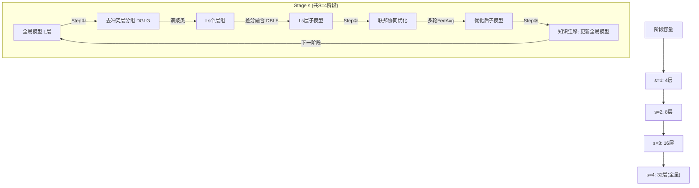

### DevFT — 发育式联邦微调 (Developmental Federated Tuning)

```yaml
id: devft
name: DevFT
full_name: 发育式联邦微调 (Developmental Federated Tuning)
year: "2026"
org: University of Macau, KAIST, HKUST
paper_url: https://openreview.net/forum?id=htbzmulSaG
category: efficiency
parent: fedavg
motivation: 将联邦微调分解为多个发育阶段，每阶段仅优化递增容量的子模型，大幅降低边缘设备的计算和通信开销
```

#### 📝 一句话总结

DevFT 借鉴人类认知发育的渐进式学习理念，将 LLM 联邦微调分解为多个阶段，每阶段通过去冲突层分组和差分层融合构建递增容量的子模型进行协同优化，实现 4.59× 更快收敛、10.67× 通信开销降低和 9.07% 平均性能提升。

#### 🎯 核心要点

- **发育式训练范式**：将联邦微调分为 S=4 个阶段，子模型容量逐阶段翻倍（LLaMA2-7B: {4, 8, 16, 32} 层），从紧凑基础逐步培育完整模型
- **去冲突层分组 (DGLG)**：基于层间余弦相似度构建图，通过谱聚类（Laplacian 特征分解 + k-means）将参数冲突最小的层聚为一组
- **差分层融合 (DBLF)**：以组内首层为锚点，仅融合其他层相对于锚点的差分信息，公式为 $\vartheta_{g_n} = \theta_{\text{anchor}} + \beta \sum_{j \in g_n}(\theta_j - \theta_{\text{anchor}})$，消除冗余同时保留各层独特语义
- **跨阶段知识迁移**：每阶段结束后将代表层的知识（LoRA 参数）同步回组内所有层，更新全局模型作为下阶段基础
- **广泛兼容性**：可与 FedIT、FedSA-LoRA 等现有联邦微调方法无缝结合，作为通用效率增强插件

#### 🔬 深入细节



```python
# DevFT 算法伪代码
def DevFT(global_model, stages=4, beta=0.1):
    """
    global_model: L层的预训练LLM (含LoRA参数)
    stages: 发育阶段数 S
    capacities: 各阶段子模型层数, e.g., [4, 8, 16, 32]
    """
    capacities = [L // (2**(stages-s)) for s in range(1, stages+1)]  # 逐阶段翻倍
    
    for s in range(stages):
        Ls = capacities[s]
        
        # === Step 1: 子模型构建 ===
        # 1a. 去冲突层分组 (DGLG)
        W = compute_similarity_matrix(global_model)  # W[i,j] = cos(θ_i, θ_j)
        D = diag(W.sum(axis=1))
        Laplacian = D - W
        eigenvalues, eigenvectors = eig(Laplacian)
        E = eigenvectors[:, :Ls]  # 取最小Ls个特征值对应的特征向量
        groups = kmeans(E, k=Ls)  # {g1, g2, ..., gLs}
        
        # 1b. 差分层融合 (DBLF)
        submodel_layers = []
        for gn in groups:
            anchor = gn[0]  # 组内首层为锚点
            representative = theta[anchor] + beta * sum(
                theta[j] - theta[anchor] for j in gn
            )
            submodel_layers.append(representative)
        submodel = concatenate(submodel_layers)  # Ls层子模型
        
        # === Step 2: 协同优化 ===
        for round_t in range(rounds_per_stage):
            selected_clients = sample(clients, fraction=C)
            for client_k in selected_clients:
                local_model = client_update(client_k, submodel)  # 本地LoRA微调
            submodel = fedavg_aggregate(local_models)  # 加权聚合
        
        # === Step 3: 知识迁移 ===
        for n, gn in enumerate(groups):
            for layer_j in gn:
                # 用代表层的LoRA参数更新组内所有层
                global_model.lora[layer_j] = submodel_layers[n].lora
    
    return global_model
```

**动机与背景**

联邦微调 LLM 面临严峻的资源瓶颈：即使使用 LoRA 等参数高效方法，端到端微调 LLaMA2-7B 仍需约 18GB 显存和大量通信带宽。现有方法（如 FedIT、FLoRA）虽降低了可训练参数量，但仍需在每轮通信中传输完整模型的 LoRA 参数，且前向/反向传播仍遍历所有层。DevFT 的核心洞察是：**不必从一开始就训练完整模型**——类比人类认知发育从简单到复杂的渐进过程，可以先训练小模型再逐步扩展。

**Step ①: 子模型构建的两大技术**

**去冲突层分组 (DGLG)** 的核心问题是：如何将 L 层压缩为 Ls 层而最小化信息损失？关键观察是，如果两层参数方向相反（余弦相似度为负），融合时会相互抵消。因此 DGLG 将参数方向一致的层聚为一组：

$$\text{sim}(\theta_i, \theta_j) = \frac{\langle \theta_i, \theta_j \rangle}{\|\theta_i\| \|\theta_j\|}$$

构建相似度矩阵 $W$ 后，通过谱聚类求解最小切割问题（Eq. 2），使组间相似度之和最小化（等价于组内相似度最大化）。

**差分层融合 (DBLF)** 解决的问题是：给定一组相似层，如何生成一个高保真代表层？朴素的均值融合会引入冗余（相似层共享大量信息）。DBLF 的策略是只融合"差异信息"：

$$\vartheta_{g_n} = \theta_{\text{anchor}} + \beta \sum_{j \in g_n}(\theta_j - \theta_{\text{anchor}})$$

其中 $\beta$ 是加权因子（LLaMA2-7B 取 0.1），$\theta_{\text{anchor}}$ 是组内第一层。直觉上，这相当于在锚点基础上叠加组内各层的"独特贡献"，而非重复叠加共享信息。

**Step ③: 知识迁移的设计逻辑**

每阶段优化后的代表层编码了该组所有层的联合知识。由于组内层本身参数分布相似（DGLG 保证），将代表层的 LoRA 参数直接赋值给组内所有层是合理的——这为下一阶段的更大子模型提供了优化过的初始化，避免从头训练。

**效率分析**

| 指标 | FedIT (端到端) | DevFT |
|------|---------------|-------|
| 平均训练层数 | 32 | (4+8+16+32)/4 = 15 |
| 通信参数量 | 32层LoRA × R轮 | 加权平均约 3× 降低 |
| 收敛速度 | 基准 | 4.59× 更快 |
| 通信开销 | 基准 | 10.67× 降低 |

**实验亮点**

- 在 LLaMA2-7B/LLaMA3.1-8B/LLaMA2-13B 三种模型上均显著超越 6 种基线方法
- LLaMA3.1-8B 上 close-ended 平均 64.25% vs 次优 FedSA-LoRA 的 60.97%（+3.28%）
- 消融实验表明：增长率过快（如 ×4、×8）会显著损害性能（LLaMA2-13B 下降 11.6%），验证了"渐进发育"的必要性
- 可扩展至 BERT/RoBERTa + 10000 设备场景，平均提升 2.69%

**与相关方法的关键区别**

| 方法 | 策略 | 局限 |
|------|------|------|
| ProgFed | 逐块解冻训练 | 无层融合，块间无知识迁移 |
| FLoRA | 异构 LoRA rank | 仍需端到端前向传播 |
| FedSA-LoRA | 冻结 A 矩阵只训 B | 不减少计算层数 |
| **DevFT** | 发育式子模型 + 层融合 | 需额外谱聚类开销（可忽略） |

#### 🧪 练习题

```yaml
question: "在 DevFT 的差分层融合 (DBLF) 中，为什么不直接对组内所有层取平均，而要采用'锚点 + 差分'的策略？"
options:
  - "因为平均操作计算量太大"
  - "因为组内层高度相似，直接平均会引入大量冗余信息，而差分策略只融合各层的独特贡献"
  - "因为平均操作会改变模型的总参数量"
  - "因为差分操作可以自动选择最重要的层"
answer: 1
explain: "DGLG 保证组内层参数方向高度一致，这意味着它们共享大量相似信息。直接平均等价于重复叠加这些共享信息，产生冗余。DBLF 通过计算各层相对于锚点的差分 (θ_j - θ_anchor)，只提取每层的'独特语义贡献'，再以加权因子 β 融入锚点，从而在消除冗余的同时保留各层的关键特征。"
```