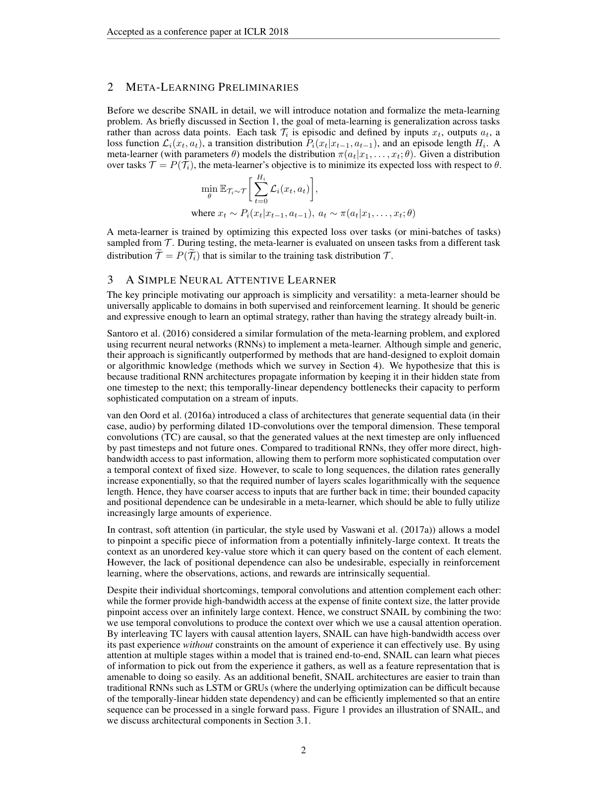

### SNAIL: 简单神经注意力元学习器 (A Simple Neural Attentive Meta-Learner)

```yaml
id: snail
name: SNAIL
full_name: "A Simple Neural Attentive Meta-Learner"
year: 2018
organization: "UC Berkeley / OpenAI"
paper_url: "https://arxiv.org/abs/1707.03141"
category: meta_learning
parent: null
motivation: "结合时间卷积与注意力机制构建通用元学习器，统一处理少样本分类与强化学习任务"
```

#### 📝 一句话总结

SNAIL 将元学习问题统一建模为序列到序列问题，通过交错堆叠**因果膨胀时间卷积**（提供有限上下文的高带宽访问）与**因果软注意力**（提供无限上下文的精确定位），构建了一个通用的、端到端可训练的元学习架构，在少样本分类和强化学习任务上均达到当时最优。

#### 🎯 核心要点

1. **统一序列建模视角**：将元学习任务（无论是 N-way K-shot 分类还是 RL episode）统一表示为时序序列 \((x_1, y_1, x_2, y_2, \ldots, x_T)\)，元学习器的目标是根据历史上下文预测当前样本的标签/动作。

2. **时间卷积（TC）提供局部高带宽**：采用 WaveNet 风格的因果膨胀卷积，膨胀率按 \(1, 2, 4, \ldots, 2^{\lfloor\log_2 T\rfloor}\) 指数增长，使得感受野以对数深度覆盖整个序列长度 \(T\)，同时每层输出拼接（DenseNet 连接）保留所有中间特征。

3. **注意力机制提供全局精确定位**：引入 Transformer 风格的 Key-Value 自注意力（因果掩码），使模型能在无限长上下文中精确检索相关信息，弥补 TC 固定感受野的局限。

4. **TC + Attention 互补交错**：单独使用 TC 受限于固定上下文窗口；单独使用 Attention 缺乏位置感知和高带宽聚合能力。两者交错堆叠实现互补——TC 先聚合局部模式，Attention 再在全局范围内精确匹配。

5. **通用性验证**：同一架构在少样本分类（Omniglot 99.07% 5-way 1-shot；Mini-ImageNet 55.71% 5-way 1-shot）和 RL（多臂赌博机、表格 MDP、视觉导航、连续控制）上均超越专门设计的方法（MAML、Matching Networks、RL²）。

#### 🔬 深入细节

**架构示意图**（论文 Figure 1）：



> 图示：SNAIL 架构由交错的 TCBlock 和 AttentionBlock 组成。TCBlock 内部包含多个 DenseBlock（因果膨胀卷积 + 门控激活 + 拼接），AttentionBlock 使用因果掩码的多头 Key-Value 注意力。输入序列经嵌入后依次通过这些模块，最终输出预测。

**核心伪代码**：

```
Algorithm: SNAIL Forward Pass
━━━━━━━━━━━━━━━━━━━━━━━━━━━━━━━━━━━━━━━━━━━━━━━━
Input: 序列 X = [(x₁,y₁), (x₂,y₂), ..., (xₜ,?)]  # 最后一个无标签
Output: 对 xₜ 的预测 ŷₜ

1. Embedding:
   H⁰ = Embed(X)                    # 图像用CNN, 状态用MLP

2. 交错 TC + Attention (L 层):
   for l = 1 to L:
     # --- TCBlock ---
     H_tc = H^(l-1)
     for r in [1, 2, 4, ..., 2^⌊log₂T⌋]:
       Z = CausalDilatedConv1D(H_tc, dilation=r, filters=D)
       Z = gate(Z) ⊙ sigmoid(Z)     # 门控激活
       H_tc = Concat(H_tc, Z)        # DenseNet 拼接
     
     # --- AttentionBlock ---
     K = Linear_K(H_tc)              # Keys:   T × d_k
     V = Linear_V(H_tc)              # Values: T × d_v
     Q = Linear_Q(H_tc)              # Queries:T × d_k
     A = CausalSoftmax(Q·Kᵀ / √d_k) # 因果掩码: A[i,j]=0 if j>i
     H^l = Concat(H_tc, A·V)         # 拼接注意力输出

3. Output:
   ŷₜ = Softmax(Linear(H^L[t]))     # 分类任务
   # 或 πₜ = Policy(H^L[t])          # RL 任务
━━━━━━━━━━━━━━━━━━━━━━━━━━━━━━━━━━━━━━━━━━━━━━━━
```

**方法详解**：

**段落一：问题建模与动机。** SNAIL 的核心洞察在于将元学习重新定义为一个序列到序列的问题。在传统元学习框架中，模型需要从少量支持集样本中"学习如何学习"。SNAIL 将支持集中的 \((x_i, y_i)\) 对和查询样本 \(x_t\) 按时间顺序排列成一个序列，元学习器的任务就是根据前面所有的上下文来预测当前位置的输出。这一建模方式的优雅之处在于：它将少样本分类和强化学习中的 episode 学习统一到同一个框架下——在分类中序列是 \((x_1, y_1, \ldots, x_T)\)，在 RL 中序列是 \((s_1, a_1, r_1, s_2, a_2, r_2, \ldots)\)。然而，这种序列建模面临一个关键挑战：模型需要同时具备对长程依赖的建模能力（能"记住"序列开头的样本）和对局部模式的高效聚合能力（能快速提取特征模式）。纯 RNN 方法（如 MANN、RL²）受限于信息瓶颈，而纯 Transformer 在当时缺乏对序列结构的归纳偏置。

**段落二：时间卷积模块的设计。** TCBlock 借鉴了 WaveNet 的因果膨胀卷积设计。具体而言，一个 DenseBlock 包含：(1) 一个膨胀率为 \(R\)、滤波器数为 \(D\) 的因果一维卷积；(2) 门控激活函数 \(\tanh(W_f * x) \odot \sigma(W_g * x)\)；(3) 将输出与输入拼接（DenseNet 风格的跳跃连接）。一个 TCBlock 由一系列 DenseBlock 组成，膨胀率从 1 指数增长到 \(2^{\lfloor\log_2 T\rfloor}\)，使得仅需 \(\mathcal{O}(\log T)\) 层即可覆盖长度为 \(T\) 的完整序列。这种设计的优势在于：(a) 因果性保证了自回归属性，模型不会"偷看"未来信息；(b) 膨胀卷积以对数深度实现线性感受野增长，计算效率高；(c) DenseNet 拼接保留了所有层级的特征，避免信息丢失。但 TC 的局限也很明显——它的上下文访问是"有限带宽"的，对于超出感受野的位置无法直接访问，且对所有历史位置的权重是固定的（由卷积核决定），无法根据内容动态调整注意力。

**段落三：注意力模块与 TC 的互补。** AttentionBlock 采用 Vaswani et al. (2017) 提出的缩放点积注意力机制。对于输入序列的每个时间步，模型计算 Query、Key、Value 三组线性投影，然后通过 \(\text{Attention}(Q, K, V) = \text{softmax}(QK^\top / \sqrt{d_k}) V\) 计算注意力加权输出。关键的设计是**因果掩码**：将注意力矩阵中 \(j > i\) 的位置设为 \(-\infty\)（softmax 后为 0），确保每个位置只能关注它之前的位置。注意力机制的核心优势是"无限上下文的精确定位"——无论序列多长，模型都可以通过内容匹配精确找到最相关的历史信息。但纯注意力的劣势在于：(a) 缺乏对局部模式的归纳偏置，需要大量数据学习位置关系；(b) 计算复杂度为 \(\mathcal{O}(T^2)\)；(c) 对序列中的渐进模式（如 RL 中的奖励趋势）建模效率低。SNAIL 通过将 TC 和 Attention 交错堆叠来实现互补：TC 层先在局部窗口内高效聚合特征模式（如"这个类别的样本长什么样"），然后 Attention 层在全局范围内精确匹配（如"找到与当前查询最相似的支持集样本"）。实验证明，去掉任何一个组件都会导致性能显著下降。

**段落四：训练策略与应用。** 在少样本分类中，SNAIL 的训练采用 episodic training：每个 episode 随机采样 N 个类别各 K 个样本作为支持集，再采样查询样本。序列中支持集样本的标签 \(y_i\) 被拼接到对应 \(x_i\) 的嵌入中（one-hot 编码），而查询样本的标签位置填零。模型通过交叉熵损失端到端训练。在强化学习中，SNAIL 作为策略网络，输入是 \((s_t, a_{t-1}, r_{t-1})\) 的序列，输出当前动作的分布。训练时使用 TRPO/PPO 等策略梯度方法，外层循环采样不同的 MDP 实例（如不同的迷宫布局），内层循环在单个 MDP 上运行多个 episode。SNAIL 在 Omniglot 5-way 1-shot 上达到 99.07%（超越 MAML 的 98.7%），在 Mini-ImageNet 5-way 1-shot 上达到 55.71%（超越 Meta-Learner LSTM 的 43.44%），在多臂赌博机问题上接近贝叶斯最优策略 Gittins Index，在视觉导航和连续控制任务上也显著优于 RL² 和 MAML。

#### 🧪 练习题

**Q: SNAIL 中时间卷积（TC）模块的膨胀率设置为指数增长序列 \(1, 2, 4, \ldots, 2^{\lfloor\log_2 T\rfloor}\)，这样设计的主要目的是什么？**

- A. 减少模型参数量，使卷积核共享权重
- B. 以对数深度覆盖整个序列长度的感受野，实现高效的长程依赖建模
- C. 增加模型的非线性表达能力，类似于深度残差网络
- D. 使每一层的计算复杂度相同，便于并行化训练

**答案：B**

> **解析**：膨胀率按 \(2^0, 2^1, \ldots, 2^{\lfloor\log_2 T\rfloor}\) 指数增长，使得 \(\lceil\log_2 T\rceil\) 层卷积的累积感受野恰好覆盖长度为 \(T\) 的整个序列。这是 WaveNet 中的经典设计，核心目的是以 \(\mathcal{O}(\log T)\) 的深度实现 \(\mathcal{O}(T)\) 的感受野，从而高效建模长程依赖。选项 A 与膨胀率无关（参数量由滤波器数决定）；选项 C 描述的是深度网络的一般性质而非膨胀卷积的特定目的；选项 D 不正确，因为不同膨胀率层的计算量相同是卷积本身的性质，而非指数增长设计的目的。