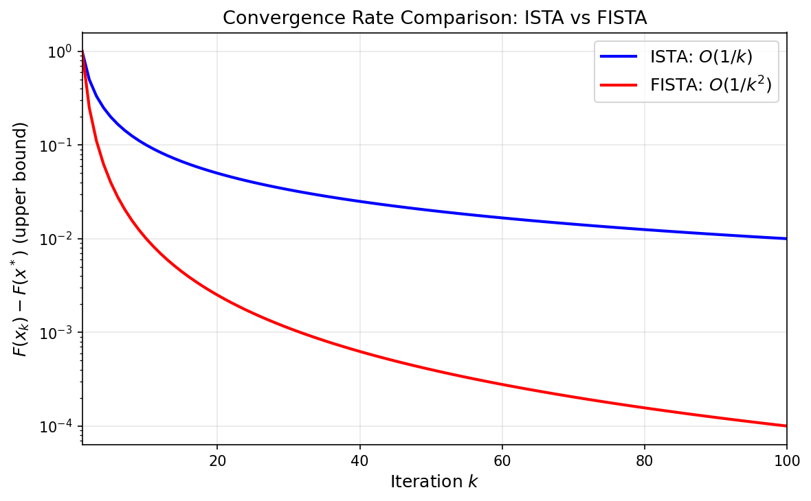

### 快速迭代收缩阈值算法 (FISTA)

```yaml
id: fista
name: FISTA
full_name: 快速迭代收缩阈值算法 (FISTA)
year: '2009'
org: Technion
paper_url: https://epubs.siam.org/doi/10.1137/080716542
category: convex
parent: nag
motivation: Nesterov动量加速近端梯度至O(1/k²)
```

#### 📝 一句话总结

FISTA 将 Nesterov 加速梯度技术引入近端梯度框架（ISTA），在不增加每步计算代价的前提下，将复合凸优化问题的收敛速率从 \(O(1/k)\) 提升至 \(O(1/k^2)\)，达到一阶方法的最优理论复杂度。

#### 🎯 核心要点

- **问题框架**：求解复合凸优化 \(\min_x F(x) = f(x) + g(x)\)，其中 \(f\) 光滑凸、\(g\) 凸但可能不光滑（如 \(\ell_1\) 范数）
- **基础算法 ISTA**：迭代收缩阈值算法，即近端梯度法，收敛速率为 \(O(1/k)\)
- **Nesterov 动量加速**：通过特定的外推步（momentum step）构造辅助序列，将收敛速率加速至 \(O(1/k^2)\)
- **步长序列**：引入序列 \(t_k = \frac{1 + \sqrt{1 + 4t_{k-1}^2}}{2}\)，控制外推步长
- **最优复杂度**：\(O(1/k^2)\) 是一阶方法在光滑凸优化中的理论下界（Nesterov 1983），FISTA 达到此最优
- **广泛适用**：适用于 LASSO、压缩感知、图像去模糊、矩阵补全等大量线性逆问题
- **计算开销不变**：相比 ISTA，每步仅多一次向量加减运算，几乎无额外代价

#### 🔬 深入细节


*图：ISTA（蓝色，\(O(1/k)\)）与 FISTA（红色，\(O(1/k^2)\)）的目标函数值上界随迭代次数的衰减对比。FISTA 在相同迭代次数下能获得显著更高的精度。*

##### 算法伪代码

```python
# FISTA - Fast Iterative Shrinkage-Thresholding Algorithm
# 输入: f(x) 光滑凸函数, g(x) 非光滑凸函数, L = Lipschitz常数
# 目标: min F(x) = f(x) + g(x)

def FISTA(grad_f, prox_g, x0, L, max_iter):
    x = x0
    y = x0
    t = 1.0
    
    for k in range(1, max_iter + 1):
        x_new = prox_g(y - (1/L) * grad_f(y), 1/L)  # 近端梯度步
        t_new = (1 + sqrt(1 + 4 * t**2)) / 2         # 更新步长参数
        y = x_new + ((t - 1) / t_new) * (x_new - x)  # 外推步（动量）
        x = x_new
        t = t_new
    
    return x
```

##### 动机与背景

许多信号处理和机器学习问题可以建模为复合凸优化问题：

$$\min_{x \in \mathbb{R}^n} F(x) = f(x) + g(x)$$

其中 \(f(x)\) 是具有 Lipschitz 连续梯度的光滑凸函数（如最小二乘项 \(\frac{1}{2}\|Ax - b\|^2\)），\(g(x)\) 是凸但可能不可微的正则项（如 \(\ell_1\) 范数 \(\lambda\|x\|_1\) 促进稀疏性）。

传统的近端梯度法（ISTA）通过交替执行梯度下降步和近端算子来求解此问题，但其收敛速率仅为 \(O(1/k)\)——即经过 \(k\) 次迭代后，\(F(x_k) - F(x^*) \leq O(L\|x_0 - x^*\|^2 / k)\)。对于高精度需求的应用场景，这一速率往往不够快。

> 💡 **关键**：Nesterov 在 1983 年证明了一阶方法在光滑凸优化中的最优复杂度下界为 \(O(1/k^2)\)，并给出了达到此下界的加速梯度法。Beck 和 Teboulle 的贡献在于将这一加速思想优雅地推广到**非光滑复合优化**框架中。

##### 核心机制：从 ISTA 到 FISTA

**1. ISTA（近端梯度法）**

ISTA 的每步迭代为：

$$x_{k} = \text{prox}_{t_k g}\left(x_{k-1} - t_k \nabla f(x_{k-1})\right)$$

其中近端算子定义为：

$$\text{prox}_{\lambda g}(v) = \arg\min_x \left\{ g(x) + \frac{1}{2\lambda}\|x - v\|^2 \right\}$$

对于 \(g(x) = \lambda\|x\|_1\)（LASSO 问题），近端算子即为软阈值算子：

$$\text{prox}_{\lambda\|\cdot\|_1}(v)_i = \text{sign}(v_i) \cdot \max(|v_i| - \lambda, 0)$$

ISTA 的收敛速率为：

$$F(x_k) - F(x^*) \leq \frac{L\|x_0 - x^*\|^2}{2k}$$

**2. FISTA 的加速机制**

FISTA 的核心创新在于引入一个**辅助点序列** \(\{y_k\}\)，在执行近端梯度步之前先进行外推：

$$y_k = x_{k-1} + \frac{t_{k-1} - 1}{t_k}(x_{k-1} - x_{k-2})$$

$$x_k = \text{prox}_{(1/L) g}\left(y_k - \frac{1}{L}\nabla f(y_k)\right)$$

其中步长参数 \(t_k\) 满足递推关系：

$$t_k = \frac{1 + \sqrt{1 + 4t_{k-1}^2}}{2}, \quad t_1 = 1$$

> ⚠️ **注意**：外推系数 \(\frac{t_{k-1} - 1}{t_k}\) 随迭代逐渐趋近于 1（但始终小于 1），这意味着动量效应逐步增强。当 \(k\) 较大时，\(t_k \approx k/2\)，外推系数约为 \(\frac{k-2}{k+1}\)，与 Nesterov 原始加速梯度法的系数一致。

**3. 收敛速率证明的核心思想**

FISTA 的收敛保证为：

$$F(x_k) - F(x^*) \leq \frac{2L\|x_0 - x^*\|^2}{(k+1)^2}$$

证明的关键在于构造一个 Lyapunov 函数（能量函数）：

$$E_k = t_k^2 \left(F(x_k) - F(x^*)\right) + \frac{L}{2}\|v_k - x^*\|^2$$

其中 \(v_k\) 是一个辅助变量。通过证明 \(E_k\) 单调不增（\(E_k \leq E_{k-1}\)），结合 \(t_k \geq (k+1)/2\) 的增长速率，即可得到 \(O(1/k^2)\) 的收敛界。

##### 步长参数 \(t_k\) 的直觉理解

步长序列 \(t_k\) 的设计是 FISTA 的精髓所在。其递推关系 \(t_k^2 - t_k \leq t_{k-1}^2\) 保证了：

1. **能量守恒**：每步迭代中，"动能"（外推带来的惯性）和"势能"（目标函数值）之间的转换是受控的
2. **渐进加速**：\(t_k\) 以 \(O(k)\) 速率增长，使得外推步长逐渐增大，算法越来越"大胆"
3. **稳定性**：外推系数始终小于 1，避免过度外推导致发散

> 💡 **关键**：FISTA 的加速本质上是一种"惯性效应"——利用前两步的位移信息预测下一步的方向，类似于物理中的动量。这与 Nesterov 加速梯度法（NAG）的思想一脉相承，但 FISTA 将其推广到了近端算子框架。

##### 与 ISTA 及其他方法的对比

| 特性 | ISTA（近端梯度） | FISTA（加速近端梯度） | Nesterov AG |
|------|-----------------|---------------------|-------------|
| 适用问题 | \(f + g\)，\(g\) 非光滑 | \(f + g\)，\(g\) 非光滑 | 仅光滑 \(f\) |
| 收敛速率 | \(O(1/k)\) | \(O(1/k^2)\) | \(O(1/k^2)\) |
| 每步计算 | 1次梯度 + 1次prox | 1次梯度 + 1次prox + 向量运算 | 1次梯度 + 向量运算 |
| 是否最优 | 否 | 是（一阶最优） | 是（一阶最优） |
| 单调性 | 目标值单调下降 | 目标值**非单调** | 目标值非单调 |

> ⚠️ **注意**：FISTA 的目标函数值序列 \(\{F(x_k)\}\) 不一定单调递减，这是加速方法的固有特征。后续工作（如 MFISTA，Beck & Teboulle 2009b）通过额外的投影步恢复了单调性，但代价是每步多一次近端算子计算。

##### 实际应用：LASSO 与压缩感知

FISTA 最经典的应用场景是 LASSO 问题：

$$\min_x \frac{1}{2}\|Ax - b\|_2^2 + \lambda\|x\|_1$$

此时 \(f(x) = \frac{1}{2}\|Ax - b\|_2^2\)，\(\nabla f(x) = A^T(Ax - b)\)，Lipschitz 常数 \(L = \|A^TA\|\)（最大特征值），近端算子为软阈值。FISTA 在压缩感知、图像去模糊、信号恢复等领域取得了广泛应用，成为稀疏优化的标准求解器之一。

#### 🧪 练习题

```yaml
question: "FISTA 相比 ISTA 的核心改进是什么？"
options:
  - "使用更精确的线搜索确定步长"
  - "引入外推步（动量），在近端梯度步之前对当前点进行外推"
  - "使用二阶信息（Hessian）加速收敛"
  - "通过自适应学习率为每个参数分配不同步长"
answer: 1
explain: "FISTA 的核心创新是在每步近端梯度计算前，利用前两步迭代点的差值进行外推（动量步），从而将收敛速率从 O(1/k) 加速至 O(1/k²)，而无需任何二阶信息。"
```