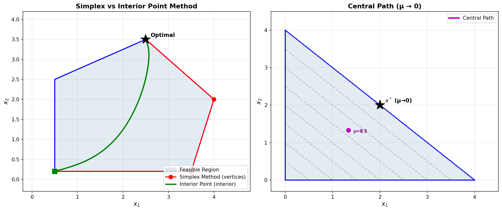

### 内点法 (Interior Point Method)

```yaml
id: interior_point
name: Interior Point
full_name: 内点法 (Interior Point Method)
year: '1984'
org: AT&T Bell Labs
paper_url: https://en.wikipedia.org/wiki/Karmarkar%27s_algorithm
category: convex
parent: —
motivation: 首个多项式时间线性规划算法
```

#### 📝 一句话总结

内点法通过在可行域内部沿中心路径（Central Path）迭代逼近最优解，利用障碍函数将约束融入目标函数，以多项式时间复杂度求解线性规划及一般凸优化问题，彻底改变了数学规划的理论格局与实践范式。

#### 🎯 核心要点

- **核心思想**：不同于单纯形法沿多面体顶点搜索，内点法从可行域严格内部出发，沿中心路径逐步逼近最优解
- **障碍函数**：通过对数障碍函数 \(\phi(x) = -\sum_{i} \ln(s_i)\) 将不等式约束隐式编码进目标函数，使约束边界产生无穷大"势垒"
- **中心路径**：参数化曲线 \(\{x(\mu) : \mu > 0\}\)，当障碍参数 \(\mu \to 0\) 时收敛至原问题最优解
- **多项式复杂度**：Karmarkar 原始算法复杂度为 \(O(n^{3.5} L)\)，现代原始-对偶方法达到 \(O(n^3 \sqrt{n} \log(1/\epsilon))\)
- **牛顿步**：每次迭代求解一个线性方程组（KKT 系统），本质上是在障碍目标函数上做牛顿法
- **历史意义**：1984 年 Karmarkar 在 AT&T Bell Labs 提出，是继 Khachiyan 椭球法（1979）后第二个多项式时间 LP 算法，但首个在实践中能与单纯形法竞争的多项式算法

#### 🔬 深入细节


*图 1：左图展示单纯形法（沿多面体顶点跳转，红色）与内点法（穿越可行域内部，绿色）的搜索路径对比；右图展示中心路径随障碍参数 μ→0 逐步收敛到最优解 x* 的过程。*

##### 算法伪代码

```python
# === 原始-对偶内点法 (Primal-Dual Interior Point Method) ===
# 求解标准形式线性规划: min c^T x, s.t. Ax = b, x >= 0

import numpy as np

def interior_point_lp(A, b, c, tol=1e-8, max_iter=100):
    """
    原始-对偶内点法求解线性规划
    min c^T x  s.t. Ax = b, x >= 0
    """
    m, n = A.shape
    # 初始化：严格可行内点
    x = np.ones(n)          # 原始变量 x > 0
    lam = np.zeros(m)       # 对偶变量 (等式约束乘子)
    s = np.ones(n)          # 松弛变量 s > 0 (对偶松弛)
    
    for k in range(max_iter):
        # 计算互补间隙 (duality gap)
        mu = np.dot(x, s) / n
        if mu < tol:
            break
        
        # 中心化参数 (centering parameter)
        sigma = 0.3  # 典型取值 0.1 ~ 0.5
        
        # 构造 KKT 系统的右端项 (残差)
        r_b = A @ x - b                    # 原始可行性残差
        r_c = A.T @ lam + s - c            # 对偶可行性残差
        r_xs = x * s - sigma * mu          # 互补松弛残差
        
        # 求解牛顿方程组 (正规方程形式)
        # [0   A^T  I ] [dx  ]   [-r_c ]
        # [A   0    0 ] [dlam] = [-r_b ]
        # [S   0    X ] [ds  ]   [-r_xs]
        X_inv_S = s / x  # 对角矩阵 X^{-1}S 的对角元素
        
        # 消元得到正规方程: (A * diag(x/s) * A^T) dlam = rhs
        D = x / s
        M = A @ np.diag(D) @ A.T
        rhs = -r_b - A @ np.diag(D) @ (r_c - r_xs / x)
        dlam = np.linalg.solve(M, rhs)
        
        # 回代求 ds, dx
        ds = -r_c - A.T @ dlam
        dx = -(r_xs + x * ds) / s
        
        # 步长选择 (保证 x + alpha*dx > 0, s + alpha*ds > 0)
        alpha_p = min(1.0, 0.99 * min(-x[dx < 0] / dx[dx < 0], default=1.0))
        alpha_d = min(1.0, 0.99 * min(-s[ds < 0] / ds[ds < 0], default=1.0))
        
        # 更新
        x += alpha_p * dx
        lam += alpha_d * dlam
        s += alpha_d * ds
    
    return x, lam, s
```

##### 动机与背景

**线性规划的求解历史**

线性规划（Linear Programming, LP）是运筹学与优化理论的核心问题：

$$\min_{x} c^T x \quad \text{s.t.} \quad Ax = b, \; x \geq 0$$

1947 年 Dantzig 提出的**单纯形法**（Simplex Method）在实践中表现优异，但其最坏情况复杂度为指数级——Klee-Minty 构造的反例表明，单纯形法可能需要遍历指数多个顶点。这引发了一个基本理论问题：**线性规划是否属于 P 类问题？**

1979 年，Khachiyan 提出**椭球法**（Ellipsoid Method），首次证明 LP 可在多项式时间内求解，复杂度为 \(O(n^4 L)\)。然而椭球法实际运行极慢，无法与单纯形法竞争。

**Karmarkar 的突破（1984）**

1984 年，AT&T Bell Labs 的 Narendra Karmarkar 发表了划时代论文 *"A New Polynomial-Time Algorithm for Linear Programming"*，提出了一种全新的多项式时间算法，其复杂度为 \(O(n^{3.5} L)\)，且在实践中能与单纯形法媲美甚至超越。这一成果引发了优化领域的革命。

Karmarkar 算法的核心洞察是：**不在可行多面体的顶点之间跳转，而是穿越可行域的内部**。通过射影变换将当前点映射为可行域的"中心"，然后在变换空间中沿最速下降方向移动，再映射回原空间。

##### 核心机制

**1. 对数障碍函数与障碍问题**

内点法的现代形式基于**障碍方法**（Barrier Method）。对于带不等式约束的优化问题：

$$\min_{x} f(x) \quad \text{s.t.} \quad g_i(x) \leq 0, \; i = 1, \ldots, m$$

构造对数障碍函数：

$$B(x, \mu) = f(x) - \mu \sum_{i=1}^{m} \ln(-g_i(x))$$

其中 \(\mu > 0\) 是障碍参数。当 \(x\) 接近约束边界（\(g_i(x) \to 0\)）时，\(-\ln(-g_i(x)) \to +\infty\)，形成"无穷势垒"，阻止迭代点离开可行域内部。

> 💡 **关键**：对数障碍函数是**自协调函数**（self-concordant function），这一性质保证了牛顿法在其上具有二次收敛速率，且步长选择不依赖于未知的 Lipschitz 常数。

**2. 中心路径 (Central Path)**

对于线性规划的标准形式，中心路径定义为一族参数化的最优解：

$$x(\mu) = \arg\min_{Ax=b, x>0} \left\{ c^T x - \mu \sum_{i=1}^{n} \ln x_i \right\}$$

中心路径上的点满足修正的 KKT 条件：

$$Ax = b, \quad A^T \lambda + s = c, \quad x_i s_i = \mu \quad \forall i$$

当 \(\mu \to 0\) 时，\(x(\mu)\) 收敛到原始 LP 的最优解。内点法的本质就是**沿中心路径追踪**：逐步减小 \(\mu\)，用牛顿法求解每个 \(\mu\) 对应的修正 KKT 系统。

**3. 原始-对偶方法 (Primal-Dual Method)**

现代内点法的主流形式是原始-对偶方法，同时更新原始变量 \(x\)、对偶变量 \(\lambda\) 和松弛变量 \(s\)。每次迭代求解如下牛顿方程组：

$$\begin{bmatrix} 0 & A^T & I \\ A & 0 & 0 \\ S & 0 & X \end{bmatrix} \begin{bmatrix} \Delta x \\ \Delta \lambda \\ \Delta s \end{bmatrix} = \begin{bmatrix} c - A^T\lambda - s \\ b - Ax \\ \sigma\mu e - XSe \end{bmatrix}$$

其中 \(X = \text{diag}(x)\)，\(S = \text{diag}(s)\)，\(\sigma \in (0,1)\) 是中心化参数。

> ⚠️ **注意**：每次迭代的计算瓶颈是求解 \(m \times m\) 的正规方程组 \((ADA^T)\Delta\lambda = \text{rhs}\)，其中 \(D = XS^{-1}\)。对于稀疏问题，可利用 Cholesky 分解高效求解。

**4. 收敛性分析**

内点法的迭代次数与问题规模的关系：

| 方法 | 迭代次数 | 每次迭代代价 | 总复杂度 |
|------|---------|------------|---------|
| Karmarkar 原始 (1984) | \(O(n \log(1/\epsilon))\) | \(O(n^{2.5})\) | \(O(n^{3.5} L)\) |
| 路径跟踪法 | \(O(\sqrt{n} \log(1/\epsilon))\) | \(O(n^3)\) | \(O(n^{3.5} L)\) |
| 原始-对偶法 | \(O(\sqrt{n} \log(1/\epsilon))\) | \(O(n^3)\) | \(O(n^{3.5} L)\) |
| 预测-校正法 (Mehrotra) | 实践中 20-80 次 | \(O(n^3)\) | 实践最优 |

> 💡 **关键**：内点法的迭代次数几乎与问题规模无关（通常 20-80 次），这与单纯形法形成鲜明对比——单纯形法的迭代次数在最坏情况下可达指数级，但平均情况下约为 \(O(m)\) 到 \(O(3m)\)。

**5. Karmarkar 原始算法的几何直觉**

Karmarkar 算法的核心步骤：

1. **射影变换**：将当前内点 \(x_k\) 映射为标准单纯形的中心（重心），使得在变换空间中各方向"等距"于约束边界
2. **最速下降**：在变换空间中，沿目标函数的投影梯度方向移动一步（投影到等式约束的零空间上）
3. **逆变换**：将新点映射回原空间，得到 \(x_{k+1}\)
4. **势函数递减**：证明每步使势函数 \(\Phi(x) = n \ln(c^T x - c^T x^*) - \sum \ln x_i\) 至少减少一个常数

这一过程保证了 \(O(n \log n)\) 次迭代后达到 \(\epsilon\)-最优。

##### 与其他方法的关系

| 方法 | 搜索区域 | 复杂度类 | 实践性能 | 适用范围 |
|------|---------|---------|---------|---------|
| 单纯形法 (1947) | 多面体顶点 | 指数（最坏） | 极快（平均） | LP |
| 椭球法 (1979) | 椭球体积缩减 | 多项式 | 极慢 | 凸优化（理论） |
| **内点法 (1984)** | **可行域内部** | **多项式** | **快** | **LP/QP/SDP/凸优化** |
| ADMM | 分裂-对偶 | — | 中等精度快 | 大规模分布式 |

内点法的影响远超线性规划：

- **二次规划 (QP)**：直接推广，求解 SVM 等问题
- **半定规划 (SDP)**：内点法是求解 SDP 的主流方法
- **二阶锥规划 (SOCP)**：广泛应用于信号处理、金融优化
- **一般凸优化**：Boyd & Vandenberghe 的经典教材将内点法作为凸优化的通用求解框架

##### 实践中的关键技术

**Mehrotra 预测-校正法**：实际求解器（如 CPLEX、Gurobi、MOSEK）中最常用的内点法变体。每次迭代分两步：
1. **预测步**（仿射缩放）：设 \(\sigma = 0\)，求解纯牛顿方向
2. **校正步**（中心化）：根据预测步的结果自适应选择 \(\sigma\)，修正搜索方向

这一技巧使得实际迭代次数通常仅需 20-50 次，与问题规模几乎无关。

#### 🧪 练习题

```yaml
question: "以下关于内点法的描述，哪一项是正确的？"
options:
  - "内点法沿可行多面体的顶点搜索最优解，与单纯形法的搜索策略相同"
  - "内点法的迭代次数通常随问题规模线性增长，大规模问题需要数千次迭代"
  - "内点法通过对数障碍函数将约束隐式编码进目标函数，沿中心路径从可行域内部逼近最优解"
  - "Karmarkar 算法是第一个证明线性规划属于 P 类问题的算法"
answer: 2
explain: "内点法的核心特征是利用对数障碍函数在可行域内部构造中心路径，通过逐步减小障碍参数使迭代点沿中心路径收敛到最优解。选项A错误（内点法在内部搜索，不走顶点）；选项B错误（迭代次数通常仅20-80次，几乎与规模无关）；选项D错误（第一个证明LP∈P的是Khachiyan的椭球法，1979年）。"
```