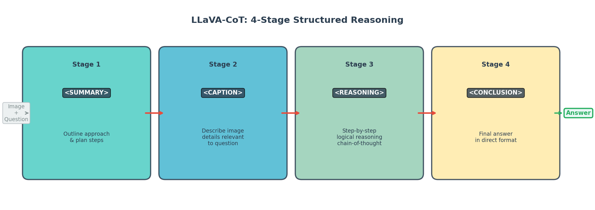
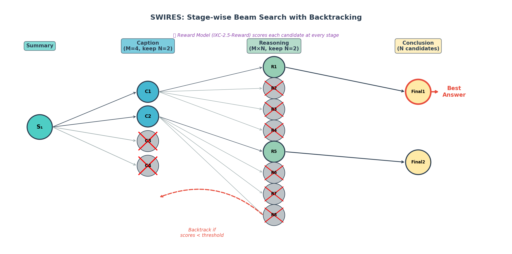

### LLaVA-CoT

```yaml
id: llava_cot
name: LLaVA-CoT
full_name: "LLaVA-CoT: Let Vision Language Models Reason Step-by-Step"
year: 2025
org: ByteDance
paper_url: "https://arxiv.org/abs/2411.10440"
category: mm_cot
parent: llava
motivation: "通过结构化四阶段推理（Summary→Caption→Reasoning→Conclusion）和阶段级测试时搜索，系统性提升视觉语言模型的多步推理准确性"
```

#### 📝 一句话总结

LLaVA-CoT 提出将视觉语言模型的推理过程分解为四个结构化阶段（摘要→描述→推理→结论），并配合阶段级束搜索与回溯机制（SWIRES），在仅 100k 训练数据的条件下使 11B 模型在多个推理基准上超越 GPT-4o-mini，实现了多模态 CoT 推理的系统性突破。

#### 🎯 核心要点

- **四阶段结构化推理**：将响应分为 `<SUMMARY>`、`<CAPTION>`、`<REASONING>`、`<CONCLUSION>` 四个 XML 标签包裹的阶段，强制模型先规划、再观察、再推理、最后总结
- **LLaVA-CoT-100k 数据集**：从 ShareGPT4V、ChartQA、A-OKVQA、GeoQA+ 等 10 个 VQA 数据集中筛选 99k 样本，由 GPT-4o 生成四阶段格式的推理标注
- **基座模型**：Llama-3.2-11B-Vision-Instruct，全参数 SFT，8×H100 训练
- **SWIRES（Stage-wise Beam Search with Backtracking）**：测试时在每个推理阶段生成多个候选、用奖励模型评分筛选、不满足阈值则回溯重试，实现阶段级 test-time scaling
- **奖励模型**：InternLM-XComposer2.5-Reward（IXC-2.5-Reward），用于在线评估各阶段输出质量
- **性能**：6 个基准平均从基座 56.6 提升至 62.4（训练后）→ 65.5（+SWIRES），在 MMStar、MMBench、MathVista 等推理密集型任务上超越 GPT-4o-mini 和 Gemini-1.5-pro
- **消融发现**：直接训练 CoT 数据（无标签）= 59.0，加标签但无结构 = 60.9，完整四阶段 = 62.4，证明结构化标签是关键

#### 🔬 深入细节

##### 动机与背景

当前视觉语言模型（VLM）在面对复杂推理任务时存在两个关键问题：

1. **仓促回答**：模型未充分组织问题信息就直接给出答案，例如 Llama-3.2-11B-Vision-Instruct 在看到"这个人接下来会做什么？"的问题时，误将选项中的"cry"理解为自杀倾向而拒绝回答
2. **推理偏离**：模型在推理过程中偏离逻辑路径，草率得出"问题无意义"等错误结论

这些问题的根源在于：VLM 缺乏系统性的推理框架来组织"看什么→想什么→怎么推→得什么"的完整思维链。传统的 CoT prompting 虽然在 LLM 中有效，但直接应用于 VLM 时效果有限（实验显示基座模型加 CoT 提示后平均分不变，仍为 56.9）。

> 💡 关键洞察：VLM 的推理不仅需要语言层面的链式思考，还需要在**视觉感知**和**逻辑推理**之间建立显式的阶段划分。

##### 核心方法：四阶段结构化推理


*图：LLaVA-CoT 将推理过程分解为 Summary → Caption → Reasoning → Conclusion 四个阶段*

LLaVA-CoT 的核心创新是将模型的推理过程显式分解为四个阶段，每个阶段用 XML 标签包裹：

**Stage 1 — Summary（问题摘要）**：模型首先概述解题思路，规划后续步骤。这迫使模型在回答前先"想清楚要做什么"，避免仓促回答。

**Stage 2 — Caption（视觉描述）**：模型描述图像中与问题相关的细节。这一阶段将视觉感知与推理解耦，确保模型充分"看清楚图片内容"。

**Stage 3 — Reasoning（逻辑推理）**：基于前两个阶段的信息，模型进行逐步的逻辑推理。这是传统 CoT 的核心部分，但因为有了前置的规划和观察，推理质量显著提升。

**Stage 4 — Conclusion（最终结论）**：给出简洁直接的最终答案。

模型输出格式示例：
```
<SUMMARY>我需要分析图中的几何关系来求解角度...</SUMMARY>
<CAPTION>图中显示一个三角形ABC，其中角A=60°，边AB上有一点D...</CAPTION>
<REASONING>由三角形内角和定理，角B+角C=120°。又因为AD是角平分线...</REASONING>
<CONCLUSION>角BDC = 120°</CONCLUSION>
```

> ⚠️ 注意：标签结构不是简单的 prompt 工程——模型通过 SFT 学会了在生成过程中自主切换阶段，标签成为模型内部推理流程的一部分。

##### 数据集构建：LLaVA-CoT-100k

数据集构建流程：

1. **来源选择**：从 10 个 VQA 数据集中采样，覆盖通用 VQA（ShareGPT4V, A-OKVQA）、图表理解（ChartQA, DVQA）、文档/OCR（DocVQA, SynthDoG-EN）、数学推理（GeoQA+, CLEVR-Math）、科学推理（AI2D）等多种任务类型
2. **GPT-4o 标注**：将原始问题、图像和标准答案提供给 GPT-4o，要求其按四阶段格式生成推理过程
3. **格式验证**：过滤不符合 XML 标签格式的输出
4. **答案一致性检查**：用 GPT-4o 验证生成的 CONCLUSION 与原始标准答案是否一致，过滤拒绝回答或答案不匹配的样本

最终得到约 99k 高质量样本。

##### 训练细节

| 参数 | 值 |
|------|-----|
| 基座模型 | Llama-3.2-11B-Vision-Instruct |
| 训练方式 | 全参数 SFT（FSDP） |
| 学习率 | \(1 \times 10^{-5}\) |
| Epochs | 3 |
| Batch size | 4 |
| Context length | 4096 |
| 混合精度 | True |
| 硬件 | 8 × H100 GPU |

##### SWIRES：阶段级测试时搜索


*图：SWIRES 在每个推理阶段生成多个候选，用奖励模型评分筛选，不满足条件则回溯*

SWIRES（Stage-wise Beam Search with Backtracking）是 LLaVA-CoT 的测试时缩放方法，其核心思想是：**利用四阶段结构的天然分界点，在每个阶段独立进行束搜索和质量控制**。

算法伪代码：

```python
# SWIRES: Stage-wise Retrace Algorithm
# M=4 (candidates per stage), N=2 (keep top), C=3 (max backtracks)
def swires(question, image, reward_model, M=4, N=2, C=3):
    # Stage 1: Generate one summary
    summary = generate_summary(question, image)
    
    backtrack_count = 0
    candidates, scores = [], []
    
    while backtrack_count < C:
        # Stage 2: Generate M captions, keep top N
        captions = [generate_caption(summary) for _ in range(M)]
        caption_scores = [reward_model.score(c) for c in captions]
        top_captions = top_k(captions, caption_scores, N)
        
        # Stage 3: Generate M reasonings per caption
        for caption in top_captions:
            reasonings = [generate_reasoning(caption) for _ in range(M)]
            for r in reasonings:
                candidates.append(r)
                scores.append(reward_model.score(r))
        
        # Check backtrack condition
        sorted_scores = sorted(scores, reverse=True)
        threshold = reward_mean + Z * reward_std  # Z=0.2533
        if sorted_scores[1] >= threshold:  # 2nd best passes
            break
        backtrack_count += 1
    
    # Stage 4: Generate conclusion for top N reasonings
    top_reasonings = top_k(candidates, scores, N)
    conclusions = [generate_conclusion(r) for r in top_reasonings]
    conclusion_scores = [reward_model.score(c) for c in conclusions]
    
    return conclusions[argmax(conclusion_scores)]
```

**回溯阈值设计**：

回溯条件基于奖励分数的统计分布：

$$\text{backtrack\_cutoff} = \mu_{\text{reward}} + Z \times \sigma_{\text{reward}}$$

其中 \(\mu_{\text{reward}} = -0.77\)，\(\sigma_{\text{reward}} = 2.08\)，\(Z = 0.2533\)。这个 Z 值对应标准正态分布中 top 40% 的分位点——即只要第二好的候选分数超过此阈值（意味着它在分布中排名前 40%），就认为当前候选集质量足够，无需回溯。

> 💡 关键：SWIRES 与传统 Best-of-N 搜索的本质区别在于**阶段级粒度**。传统方法在完整响应级别搜索，而 SWIRES 在每个阶段独立搜索，允许不同阶段的最优候选自由组合，搜索效率更高。

##### 与传统方法的对比

| 方法 | 搜索粒度 | 回溯能力 | 适用场景 |
|------|---------|---------|---------|
| Best-of-N | 完整响应 | 无 | 通用 |
| Beam Search | Token 级 | 无 | 生成质量 |
| SWIRES | 推理阶段级 | 有（阶段间回溯） | 结构化推理 |

实验表明，SWIRES 在相同计算预算下显著优于 Best-of-N：在 MMStar 上，Best-of-N（32 次采样）达到 59.5，而 SWIRES（等效计算量）达到 61.2。

##### 实验结果

**主要结果（6 个推理基准）**：

| 模型 | MMStar | MMBench | MMVet | MathVista | AI2D | Hallusion | Avg |
|------|--------|---------|-------|-----------|------|-----------|-----|
| Llama-3.2-11B (base) | 49.8 | 65.8 | 57.6 | 47.6 | 77.0 | 41.9 | 56.6 |
| GPT-4o-mini | 54.9 | 76.9 | 66.9 | 52.4 | 77.8 | 46.1 | 62.5 |
| **LLaVA-CoT** | **57.6** | 73.8 | 60.0 | **54.8** | **85.0** | 43.1 | **62.4** |
| **LLaVA-CoT + SWIRES** | **61.2** | **75.3** | **63.2** | **57.4** | **85.7** | **50.1** | **65.5** |

**消融实验（训练策略）**：

| 训练方式 | MMStar | Avg |
|---------|--------|-----|
| 基座直接推理 | 49.8 | 56.6 |
| 直接训练 CoT（无标签） | 51.8 | 59.0 |
| 加标签但无结构 | 54.3 | 60.9 |
| **完整四阶段（LLaVA-CoT）** | **57.6** | **62.4** |

消融结果清晰表明：(1) CoT 训练本身带来 +2.4 的提升；(2) XML 标签结构额外带来 +1.9；(3) 完整四阶段设计再带来 +1.5。结构化标签不仅是格式约束，更是帮助模型建立内部推理流程的关键机制。

**MMStar 技能维度分析**显示，LLaVA-CoT 的增益主要来自推理密集型维度（Instance Reasoning +10.7, Logical Reasoning +9.3, Math +10.0, Science & Tech +8.0），而在感知维度（Coarse/Fine-grained Perception）上提升较小（+3.3/+4.0），验证了方法确实增强了推理而非感知能力。

#### 🧪 练习题

```yaml
question: "LLaVA-CoT 的 SWIRES 测试时搜索方法与传统 Best-of-N 采样的核心区别是什么？"
options:
  - "SWIRES 使用更大的采样温度来增加多样性"
  - "SWIRES 在每个推理阶段独立进行束搜索和回溯，而非在完整响应级别搜索"
  - "SWIRES 使用更强的奖励模型进行评分"
  - "SWIRES 通过微调模型参数来提升推理质量"
answer: 1
explain: "SWIRES 利用四阶段结构化推理的天然分界点，在 Caption、Reasoning、Conclusion 每个阶段独立生成多个候选并用奖励模型筛选，还支持阶段间回溯。这种阶段级粒度的搜索比完整响应级别的 Best-of-N 更高效，因为它允许不同阶段的最优候选自由组合。"
```