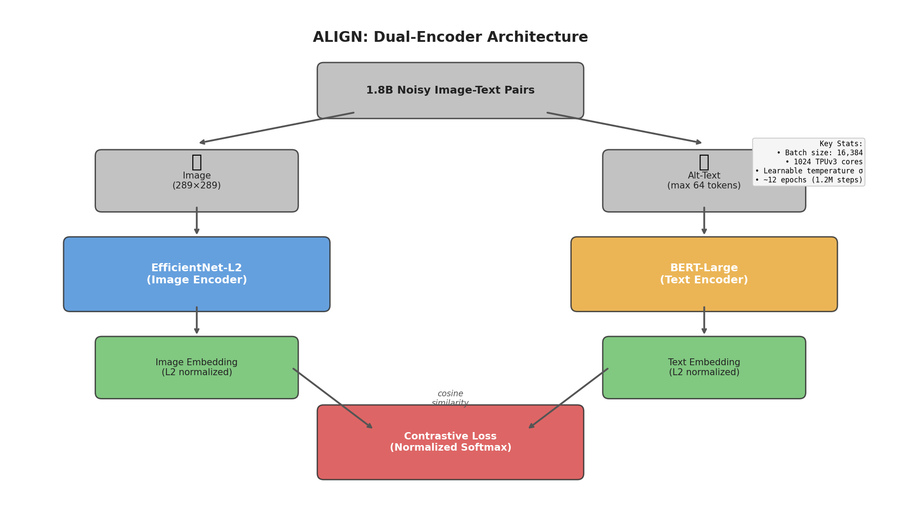

### ALIGN: Scaling Up Visual and Vision-Language Representation Learning With Noisy Text Supervision

```yaml
id: align
name: "ALIGN"
year: 2021
venue: "ICML 2021"
org: "Google Research"
category: dual_encoder_contrastive
parent: null
arxiv: "2102.05918"
authors: "Chao Jia, Yinfei Yang, Ye Xia, Yi-Ting Chen, Zarana Parekh, Hieu Pham, Quoc V. Le, Yunhsuan Sung, Zhen Li, Tom Duerig"
```

---

## 📝 一句话总结

ALIGN 证明了**利用 18 亿噪声网络图文对**训练简单的双编码器（EfficientNet + BERT），通过**数据规模弥补噪声**，即可在图文检索和零样本分类上达到 SOTA，无需复杂的数据清洗或跨注意力融合机制。

---

## 🎯 核心要点

1. **噪声数据规模 > 清洗数据质量**：ALIGN 使用从网页 alt-text 中收集的 18 亿图文对，仅做最简频率过滤（去除极罕见/极高频 alt-text 和色情图片），不做昂贵的语义清洗。论文证明数据规模的增长可以有效抵消噪声带来的负面影响，这一发现与 CLIP 的思路不谋而合但数据量更大（CLIP 使用 4 亿对）。

2. **极简双编码器架构**：图像编码器使用 EfficientNet-L2（带全局池化），文本编码器使用 BERT-Large（取 [CLS] token），两个编码器各自独立产出嵌入向量，再通过余弦相似度计算匹配分数。这种设计使得推理时图像和文本可以**独立预计算嵌入**，支持大规模高效检索。

3. **归一化 Softmax 对比损失**：采用 in-batch negatives 策略，将 batch 内所有非配对样本作为负例。损失函数为双向的归一化 softmax（image-to-text + text-to-image），温度参数 $\sigma$ 设为可学习变量而非手动调参，避免了因 L2 归一化后余弦相似度值域受限导致的调参困难。

4. **超大规模训练配置**：1024 个 Cloud TPUv3 核心，每核 16 对正样本，总有效 batch size = 16,384。跨所有核心拼接嵌入以构建更大的负样本池。学习率 warmup 至 1e-3（10k 步），线性衰减至 0（1.2M 步，约 12 个 epoch）。

5. **零样本迁移能力**：通过将类别名称输入文本编码器，ALIGN 实现零样本图像分类，在 ImageNet 上达到 **76.4% top-1**（与 CLIP 的 76.2% 持平）。微调后达到 **88.64% top-1**。

6. **检索 SOTA**：在 Flickr30K 零样本检索中 Image→Text R@1 = **95.3%**，Text→Image R@1 = **84.9%**；在 MSCOCO 零样本检索中 Image→Text R@1 = **77.0%**，Text→Image R@1 = **59.9%**。即使与使用跨注意力的更复杂模型（如 UNITER、Oscar）相比也具有竞争力甚至更优。

7. **多语言与跨模态搜索**：ALIGN 的对齐表示天然支持复杂的跨模态检索，包括文本搜图、图搜文，以及文本+图像的组合查询（通过嵌入向量加法实现）。

---

## 🔬 深入细节

### 整体架构



*图：ALIGN 的双编码器架构。图像经 EfficientNet-L2 编码为 L2 归一化的嵌入向量，文本经 BERT-Large 编码为 L2 归一化的嵌入向量，通过余弦相似度计算匹配分数，使用归一化 softmax 对比损失进行训练。*

### 数据处理流水线

ALIGN 的数据集构建是其核心贡献之一。与 Conceptual Captions（~10M，需要复杂清洗）不同，ALIGN 采用极简过滤策略：

**图像过滤：**
- 去除过小图像（面积 < 200 像素或宽高比 > 3）
- 使用 NSFW 分类器过滤色情内容
- 不做任何语义级别的图像筛选

**文本过滤：**
- 去除 alt-text 为空或过短的样本
- 基于频率过滤：去除在数据集中出现次数极多的 alt-text（通常是模板化的无意义文本，如 "click here"、"image"）
- 去除包含极罕见 token 的 alt-text（通常是乱码或非自然语言）
- 不做任何 NLP 级别的语义清洗

最终得到 **18 亿**图文对，比 Conceptual Captions 大约 **180 倍**。

### 对比损失公式

给定一个 batch 中的 $N$ 个图文对，设 $x_i^{img}$ 和 $x_j^{txt}$ 分别为第 $i$ 张图像和第 $j$ 条文本的 L2 归一化嵌入向量，对比损失定义为：

**Image-to-Text 损失：**

$$\mathcal{L}_{i2t} = -\frac{1}{N} \sum_{i=1}^{N} \log \frac{\exp(x_i^{img} \cdot x_i^{txt} / \sigma)}{\sum_{j=1}^{N} \exp(x_i^{img} \cdot x_j^{txt} / \sigma)}$$

**Text-to-Image 损失：**

$$\mathcal{L}_{t2i} = -\frac{1}{N} \sum_{i=1}^{N} \log \frac{\exp(x_i^{txt} \cdot x_i^{img} / \sigma)}{\sum_{j=1}^{N} \exp(x_i^{txt} \cdot x_j^{img} / \sigma)}$$

**总损失：**

$$\mathcal{L} = \mathcal{L}_{i2t} + \mathcal{L}_{t2i}$$

其中 $\sigma$ 为**可学习的温度参数**。由于嵌入已经 L2 归一化，余弦相似度的值域为 $[-1, 1]$，温度参数对训练稳定性至关重要。

### 训练伪代码

```
Algorithm: ALIGN Contrastive Training
─────────────────────────────────────────────
Input: 1.8B noisy image-text pairs D
Output: Image encoder f_img (EfficientNet-L2), Text encoder f_txt (BERT-Large)
Hyperparams: N=16384 (batch size), σ (learnable temperature)

Initialize: f_img ← pretrained EfficientNet-L2
            f_txt ← pretrained BERT-Large
            σ ← learnable scalar

for step = 1 to 1,200,000:
    # 1. Sample mini-batch across 1024 TPU cores (16 pairs/core)
    {(img_i, txt_i)}_{i=1}^{N} ~ D
    
    # 2. Encode and normalize
    for i = 1 to N:
        e_img_i = L2_normalize(f_img(img_i))    # EfficientNet → global pool → FC → normalize
        e_txt_i = L2_normalize(f_txt(txt_i))     # BERT [CLS] → FC → normalize
    
    # 3. All-gather embeddings across TPU cores
    E_img = AllGather({e_img_i})  # shape: [N, d]
    E_txt = AllGather({e_txt_i})  # shape: [N, d]
    
    # 4. Compute similarity matrix
    S = E_img @ E_txt.T / σ      # shape: [N, N]
    
    # 5. Contrastive loss (bidirectional normalized softmax)
    labels = [0, 1, 2, ..., N-1]  # diagonal = positive pairs
    L_i2t = CrossEntropy(S, labels)        # each row: image finds its text
    L_t2i = CrossEntropy(S.T, labels)      # each col: text finds its image
    L = L_i2t + L_t2i
    
    # 6. Update all parameters (including σ)
    backward(L)
    optimizer_step(lr=schedule(step))  # warmup 10k → 1e-3, linear decay to 0
```

### 为什么噪声数据有效？

论文通过消融实验揭示了三个关键洞察：

**1. 规模效应压制噪声：** 当数据量从 100M 增长到 1.8B 时，即使噪声比例不变，模型在下游任务上的性能持续提升。这是因为大规模数据中的信号总量远超噪声，对比学习的 in-batch negatives 机制天然具有对噪声的鲁棒性——一个噪声样本在 16,384 个负样本中的影响被大幅稀释。

**2. 大 batch size 是关键：** 对比学习的效果高度依赖负样本的数量和多样性。ALIGN 使用 16,384 的 batch size（通过跨 TPU 核心 AllGather 实现），确保每个正样本都有足够多的高质量负样本进行对比。论文的消融实验表明，batch size 从 4K 增加到 16K 时性能显著提升。

**3. 双编码器的效率优势：** 与 UNITER、Oscar 等使用跨注意力的模型不同，ALIGN 的双编码器在推理时可以预计算所有候选的嵌入向量，检索时仅需计算点积，复杂度为 $O(N)$ 而非 $O(N \times L^2)$（$L$ 为序列长度）。这使得 ALIGN 可以部署在数十亿规模的实际检索系统中。

### 与 CLIP 的对比

| 维度 | ALIGN | CLIP |
|------|-------|------|
| 数据规模 | **18 亿**对 | 4 亿对 |
| 数据质量 | 噪声 alt-text，最简过滤 | 经过清洗的 WebImageText |
| 图像编码器 | EfficientNet-L2 | ViT-L/14 或 ResNet |
| 文本编码器 | BERT-Large | Transformer (从头训练) |
| ImageNet 零样本 | **76.4%** | 76.2% |
| 损失函数 | 归一化 softmax（可学习 $\sigma$） | 对称交叉熵（可学习 $\tau$） |
| 核心理念 | 数据规模弥补噪声 | 自然语言监督的视觉学习 |

两者在方法论上高度相似（同期独立工作），但 ALIGN 更强调**数据规模和噪声容忍度**，而 CLIP 更强调**零样本迁移的通用性**。

### 零样本分类机制

ALIGN 的零样本分类无需任何额外训练：

1. 将 ImageNet 的 1000 个类别名称分别输入文本编码器，得到 1000 个类别嵌入
2. 将测试图像输入图像编码器，得到图像嵌入
3. 计算图像嵌入与所有类别嵌入的余弦相似度
4. 取相似度最高的类别作为预测结果

为提升效果，论文使用了 prompt engineering，如将类别名 "dog" 转换为 "a photo of a dog"。

---

## 🧪 练习题

### 概念理解

1. **为什么 ALIGN 选择双编码器而非跨注意力架构？** 请从训练效率、推理效率和检索场景三个角度分析。

2. **温度参数 $\sigma$ 在对比损失中的作用是什么？** 如果 $\sigma$ 过大或过小，分别会导致什么问题？为什么 ALIGN 选择将其设为可学习参数？

3. **ALIGN 的数据过滤策略为什么只做频率过滤而不做语义过滤？** 这与 Conceptual Captions 的策略有何本质区别？

### 深入思考

4. **假设你只有 1000 万图文对（而非 18 亿），ALIGN 的方法还能有效吗？** 你会做哪些调整来弥补数据量的不足？

5. **ALIGN 使用 in-batch negatives 作为负样本。请分析这种策略的优缺点。** 在什么情况下 in-batch negatives 可能不够好？有哪些替代方案？

6. **ALIGN 和 CLIP 几乎同时发表且方法高度相似，但 ALIGN 使用了预训练的 EfficientNet 和 BERT，而 CLIP 从头训练 Transformer。** 请讨论这两种初始化策略的优劣。

### 实践应用

7. **设计一个基于 ALIGN 思想的商品搜索系统：** 用户输入文本描述（如 "红色连衣裙"），系统返回最匹配的商品图片。请描述系统架构、离线索引构建流程和在线检索流程。

8. **如果要将 ALIGN 扩展为支持视频检索（text-to-video），你会如何修改架构？** 考虑视频的时序信息应该如何编码。