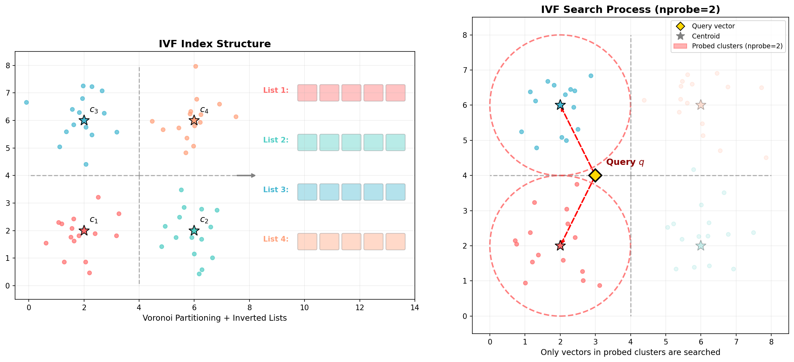

### IVF — 倒排文件索引 (IVF)

```yaml
id: ivf
name: IVF
full_name: "倒排文件索引 (IVF)"
year: 2003
org: —
paper_url: —
category: vector_ann
parent: pq
motivation: "聚类缩小搜索范围"
```

#### 📝 一句话总结

IVF 将信息检索中的**倒排索引**思想迁移到向量近邻搜索领域，通过 K-means 聚类将向量空间划分为 Voronoi 单元，查询时仅在最近的少数聚类中进行穷举搜索，将搜索复杂度从 \(O(N)\) 降至 \(O(nprobe \cdot N/K)\)，是 Faiss 等主流向量检索库的核心索引结构。

#### 🎯 核心要点

- **粗量化器 (Coarse Quantizer)**：使用 K-means 将 \(N\) 个数据库向量聚类为 \(K\) 个 Voronoi 单元，每个聚类中心作为"视觉词汇"
- **倒排列表 (Inverted Lists)**：每个聚类中心维护一个列表，存储所有被分配到该单元的向量（或其 ID + 残差编码）
- **多探针搜索 (Multi-probe Search)**：查询时不仅搜索最近的 1 个聚类，而是搜索最近的 \(nprobe\) 个聚类，以 nprobe 参数平衡精度与速度
- **残差编码 (Residual Encoding)**：存储向量与其所属聚类中心的残差 \(\mathbf{r} = \mathbf{x} - c(\mathbf{x})\)，降低量化误差
- **IVF+PQ (IVFADC)**：将倒排索引与乘积量化结合，倒排列表中存储 PQ 编码的残差而非原始向量，实现内存高效的十亿级检索
- **非对称距离计算 (ADC)**：查询向量不量化，直接与 PQ 码本计算距离，保留查询精度
- **源自文本检索**：概念源于 Sivic & Zisserman (2003) 将文本检索的倒排索引应用于视觉词袋模型，后由 Jégou et al. (2011) 推广至通用向量近邻搜索

#### 🔬 深入细节

##### 核心框架图



*图：左侧展示 IVF 索引结构——K-means 将向量空间划分为 Voronoi 单元，每个聚类中心关联一个倒排列表；右侧展示搜索过程——查询向量 \(q\) 仅在最近的 nprobe=2 个聚类（红色虚线圈）中搜索候选向量，灰色区域的向量被完全跳过。*

##### 算法伪代码

```python
# ============================================
# IVF 索引构建 (Offline)
# ============================================
# 输入: 数据库向量集 X = {x_1, ..., x_N}, 聚类数 K
# 输出: 聚类中心 C, 倒排列表 inverted_lists

# Step 1: 训练粗量化器 (K-means)
C = {c_1, ..., c_K} ← KMeans(X, K)

# Step 2: 构建倒排列表
inverted_lists = {k: [] for k in range(K)}
for i, x in enumerate(X):
    k* = argmin_k ||x - c_k||²          # 找到最近的聚类中心
    r = x - c_{k*}                        # 计算残差向量
    inverted_lists[k*].append((i, r))     # 存储 (向量ID, 残差)

# ============================================
# IVF 查询 (Online)
# ============================================
# 输入: 查询向量 q, 探针数 nprobe, 返回数 top_k
# 输出: 最近邻列表

# Step 1: 粗量化——找到 nprobe 个最近聚类
probed_cells = nprobe_nearest(q, C, nprobe)

# Step 2: 在被探测的倒排列表中穷举搜索
candidates = []
for k in probed_cells:
    for (id_i, r_i) in inverted_lists[k]:
        dist = ||q - c_k - r_i||²        # 精确距离 (等价于 ||q - x_i||²)
        candidates.append((dist, id_i))

# Step 3: 返回 top-k 最近邻
return top_k_smallest(candidates, top_k)
```

##### 动机与背景

在大规模向量检索场景中（如图像检索、推荐系统、RAG），数据库可能包含数十亿个高维向量。**穷举搜索 (Brute-force)** 需要计算查询向量与所有数据库向量的距离，复杂度为 \(O(N \cdot d)\)，其中 \(N\) 为数据库大小，\(d\) 为向量维度。当 \(N\) 达到百万甚至十亿级别时，穷举搜索的延迟完全无法接受。

传统的加速方法包括：
- **树结构 (KD-Tree, Ball Tree)**：在低维空间有效，但在高维空间（\(d > 20\)）退化为穷举搜索（维度灾难）
- **局部敏感哈希 (LSH)**：通过随机投影将相似向量映射到同一桶，但需要大量哈希表才能保证召回率，内存开销大

IVF 的核心洞察来自文本检索领域：**如果我们能将向量空间预先划分为若干区域，查询时只需搜索最相关的少数区域，就能大幅缩小搜索范围**。这正是文本搜索引擎中倒排索引的工作原理——每个"词"对应一个文档列表，查询时只检索包含查询词的文档。

> 💡 **关键直觉**：K-means 聚类将向量空间划分为 Voronoi 单元，查询向量的最近邻大概率落在与查询最近的几个聚类中。通过只搜索这几个聚类的倒排列表，搜索量从 \(N\) 降至 \(nprobe \cdot N/K\)。

##### 核心机制：粗量化与倒排索引

**1. 粗量化器 (Coarse Quantizer)**

IVF 的第一步是使用 K-means 算法将整个数据库的 \(N\) 个向量聚类为 \(K\) 个簇。每个聚类中心 \(c_k\) 定义了一个 Voronoi 单元：

$$V_k = \{\mathbf{x} \in \mathbb{R}^d : \|\mathbf{x} - c_k\| \leq \|\mathbf{x} - c_j\|, \forall j \neq k\}$$

典型的 \(K\) 值选择为 \(\sqrt{N}\) 到 \(4\sqrt{N}\)。例如，对于 \(N = 10^6\) 的数据库，\(K\) 通常设为 1024 到 4096。

**2. 倒排列表 (Inverted Lists)**

对于每个聚类中心 \(c_k\)，维护一个倒排列表 \(L_k\)，包含所有被分配到该 Voronoi 单元的向量。列表中存储的内容取决于具体实现：

| 存储方式 | 倒排列表内容 | 内存占用 | 精度 |
|---------|-------------|---------|------|
| IVFFlat | 原始向量 \(\mathbf{x}_i\) | \(N \cdot d \cdot 4\) 字节 | 精确 |
| IVFPQ (IVFADC) | PQ 编码的残差 \(PQ(\mathbf{x}_i - c_k)\) | \(N \cdot m\) 字节 | 近似 |
| IVFScalarQuantizer | 标量量化的残差 | \(N \cdot d\) 字节 | 近似 |

**3. 残差编码的重要性**

直接对原始向量进行 PQ 编码会引入较大的量化误差。IVF 的一个关键设计是**先减去聚类中心，再对残差进行编码**：

$$\mathbf{r}_i = \mathbf{x}_i - c_{q(\mathbf{x}_i)}$$

其中 \(q(\mathbf{x}_i)\) 是 \(\mathbf{x}_i\) 所属的聚类中心。残差向量的方差远小于原始向量，因此 PQ 编码的精度更高。

> ⚠️ **注意**：残差编码是 IVFADC 相比朴素 PQ 的关键改进。Jégou et al. (2011) 实验表明，残差编码可将 1-recall@100 从 0.35 提升至 0.45（SIFT1M 数据集）。

##### 搜索流程：多探针策略

查询时，IVF 的搜索分为两个阶段：

**阶段一：粗量化（Coarse Quantization）**

计算查询向量 \(\mathbf{q}\) 与所有 \(K\) 个聚类中心的距离，选出最近的 \(nprobe\) 个聚类：

$$\mathcal{S} = \text{nprobe-nearest}(\mathbf{q}, \{c_1, \ldots, c_K\})$$

此步复杂度为 \(O(K \cdot d)\)，通常 \(K \ll N\)，开销很小。

**阶段二：倒排列表内搜索**

仅在被选中的 \(nprobe\) 个倒排列表中搜索最近邻：

$$\text{NN}(\mathbf{q}) = \underset{i : q(\mathbf{x}_i) \in \mathcal{S}}{\text{argmin}} \|\mathbf{q} - \mathbf{x}_i\|^2$$

假设向量在聚类间均匀分布，每个列表平均包含 \(N/K\) 个向量，则搜索的向量总数为 \(nprobe \cdot N/K\)。

**nprobe 的精度-速度权衡**：

| nprobe | 搜索比例 (K=1024) | 典型 Recall@10 | 相对延迟 |
|--------|-------------------|---------------|---------|
| 1 | 0.1% | ~40% | 1× |
| 8 | 0.8% | ~80% | 8× |
| 32 | 3.1% | ~95% | 32× |
| 64 | 6.3% | ~98% | 64× |
| 1024 | 100% | 100% | 穷举 |

> 💡 **关键**：nprobe 是 IVF 最重要的运行时参数。实践中通常设为 \(K\) 的 1%~10%，在保证 >90% 召回率的同时实现 10~100 倍加速。

##### IVF+PQ (IVFADC)：内存高效的十亿级检索

IVFFlat 虽然搜索快，但仍需存储所有原始向量，内存占用为 \(N \cdot d \cdot 4\) 字节。对于 \(N = 10^9, d = 128\) 的场景，需要约 512 GB 内存。

**IVFADC (Inverted File with Asymmetric Distance Computation)** 由 Jégou et al. (2011) 提出，将 IVF 与乘积量化 (PQ) 结合：

1. **索引构建**：对每个向量的残差 \(\mathbf{r}_i = \mathbf{x}_i - c_{q(\mathbf{x}_i)}\) 进行 PQ 编码，倒排列表中仅存储 PQ 码（通常 8~16 字节/向量）
2. **非对称距离计算 (ADC)**：查询时，查询向量 \(\mathbf{q}\) 不进行量化，直接与 PQ 码本计算子空间距离表，再查表累加得到近似距离：

$$\hat{d}(\mathbf{q}, \mathbf{x}_i) = \sum_{j=1}^{m} \|q_j - c_j^{PQ}(r_{i,j})\|^2$$

其中 \(m\) 为 PQ 子空间数，\(q_j\) 为查询向量在第 \(j\) 个子空间的分量，\(c_j^{PQ}(r_{i,j})\) 为残差第 \(j\) 个子空间的 PQ 码本中心。

**内存对比**（\(N = 10^9, d = 128\)）：

| 方法 | 每向量内存 | 总内存 |
|------|----------|-------|
| Brute-force | 512 B | 512 GB |
| IVFFlat | 512 B + 聚类开销 | ~512 GB |
| IVFPQ (m=8) | 8 B + ID | ~16 GB |
| IVFPQ (m=16) | 16 B + ID | ~24 GB |

##### 与传统方法的区别

| 特性 | 穷举搜索 | LSH | KD-Tree | **IVF** | HNSW |
|------|---------|-----|---------|---------|------|
| 搜索复杂度 | \(O(Nd)\) | \(O(N^{\rho}d)\) | \(O(N^{1-1/d})\) | \(O(nprobe \cdot N/K \cdot d)\) | \(O(d \log N)\) |
| 索引构建 | 无 | \(O(NLd)\) | \(O(Nd \log N)\) | \(O(NKTd)\) (K-means) | \(O(Nd \log N)\) |
| 高维适应性 | ✓ | ✓ | ✗ | ✓ | ✓ |
| 可与 PQ 结合 | ✓ | ✗ | ✗ | **✓ (IVFADC)** | ✓ |
| 动态更新 | ✓ | ✓ | 需重建 | ✓ (追加到列表) | ✓ |
| 参数敏感性 | 无 | 哈希表数 L | 无 | **K, nprobe** | ef, M |

IVF 相比 HNSW 的优势在于：(1) 内存占用更低（尤其结合 PQ）；(2) 索引构建更快；(3) 更适合磁盘存储（倒排列表可分段加载）。HNSW 的优势在于单次查询延迟更低（对数复杂度 vs 线性扫描列表）。

##### 实践中的关键参数选择

- **聚类数 \(K\)**：通常取 \(\sqrt{N}\) 到 \(4\sqrt{N}\)。\(K\) 过小则每个列表太长，加速不明显；\(K\) 过大则聚类质量下降，且粗量化阶段开销增大
- **nprobe**：运行时参数，控制精度-速度权衡。通常从 1 开始逐步增大，直到召回率满足需求
- **PQ 子空间数 \(m\)**：决定每个向量的压缩比。\(m\) 越大精度越高但内存越大。常见选择为 8、16、32
- **训练集大小**：K-means 训练不需要全部数据，通常取 \(30K\) 到 \(256K\) 个样本即可

#### 🧪 练习题

```yaml
question: "在 IVF 索引中，增大 nprobe 参数的直接效果是什么？"
options:
  - "减少索引构建时间"
  - "降低每个向量的内存占用"
  - "提高搜索召回率但增加查询延迟"
  - "增加聚类中心的数量"
answer: 2
explain: "nprobe 控制查询时探测的聚类数量。增大 nprobe 意味着搜索更多的倒排列表，覆盖更多候选向量，因此召回率提高；但同时需要计算更多距离，查询延迟也相应增加。"
```