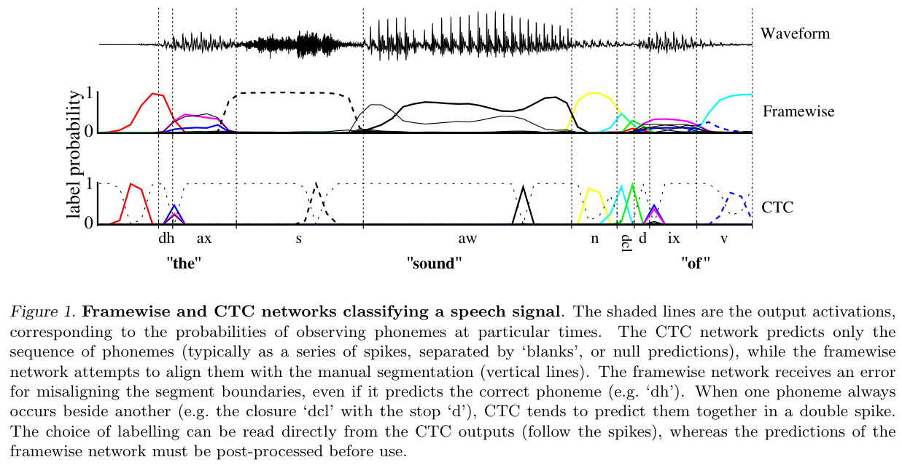
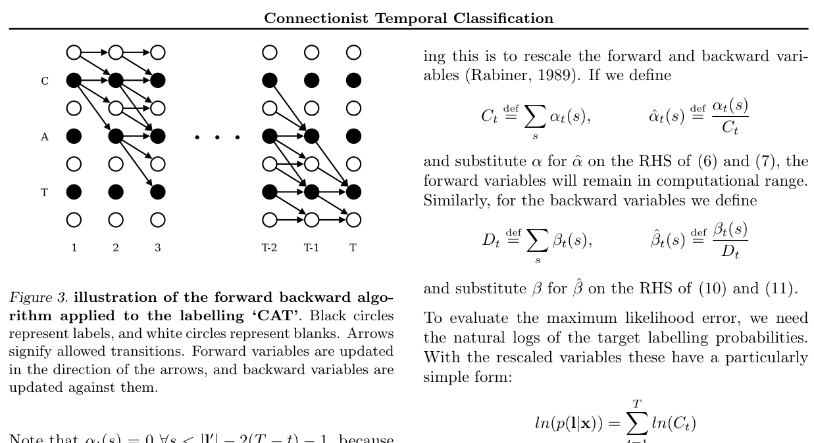

### CTC — 连接时序分类 (Connectionist Temporal Classification)

```yaml
id: ctc
name: CTC
full_name: 连接时序分类 (Connectionist Temporal Classification)
year: 2006
org: IDSIA & TUM
paper_url: https://www.cs.toronto.edu/~graves/icml_2006.pdf
category: foundation
parent: —
motivation: 引入blank标签和前向-后向算法，使RNN无需预对齐标注即可直接训练序列到序列的标签映射
```

#### 📝 一句话总结

CTC 在 RNN 输出层引入 **blank（空白）标签** 和 **多对一路径映射**，配合前向-后向动态规划算法高效计算标签序列概率，使网络能够直接从未分段的序列数据中学习，无需帧级对齐标注，成为语音识别、手写识别等序列标注任务的基础方法。

#### 🎯 核心要点

- **Blank 标签机制**：在原始标签集 $L$ 之外新增一个 blank 标签，输出层共 $|L|+1$ 个 softmax 单元，blank 用于表示"不输出任何标签"的时间步，解决了输入帧数远多于标签数的对齐问题。
- **多对一映射 $\mathcal{B}$**：定义从逐帧输出路径 $\pi$ 到标签序列 $\mathbf{l}$ 的映射——先移除连续重复标签，再移除所有 blank。标签序列概率为所有映射到该序列的路径概率之和：$p(\mathbf{l}|\mathbf{x}) = \sum_{\pi \in \mathcal{B}^{-1}(\mathbf{l})} p(\pi|\mathbf{x})$。
- **前向-后向算法**：通过在标签序列中插入 blank 构造扩展序列 $\mathbf{l}'$（长度 $2|\mathbf{l}|+1$），利用动态规划在 $O(T \cdot |\mathbf{l}'|)$ 时间内精确计算 $p(\mathbf{l}|\mathbf{x})$，避免了对指数级路径的暴力枚举。
- **两种解码策略**：Best Path Decoding（贪心取每帧最大概率输出，$O(T)$，近似）和 Prefix Search Decoding（基于前缀概率的精确搜索，利用 blank 概率阈值剪枝加速）。
- **最大似然训练**：目标函数为正确标签序列的负对数似然，梯度通过前向-后向变量直接计算并经 BPTT 反向传播到 RNN 参数。
- **无需预分段**：与传统 HMM-RNN 混合系统不同，CTC 完全端到端训练，不依赖帧级标注或预训练的对齐信息。
- **实验验证**：在 TIMIT 语音数据集上，BLSTM+CTC 达到 30.51% 标签错误率（LER），显著优于 HMM 基线（36.2%）和 Framewise RNN（35.5%），且无需外部语言模型。

#### 🔬 深入细节

##### 4.1 核心示意图



> **图 1**：Framewise 网络与 CTC 网络对语音信号分类的对比。上方为传统逐帧分类网络，需要预对齐的帧级标注，输出在音素边界处产生大量错误尖峰；下方为 CTC 网络，输出自然地将每个标签预测与序列中对应的语音段对齐，blank 标签（阴影区域）填充在标签之间，形成清晰的"尖峰"输出模式。



> **图 3**：前向-后向算法应用于标签序列 "CAT" 的示意图。纵轴为扩展标签序列 $\mathbf{l}' = (\text{blank}, C, \text{blank}, A, \text{blank}, T, \text{blank})$，横轴为时间步。白色圆圈表示 blank，黑色圆圈表示标签。箭头表示允许的转移：每个节点可以自环（保持当前标签）、前进一步（到下一个标签/blank）、或跳过一个 blank 前进两步（仅当目标不是 blank 且与当前标签不同时）。

##### 4.2 算法伪代码

```
算法: CTC 前向算法 — 计算 p(l|x)
━━━━━━━━━━━━━━━━━━━━━━━━━━━━━━━━━━━━━━━━━━
输入: 网络输出 y (T×|L'|), 目标标签序列 l (长度 S)
输出: p(l|x)

1.  构造扩展标签序列 l' = (blank, l₁, blank, l₂, ..., blank, lₛ, blank)
    // 长度 S' = 2S + 1

2.  初始化前向变量:
    α(1, 1) = y(blank, 1)          // 第1个时间步输出 blank 的概率
    α(1, 2) = y(l₁, 1)             // 第1个时间步输出第1个标签的概率
    α(1, s) = 0,  ∀ s > 2          // 其余位置不可达

3.  FOR t = 2 TO T:
4.      FOR s = 1 TO S':
5.          // 基础情况: 自环 + 从前一个位置转移
6.          α̂ = α(t-1, s) + α(t-1, s-1)

7.          // 跳转情况: 若 l'_s ≠ blank 且 l'_s ≠ l'_{s-2}
8.          IF s > 2 AND l'_s ≠ blank AND l'_s ≠ l'_{s-2}:
9.              α̂ = α̂ + α(t-1, s-2)

10.         α(t, s) = α̂ × y(l'_s, t)   // 乘以当前时间步的输出概率

11. RETURN p(l|x) = α(T, S') + α(T, S'-1)
    // 最终可以在最后一个 blank 或最后一个标签处结束
```

```
算法: CTC Best Path Decoding (贪心解码)
━━━━━━━━━━━━━━━━━━━━━━━━━━━━━━━━━━━━━━━━━━
输入: 网络输出 y (T×|L'|)
输出: 最可能标签序列 l*

1.  FOR t = 1 TO T:
2.      π*_t = argmax_k y(k, t)     // 每帧取概率最大的标签

3.  RETURN l* = B(π*)               // 应用映射: 移除重复 → 移除 blank
```

```
算法: CTC 训练 — 梯度计算
━━━━━━━━━━━━━━━━━━━━━━━━━━━━━━━━━━━━━━━━━━
输入: 网络输出 y, 目标标签 l, 前向变量 α, 后向变量 β
输出: 损失函数对网络输出的梯度

1.  计算前向变量 α(t,s) 和后向变量 β(t,s)  // 使用前向-后向算法

2.  FOR 每个时间步 t, 每个标签 k:
3.      ∂(-ln p(l|x))/∂y(k,t) = y(k,t) - (1/p(l|x)) × Σ_{s∈lab(l,k)} α(t,s)·β(t,s)
        // lab(l,k) 是 l' 中等于 k 的所有位置集合

4.  通过 BPTT 将梯度反向传播到 RNN 参数
```

##### 4.3 方法细节深入

**1. 问题定义与动机**

传统的序列标注方法（如 HMM 或逐帧分类 RNN）要求训练数据提供帧级对齐标注，即每个输入帧都需要对应一个标签。这在实际应用中代价极高——例如语音识别中，标注者需要精确标记每个音素的起止时间。CTC 的核心贡献在于将序列标注问题重新定义为：给定输入序列 $\mathbf{x} = (x_1, \ldots, x_T)$，直接预测标签序列 $\mathbf{l} = (l_1, \ldots, l_S)$，其中 $S \leq T$，无需知道 $\mathbf{l}$ 中每个标签对应 $\mathbf{x}$ 的哪些帧。

**2. Blank 标签与映射 $\mathcal{B}$ 的设计**

CTC 的关键创新是引入 blank 标签。网络在每个时间步 $t$ 输出 $|L|+1$ 维的 softmax 概率分布 $y_t$，其中额外的一维对应 blank。一条完整的路径 $\pi = (\pi_1, \ldots, \pi_T)$ 是长度为 $T$ 的标签序列（包含 blank）。

映射 $\mathcal{B}$ 的操作分两步：
1. **合并连续重复**：如 `(a, a, blank, b, b)` → `(a, blank, b)`
2. **移除 blank**：如 `(a, blank, b)` → `(a, b)`

这个设计巧妙地解决了两个问题：
- **长度不匹配**：blank 吸收了多余的时间步
- **重复标签**：如标签序列 `(a, a)` 可以通过 `(a, blank, a)` 路径表示，与 `(a)` 对应的 `(a, a)` 路径区分开

**3. 前向-后向算法的精妙设计**

直接枚举所有映射到 $\mathbf{l}$ 的路径数量是指数级的。CTC 借鉴 HMM 的前向-后向算法思想，通过动态规划高效求解。

关键步骤是构造**扩展标签序列** $\mathbf{l}'$：在 $\mathbf{l}$ 的首尾和每两个标签之间插入 blank。例如 $\mathbf{l} = (C, A, T)$ 变为 $\mathbf{l}' = (\text{-}, C, \text{-}, A, \text{-}, T, \text{-})$，长度从 $S$ 变为 $2S+1$。

前向变量 $\alpha(t, s)$ 表示：在时间步 $t$，所有映射到 $\mathbf{l}$ 的前 $\lfloor s/2 \rfloor$ 个标签的路径的总概率。转移规则体现了 $\mathcal{B}$ 映射的约束：

- **自环**：$\alpha(t-1, s) \to \alpha(t, s)$（重复当前标签/blank）
- **前进一步**：$\alpha(t-1, s-1) \to \alpha(t, s)$（从前一个位置转移）
- **跳过 blank**：$\alpha(t-1, s-2) \to \alpha(t, s)$（仅当 $l'_s \neq \text{blank}$ 且 $l'_s \neq l'_{s-2}$ 时允许，因为相同标签之间必须有 blank 分隔）

后向变量 $\beta(t, s)$ 对称定义，从序列末尾向前计算。

**4. 解码策略对比**

- **Best Path Decoding**：每帧独立取 argmax，再应用 $\mathcal{B}$。计算简单（$O(T)$），但不保证找到最优标签序列——因为多条路径可能映射到同一标签序列，而最优路径不一定属于最优标签序列。
- **Prefix Search Decoding**：维护一个前缀集合，逐步扩展。利用前向变量计算每个前缀的概率，通过 blank 概率阈值剪枝。理论上精确，但最坏情况为指数复杂度。论文观察到训练好的 CTC 网络输出具有"尖峰"特性（大部分时间步输出 blank），使得剪枝非常有效。

**5. 实验设计与结果**

论文在 TIMIT 语音数据集上验证 CTC，使用双向 LSTM（BLSTM）作为基础网络：
- **网络结构**：前向和后向各 100 个 LSTM memory block，每个 block 含 1 个 cell + 3 个门，输出层 62 个单元（61 个音素 + 1 个 blank），总参数 114,662
- **训练配置**：在线梯度下降，学习率 $10^{-4}$，动量 0.9，输入为 12 维 MFCC + 能量 + 一阶差分 = 26 维
- **核心结果**：

| 方法 | 标签错误率 (LER) |
|------|-----------------|
| HMM (单高斯) | 36.2% |
| Framewise BLSTM | 35.5% |
| **CTC BLSTM** | **30.51%** |

CTC 相比 Framewise 分类降低了约 5 个百分点的错误率，且无需帧级对齐标注。论文还发现 Prefix Search Decoding 与 Best Path Decoding 结果一致，表明网络输出的尖峰特性使贪心解码已足够准确。

##### 4.4 关键公式

**路径概率（条件独立假设）：**

$$p(\pi|\mathbf{x}) = \prod_{t=1}^{T} y_{\pi_t}^t$$

其中 $y_k^t$ 是网络在时间步 $t$ 输出标签 $k$ 的概率。

**标签序列概率（对所有合法路径求和）：**

$$p(\mathbf{l}|\mathbf{x}) = \sum_{\pi \in \mathcal{B}^{-1}(\mathbf{l})} p(\pi|\mathbf{x})$$

**前向变量递推：**

$$\alpha(t, s) = y_{l'_s}^t \cdot \begin{cases} \alpha(t\!-\!1, s) + \alpha(t\!-\!1, s\!-\!1) & \text{if } l'_s = \text{blank 或 } l'_s = l'_{s-2} \\ \alpha(t\!-\!1, s) + \alpha(t\!-\!1, s\!-\!1) + \alpha(t\!-\!1, s\!-\!2) & \text{otherwise} \end{cases}$$

**最终概率：**

$$p(\mathbf{l}|\mathbf{x}) = \alpha(T, |\mathbf{l}'|) + \alpha(T, |\mathbf{l}'|-1)$$

**训练目标函数（最大似然）：**

$$\mathcal{O}^{ML} = -\sum_{(\mathbf{x}, \mathbf{z}) \in S} \ln p(\mathbf{z}|\mathbf{x})$$

**梯度计算：**

$$\frac{\partial p(\mathbf{l}|\mathbf{x})}{\partial y_k^t} = \frac{1}{{y_k^t}^2} \sum_{s \in \text{lab}(\mathbf{l}, k)} \alpha(t, s) \cdot \beta(t, s)$$

其中 $\text{lab}(\mathbf{l}, k) = \{s : l'_s = k\}$ 是扩展标签序列中所有等于 $k$ 的位置集合。

#### 🧪 练习题

**Q1**：给定标签集 $L = \{a, b\}$ 和路径 $\pi = (a, a, \text{blank}, a, b, b)$，映射 $\mathcal{B}(\pi)$ 的结果是什么？如果标签序列为 $(a, a, b)$，请写出一条映射到该序列的最短路径。

<details>
<summary>答案</summary>

$\mathcal{B}(\pi) = \mathcal{B}(a, a, \text{blank}, a, b, b)$：
1. 合并连续重复：$(a, \text{blank}, a, b)$
2. 移除 blank：$(a, a, b)$

所以 $\mathcal{B}(\pi) = (a, a, b)$。

映射到 $(a, a, b)$ 的最短路径：由于两个 $a$ 之间必须有 blank 分隔（否则会被合并为一个 $a$），最短路径为 $(a, \text{blank}, a, b)$，长度为 4。
</details>

**Q2**：为什么 CTC 的前向-后向算法中，扩展标签序列 $\mathbf{l}'$ 需要在标签之间插入 blank？如果不插入 blank，算法会出现什么问题？

<details>
<summary>答案</summary>

插入 blank 有两个关键作用：

1. **处理重复标签**：如果标签序列包含连续相同的标签（如 "aa"），路径中两个 $a$ 之间必须经过 blank 才能被正确解码为两个独立的 $a$。在扩展序列中插入 blank 使得动态规划的转移规则自然地强制了这一约束——从 $a$ 到下一个 $a$ 必须经过中间的 blank 节点。

2. **允许标签间的静默**：在实际序列中，标签之间可能存在无标签的时间段（如语音中的静音）。blank 节点为这些时间段提供了合法的输出目标。

如果不插入 blank，动态规划将无法区分"重复同一标签"和"在同一标签上停留多帧"的情况，导致 $\mathcal{B}$ 映射的约束无法在递推中正确实现。例如，路径 $(a, a)$ 应映射到 $(a)$ 而非 $(a, a)$，但如果扩展序列中没有 blank 分隔，算法会错误地允许直接从第一个 $a$ 跳到第二个 $a$。
</details>

**Q3**：Best Path Decoding 为什么不能保证找到最优标签序列？请构造一个具体的反例说明。

<details>
<summary>答案</summary>

Best Path Decoding 找的是概率最大的**单条路径** $\pi^* = \arg\max_\pi p(\pi|\mathbf{x})$，然后返回 $\mathcal{B}(\pi^*)$。但最优**标签序列**是 $\mathbf{l}^* = \arg\max_\mathbf{l} p(\mathbf{l}|\mathbf{x})$，其概率是所有映射到它的路径概率之和。

反例：假设 $T=2$，$L=\{a\}$，网络输出为：
- $t=1$：$y_a^1 = 0.4$，$y_\text{blank}^1 = 0.6$
- $t=2$：$y_a^2 = 0.4$，$y_\text{blank}^2 = 0.6$

最优路径：$\pi^* = (\text{blank}, \text{blank})$，概率 $= 0.6 \times 0.6 = 0.36$，$\mathcal{B}(\pi^*) = \epsilon$（空序列）。

但标签序列 $(a)$ 的概率 $= p(a, a) + p(a, \text{blank}) + p(\text{blank}, a) = 0.16 + 0.24 + 0.24 = 0.64$，远大于空序列的概率 $0.36$。

所以 Best Path 返回空序列，但最优标签序列实际上是 $(a)$。这说明当多条路径映射到同一标签序列时，贪心选择单条最优路径会遗漏这些路径的累积概率。
</details>