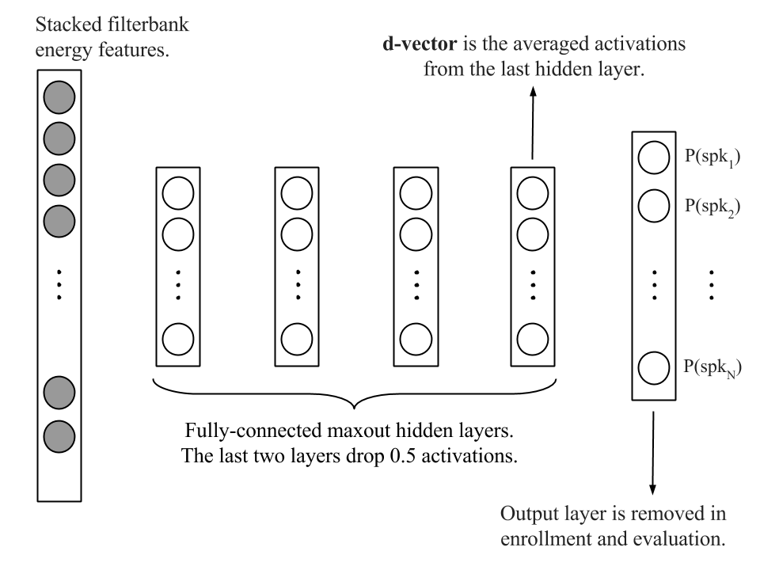

### D-Vector：基于深度神经网络的小内存文本相关说话人验证

```yaml
metadata:
  id: "d_vector"
  title: "Deep Neural Networks for Small Footprint Text-Dependent Speaker Verification"
  authors: ["Ehsan Variani", "Xin Lei", "Erik McDermott", "Ignacio Lopez Moreno", "Javier Gonzalez-Dominguez"]
  year: 2014
  venue: "ICASSP 2014"
  tldr: "提出d-vector——利用DNN最后隐藏层输出作为说话人表征，用于小内存文本相关说话人验证"
  keywords: ["d-vector", "speaker verification", "DNN", "text-dependent", "small footprint"]
  one_liner: "用DNN隐藏层激活的均值向量(d-vector)替代i-vector进行说话人验证"
```

#### 📝 一句话总结

本文提出 **d-vector** 方法：训练一个 DNN 对说话人进行帧级分类，然后提取最后隐藏层的激活输出并取均值作为说话人表征（d-vector），在小内存文本相关说话人验证任务上取得了与 i-vector 系统可比的性能，且在噪声条件下更鲁棒，两者融合后 EER 相对降低 14%（干净）和 25%（噪声）。

#### 🎯 核心要点

- **核心创新**：首次提出 d-vector 概念——将 DNN 最后隐藏层的帧级输出经 L2 归一化后取均值，作为固定维度的说话人表征，开创了基于深度学习的说话人嵌入范式
- **轻量级设计**：整个 DNN 仅含 4 个隐藏层、每层 256 节点，约 600K 参数，与最小的 i-vector 基线系统（540K 参数）相当，适合端侧部署
- **训练策略**：采用 Maxout + Dropout 技术应对小数据集过拟合问题，前两层不使用 dropout，后两层 50% dropout
- **噪声鲁棒性**：d-vector 系统在噪声条件下性能退化更小，且在低 False Rejection 操作点优于 i-vector 系统
- **互补融合**：i-vector 与 d-vector 系统具有互补性，简单 sum fusion 即可带来显著提升（干净 14%、噪声 25% 相对 EER 降低）
- **泛化能力**：DNN 在开发集说话人上训练的隐藏层表征能够泛化到未见过的新说话人

#### 🔬 深入细节

##### 4.1 系统架构图



**图 1**：D-Vector 背景 DNN 模型架构。输入为 40 维 log filterbank 特征拼接上下文帧（左 30 帧 + 右 10 帧），经过 4 个隐藏层（每层 256 节点，使用 Maxout 池化，pool size=2），最后一层隐藏层的输出即为 d-vector 的来源。输出层为 softmax，维度等于开发集说话人数（496）。前两层不使用 dropout，后两层使用 50% dropout。

##### 4.2 算法伪代码

```
算法: D-Vector 说话人验证系统

═══════════════════════════════════════════
阶段一: 开发阶段 (Development)
═══════════════════════════════════════════
输入: 开发集语音数据 {(x_t, spk_id)}, 共 N_spk 个说话人
输出: 训练好的 DNN 模型 θ

1. 提取 40 维 log filterbank 特征
2. 对每帧拼接上下文窗口 [t-30, ..., t, ..., t+10]
3. 构建 Maxout DNN:
   - 4 个隐藏层, 每层 256 节点
   - Maxout pool size = 2
   - 前 2 层: 无 dropout
   - 后 2 层: 50% dropout
   - 输出层: softmax, 维度 = N_spk
4. 使用 SGD 训练, lr=0.001, 指数衰减(0.1/5M步)
5. 损失函数: 交叉熵 (帧级说话人分类)

═══════════════════════════════════════════
阶段二: 注册阶段 (Enrollment)
═══════════════════════════════════════════
输入: 说话人 s 的注册语音集 X_s = {O_s1, ..., O_sn}
输出: 说话人 s 的 d-vector 模型 v_s

FOR 每条注册语音 O_si:
    FOR 每帧 o_j ∈ O_si:
        1. 拼接上下文 → 输入向量
        2. 前向传播至最后隐藏层 → h_j
        3. L2 归一化: h_j ← h_j / ||h_j||₂
    END FOR
    4. 帧级聚合: d_si = (1/m) Σ_j h_j   // 该语音的 d-vector
END FOR
5. 说话人模型: v_s = (1/n) Σ_i d_si     // 多条语音取均值

═══════════════════════════════════════════
阶段三: 评估阶段 (Evaluation)
═══════════════════════════════════════════
输入: 测试语音 O_test, 声称身份 s, 阈值 τ
输出: 接受/拒绝

1. 提取测试语音的 d-vector: d_test (同注册流程)
2. 计算余弦距离: score = cos(d_test, v_s)
3. 判决: IF score > τ THEN 接受 ELSE 拒绝
```

##### 4.3 方法详解

**动机与背景。** 传统说话人验证系统基于 i-vector + PLDA 框架，其中 i-vector 通过联合因子分析（JFA）从 GMM-UBM 的充分统计量中提取低维说话人表征。然而，i-vector 系统在小内存场景下面临模型参数量大的挑战（即使最小配置也需要 540K 参数），且对噪声较为敏感。受 DNN 在语音识别领域的巨大成功启发，作者提出利用 DNN 强大的特征提取能力来直接建模说话人空间，将 DNN 隐藏层的输出作为一种新的说话人表征。

**核心机制：从分类到表征。** D-vector 方法的核心思想是"训练时做分类，推理时取表征"。在开发阶段，DNN 被训练为一个帧级说话人分类器，目标是将每帧语音映射到对应的说话人 ID。训练完成后，**丢弃 softmax 输出层**，仅保留最后隐藏层的输出作为说话人特征。选择最后隐藏层而非 softmax 层有两个原因：（1）可以裁剪输出层以减小运行时模型大小，且允许使用大量开发集说话人而不增加运行时 DNN 尺寸；（2）实验观察到最后隐藏层的输出对未见说话人具有更好的泛化能力。

**DNN 架构与训练细节。** 具体而言，DNN 采用 Maxout 架构配合 Dropout 正则化来应对小数据集的过拟合问题。Maxout 网络将每层的隐藏单元分成不重叠的组，每组通过 max pooling 操作生成单个激活值，这使得网络能够为每个单元优化激活函数。网络结构为 4 个隐藏层，每层 256 个节点，pool size 为 2。输入特征为 40 维 log filterbank 能量，拼接上下文窗口（左 30 帧 + 右 10 帧），总输入维度为 $40 \times 41 = 1640$。输出层维度为 496（开发集说话人数）。训练在 DistBelief 分布式框架上完成，使用 ReLU 激活函数，学习率 0.001 并以指数方式衰减。最终模型仅约 600K 参数。

**注册与评估流程。** 注册阶段，对说话人的每条注册语音，将每帧通过 DNN 前向传播获取最后隐藏层输出，经 L2 归一化后在帧维度上取均值，得到该语音的 d-vector。多条注册语音的 d-vector 再取均值作为最终说话人模型。评估阶段，提取测试语音的 d-vector，与注册说话人的 d-vector 计算余弦距离，与阈值比较做出验证决策。值得注意的是，d-vector 系统的原始分数（raw scores）略优于 t-norm 归一化后的分数，这与 i-vector 系统相反，原因是 d-vector 的分数分布呈重尾分布而非正态分布。

**实验结果与对比。** 在"OK Google"文本相关验证任务上（646 说话人，496 训练 + 150 测试），d-vector 系统取得 4.54% EER（raw scores），而 i-vector 基线为 2.83% EER（t-norm）。虽然整体 EER 略逊，但 d-vector 在低 False Rejection 区域表现更优。在噪声条件下（babble noise, 10dB SNR），d-vector 系统的性能退化明显小于 i-vector 系统。两者的简单 sum fusion 在干净条件下取得 2.43% EER（相对 i-vector 降低 14%），在噪声条件下取得 3.42% EER（相对降低 25%），证明了两种方法的互补性。增加注册语音数量（从 4 条到 20 条）可持续提升两个系统的性能。

##### 4.4 关键公式

**d-vector 提取（帧级聚合）：**

$$\mathbf{d}_s = \frac{1}{M} \sum_{j=1}^{M} \frac{\mathbf{h}_j}{\|\mathbf{h}_j\|_2}$$

其中 $\mathbf{h}_j$ 为第 $j$ 帧通过 DNN 最后隐藏层的输出向量，$M$ 为总帧数。先对每帧输出做 L2 归一化，再取均值。

**余弦距离评分：**

$$\text{score}(s, \text{test}) = \frac{\mathbf{v}_s \cdot \mathbf{d}_{\text{test}}}{\|\mathbf{v}_s\| \cdot \|\mathbf{d}_{\text{test}}\|}$$

其中 $\mathbf{v}_s$ 为注册说话人的 d-vector 模型，$\mathbf{d}_{\text{test}}$ 为测试语音的 d-vector。

**Maxout 激活函数：**

$$h_i^{(l)} = \max_{k \in \text{group}_i} z_k^{(l)}$$

其中 $z_k^{(l)} = \mathbf{w}_k^{(l)T} \mathbf{x} + b_k^{(l)}$ 为第 $l$ 层第 $k$ 个线性单元的输出，每组（pool size=2）取最大值作为该组的激活输出。

**DNN 训练目标（帧级交叉熵）：**

$$\mathcal{L} = -\sum_{t} \sum_{c=1}^{C} y_{t,c} \log p_{t,c}$$

其中 $y_{t,c}$ 为第 $t$ 帧的说话人标签 one-hot 编码，$p_{t,c}$ 为 softmax 输出的第 $c$ 个说话人的后验概率，$C=496$ 为开发集说话人总数。

#### 🧪 练习题

1. **概念理解**：为什么 d-vector 选择使用 DNN 最后隐藏层的输出而不是 softmax 输出层？请从模型大小和泛化能力两个角度解释。

2. **对比分析**：d-vector 系统的原始分数（raw scores）优于 t-norm 归一化分数，而 i-vector 系统恰好相反。论文认为原因是什么？这对实际部署有何影响？

3. **架构设计**：论文使用 Maxout + Dropout 而非标准 MLP，其动机是什么？如果将 Maxout 替换为普通 ReLU 且不使用 Dropout，预计 EER 会如何变化？论文中是否有相关实验支持？

4. **扩展思考**：d-vector 方法在低 False Rejection 区域优于 i-vector，但整体 EER 较高。如果要将 d-vector 部署到实际的"OK Google"唤醒词验证场景，你认为应该优先关注哪个指标？为什么？

5. **方法改进**：本文使用简单的帧级均值来聚合 d-vector。请提出至少两种可能改进聚合策略的方法，并简要分析其优缺点。（提示：可参考后续工作如注意力机制、统计池化等）