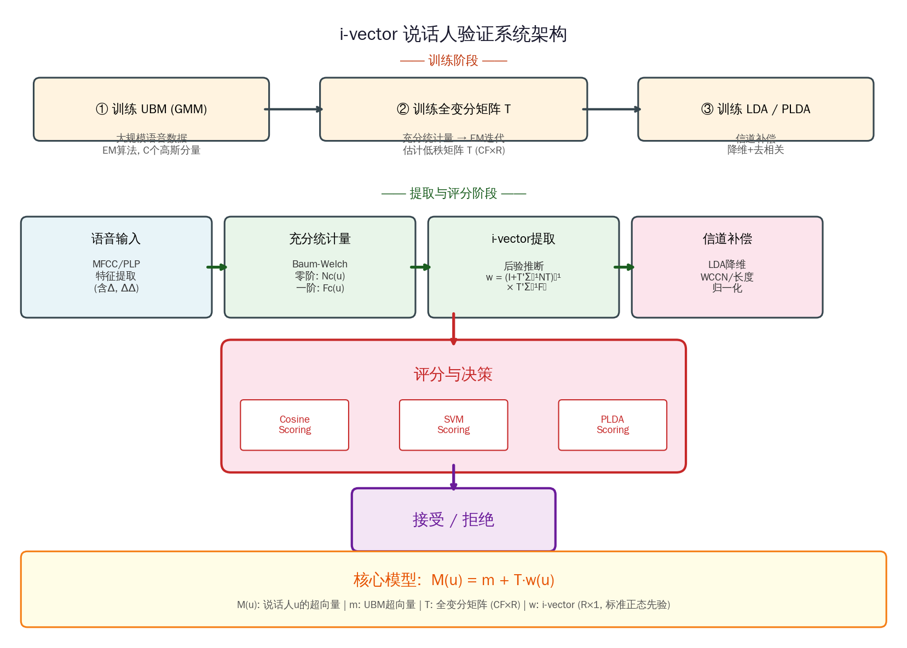

### i-vector: 前端因子分析用于说话人验证

```yaml
id: i_vector
name: i-vector
full_name: 身份向量(i-vector)
year: 2011
org: 蒙特利尔大学
doi: 10.1109/tasl.2010.2064307
paper: "Front-End Factor Analysis for Speaker Verification"
authors: "Najim Dehak, Patrick Kenny, Réda Dehak, Pierre Dumouchel, Pierre Ouellet"
category: speaker
parent: —
motivation: 全变分空间因子分析
```

---

## 📝 一句话总结

i-vector 方法将每段语音映射为一个低维的**全变分空间（Total Variability Space）**中的固定长度向量，将说话人信息和信道信息统一建模，再通过后端补偿（LDA/WCCN/PLDA）分离说话人特征，在说话人验证任务上大幅超越了传统的 JFA（联合因子分析）方法。

---

## 🎯 核心要点

- **核心思想**：放弃 JFA 中对说话人子空间和信道子空间的显式分离，转而用一个**全变分矩阵 \(T\)** 同时捕获说话人和信道变化，将 GMM 超向量投影到低维空间得到 **i-vector**
- **关键公式**：\(M(u) = m + T \cdot w(u)\)，其中 \(m\) 为 UBM 超向量均值，\(T\) 为全变分矩阵（\(CF \times R\)），\(w\) 为 i-vector（\(R \times 1\)），先验 \(w \sim \mathcal{N}(0, I)\)
- **训练流程**：① 大规模数据训练 UBM-GMM → ② EM 算法迭代估计全变分矩阵 \(T\) → ③ 训练后端补偿模型（LDA/WCCN/PLDA）
- **提取流程**：语音 → MFCC 特征 → Baum-Welch 统计量 → 后验均值估计得到 i-vector → 信道补偿 → 评分
- **后端评分**：余弦距离（Cosine Scoring）、SVM 评分、PLDA 评分均可用于最终验证决策
- **实验结论**：在 NIST SRE 2008 数据集上，i-vector + 余弦距离评分的 EER 约为 **4.57%**，显著优于 JFA 的 5.17%；结合 LDA 和 WCCN 后进一步降至约 **3.76%**
- **历史意义**：i-vector 成为 2011-2017 年间说话人识别领域的**主流范式**，后续 x-vector（基于深度学习）的设计也深受其影响

---

## 🔬 深入细节

### 系统架构示意图



### 算法伪代码

```
算法: i-vector 提取与说话人验证

========== 离线训练阶段 ==========

输入: 大规模训练语音集合 {u₁, u₂, ..., uN}, 每段标注说话人ID
输出: UBM参数 λ, 全变分矩阵 T, 后端模型参数

1. [训练 UBM]
   对所有训练数据提取 MFCC 特征 (含 Δ, ΔΔ, 通常 60 维)
   用 EM 算法训练 C 个分量的 GMM → 得到 UBM: λ = {πc, μc, Σc}_{c=1}^{C}
   拼接所有均值得到超向量: m = [μ₁ᵀ, μ₂ᵀ, ..., μCᵀ]ᵀ  (CF × 1)

2. [训练全变分矩阵 T]  (EM 迭代)
   随机初始化 T (CF × R), 其中 R ≪ CF (典型 R=400, CF≈30000)
   FOR iter = 1 to max_iter:
     // E-step: 对每段语音 u 计算后验统计量
     FOR each utterance u:
       计算零阶统计量: Nc(u) = Σ_t γ_t(c)           对每个高斯 c
       计算一阶统计量: Fc(u) = Σ_t γ_t(c) · o_t     对每个高斯 c
       中心化: F̃c(u) = Fc(u) - Nc(u) · μc
       构造对角矩阵: N(u) = diag(N₁(u)·I_F, ..., NC(u)·I_F)
       后验协方差: L(u) = (I + Tᵀ Σ⁻¹ N(u) T)⁻¹
       后验均值:   E[w(u)] = L(u) · Tᵀ · Σ⁻¹ · F̃(u)
     END FOR
     // M-step: 更新 T 矩阵 (按高斯分量分块更新)
     FOR c = 1 to C:
       Ac = Σ_u Nc(u) · (L(u) + E[w(u)]·E[w(u)]ᵀ)
       Bc = Σ_u F̃c(u) · E[w(u)]ᵀ
       Tc = Bc · Ac⁻¹          // 更新第 c 个分块
     END FOR
   END FOR

3. [训练后端补偿]
   对所有训练语音提取 i-vector
   训练 LDA 投影矩阵 A (R → d 维, 典型 d=200)
   训练 WCCN 归一化矩阵 B
   (可选) 训练 PLDA 模型

========== 在线测试阶段 ==========

输入: 注册语音 u_enroll, 测试语音 u_test
输出: 验证得分 score, 决策 (接受/拒绝)

4. [提取 i-vector]
   FOR each utterance u ∈ {u_enroll, u_test}:
     提取 MFCC 特征序列 {o₁, ..., oT}
     计算 Baum-Welch 统计量: Nc(u), F̃c(u)
     w(u) = (I + Tᵀ Σ⁻¹ N(u) T)⁻¹ · Tᵀ · Σ⁻¹ · F̃(u)   // i-vector
   END FOR

5. [信道补偿]
   w' = B · A · w                    // LDA 降维 + WCCN 归一化
   w' = w' / ‖w'‖                    // 长度归一化

6. [评分与决策]
   score = cos(w'_enroll, w'_test)   // 余弦评分
   // 或: score = PLDA_score(w'_enroll, w'_test)
   IF score > θ THEN 接受 ELSE 拒绝
```

### 方法详解

#### 1. 从 JFA 到全变分空间：动机与建模

传统的**联合因子分析（JFA）**将 GMM 超向量分解为说话人子空间和信道子空间两个独立部分：

$$
M(u) = m + V \cdot y(s) + U \cdot x(u) + D \cdot z(s)
$$

其中 \(V\) 建模说话人变化，\(U\) 建模信道变化。JFA 的核心假设是说话人因子 \(y\) 和信道因子 \(x\) 可以被独立估计。然而 Dehak 等人通过实验发现，**信道子空间 \(U\) 中实际上也包含了大量说话人信息**——直接用信道因子 \(x\) 做说话人识别竟然也能取得不错的效果。这一发现促使作者提出了一个更简洁的模型：

$$
M(u) = m + T \cdot w(u)
$$

这里只使用一个**全变分矩阵 \(T\)**（Total Variability Matrix），将说话人变化和信道变化统一投影到同一个低维子空间中。向量 \(w(u)\) 被称为**身份向量（identity vector, i-vector）**，它是一个低维（通常 \(R = 400\) 维）的固定长度表示，包含了该段语音中所有与说话人和信道相关的信息。信道信息的去除被推迟到后端处理阶段，这种"前端统一建模 + 后端补偿"的策略被证明比 JFA 的前端分离更加有效。

#### 2. 全变分矩阵 T 的训练：EM 算法

全变分矩阵 \(T\) 的估计采用**期望最大化（EM）**算法，其推导与 JFA 中信道子空间矩阵的训练完全类似。设 UBM 有 \(C\) 个高斯分量，每个分量的特征维度为 \(F\)（如 60 维 MFCC），则超向量维度为 \(CF\)（典型值约 \(512 \times 60 = 30720\)），而 i-vector 维度 \(R\) 通常取 400 或 600。

**E-step**：对每段训练语音 \(u\)，首先利用 UBM 计算 Baum-Welch 充分统计量——零阶统计量 \(N_c(u)\) 表示第 \(c\) 个高斯分量的占有率，一阶统计量 \(F_c(u)\) 表示加权特征累积。然后计算 i-vector 的后验分布：

$$
\mathbb{E}[w(u)] = \left(I + T^\top \Sigma^{-1} N(u) T\right)^{-1} T^\top \Sigma^{-1} \tilde{F}(u)
$$

其中 \(\Sigma\) 是 UBM 的对角协方差矩阵拼接而成的块对角矩阵，\(N(u)\) 是由零阶统计量构成的对角矩阵，\(\tilde{F}(u)\) 是中心化后的一阶统计量。由于 \(\Sigma\) 和 \(N(u)\) 都是（块）对角的，矩阵求逆的实际计算复杂度仅为 \(O(R^3)\) 而非 \(O((CF)^3)\)，这使得大规模训练成为可能。

**M-step**：按高斯分量分块更新 \(T\) 矩阵。对第 \(c\) 个分量，累积所有语音的二阶统计量和交叉统计量，然后求解线性方程组更新 \(T_c\)。典型的训练需要 10-20 次 EM 迭代即可收敛。

#### 3. 后端信道补偿与评分策略

提取出的 i-vector 同时包含说话人信息和信道信息，因此需要后端补偿来分离二者。论文中探讨了多种补偿策略：

**线性判别分析（LDA）**：将 i-vector 从 \(R\) 维投影到更低的 \(d\) 维空间（如 200 维），最大化说话人间方差与说话人内方差的比值。LDA 有效地去除了与说话人无关的变化方向。

**类内协方差归一化（WCCN）**：在 LDA 降维后，进一步对类内协方差进行白化处理，使得余弦距离评分更加鲁棒：

$$
w' = B \cdot A \cdot w, \quad \text{其中 } B^\top B = W^{-1}
$$

\(A\) 为 LDA 投影矩阵，\(W\) 为类内协方差矩阵。

**长度归一化**：Garcia-Romero 和 Espy-Wilson (2011) 发现对 i-vector 进行 L2 长度归一化（\(w' \leftarrow w' / \|w'\|\)）可以使其分布更接近高斯假设，显著提升 PLDA 等生成式模型的性能。

**评分方式**：论文主要比较了三种评分方法：① **余弦距离评分**（Cosine Distance Scoring, CDS），直接计算两个 i-vector 的余弦相似度；② **SVM 评分**，对每个目标说话人训练一个 SVM 分类器；③ **PLDA 评分**，使用概率线性判别分析计算似然比。实验表明，在 NIST SRE 2008 核心条件下，i-vector + LDA + WCCN + 余弦评分的 EER 为 3.76%，而 JFA 系统的 EER 为 5.17%，相对降低了约 **27%**。

#### 4. 实验结果与历史影响

论文在 NIST SRE 2008 的多个条件下进行了全面评估。关键实验结果包括：

| 系统配置 | EER (%) | minDCF |
|---------|---------|--------|
| JFA (基线) | 5.17 | 0.0270 |
| i-vector + Cosine | 4.57 | 0.0243 |
| i-vector + LDA + Cosine | 4.00 | 0.0207 |
| i-vector + LDA + WCCN + Cosine | 3.76 | 0.0184 |
| i-vector + LDA + WCCN + SVM | 3.46 | 0.0175 |

i-vector 方法的提出标志着说话人识别领域从**生成式模型（GMM-UBM/JFA）**向**判别式后端处理**的重要转变。其核心贡献在于：（1）证明了前端不必显式分离说话人和信道信息；（2）将变长语音压缩为固定长度的低维向量，极大简化了后端处理；（3）为后续的深度学习方法（如 d-vector、x-vector）提供了"嵌入向量"的设计范式。i-vector 在 2011-2017 年间一直是说话人识别的主流方法，直到基于神经网络的 x-vector 逐渐取代其地位。

---

## 🧪 练习题

### 概念理解

1. **i-vector 与 JFA 的本质区别是什么？为什么 Dehak 等人认为不需要在前端显式分离说话人和信道子空间？**

2. **全变分矩阵 \(T\) 的维度为 \(CF \times R\)，请解释 \(C\)、\(F\)、\(R\) 分别代表什么，并说明为什么 \(R \ll CF\) 是合理的。**

3. **为什么 i-vector 的先验分布被设定为标准正态分布 \(\mathcal{N}(0, I)\)？这一假设对后端处理有什么影响？**

### 公式推导

4. **写出 i-vector 后验均值的推导过程。** 已知生成模型为 \(M(u) = m + T \cdot w\)，\(w \sim \mathcal{N}(0, I)\)，观测模型为 \(\tilde{F}(u) | w \sim \mathcal{N}(T \cdot w, N(u)^{-1} \Sigma)\)，请推导 \(\mathbb{E}[w | \tilde{F}(u)]\) 的闭式解。

5. **解释 EM 算法 M-step 中为什么可以按高斯分量分块更新 \(T\) 矩阵，而不需要联合优化整个 \(T\)。**（提示：考虑 \(\Sigma\) 的块对角结构）

### 实践思考

6. **在实际系统中，UBM 的高斯分量数 \(C\) 和 i-vector 维度 \(R\) 如何选择？增大 \(C\) 和 \(R\) 一定能提升性能吗？请从计算复杂度和过拟合角度分析。**

7. **长度归一化（L2 normalization）为什么能显著提升 i-vector 系统的性能？请从 i-vector 的分布特性角度解释。**（提示：考虑非目标说话人 i-vector 在高维空间中的分布形态）

8. **如果将 i-vector 框架应用于短语音场景（如 3 秒以下），主要会面临哪些挑战？可以采取什么改进措施？**