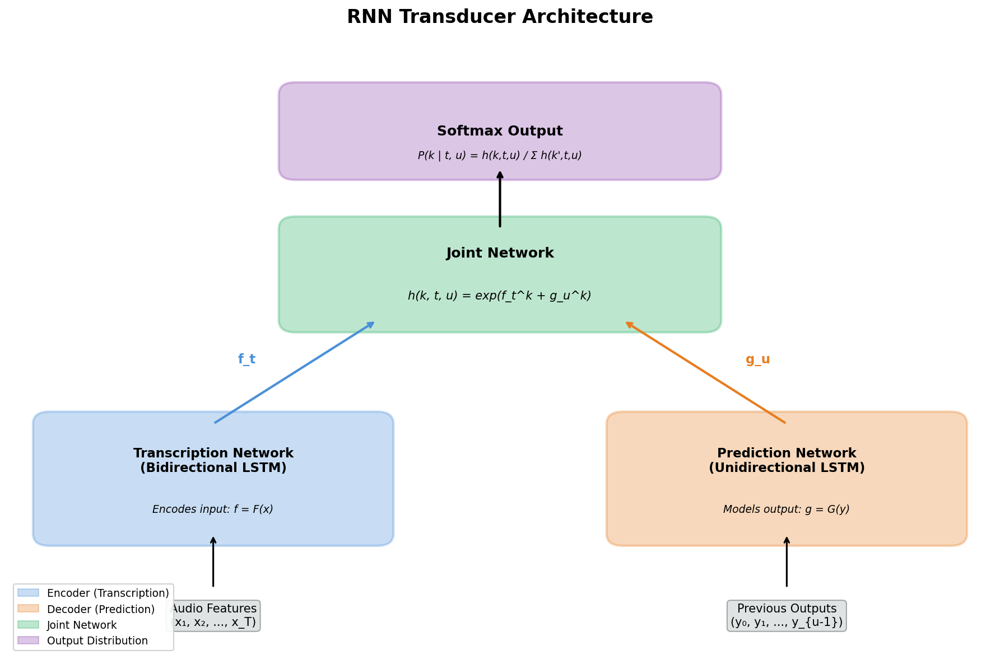
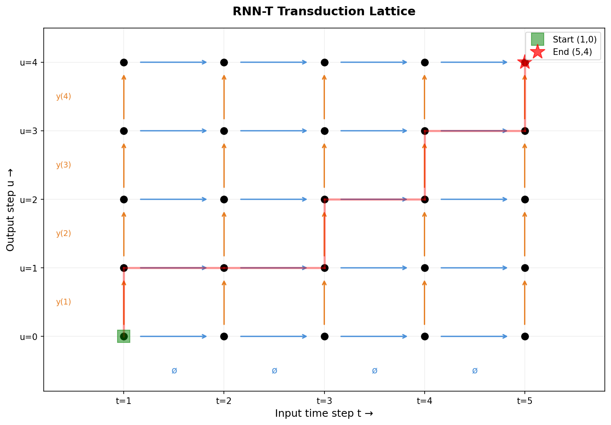

### RNN-T

```yaml
id: rnn_t
name: RNN-T
full_name: RNN Transducer
year: 2012
org: University of Toronto
paper_url: https://arxiv.org/abs/1211.3711
category: foundation
parent: —
motivation: 扩展CTC，引入输出间依赖建模，实现支持流式输出的序列转录
```

#### 📝 一句话总结

RNN Transducer 在 CTC 的基础上引入预测网络（Prediction Network）来建模输出标签之间的依赖关系，将序列转录问题分解为编码器（Transcription Network）、解码器（Prediction Network）和联合网络（Joint Network）三个组件，实现了端到端、支持流式的序列到序列转录。

#### 🎯 核心要点

- **三组件架构**：Transcription Network（双向 LSTM 编码器）+ Prediction Network（单向 LSTM 解码器）+ Joint Network，三者协同完成序列转录
- **对 CTC 的关键扩展**：CTC 假设输出标签条件独立，RNN-T 通过 Prediction Network 显式建模输出间依赖，显著提升性能
- **转导格（Transduction Lattice）**：在 \(T \times (U+1)\) 的格点上定义所有可能的对齐路径，水平移动对应消耗输入（输出 ∅），垂直移动对应发射标签
- **联合网络设计**：\(h(k, t, u) = \exp(f_t^k + g_u^k)\)，将编码器和解码器的输出通过加法耦合后 softmax 归一化
- **前向-后向算法训练**：利用动态规划在格点上高效计算所有对齐路径的边际概率之和，实现精确的最大似然训练
- **Beam Search 解码**：在推理时使用宽度受限的束搜索，通过缓存 LSTM 隐状态加速计算
- **实验验证**：在 TIMIT 音素识别任务上，RNN-T 达到 20.4% PER，显著优于单独的 CTC（23.0%）和单独的预测网络（45.9%）

#### 🔬 深入细节

##### 模型架构总览


*图：RNN Transducer 的三组件架构——Transcription Network 编码输入序列，Prediction Network 建模已输出标签的依赖，Joint Network 融合两者产生输出分布。*


*图：转导格（Transduction Lattice）示意。每个格点 \((t, u)\) 代表已消耗 \(t\) 个输入帧、已输出 \(u\) 个标签的状态。水平箭头表示输出空白符 ∅（前进输入），垂直箭头表示发射标签。红色路径为一条可能的对齐。*

##### 算法伪代码

```python
# RNN Transducer 前向算法伪代码
def forward_algorithm(x, y, F, G, joint):
    """
    x: 输入序列, 长度 T
    y: 目标输出序列, 长度 U
    F: Transcription Network (encoder)
    G: Prediction Network (decoder)
    joint: Joint Network
    """
    T, U = len(x), len(y)
    
    # Step 1: 编码器前向传播（可并行处理整个输入序列）
    f = F(x)                    # f[t] for t = 1..T, 维度 K+1
    
    # Step 2: 解码器前向传播（自回归，依赖已输出标签）
    g = G(y)                    # g[u] for u = 0..U, 维度 K+1
    
    # Step 3: 联合网络计算输出分布
    # 对每个格点 (t, u):
    #   h(k, t, u) = exp(f[t][k] + g[u][k])
    #   P(k | t, u) = h(k, t, u) / sum_k'(h(k', t, u))
    
    # Step 4: 前向变量计算（动态规划）
    alpha = zeros(T+1, U+1)     # α(t, u) = 所有到达 (t,u) 的路径概率之和
    alpha[1][0] = 1
    for t in range(1, T+1):
        for u in range(0, U+1):
            # 从左侧 (t-1, u) 通过输出 ∅ 到达
            if t > 1:
                alpha[t][u] += alpha[t-1][u] * P(null | t-1, u)
            # 从下方 (t, u-1) 通过输出 y[u] 到达
            if u > 0:
                alpha[t][u] += alpha[t][u-1] * P(y[u] | t, u-1)
    
    # Step 5: 序列概率 = α(T, U) * P(∅ | T, U)
    loss = -log(alpha[T][U] * P(null | T, U))
    return loss
```

```python
# RNN Transducer Beam Search 解码伪代码
def beam_search(x, F, G, joint, beam_width=W):
    f = F(x)                            # 编码器输出
    B = {([], G.init_state(), 0.0)}     # (已输出序列, LSTM隐状态, log概率)
    
    for t in range(1, T+1):
        B_new = {}
        for (y_prefix, h_state, log_p) in B:
            g_u, h_new = G.step(y_prefix[-1], h_state)  # 预测网络单步
            probs = softmax(joint(f[t], g_u))            # 联合网络
            
            # 选项1: 输出 ∅，前进到下一个输入帧
            add_to(B_new, (y_prefix, h_new, log_p + log(probs[null])))
            
            # 选项2: 输出某个标签 k
            for k in top_k(probs, beam_width):
                if k != null:
                    add_to(B_new, (y_prefix + [k], h_new, log_p + log(probs[k])))
        
        B = top_W(B_new, beam_width)    # 保留概率最高的 W 条路径
    
    return best(B)
```

##### 动机与背景

序列到序列的转录（Sequence Transduction）是语音识别、手写识别等领域的核心问题。传统方法如 HMM 需要预定义状态拓扑和对齐，而端到端方法则试图直接从输入序列映射到输出序列。

**CTC 的局限性**：Graves 等人在 2006 年提出的 Connectionist Temporal Classification（CTC）是一种里程碑式的端到端方法，它通过引入空白符 ∅ 和多对一的对齐方式，解决了输入输出长度不等的问题。然而，CTC 有一个关键假设——**输出标签在给定输入的条件下是相互独立的**：

$$P(\mathbf{y} | \mathbf{x}) = \prod_{u=1}^{U} P(y_u | \mathbf{x})$$

这意味着 CTC 无法利用输出标签之间的上下文信息（例如语音识别中，知道前一个音素是 /k/ 会大大提高下一个音素是 /æ/ 的概率）。

**RNN-T 的解决方案**：RNN Transducer 通过引入一个独立的 Prediction Network 来显式建模输出序列的先验分布，从而打破了 CTC 的条件独立假设。这使得模型能够同时利用声学信息（来自编码器）和语言信息（来自解码器），类似于传统语音识别系统中声学模型与语言模型的结合，但以端到端的方式实现。

> 💡 **关键直觉**：RNN-T = CTC（处理输入-输出对齐）+ 语言模型（建模输出依赖），两者通过 Joint Network 无缝融合。

##### 核心机制详解

**1. Transcription Network（编码器）**

编码器 \(\mathcal{F}\) 将长度为 \(T\) 的输入序列 \(\mathbf{x} = (x_1, \ldots, x_T)\) 映射为等长的隐表示序列 \(\mathbf{f} = (f_1, \ldots, f_T)\)。论文中使用**双向 LSTM**，使得每个 \(f_t\) 能捕获整个输入序列的上下文信息：

$$f_t = \text{BiLSTM}(x_1, \ldots, x_T)[t]$$

编码器的输出 \(f_t \in \mathbb{R}^{K+1}\)，其中 \(K\) 是输出标签集大小（不含空白符），额外的一维对应空白符 ∅。

> ⚠️ **注意**：使用双向 LSTM 意味着编码器需要看到完整输入才能产生输出，这在离线场景下没有问题，但在流式场景中需要替换为单向或分块（chunk）结构。后续的流式 RNN-T 工作正是针对这一点进行改进。

**2. Prediction Network（解码器）**

解码器 \(\mathcal{G}\) 将已输出的标签序列 \(\hat{\mathbf{y}} = (y_0, y_1, \ldots, y_{u-1})\) 映射为预测向量 \(g_u\)，其中 \(y_0\) 是特殊的起始符号。论文使用**单向 LSTM**：

$$g_u = \text{LSTM}(y_0, y_1, \ldots, y_{u-1})[u]$$

解码器的输出 \(g_u \in \mathbb{R}^{K+1}\)，与编码器输出维度相同。

关键特性：
- 解码器**仅依赖之前的输出标签**，不接收任何输入序列的信息
- 这使其本质上是一个**条件语言模型**，独立学习输出序列的统计规律
- 在推理时，解码器可以增量式运行：每输出一个新标签，只需执行一步 LSTM 前向传播

**3. Joint Network（联合网络）**

Joint Network 是 RNN-T 最核心的创新。它将编码器和解码器的输出融合为一个联合概率分布。对于格点 \((t, u)\) 上的标签 \(k\)：

$$h(k, t, u) = \exp\left(f_t^k + g_u^k\right)$$

$$P(k \mid t, u) = \frac{h(k, t, u)}{\sum_{k'=0}^{K} h(k', t, u)}$$

其中 \(f_t^k\) 是编码器在时间步 \(t\) 的第 \(k\) 维输出，\(g_u^k\) 是解码器在输出步 \(u\) 的第 \(k\) 维输出。

> 💡 **设计直觉**：加法耦合 \(f_t^k + g_u^k\) 在 softmax 之前等价于对数域的乘法，即 \(P(k|t,u) \propto P_{\text{acoustic}}(k|t) \cdot P_{\text{language}}(k|u)\)。这与传统语音识别中声学得分和语言模型得分的对数线性插值异曲同工，但这里两个分量是联合训练的。

**4. 转导格（Transduction Lattice）与对齐**

RNN-T 的核心数据结构是一个 \(T \times (U+1)\) 的转导格。格点 \((t, u)\) 表示"已处理 \(t\) 个输入帧，已输出 \(u\) 个标签"的状态。从格点出发有两种转移：

- **水平移动** \((t, u) \to (t+1, u)\)：输出空白符 ∅，概率为 \(P(\varnothing \mid t, u)\)，表示"当前输入帧不产生新标签，前进到下一帧"
- **垂直移动** \((t, u) \to (t, u+1)\)：输出标签 \(y_{u+1}\)，概率为 \(P(y_{u+1} \mid t, u)\)，表示"在当前帧位置发射一个标签"

一条从 \((1, 0)\) 到 \((T, U)\) 的完整路径定义了一种输入-输出对齐方式。目标序列 \(\mathbf{y}\) 的总概率是所有有效路径概率之和：

$$P(\mathbf{y} \mid \mathbf{x}) = \sum_{\text{all valid paths}} \prod_{\text{transitions}} P(k \mid t, u)$$

##### 训练：前向-后向算法

直接枚举所有路径在计算上不可行（路径数量是指数级的）。RNN-T 使用类似 HMM 的前向-后向算法，通过动态规划高效计算。

**前向变量** \(\alpha(t, u)\) 定义为所有从 \((1, 0)\) 到 \((t, u)\) 的路径概率之和：

$$\alpha(t, u) = \alpha(t-1, u) \cdot P(\varnothing \mid t-1, u) + \alpha(t, u-1) \cdot P(y_u \mid t, u-1)$$

初始条件 \(\alpha(1, 0) = 1\)，最终概率为 \(P(\mathbf{y} \mid \mathbf{x}) = \alpha(T, U) \cdot P(\varnothing \mid T, U)\)。

**后向变量** \(\beta(t, u)\) 类似地从终点向起点递推。前向和后向变量结合后，可以计算每个格点上每个转移的后验概率，从而得到损失函数对网络参数的梯度。

训练损失为负对数似然：

$$\mathcal{L} = -\ln P(\mathbf{y} \mid \mathbf{x})$$

整个前向-后向计算的时间复杂度为 \(O(T \cdot U \cdot K)\)，空间复杂度为 \(O(T \cdot U)\)。

##### 推理：Beam Search

推理时无法使用前向-后向算法（因为目标序列未知），而是采用 Beam Search。核心思想是维护一个大小为 \(W\) 的候选集合，在每个输入时间步扩展候选并剪枝。

关键优化：由于 Prediction Network 的隐状态仅依赖已输出的标签序列，可以**缓存每个候选前缀的 LSTM 隐状态**。当候选扩展一个新标签时，只需从缓存的隐状态执行一步 LSTM 前向传播，避免了重复计算。

论文还引入了**长度归一化**，将路径的对数概率除以输出长度，防止短序列被系统性地偏好。

##### 与 CTC 及传统方法的对比

| 特性 | HMM | CTC | RNN-T |
|------|-----|-----|-------|
| 端到端训练 | ❌ | ✅ | ✅ |
| 输出依赖建模 | 通过语言模型（外部） | ❌（条件独立） | ✅（Prediction Network） |
| 需要预定义对齐 | ✅ | ❌ | ❌ |
| 流式推理潜力 | ✅ | ✅ | ✅（编码器需改为单向） |
| 联合声学+语言建模 | 分离式 | 仅声学 | 联合端到端 |

在 TIMIT 音素识别实验中：
- **CTC 单独**：23.0% PER（仅利用声学信息）
- **Prediction Network 单独**：45.9% 错误率（仅利用语言信息，相当于音素级语言模型）
- **RNN-T 联合**：20.4% PER（声学+语言信息融合，相对 CTC 降低 11.3%）

这一结果有力地证明了 Prediction Network 对输出依赖的建模能够为声学模型提供互补信息。

> 💡 **历史意义**：RNN-T 是现代端到端语音识别的奠基架构之一。Google 在 2019 年将其部署到手机端语音识别系统中，实现了首个完全在设备上运行的端到端语音识别模型。后续的 Transformer-Transducer、Conformer-Transducer 等工作均沿用了 RNN-T 的核心框架。

#### 🧪 练习题

```yaml
question: "RNN Transducer 相比 CTC 的核心改进是什么？"
options:
  - "使用了更深的编码器网络提升特征提取能力"
  - "引入 Prediction Network 建模输出标签间的依赖关系"
  - "采用注意力机制替代了固定的对齐方式"
  - "使用了更高效的束搜索解码算法"
answer: 1
explain: "RNN-T 的核心创新是在 CTC 框架上增加了 Prediction Network（类似语言模型），通过 Joint Network 将声学信息和语言信息融合，打破了 CTC 的输出条件独立假设。"
```